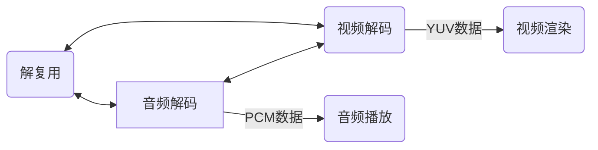

# FFmpeg学习笔记

#### 播放器架构：

```mermaid
flowchart LR
A(解复用) <--> B[音频解码]
A <--> C(视频解码)
B <--> C
B -->|PCM数据|D(音频播放)
C -->|YUV数据|E(视频渲染)
```

#### 渲染流程

```mermaid
flowchart LR
A(YUV) --> |渲染| B(纹理)
B --> |交换| C(窗口展示)
```

