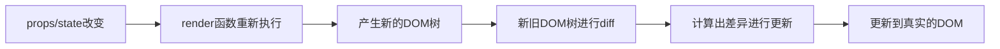

# React 学习笔记


## 官方文档阅读笔记


#### Quick Start

##### Creating and nesting components

<font color=dodgerBlue>Notice that `<MyButton />` starts with a capital letter</font>. That’s how you know it’s a React component. <font color=red>**React component names must always start with a capital letter**</font>, <font color=dodgerBlue>**while**</font> <font color=red>HTML tags must be lowercase</font>.

##### Writing markup with JSX

<font color=red>JSX is stricter than HTML</font>. You have to close tags like `<br />`. <font color=red>Your component also can’t return multiple JSX tags</font>. You have to wrap them into a shared parent, like a `<div>...</div>` <font color=red>or an empty `<>...</>` wrapper</font>:

```jsx
function AboutPage() {
  return (
    <>
      <h1>About</h1>
      <p>Hello there.<br />How do you do?</p>
    </>
  );
}
```

##### Rendering lists

```jsx
const listItems = products.map(product =>
  <li key={product.id}>
    {product.title}
  </li>
);

return (
  <ul>{listItems}</ul>
);
```

Notice how `<li>` has a `key` attribute. For each item in a list, you <font color=red>should pass a string or a number that **uniquely identifies** that item among its siblings</font>. Usually, a key should be coming from your data, such as a database ID. React uses your keys to know what happened if you later insert, delete, or reorder the items.

##### Responding to events

```jsx
function MyButton() {
  function handleClick() {
    alert('You clicked me!');
  }

  return (
    <button onClick={handleClick}>
      Click me
    </button>
  );
}
```

<font color=fuchsia>Notice how `onClick={handleClick}` has no parentheses at the end</font>! Do not *call* the event handler function: you only need to *pass it down*. React will call your event handler when the user clicks the button.

##### Updating the screen 

You’ll get two things from `useState`: the current state (`count`), and the function that lets you update it (`setCount`). You can give them any names, but the convention is to write `[something, setSomething]`.

The first time the button is displayed, `count` will be `0` because you passed `0` to `useState()`. When you want to change state, <font color=fuchsia>call `setCount()` and **pass the new value to it**</font>. Clicking this button will increment the counter:

```jsx
function MyButton() {
  const [count, setCount] = useState(0);

  function handleClick() {
    setCount(count + 1); // 👀
  }

  return (
    <button onClick={handleClick}>
      Clicked {count} times
    </button>
  );
}
```

> ⚠️ 值得注意的是：不可以直接修改 `count` 的值 ，比如 `setCount(count ++)` ，首先 count 是 const 定义的；另外，也是会报错的

##### Using Hooks

Functions starting with `use` are called *Hooks*. `useState` is a built-in Hook provided by React. <font color=lightSeaGreen>You can find other built-in Hooks in the [API reference](https://react.dev/reference/react)</font> . <font color=red>You can also write your own Hooks by combining the existing ones</font>.

<font color=red>**Hooks are more restrictive than other functions**</font>. You <font color=fuchsia>**can only**</font> <font color=red>call Hooks *at the top* of your components (or other Hooks)</font>. <font color=dodgerBlue>If you want to use `useState` in a condition or a loop</font>, <font color=fuchsia>**extract a new component and put it there**</font>.

摘自：[React doc - Quick Start](https://react.dev/learn)


#### Thinking in React

##### Step 1: Break the UI into a component hierarchy

Depending on your background, you can think about splitting up a design into components in different ways:

- **Programming**—use the same techniques for deciding if you should create a new function or object. <font color=red>One such technique is the **single responsibility principle**</font> , <font color=lightSeaGreen>that is, a component should ideally only do one thing</font>. If it ends up growing, it should be decomposed into smaller subcomponents.

  > 💡single responsibility principle 即 “单一职责原则”

- **CSS**—consider what you would make class selectors for. (However, components are a bit less granular.)

- **Design**—consider how you would organize the design’s layers.

##### Step 2: Build a static version in React

To build a static version of your app that renders your data model, you’ll want to build [components](https://react.dev/learn/your-first-component) that reuse other components and pass data using [props.](https://react.dev/learn/passing-props-to-a-component) <font color=dodgerBlue>**Props are a way of passing data from parent to child**</font>. (If you’re familiar with the concept of [state](https://react.dev/learn/state-a-components-memory), <font color=red>don’t use state at all to build this **static version**</font>. <font color=fuchsia>**State is reserved only for interactivity**</font>, that is, <font color=red>data that changes over time</font>. Since this is a static version of the app, you don’t need it.)

You can either build <font color=lightSeaGreen>**“top down”**</font> by starting with building the components higher up in the hierarchy (like `FilterableProductTable`) or <font color=lightSeaGreen>**“bottom up”**</font> by working from components lower down (like `ProductRow`). <font color=dodgerBlue>In simpler examples</font>, <font color=red>it’s usually easier to go top-down</font>, and <font color=dodgerBlue>on larger projects</font>, <font color=red>it’s easier to go bottom-up</font>.

> 👀 这里 “top down” 是自顶向下，“bottom up” 是自底向上

The component at the top of the hierarchy (`FilterableProductTable`) will take your data model as a prop. <font color=red>This is called ***one-way data flow*** because the data flows down from the top-level component to the ones at the bottom of the tree</font>.

##### Step 3: Find the minimal but complete representation of UI state

<font color=dodgerBlue>Which of these are state? **Identify the ones that are not**:</font>

- Does it <font color=red>**remain unchanged** over time</font>? If so, it <font color=lightSeaGreen>isn’t state</font>.
- Is it <font color=red>**passed in from a parent** via props</font>? If so, it <font color=lightSeaGreen>isn’t state</font>.
- **Can you <font color=red>compute it</font>** <font color=red>based on existing state or props in your component</font>? If so, it *definitely* <font color=lightSeaGreen>isn’t state</font>!

<font color=dodgerBlue>**What’s left is probably state.**</font>

###### Props vs State

There are two types of “model” data in React: props and state. <font color=dodgerBlue>The two are very different</font>:

- [**Props** are like arguments you pass](https://react.dev/learn/passing-props-to-a-component) to a function. They let a parent component pass data to a child component and customize its appearance. For example, a `Form` can pass a `color` prop to a `Button`.
- [**State** is like a component’s memory.](https://react.dev/learn/state-a-components-memory) It lets a component keep track of some information and change it in response to interactions. For example, a `Button` might keep track of `isHovered` state.

##### Step 4: Identify where your state should live

> 👀 这里的 “live” 是 “放置” 的意思

<font color=dodgerBlue>**For each piece of state in your application:**</font>

1. Identify *every* component that renders something based on that state.
2. Find their closest common parent component—a component above them all in the hierarchy.
3. Decide where the state should live:
   1. Often, you can put the state directly into their common parent.
   2. You can also put the state into some component above their common parent.
   3. If you can’t find a component where it makes sense to own the state, create a new component solely for holding the state and add it somewhere in the hierarchy above the common parent component.


#### Using TypeScript

Out of the box, TypeScript [supports JSX](https://react.dev/learn/writing-markup-with-jsx) and <font color=lightSeaGreen>you can get full React Web support by adding `@types/react` and `@types/react-dom` to your project</font>.

###### Adding TypeScript to an existing React project

To install the latest version of React’s type definitions:

```sh
npm install @types/react @types/react-dom
```

<font color=dodgerBlue>**The following compiler options need to be set in your `tsconfig.json`:**</font>

1. <font color=red>`dom` must be included in [`lib`](https://www.typescriptlang.org/tsconfig/#lib)</font> (Note: If no `lib` option is specified, `dom` is included by default).

   > 👀 这里的 `lib` 是 `tsconfig.json` 中的字段

2. [`jsx`](https://www.typescriptlang.org/tsconfig/#jsx) must be set to one of the valid options. `preserve` should suffice for most applications. If you’re publishing a library, consult the [`jsx` documentation](https://www.typescriptlang.org/tsconfig/#jsx) on what value to choose.

##### TypeScript with React Components

> 💡 Note
>
> Every file containing JSX <font color=red>must use the `.tsx` file extension</font>. This is a TypeScript-specific extension that tells TypeScript that this file contains JSX.

Taking the [`MyButton` component](https://react.dev/learn#components) from the [Quick Start](https://react.dev/learn) guide, we can add a type describing the `title` for the button:

```tsx
/* App.tsx */
function MyButton({ title }: { title: string }) { // 👀
  return (
    <button>{title}</button>
  );
}

export default function MyApp() {
  return (
    <div>
      <h1>Welcome to my app</h1>
      <MyButton title="I'm a button" />
    </div>
  );
}
```

The type describing your component’s props can be as simple or as complex as you need, <font color=red>though they should be an object type described with either a `type` or `interface`.</font>

##### Example Hooks

The type definitions from `@types/react` include types for the built-in hooks, so <font color=red>you can use them in your components without any additional setup</font>. They are built to take into account the code you write in your component, so you will get [inferred types](https://www.typescriptlang.org/docs/handbook/type-inference.html) a lot of the time and ideally do not need to handle the minutiae of providing the types.

###### `useState`

The [`useState` hook](https://react.dev/reference/react/useState) will <font color=lightSeaGreen>re-use the value passed in</font> <font color=red>as the initial state to **determine what the type of the value should be**</font>. For example:

```tsx
// Infer the type as "boolean"
const [enabled, setEnabled] = useState(false);
```

Will assign the type of `boolean` to `enabled`, and <font color=red>`setEnabled` will be a function accepting either a `boolean` argument, **or a function that returns a `boolean`**</font>. <font color=dodgerBlue>If you want to explicitly provide a type for the state</font>, you can do so by providing a type argument to the `useState` call:

```tsx
// Explicitly set the type to "boolean"
const [enabled, setEnabled] = useState<boolean>(false);
```

<font color=lightSeaGreen>This isn’t very useful **in this case**</font>, but <font color=red>a common case where you may want to provide a type is when you **have a union type**</font>. For example, `status` here can be one of a few different strings:

```tsx
type Status = "idle" | "loading" | "success" | "error";

const [status, setStatus] = useState<Status>("idle");
```

Or, as recommended in [Principles for structuring state](https://react.dev/learn/choosing-the-state-structure#principles-for-structuring-state), you can group related state as an object and describe the different possibilities via object types:

```tsx
type RequestState =
  | { status: 'idle' }
  | { status: 'loading' }
  | { status: 'success', data: any }
  | { status: 'error', error: Error };

const [requestState, setRequestState] = useState<RequestState>({ status: 'idle' });
```

###### `useReducer`

The [`useReducer` hook](https://react.dev/reference/react/useReducer) is a more complex hook that <font color=red>takes a reducer function and an initial state</font>. The types for the reducer function are inferred from the initial state. <font color=lightSeaGreen>You can optionally provide a type argument to the `useReducer` call to provide a type for the state</font>, but it is often better to set the type on the initial state instead:

```tsx
import {useReducer} from 'react';

interface State {
   count: number 
};

type CounterAction =
  | { type: "reset" }
  | { type: "setCount"; value: State["count"] }

const initialState: State = { count: 0 };

function stateReducer(state: State, action: CounterAction): State {
  switch (action.type) {
    case "reset":
      return initialState;
    case "setCount":
      return { ...state, count: action.value };
    default:
      throw new Error("Unknown action");
  }
}

export default function App() {
  const [state, dispatch] = useReducer(stateReducer, initialState);

  const addFive = () => dispatch({ type: "setCount", value: state.count + 5 });
  const reset = () => dispatch({ type: "reset" });

  return (
    <div>
      <h1>Welcome to my counter</h1>

      <p>Count: {state.count}</p>
      <button onClick={addFive}>Add 5</button>
      <button onClick={reset}>Reset</button>
    </div>
  );
}
```

We are using TypeScript in a few key places:

- `interface State` describes the shape of the reducer’s state.
- `type CounterAction` describes the different actions which can be dispatched to the reducer.
- `const initialState: State` provides a type for the initial state, and also the type which is used by `useReducer` by default.
- `stateReducer(state: State, action: CounterAction): State` sets the types for the reducer function’s arguments and return value.

A more explicit alternative to setting the type on `initialState` is to provide a type argument to `useReducer`:

```tsx
import { stateReducer, State } from './your-reducer-implementation';

const initialState = { count: 0 };

export default function App() {
  const [state, dispatch] = useReducer<State>(stateReducer, initialState);
}
```

###### `useContext`

The [`useContext` hook](https://react.dev/reference/react/useContext) is a technique for <font color=red>passing data down the component tree **without having to pass props through components**</font>. It is used by <font color=red>creating a **provider component**</font> （👀 见下面的 `<ThemeContext.Provider>` ）and <font color=dodgerBlue>**often**</font> <font color=lightSeaGreen>by creating a hook to consume the value in a child component</font>.

The type of the value provided by the context is inferred from the value passed to the `createContext` call:

```tsx
import { createContext, useContext, useState } from 'react';

type Theme = "light" | "dark" | "system";
const ThemeContext = createContext<Theme>("system");

const useGetTheme = () => useContext(ThemeContext);

export default function MyApp() {
  const [theme, setTheme] = useState<Theme>('light');

  return (
    <ThemeContext.Provider value={theme}>
      <MyComponent />
    </ThemeContext.Provider>
  )
}

function MyComponent() {
  const theme = useGetTheme();

  return (
    <div>
      <p>Current theme: {theme}</p>
    </div>
  )
}
```

This technique works when you have an default value which makes sense - <font color=dodgerBlue>but there are occasionally cases when you do not</font>, and <font color=red>in those cases `null` can feel reasonable as a default value</font>. However, <font color=dodgerBlue>**to allow the type-system to understand your code**</font>, you <font color=red>need to explicitly **set `ContextShape | null` on the `createContext`**</font>.

<font color=dodgerBlue>This causes the issue that you **need to eliminate the `| null` in the type for context consumers**</font>. Our recommendation is to have the hook do a runtime check for it’s existence and throw an error when not present:

```jsx
import { createContext, useContext, useState, useMemo } from 'react';

// This is a simpler example, but you can imagine a more complex object here
type ComplexObject = {
  kind: string
};

// The context is created with `| null` in the type, to accurately reflect the default value.
const Context = createContext<ComplexObject | null>(null);

// The `| null` will be removed via the check in the hook.
const useGetComplexObject = () => {
  const object = useContext(Context);
  if (!object) { throw new Error("useGetComplexObject must be used within a Provider") }
  return object;
}

export default function MyApp() {
  const object = useMemo(() => ({ kind: "complex" }), []);

  return (
    <Context.Provider value={object}>
      <MyComponent />
    </Context.Provider>
  )
}

function MyComponent() {
  const object = useGetComplexObject();

  return (
    <div>
      <p>Current object: {object.kind}</p>
    </div>
  )
}
```

###### `useMemo`

The [`useMemo`](https://react.dev/reference/react/useMemo) hooks will <font color=red>create/re-access a memorized value from a function call</font>, <font color=dodgerBlue>re-running the function only when</font> <font color=red>dependencies passed as the 2nd parameter are changed</font>. The result of calling the hook is inferred from the return value from the function in the first parameter. You can be more explicit by providing a type argument to the hook.

```jsx
// The type of visibleTodos is inferred from the return value of filterTodos
const visibleTodos = useMemo(() => filterTodos(todos, tab), [todos, tab]);
```

> 💡 除了减少计算外，也可以减少 render 的次数

###### `useCallback`

The [`useCallback`](https://react.dev/reference/react/useCallback) <font color=red>provide a stable reference to a function **as long as the dependencies passed into the second parameter are the same**</font>. <font color=dodgerBlue>Like `useMemo`</font>, the function’s type is inferred from the return value of the function in the first parameter, and you can be more explicit by providing a type argument to the hook.

```jsx
const handleClick = useCallback(() => {
  // ...
}, [todos]);
```

<font color=dodgerBlue>When working in TypeScript **strict mode**</font> `useCallback` <font color=red>requires adding types for the parameters in your callback</font>. This is because the type of the callback is inferred from the return value of the function, and without parameters the type cannot be fully understood.

Depending on your code-style preferences, you could use the `*EventHandler` functions from the React types to provide the type for the event handler at the same time as defining the callback:

```jsx
import { useState, useCallback } from 'react';

export default function Form() {
  const [value, setValue] = useState("Change me");

  const handleChange = useCallback<React.ChangeEventHandler<HTMLInputElement>>((event) => {
    setValue(event.currentTarget.value);
  }, [setValue])
  
  return (
    <>
      <input value={value} onChange={handleChange} />
      <p>Value: {value}</p>
    </>
  );
}
```

##### Useful Types

There is quite an expansive set of types which come from the `@types/react` package, it is worth a read when you feel comfortable with how React and TypeScript interact. You can find them [in React’s folder in DefinitelyTyped](https://github.com/DefinitelyTyped/DefinitelyTyped/blob/master/types/react/index.d.ts). We will cover a few of the more common types here.

###### DOM Events 

When working with DOM events in React, the type of the event can often be inferred from the event handler. However, <font color=dodgerBlue>when you want to extract a function to be passed to an event handler</font>, you will need to explicitly set the type of the event.

```jsx
import { useState } from 'react';

export default function Form() {
  const [value, setValue] = useState("Change me");

  function handleChange(event: React.ChangeEvent<HTMLInputElement>) { {/*👀*/}
    setValue(event.currentTarget.value);
  }

  return (
    <>
      <input value={value} onChange={handleChange} />
      <p>Value: {value}</p>
    </>
  );
}
```

There are many types of events provided in the React types - the full list can be found [here](https://github.com/DefinitelyTyped/DefinitelyTyped/blob/b580df54c0819ec9df62b0835a315dd48b8594a9/types/react/index.d.ts#L1247C1-L1373) which is based on the [most popular events from the DOM](https://developer.mozilla.org/en-US/docs/Web/Events).

<font color=dodgerBlue>If you need to use an event that is **not included in this list**</font>, you <font color=red>can use the `React.SyntheticEvent` type</font>, <font color=red>**which is the base type for all events**</font>.

###### Children

<font color=lightSeaGreen>There are two common paths to describing the children of a component</font>. <font color=dodgerBlue>The first</font> is to <font color=red>**use the `React.ReactNode` type**</font>, which <font color=red>is **a union of all the possible types** that can be passed as children in JSX</font>:

```tsx
interface ModalRendererProps {
  title: string;
  children: React.ReactNode;
}
```

This is a very broad definition of children. <font color=dodgerBlue>The second</font> is to <font color=red>use the `React.ReactElement` type</font>, which is <font color=red>only JSX elements and not JavaScript primitives like strings or numbers</font>:

```tsx
interface ModalRendererProps {
  title: string;
  children: React.ReactElement;
}
```

Note, that <font color=red>you cannot use TypeScript to describe that the children are a certain type of JSX elements</font>, so you cannot use the type-system to describe a component which only accepts `<li>` children.

You can see all an example of both `React.ReactNode` and `React.ReactElement` with the type-checker in [this TypeScript playground](https://www.typescriptlang.org/play?#code/JYWwDg9gTgLgBAJQKYEMDG8BmUIjgIilQ3wChSB6CxYmAOmXRgDkIATJOdNJMGAZzgwAFpxAR+8YADswAVwGkZMJFEzpOjDKw4AFHGEEBvUnDhphwADZsi0gFw0mDWjqQBuUgF9yaCNMlENzgAXjgACjADfkctFnYkfQhDAEpQgD44AB42YAA3dKMo5P46C2tbJGkvLIpcgt9-QLi3AEEwMFCItJDMrPTTbIQ3dKywdIB5aU4kKyQQKpha8drhhIGzLLWODbNs3b3s8YAxKBQAcwXpAThMaGWDvbH0gFloGbmrgQfBzYpd1YjQZbEYARkB6zMwO2SHSAAlZlYIBCdtCRkZpHIrFYahQYQD8UYYFA5EhcfjyGYqHAXnJAsIUHlOOUbHYhMIIHJzsI0Qk4P9SLUBuRqXEXEwAKKfRZcNA8PiCfxWACecAAUgBlAAacFm80W-CU11U6h4TgwUv11yShjgJjMLMqDnN9Dilq+nh8pD8AXgCHdMrCkWisVoAet0R6fXqhWKhjKllZVVxMcavpd4Zg7U6Qaj+2hmdG4zeRF10uu-Aeq0LBfLMEe-V+T2L7zLVu+FBWLdLeq+lc7DYFf39deFVOotMCACNOCh1dq219a+30uC8YWoZsRyuEdjkevR8uvoVMdjyTWt4WiSSydXD4NqZP4AymeZE072ZzuUeZQKheQgA).

###### Style Props

<font color=dodgerBlue>When using inline styles in React</font>, you <font color=red>can use `React.CSSProperties`</font> to describe the object passed to the `style` prop. <font color=red>**This type is a union of all the possible CSS properties**</font>, and <font color=red>is a good way to ensure you are passing valid CSS properties to the `style` prop, and to get auto-complete in your editor</font>.

```tsx
interface MyComponentProps {
  style: React.CSSProperties;
}
```


### Describing the UI


#### Your First Component

##### Defining a component 

Traditionally when creating web pages, web developers marked up their content and then added interaction by sprinkling on some JavaScript. This worked great when interaction was a nice-to-have on the web. Now it is expected for many sites and all apps. <font color=dodgerBlue>React puts interactivity first while still using the same technology</font>: <font color=red>**a React component is a JavaScript function that you can *sprinkle with markup*.**</font> Here’s what that looks like (you can edit the example below):

```react
export default function Profile() {
  return (
    
  )
}
```

> ⚠️ Pitfall
>
> React components are regular JavaScript functions, but <font color=fuchsia>**their names must start with a capital letter** or they won’t work!</font>

<font color=dodgerBlue>**And here’s how to build a component:**</font>

<font color=red>Return statements **can** be written all on one line</font>, as in this component:

```react
return ;
```

But <font color=dodgerBlue>if your markup **isn’t all on the same line** as the `return` keyword</font>, you <font color=red>**must wrap it in a pair of parentheses**</font>:

```react
return (
  <div>
    
  </div>
);
```

> ⚠️ Pitfall
>
> Without parentheses, any code on the lines after `return` [will be ignored](https://stackoverflow.com/questions/2846283/what-are-the-rules-for-javascripts-automatic-semicolon-insertion-asi)!

##### Using a component

```react
function Profile() {
  return (
    
  );
}

export default function Gallery() {
  return (
    <section>
      <h1>Amazing scientists</h1>
      <Profile />
      <Profile />
      <Profile />
    </section>
  );
}
```

###### What the browser sees

<font color=dodgerBlue>Notice the difference in casing:</font>

- `<section>` is lowercase, so React knows we refer to an HTML tag.
- `<Profile />` starts with a capital `P`, so React knows that we want to use our component called `Profile`.


#### Writing Markup with JSX

*JSX* is a syntax extension for JavaScript that lets you write HTML-like markup inside a JavaScript file. <font color=lightSeaGreen>Although there are other ways to write components</font>, <font color=red>most React developers prefer the conciseness of JSX, and most codebases use it</font>.

> 💡 关于 jsx 和 js
>
> > `.jsx` 表示这是一个 JavaScript XML 文件
> >
> > JavaScript 是能够被浏览器直接识别的，JavaScript XML 需要经过编译器（webpack 等 👀 babel ）转换成 JavaScript
> >
> > **但<font color=red>在正常使用上，两者没有什么区别</font>，<font color=fuchsia>`.js` 的语法和`.jsx` 的后缀可以互换，语法上也完全兼容</font>**
> >
> > `.ts` 的文件，内容上不支持 `<div>` 这种HTML语法，会报错，而且 VS Code 这类代码编辑器也不会提供相关代码提示和补全的功能。反之， `.tsx` 的文件，在遵循TypeScript的基础上，支持 JSX 语法。
> >
> > 所以我们在使用时，辅助的函数文件使用 `.ts` 即可；React 组件方面，还是必须使用`.tsx`
> >
> > 摘自：[JS 和 JSX 、TS 和 TSX 的区别](https://zhuanlan.zhihu.com/p/625039917)

##### JSX: Putting markup into JavaScript

<font color=red>Keeping a button’s rendering logic and markup together ensures that they stay in sync with each other on every edit</font>. Conversely, details that are unrelated, such as the button’s markup and a sidebar’s markup, <font color=lightSeaGreen>are isolated from each other</font>, <font color=red>making it safer to change either of them on their own</font>.

Each React component is a JavaScript function that may contain some markup that React renders into the browser. <font color=lightSeaGreen>React components use a syntax extension called JSX to represent that markup</font>. JSX looks a lot like HTML, but <font color=red>it is a bit stricter and can display dynamic information</font>. The best way to understand this is to convert some HTML markup to JSX markup.

> 💡 Note
>
> <font color=dodgerBlue>JSX and React are two separate things</font>. They’re often used together, but you *can* [use them independently](https://reactjs.org/blog/2020/09/22/introducing-the-new-jsx-transform.html#whats-a-jsx-transform) of each other. <font color=lightSeaGreen>**JSX is a syntax extension, while React is a JavaScript library**</font>.

##### The Rules of JSX

###### 1. Return a single root element

To return multiple elements from a component, **wrap them with a single parent tag.**

you can use a `<div>` , <font color=dodgerBlue>If you don’t want to add an extra `<div>` to your markup</font>, you can <font color=lightSeaGreen>write `<>` and `</>` instead</font>.

This empty tag is called a [Fragment](https://react.dev/reference/react/Fragment) . <font color=red>Fragments let you group things without leaving any trace in the browser HTML tree</font>.

> 💡 **Why do multiple JSX tags need to be wrapped?**
>
> <font color=dodgerBlue>JSX looks like HTML</font>, but <font color=fuchsia>under the hood it is **transformed into plain JavaScript objects**</font>. You can’t return two objects from a function without wrapping them into an array. This explains why you also can’t return two JSX tags without wrapping them into another tag or a Fragment.

##### 2. Close all the tags

JSX requires tags to be explicitly closed: self-closing tags like `` must become ``

##### 3. camelCase ~~all~~ most of the things!

<font color=red>JSX turns into JavaScript and attributes written in JSX **become keys of JavaScript objects**</font>. In your own components, you will often want to read those attributes into variables. But <font color=lightSeaGreen>JavaScript has limitations on variable names</font>. For example, their names can’t contain dashes or be reserved words like `class`.

This is why, in React, many HTML and SVG attributes are written in camelCase. For example, <font color=red>instead of `stroke-width` you use `strokeWidth`</font>. <font color=fuchsia>Since `class` is a reserved word</font>, in React you write `className` instead, named after the [corresponding DOM property](https://developer.mozilla.org/en-US/docs/Web/API/Element/className)

> 👀 因为 jsx 最后会转变为 js obj ，所以 jsx 中的 attr 也会变成 obj 中的属性；也正因此：因为 `class` 是 js 中的保留字，无法使用它作为一个变量/对象属性，所以使用 `className` 替代

You can [find all these attributes in the list of DOM component props.](https://react.dev/reference/react-dom/components/common) If you get one wrong, don’t worry—React will print a message with a possible correction to the [browser console.](https://developer.mozilla.org/docs/Tools/Browser_Console)

> ⚠️ Pitfall
>
> For historical reasons, <font color=red>`aria-*` and **`data-*`** attributes are written as in HTML with dashes</font>.


#### JavaScript in JSX with Curly Braces

##### Using curly braces: A window into the JavaScript world

JSX is a special way of writing JavaScript. That means it’s possible to <font color=red>**use JavaScript inside it**—with curly braces `{ }`</font>. The example below first declares a name for the scientist, `name`, then embeds it with curly braces inside the `<h1>` :

> 👀 上面说的是：可以在 `{}` 中使用 js，不过，没有说使用 js 中的什么；可以参考下 [[#JavaScript in JSX with Curly Braces#Recap]]
>
> 就下面的示例试了下，下面的示例初始只有 `<h1>{name}'s To Do List</h1>` ，这和 Vue template 插值表达式没什么差别；又试了一下 `{}` 中加入模版字符串，也是同样的效果


###### Where to use curly braces 

You can only use curly braces in two ways inside JSX:

1. **As text** directly inside a JSX tag: `<h1>{name}'s To Do List</h1>` works, but <font color=red>`<{tag}>Gregorio Y. Zara's To Do List</{tag}>` will not</font>.
2. **As attributes** immediately following the `=` sign: `src={avatar}` will read the `avatar` variable, but `src="{avatar}"` will pass the string `"{avatar}"` .

##### Using “double curlies”: CSS and other objects in JSX

<font color=dodgerBlue>In addition to strings, numbers, and other JavaScript expressions</font>, you <font color=red>can even pass objects in JSX</font>. Objects are also denoted with curly braces, like `{ name: "Hedy Lamarr", inventions: 5 }`. Therefore, to pass a JS object in JSX, you <font color=red>**must wrap the object in another pair of curly braces: `person={{ name: "Hedy Lamarr", inventions: 5 }}`**</font>.

You may see this with inline CSS styles in JSX. React does not require you to use inline styles (CSS classes work great for most cases). But <font color=lightSeaGreen>when you need an inline style, you **pass an object to the `style` attribute**</font>:

```jsx
export default function TodoList() {
  return (
    <ul style={{
      backgroundColor: 'black',
      color: 'pink'
    }}>
      <li>Improve the videophone</li>
      <li>Prepare aeronautics lectures</li>
      <li>Work on the alcohol-fuelled engine</li>
    </ul>
  );
}
```

You can really see the JavaScript object inside the curly braces when you write it like this:

```jsx
<ul style={
  {
    backgroundColor: 'black',
    color: 'pink'
  }
}>
```

> ⚠️ Pitfall
>
> Inline `style` properties are written in camelCase. For example, HTML `<ul style="background-color: black">` would be written as `<ul style={{ backgroundColor: 'black' }}>`  in your component.

##### Recap

<font color=dodgerBlue>Now you know almost everything about JSX:</font>

- JSX attributes inside quotes are passed as strings.
- Curly braces let you <font color=red>**bring JavaScript logic and variables into your markup**</font>.
- They work inside the JSX tag content or immediately after `=` in attributes.
- `{{` and `}}` is not special syntax: it’s a JavaScript object tucked inside JSX curly braces.


#### Passing Props to a Component

##### Specifying a default value for a prop

If you want to <font color=lightSeaGreen>give a prop a default value to fall back on when no value is specified</font>, you can do it with the destructuring by putting `=` and the default value right after the parameter:

```react
function Avatar({ person, size = 100 }) {
  // ...
}
```

Now, if `<Avatar person={...} />` is rendered with no `size` prop, the `size` will be set to `100`.

The default value is only used if the `size` prop is missing or if you pass `size={undefined}`. But <font color=lightSeaGreen>if you pass `size={null}` or `size={0}`, the default value will **not** be used</font>.

##### Forwarding props with the JSX spread syntax 

Sometimes, passing props gets very repetitive:

```jsx
function Profile({ person, size, isSepia, thickBorder }) {
  return (
    <div className="card">
      <Avatar
        person={person}
        size={size}
        isSepia={isSepia}
        thickBorder={thickBorder}
      />
    </div>
  );
}
```

There’s nothing wrong with repetitive code—<font color=lightSeaGreen>it can be more legible</font>. But at times you may value （👀 重视）conciseness. Some components forward（👀 转发） all of their props to their children, like how this `Profile` does with `Avatar`. <font color=dodgerBlue>**Because they don’t use any of their props directly**</font>, it <font color=red>can make sense to use a more concise “spread” syntax</font>:

```jsx
function Profile(props) {
  return (
    <div className="card">
      <Avatar {...props} /> {/* 👀 */}
    </div>
  );
}
```

> 👀 这样的写法有点类似于 Vue 中的 `v-bind="propObj"`

This forwards all of `Profile`’s props to the `Avatar` <font color=lightSeaGreen>without listing each of their names</font>.

<font color=red>**Use spread syntax with restraint.**</font> If you’re using it in every other component, something is wrong. Often, it indicates that you should split your components and pass children as JSX.

> 👀 如上面所说 “Use spread syntax with restraint” ，确实有必要克制使用。
>
> 个人感觉：首先，这相当于无脑地将对象所有的属性传给了子组件；有些时候，这是比较危险的；毕竟没有做好应该暴露哪些成员的设置，这个数据暴露的“粒度”有些大。其次，这也牺牲了代码的可读性，开发者不知道自己传递了什么给子组件

##### Passing JSX as children

> 👀 感觉可以简单理解为插槽，虽然只能传递一个 child；这和 Vue 或者 webComponent 的 slot 定义还是有较大区别

When you nest content inside a JSX tag, the parent component will receive that content in a prop called `children`. For example, the `Card` component below will receive a `children` prop set to `<Avatar />` and render it in a wrapper div:

```jsx
import Avatar from './Avatar.js';

function Card({ children }) { { /* ⚠️ 注意：这里的 children 是要设置的！不要忘了*/}
  return (
    <div className="card">
      {children}
    </div>
  );
}

export default function Profile() {
  return (
    <Card>
      { /* 👀  */ }
      <Avatar
        size={100}
        person={{ 
          name: 'Katsuko Saruhashi',
          imageId: 'YfeOqp2'
        }}
      />
    </Card>
  );
}
```

> 👀 这里省去 Avatar.js 和 utils.js 的定义，这并不影响理解

Try replacing the `<Avatar>` inside `<Card>` with some text to see how the <font color=lightSeaGreen>`Card` component can wrap any nested content</font>. <font color=red>**It doesn’t need to “know” what’s being rendered inside of it**</font>. You will see this flexible pattern in many places.

You can think of <font color=fuchsia>a component with a `children` prop as having a “hole” that can be “filled in” by its parent components with arbitrary JSX</font>. You will often use the `children` prop for visual wrappers: panels, grids, etc.


##### How props change over time

The `Clock` component below receives two props from its parent component: `color` and `time`. (The parent component’s code is omitted because it uses [state](https://react.dev/learn/state-a-components-memory), which we won’t dive into just yet.)


This example illustrates that **a component <font color=red>may receive different props over time</font>.** <font color=fuchsia>Props are not always static!</font> Here, the <font color=lightSeaGreen>`time` prop changes every second</font>, and the <font color=lightSeaGreen>`color` prop changes when you select another color</font>. Props reflect a component’s data at any point in time, rather than only in the beginning.

However, <font color=fuchsia>**props are [immutable](https://en.wikipedia.org/wiki/Immutable_object)** — a term from computer science meaning “unchangeable”</font>. <font color=dodgerBlue>**When a component needs to change its props**</font> (for example, in response to a user interaction or new data), <font color=fuchsia>**it will have to “ask” its parent component to pass it *different props*—a new object**!</font> Its old props will then be cast aside, and eventually the JavaScript engine will reclaim the memory taken by them.

<font color=fuchsia>**Don’t try to “change props”.**</font> <font color=dodgerBlue>When you need to respond to the user input</font> (like changing the selected color), you will <font color=red>need to “set state”</font>, which you can learn about in [State: A Component’s Memory.](https://react.dev/learn/state-a-components-memory)

##### Recap

- To pass props, add them to the JSX, just like you would with HTML attributes.
- To read props, use the `function Avatar({ person, size })` destructuring syntax.
- You can specify a default value like `size = 100`, which is used for missing and `undefined` props.
- You can forward all props with `<Avatar {...props} />` JSX spread syntax, but don’t overuse it!
- Nested JSX like `<Card><Avatar /></Card>` will appear as `Card` component’s `children` prop.
- Props are read-only snapshots in time: every render receives a new version of props.
- You can’t change props. When you need interactivity, you’ll need to set state.


#### Conditional Rendering

Your components will often need to display different things depending on different conditions. In React, <font color=lightSeaGreen>you can conditionally render JSX using JavaScript syntax like `if` statements, `&&`, and `? :` operators</font>.

##### Conditionally returning nothing with `null`

<font color=dodgerBlue>In some situations, you won’t want to render anything at all</font>. For example, say you don’t want to show packed items at all. <font color=fuchsia>**A component must return something**</font>. In this case, you can return `null`:

> 👀 一个组件的“工厂函数”必须要有返回内容，如果确实没有，返回 `null`

```jsx
if (isPacked) {
  return null;
}
return <li className="item">{name}</li>;
```

If `isPacked` is true, the component will return nothing, `null`. Otherwise, it will return JSX to render.

In practice, <font color=red>**returning `null` from a component isn’t common**</font> because it might surprise a developer trying to render it. <font color=dodgerBlue>**More often**</font>, you would <font color=fuchisa>**conditionally include or exclude the component in the parent component’s JSX**</font>.

##### Conditional (ternary) operator (`? :`)

```jsx
if (isPacked) {
  return <li className="item">{name} ✔</li>;
}
return <li className="item">{name}</li>;
```

You can write this:

```jsx
return (
  <li className="item">
    {isPacked ? name + ' ✔' : name}
  </li>
);
```

###### Are these two examples fully equivalent?

<font color=dodgerBlue>If you’re coming from an object-oriented programming background</font>, you might assume that the two examples above are subtly different because one of them may create two different “instances” of `<li>`. But <font color=fuchsia>JSX elements aren’t “instances”</font> <font color=red>because they don’t hold any internal state and aren’t real DOM nodes</font>. They’re lightweight descriptions, like blueprints. <font color=fuchsia>So these two examples, in fact, *are* **completely equivalent**</font>. [Preserving and Resetting State](https://react.dev/learn/preserving-and-resetting-state) goes into detail about how this works.

##### Logical AND operator (`&&`)

<font color=dodgerBlue>Another common shortcut</font> you’ll encounter is the JavaScript logical AND (`&&`) operator. Inside React components, it often comes up when you want to render some JSX when the condition is true, **or render nothing otherwise.** With `&&`, you could conditionally render the checkmark only if `isPacked` is `true`:

```jsx
return (
  <li className="item">
    {name} {isPacked && '✔'}
  </li>
);
```

You can read this as *“if `isPacked`, then (`&&`) render the checkmark, otherwise, render nothing”*.

> 👀 就这里的代码，感觉使用 `&&` 是一种更简洁的写法

A JavaScript && expression <font color=red>**returns the value of its right side**</font> (in our case, the checkmark) <font color=dodgerBlue>if the left side (our condition) is `true`</font>. But if the condition is `false`, the whole expression becomes `false`. <font color=red>React considers `false` as a “hole” in the JSX tree, just like `null` or `undefined`, and doesn’t render anything in its place</font>.

> ⚠️ Pitfall
>
> **Don’t put numbers on the left side of `&&`.**
>
> To test the condition, JavaScript converts the left side to a boolean automatically. However, if the left side is `0`, then the whole expression gets that value (`0`), and React will happily render `0` rather than nothing.
>
> For example, a common mistake is to write code like `messageCount && <p>New messages</p>`. It’s easy to assume that it renders nothing when `messageCount` is `0`, but it really renders the `0` itself!
>
> <font color=dodgerBlue>To fix it</font>, <font color=red>make the left side a boolean</font>: `messageCount > 0 && <p>New messages</p>`.

##### Conditionally assigning JSX to a variable

> 👀 除了上述的方法，还可以将逻辑从 jsx 中拎出来，放到 `return` 前面

```jsx
function Item({ name, isPacked }) {
  let itemContent = name;
  if (isPacked) {
    itemContent = name + " ✔";
  }
  return (
    <li className="item">
      {itemContent}
    </li>
  );
}
```

<font color=dodgerBlue>This style is the most verbose</font>, but <font color=red>it’s also the most flexible</font>.

Like before, <font color=red>this works not only for text</font>, <font color=fuchsia>**but for arbitrary JSX too**</font>:

```jsx
function Item({ name, isPacked }) {
  let itemContent = name;
  if (isPacked) {
    itemContent = ( { /* 👀 */ }
      <del>
        {name + " ✔"}
      </del>
    );
  }
  return (
    <li className="item">
      {itemContent}
    </li>
  );
}
```

> 👀 这是之前没有想到的，不过这也和 “父组件将 jsx 传给子组件” 思路是一样的

##### Recap

- In React, you control branching logic with JavaScript.
- You can return a JSX expression conditionally with an `if` statement.
- You can conditionally save some JSX to a variable and then include it inside other JSX by using the curly braces.
- In JSX, `{cond ? <A /> : <B />}` means *“if `cond`, render `<A />`, otherwise `<B />`”*.
- In JSX, `{cond && <A />}` means *“if `cond`, render `<A />`, otherwise nothing”*.
- The shortcuts are common, but you don’t have to use them if you prefer plain `if`.


#### Rendering Lists

You will often want to display multiple similar components from a collection of data. You can use the [JavaScript array methods](https://developer.mozilla.org/docs/Web/JavaScript/Reference/Global_Objects/Array#) to manipulate an array of data.

##### Rendering data from arrays

```jsx
const people = [
  'Creola Katherine Johnson: mathematician',
  'Mario José Molina-Pasquel Henríquez: chemist',
  'Mohammad Abdus Salam: physicist',
  'Percy Lavon Julian: chemist',
  'Subrahmanyan Chandrasekhar: astrophysicist'
];

export default function List() {
  const listItems = people.map(person =>
    <li>{person}</li>
  );
  return <ul>{listItems}</ul>;
}
```

> 👀 playground 也给出提示 “Warning: Each child in a list should have a unique "key" prop.” ，显然这里 map 中的 `<li>` 缺少了 `key` 

##### Keeping list items in order with `key`

You need to give each array item a `key` — a string or a number that uniquely identifies it among other items in that array:

```jsx
<li key={person.id}>...</li>
```

> 💡 Note
>
> JSX elements directly inside a `map()` call <font color=fuchsia>always need keys</font>!

<font color=red>Keys tell React which array item each component corresponds to</font>, so that it can match them up later. <font color=red>This becomes important if your array items can move</font> (e.g. due to sorting), <font color=red>get inserted, or get deleted</font>. A well-chosen `key` helps React infer what exactly has happened, and make the correct updates to the DOM tree.

> 💡 DEEP DIVE
>
> ###### Displaying several DOM nodes for each list item
>
> <font color=dodgerBlue>What do you do when each item needs to render not one, but several DOM nodes?</font>
>
> <font color=red>The short [`<>...` Fragment](https://react.dev/reference/react/Fragment) syntax **won’t let you pass a key**</font>, so you need to either group them into a single `<div>`, or <font color=red>use the slightly longer and [more explicit `<Fragment>` syntax:](https://react.dev/reference/react/Fragment#rendering-a-list-of-fragments)</font>
>
> ```jsx
> import { Fragment } from 'react';
> 
> // ...
> 
> const listItems = people.map(person =>
>   <Fragment key={person.id}>
>     <h1>{person.name}</h1>
>     <p>{person.bio}</p>
>   </Fragment>
> );
> ```

###### Where to get your `key`

<font color=dodgerBlue>Different sources of data provide different sources of keys:</font>

- **Data from a database:** <font color=dodgerBlue>If your data is coming from a database</font>, you <font color=red>can use the database keys/IDs</font>, which are unique by nature.
- **Locally generated data:** <font color=dodgerBlue>**If your data is generated and persisted locally**</font> (e.g. notes in a note-taking app), <font color=fuchsia>use an incrementing counter, `crypto.randomUUID()` or a package like [`uuid`](https://www.npmjs.com/package/uuid) when creating items</font>.

###### Rules of keys

- **Keys must be unique among siblings.** However, it’s okay to use the same keys for JSX nodes in *different* arrays.
- <font color=red>**Keys must not change**</font> or that defeats their purpose! Don’t generate them while rendering.

###### Why does React need keys?

> ⚠️ Pitfall
>
> <font color=fuchsia>You might be tempted to use an item’s index in the array as its key</font>. In fact, <font color=fuchsia>**that’s what React will use if you don’t specify a `key` at all**</font>. But <font color=red>the order in which you render items will change over time</font> if an item is inserted, deleted, or if the array gets reordered. Index as a key often leads to subtle and confusing bugs.
>
> Similarly, <font color=red>**do not generate keys on the fly, e.g. with `key={Math.random()}`**</font> . <font color=fuchsia>This will cause keys to **never match up between renders**, leading to all your components and DOM being recreated every time</font>. <font color=lightSeaGreen>Not only is this slow</font>, but <font color=fuchsia>**it will also lose any user input inside the list items**</font>. Instead, use a stable ID based on the data.
>
> Note that <font color=red>**your components won’t receive `key` as a prop**</font>. It’s only used as a hint by React itself. If your component needs an ID, you have to pass it as a separate prop: `<Profile key={id} userId={id} />`.


#### Keeping Components Pure

Some JavaScript functions are *pure.* <font color=red>Pure functions only perform a calculation and nothing more</font>. <font color=dodgerBlue>By strictly only writing your components as pure functions</font>, you can <font color=red>**avoid an entire class of baffling bugs and unpredictable behavior as your codebase grows**</font>. To get these benefits, though, there are a few rules you must follow.

##### Purity: Components as formulas

In computer science (and especially the world of functional programming), <font color=dodgerBlue>[a pure function](https://wikipedia.org/wiki/Pure_function) is a function with the following characteristics</font>:

- **It minds its own business.** It <font color=red>**does not change any objects or variables that existed before it was called**</font>.

- **Same inputs, same output.** Given the same inputs, a pure function should always return the same result.

  > 👀 幂等

You might already be familiar with one example of pure functions: formulas in math.

<font color=fuchsia size=4>**React assumes that every component you write is a pure function.**</font> This means that React components you write must always return the same JSX given the same inputs.

##### Side Effects: (un)intended consequences

<font color=fuchsia size=4>**React’s rendering process must always be pure**</font>. <font color=fuchsia>Components should only *return* their JSX</font>, and not *change* any objects or variables that existed before rendering—that would make them impure!

<font color=dodgerBlue>Here is a component that **breaks this rule**:</font>

```jsx
let guest = 0;

function Cup() {
  // Bad: changing a preexisting variable!
  guest = guest + 1; // 👀 这里也产生闭包了
  return <h2>Tea cup for guest #{guest}</h2>;
}

export default function TeaSet() {
  return (
    <>
      <Cup />
      <Cup />
      <Cup />
    </>
  );
}
```

This component is reading and writing a `guest` variable declared outside of it. This means that **calling this component multiple times will produce different JSX!** And what’s more, if *other* components read `guest`, they will produce different JSX, too, depending on when they were rendered! <font color=red>That’s not predictable</font>.

You can fix this component by [passing `guest` as a prop instead](https://react.dev/learn/passing-props-to-a-component):

```jsx
function Cup({ guest }) {
  return <h2>Tea cup for guest #{guest}</h2>;
}

export default function TeaSet() {
  return (
    <>
      <Cup guest={1} />
      <Cup guest={2} />
      <Cup guest={3} />
    </>
  );
}
```

<font color=dodgerBlue>In general</font>, you <font color=red>**should not** expect your components to be rendered in any particular order</font>. It doesn’t matter if you call $y = 2x$ before or after $y = 5x$: both formulas will resolve independently of each other. In the same way, each component should only “think for itself”, and not attempt to coordinate with or depend upon others during rendering. <font color=red>Rendering is like a school exam: each component should calculate JSX on their own</font>!

###### Detecting impure calculations with StrictMod

Although you might not have used them all yet, <font color=red>in React there are three kinds of inputs that you can read while rendering: [props](https://react.dev/learn/passing-props-to-a-component), [state](https://react.dev/learn/state-a-components-memory), and [context](https://react.dev/learn/passing-data-deeply-with-context)</font>. <font color=fuchsia>**You should always treat these inputs as read-only**</font>.

<font color=dodgerBlue>When you want to *change* something in response to user input</font>, you <font color=red>**should [set state](https://react.dev/learn/state-a-components-memory) instead of writing to a variable**</font>. You should never change preexisting variables or objects while your component is rendering.

<font color=fuchsia>React offers a **“Strict Mode”** in which **it calls each component’s function twice during development**</font>. **<font color=dodgerBlue>By calling the component functions twice</font>, Strict Mode helps find components that break these rules.**

> 💡 这句话有点不理解，询问了朋友，得到的答复是：
>
> 严格模式会额外帮你把组件激活一下 再马上销毁 用来检测你组件写的有没有问题

Notice how the original example displayed “Guest #2”, “Guest #4”, and “Guest #6” instead of “Guest #1”, “Guest #2”, and “Guest #3”. The original function was impure, so <font color=red>**calling it twice broke it**</font>. But the fixed pure version works even if the function is called twice every time. **Pure functions only calculate, so calling them twice won’t change anything**—just like calling `double(2)` twice doesn’t change what’s returned, and solving $y = 2x$ twice doesn’t change what y is. Same inputs, same outputs. Always.

<font color=fuchsia>**Strict Mode has no effect in production**</font>, so it won’t slow down the app for your users. <font color=dodgerBlue>To opt into Strict Mode</font>, you <font color=fuchsia>can wrap your root component into `<React.StrictMode>`</font>. Some frameworks do this by default.

###### Local mutation: Your component’s little secret 

In the above example, the problem was that the component changed a *preexisting* variable while rendering. This is often called a **“mutation”** to make it sound a bit scarier. Pure functions don’t mutate variables outside of the function’s scope or objects that were created before the call—that makes them impure!

However, <font color=red>**it’s completely fine to change variables and objects that you’ve *just* created while rendering.**</font> In this example, you create an `[]` array, assign it to a `cups` variable, and then `push` a dozen cups into it:

```jsx
function Cup({ guest }) {
  return <h2>Tea cup for guest #{guest}</h2>;
}

export default function TeaGathering() {
  let cups = [];
  for (let i = 1; i <= 12; i++) {
    cups.push(<Cup key={i} guest={i} />);
  }
  return cups;
}
```

<font color=red>If the `cups` variable or the `[]` array were created outside the `TeaGathering` function</font>, this would be a huge problem! You would be changing a *preexisting* object by pushing items into that array.

However, it’s fine because you’ve created them *during the same render*, inside `TeaGathering`. No code outside of `TeaGathering` will ever know that this happened. <font color=fuchsia>This is called **“local mutation”**</font>—it’s like your component’s little secret.

##### Where you *can* cause side effects

While <font color=fuchsia>**functional programming** relies heavily on purity</font>, at some point, somewhere, *something* has to change. <font color=red>That’s kind of the point of programming! These changes—updating the screen, starting an animation, changing the data—are called **side effects.**</font> They’re <font color=fuchsia>things that happen *“on the side”*, not during rendering</font>.

<font color=dodgerBlue>In React</font>, <font color=fuchsia>**side effects usually belong inside [event handlers](https://react.dev/learn/responding-to-events)**</font>. Event handlers are functions that React runs when you perform some action—for example, when you click a button. <font color=lightSeaGreen>Even though event handlers are defined *inside* your component</font>, <font color=red>**they don’t run *during* rendering**</font>! **So event handlers don’t need to be pure.**

<font color=dodgerBlue>If you’ve exhausted all other options and **can’t find the right event handler for your side effect**</font>, you <font color=fuchsia>can still **attach it to your returned JSX with a [`useEffect`](https://react.dev/reference/react/useEffect) call in your component**</font>. <font color=fuchsia>This tells React to **execute it later**, **after rendering**, when side effects are allowed</font>. **However, <font color=lightSeaGreen>this approach should be your last resort</font>.**

When possible, try to express your logic with rendering alone. You’ll be surprised how far this can take you!

###### Why does React care about purity?

Writing pure functions takes some habit and discipline. But <font color=dodgerBlue>**it also unlocks marvelous opportunities**</font>:

- <font color=red>**Your components could run in a different environment**—for example, on the server</font>! Since they return the same result for the same inputs, one component can serve many user requests.
- <font color=red>You can **improve performance by [skipping rendering](https://react.dev/reference/react/memo) components whose inputs have not changed**</font>. This is safe because pure functions always return the same results, so <font color=red>they are safe to cache</font>.
- <font color=dodgerBlue>If some data changes in the middle of rendering a deep component tree</font>, <font color=red>React can **restart rendering without wasting time to finish the outdated render**</font>. Purity makes it <font color=red>safe to stop calculating at any time</font>.

<font color=fuchsia>Every new React feature we’re building takes advantage of purity</font>. From data fetching to animations to performance, keeping components pure unlocks the power of the React paradigm.

##### Recap

- A component must be pure, meaning:
  - **It minds its own business.** It should not change any objects or variables that existed before rendering.
  - **Same inputs, same output.** Given the same inputs, a component should always return the same JSX.
- <font color=fuchsia>**Rendering can happen at any time**</font>, so <font color=fuchsia>components should not depend on each others’ rendering sequence</font>.
- You should not mutate any of the inputs that your components use for rendering. That includes props, state, and context. To update the screen, [“set” state](https://react.dev/learn/state-a-components-memory) instead of mutating preexisting objects.
- Strive to express your component’s logic in the JSX you return. When you need to “change things”, you’ll usually want to do it in an event handler. As a last resort, you can `useEffect`.
- Writing pure functions takes a bit of practice, but it unlocks the power of React’s paradigm.


### Adding Interactivity

In React, data that changes over time is called *state.* 


#### Responding to Events

React <font color=dodgerBlue>lets you add *event handlers* to your JSX</font>. <font color=red>Event handlers are your own functions that will be triggered in response to interactions like clicking, hovering, focusing form inputs, and so on</font>.

##### Adding event handlers

You defined the `handleClick` function and then [passed it as a prop](https://react.dev/learn/passing-props-to-a-component) to `<button>`.  `handleClick` is an **event handler.** <font color=dodgerBlue>Event handler functions</font>:

- Are <font color=red>usually defined *inside* your components</font>.
- Have <font color=red>names that start with `handle`</font>, followed by the name of the event.

<font color=dodgerBlue>**By convention**</font>, it is common to name event handlers as `handle` followed by the event name. You’ll often see `onClick={handleClick}`, `onMouseEnter={handleMouseEnter}`, and so on.

Alternatively, you can define an event handler inline in the JSX:

```jsx
<button onClick={function handleClick() {
  alert('You clicked me!');
}}>
```

Or, more concisely, using an arrow function:

```jsx
<button onClick={() => {
  alert('You clicked me!');
}}>
```

All of these styles are equivalent. Inline event handlers are convenient for short functions.

> ⚠️ Pitfall
>
> Functions passed to event handlers must be passed, not called. For example:
>
> | passing a function (correct)     | calling a function (incorrect)     |
> | -------------------------------- | ---------------------------------- |
> | `<button onClick={handleClick}>` | `<button onClick={handleClick()}>` |
>
> <font color=dodgerBlue>The difference is subtle</font>. In the first example, the `handleClick` function is passed as an `onClick` event handler. This tells React to remember it and only call your function when the user clicks the button.
>
> <font color=dodgerBlue>In the second example</font>, <font color=lightSeaGreen>the `()` at the end of `handleClick()` fires the function *immediately* during [rendering](https://react.dev/learn/render-and-commit), without any clicks</font>. This is because <font color=red>JavaScript inside the [JSX `{` and `}`](https://react.dev/learn/javascript-in-jsx-with-curly-braces) executes right away</font>.
>
> When you write code inline, the same pitfall presents itself in a different way:
>
> | passing a function (correct)            | calling a function (incorrect)    |
> | --------------------------------------- | --------------------------------- |
> | `<button onClick={() => alert('...')}>` | `<button onClick={alert('...')}>` |
>
> Passing inline code like this won’t fire on click—<font color=red>it fires every time the component renders</font>:
>
> ```jsx
> // This alert fires when the component renders, not when clicked!
> <button onClick={alert('You clicked me!')}>
> ```
>
> If you want to define your event handler inline, wrap it in an anonymous function like so:
>
> ```jsx
> <button onClick={() => alert('You clicked me!')}>
> ```
>
> Rather than executing the code inside with every render, this creates a function to be called later.
>
> In both cases, what you want to pass is a function:
>
> - `<button onClick={handleClick}>` passes the `handleClick` function.
> - `<button onClick={() => alert('...')}>` passes the `() => alert('...')` function.

##### Passing event handlers as props

<font color=dodgerBlue>**Often you’ll want the parent component to specify a child’s event handler**</font>. Consider buttons: depending on where you’re using a `Button` component, you might want to execute a different function — <font color=lightSeaGreen>perhaps one plays a movie and another uploads an image</font>.

> 👀 感觉没什么东西，代码略

##### Naming event handler props

<font color=dodgerBlue>Built-in components like `<button>` and `<div>` only support [browser event names](https://react.dev/reference/react-dom/components/common#common-props) like `onClick`</font>. However, <font color=lightSeaGreen>**when you’re building your own components**</font>, <font color=red>**you can name their event handler props any way that you like**</font>.

<font color=dodgerBlue>**By convention**</font>, event handler props should start with `on`, followed by a capital letter.

For example, the `Button` component’s `onClick` prop could have been called `onSmash`:

```jsx
function Button({ onSmash, children }) {
  return (
    <button onClick={onSmash}> {/* 👀 */}
      {children}
    </button>
  );
}

export default function App() {
  return (
    <div>
      <Button onSmash={() => alert('Playing!')}>
        Play Movie
      </Button>
      <Button onSmash={() => alert('Uploading!')}>
        Upload Image
      </Button>
    </div>
  );
}
```

> 👀 React 中组件的自定义事件，感觉相较 Vue 要自然很多...

In this example, `<button onClick={onSmash}>` shows that the browser `<button>` (lowercase) still needs a prop called `onClick`, but <font color=lightSeaGreen>the prop name received by your custom `Button` component is up to you</font>!

##### Event propagation

> ⚠️ Pitfall
>
> All events propagate in React <font color=red>except `onScroll`</font> , which only works on the JSX tag you attach it to.

###### Stopping propagation

```jsx
function Button({ onClick, children }) {
  return (
    <button onClick={e => {
      e.stopPropagation();
      onClick();
    }}>
      {children}
    </button>
  );
}
```

###### Capture phase events

In rare cases, you might need to catch all events on child elements, *even if they stopped propagation*. For example, maybe you want to log every click to analytics, regardless of the propagation logic. You can do this by adding `Capture` at the end of the event name:

```jsx
<div onClickCapture={() => { /* this runs first */ }}>
  <button onClick={e => e.stopPropagation()} />
  <button onClick={e => e.stopPropagation()} />
</div>
```

Each event propagates in three phases:

1. It travels down, calling all `onClickCapture` handlers.
2. It runs the clicked element’s `onClick` handler.
3. It travels upwards, calling all `onClick` handlers.

Capture events are useful for code like routers or analytics, but you probably won’t use them in app code.


#### State: A Component's Memory

<font color=dodgerBlue>Components need to “remember” things</font>: the **current** input value, the **current** image, **the shopping cart**. In React, <font color=red>this kind of component-specific memory is called *state*</font>.

##### When a regular variable isn’t enough

> 👀 原文这里是有一个错误示例的，用来引出 setState；不过有点长且略去影响不算大，所以略。修正后的结果见 [[#Adding a state variable]]

two things prevent that change from being visible:

1. <font color=fuchsia>**Local variables don’t persist between renders.**</font> When React renders this component a second time, it renders it from scratch—it doesn’t consider any changes to the local variables.

   > 🌏 **局部变量无法在多次渲染中持久保存**。当 React 再次渲染这个组件时，它会从头开始渲染——不会考虑之前对局部变量的任何更改。

2. <font color=fuchsia>**Changes to local variables won’t trigger renders.**</font> React doesn’t realize it needs to render the component again with the new data.

To update a component with new data, <font color=dodgerBlue>two things need to happen:</font>

1. **Retain** the data between renders.
2. <font color=fuchsia>**Trigger** React to render the component with new data (re-rendering)</font>.

<font color=dodgerBlue>The `useState` Hook provides those two things:</font>

1. A <font color=dodgerBlue>**state variable**</font> to <font color=red>retain the data between renders.</font>
2. A <font color=dodgerBlue>**state setter function**</font> to <font color=red>update the variable</font> and <font color=red>trigger React to render the component again</font>.

##### Adding a state variable

```jsx
import { useState } from 'react';

const [index, setIndex] = useState(0);
```

`index` is a state variable and `setIndex` is the setter function.

> 💡 The `[` and `]` syntax here is called [array destructuring](https://javascript.info/destructuring-assignment) and it lets you read values from an array. The array returned by `useState` always has exactly two items.

```jsx
import { useState } from 'react';
import { sculptureList } from './data.js';

export default function Gallery() {
  const [index, setIndex] = useState(0);

  function handleClick() {
    setIndex(index + 1);
  }

  let sculpture = sculptureList[index];
  return (
    <>
      <button onClick={handleClick}>
        Next
      </button>
      <h2>
        <i>{sculpture.name} </i> 
        by {sculpture.artist}
      </h2>
      <h3>  
        ({index + 1} of {sculptureList.length})
      </h3>
      
      <p>
        {sculpture.description}
      </p>
    </>
  );
}
```

###### Meet your first Hook

<font color=dodgerBlue>In React</font>, <font color=red>`useState`, as well as **any other function starting with ”`use`”**, is **called a Hook**</font>.

<font color=fuchsia>*Hooks* are special functions</font> that are <font color=fuchsia>only available while React is [rendering](https://react.dev/learn/render-and-commit#step-1-trigger-a-render)</font>. They let you “hook into” different React features.

State is just one of those features, but you will meet the other Hooks later.

> ⚠️ Pitfall
>
> **Hooks—functions starting with `use`—<font color=fuchsia>can only be called at the top level of your components or [your own Hooks](https://react.dev/learn/reusing-logic-with-custom-hooks)</font>.** You <font color=red>can’t call Hooks inside conditions, loops, or other nested functions</font>. Hooks are functions, but <font color=red>it’s helpful to think of them as unconditional declarations about your component’s needs</font>. You “use” React features at the top of your component similar to how you “import” modules at the top of your file.

###### Anatomy of `useState`

When you call [`useState`](https://react.dev/reference/react/useState), you are <font color=red>telling React that you want this component to remember something</font>:

```jsx
const [index, setIndex] = useState(0);
```

In this case, you want React to remember `index`.

> 💡 Note
>
> The convention is to name this pair like `const [something, setSomething]`. <font color=lightSeaGreen>You could name it anything you like</font>, but conventions make things easier to understand across projects.

<font color=dodgerBlue>**Every time your component renders**</font>, `useState` gives you an array containing two values:

1. The **state variable** (`index`) with the value you stored.
2. The **state setter function** (`setIndex`) which can <font color=red>update the state variable</font> and <font color=fuchsia>**trigger React to render the component again**</font>.

<font color=dodgerBlue>Here’s how that happens in action:</font>

1. **Your component renders the first time.** Because you passed `0` to `useState` as the initial value for `index`, it will return `[0, setIndex]`. React remembers `0` is the latest state value.
2. **You update the state.** When a user clicks the button, it calls `setIndex(index + 1)`. `index` is `0`, so it’s `setIndex(1)`. This tells React to remember `index` is `1` now and <font color=red>triggers another render</font>.
3. **Your component’s second render.** <font color=lightSeaGreen>React still sees `useState(0)`</font>, but because <font color=red>React *remembers* that you set `index` to `1`</font>, it <font color=fuchsia>returns `[1, setIndex]` instead</font>.
4. And so on!

##### Giving a component multiple state variables

<font color=dodgerBlue>If you find that you often change two state variables together</font>, it might <font color=red>be easier to combine them into one</font>. For example, if you have a form with many fields, <font color=red>it’s more convenient to have a single state variable that **holds an object** than state variable per field</font>. Read [Choosing the State Structure](https://react.dev/learn/choosing-the-state-structure) for more tips.

###### How does React know which state to return?

You might have noticed that the `useState` call does not receive any information about *which* state variable it refers to. <font color=red>There is no “identifier” that is passed to `useState`</font>, so how does it know which of the state variables to return? Does it rely on some magic like parsing your functions? The answer is no.

Instead, to enable their concise syntax, <font color=fuchsia>Hooks **rely on a stable call order on every render of the same component**</font>. This works well in practice because <font color=lightSeaGreen>if you **follow the rule above (“only call Hooks at the top level”)**</font>, <font color=fuchsia>**Hooks will always be called in the same order**</font>. Additionally, a [linter plugin](https://www.npmjs.com/package/eslint-plugin-react-hooks) catches most mistakes.

<font color=fuchsia>Internally, React **holds an array of state pairs for every component**</font>. <font color=dodgerBlue>It also</font> <font color=fuchsia>maintains the current pair index</font>, which is set to `0` before rendering. Each time you call `useState`, React gives you the next state pair and increments the index. You can read more about this mechanism in [React Hooks: Not Magic, Just Arrays.](https://medium.com/@ryardley/react-hooks-not-magic-just-arrays-cd4f1857236e)

> 🌏 在 React 内部，为每个组件保存了一个数组，其中每一项都是一个 state 对。它维护当前 state 对的索引值，在渲染之前将其设置为 “0”。每次调用 useState 时，React 都会为你提供一个 state 对并增加索引值。

> 👀 这里有一段，不直接使用 react 实现页面可响应的代码，感觉很受启发；但是由于较长，只摘抄了部分：

```js
let componentHooks = [];
let currentHookIndex = 0;

// How useState works inside React (simplified).
function useState(initialState) {
  let pair = componentHooks[currentHookIndex];
  if (pair) {
    // This is not the first render, so the state pair already exists.
    // Return it and prepare for next Hook call.
    currentHookIndex++;
    return pair;
  }

  // This is the first time we're rendering, so create a state pair and store it.
  pair = [initialState, setState];

  function setState(nextState) {
    // When the user requests a state change, put the new value into the pair.
    pair[0] = nextState;
    updateDOM();
  }

  // Store the pair for future renders and prepare for the next Hook call.
  componentHooks[currentHookIndex] = pair;
  currentHookIndex++;
  return pair;
}

function Gallery() {
  // Each useState() call will get the next pair.
  const [index, setIndex] = useState(0);
  const [showMore, setShowMore] = useState(false);

  function handleNextClick() {
    setIndex(index + 1);
  }

  function handleMoreClick() {
    setShowMore(!showMore);
  }

  let sculpture = sculptureList[index];
  // This example doesn't use React, so return an output object instead of JSX.
  return {
    onNextClick: handleNextClick,
    onMoreClick: handleMoreClick,
    header: `${sculpture.name} by ${sculpture.artist}`,
    counter: `${index + 1} of ${sculptureList.length}`,
    more: `${showMore ? 'Hide' : 'Show'} details`,
    description: showMore ? sculpture.description : null,
    imageSrc: sculpture.url,
    imageAlt: sculpture.alt
  };
}
```

##### State is isolated and private

State is local to a component instance on the screen. In other words, **if you render the same component twice, each copy will have completely isolated state!** Changing one of them will not affect the other.

notice how the `Page` ( 👀 parent ) component doesn’t “know” anything about the `Gallery` ( 👀 child ) state or even whether it has any. <font color=red>Unlike props, **state is fully private to the component declaring it**</font>. The parent component can’t change it. This lets you add state to any component or remove it without impacting the rest of the components.

What if you wanted both galleries to keep their states in sync? The right way to do it in React is to *remove* state from child components and add it to their closest shared parent. The next few pages will focus on organizing state of a single component, but we will return to this topic in [Sharing State Between Components.](https://react.dev/learn/sharing-state-between-components)

##### Recap

- Use a state variable when a component needs to “remember” some information between renders.
- State variables are declared by calling the `useState` Hook.
- Hooks are special functions that start with `use`. They let you “hook into” React features like state.
- Hooks might remind you of imports: they need to be called unconditionally. Calling Hooks, including `useState`, is only valid at the top level of a component or another Hook.
- The `useState` Hook returns a pair of values: the current state and the function to update it.
- You can have more than one state variable. Internally, React matches them up by their order.
- State is private to the component. If you render it in two places, each copy gets its own state.


#### Render and Commit

<font color=dodgerBlue>Before your components are displayed on screen</font>, <font color=fuchsia>they must be rendered by React</font>.

Imagine that your components are cooks in the kitchen, assembling tasty dishes from ingredients. <font color=lightSeaGreen>In this scenario</font>, <font color=red>React is the waiter who puts in requests from customers and brings them their orders</font>. <font color=lightSeaGreen>This process of requesting and serving UI has three steps</font>:

1. <font color=fuchsia>**Triggering** a render</font> (delivering the guest’s order to the kitchen)
2. <font color=fuchsia>**Rendering** the component</font> (preparing the order in the kitchen)
3. <font color=red>**Committing** to the DOM</font> (placing the order on the table)

> 👀 上面的内容也说明了：React 在使用虚拟 DOM，等待虚拟 DOM 渲染/生成完成后，再将其绘制到页面上；浏览器绘制的步骤见 [[#Epilogue: Browser paint]]


##### Step 1: Trigger a render 

<font color=dodgerBlue>**There are two reasons for a component to render:**</font>

1. It’s the component’s **initial render.**
2. The component’s (or one of its ancestors’) **state has been updated.**

###### Initial render

<font color=dodgerBlue>**When your app starts**</font>, <font color=red>you need to trigger the initial render</font>. <font color=lightSeaGreen>Frameworks and sandboxes sometimes hide this code</font>, but <font color=fuchsia>it’s done by calling `createRoot` with the target DOM node</font>, and then calling its `render` method with your component:

```js
import Image from './Image.js';
import { createRoot } from 'react-dom/client';

const root = createRoot(document.getElementById('root'))
root.render(<Image />);
```

###### Re-renders when state updates

Once the component has been initially rendered, you can trigger further renders by updating its state with the [`set` function.](https://react.dev/reference/react/useState#setstate) <font color=red>Updating your component’s state **automatically queues a render**</font>. (You can imagine these as a restaurant guest ordering tea, dessert, and all sorts of things after putting in their first order, depending on the state of their thirst or hunger.)


##### Step 2: React renders your components

After you trigger a render, React calls your components to figure out what to display on screen. **“Rendering” is React calling your components.**

- **On initial render,** React will call the root component.
- **For subsequent renders,** <font color=red>React will call the function component **whose state update triggered the render**</font>.

<font color=red>This process is **recursive**</font>: if the updated component returns some other component, React will render *that* component next, and if that component also returns something, it will render *that* component next, and so on. <font color=red>The process will continue until there are no more nested components</font> and React knows exactly what should be displayed on screen.

In the following example, React will call `Gallery()` and  `Image()` several times:

> 👀 这里代码略

- **During the initial render,** React will [create the DOM nodes](https://developer.mozilla.org/docs/Web/API/Document/createElement) for `<section>`, `<h1>`, and three `` tags.
- **During a re-render,** <font color=fuchsia>React will calculate which of their properties</font>, <font color=red>if any, have changed since the previous render</font>. It won’t do anything with that information until the next step, the commit phase.

> ⚠️ Pitfall
>
> <font color=fuchsia>**Rendering must always be a [pure calculation](https://react.dev/learn/keeping-components-pure)**</font>:
>
> - **Same inputs, same output.** Given the same inputs, a component should always return the same JSX. (When someone orders a salad with tomatoes, they should not receive a salad with onions!)
> - **It minds its own business.** It <font color=red>should not change any objects or variables that existed before rendering</font>. (One order should not change anyone else’s order.)
>
> <font color=dodgerBlue>Otherwise</font>, <font color=lightSeaGreen>you can encounter confusing bugs and unpredictable behavior</font> as your codebase grows in complexity. When developing in “Strict Mode”, React calls each component’s function twice, which can help surface mistakes caused by impure functions.

###### Optimizing performance

The default behavior of rendering all components nested within the updated component <font color=red>is **not optimal for performance**</font> <font color=dodgerBlue>if the updated component is very high in the tree</font>. If you run into a performance issue, there are several opt-in ways to solve it described in the [Performance](https://reactjs.org/docs/optimizing-performance.html) section. **Don’t optimize prematurely!**

> 👀 不要过早优化

##### Step 3: React commits changes to the DOM 

After rendering (calling) your components, React will modify the DOM.

- **For the initial render,** React will <font color=red>use the `appendChild()` DOM API</font> to put all the DOM nodes it has created on screen.
- **For re-renders,** React will <font color=red>apply the minimal necessary operations</font> (calculated while rendering!) to make the DOM match the latest rendering output.

**React only changes the DOM nodes if there’s a difference between renders.**

##### Epilogue: Browser paint

<font color=dodgerBlue>After rendering is done and React updated the DOM</font>, <font color=red>the browser will repaint the screen</font>. Although this process is known as “browser rendering”, we’ll refer to it as “painting” to avoid confusion throughout the docs.


#### State as a Snapshot

State variables might look like regular JavaScript variables that you can read and write to. However, <font color=fuchsia>state behaves more like a snapshot</font>. <font color=fuchsia>Setting it **does not change the state variable you already have**</font>, but <font color=red>instead **triggers** a re-render</font>.

> 👀 关于这里的 “setting it” 是指 `setState` ，而 “does not change the state” ，是因为要进行 diff，oldState 要和 newState 进行对比，所以自然不能覆盖掉；这里的标题也是解释的一部分 “ state 就像快照”，而快照是不可能覆盖或者修改的。另外，这里的 “trigger” 也是 trigger -> render -> commit 中的第一步。

##### Setting state triggers renders

In this example, when you press “send”, `setIsSent(true)` tells React to re-render the UI:

```jsx
import { useState } from 'react';

export default function Form() {
  const [isSent, setIsSent] = useState(false);
  const [message, setMessage] = useState('Hi!');
  if (isSent) {
    return <h1>Your message is on its way!</h1>
  }
  return (
    <form onSubmit={(e) => {
      e.preventDefault();
      setIsSent(true);
      sendMessage(message);
    }}>
      <textarea
        placeholder="Message"
        value={message}
        onChange={e => setMessage(e.target.value)}
      />
      <button type="submit">Send</button>
    </form>
  );
}

function sendMessage(message) {
  // ...
}
```

<font color=dodgerBlue>Here’s what happens when you click the button:</font>

1. The `onSubmit` event handler executes.
2. `setIsSent(true)` sets `isSent` to `true` and <font color=fuchsia>queues a new render</font>.
3. React re-renders the component according to the new `isSent` value.

##### Rendering takes a snapshot in time

[“Rendering”](https://react.dev/learn/render-and-commit#step-2-react-renders-your-components) means that React is calling your component, which is a function. <font color=dodgerBlue>The JSX you return from that function</font> is <font color=red>like a snapshot of the UI in time</font>. <font color=lightSeaGreen>Its props, event handlers, and local variables</font> were <font color=fuchsia>all calculated **using its state at the time of the render**</font>.

> 🌏 它的 props、事件处理函数和内部变量都是 **根据当前渲染时的 state** 被计算出来的

Unlike a photograph or a movie frame, <font color=red>the UI “snapshot” you return is **interactive**</font>. <font color=lightSeaGreen>**It**</font> includes logic like event handlers that specify what happens in response to inputs. <font color=lightSeaGreen>React updates the screen to match this snapshot and connects the event handlers</font>. As a result, pressing a button will trigger the click handler from your JSX.

When React re-renders a component:

1. React calls your function again.
2. <font color=fuchsia>Your function **returns a new JSX snapshot**.</font>
3. <font color=red>React then updates the screen to match the snapshot your function returned</font>.


<font color=red>As a **component’s memory**</font>, state is not like a regular variable that disappears after your function returns. <font color=red>State actually “lives” in React itself</font>—as if on a shelf!—outside of your function. When React calls your component, <font color=red>it gives you a **snapshot of the state** for that particular render</font>. Your component returns a **snapshot of the UI** with a fresh set of props and event handlers in its JSX, all calculated **using the state values from that render!**


<font color=dodgerBlue>Here’s a little experiment to show you how this works</font>. In this example, you might expect that clicking the “+3” button would increment the counter three times because <font color=lightSeaGreen>it calls `setNumber(number + 1)` three times</font>.

```jsx
import { useState } from 'react';

export default function Counter() {
  const [number, setNumber] = useState(0);

  return (
    <>
      <h1>{number}</h1>
      <button onClick={() => {
        setNumber(number + 1);
        setNumber(number + 1);
        setNumber(number + 1);
      }}>+3</button>
    </>
  )
}
```

Notice that <font color=dodgerBlue>**`number` only increments once per click**</font>!

<font color=fuchsia>**Setting state only changes it for the *next* render.**</font> During the first render, `number` was `0`. This is why, in *that render’s* `onClick` handler, <font color=fuchsia>the value of `number` is still `0` even after `setNumber(number + 1)` was called</font>:

```jsx
<button onClick={() => {
  setNumber(number + 1);
  setNumber(number + 1);
  setNumber(number + 1);
}}>+3</button>
```

<font color=dodgerBlue>Here is what this button’s click handler tells React to do:</font>

1. `setNumber(number + 1)` : `number` is `0` so `setNumber(0 + 1)`.

   <font color=fuchsia>React prepares to change `number` to `1` on the next render.</font>

2. `setNumber(number + 1)` : `number` is `0` so `setNumber(0 + 1)`.

   React prepares to change `number` to `1` on the next render.

3. `setNumber(number + 1)` : `number` is `0` so `setNumber(0 + 1)`.

   React prepares to change `number` to `1` on the next render.

<font color=dodgerBlue>Even though you called `setNumber(number + 1)` three times</font>, <font color=lightSeaGreen>**in *this render’s***</font> event handler `number` is always `0`, <font color=red>so you set the state to `1` three times</font>. This is why, after your event handler finishes, React re-renders the component with `number` equal to `1` rather than `3`.

You can also visualize this by mentally substituting state variables with their values in your code. Since the `number` state variable is `0` for *this render*, its event handler looks like this:

```jsx
<button onClick={() => {
  setNumber(0 + 1);
  setNumber(0 + 1);
  setNumber(0 + 1);
}}>+3</button>
```

For the next render, `number` is `1`, so *that render’s* click handler looks like this:

```jsx
<button onClick={() => {
  setNumber(1 + 1);
  setNumber(1 + 1);
  setNumber(1 + 1);
}}>+3</button>
```

> 💡 虽然不建议在一次渲染中，多次调用同一个 state 的 `setState` ；如果非要这样做，可以参考 [[#Updating the same state multiple times before the next render]] 中在 `setState` 传入函数的写法，比如 `setState(state => state + 1)`

##### State over time

```jsx
import { useState } from 'react';

export default function Counter() {
  const [number, setNumber] = useState(0);

  return (
    <>
      <h1>{number}</h1>
      <button onClick={() => {
        setNumber(number + 5);
        alert(number);
      }}>+5</button>
    </>
  )
}
```

If you use the substitution method from before, you can guess that the alert shows “0”:

```jsx
setNumber(0 + 5);
alert(0);
```

what if you put a timer on the alert, so it only fires *after* the component re-rendered? Would it say “0” or “5”? 

```jsx
setNumber(number + 5);
setTimeout(() => { alert(number); }, 3000);
```

<font color=lightSeaGreen>The state stored in React **may have changed** by the time the alert runs</font>, but <font color=red>it was scheduled using a snapshot of the state</font> at the time the user interacted with it!

<font color=fuchsia>**A state variable’s value never changes within a render**</font> , even if its event handler’s code is asynchronous. Inside *that render’s* `onClick`, the value of `number` continues to be `0` even after `setNumber(number + 5)` was called. <font color=fuchsia>Its value was **“fixed”** when React “took the snapshot” of the UI by calling your component</font>.

##### Recap

- <font color=fuchsia>Setting state **requests a new render**</font>.

  > 👀 感觉 “申请开启一个新的渲染” 似乎更好些？

- React stores state outside of your component, as if on a shelf.

- <font color=dodgerBlue>**When you call `useState`**</font>, <font color=red>React gives you a snapshot of the state *for that render*</font>.

- <font color=fuchsia>Variables and event handlers don’t “survive” re-renders</font>. <font color=red>Every render has its own event handlers</font>.

  > 🌏 变量和事件处理函数不会在重渲染中“存活”。
  >
  > 👀 上面这句话也说明了：state 可以看作 component’s memory。相关概念可参见 [[#Props vs State]]

- Every render (and functions inside it) will always “see” the snapshot of the state that React gave to *that* render.

- You can mentally substitute state in event handlers, similarly to how you think about the rendered JSX.

- Event handlers created in the past have the state values from the render in which they were created.

##### Try out some challenges

Calling `setWalk` ( 👀 `setState` ) will only change it for the *next* render, but will not affect the event handler from the previous render.


#### Queueing a Series of State Updates

<font color=fuchsia>Setting a state variable will **queue another render**</font>. But <font color=dodgerBlue>sometimes you might want to perform multiple operations on the value</font> before queueing the next render. To do this, it helps to understand how React <font color=fuchsia>batches state updates</font>.

##### React batches state updates

there is one other factor at play here. <font color=fuchsia>**React waits until *all* code in the event handlers has run before processing your state updates**</font>. This is why the re-render only happens *after* all these `setNumber()` calls.

> 🌏 **React 会等到事件处理函数中的** 所有 **代码都运行完毕再处理你的 state 更新。**

This might remind you of a waiter taking an order at the restaurant. <font color=lightSeaGreen>A waiter doesn’t run to the kitchen at the mention of your first dish</font>! Instead, they let you finish your order, let you make changes to it, and even take orders from other people at the table.

> 🌏 服务员不会在你说第一道菜的时候就跑到厨房！相反，他们会让你把菜点完，让你修改菜品，甚至会帮桌上的其他人点菜。


This lets you update multiple state variables—even from multiple components — <font color=red>without triggering too many [re-renders](https://react.dev/learn/render-and-commit#re-renders-when-state-updates)</font>. But this also means that the UI won’t be updated until *after* your event handler, and any code in it, completes. <font color=red>This behavior, also known as **batching**, makes your React app run much faster</font>. It also avoids dealing with confusing “half-finished” renders where only some of the variables have been updated.

> 🌏 它还会帮你避免处理只更新了一部分 state 变量的令人困惑的“半成品”渲染。

**React does not batch across *multiple* intentional events like clicks**—<font color=red>each click is handled separately</font>. <font color=dodgerBlue>Rest assured</font> ( 👀 请放心 ) that <font color=red>React only does batching when it’s generally safe to do</font>. This ensures that, for example, if the first button click disables a form, the second click would not submit it again.

##### Updating the same state multiple times before the next render

It is an uncommon use case, but <font color=dodgerBlue>if you would like to update the same state variable multiple times before the next render</font>, instead of passing the *next state value* like `setNumber(number + 1)`, <font color=red>you can pass a *function* that **calculates the next state based on the previous one in the queue**, like `setNumber(n => n + 1)`</font>. <font color=fuchsia>It is a way to tell React to **“do something with the state value” instead of just replacing it**</font>.

```jsx
import { useState } from 'react';

export default function Counter() {
  const [number, setNumber] = useState(0);

  return (
    <>
      <h1>{number}</h1>
      <button onClick={() => {
        setNumber(n => n + 1); { /* 👀 */ }
        setNumber(n => n + 1);
        setNumber(n => n + 1);
      }}>+3</button>
    </>
  )
}
```

<font color=dodgerBlue>Here</font>, <font color=fuchsia>`n => n + 1` is called an **updater function**</font>. <font color=dodgerBlue>When you pass it to a state setter</font>:

1. React <font color=fuchsia>queues this function to be processed **after all the other code in the event handler has run**</font>.
2. <font color=fuchsia>**During the next render**</font>, <font color=red>React goes through the queue</font> and <font color=fuchsia>gives you the final updated state</font>.

```jsx
setNumber(n => n + 1);
setNumber(n => n + 1);
setNumber(n => n + 1);
```

<font color=dodgerBlue>Here’s how React works through these lines of code while executing the event handler</font>:

1. `setNumber(n => n + 1)` : `n => n + 1` is a function. <font color=fuchsia>React adds it to a queue</font>.
2. `setNumber(n => n + 1)` : `n => n + 1` is a function. <font color=fuchsia>React adds it to a queue</font>.
3. `setNumber(n => n + 1)` : `n => n + 1` is a function. <font color=fuchsia>React adds it to a queue</font>.

> 👀 这里 React 三次把 `setState` 放入 queue 中。因为传入的是一个函数，而不是一个写死的数值，所以，state 的值可以多次变化。另外，按照 [[#What happens if you update state after replacing it]] 的说法，显然传入一个函数是 “update” ，而传入一个写死的值是 “replace”

When you call `useState` during the next render, React goes through the queue. The previous `number` state was `0`, so that’s what React passes to the first updater function as the `n` argument. Then <font color=fuchsia>React takes the **return value of your previous updater function** and passes it to the next updater as `n`</font> , and so on:

| queued update | `n`  | returns     |
| ------------- | ---- | ----------- |
| `n => n + 1`  | `0`  | `0 + 1 = 1` |
| `n => n + 1`  | `1`  | `1 + 1 = 2` |
| `n => n + 1`  | `2`  | `2 + 1 = 3` |

React stores `3` as the final result and returns it from `useState`.

This is why clicking “+3” in the above example correctly increments the value by 3.

###### What happens if you update state after replacing it

What about this event handler? What do you think `number` will be in the next render?

```jsx
<button onClick={() => {
  setNumber(number + 5);
  setNumber(n => n + 1);
}}> { /* 最后 n === 6*/ }
```

Here’s what this event handler tells React to do:

1. `setNumber(number + 5)` : `number` is `0` , so `setNumber(0 + 5)` . React **adds *“<font color=fuchsia>replace</font> with `5`”* to its queue**.
2. `setNumber(n => n + 1)` : `n => n + 1` is an <font color=fuchsia>updater</font> function. React **adds *that function* to its queue**.

During the next render, React goes through the state queue:

| queued update      | `n`          | <font color=fuchsia>returns</font> |
| ------------------ | ------------ | ---------------------------------- |
| “replace with `5`” | `0` (unused) | `5`                                |
| `n => n + 1`       | `5`          | `5 + 1 = 6`                        |

React stores `6` as the final result and returns it from `useState`.

> 💡 Note
>
> You may have noticed that `setState(5)` actually works like `setState(n => 5)` , but `n` is unused!

###### What happens if you replace state after updating it

```jsx
<button onClick={() => {
  setNumber(number + 5);
  setNumber(n => n + 1);
  setNumber(42);
}}> { /* 最后 n === 42 */ }
```

Here’s how React works through these lines of code while executing this event handler:

1. `setNumber(number + 5)` : `number` is `0` , so `setNumber(0 + 5)`. React **adds *“replace with `5`”* to its queue**.
2. `setNumber(n => n + 1) `: `n => n + 1` is an updater function. React **adds *that function* to its queue**.
3. `setNumber(42)` : React **adds *“replace with `42`”* to its queue**.

During the next render, React goes through the state queue:

| queued update       | `n`          | returns     |
| ------------------- | ------------ | ----------- |
| “replace with `5`”  | `0` (unused) | `5`         |
| `n => n + 1`        | `5`          | `5 + 1 = 6` |
| “replace with `42`” | `6` (unused) | `42`        |

Then React stores `42` as the final result and returns it from `useState`.

<font color=dodgerBlue>To **summarize**</font>, here’s how you can think of what you’re passing to the `setNumber` state setter:

- <font color=red>**An updater function**</font> ( e.g. `n => n + 1` ) gets added to the queue.
- <font color=red>**Any other value**</font> ( e.g. number `5` ) adds “replace with `5`” to the queue, ignoring what’s already queued.

After the event handler completes, React will trigger a re-render. During the re-render, React will process the queue. Updater functions run during rendering, so **updater functions must be [pure](https://react.dev/learn/keeping-components-pure)** and only *return* the result. Don’t try to set state from inside of them or run other side effects. In Strict Mode, React will run each updater function twice (but discard the second result) to help you find mistakes.

##### Recap

- <font color=fuchsia>Setting state does not change the variable in the **existing render**</font>, but <font color=red>it requests a new render</font>.
- React <font color=red>processes state updates after event handler<font size=4>**s**</font> have finished running</font>. This is <font color=red>called batching</font>.
- To update some state multiple times in one event, you can use `setNumber(n => n + 1)` updater function.


#### Updating Objects in State

<font color=dodgerBlue>State can hold any kind of JavaScript value, including objects</font>. But you <font color=red>shouldn’t change objects that you hold in the React state directly</font>. <font color=dodgerBlue>Instead</font>, when you want to update an object, you <font color=red>need to create a new one (or make a copy of an existing one)</font>, and <font color=dodgerBlue>then</font> <font color=red>set the state to use that copy</font>.

##### What’s a mutation? 

You can store any kind of JavaScript value in state.

```jsx
const [x, setX] = useState(0);
```

<font color=lightSeaGreen>So far you’ve been working with numbers, strings, and booleans</font>. <font color=red>These kinds of JavaScript values are “immutable”, meaning unchangeable or “read-only”</font>. You can trigger a re-render to *replace* a value:

> ⚠️ 注意这里的说法： JS 值（比如说上面的初始值 `0` ）是不可变的，参考下面的说法：使用 `setState` 变的是 state，而非 `0`

```jsx
setX(5);
```

<font color=red>The `x` state changed from `0` to `5`</font> , but <font color=red>**the *number `0` itself* did not change**</font>. <font color=fuchsia>It’s **not possible to make any changes to the built-in primitive values** like numbers, strings, and booleans in JavaScript</font>.

<font color=dodgerBlue>Now consider an object in state:</font>

```jsx
const [position, setPosition] = useState({ x: 0, y: 0 });
```

Technically, <font color=red>it is **possible** to change the contents of *the object itself*</font>. **This is called a mutation:**

```jsx
position.x = 5;
```

However, <font color=dodgerBlue>although objects in React state are technically mutable</font>, you should treat them **as if** they were immutable—like numbers, booleans, and strings. <font color=dodgerBlue>Instead of mutating them</font>, you <font color=red>should **always replace** them</font>.

##### Treat state as read-only 

In other words, <font color=red>you should **treat any JavaScript object that you put into state as read-only**</font>.

This example holds an object in state to represent the current pointer position. The red dot is supposed to move when you touch or move the cursor over the preview area. <font color=dodgerBlue>But the dot stays in the initial position</font>:

```jsx
import { useState } from 'react';
export default function MovingDot() {
  const [position, setPosition] = useState({ x: 0, y: 0 });
  return (
    <div
      onPointerMove={e => {
        position.x = e.clientX; { /*👀*/ }
        position.y = e.clientY;
      }}
      style={{
        position: 'relative',
        width: '100vw',
        height: '100vh',
      }}>
      <div style={{
        position: 'absolute',
        backgroundColor: 'red',
        borderRadius: '50%',
        transform: `translate(${position.x}px, ${position.y}px)`,
        left: -10,
        top: -10,
        width: 20,
        height: 20,
      }} />
    </div>
  );
}
```

The problem is with this bit of code.

```jsx
onPointerMove={e => {
  position.x = e.clientX;
  position.y = e.clientY;
}}
```

<font color=red>This code **modifies the object assigned to `position` from [the previous render](https://react.dev/learn/state-as-a-snapshot#rendering-takes-a-snapshot-in-time)**</font>. But <font color=lightSeaGreen>without using the state setting function</font>, <font color=fuchsia>React has no idea that object has changed</font>. <font color=lightSeaGreen>So **React does not do anything in response**</font>. It’s like trying to change the order after you’ve already eaten the meal. <font color=lightSeaGreen>While mutating state can work in some cases, we **don’t recommend it**</font>. You should treat the state value you have access to in a render as read-only.

To actually [trigger a re-render](https://react.dev/learn/state-as-a-snapshot#setting-state-triggers-renders) in this case, **create a *new* object and pass it to the state setting function:**

```jsx
onPointerMove={e => {
  setPosition({
    x: e.clientX,
    y: e.clientY
  });
}}
```

With `setPosition`, you’re telling React:

- Replace `position` with this new object
- And render this component again

###### Local mutation is fine

> 👀 感觉这小节并没有什么关键点，除了 “modify existing object in state” 和 “local mutation”，这两个概念值得注意

<font color=dodgerBlue>Code like this is a problem because</font> <font color=red>it modifies an *existing* object in state</font>:

```jsx
position.x = e.clientX;
position.y = e.clientY;
```

But code like this is **absolutely fine** because you’re mutating a fresh object you have *just created*:

```jsx
const nextPosition = {};
nextPosition.x = e.clientX;
nextPosition.y = e.clientY;
setPosition(nextPosition);
```

In fact, it is completely equivalent to writing this:

```jsx
setPosition({
  x: e.clientX,
  y: e.clientY
});
```

Mutation is only a problem when you change *existing* objects that are already in state. Mutating an object you’ve just created is okay because *no other code references it yet.* <font color=lightSeaGreen>Changing it isn’t going to accidentally impact something that depends on it</font>. <font color=red>This is called a “local mutation”</font>. You can even do local mutation [while rendering](https://react.dev/learn/keeping-components-pure#local-mutation-your-components-little-secret). Very convenient and completely okay!

##### Copying objects with the spread syntax 

In the previous example, the `position` object is always created fresh from the current cursor position. <font color=dodgerBlue>But often</font>, you will <font color=red>want to include *existing* data as a part of the new object you’re creating</font>. For example, you may want to update *only one* field in a form, but keep the previous values for all other fields.

You can use the `...` object spread syntax so that you don’t need to copy every property separately.

> 👀 之前的思路是：使用 omit 提取出目标成员以外的剩余部分，比如 `const { tragetKey, ...rest } = obj` ，在 set 时再将其组装 `{ targetKey: targetNewValue, ...rest }` 。
>
> 显然这是不必要的，按照下面的示例，可以直接将其覆盖；比如： `{...obj, targetKey: targetNewValue}`  。不过，`targetKey: targetNewValue` **必须**放在 `...obj` 的后面，否则无法实现覆盖

```jsx
import { useState } from 'react';

export default function Form() {
  const [person, setPerson] = useState({
    firstName: 'Barbara',
    lastName: 'Hepworth',
    email: 'bhepworth@sculpture.com'
  });

  function handleFirstNameChange(e) {
    setPerson({
      ...person,
      firstName: e.target.value
    });
  }

  function handleLastNameChange(e) {
    setPerson({
      ...person,
      lastName: e.target.value
    });
  }

  function handleEmailChange(e) {
    setPerson({
      ...person,
      email: e.target.value
    });
  }

  return (
    <>
      <label>
        First name:
        <input
          value={person.firstName}
          onChange={handleFirstNameChange}
        />
      </label>
      <label>
        Last name:
        <input
          value={person.lastName}
          onChange={handleLastNameChange}
        />
      </label>
      <label>
        Email:
        <input
          value={person.email}
          onChange={handleEmailChange}
        />
      </label>
      <p>
        {person.firstName}{' '}
        {person.lastName}{' '}
        ({person.email})
      </p>
    </>
  );
}
```

<font color=dodgerBlue>Note that</font> <font color=red>the `...` spread syntax is “shallow”</font>—it <font color=red>only copies things one level deep</font>. This makes it fast, but it also means that if you want to update a nested property, you’ll have to use it more than once.

###### Using a single event handler for multiple fields

>  👀 即使用 js 的 “计算属性”，这个方法思路确实巧妙。另外值得注意的是，这里每一个 `<input>` 中加上了 `name` prop ，这个属性之前写 

You can also use the `[` and `]` braces inside your object definition to specify a property with dynamic name. Here is the same example, but with a single event handler instead of three different ones:

```jsx
import { useState } from 'react';

export default function Form() {
  const [person, setPerson] = useState({
    firstName: 'Barbara',
    lastName: 'Hepworth',
    email: 'bhepworth@sculpture.com'
  });

  function handleChange(e) {
    setPerson({
      ...person,
      [e.target.name] : e.target.value { /* 👀 */ }
    })
  }

  return (
    <>
      <label>
        First name:
        { /* 👀 注意下面的 name prop */ }
        <input
          name="firstName"
          value={person.firstName}
          onChange={handleChange}
        />
      </label>
      <label>
        Last name:
        <input
          name="lastName"
          value={person.lastName}
          onChange={handleChange}
        />
      </label>
      <label>
        Email:
        <input
          name="email"
          value={person.email}
          onChange={handleChange}
        />
      </label>
      <p>
        {person.firstName}{' '}
        {person.lastName}{' '}
        ({person.email})
      </p>
    </>
  );
}
```

##### Updating a nested object

Consider a nested object structure like this:

```jsx
const [person, setPerson] = useState({
  name: 'Niki de Saint Phalle',
  artwork: {
    title: 'Blue Nana',
    city: 'Hamburg',
    image: 'https://i.imgur.com/Sd1AgUOm.jpg',
  }
});
```

> 👀 文档中并没有给出使用 js 计算属性 和 `name` prop 的代码，我自己实现了一下
>
> ```jsx
> function handleChange(e) {
>     const { name, value } = e.target;
>     if (name === "name") {
>       setPerson({
>         ...person,
>         [name]: value
>       });
>     } else {
>       setPerson({
>         ...person,
>         artwork: { ...person.artwork, [name]: value }
>       });
>     }
> }
> ```
>
> 详细的代码见 [codesandbox : react doc - Updating Objects in State # Updating a nested object](https://codesandbox.io/s/react-doc-updating-objects-in-state-updating-a-nested-object-ydjh7q)

###### Objects are not really nested

> 👀 开始时没有想把这部分放到笔记中，也感觉有点不知所云；看了 [[#Updating objects inside arrays]] 有点明白了：主要还是讲浅拷贝、深拷贝中的一些概念，即：对象（也包含数组）中的成员如果是对象，那么存储的是成员的索引（地址），而不是成员的内容，通过浅拷贝的方法获取到新对象，对新对象中的对象成员进行内容的修改也是会影响源对象的对应的对象成员的。
>
> 就是这样的意思，原文这里略

##### Write concise update logic with Immer

<font color=dodgerBlue>If your state is deeply nested</font>, you might want to consider [flattening it.](https://react.dev/learn/choosing-the-state-structure#avoid-deeply-nested-state) But, <font color=dodgerBlue>if you don’t want to change your state structure</font>, you might prefer a shortcut to nested spreads. <font color=red>[Immer](https://github.com/immerjs/use-immer) is a popular library that lets you write using the convenient but mutating syntax and takes care of producing the copies for you</font>. <font color=dodgerBlue>With Immer</font>, the code you write <font color=lightSeaGreen>looks like you are “breaking the rules” and mutating an object</font>:

```jsx
updatePerson(draft => {
  draft.artwork.city = 'Lagos';
});
```

> 👀 看了下 immer 的 文档，感觉 `draft` 作为 immutable 变量的名称算是一种惯例。
>
> ⚠️ 经过实践，需要注意的是：`updateState(draft => {})` 的 `{}` 是必须要加上的，否则将会报错：`An immer producer returned a new value *and* modified its draft. Either return a new value *or* modify the draft.` 。参考 [Immer doc - Returning new data from producers # Inline shortcuts using `void`](https://immerjs.github.io/immer/return/#inline-shortcuts-using-void) 的内容，也可以使用 `updateState(draft => void statements)` 解决；不过为了代码可读性的考虑，还是更推荐使用  `{}` 

But unlike a regular mutation, it doesn’t overwrite the past state!

> 💡 关于 immer 和 use-immer
>
> ##### immer
>
> > Immer (German for: always) is a tiny package that allows you to work with **immutable** state in a more convenient way.
> >
> > 摘自：[Immer doc - Introduction to Immer](https://immerjs.github.io/immer/)
>
> Immer 是 JS 生态下的工具，可以说它是框架无关的，在 Vue 中也可以使用；Vue3 官方文档中也介绍了 Immer：
>
> > 如果你正在实现一个撤销/重做的功能，你可能想要对用户编辑时应用的状态进行快照记录。然而，如果状态树很大的话，Vue 的可变响应性系统没法很好地处理这种情况，因为在每次更新时都序列化整个状态对象对 CPU 和内存开销来说都是非常昂贵的。
> >
> > [不可变数据结构](https://en.wikipedia.org/wiki/Persistent_data_structure)通过永不更改状态对象来解决这个问题。与 Vue 不同的是，它会创建一个新对象，保留旧的对象未发生改变的一部分。在 JavaScript 中有多种不同的方式来使用不可变数据，但我们推荐使用 [Immer](https://immerjs.github.io/immer/) 搭配 Vue，因为它使你可以在保持原有直观、可变的语法的同时，使用不可变数据。
> >
> > 我们可以通过一个简单的组合式函数来集成 Immer：
> >
> > ```js
> > import produce from 'immer'
> > import { shallowRef } from 'vue'
> > 
> > export function useImmer(baseState) {
> >     const state = shallowRef(baseState)
> >     const update = (updater) => {
> >       state.value = produce(state.value, updater)
> >     }
> > 
> >     return [state, update]
> > }
> > ```
> >
> > 摘自：[Vue doc - 深入响应式系统 # 不可变数据](https://cn.vuejs.org/guide/extras/reactivity-in-depth.html#immutable-data)
>
> 另外，等用到 Immutable.js，可以将 Immer 与 Immutable.js 做一下对比
>
> ###### use-immer
>
> > **About** : Use immer to drive state with a React hooks
>
> use-immer 是 Immer 专门适配 React hooks 的版本，让我们更方便地在 React 中使用 Immer。

<font color=dodgerBlue>To try Immer:</font>

1. Run `npm install use-immer` to add Immer as a dependency
2. Then <font color=red>**replace `import { useState } from 'react'`** with `import { useImmer } from 'use-immer'`</font>

> 👀 下面的代码是照着上面的 “统一 `handleChange` ” 改写的，通过测试是可行的；和原文中的不一样；不过很好的体现了 use-immer 的使用方法

```jsx
import { useImmer } from 'use-immer';

export default function Form() {
  const [person, updatePerson] = useImmer({ // 👀
    name: 'Niki de Saint Phalle',
    artwork: {
      title: 'Blue Nana',
      city: 'Hamburg',
      image: 'https://i.imgur.com/Sd1AgUOm.jpg',
    }
  });

  function handleChange(e) {
    const { name, value } = e.target

    updatePerson(draft => {
      if(name === 'name') {
        draft.name = value // 👀 “直接修改”
      } else {
        draft.artwork[name] = value
      }
    });
  }

  return (
    <>
      <label>
        Name:
        <input
          name="name"
          value={person.name}
          onChange={handleChange}
        />
      </label>
      <label>
        Title:
        <input
          name="title"
          value={person.artwork.title}
          onChange={handleChange}
        />
      </label>
      <label>
        City:
        <input
          name="city"
          value={person.artwork.city}
          onChange={handleChange}
        />
      </label>
      <label>
        Image:
        <input
          name="image"
          value={person.artwork.image}
          onChange={handleChange}
        />
      </label>
      <p>
        <i>{person.artwork.title}</i>
        {' by '}
        {person.name}
        <br />
        (located in {person.artwork.city})
      </p>
      
    </>
  );
}
```

Notice how much **more concise** the event handlers have become. <font color=lightSeaGreen>You can mix and match `useState` and `useImmer` in a single component as much as you like</font>. Immer is a great way to keep the update handlers concise, <font color=lightSeaGreen>**especially if there’s nesting in your state**</font>, and copying objects leads to repetitive code.

###### How does Immer work?

<font color=fuchsia>The `draft` provided by Immer is a special type of object, **called a Proxy**</font>, that <font color=red>“records” what you do with it</font>. This is why you can mutate it freely as much as you like! <font color=dodgerBlue>Under the hood</font>, <font color=red>Immer figures out which parts of the `draft` have been changed</font>, and <font color=red>**produces a completely new object that contains your edits**</font>.

##### Why is mutating state not recommended in React?

There are a few reasons:

- **Debugging:** If you use `console.log` and don’t mutate state, <font color=lightSeaGreen>your past logs won’t get clobbered by the more recent state changes</font>. So you can clearly see how state has changed between renders.

  > 🌏 你之前日志中的 state 的值就不会被新的 state 变化所影响

- **Optimizations:** <font color=red>Common React [optimization strategies](https://react.dev/reference/react/memo) rely on skipping work if previous props or state are the same as the next ones</font>（👀 即批处理）. If you never mutate state, it is very fast to check whether there were any changes. If `prevObj === obj` , you can be sure that nothing could have changed inside of it.

- **New Features:** <font color=red>The new React features we’re building **rely on state being [treated like a snapshot](https://react.dev/learn/state-as-a-snapshot)**</font>. If you’re mutating past versions of state, that <font color=lightSeaGreen>may prevent you from using the new features</font>.

- **Requirement Changes:** Some application features, <font color=lightSeaGreen>like implementing **Undo/Redo**, **showing a history of changes**, or letting the user reset a form to earlier values, are easier to do when nothing is mutated</font>. This is <font color=red>because you can keep past copies of state in memory, and reuse them when appropriate</font>. If you start with a mutative approach, features like this can be difficult to add later on.

- **Simpler Implementation:** <font color=red>Because React **does not rely on mutation**</font>, it does not need to do anything special with your objects. <font color=fuchsia>It **does not need to hijack their properties**, always **wrap them into Proxies**, or do other work at initialization as many “reactive” solutions do</font>. This is also why React lets you put any object into state—no matter how large—<font color=red>**without additional performance** or correctness pitfalls</font>.

  > 👀 这里变相的在阐述 React 没有使用响应式的原因，只能说各有各的设计考量

In practice, you can often “get away” with mutating state in React, but we strongly advise you not to do that so that you can use new React features developed with this approach in mind. Future contributors and perhaps even your future self will thank you!

##### Recap

- <font color=red>Treat all state in React as immutable</font>.
- When you store objects in state, mutating them will not trigger renders and will change the state in previous render “snapshots”.
- Instead of mutating an object, create a *new* version of it, and trigger a re-render by setting state to it.
- You can use the `{...obj, something: 'newValue'}` object spread syntax to create copies of objects.
- Spread syntax is shallow: it only copies one level deep.
- To update a nested object, you need to create copies all the way up from the place you’re updating.
- To reduce repetitive copying code, use Immer.


#### Updating Arrays in State

Arrays are mutable in JavaScript, but <font color=red>you should treat them as immutable when you store them in state</font>. <font color=dodgerBlue>Just like with objects</font>, when you want to update an array stored in state, you need to create a new one (or make a copy of an existing one), and then set state to use the new array.

##### Updating arrays without mutation 

In JavaScript, arrays are just another kind of object. [Like with objects](https://react.dev/learn/updating-objects-in-state), **you should treat arrays in React state as read-only.** <font color=lightSeaGreen>This means that you shouldn’t reassign items inside an array like `arr[0] = 'bird'`</font> , and <font color=red>you also **shouldn’t use methods that mutate the array, such as `push()` and `pop()`** </font>.

Instead, every time you want to update an array, you’ll want to pass a *new* array to your state setting function. <font color=dodgerBlue>To do that</font>, <font color=red>you can create a new array from the original array in your state by **calling its non-mutating methods like `filter()` and `map()`**</font>. Then you can set your state to the resulting new array.

Here is a reference table of common array operations. When dealing with arrays inside React state, <font color=lightSeaGreen>you will need to avoid the methods in the left column</font>, and instead prefer the methods in the right column:

|           | avoid (mutates the array)           | prefer (returns a new array)                                 |
| --------- | ----------------------------------- | ------------------------------------------------------------ |
| adding    | `push`, `unshift`                   | `concat`, `[...arr]` spread syntax ([example](https://react.dev/learn/updating-arrays-in-state#adding-to-an-array)) |
| removing  | `pop`, `shift`, `splice`            | `filter`, `slice` ([example](https://react.dev/learn/updating-arrays-in-state#removing-from-an-array)) |
| replacing | `splice`, `arr[i] = ...` assignment | `map` ([example](https://react.dev/learn/updating-arrays-in-state#replacing-items-in-an-array)) |
| sorting   | `reverse`, `sort`                   | copy the array first ([example](https://react.dev/learn/updating-arrays-in-state#making-other-changes-to-an-array)) |

Alternatively, you can [use Immer](https://react.dev/learn/updating-arrays-in-state#write-concise-update-logic-with-immer) which lets you use methods from both columns.

###### Removing from an array

The easiest way to remove an item from an array is to *filter it out*. In other words, you will produce a new array that will not contain that item. To do this, <font color=red>use the `filter` method</font>, for example:

> 👀 用 filter 实现 “删除” 的效果，这是之前没有想到的

> 👀 下面的代码，和文档中的不一致；把内联的函数提取出来了

```jsx
import { useState } from 'react';

let initialArtists = [
  { id: 0, name: 'Marta Colvin Andrade' },
  { id: 1, name: 'Lamidi Olonade Fakeye'},
  { id: 2, name: 'Louise Nevelson'},
];

export default function List() {
  const [artists, setArtists] = useState(
    initialArtists
  );

  function onDel(id) {
    setArtists(
      artists.filter(a => a.id !== id)
    );
  }

  return (
    <>
      <h1>Inspiring sculptors:</h1>
      <ul>
        {artists.map(artist => (
          <li key={artist.id}>
            {artist.name}{' '}
            <button onClick={() => onDel(artist.id)}>
              Delete
            </button>
          </li>
        ))}
      </ul>
    </>
  );
}
```

###### Transforming an array 

<font color=dodgerBlue>If you want to change some or all items of the array</font>, you <font color=red>can use `map()` to create a **new** array</font>. The function you will pass to `map` can decide what to do with each item, based on its data or its index (or both).

###### Replacing items in an array

> 👀 这个场景可以使用  ES2023 语法 [`Array.prototype.toSpliced()`](https://developer.mozilla.org/zh-CN/docs/Web/JavaScript/Reference/Global_Objects/Array/toSpliced)

It is particularly common to want to replace one or more items in an array. Assignments like `arr[0] = 'bird'` are mutating the original array, so instead you’ll want to <font color=red>use `map` for this as well</font>.

To replace an item, create a new array with `map`. Inside your `map` call, you will receive the item index as the second argument. Use it to decide whether to return the original item (the first argument) or something else:

```jsx
import { useState } from 'react';

let initialCounters = [
  0, 0, 0
];

export default function CounterList() {
  const [counters, setCounters] = useState(
    initialCounters
  );

  function handleIncrementClick(index) {
    const nextCounters = counters.map((c, i) => {
      if (i === index) { // Increment the clicked counter
        return c + 1;
      } else { // The rest haven't changed
        return c;
      }
    });
    setCounters(nextCounters);
  }

  return (
    <ul>
      {counters.map((counter, i) => (
        <li key={i}>
          {counter}
          <button onClick={() => {
            handleIncrementClick(i);
          }}>+1</button>
        </li>
      ))}
    </ul>
  );
}
```

###### Inserting into an array

> 👀 这个场景可以使用  ES2023 语法 [`Array.prototype.toSpliced()`](https://developer.mozilla.org/zh-CN/docs/Web/JavaScript/Reference/Global_Objects/Array/toSpliced)

Sometimes, you may want to <font color=dodgerBlue>insert an item at a particular position that’s neither at the beginning nor at the end</font>. To do this, <font color=red>you can use the `...` array spread syntax together with the `slice()` method</font>. The `slice()` method lets you cut a “slice” of the array. To insert an item, you will create an array that spreads the slice *before* the insertion point, then the new item, and then the rest of the original array.

> 👀 由于文档中示例的 jsx 有些繁琐，所以这里给出简化逻辑代码

```jsx
setState([
  ...state.slice(0, insertAt),
  insertValue,
  ...state.slice(insertAt)
])
```

###### Making other changes to an array

> 👀 这个场景可以使用  ES2023 的语法 [`Array.prototype.toSorted()`](https://developer.mozilla.org/zh-CN/docs/Web/JavaScript/Reference/Global_Objects/Array/toSorted) 和 [`Array.prototype.toSpliced()`](https://developer.mozilla.org/zh-CN/docs/Web/JavaScript/Reference/Global_Objects/Array/toSpliced) 以及 [`Array.prototype.with()`](https://developer.mozilla.org/zh-CN/docs/Web/JavaScript/Reference/Global_Objects/Array/with)

There are some things you can’t do with the spread syntax and non-mutating methods like `map()` and `filter()` alone. <font color=dodgerBlue>For example, you may want to reverse or sort an array</font>. The JavaScript `reverse()` and `sort()` methods are mutating the original array, so you can’t use them directly.

**However, you can copy the array first, and then make changes to it.**

##### Updating objects inside arrays

<font color=red>Objects are not *really* located “inside” arrays</font>. <font color=lightSeaGreen>They might appear to be “inside” in code, but each object in an array is a separate value, to which the array “points”</font>. This is why you need to be careful when changing nested fields like `list[0]` . Another person’s artwork list may point to the same element of the array!

**When updating nested state, you need to create copies from the point where you want to update, and all the way up to the top level.**

> 👀 这里实际是在讲浅拷贝和深拷贝中的一些概念。
>
> 下面给出了示例：不过没有用深拷贝（无脑）解决，而是用 map，对应不同情况手动使用 `...` 浅拷贝

```jsx
import { useState } from 'react';

let nextId = 3;
const initialList = [
  { id: 0, title: 'Big Bellies', seen: false },
  { id: 1, title: 'Lunar Landscape', seen: false },
  { id: 2, title: 'Terracotta Army', seen: true },
];

export default function BucketList() {
  const [myList, setMyList] = useState(initialList);
  const [yourList, setYourList] = useState(initialList);

  function handleToggleMyList(artworkId, nextSeen) {
    setMyList(myList.map(artwork => {
      if (artwork.id === artworkId) { // Create a *new* object with changes
        return { ...artwork, seen: nextSeen };
      } else { 
        return artwork;
      }
    }));
  }

  function handleToggleYourList(artworkId, nextSeen) {
    setYourList(yourList.map(artwork => {
      if (artwork.id === artworkId) { // Create a *new* object with changes
        return { ...artwork, seen: nextSeen };
      } else { // No changes
        return artwork;
      }
    }));
  }

  return (
    <>
      <h1>Art Bucket List</h1>
      <h2>My list of art to see:</h2>
      <ItemList
        artworks={myList}
        onToggle={handleToggleMyList} />
      <h2>Your list of art to see:</h2>
      <ItemList
        artworks={yourList}
        onToggle={handleToggleYourList}
      />
    </>
  );
}

function ItemList({ artworks, onToggle }) {
  return (
    <ul>
      {artworks.map(artwork => (
        <li key={artwork.id}>
          <label>
            <input
              type="checkbox"
              checked={artwork.seen}
              onChange={e => {
                onToggle(artwork.id, e.target.checked);
              }}
            />
            {artwork.title}
          </label>
        </li>
      ))}
    </ul>
  );
}
```

##### Write concise update logic with Immer 

Updating nested arrays without mutation can get a little bit repetitive. [Just as with objects](https://react.dev/learn/updating-objects-in-state#write-concise-update-logic-with-immer):

- Generally, you shouldn’t need to update state more than a couple of levels deep. If your state objects are very deep, you might want to [restructure them differently](https://react.dev/learn/choosing-the-state-structure#avoid-deeply-nested-state) so that they are flat.
- <font color=dodgerBlue>If you don’t want to change your state structure</font>, <font color=red>you might prefer to use [Immer](https://github.com/immerjs/use-immer)</font>, which lets you write using the convenient but mutating syntax and takes care of producing the copies for you.

```jsx
const [myList, updateMyList] = useImmer(initialList);
const [yourList, updateYourList] = useImmer(initialList);

function handleToggleMyList(id, nextSeen) {
  updateMyList(draft => {
    const artwork = draft.find(a => a.id === id);
    artwork.seen = nextSeen;
  });
}

function handleToggleYourList(artworkId, nextSeen) {
  updateYourList(draft => {
    const artwork = draft.find(a => a.id === artworkId);
    artwork.seen = nextSeen;
  });
}
```

This is because you’re not mutating the *original* state, but you’re mutating a special `draft` object provided by Immer. <font color=dodgerBlue>Similarly</font>, <font color=red>you can apply mutating methods like `push()` and `pop()` to the content of the `draft`</font>.

Behind the scenes, Immer always constructs the next state from scratch according to the changes that you’ve done to the `draft`. This keeps your event handlers very concise without ever mutating state.

##### Recap

- You can put arrays into state, but you can’t change them.
- Instead of mutating an array, create a *new* version of it, and update the state to it.
- You can use the `[...arr, newItem]` array spread syntax to create arrays with new items.
- You can use `filter()` and `map()` to create new arrays with filtered or transformed items.
- You can use Immer to keep your code concise.


### Managing State

<font color=dodgerBlue>As your application grows</font>, it <font color=red>helps to be more intentional about **how your state is organized** and **how the data flows between your components**</font>. <font color=fuchsia>Redundant or duplicate state is a **common source of bugs**</font>. In this chapter, you’ll learn how to structure your state well, how to keep your state update logic maintainable, and how to share state between distant components.

#### Reacting to Input with State

<font color=lightSeaGreen>React provides a declarative way to manipulate the UI</font>（🌏 React 控制 UI 的方式是声明式的）. Instead of manipulating individual pieces of the UI directly, you describe the different states that your component can be in, and switch between them in response to the user input. This is similar to how designers think about the UI.

##### How declarative UI compares to imperative

> 🌏 声明式 UI 与命令式 UI 的比较

> 👀 这部分不少篇幅在讲 “命令式 UI” 的缺点，感觉不算是重点；在读完《Vue.js 设计与实现》 的第一章后，感觉很多部分都很熟悉，这里略，只保留 React 相关的部分。
>
> 另外，也可以看下 《Vue.js 设计与实现》 的第一章，感觉更加全面的比较了“声明式 UI” 与 “命令式 UI”

<font color=dodgerBlue>In React, you don’t directly manipulate the UI</font>—meaning you don’t enable, disable, show, or hide components directly. Instead, <font color=red>you **declare what you want to show,** and React figures out how to update the UI</font>. Think of getting into a taxi and telling the driver where you want to go instead of telling them exactly where to turn. It’s the driver’s job to get you there, and they might even know some shortcuts you haven’t considered!


##### Thinking about UI declaratively

You’ve seen how to implement a form imperatively above. To better understand how to think in React, <font color=dodgerBlue>you’ll walk through reimplementing this UI in React below</font>:

1. **Identify** your component’s different visual states
2. **Determine** what triggers those state changes
3. <font color=red>**Represent** the state in memory using `useState`</font>
4. **Remove** any non-essential state variables
5. <font color=red>**Connect** the event handlers to set the state</font>

###### Step 1: Identify your component’s different visual states 

In computer science, you may hear about a [“state machine”](https://en.wikipedia.org/wiki/Finite-state_machine) being in one of several “states”. If you work with a designer, you may have seen mockups for different “visual states”. <font color=lightSeaGreen>React stands at the intersection of design and computer science</font>, so both of these ideas are sources of inspiration.

First, you need to visualize all the different “states” of the UI the user might see:

- **Empty**: Form has a disabled “Submit” button.
- **Typing**: Form has an enabled “Submit” button.
- **Submitting**: Form is completely disabled. Spinner is shown.
- **Success**: “Thank you” message is shown instead of a form.
- **Error**: Same as Typing state, but with an extra error message.

###### Step 2: Determine what triggers those state changes

<font color=dodgerBlue>You can trigger state updates in response to two kinds of inputs:</font>

- **Human inputs,** like clicking a button, typing in a field, navigating a link.
- **Computer inputs,** like a network response arriving, a timeout completing, an image loading.


##### Step 3: Represent the state in memory with `useState`

Next you’ll need to represent the visual states of your component in memory with [`useState`.](https://react.dev/reference/react/useState) <font color=red>Simplicity is key</font>: each piece of state is a “moving piece”, and **you want as few “moving pieces” as possible.** <font color=lightSeaGreen>More complexity leads to more bugs!</font>

Your first idea likely won’t be the best, but that’s ok—refactoring state is a part of the process!

##### Step 4: Remove any non-essential state variables

You want to avoid duplication in the state content so you’re only tracking what is essential. Spending a little time on refactoring your state structure will make your components easier to understand, reduce duplication, and avoid unintended meanings. <font color=red>Your goal is to **prevent the cases where the state in memory doesn’t represent any valid UI that you’d want a user to see**</font>. (For example, you never want to show an error message and disable the input at the same time, or the user won’t be able to correct the error!)

Here are some questions you can ask about your state variables:

- **Does this state cause a paradox?** A paradox usually means that the state is not constrained enough.

- **Is the same information available in another state variable already?**

  > 👀 感觉可以理解为：找到元信息，而非衍生信息

- **Can you get the same information from the inverse of another state variable?**

###### Eliminating “impossible” states with a reducer

These three variables are a good enough representation of this form’s state. <font color=dodgerBlue>However, there are still some intermediate states that don’t fully make sense</font>. For example, a non-null `error` doesn’t make sense when `status` is `'success'`. <font color=dodgerBlue>**To model the state more precisely**</font>, <font color=red>you can [extract it into a reducer](https://react.dev/learn/extracting-state-logic-into-a-reducer)</font>. <font color=fuchsia>Reducers let you **unify multiple state variables into a single object** and consolidate all the related logic!</font>

##### Step 5: Connect the event handlers to set state

(👀 和命令式编程比较，声明式编程) it is much less fragile. Expressing all interactions as state changes lets you later introduce new visual states without breaking existing ones. It also lets you change what should be displayed in each state without changing the logic of the interaction itself.

##### Recap

- Declarative programming means describing the UI for each visual state <font color=lightSeaGreen>rather than micromanaging the UI (imperative)</font>.
- When developing a component:
  1. Identify all its visual states.
  2. Determine the human and computer triggers for state changes.
  3. Model the state with `useState`.
  4. <font color=red>Remove non-essential state to avoid bugs and paradoxes</font>.
  5. Connect the event handlers to set state.


#### Choosing the State Structure

<font color=dodgerBlue>Structuring state well</font> <font color=red>can make a difference between a component that is pleasant to modify and debug</font>, and one that is a constant source of bugs. Here are some tips you should consider when structuring state.

##### Principles for structuring state 

When you write a component that holds some state, you’ll have to make choices about how many state variables to use and what the shape of their data should be. While it’s possible to write correct programs even with a suboptimal state structure, <font color=dodgerBlue>there are a few principles that can guide you to make better choices</font>:

1. **Group related state.** <font color=dodgerBlue>If you always update two or more state variables at the same time</font>, <font color=red>consider merging them into a single state variable</font>.
2. **Avoid contradictions in state.** When the state is structured in a way that several pieces of state may contradict and “disagree” with each other, you leave room for mistakes. Try to avoid this.
3. **Avoid redundant state.** If you can calculate some information from the component’s props or its existing state variables during rendering, you should not put that information into that component’s state.
4. **Avoid duplication in state.** <font color=dodgerBlue>When the same data is duplicated between multiple state variables, or within nested objects</font>, <font color=red>it is difficult to keep them in sync</font>. Reduce duplication when you can.
5. <font color=red>**Avoid deeply nested state**</font>. Deeply hierarchical state is not very convenient to update. When possible, prefer to structure state in a flat way.

The goal behind these principles is to *make state easy to update without introducing mistakes*. Removing redundant and duplicate data from state helps ensure that all its pieces stay in sync. <font color=lightSeaGreen>This is similar to how a database engineer might want to [“normalize” the database structure](https://docs.microsoft.com/en-us/office/troubleshoot/access/database-normalization-description) to reduce the chance of bugs</font>. To paraphrase Albert Einstein, **“Make your state as simple as it can be—but no simpler.”**

Now let’s see how these principles apply in action.

##### Group related state 

You might sometimes be unsure between using a single or multiple state variables.

Should you do this?

```jsx
const [x, setX] = useState(0);
const [y, setY] = useState(0);
```

Or this?

```jsx
const [position, setPosition] = useState({ x: 0, y: 0 });
```

Technically, you can use either of these approaches. But **if some two state variables always change together, it might be a good idea to unify them into a single state variable.** Then you won’t forget to always keep them in sync.

Another case where you’ll <font color=red>group data into an object or an array</font> is <font color=dodgerBlue>when **you don’t know how many pieces of state you’ll need**</font>. For example, it’s helpful when you have a form where the user can add custom fields.

##### Avoid contradictions in state

**Since `isSending` and `isSent` should never be `true` at the same time, it is better to replace them with one `status` state variable that may take one of *three* valid states:** `'typing'` (initial), `'sending'`, and `'sent'` .

##### Avoid redundant state 

If you can calculate some information from the component’s props or its existing state variables during rendering, you **should not** put that information into that component’s state.

For example, take this form. It works, but can you find any redundant state in it?

> 👀 需要注意的是：加上 `fullName` 这个 state 之后，在连续输入时要比“不加上 `fullName` ” 要卡不少

```jsx
import { useState } from 'react';

export default function Form() {
  const [firstName, setFirstName] = useState('');
  const [lastName, setLastName] = useState('');
  const [fullName, setFullName] = useState('');

  function handleFirstNameChange(e) {
    setFirstName(e.target.value);
    setFullName(e.target.value + ' ' + lastName);
  }

  function handleLastNameChange(e) {
    setLastName(e.target.value);
    setFullName(firstName + ' ' + e.target.value);
  }
  
  return ( { /* ... */ } )
}
```

This form has three state variables: `firstName`, `lastName`, and `fullName`. However, `fullName` is redundant. **You can always calculate `fullName` from `firstName` and `lastName` during render, so remove it from state**.

###### Don’t mirror props in state

A common example of redundant state is code like this:

```jsx
function Message({ messageColor }) {
  const [color, setColor] = useState(messageColor);
}
```

Here, a `color` state variable is initialized to the `messageColor` prop. The problem is that <font color=red>**if the parent component passes a different value of `messageColor` later (for example, `'red'` instead of `'blue'`), the `color` *state variable* would not be updated!**</font> The state is only initialized during the first render.

This is why “mirroring” some prop in a state variable can lead to confusion. Instead, use the `messageColor` prop directly in your code. If you want to give it a shorter name, use a constant:

```jsx
function Message({ messageColor }) {
  const color = messageColor;
}
```

This way it won’t get out of sync with the prop passed from the parent component.

“Mirroring” props into state only makes sense when you *want* to ignore all updates for a specific prop. <font color=fuchsia>By convention, **start the prop name with `initial` or `default` to clarify** that its new values are ignored</font>:

```jsx
function Message({ initialColor }) {
  // The `color` state variable holds the *first* value of `initialColor`.
  // Further changes to the `initialColor` prop are ignored.
  const [color, setColor] = useState(initialColor);
}
```

##### Avoid duplication in state

> 👀 感觉完全在讲例子，没有其他东西；略

##### Avoid deeply nested state

[Updating nested state](https://react.dev/learn/updating-objects-in-state#updating-a-nested-object) involves making copies of objects all the way up from the part that changed. Deleting a deeply nested place would involve copying its entire parent place chain. Such code can be very verbose.

**If the state is too nested to update easily, consider making it “flat”.**

> 👀 演示代码有点长，略。不过感觉很有价值，很受启发；见 [codesandbox.io - Avoid deeply nested state's demo](https://codesandbox.io/s/mlsd2f?file=/App.js&utm_medium=sandpack)

Sometimes, you can also reduce state nesting by moving some of the nested state into the child components. This works well for ephemeral UI state that doesn’t need to be stored, like whether an item is hovered.


#### Sharing State Between Components

<font color=dodgerBlue>Sometimes, you want the state of two components to always change together</font>. To do it, remove state from both of them, <font color=red>move it to their closest common parent, and then pass it down to them via props</font>. <font color=fuchsia>This is known as *lifting state up*</font>, and it’s one of the most common things you will do writing React code.

##### Lifting state up by example

you need to “lift their state up” to a parent component in three steps:

1. **Remove** state from the child components.
2. <font color=red>**Pass** hardcoded data from the common parent</font>.
3. **Add** state to the common parent and pass it down together with the event handlers.

###### Step 1: Remove state from the child components

> 👀 这部分意思是：将子组件中的需要 “lifting up” 的 state 删去；通过参数传入子组件中。
>
> 由于完全照着示例在讲，这里总结一下略

###### Step 2: Pass hardcoded data from the common parent

To lift state up, you **must** locate the closest common parent component of *both* of the child components.

Make the `Accordion` component <font color=red>pass a hardcoded value of `isActive`</font> <font color=lightSeaGreen>(for example, `true`)</font> to both panels.

###### Step 3: Add state to the common parent

Lifting state up often changes the nature of what you’re storing as state.

##### Controlled and uncontrolled components

It is common to call a component with some local state “uncontrolled”.

In contrast, you might say a component is “controlled” when the important information in <font color=red>it is driven by props rather than its own local state</font>. This lets the parent component fully specify its behavior.

<font color=lightSeaGreen>Uncontrolled components are easier to use within their parents because they require less configuration</font>. But <font color=red>they’re less flexible when you want to coordinate them together</font>. <font color=red>Controlled components are maximally flexible</font>, but they require the parent components to fully configure them with props.

In practice, “controlled” and “uncontrolled” aren’t strict technical terms—each component usually has some mix of both local state and props. However, <font color=red>this is a useful way to talk about how components are designed and what capabilities they offer</font>.

<font color=dodgerBlue>When writing a component</font>, <font color=red>consider which information in it should be controlled (via props)</font>, and <font color=red>which information should be uncontrolled (via state)</font>. But you can always change your mind and refactor later.

##### A single source of truth for each state 

In a React application, many components will have their own state. Some state may “live” close to the leaf components (components at the bottom of the tree) like inputs. Other state may “live” closer to the top of the app. For example, even client-side routing libraries are usually implemented by storing the current route in the React state, and passing it down by props!

**For each unique piece of state, you will choose the component that “owns” it.** This principle is also known as having a [**“single source of truth”**](https://en.wikipedia.org/wiki/Single_source_of_truth). It doesn’t mean that all state lives in one place—but that for *each* piece of state, there is a *specific* component that holds that piece of information. Instead of duplicating shared state between components, *lift it up* to their common shared parent, and *pass it down* to the children that need it.

Your app will change as you work on it. It is common that you will move state down or back up while you’re still figuring out where each piece of the state “lives”. This is all part of the process!

##### Recap

- When you want to coordinate two components, move their state to their common parent.
- Then pass the information down through props from their common parent.
- Finally, pass the event handlers down so that the children can change the parent’s state.
- It’s useful to consider components as “controlled” (driven by props) or “uncontrolled” (driven by state).


#### Preserving and Resetting State

State is isolated between components. <font color=red>React keeps track of **which state belongs to which component** based on their place in the UI tree</font>. You can control when to preserve state and when to reset it between re-renders.

##### The UI tree 

<font color=lightSeaGreen>**Browsers use many tree structures to model UI**</font>. The [DOM](https://developer.mozilla.org/docs/Web/API/Document_Object_Model/Introduction) represents HTML elements, the [CSSOM](https://developer.mozilla.org/docs/Web/API/CSS_Object_Model) does the same for CSS. <font color=red>There’s even an [Accessibility tree](https://developer.mozilla.org/docs/Glossary/Accessibility_tree)</font>!

<font color=lightSeaGreen>React also uses tree structures to manage and model the UI you make</font>. React makes **UI trees** from your JSX. Then <font color=red>React DOM updates the browser DOM elements to match that UI tree</font>. (React Native <font color=red>translates</font> these trees into elements specific to mobile platforms)

![Diagram with three sections arranged horizontally. In the first section, there are three rectangles stacked vertically, with labels 'Component A', 'Component B', and 'Component C'. Transitioning to the next pane is an arrow with the React logo on top labeled 'React'. The middle section contains a tree of components, with the root labeled 'A' and two children labeled 'B' and 'C'. The next section is again transitioned using an arrow with the React logo on top labeled 'React'. The third and final section is a wireframe of a browser, containing a tree of 8 nodes, which has only a subset highlighted (indicating the subtree from the middle section).](https://s2.loli.net/2023/10/05/ctIgzjPepAR5yl3.png)

<center>From components, <font color=red>React creates a UI tree which React DOM uses to render the DOM</font></center>

##### State is tied to a position in the tree

When you give a component state, <font color=dodgerBlue>you might think the state “lives” inside the component</font>. <font color=dodgerBlue>**But**</font> <font color=red>the state is actually held inside React</font>. React associates each piece of state it’s holding with the correct component by where that component sits in the UI tree.

<font color=red>In React, each component on the screen has fully isolated state</font>. For example, if you render two `Counter` components side by side, <font color=lightSeaGreen>each of them will get its own, independent, `score` and `hover` states</font>.

React will keep the state around for as long as you render the same component at the same position.

<font color=fuchsia>**React preserves a component’s state for as long as it’s being rendered at its position in the UI tree**</font>. If it gets removed, or a different component gets rendered at the same position, React discards its state.

##### Same component at the same position preserves state

> ⚠️ Pitfall
>
> Remember that **it’s the position in the UI tree—not in the JSX markup—that matters to React!** This component has two `return` clauses with different `<Counter />` JSX tags inside and outside the `if` :
>
> ```jsx
> import { useState } from 'react';
> 
> export default function App() {
>   const [isFancy, setIsFancy] = useState(false);
>   if (isFancy) {
>     return (
>       <div>
>         <Counter isFancy={true} />
>         <label>
>           <input
>             type="checkbox"
>             checked={isFancy}
>             onChange={ e => setIsFancy(e.target.checked) }
>           />
>           Use fancy styling
>         </label>
>       </div>
>     );
>   }
>   return (
>     <div>
>       <Counter isFancy={false} />
>       <label>
>         <input
>           type="checkbox"
>           checked={isFancy}
>           onChange={ e => setIsFancy(e.target.checked) }
>         />
>         Use fancy styling
>       </label>
>     </div>
>   );
> }
> 
> function Counter({ isFancy }) {
>   const [score, setScore] = useState(0);
>   const [hover, setHover] = useState(false);
> 
>   let className = 'counter';
>   if (hover) { className += ' hover'; }
>   if (isFancy) { className += ' fancy'; }
> 
>   return (
>     <div
>       className={className}
>       onPointerEnter={() => setHover(true)}
>       onPointerLeave={() => setHover(false)}
>     >
>       <h1>{score}</h1>
>       <button onClick={() => setScore(score + 1)}>
>         Add one
>       </button>
>     </div>
>   );
> }
> ```
>
> <font color=dodgerBlue>You might expect the state to reset when you tick checkbox, **but it doesn’t!**</font> <font color=fuchsia>This is because **both of these `<Counter />` tags are rendered at the same position**</font>. <font color=red>React doesn’t know where you place the conditions in your function</font>. <font color=fuchsia>**All it “sees” is the tree you return**</font>.
>
> In both cases, the `App` component returns a `<div>` with `<Counter />` as a first child. <font color=red>To React, these two counters have the same “address”</font>: the first child of the first child of the root. <font color=red>This is how React matches them up between the previous and next renders, *regardless of how you structure your logic*</font>.

##### Different components at the same position reset state

**when you render a different component in the same position, it resets the state of its entire subtree**.

<font color=dodgerBlue>As a rule of thumb</font>, <font color=red>**if you want to preserve the state between re-renders, the structure of your tree needs to “match up”**</font> from one render to another. <font color=dodgerBlue>**If the structure is different**</font>, <font color=red>the state gets destroyed because React destroys state when it removes a component from the tree</font>.

> ⚠️ Pitfall
>
> <font color=dodgerBlue>This is why you should not nest component function definitions</font>.
>
> Here, the `MyTextField` component function is defined *inside* `MyComponent`:
>
> ```jsx
> import { useState } from 'react';
> 
> export default function MyComponent() {
>   const [counter, setCounter] = useState(0);
> 
>   function MyTextField() {
>     const [text, setText] = useState('');
> 
>     return (
>       <input
>         value={text}
>         onChange={e => setText(e.target.value)}
>       />
>     );
>   }
> 
>   return (
>     <>
>       <MyTextField />
>       <button onClick={() => {
>         setCounter(counter + 1)
>       }}>Clicked {counter} times</button>
>     </>
>   );
> }
> ```
>
> <font color=lightSeaGreen>Every time you click the button, the input state disappears!</font> This is <font color=fuchsia>because **a *different* `MyTextField` function is created for every render of `MyComponent`**</font>. <font color=red>**You’re rendering a *different* component in the same position**</font>, so React resets all state below. <font color=red>This leads to bugs and performance problems</font>. <font color=dodgerBlue>To avoid this problem</font>, <font color=lightSeaGreen>**always declare component functions at the top level, and don’t nest their definitions**</font>.

##### Resetting state at the same position 

By default, <font color=lightSeaGreen>React preserves state of a component while it stays at the same position</font>. <font color=lightSeaGreen>Usually, this is exactly what you want</font>, so it makes sense as the default behavior. <font color=dodgerBlue>But sometimes</font>, <font color=red>you may want to reset a component’s state</font>.

<font color=dodgerBlue>There are two ways to reset state when switching between them:</font>

1. Render components in different positions

   > 👀 这里的不同地方，就是字面意思；如下示例：
   >
   > ```jsx
   > { condition && <SatifyCondComponent /> }
   > { !condition && <UnSatifyCondComponent /> }
   > ```
   >
   > 而同个地方，是指通过三元运算
   >
   > ```jsx
   > { condition ? <SatifyCondComponent /> : <UnSatifyCondComponent /> }
   > ```

2. Give each component an explicit identity with `key`

   > 👀 如下示例
   >
   > ```jsx
   > { 
   >   condition
   >     ? <SatifyCondComponent key="satify" />
   >     : <UnSatifyCondComponent key="UnSatify" /> 
   > }
   > ```

###### Option 1: Rendering a component in different positions

> 👀 如上面解释的一样，略

###### Option 2: Resetting state with a key 

There is also another, <font color=red>more generic</font>, way to reset a component’s state.

You might have seen `key`s when [rendering lists.](https://react.dev/learn/rendering-lists#keeping-list-items-in-order-with-key) <font color=lightSeaGreen>Keys aren’t just for lists</font>! <font color=red>You can use keys to make React distinguish between any components</font>. By default, React uses order within the parent to discern between components.

Specifying a `key` tells React to use the `key` itself as part of the position, instead of their order within the parent. This is why, <font color=lightSeaGreen>**even though you render them in the same place in JSX**</font>, <font color=red>React sees them as two different components</font>, and so they will never share state. Every time a counter appears on the screen, its state is created. <font color=red>Every time it is removed, its state is destroyed</font>. Toggling between them resets their state over and over.

> 💡 Note
>
> Remember that <font color=red>keys are not globally unique</font>. <font color=fuchsia>They only specify the position *within the parent*</font>.

###### Preserving state for removed components

> 👀 因为 key 使得切换后，被切换的元素会被直接销毁；这也导致了一些副作用；比如如果你希望切换回来时，之前的输入依然存在

In a real chat app, you’d probably want to recover the input state when the user selects the previous recipient again. <font color=dodgerBlue>There are a few ways to keep the state “alive” for a component that’s no longer visible</font>:

- You could render *all* chats instead of just the current one, but hide all the others with CSS. The chats would not get removed from the tree, so their local state would be preserved. <font color=lightSeaGreen>This solution works great for simple UIs</font>. But <font color=red>it can get very slow if the hidden trees are large and contain a lot of DOM nodes</font>.
- <font color=red>You could [lift the state up](https://react.dev/learn/sharing-state-between-components) and hold the pending message for each recipient in the parent component</font>. This way, when the child components get removed, it doesn’t matter, because it’s the parent that keeps the important information. This is the most common solution.
- You might also use a different source in addition to React state. For example, you probably want a message draft to persist even if the user accidentally closes the page. To implement this, you could have the `Chat` component initialize its state by reading from the [`localStorage`](https://developer.mozilla.org/en-US/docs/Web/API/Window/localStorage), and save the drafts there too.

No matter which strategy you pick, a chat *with Alice* is conceptually distinct from a chat *with Bob*, so it makes sense to give a `key` to the `<Chat>` tree based on the current recipient.

##### Recap

- React keeps state for as long as the same component is rendered at the same position.
- State is not kept in JSX tags. It’s associated with the tree position in which you put that JSX.
- You can force a subtree to reset its state by giving it a different key.
- Don’t nest component definitions, or you’ll reset state by accident.

##### Try out some challenges

> 👀 第一题 “Fix disappearing input text” 有必要好好看下；感觉文档正文有点没讲明白，在这里补充了一些内容


#### Extracting State Logic into a Reducer

<font color=dodgerBlue>Components **with many state updates spread across many event handlers** can get overwhelming</font>. For these cases, <font color=red>you can **consolidate all the state update logic outside your component in a single function**, called a *reducer*</font>.

> 🌏 对于拥有许多状态更新逻辑的组件来说，过于分散的事件处理程序可能会令人不知所措。对于这种情况，你可以将组件的所有状态更新逻辑整合到一个外部函数中，这个函数叫作 **reducer**。

##### Consolidate state logic with a reducer

<font color=dodgerBlue>As your components grow in complexity</font>, <font color=lightSeaGreen>it can **get harder to see at a glance all the different ways** in which a component’s state gets updated</font>. For example, the `TaskApp` component below holds an array of `tasks` in state and uses three different event handlers to add, remove, and edit tasks:

```jsx
import { useState } from 'react';
import AddTask from './AddTask.js';
import TaskList from './TaskList.js';

export default function TaskApp() {
  const [tasks, setTasks] = useState(initialTasks);

  function handleAddTask(text) {
    setTasks([
      ...tasks,
      {
        id: nextId++,
        text: text,
        done: false,
      },
    ]);
  }

  function handleChangeTask(task) {
    setTasks(
      tasks.map((t) => {
        if (t.id === task.id) {
          return task;
        } else {
          return t;
        }
      })
    );
  }

  function handleDeleteTask(taskId) {
    setTasks(tasks.filter((t) => t.id !== taskId));
  }

  return (
    <>
      <h1>Prague itinerary</h1>
      <AddTask onAddTask={handleAddTask} />
      <TaskList
        tasks={tasks}
        onChangeTask={handleChangeTask}
        onDeleteTask={handleDeleteTask}
      />
    </>
  );
}

let nextId = 3;
const initialTasks = [
  {id: 0, text: 'Visit Kafka Museum', done: true},
  {id: 1, text: 'Watch a puppet show', done: false},
  {id: 2, text: 'Lennon Wall pic', done: false},
];
```


As component grows, so does the amount of state logic sprinkled throughout it. <font color=lightSeaGreen>To reduce this complexity and **keep all your logic in one easy-to-access place**</font>, <font color=red>you can move that state logic into a single function outside your component, **called a “reducer”**</font>.

Reducers are a different way to handle state. <font color=dodgerBlue>You can **migrate from `useState` to `useReducer`** in three steps</font> :

1. <font color=fuchsia>**Move** from setting state to dispatching actions</font>.
2. **Write** a reducer function.
3. **Use** the reducer from your component.

###### Step 1: Move from setting state to dispatching actions

Your event handlers currently specify *what to do* by setting state:

```jsx
function handleAddTask(text) {
  setTasks([
    ...tasks,
    {
      id: nextId++,
      text: text,
      done: false,
    },
  ]);
}

function handleChangeTask(task) {
  setTasks(
    tasks.map((t) => {
      if (t.id === task.id) {
        return task;
      } else {
        return t;
      }
    })
  );
}

function handleDeleteTask(taskId) {
  setTasks(tasks.filter((t) => t.id !== taskId));
}
```

<font color=red>Remove all the state setting logic</font>. <font color=lightSeaGreen>What you are left with are three event handlers</font>:

- `handleAddTask(text)` is called when the user presses “Add”.
- `handleChangeTask(task)` is called when the user toggles a task or presses “Save”.
- `handleDeleteTask(taskId)` is called when the user presses “Delete”.

<font color=red>Managing state with reducers is slightly different from directly setting state</font>. <font color=lightSeaGreen>Instead of telling React “what to do” by setting state</font>, you <font color=red>specify “what the user just did” by **dispatching** “actions” from your event handlers</font>. (<font color=lightSeaGreen>The state update logic will live elsewhere</font>!) So instead of “setting `tasks`” via an event handler, you’re dispatching an “added/changed/deleted a task” action. <font color=lightSeaGreen>This is more descriptive of the user’s intent</font>.

```jsx
function handleAddTask(text) {
  dispatch({
    type: 'added',
    id: nextId++,
    text: text,
  });
}

function handleChangeTask(task) {
  dispatch({
    type: 'changed',
    task: task,
  });
}

function handleDeleteTask(taskId) {
  dispatch({
    type: 'deleted',
    id: taskId,
  });
}
```

<font color=fuchsia>The object you pass to `dispatch` is called an “action”</font>:

> 👀 看到这里有点懵，vuex 里面叫 payload ...

```jsx
function handleDeleteTask(taskId) {
  dispatch(
    // "action" object:
    {
      type: 'deleted',
      id: taskId,
    }
  );
}
```

It is a regular JavaScript object. <font color=lightSeaGreen>You decide what to put in it</font>, but <font color=red>generally it should contain the minimal information about *what happened*</font>. (You will add the `dispatch` function itself in a later step.)

> 👀 “contain the minimal information about what happened” 应该是在说 `type` 字段干的事情

> 💡 Note
>
> An action object can have any shape.
>
> <font color=dodgerBlue>By convention</font>, <font color=red>it is common to give it a string `type` that describes what happened</font>, and pass any additional information in other fields. <font color=lightSeaGreen>The `type` is specific to a component</font>, so in this example either `'added'` or `'added_task'` would be fine. Choose a name that says what happened!
>
> ```jsx
> dispatch({
>   // specific to component
>   type: 'what_happened',
>   // other fields go here
> });
> ```

###### Step 2: Write a reducer function

A reducer function is where you will put your state logic. <font color=lightSeaGreen>It takes two arguments</font>, <font color=red>the **current state** and the **action object**</font>, and it <font color=red>returns the next state</font>:

```jsx
function yourReducer(state, action) {
  // return next state for React to set
}
```

React will set the state to what you return from the reducer.

<font color=dodgerBlue>To move your state setting logic from your event handlers to a reducer function in this example, you will</font>:

1. Declare the current state (`tasks`) as the first argument.
2. Declare the `action` object as the second argument.
3. Return the *next* state from the reducer (which React will set the state to).

<font color=dodgerBlue>Here is all the state setting logic migrated to a reducer function</font>:

> 👀 这里并没有原样摘抄文档中的代码（通过 if-else 判断 type，并在 if-else 中 return 返回的 state；而且个人感觉：既然 return，那没有必要继续嵌套 else 了，继续 if 就行了 ），而是摘抄的文档下面一些的 Note 部分的代码。
>
> 另外，这里将 Note 中的内容提前：
>
> > 💡 Note
> > The code above uses if/else statements, but <font color=red>it’s a convention to use switch statements inside reducers</font>. The result is the same, but <font color=lightSeaGreen>it can be easier to read switch statements at a glance</font>.
> >
> > We recommend wrapping each `case` block into the `{` and `}` curly braces so that variables declared inside of different `case`s don’t clash with each other. Also, <font color=red>a `case` should usually end with a `return`</font>. <font color=lightSeaGreen>If you forget to `return`, the code will “fall through” to the next `case`</font> （👀 有点奇怪，不 return 也可以用 `break`，并不会导致匹配更多无用的 `case`s ）, which can lead to mistakes!
> >
> > If you’re not yet comfortable with switch statements, using if/else is completely fine.

```jsx
function tasksReducer(tasks, action) {
  switch (action.type) {
    case 'added': {
      return [
        ...tasks,
        {
          id: action.id,
          text: action.text,
          done: false,
        },
      ];
    }
    case 'changed': {
      return tasks.map((t) => {
        if (t.id === action.task.id) {
          return action.task;
        } else {
          return t;
        }
      });
    }
    case 'deleted': {
      return tasks.filter((t) => t.id !== action.id);
    }
    default: {
      throw Error('Unknown action: ' + action.type);
    }
  }
}
```

Because the reducer function takes state (`tasks`) as an argument, you can **declare it outside of your component**. This decreases the indentation level（👀 缩进层级） and can make your code easier to read.

###### Why are reducers called this way?

Although reducers can “reduce” the amount of code inside your component, <font color=red>they are actually **named after** the `Array.prototype.reduce()` operation</font> that you can perform on arrays.

<font color=lightSeaGreen>The function you pass to `Array.prototype.reduce()` is known as a **“reducer”**</font>. It takes the *result so far* and the *current item,* then it returns the *next result.* <font color=dodgerBlue>React reducers are an example of the same idea</font>: <font color=fuchsia>they take the *state so far* and the *action*, and return the *next state*</font>. In this way, they accumulate actions over time into state.

<font color=red>You could even use the `Array.prototype.reduce()` method with an `initialState`</font> and an array of `actions` to calculate the final state by passing your reducer function to it:

```jsx
// index.jsx
import tasksReducer from './tasksReducer.jsx';

let initialState = [];
let actions = [
  {type: 'added', id: 1, text: 'Visit Kafka Museum'},
  {type: 'added', id: 2, text: 'Watch a puppet show'},
  {type: 'deleted', id: 1},
  {type: 'added', id: 3, text: 'Lennon Wall pic'},
];

let finalState = actions.reduce(tasksReducer, initialState); // 👀 这就是 arr.reduce

const output = document.getElementById('output');
output.textContent = JSON.stringify(finalState, null, 2);
```

```jsx
// tasksReducer.jsx
export default function tasksReducer(tasks, action) {
  switch (action.type) {
    case 'added': {
      return [
        ...tasks,
        {
          id: action.id,
          text: action.text,
          done: false,
        },
      ];
    }
    case 'changed': {
      return tasks.map((t) => {
        if (t.id === action.task.id) {
          return action.task;
        } else {
          return t;
        }
      });
    }
    case 'deleted': {
      return tasks.filter((t) => t.id !== action.id);
    }
    default: {
      throw Error('Unknown action: ' + action.type);
    }
  }
}
```

###### Step 3: Use the reducer from your component

Finally, you need to hook up the `tasksReducer` to your component. Import the `useReducer` Hook from React:

```jsx
import { useReducer } from 'react';
```

Then you can <font color=fuchsia>**replace `useState`**</font> , with `useReducer` like so:

```jsx
const [tasks, dispatch] = useReducer(tasksReducer, initialTasks);
```

<font color=dodgerBlue>**The `useReducer` Hook is similar to `useState`**</font> — you <font color=lightSeaGreen>must pass it **an initial state** and it returns a stateful value</font> and <font color=red>a way to set state</font> (in this case, the `dispatch` function). But it’s a little different.

<font color=dodgerBlue>The `useReducer` Hook takes two arguments</font>:

1. A reducer function
2. <font color=red>**An** initial state</font>

<font color=dodgerBlue>And it returns</font>:

1. A stateful value
2. A dispatch function (to “dispatch” user actions to the reducer)

```jsx
// App.js
import { useReducer } from 'react';
import AddTask from './AddTask.js';
import TaskList from './TaskList.js';
import tasksReducer from './tasksReducer.js';

export default function TaskApp() {
  const [tasks, dispatch] = useReducer(tasksReducer, initialTasks);

  function handleAddTask(text) {
    dispatch({
      type: 'added',
      id: nextId++,
      text: text,
    });
  }

  function handleChangeTask(task) {
    dispatch({
      type: 'changed',
      task: task,
    });
  }

  function handleDeleteTask(taskId) {
    dispatch({
      type: 'deleted',
      id: taskId,
    });
  }

  return (
    <>
      <h1>Prague itinerary</h1>
      <AddTask onAddTask={handleAddTask} />
      <TaskList
        tasks={tasks}
        onChangeTask={handleChangeTask}
        onDeleteTask={handleDeleteTask}
      />
    </>
  );
}

let nextId = 3;
const initialTasks = [
  {id: 0, text: 'Visit Kafka Museum', done: true},
  {id: 1, text: 'Watch a puppet show', done: false},
  {id: 2, text: 'Lennon Wall pic', done: false},
];
```

```jsx
// taskReducer.jsx
export default function tasksReducer(tasks, action) {
  switch (action.type) {
    case 'added': {
      return [
        ...tasks,
        {
          id: action.id,
          text: action.text,
          done: false,
        },
      ];
    }
    case 'changed': {
      return tasks.map((t) => {
        if (t.id === action.task.id) {
          return action.task;
        } else {
          return t;
        }
      });
    }
    case 'deleted': {
      return tasks.filter((t) => t.id !== action.id);
    }
    default: {
      throw Error('Unknown action: ' + action.type);
    }
  }
}
```

Component logic can be easier to read when you separate concerns（关注点分离） like this. Now the event handlers only specify *what happened* by dispatching actions, and the reducer function determines *how the state updates* in response to them.

##### Comparing `useState` and `useReducer` 

<font color=red>**Reducers are not without downsides**</font>! <font color=dodgerBlue>Here’s a few ways you can **compare them**</font>:

- **Code size:** Generally, <font color=dodgerBlue>with `useState`</font> you have to write less code upfront（ 一开始）. <font color=dodgerBlue>With `useReducer`</font>, you have to write both a reducer function *and* dispatch actions. However, <font color=fuchsia>`useReducer` can help cut down on the code **if many event handlers modify state in a similar way**</font>.

  > 👀 比如对一个 id 相关的数据进行增删改查

- **Readability:** `useState` is very easy to read when the state updates are simple. <font color=dodgerBlue>When they get more complex</font>, they can bloat（膨胀） your component’s code and make it difficult to scan. In this case, <font color=red>`useReducer` lets you cleanly separate the *how* of update logic from the *what happened* of event handlers</font>.

- **Debugging:** <font color=dodgerBlue>When you have a bug with `useState`</font> , it can be difficult to tell *where* the state was set incorrectly, and *why*. <font color=dodgerBlue>With `useReducer`</font> , <font color=red>you can add a console log into your reducer to see every state update, and *why* it happened (due to which `action` )</font>. If each `action` is correct, you’ll know that the mistake is in the reducer logic itself. However, you have to step through more code than with `useState`.

- **Testing:** <font color=fuchsia>**A reducer is a pure function**</font> that <font color=red>doesn’t depend on your component</font>. This <font color=lightSeaGreen>means that you can export and test it separately in isolation</font>. While generally it’s best to test components in a more realistic environment, for complex state update logic it can be useful to assert that your reducer returns a particular state for a particular initial state and action.

- **Personal preference:** Some people like reducers, others don’t. That’s okay. It’s a matter of preference. <font color=red>You can always convert between `useState` and `useReducer` back and forth</font>: <font color=fuchsia>**they are equivalent**</font>!

  > 👀 useState 和 useReducer 是等价的，所以 useState 的特性 useReducer 也会有。于是，useReducer 必须是纯的，也很合理

<font color=red>We recommend using a reducer if you often **encounter bugs** due to incorrect state updates in some component</font>, and want to introduce more structure to its code. You don’t have to use reducers for everything: feel free to mix and match! You can even `useState` and `useReducer` in the same component.

##### Writing reducers well 

<font color=dodgerBlue>Keep these **two tips** in mind when writing reducers</font>:

- <font color=red>**Reducers must be pure**</font>. Similar to [state updater functions](https://react.dev/learn/queueing-a-series-of-state-updates), <font color=red>reducers run during rendering</font>! (Actions are queued until the next render.) This means that reducers [must be pure](https://react.dev/learn/keeping-components-pure)—same inputs always result in the same output. <font color=fuchsia>**They should not send requests, schedule timeouts, or perform any side effects**</font> (operations that impact things outside the component). They should update [objects](https://react.dev/learn/updating-objects-in-state) and [arrays](https://react.dev/learn/updating-arrays-in-state) without mutations.
- **<font color=fuchsia>Each action describes a single user interaction</font>, <font color=red>even if that leads to multiple changes in the data</font>.** For example, <font color=dodgerBlue>if a user presses “Reset” on a form with five fields managed by a reducer</font>, <font color=red>it makes more sense to dispatch one `reset_form` action</font> <font color=lightSeaGreen>rather than five separate `set_field` actions</font>. If you log every action in a reducer, that log should be clear enough for you to reconstruct what interactions or responses happened in what order. This helps with debugging!

##### Writing concise reducers with Immer 

Just like with [updating objects](https://react.dev/learn/updating-objects-in-state#write-concise-update-logic-with-immer) and [arrays](https://react.dev/learn/updating-arrays-in-state#write-concise-update-logic-with-immer) in regular state, you can use the Immer library to make reducers more concise. Here, [`useImmerReducer`](https://github.com/immerjs/use-immer#useimmerreducer) lets you mutate the state with `push` or `arr[i] =` assignment:

```jsx
import { useImmerReducer } from 'use-immer';
import AddTask from './AddTask.js';
import TaskList from './TaskList.js';

function tasksReducer(draft, action) { // 👀 draft
  switch (action.type) {
    case 'added': {
      draft.push({ // 👀
        id: action.id,
        text: action.text,
        done: false,
      });
      break;
    }
    case 'changed': {
      const index = draft.findIndex((t) => t.id === action.task.id);
      draft[index] = action.task;
      break;
    }
    case 'deleted': {
      return draft.filter((t) => t.id !== action.id);
    }
    default: {
      throw Error('Unknown action: ' + action.type);
    }
  }
}

export default function TaskApp() {
  const [tasks, dispatch] = useImmerReducer(tasksReducer, initialTasks);

  function handleAddTask(text) {
    dispatch({
      type: 'added',
      id: nextId++,
      text: text,
    });
  }

  function handleChangeTask(task) {
    dispatch({
      type: 'changed',
      task: task,
    });
  }

  function handleDeleteTask(taskId) {
    dispatch({
      type: 'deleted',
      id: taskId,
    });
  }

  return (
    <>
      <h1>Prague itinerary</h1>
      <AddTask onAddTask={handleAddTask} />
      <TaskList
        tasks={tasks}
        onChangeTask={handleChangeTask}
        onDeleteTask={handleDeleteTask}
      />
    </>
  );
}

let nextId = 3;
const initialTasks = [
  {id: 0, text: 'Visit Kafka Museum', done: true},
  {id: 1, text: 'Watch a puppet show', done: false},
  {id: 2, text: 'Lennon Wall pic', done: false},
];
```

Reducers must be pure, so they shouldn’t mutate state. But Immer provides you with a special `draft` object which is safe to mutate. Under the hood, Immer will create a copy of your state with the changes you made to the `draft`. This is why reducers managed by `useImmerReducer` can mutate their first argument and don’t need to return state.

##### Recap

- To convert from `useState` to `useReducer` :
  1. Dispatch actions from event handlers.
  2. Write a reducer function that returns the next state for a given state and action.
  3. Replace `useState` with `useReducer`.
- Reducers require you to write a bit more code, but they help with debugging and testing.
- Reducers must be pure.
- Each action describes a single user interaction.
- Use Immer if you want to write reducers in a mutating style.


#### Passing Data Deeply with Context

Usually, you will pass information from a parent component to a child component via props. But <font color=dodgerBlue>passing props can become verbose and inconvenient</font> <font color=red>if you have to pass them through many components in the middle, or **if many components in your app need the same information**</font>. <font color=fuchsia>*Context* lets the parent component make some information available to any component in the tree **below it**</font> — <font color=lightSeaGreen>no matter how deep</font>—without passing it explicitly through props.

##### The problem with passing props 

[Passing props](https://react.dev/learn/passing-props-to-a-component) is a great way to explicitly pipe data through your UI tree to the components that use it.

But <font color=lightSeaGreen>passing props can become verbose and inconvenient when you need to pass some prop **deeply** through the tree, or if many components need the same prop</font>. The nearest common ancestor could be far removed from the components that need data, and <font color=red>[lifting state up](https://react.dev/learn/sharing-state-between-components) that high can lead to a situation called “prop drilling”</font>.


Wouldn’t it be great if there were a way to <font color=red>“teleport” data</font> to the components in the tree that need it without passing props? With React’s context feature, there is!

##### Context: an alternative to passing props

Context lets a parent component provide data to the entire tree below it.

> 👀 这里省略了一段示例，只摘录了关键代码。现在重点是：`Section` 如何将 prop `level` 传入 `Heading` 

```jsx
<Section level={3}>
  <Heading>About</Heading>
  <Heading>Photos</Heading>
  <Heading>Videos</Heading>
</Section>
```

<font color=dodgerBlue>how can the `<Heading>` component know the level of **its closest `<Section>`** ?</font> **That would require some way for a child to “ask” for data from somewhere above in the tree** .

You can’t do it with props alone. <font color=lightSeaGreen>This is where context comes into play</font>. <font color=dodgerBlue>You will do it in three steps</font>:

1. **Create** a context. (<font color=lightSeaGreen>You can call it `LevelContext`</font> , since it’s for the heading level.)
2. <font color=red>**Use** that context from the component that needs the data</font>. ( `Heading` will use `LevelContext` .)
3. **Provide** that context from the component that specifies the data. (`Section` will provide `LevelContext`.)

Context lets a parent—even a distant one!—provide some data to the entire tree inside of it.


###### Step 1: Create the context

First, you need to create the context. You’ll need to **export it from a file** so that your components can use it:

```jsx
// LevalContext.jsx
import { createContext } from 'react';

export const LevelContext = createContext(1);
```

<font color=lightSeaGreen>The only argument to **`createContext`** is the *default* value</font>. Here, `1` refers to the biggest heading level, but <font color=lightSeaGreen>you could pass any kind of value (even an object)</font>. You will see the significance of the default value in the next step.

###### Step 2: Use the context

Import the **`useContext`** Hook from React and your context:

```jsx
// Heading.jsx
import { useContext } from 'react';
import { LevelContext } from './LevelContext.js';

export default function Heading({ children }) {
  const level = useContext(LevelContext);
  // ...
}
```

`useContext` is a Hook. Just like `useState` and `useReducer` , you can only call a Hook immediately inside a React component (not inside loops or conditions). <font color=red>**`useContext` tells React that the `Heading` component wants to read the `LevelContext`**</font>.

<font color=dodgerBlue>**Notice this example doesn’t quite work, yet**</font>! All the headings have the same size because <font color=red>**even though you’re *using* the context, you have not *provided* it yet**</font>. React doesn’t know where to get it!

<font color=dodgerBlue>**If you don’t provide the context**</font>, <font color=fuchsia>**React will use the default value you’ve specified**</font> in the previous step. In this example, you specified `1` as the argument to `createContext` , so `useContext(LevelContext)` returns `1` , setting all those headings to `<h1>`. Let’s fix this problem by having each `Section` provide its own context.

###### Step 3: Provide the context

The `Section` component currently renders its children:

**Wrap them with a context provider** to provide the `LevelContext` to them:

```jsx
// Section.jsx
import { LevelContext } from './LevelContext.js';

export default function Section({ level, children }) {
  return (
    <section className="section">
      <LevelContext.Provider value={level}> { /* 👀 provider */ }
        {children}
      </LevelContext.Provider>
    </section>
  );
}
```

<font color=lightSeaGreen>This tells React: “if any component inside this `<Section>` asks for `LevelContext`, give them this `level`.”</font> <font color=fuchsia>The component will **use the value of the nearest `<LevelContext.Provider>`** in the UI tree above it</font>.

##### Using and providing context from the same component 

Currently, you still have to specify each section’s `level` manually:

```jsx
export default function Page() {
  return (
    <Section level={1}>
      ...
      <Section level={2}>
        ...
        <Section level={3}>
          ...
```

Since context lets you read information from a component above, each `Section` could read the `level` from the `Section` above, and pass `level + 1` down automatically. Here is how you could do it:

```jsx
import { useContext } from 'react';
import { LevelContext } from './LevelContext.js';

export default function Section({ children }) {
  const level = useContext(LevelContext);
  
  return (
    <section className="section">
      <LevelContext.Provider value={level + 1}>
        {children}
      </LevelContext.Provider>
    </section>
  );
}
```

With this change, you don’t need to pass the `level` prop *either* to the `<Section>` or to the `<Heading>`:

```jsx
import Heading from './Heading.js';
import Section from './Section.js';

export default function Page() {
  return (
    <Section>
      <Heading>Title</Heading>
      <Section>
        <Heading>Heading</Heading>
        <Heading>Heading</Heading>
        <Heading>Heading</Heading>
        <Section>
          <Heading>Sub-heading</Heading>
          <Heading>Sub-heading</Heading>
          <Heading>Sub-heading</Heading>
          <Section>
            <Heading>Sub-sub-heading</Heading>
            <Heading>Sub-sub-heading</Heading>
            <Heading>Sub-sub-heading</Heading>
          </Section>
        </Section>
      </Section>
    </Section>
  );
}
```

Now <font color=lightSeaGreen>both `Heading` and `Section` read the `LevelContext` to figure out how “deep” they are</font>. And the `Section` wraps its children into the `LevelContext` to specify that anything inside of it is at a “deeper” level.

> 💡 Note
>
> This example uses heading levels because they show visually how nested components can override context. But context is useful for many other use cases too. You can pass down any information needed by the entire subtree: the current color theme, the currently logged in user, and so on.

##### Context passes through intermediate components 

<font color=lightSeaGreen>You can **insert as many components as you like between the component that provides context** and the one that uses it</font>. This includes both built-in components like `<div>` and components you might build yourself.

In this example, the same `Post` component (with a dashed border) is rendered at two different nesting levels. Notice that the `<Heading>` inside of it gets its level automatically from the closest `<Section>` :

```jsx
import Heading from './Heading.js';
import Section from './Section.js';

export default function ProfilePage() {
  return (
    <Section>
      <Heading>My Profile</Heading>
      <Post
        title="Hello traveller!"
        body="Read about my adventures."
      />
      <AllPosts />
    </Section>
  );
}

function AllPosts() {
  return (
    <Section>
      <Heading>Posts</Heading>
      <RecentPosts />
    </Section>
  );
}

function RecentPosts() {
  return (
    <Section>
      <Heading>Recent Posts</Heading>
      <Post
        title="Flavors of Lisbon"
        body="...those pastéis de nata!"
      />
      <Post
        title="Buenos Aires in the rhythm of tango"
        body="I loved it!"
      />
    </Section>
  );
}

function Post({ title, body }) {
  return (
    <Section isFancy={true}>
      <Heading>
        {title}
      </Heading>
      <p><i>{body}</i></p>
    </Section>
  );
}
```


You didn’t do anything special for this to work. A `Section` specifies the context for the tree inside it, so you can insert a `<Heading>` anywhere, and it will have the correct size.

**<font color=red>Context lets you write components that “adapt to their surroundings”</font> and <font color=lightSeaGreen>display themselves differently</font> <font color=red>depending on *where* (or, in other words, *in which context*) they are being rendered</font>.**

<font color=lightSeaGreen>How context works might remind you of [CSS property inheritance](https://developer.mozilla.org/en-US/docs/Web/CSS/inheritance)</font>. In CSS, you can specify `color: blue` for a `<div>`, and any DOM node inside of it, no matter how deep, will inherit that color unless some other DOM node in the middle overrides it with `color: green`. <font color=dodgerBlue>Similarly</font>, in React, <font color=red>the only way to override some context coming from above is to wrap children into a context provider with a different value</font>.

<font color=lightSeaGreen>In CSS, different properties like `color` and `background-color` don’t override each other</font>. You can set all  `<div>`’s `color` to red without impacting `background-color`. <font color=dodgerBlue>Similarly</font>, <font color=red>**different React contexts don’t override each other**</font>. <font color=red>Each context that you make with `createContext()` is completely separate from other ones</font>, and ties together components using and providing *that particular* context. One component may use or provide many different contexts without a problem.

##### Before you use context

Context is very tempting to use! However, this also means it’s too easy to overuse it. **Just because you need to pass some props several levels deep doesn’t mean you should put that information into context.**

<font color=dodgerBlue>Here’s a few alternatives you should consider before using context:</font>

1. **Start by [passing props](https://react.dev/learn/passing-props-to-a-component).** <font color=dodgerBlue>If your components are **not trivial**</font> （见下面“注”）, <font color=lightSeaGreen>it’s **not unusual** to pass a dozen props down through a dozen components</font>. It may feel like a slog, but <font color=red>it makes it very clear which components use which data</font>! The person maintaining your code will be glad you’ve made the data flow explicit with props.

   > 👀 这里 trivial 是 “不重要的”， not trivial 是 “并非无关紧要” ，不过这就和 [中文文档中对应的内容](https://zh-hans.react.dev/learn/passing-data-deeply-with-context#before-you-use-context) 产生了冲突：
   >
   > > **从 [传递 props](https://zh-hans.react.dev/learn/passing-props-to-a-component) 开始。** 如果你的组件 <font color=lightSeaGreen>**看起来不起眼**</font>，那么通过十几个组件向下传递一堆 props 并不罕见
   >
   > 问下了 gpt，感觉是中文文档翻译错了；这里英文文档的说法是符合逻辑的

2. **Extract components and [pass JSX as `children`](https://react.dev/learn/passing-props-to-a-component#passing-jsx-as-children) to them.** If you pass some data through many layers of intermediate components that don’t use that data (and only pass it further down), this often means that you forgot to extract some components along the way. For example, maybe you pass data props like `posts`to visual components that don’t use them directly, like `<Layout posts={posts} />`. <font color=dodgerBlue>**Instead**</font>, make `Layout` take `children` as a prop, and render `<Layout><Posts posts={posts} /></Layout>`. <font color=red>This reduces the number of layers between the component specifying the data and the one that needs it</font>.

   > 👀 感觉可以理解为：尽可能减少无用的传播路径

<font color=dodgerBlue>If neither of these approaches works well for you</font>, <font color=red>**consider context**</font>.

##### Use cases for context

- **Theming:** <font color=dodgerBlue>If your app lets the user change its appearance</font> (e.g. dark mode), <font color=red>you can put a context provider at the top of your app</font>, and <font color=red>use that context in components that need to adjust their visual look</font>.
- **Current account:** <font color=dodgerBlue>Many components might need to know the currently logged in user</font>. Putting it in context makes it convenient to read it anywhere in the tree. Some apps also let you operate multiple accounts at the same time (e.g. to leave a comment as a different user). In those cases, it can be convenient to wrap a part of the UI into a nested provider with a different current account value.
- **Routing:** <font color=fuchsia>Most routing solutions use context internally to hold the current route</font>. <font color=red>This is how every link “knows” whether it’s active or not</font>. If you build your own router, you might want to do it too.
- **Managing state:** As your app grows, <font color=dodgerBlue>you might end up with a lot of state closer to the top of your app. **Many distant components below may want to change it**</font>. <font color=red>It is common to [use a reducer together with context](https://react.dev/learn/scaling-up-with-reducer-and-context) to manage complex state</font> and pass it down to distant components without too much hassle.

Context is not limited to static values. If you pass a different value on the next render, React will update all the components reading it below! This is why context is often used in combination with state.

<font color=dodgerBlue>In general</font>, <font color=lightSeaGreen>if some information is needed by distant components in different parts of the tree, it’s a good indication that context will help you</font>.

##### Recap

- Context lets a component provide some information to the entire tree below it.
- To pass context:
  1. Create and export it with `export const MyContext = createContext(defaultValue)`.
  2. Pass it to the `useContext(MyContext)` Hook to read it in any child component, no matter how deep
  3. <font color=red>Wrap children into `<MyContext.Provider value={...}>`</font> to provide it from a parent.
- Context passes through any components in the middle.
- Context lets you write components that “adapt to their surroundings”.
- Before you use context, try passing props or passing JSX as `children`.


#### Scaling Up with Reducer and Context

Reducers let you consolidate a component’s state update logic. Context lets you pass information deep down to other components. <font color=dodgerBlue>You can combine reducers and context together to manage state of a complex screen</font>.

##### Combining a reducer with context

> 👀 这里用了 [[#Consolidate state logic with a reducer]] 中的示例作为例子，所以下面会出现 `Task*` 组件 

A reducer helps keep the event handlers short and concise. However, as your app grows, you might run into another difficulty. **Currently, <font color=fuchsia>the `tasks` state and the `dispatch` function are only available in the top-level `TaskApp` component</font>**（👀 也就是使用 `useReducer` 的那个组件）. <font color=dodgerBlue>To let other components read the list of tasks or change it</font>, <font color=red>you have to explicitly **[pass down](https://react.dev/learn/passing-props-to-a-component) the current state** and the event handlers that change it as props</font>.

For example, `TaskApp` passes a list of tasks and the event handlers to `TaskList`:

```jsx
{ /* TaskApp.jsx */ }
<TaskList
  tasks={tasks}
  onChangeTask={handleChangeTask}
  onDeleteTask={handleDeleteTask}
/>
```

And `TaskList` passes the event handlers to `Task`:

```jsx
{ /* TaskList.jsx */ }
<Task
  task={task}
  onChange={onChangeTask}
  onDelete={onDeleteTask}
/>
```

In a small example like this, this works well, but <font color=dodgerBlue>if you have tens or hundreds of components in the middle</font>, passing down all state and functions can be quite frustrating!

This is why, as an alternative to passing them through props, <font color=red>you might want to put both the `tasks` state and the `dispatch` function [into context](https://react.dev/learn/passing-data-deeply-with-context)</font>（👀 避免多次传递）. **This way, any component below `TaskApp` in the tree can read the tasks and dispatch actions without the repetitive “prop drilling”.**

<font color=dodgerBlue>Here is how you can combine a reducer with context:</font>

1. **Create** the context.
2. **Put** state and dispatch into context.
3. **Use** context anywhere in the tree.

###### Step 1: Create the context

The `useReducer` Hook returns the current `tasks` and the `dispatch` function that lets you update them:

```jsx
const [tasks, dispatch] = useReducer(tasksReducer, initialTasks);
```

<font color=dodgerBlue>To pass them down the tree</font>, <font color=fuchsia>you will [create](https://react.dev/learn/passing-data-deeply-with-context#step-2-use-the-context) **two separate contexts**</font>:

- `TasksContext` <font color=red>provides the current list of tasks</font>.
- `TasksDispatchContext` <font color=fuchsia>provides the function that **lets components dispatch actions**</font>.

<font color=lightSeaGreen>Export them from a separate file</font> so that you can later import them from other files:

```jsx
// TaskContext.jsx
import { createContext } from 'react';

export const TasksContext = createContext(null);
export const TasksDispatchContext = createContext(null);
```

###### Step 2: Put state and dispatch into context 

Now you can import both contexts in your `TaskApp` component. Take the `tasks` and `dispatch` returned by `useReducer()` and [provide them](https://react.dev/learn/passing-data-deeply-with-context#step-3-provide-the-context) to the entire tree below:

```jsx
import { TasksContext, TasksDispatchContext } from './TasksContext.js';

export default function TaskApp() {
  const [tasks, dispatch] = useReducer(tasksReducer, initialTasks);
  // ...
  return (
    <TasksContext.Provider value={tasks}>
      <TasksDispatchContext.Provider value={dispatch}>
        ... {/* 👀 见下面 */}
      </TasksDispatchContext.Provider>
    </TasksContext.Provider>
  );
}
```

###### Step 3: Use context anywhere in the tree 

Now you don’t need to pass the list of tasks or the event handlers down the tree:

```jsx
{/* App.js */}
<TasksContext.Provider value={tasks}>
  <TasksDispatchContext.Provider value={dispatch}>
    <h1>Day off in Kyoto</h1>
    <AddTask />
    <TaskList />
  </TasksDispatchContext.Provider>
</TasksContext.Provider>
```

Instead, any component that needs the task list can read it from the `TaskContext`:

```diff
// TaskList.jsx
- export default function TaskList({ tasks, onChangeTask, onDeleteTask }) {
+ export default function TaskList() {
+   const tasks = useContext(TasksContext);
    // ...
```

To update the task list, any component can read the `dispatch` function from context and call it:

```jsx
// AddTask.jsx
export default function AddTask() {
  const [text, setText] = useState('');
  const dispatch = useContext(TasksDispatchContext);
  // ...
  return (
    // ...
    <button onClick={() => {
      setText('');
      dispatch({
        type: 'added',
        id: nextId++,
        text: text,
      });
    }}>Add</button>
    // ...
```

**The `TaskApp` component <font color=lightSeaGreen>does not pass any event handlers down</font>, and the `TaskList` <font color=lightSeaGreen>does not pass any event handlers to the `Task` component either</font>.**

> 👀 当前完整代码见 https://codesandbox.io/s/3j4rf2?file=%2FAddTask.js&utm_medium=sandpack

**The state still “lives” in the top-level `TaskApp` component, managed with `useReducer`.** <font color=lightSeaGreen>But its `tasks` and `dispatch` are now available to every component below in the tree</font> by importing and using these contexts.

##### Moving all wiring into a single file

You don’t have to do this, but <font color=dodgerBlue>you could further declutter</font>（清理） <font color=dodgerBlue>the components by moving both reducer and context into a single file</font>. Currently, `TasksContext.js` contains only two context declarations:

```jsx
import { createContext } from 'react';

export const TasksContext = createContext(null);
export const TasksDispatchContext = createContext(null);
```

This file is about to get crowded! You’ll move the reducer into that same file. Then you’ll <font color=lightSeaGreen>declare a new `TasksProvider` component in the same file</font>. This component will tie all the pieces together:

1. It will manage the state with a reducer.
2. It will provide both contexts to components below.
3. It will [take `children` as a prop](https://react.dev/learn/passing-props-to-a-component#passing-jsx-as-children) so you can pass JSX to it.

```jsx
// TaskProvider.jsx
...

export function TasksProvider({ children }) {
  const [tasks, dispatch] = useReducer(tasksReducer, initialTasks);

  return (
    <TasksContext.Provider value={tasks}>
      <TasksDispatchContext.Provider value={dispatch}>
        {children}
      </TasksDispatchContext.Provider>
    </TasksContext.Provider>
  );
}
```

**This removes all the complexity and wiring from your `TaskApp` component:**

> 👀 这时的 App.jsx 变成了如下，复杂逻辑全部抽象出去了。完整代码示例见：https://codesandbox.io/s/zgrdzr?file=%2FTasksContext.js&utm_medium=sandpack

```jsx
import AddTask from './AddTask.js';
import TaskList from './TaskList.js';
import { TasksProvider } from './TasksContext.js';

export default function TaskApp() {
  return (
    <TasksProvider>
      <h1>Day off in Kyoto</h1>
      <AddTask />
      <TaskList />
    </TasksProvider>
  );
}
```

<font color=dodgerBlue>You can also export functions that *use* the context from `TasksContext.js`</font> :

```jsx
// TaskContext.jsx
export function useTasks() {
  return useContext(TasksContext);
}

export function useTasksDispatch() {
  return useContext(TasksDispatchContext);
}
```

When a component needs to read context, it can do it through these functions:

```jsx
// TaskList.jsx
const tasks = useTasks();
const dispatch = useTasksDispatch();
```

This doesn’t change the behavior in any way, but it lets you later split these contexts further or add some logic to these functions. **Now all of the context and reducer wiring is in `TasksContext.js`. <font color=lightSeaGreen>This keeps the components clean and uncluttered</font>, focused on what they display rather than where they get the data:**

> 👀 代码略，可见 https://codesandbox.io/s/2m7dc6?file=/TaskList.js&utm_medium=sandpack

You can think of `TasksProvider` as a part of the screen that knows how to deal with tasks, `useTasks` as a way to read them, and `useTasksDispatch` as a way to update them from any component below in the tree.

> 💡 Note
>
> <font color=red>Functions like `useTasks` and `useTasksDispatch` are called *[Custom Hooks](https://react.dev/learn/reusing-logic-with-custom-hooks)*</font>. <font color=fuchsia>Your function is considered a custom Hook if its name starts with `use`</font>. This lets you use other Hooks, like `useContext`, inside it.

As your app grows, you may have many context-reducer pairs like this. <font color=dodgerBlue>This is a powerful way to scale your app and [lift state up](https://react.dev/learn/sharing-state-between-components) without too much work</font> whenever you want to access the data deep in the tree.

##### Recap

- You can combine reducer with context to let any component read and update state above it.
- To provide state and the dispatch function to components below:
  1. Create two contexts (for state and for dispatch functions).
  2. Provide both contexts from the component that uses the reducer.
  3. Use either context from components that need to read them.
- You can further declutter the components by moving all wiring into one file.
  - You can export a component like `TasksProvider` that provides context.
  - You can also export custom Hooks like `useTasks` and `useTasksDispatch` to read it.
- You can have many context-reducer pairs like this in your app.


### Escape Hatches

Some of your components may need to control and synchronize with systems outside of React. For example, you might need to focus an input using the browser API, play and pause a video player implemented without React, or connect and listen to messages from a remote server. <font color=lightSeaGreen>In this chapter, you’ll learn the escape hatches that let you “step outside” React and connect to external systems</font>. Most of your application logic and data flow should not rely on these features.


#### Referencing Values with Refs

When you <font color=red>want a component to “remember” some information</font>, but you <font color=dodgerBlue>don’t want that information to [trigger new renders](https://react.dev/learn/render-and-commit)</font>, <font color=red>you can use a *ref*</font>.

##### Adding a ref to your component 

You can add a ref to your component by importing the `useRef` Hook from React:

```jsx
import { useRef } from 'react';
```

Inside your component, call the `useRef` Hook and <font color=red>pass the initial value that you want to reference as the only argument</font>. For example, here is a ref to the value `0`:

```jsx
const ref = useRef(0);
```

`useRef` returns an object like this:

```jsx
{ 
  current: 0 // The value you passed to useRef
}
```


<font color=red>You can access the current value of that ref through the `ref.current` property</font>. <font color=fuchsia> This value is intentionally mutable</font>, meaning <font color=lightSeaGreen>you can both read and write to it</font>. It’s <font color=lightSeaGreen>like a secret pocket of your component</font>（👀 参考上图） that <font color=fuchsia>React doesn’t track</font>. (This is what makes it an “escape hatch” from React’s one-way data flow )

Here, a button will increment `ref.current` on every click:

```jsx
import { useRef } from 'react';

export default function Counter() {
  let ref = useRef(0);

  function handleClick() {
    ref.current = ref.current + 1;
    alert('You clicked ' + ref.current + ' times!');
  }

  return (
    <button onClick={handleClick}>
      Click me!
    </button>
  );
}
```

> 👀 试了下：`useRef` 中的初始值是对象也需要通过 `ref.current` 才能拿到，这和 Vue3 ref 有点不一样。比如：`let ref = useRef({ num : 0 })` 想要拿到 `num` 的值需要使用 `ref.current.num` 。
>
> 另外，这里的 `ref` 也可以通过 const 来定义，无论初始值是原始类型，还是对象，上面的示例都可以按照预期运行

The ref points to a number, but, like [state](https://react.dev/learn/state-a-components-memory), <font color=red>you could point to anything: a string, an object, or even a function</font>. Unlike state, <font color=fuchsia>ref is a **plain JavaScript object** with the `current` property</font> that you can read and modify.

Note that **the component doesn’t re-render with every increment.** Like state, <font color=red>refs are retained by React between re-renders</font>. However, setting state re-renders a component. Changing a ref does not!

##### Example: building a stopwatch

You can combine refs and state in a single component.

<font color=dodgerBlue>When a piece of information is used for rendering</font>, <font color=red>keep it in state</font>. <font color=dodgerBlue>When a piece of information **is only needed by event handlers and changing it doesn’t require a re-render**</font>, <font color=fuchsia>**using a ref may be more efficient**</font>.

##### Differences between refs and state 

Perhaps you’re thinking refs seem less “strict” than state — you can mutate them instead of always having to use a state setting function, for instance. But <font color=dodgerBlue>**in most cases**</font>, <font color=fuchsia>**you’ll want to use state**</font>. <font color=red>Refs are an “escape hatch” you won’t need often</font>.

> 🌏 但在大多数情况下，我们建议你使用 state。ref 是一个“应急方案”，你并不会经常用到它

<font color=dodgerBlue>Here’s how state and refs **compare**</font>:

| refs                                                         | state                                                        |
| ------------------------------------------------------------ | ------------------------------------------------------------ |
| `useRef(initialValue)` returns `{ current: initialValue }`   | `useState(initialValue)` returns the current value of a state variable and a state setter function ( `[value, setValue]`) |
| Doesn’t trigger re-render when you change it.                | Triggers re-render when you change it.                       |
| Mutable—you can modify and update `current`’s value outside of the rendering process. | “Immutable”—you must use the state setting function to modify state variables to queue a re-render. |
| <font color=fuchsia>You **shouldn’t read (or write) the `current`value during rendering**</font>. | <font color=fuchsia>You can read state at any time</font>. However, <font color=red>each render has its own [snapshot](https://react.dev/learn/state-as-a-snapshot) of state which does not change</font>. |

Here is a counter button that’s implemented with state:

```jsx
import { useState } from 'react';

export default function Counter() {
  const [count, setCount] = useState(0);

  function handleClick() {
    setCount(count + 1);
  }

  return (
    <button onClick={handleClick}>
      You clicked {count} times
    </button>
  );
}
```

<font color=lightSeaGreen>Because the `count` value is displayed, it makes sense to use a state value for it</font>. <font color=dodgerBlue>When the counter’s value is set with `setCount()`</font> , <font color=red>React **re-renders the component** and the screen updates to reflect the new count</font>.

<font color=dodgerBlue>If you tried to implement this with a ref</font>, <font color=red>React would never re-render the component</font>, so you’d never see the count change! See how clicking this button **does not update its text**:

```jsx
import { useRef } from 'react';

export default function Counter() {
  let countRef = useRef(0);

  function handleClick() {
    // This doesn't re-render the component!
    countRef.current = countRef.current + 1;
  }

  return (
    <button onClick={handleClick}>
      You clicked {countRef.current} times
    </button>
  );
}
```

This is why reading `ref.current` during render leads to unreliable code. If you need that, use state instead.

###### How does useRef work inside?

Although both `useState` and `useRef` are provided by React, <font color=lightSeaGreen>in principle `useRef` could be implemented *on top of* `useState`</font>. <font color=dodgerBlue>You can imagine that inside of React, `useRef` is implemented like this</font>:

```jsx
// Inside of React
function useRef(initialValue) {
  const [ref, unused] = useState({ current: initialValue });
  return ref;
}
```

<font color=dodgerBlue>During the first render</font>, `useRef` returns `{ current: initialValue }`. <font color=red>This object is stored by React</font>, <font color=fuchsia>**so during the next render the same object will be returned**</font>（👀 感觉可以加上 directly）. Note how the state setter is unused in this example. It is unnecessary because `useRef` always needs to return the same object!

React provides a built-in version of `useRef` because it is common enough in practice. But <font color=lightSeaGreen>you can think of it as a regular state variable without a setter</font>. If you’re familiar with object-oriented programming, refs might remind you of instance fields—but instead of `this.something` you write `somethingRef.current`.

##### When to use refs 

<font color=dodgerBlue>Typically, you will use a ref when</font> <font color=fuchsia>your component needs to “step outside”</font>（ 👀 可以译为“跳出”） <font color=fuchsia>React and **communicate with external APIs**</font> — often a browser API that won’t impact the appearance of the component. <font color=dodgerBlue>Here are a few of these rare situations</font>:

- **Storing [timeout IDs](https://developer.mozilla.org/docs/Web/API/setTimeout)**
- **Storing and manipulating [DOM elements](https://developer.mozilla.org/docs/Web/API/Element)** , which we cover on [the next page](https://react.dev/learn/manipulating-the-dom-with-refs)
- Storing other objects that aren’t necessary to calculate the JSX.

<font color=red>If your **component needs to store some value**</font>, but <font color=red>it doesn’t impact the rendering logic, choose refs</font>.

##### Best practices for refs

<font color=dodgerBlue>Following these principles will make your components more predictable</font>:

- <font color=red>**Treat refs as an escape hatch**</font>. <font color=fuchsia>Refs are useful **when you work with external systems or browser APIs**</font>. <font color=lightSeaGreen>If much of your application logic and data flow relies on refs, you might want to **rethink your approach**</font>.
- <font color=fuchsia>**Don’t read or write `ref.current` during rendering**</font>. If some information is needed during rendering, use [state](https://react.dev/learn/state-a-components-memory) instead. Since <font color=red>React doesn’t know when `ref.current` changes</font>, even <font color=lightSeaGreen>reading it while rendering makes your component’s behavior difficult to predict</font>. (The only exception to this is code like `if (!ref.current) ref.current = new Thing()` which only sets the ref once during the first render.)

Limitations of React state don’t apply to refs. For example, state acts like a [snapshot for every render](https://react.dev/learn/state-as-a-snapshot) and [doesn’t update synchronously](https://react.dev/learn/queueing-a-series-of-state-updates). But when you mutate the current value of a ref, it changes immediately:

```jsx
ref.current = 5;
console.log(ref.current); // 5
```

This is because **the ref itself is a regular JavaScript object,** and so it behaves like one.

You also don’t need to worry about [avoiding mutation](https://react.dev/learn/updating-objects-in-state) when you work with a ref. As long as the object you’re mutating isn’t used for rendering, React doesn’t care what you do with the ref or its contents.

##### Refs and the DOM

You can point a ref to any value. However, <font color=fuchsia>**the most common use case for a ref is to access a DOM element**</font>. For example, this is handy if you want to focus an input programmatically. <font color=red>When you pass a ref to a `ref` attribute in JSX, like `<div ref={myRef}>`</font> , <font color=red>React will put the corresponding DOM element into `myRef.current`</font>. Once the element is removed from the DOM, React will update `myRef.current` to be `null`. You can read more about this in [Manipulating the DOM with Refs.](https://react.dev/learn/manipulating-the-dom-with-refs)


#### Manipulating the DOM with Refs

<font color=lightSeaGreen>React automatically updates the DOM to match your render output</font>, so your components won’t often need to manipulate it. However, <font color=dodgerBlue>sometimes you might need access to the DOM elements managed by React</font>—for example, to focus a node, scroll to it, or measure its size and position. There is no built-in way to do those things in React, so you will need a *ref* to the DOM node.

##### Getting a ref to the node 

To access a DOM node managed by React, first, import the `useRef` Hook:

```jsx
import { useRef } from 'react';
```

Then, <font color=red>use it to declare a ref inside your component</font>:

```jsx
const myRef = useRef(null);
```

Finally, <font color=red>pass your ref as the `ref` attribute to the JSX tag for which you want to get the DOM node</font>:

```jsx
<div ref={myRef}>
```

The `useRef` Hook returns an object with a single property called `current`. Initially, `myRef.current` will be `null`. <font color=dodgerBlue>When React creates a DOM node for this `<div>`</font> , <font color=red>React will put a reference to this node into `myRef.current`</font>. You can then access this DOM node from your [event handlers](https://react.dev/learn/responding-to-events) and use the built-in [browser APIs](https://developer.mozilla.org/docs/Web/API/Element) defined on it.

```jsx
// You can use any browser APIs, for example:
myRef.current.scrollIntoView();
```

###### Example: Focusing a text input

```jsx
import { useRef } from 'react';

export default function Form() {
  const inputRef = useRef(null);

  function handleClick() {
    inputRef.current.focus();
  }

  return (
    <>
      <input ref={inputRef} />
      <button onClick={handleClick}>
        Focus the input
      </button>
    </>
  );
}
```

###### Example: Scrolling to an element

> 👀 这个例子感觉关于 `useRef` 就使用层面感觉没什么新意，这里略。不过，这里示例中有 `scrollIntoView()` API 的使用，感觉不错，有助于 `scrollIntoView` 的使用理解。可以看下 [[#How to manage a list of refs using a ref callback]] 中的代码示例

###### How to manage a list of refs using a ref callback

In the above examples, there is a predefined number of refs. However, <font color=dodgerBlue>sometimes you might need a ref to each item in the list</font>, and you don’t know how many you will have. Something like this **wouldn’t work**:

```jsx
<ul>
  {items.map((item) => {
    // Doesn't work!
    const ref = useRef(null);
    return <li ref={ref} />;
  })}
</ul>
```

<font color=dodgerBlue>This is because</font> <font color=fuchsia>**Hooks must only be called at the top-level of your component**</font>. You <font color=lightSeaGreen>can’t call `useRef` in a loop, in a condition, or inside a `map()` call</font>.

<font color=dodgerBlue>One possible way around this</font> is to <font color=red>**get a single ref to their parent element**</font>, and then <font color=lightSeaGreen>use DOM manipulation methods like `querySelectorAll` to “find” the individual child nodes</font> from it. However, <font color=<font color=red>>**this is brittle and can break** if your DOM structure changes</font>.

<font color=dodgerBlue>Another solution</font> is to <font color=red>**pass a function to the `ref` attribute**</font>. This is called a [`ref` callback](https://react.dev/reference/react-dom/components/common#ref-callback). React will call your ref callback with the DOM node when it’s time to set the ref, and with `null` when it’s time to clear it. This lets you maintain your own array or a Map, and access any ref by its index or some kind of ID.

This example shows how you can use this approach to scroll to an arbitrary node in a long list:

```jsx
import { useRef } from 'react';

export default function CatFriends() {
  const itemsRef = useRef(null);

  function scrollToId(itemId) {
    const map = getMap();
    const node = map.get(itemId);
    node.scrollIntoView({
      behavior: 'smooth',
      block: 'nearest',
      inline: 'center'
    });
  }

  function getMap() {
    if (!itemsRef.current) {
      // Initialize the Map on first usage.
      itemsRef.current = new Map();
    }
    return itemsRef.current;
  }

  return (
    <>
      <nav>
        <button onClick={() => scrollToId(0)}>
          Tom
        </button>
        <button onClick={() => scrollToId(5)}>
          Maru
        </button>
        <button onClick={() => scrollToId(9)}>
          Jellylorum
        </button>
      </nav>
      <div>
        <ul>
          {catList.map(cat => (
            <li
              key={cat.id}
              ref={(node) => { // 👀
                const map = getMap();
                if (node) {
                  map.set(cat.id, node);
                } else {
                  map.delete(cat.id);
                }
              }}
            >
              
            </li>
          ))}
        </ul>
      </div>
    </>
  );
}

const catList = [];
for (let i = 0; i < 10; i++) {
  catList.push({
    id: i,
    imageUrl: 'https://placekitten.com/250/200?image=' + i
  });
}
```

In this example, `itemsRef` doesn’t hold a single DOM node. Instead, it holds a Map from item ID to a DOM node. ([Refs can hold any values!](https://react.dev/learn/referencing-values-with-refs))

> 💡 上面的实现，是将所有的 ref 存入一个 Map 中，而 Map 存在一个 ref 中；这种方案可以说是一种比较通用的方法。但是在当前场景下，使用 ref 数组（该 ref 数组也存在一个 ref 中）来存储 ref 是更好的选择。实现思路和方法如下：
>
> 鉴于 dom 中的 ref 是可以传入函数的，所以可以定义一个 “数组 ref ” ，在 dom ref 中定义将 dom 放入 “数组 ref ” 的函数。示例如下：
>
> ```jsx
> import { useRef } from 'react';
> 
> export default function ArrRefComponent() {
>     const refs = useRef([]);
> 
>     const arr = [1, 2, 3]
> 
>     return (
>       <>
>         {arr.map((item, index) => 
>           <p
>             key={item}
>             ref={el => refs.current[index] = el}
>             onClick={ () => console.log(refs.current[index]) }
>           >
>             { item }
>           </p>)
>         }
>       </>
>     );
> }
> ```

##### Accessing another component’s DOM nodes

When you <font color=lightSeaGreen>put a ref on a **built-in component** that outputs a browser element like `<input />`</font>, React will set that ref’s `current` property to the corresponding DOM node (such as the actual `<input />` in the browser).

However, <font color=dodgerBlue>if you try to put a ref on **your own** component, like `<MyInput />`</font> , <font color=fuchsia>by default you will get `null`</font>. Here is an example demonstrating it. Notice how clicking the button **does not** focus the input:

```jsx
import { useRef } from 'react';

function MyInput(props) {
  return <input {...props} />;
}

export default function MyForm() {
  const inputRef = useRef(null);

  function handleClick() {
    // 👀 ref.current 为 null，所以 .focus 会失效，并报错
    inputRef.current.focus();
  }

  return (
    <>
      <MyInput ref={inputRef} />
      <button onClick={handleClick}>
        Focus the input
      </button>
    </>
  );
}
```

To help you notice the issue, React also prints an error to the console:


<font color=dodgerBlue>This happens because</font> <font color=fuchsia>by default React **does not let a component access the DOM nodes of other components**</font>. <font color=fuchsia>**Not even for its own children!**</font> This is intentional. <font color=red>Refs are an escape hatch that should be used sparingly</font>. <font color=fuchsia>Manually manipulating *another* component’s DOM nodes **makes your code even more fragile**</font>.

> 👀 父组件无法访问子组件的 ref，这点之前完全没想到；这也和 Vue 默认的（除了 script setup ）不一样。
>
> 在 Vue3 script setup 同样默认不暴露 ( expose ) 组件自身的内容，除非通过 `expose()` （ `setup` 函数中）或者 `defineExpose()` （ script setup 中）去暴露。具体可以看下 [script setup到底做了什么【渡一教育】](https://www.bilibili.com/video/BV1Pw411c7Dn)

<font color=dodgerBlue>Instead</font>, <font color=red>components that *want* to expose their DOM nodes have to **opt in**</font>（选择加入）<font color=red>to that behavior</font>. <font color=fuchsia>A component can specify that it **“forwards” its ref to one of its children**</font>. Here’s how `MyInput` can <font color=red>use the `forwardRef` API</font>:

```jsx
const MyInput = forwardRef((props, ref) => {
  return <input {...props} ref={ref} />;
});
```

<font color=dodgerBlue>This is how it works:</font>

1. `<MyInput ref={inputRef} />` tells React to put the corresponding DOM node into `inputRef.current`. However, it’s up to the `MyInput` component to opt into that—by default, it doesn’t.
2. <font color=dodgerBlue>The `MyInput` component is declared using `forwardRef`</font>. <font color=red>**This opts it into receiving the `inputRef` from above as the second `ref` argument**</font> which is declared after `props`.
3. `MyInput` itself passes the `ref` it received to the `<input>` inside of it.

```jsx
import { forwardRef, useRef } from 'react';

const MyInput = forwardRef((props, ref) => {
  return <input {...props} ref={ref} />;
});

export default function Form() {
  const inputRef = useRef(null);

  function handleClick() {
    inputRef.current.focus();
  }

  return (
    <>
      <MyInput ref={inputRef} />
      <button onClick={handleClick}>
        Focus the input
      </button>
    </>
  );
}
```

<font color=dodgerBlue>**In design systems**</font>, it is a <font color=dodgerBlue>common pattern</font> for <font color=red>low-level components</font> like buttons, inputs, and so on, <font color=red>to forward their refs to their DOM nodes</font>. <font color=dodgerBlue>On the other hand</font>, <font color=red>high-level components</font> like forms, lists, or page sections <font color=red>usually won’t expose their DOM nodes to avoid accidental dependencies on the DOM structure</font>.

###### Exposing a subset of the API with an imperative handle

In the above example, `MyInput` exposes the original DOM input element. This lets the parent component call `focus()` on it. However, <font color=dodgerBlue>this also **lets the parent component do something else**</font>—for example, change its CSS styles. <font color=dodgerBlue>In uncommon cases</font>, <font color=red>you may want to restrict the exposed functionality</font>. You can do that with `useImperativeHandle` :

> 👀 感觉 useImperativeHandle 和 Vue3 defineExpose 功能很类似

```jsx
import { forwardRef, useRef, useImperativeHandle} from 'react';

const MyInput = forwardRef((props, ref) => {
  const realInputRef = useRef(null);
  useImperativeHandle(ref, () => ({
    // Only expose focus and nothing else
    focus() {
      realInputRef.current.focus();
    },
  }));
  return <input {...props} ref={realInputRef} />;
});
```

Here, `realInputRef` inside `MyInput` holds the actual input DOM node. However, <font color=red> `useImperativeHandle` instructs React to provide your own special object as the value of a ref to the parent component</font>. <font color=lightSeaGreen>So `inputRef.current` inside the `Form` component will only have the `focus` method</font>. In this case, the ref “handle” is not the DOM node, but the custom object you create inside `useImperativeHandle` call.

##### When React attaches the refs

In React, every update is split in [two phases](https://react.dev/learn/render-and-commit#step-3-react-commits-changes-to-the-dom):

- During **render**, React calls your components to figure out what should be on the screen.
- During **commit**, React applies changes to the DOM.

<font color=dodgerBlue>In general</font>, <font color=fuchsia>you [don’t want](https://react.dev/learn/referencing-values-with-refs#best-practices-for-refs) to access refs during rendering</font>. That goes for refs holding DOM nodes as well. <font color=red>During the first render, the DOM nodes have not yet been created</font>, so <font color=red>`ref.current` will be `null`</font> . And <font color=dodgerBlue>during the rendering of updates</font>, <font color=red>the DOM nodes haven’t been updated yet. So it’s too early to read them</font>.

React sets `ref.current` during the commit. Before updating the DOM, React sets the affected `ref.current` values to `null`. After updating the DOM, React immediately sets them to the corresponding DOM nodes.

**Usually, you will access refs from event handlers.** If you want to do something with a ref, but there is no particular event to do it in, you might need an Effect. We will discuss effects on the next pages.

###### Flushing state updates synchronously with flushSync

Consider code like this, which adds a new todo and <font color=dodgerBlue>scrolls the screen down to the last child of the list</font>. Notice how, <font color=red>for some reason, it always scrolls to the todo that was *just before* the last added one</font>:

> 👀 如下代码存在问题，也就是：在点击添加待办事项后，在 DOM 渲染完成之前就已经滚动了。下面也会说哪里需要改动：

```jsx
import { useState, useRef } from 'react';

export default function TodoList() {
  const listRef = useRef(null);
  const [text, setText] = useState('');
  const [todos, setTodos] = useState(initialTodos);

  function handleAdd() {
    const newTodo = { id: nextId++, text: text };
    setText('');
    setTodos([ ...todos, newTodo]);
    listRef.current.lastChild.scrollIntoView({
      behavior: 'smooth',
      block: 'nearest'
    });
  }

  return (
    <>
      <button onClick={handleAdd}>
        Add
      </button>
      <input
        value={text}
        onChange={e => setText(e.target.value)}
      />
      <ul ref={listRef}>
        {todos.map(todo => (
          <li key={todo.id}>{todo.text}</li>
        ))}
      </ul>
    </>
  );
}

let nextId = 0;
let initialTodos = [];
for (let i = 0; i < 20; i++) {
  initialTodos.push({
    id: nextId++,
    text: 'Todo #' + (i + 1)
  });
}
```

The issue is with these two lines:

```jsx
setTodos([ ...todos, newTodo]);
listRef.current.lastChild.scrollIntoView();
```

<font color=red>In React, [state updates are queued](https://react.dev/learn/queueing-a-series-of-state-updates)</font>. Usually, this is what you want. However, here it causes a problem because <font color=fuchsia>`setTodos` does not immediately update the DOM</font>. So the time <font color=red>you scroll the list to its last element, the todo has not yet been added</font>. This is why scrolling always “lags behind” by one item.

<font color=dodgerBlue>To fix this issue</font>, you <font color=red>can force React to update (“flush”) the DOM synchronously</font>. To do this, import `flushSync` from `react-dom` （👀 是 `react-dom` ，不是 `react` ）and <font color=fuchsia>**wrap the state update** into a `flushSync` call</font> :

```jsx
import { flushSync } from 'react-dom';

// ...

flushSync(() => {
  setTodos([ ...todos, newTodo]);
});
listRef.current.lastChild.scrollIntoView();
```

> 👀 完整示例见 https://codesandbox.io/s/9n5tvp?file=/App.js&utm_medium=sandpack

##### Best practices for DOM manipulation with refs 

Refs are an escape hatch. You should only use them when you have to “step outside React”. Common examples of this include managing focus, scroll position, or calling browser APIs that React does not expose.

If you stick to non-destructive（👀 非破坏性的）actions like focusing and scrolling, you shouldn’t encounter any problems. However, <font color=dodgerBlue>if you try to **modify** the DOM manually</font>, <font color=red>you can risk conflicting with the changes React is making</font>.

To illustrate this problem, this example includes a welcome message and two buttons. The first button toggles its presence using [conditional rendering](https://react.dev/learn/conditional-rendering) and [state](https://react.dev/learn/state-a-components-memory), as you would usually do in React. The second button uses the `remove()` DOM API to forcefully remove it from the DOM outside of React’s control.

```jsx
import { useState, useRef } from 'react';

export default function Counter() {
  const [show, setShow] = useState(true);
  const ref = useRef(null);

  return (
    <div>
      <button onClick={() => setShow(!show);}>
        Toggle with setState
      </button>
      <button onClick={() => ref.current.remove(); }>
        Remove from the DOM
      </button>
      {show && <p ref={ref}>Hello world</p>}
    </div>
  );
}
```

After you’ve manually removed the DOM element, <font color=lightSeaGreen>trying to use `setState` to show it again will **lead to a crash**</font>. This is <font color=lightSeaGreen> because you’ve changed the DOM</font>, and <font color=red>React doesn’t know how to continue managing it correctly</font>.

**Avoid changing DOM nodes managed by React.** <font color=red>Modifying, adding children to, or removing children from elements that are managed by React can lead to inconsistent visual results or crashes like above</font>.

However, this doesn’t mean that you can’t do it at all. It requires caution. <font color=red>**You can safely modify parts of the DOM that React has *no reason* to update.**</font> For example, <font color=lightSeaGreen>if some `<div>` is always empty in the JSX</font>, <font color=red>React won’t have a reason to touch its children list</font>. Therefore, <font color=red>it is safe to manually add or remove elements there</font>.


#### Synchronizing with Effects

<font color=dodgerBlue>**Some components need to synchronize with external systems**</font>. For example, <font color=lightSeaGreen>you might want to control a non-React component based on the React state</font>, set up a server connection, or send an analytics log when a component appears on the screen. <font color=fuchsia>***Effects* let you run some code after rendering**</font> so that <font color=red>you can synchronize your component with some system outside of React</font>.

##### What are Effects and how are they different from events? 

Before getting to Effects, you need to be familiar with two types of logic inside React components:

- **Rendering code** (introduced in [Describing the UI](https://react.dev/learn/describing-the-ui)) lives at the top level of your component. <font color=red>This is where you take the props and state, transform them, and return the JSX you want to see on the screen</font>. [Rendering code must be pure](https://react.dev/learn/keeping-components-pure). <font color=dodgerBlue>Like a math formula</font>, it <font color=red>should only *calculate* the result, but not do anything else</font>.
- **Event handlers** (introduced in [Adding Interactivity](https://react.dev/learn/adding-interactivity)) are nested functions inside your components that <font color=lightSeaGreen>*do* things rather than just calculate them</font>. An event handler might update an input field, submit an HTTP POST request to buy a product, or navigate the user to another screen. <font color=red>Event handlers contain [“side effects”](https://en.wikipedia.org/wiki/Side_effect_(computer_science)) (they change the program’s state)</font> caused by a specific user action (for example, a button click or typing).

<font color=dodgerBlue>Sometimes this isn’t enough</font>. Consider a `ChatRoom` component that must connect to the chat server whenever it’s visible on the screen. <font color=red>Connecting to a server is not a pure calculation (it’s a side effect) so it can’t happen during rendering</font>. However, there is no single particular event like a click that causes `ChatRoom` to be displayed.

<font color=fuchsia>***Effects* let you specify side effects that are caused by rendering itself, rather than by a particular event**</font>. Sending a message in the chat is an *event* because it is directly caused by the user clicking a specific button. However, <font color=red>setting up a server connection is an *Effect*</font> because it should happen no matter which interaction caused the component to appear. <font color=fuchsia>Effects run **at the end of a [commit](https://react.dev/learn/render-and-commit) after the screen updates**</font>. <font color=red>**This is a good time to synchronize the React components with some external system**</font> (like network or a third-party library).

> 💡 Note
>
> Here and later in this text, <font color=red>capitalized “Effect” refers to the React-specific definition above</font>, i.e. a side effect caused by rendering. <font color=lightSeaGreen>**To refer to the broader programming concept, we’ll say “side effect”**</font>.

##### You might not need an Effect 

<font color=lightSeaGreen>**Don’t rush to add Effects to your components**</font>. Keep in mind that Effects are typically used to “step out” of your React code and synchronize with some *external* system. This includes browser APIs, third-party widgets, network, and so on. If your Effect only adjusts some state based on other state, [you might not need an Effect.](https://react.dev/learn/you-might-not-need-an-effect)

##### How to write an Effect

To write an Effect, follow these three steps:

1. **Declare an Effect.** <font color=dodgerBlue>By default</font>, <font color=red>**your Effect will run after every render**</font>.
2. **Specify the Effect dependencies.** <font color=red>**Most Effects should only re-run *when needed* rather than after every render**</font>. For example, a fade-in animation should only trigger when a component appears. Connecting and disconnecting to a chat room should only happen when the component appears and disappears, or when the chat room changes. <font color=lightSeaGreen>You will learn how to control this **by specifying *dependencies***.</font>
3. <font color=fuchsia>**Add cleanup if needed**</font>. <font color=red>Some Effects need to specify how to stop, undo, or clean up whatever they were doing</font>. For example, “connect” needs “disconnect”, “subscribe” needs “unsubscribe”, and “fetch” needs either “cancel” or “ignore”. <font color=red>**You will learn how to do this by returning a *cleanup function***</font>.

> 💡 下面的 Step 和 上面的 [[#How to write an Effect]] 中每一项一一对应

##### Step 1: Declare an Effect

> 👀 这里省去了一个示例，因为感觉没什么特别之处

In React, [rendering should be a pure calculation](https://react.dev/learn/keeping-components-pure) of JSX and <font color=red>should not contain side effects like modifying the DOM</font>.

Moreover, when `VideoPlayer` is called for the first time, its DOM does not exist yet! There isn’t a DOM node yet to call `play()` or `pause()` on, because React doesn’t know what DOM to create until you return the JSX.

The solution here is to **wrap the side effect with `useEffect` to move it out of the rendering calculation** :

```jsx
import { useEffect, useRef } from 'react';

function VideoPlayer({ src, isPlaying }) {
  const ref = useRef(null);

  useEffect(() => {
    if (isPlaying) {
      ref.current.play();
    } else {
      ref.current.pause();
    }
  });

  return <video ref={ref} src={src} loop playsInline />;
}
```

<font color=dodgerBlue>By wrapping the DOM update in an Effect</font>, you <font color=fuchsia>**let React update the screen first**</font>. <font color=dodgerBlue>**Then**</font> <font color=fuchsia>**your Effect runs**</font>.

When your `VideoPlayer` component renders (either the first time or if it re-renders), a few things will happen. First, React will update the screen, ensuring the `<video>` tag is in the DOM with the right props. Then React will run your Effect. Finally, your Effect will call `play()` or `pause()` depending on the value of `isPlaying` .

In this example, the “external system” you synchronized to React state was the browser media API. You can use a similar approach to wrap legacy non-React code (like jQuery plugins) into declarative React components.

Note that controlling a video player is much more complex in practice. Calling `play()` may fail, the user might play or pause using the built-in browser controls, and so on. This example is very simplified and incomplete.

> ⚠️ Pitfall
>
> <font color=dodgerBlue>By default</font>, <font color=red>Effects run after *every* render</font>. <font color=lightSeaGreen>This is why code like this will **produce an infinite loop:**</font>
>
> ```jsx
> const [count, setCount] = useState(0);
> useEffect(() => {
>   setCount(count + 1);
> });
> ```
>
> > 👀 有点类似于 Vue 中，在 watch 中修改响应式数据、使其加一
>
> Effects run as a *result* of rendering. Setting state *triggers* rendering. Setting state immediately in an Effect is like plugging a power outlet into itself. The Effect runs, it sets the state, which causes a re-render, which causes the Effect to run, it sets the state again, this causes another re-render, and so on.
>
> Effects should usually synchronize your components with an *external* system. If there’s no external system and you only want to adjust some state based on other state, [you might not need an Effect.](https://react.dev/learn/you-might-not-need-an-effect)

##### Step 2: Specify the Effect dependencies 

By default, Effects run after *every* render. Often, this is **not what you want:**

- Sometimes, it’s slow. Synchronizing with an external system is not always instant, so you might want to skip doing it unless it’s necessary. For example, you don’t want to reconnect to the chat server on every keystroke.
- Sometimes, it’s wrong. For example, you don’t want to trigger a component fade-in animation on every keystroke. The animation should only play once when the component appears for the first time.


## coderwhy React18 学习笔记


#### React 介绍

##### React 的使用场景

- React DOM ，包含 SSR ( ReactDOMServer  )
- React Native
- React VR

##### 声明式编程

> 👀 这里还提了一下 “命令式” 和 “声明式”，不过只是一笔带过；相关内容可以看下《Vue.js 设计与实现》§1.1 命令式和声明式

声明式编程是目前整个大前端开发的模式：Vue、React、Flutter、SwiftUI 。它允许我们只需要维护自己的状态，当状态改变时，React 可以根据最新的状态去渲染我们的 UI 界面。


> 👀 上图摘自 https://docs.flutter.dev/development/data-and-backend/state-mgmt/declarative

##### render 方法

不论在 Vue 还是在 React 中都包含一个 render 方法，这是 template 和 jsx 最后编译的结果


#### React hello world

##### 开发依赖

开发 React 必须依赖三个库，<font color=red>这三个库是各司其职的</font>，目的就是让每一个库只单纯做自己的事情。

- **react** ：包含 react 所必须的核心代码

- **react-dom** ：react 渲染在不同平台所需要的核心代码

  其实，在 React 的 0.14 版本之前是没有 react-dom 这个概念的，所有功能都包含在 react 里。

  不过因为 React Native 的出现，让 React DOM 分离出来，从而解耦：把 React DOM 和 React Native 共用的核心代码处理出来，放在 React 部分，其余各自放在 React DOM 和 React Native 中；之后引入新的成员，以此类推。

- **babel** ：将 JSX 转换成 React 代码的工具

  其实 babel 并不是必须的，不过如果使用 JSX，则必须使用 babel 编译，让代码能让浏览器识别。如果不使用 babel 的话，也可以使用 `React.createElement` 底层的 API 来写源代码（ 它是 JSX 的 实现本质，使用 render 方法最后还是会被编译成 `React.createElement` 方法）；不过，它编写的代码非常的繁琐和可读性差。如下：

  > ```react
  > const e = React.createElement;
  > 
  > // Display a "Like" <button>
  > return e(
  >     'button',
  >     { onClick: () => this.setState({ liked: true }) },
  >     'Like'
  > );
  > ```
  >
  > 摘自：[React Doc - Add React to a Website # Optional: Try React with JSX](https://reactjs.org/docs/add-react-to-a-website.html#optional-try-react-with-jsx)

##### CDN 引入依赖

###### 引入 React 和 React DOM

```html
<script crossorigin src="https://unpkg.com/react@18/umd/react.development.js"></script>
<script crossorigin src="https://unpkg.com/react-dom@18/umd/react-dom.development.js"></script>
```

使用 `crossorigin` 是为了防止跨域。

相关可以参考文档 [React Doc - CDN Links](https://reactjs.org/docs/cdn-links.html) 。另外，也可以参考 [react 文档给出的 GitHub Gist](https://gist.githubusercontent.com/gaearon/0275b1e1518599bbeafcde4722e79ed1/raw/db72dcbf3384ee1708c4a07d3be79860db04bff0/example.html)

###### 引入可选的 babel

```html
<script src="https://unpkg.com/babel-standalone@6/babel.min.js"></script>
```

相关可以参考文档 [React Doc - Add React to a Website # Quickly Try JSX](https://reactjs.org/docs/add-react-to-a-website.html#quickly-try-jsx)

###### 引入 babel 所连带的问题

> ⚠️ 值得注意的是：经过 babel 处理的代码，默认会使用严格模式；主要的影响：this 的 undefined 时的指向；还有尾调用优化等。

##### ReactDOM.createRoot

###### 示例

```react
// ⚠️ 这里的代码在 cdn 的依赖下，<script> 必须要加上 type="text/babel"，否则无法解析会报错
const root = ReactDOM.createRoot(document.querySelector('#root'))
root.render(<h1>root</h1>) // ⚠️ 这里的 jsx 不需要加引号，如果加上引号，将会被理解为字符串

const app = ReactDOM.createRoot(document.querySelector('#app'))
root.render(<h1>app</h1>)
```

> 💡 这部分的代码可以参考下：[React doc - Add React to an Existing Project](https://react.dev/learn/add-react-to-an-existing-project) ，其中包含两种根的用法。除了包含 `index.js` 中的 `document.body.innerHTML = '<div id="app"></div>';` 作为根（没有 `index.html` ），也包含 `index.html` 中的 `<nav id="navigation"></nav>` 作为根，`createRoot` 在 `index.js` 中

> 👀 下面是对上面示例代码的讲解和扩展

###### root 和 app

在 React 中更多使用 root 作为根的变量名，而在 Vue 中则更多使用 app。这里只是顺带一提，不重要。

###### 多元素换行

上面 render 方法中的 jsx，如果根元素下有多个元素，想要分多行写的话，可以通过 `()` 将这些 jsx 包裹，如下示例：

```react
root.render((
  <div>
    <h1>root</h1>
    <p>root cnt</p>
  </div>
))
```

> ⚠️ 注意：render 方法中的 JSX 不允许有多个根。
>
> 💡 另外，这里用于包裹的 `<div>` ，没有语意化，也是无意义的作为一个 wrapper。建议使用 `<React.Fragment></React.Fragment> ` 或缩写 `<></>` ；这有点类似于 Vue 的 template

###### 组件化

另外，由于 React 采用了组件化的编程思想，所以 render 方法中除了传入一个 html 元素，也是可以传入一个组件的；如下示例：

```react
root.render(<App/>)
```

这也让代码更易于封装、也更加简洁。具体见 [[#组件化封装]]

###### `<script type="text/babel">`

在没有脚手架的情况下，上面 [[#ReactDOM.createRoot#示例]] 中的代码需要写在 `<script>` 中。另外，需要注意 ⚠️ 的是：仅仅是 `<script> ... </script>` 浏览器将不会将通过 babel 进行编译，需要加上 `type="text/babel` ，即： `<script type="text/babel'>`

另外，也可以通过 [Babel REPL - presets React](https://babeljs.io/repl/#?presets=react) ，将 jsx 转化为 `React.createElement` 的 JS 代码，将其替换掉 jsx，同时并删除 `<script type="text/babel">` ，页面同样可以正常展示

###### 多实例

另外，可以多次调用 `React.createRoot ` ，创建多个实例并进行渲染；如上面的 root 和 app 。不过，正常情况下一个应用程序只需要创建一个根 ( root ) 。

###### react.render

在 React18 之前，`ReactDOM.createRoot` 对应的 API 是 `React.render`。语法如下：

```react
React.render( rootJSX, document.querySelector('#root') )
```

##### 组件化封装

React 的组件封装分为：类组件 和 函数式组件。

##### 类组件

###### 示例

```react
class App extends React.Component { // 👀 这里 App 是自定义的组件名
  // 组件数据
  constructor() {
    super()
    this.state = { message: 'Hello World' }
  }
  
  // 组件方法
  onBtnClick() {
    this.setState( { message: 'Hello React' } ) // ⚠️ 将会触发（重新）渲染
  }
  
  // 渲染内容 render 方法
  render() {
    return (
      <div>
        <h2>{ this.state.message }</h2>
        <button onClick={ this.onBtnClick.bind(this) }>修改文本</button> {/* ⚠️ 使用了 bind */}
      </div>
    )
  }
}

const root = ReactDOM.createRoot(document.querySelector('#root'))
root.render(<App/>)
```

###### 示例代码解释

setState 方法是来自继承的 `React.Component` 类中，setState 在内部做了两件事：1) 修改 state 中的值 2) 自动重新执行 render 方法

[[#类组件#示例]] 中使用 bind 的部分原因：因为 JSX 被编译转变为 `React.createElement` 的处理过程，导致 this 的丢失，示例如下：

```react
React.createElement('button', { onClick: this.btnClick } )
```

它的内部可以这样处理（示例代码）： `const click = config.onClick` ，这就导致了 this 的丢失；同时，因为 babel 默认使用了严格模式，丢失的 this 将会是 undefined ；所以需要使用 bind 方法进行绑定 this。

<font color=dodgerBlue>更详细的原因是</font>：在正常的 DOM 操作中监听点击，监听函数中的 this 其实是节点对象（比如说是 button 对象）；<font color=fuchsia>因为 React 并不是直接渲染成真实的 DOM，我们所编写的 button 只是一个语法糖，它的本质 React 的 Element 对象</font>； 那么在这里发生监听的时候，React 给我们的函数绑定的 this，默认情况下就是一个 undefined。

在 [[#JSX 中 this 丢失的解决方法]] 中还有更多的解决 JSX this 丢失的方法

<font color=dodgerBlue>由于 jsx 中可能出现大量的事件处理，也就会出现大量的 bind 调用，就显得很啰嗦；所以：</font>除了在 jsx 中添加 bind，也可以在 `constructor` 中提前做好绑定，如下示例：

```react
this.onBtnClick = this.onBtnClick.bind(this)
```

这样，对于 “同一个” 事件处理方法，只需要绑定一次即可（上面的 事件处理方法，只要调用一次，就要写一次 bind 方法）。这种方法在 官方文档中也有体现：

> ```react
> this.handleClick = this.handleClick.bind(this);
> ```
>
> 摘自：[React Doc - Handling Events](https://reactjs.org/docs/handling-events.html)

还有，在上面的 JSX 中，要写 `this.state.message` 过于麻烦，可以使用 解构语法，如下示例：

```react
render() {
  const { message } = this.state
  
  return (
    <div>
      <h2>{ message }</h2>
      <button onClick={ this.onBtnClick.bind(this) }>修改文本</button>
    </div>
  )
}
```

###### 使用类组件注意点

- 定义一个类（类名大写。组件的名称是必须大写的，小写会被认为是 HTML 元素），继承自 React.Component
- 必须要实现当前组件的 render 方法

##### React 其他示例注意点

这里课程又讲了两个示例：渲染列表 和 计数器，由于没什么难度，这里略。不过，关于渲染列表还是有些注意内容

###### 渲染列表示例代码

```react
class App extends React.Component {
  constructor() {
    super()
    this.state = { list = [ /*...*/ ] }
  }

  render() {
    return (
      <div>
        <ul>
          { this.state.list.map( item => <li>{item}</li> ) }
        </ul>
      </div>
    )
  }
}
```

###### 注意点

列表渲染使用 map 方法可以说是“最佳实践”了。上面的 `this.state.list.map( item => <li>{item}</li> )` 返回的是一个列表，也就是说：在 React 中的 `{}` 是可以放入一个 JSX 列表，并且无需做其他操作，直接让 React 渲染的。同时，该特性在对象上无法直接实现（除非开发者对 对象做处理... 将其转变成列表）。相关内容可以参考 [[#JSX 嵌入变量]]

除了上面的 map，也可以使用 其他一些 “麻烦的方法”，虽然麻烦但是可以发现 React JSX 中的一些特性：

```react
render() {
  const liEls = []
  for(const el of this.state.list) {
    liEls.push( <li>{el}</li> ) // ⚠️ 注意：在写的过程中，包裹 el 的大括号漏了
  }
  
  return (
    <div>
      <ul>liEls</ul> {/*👀*/}
    </div>
  )
}
```


#### JSX

##### JSX 是什么

JSX 是一种 JavaScript 的语法扩展 ( eXtension ) ，也在很多地方称之为 JavaScript XML ，因为看起就是一段 XML 语法。感觉可以将 JSX 理解为 HTML in JS，另外还有 CSS in JS；所以有一种说法：React 的开发模式是 All in JS

它用于描述我们的 UI  界面，并且其完成可以和 JavaScript 融合在一起使用。

##### 为什么 React 选择了 JSX

> 👀 这部分内容可以参考下 [React Doc - Thinking in React](https://reactjs.org/docs/thinking-in-react.html)

<font color=red>React 认为渲染逻辑本质上与其他 UI 逻辑存在内在耦合</font>：比如 UI 需要绑定事件（ button、a 等）；比如 UI 中需要展示数据状态，在某些状态发生改变时，又需要改变UI。因为 它们之间是密不可分的，所以 React 没有将标记 ( html tag ) 分离到不同的文件中，而是将它们组合到了一起，即组件 Component 中

##### JSX 书写规范

- JSX 顶层只能有一个根元素，所以很多时候会在外层包裹一个 div 原生（或者使用 Fragment ）

- 为了方便阅读，通常在 JSX 外层包裹一个小括号 `()` ，这样可以方便阅读；将整个 JSX 当做一个整体，并且 JSX 可以进行换行书写

- JSX 中的标签可以是单标签，也可以是双标签。

  > ⚠️ 注意：如果是单标签，必须以 `/>` 结尾

##### JSX 中的注释

###### 示例

```jsx
{ /* some comment */ }
<div>other tags ...</div>
```

##### JSX 嵌入变量的展示

- 当变量是 Number、String、Array 类型时，可以直接显示

  > 👀 这里之所以支持 Array 类型，感觉更多的是因为 Array 可能是 react 元素的数组，如下：
  >
  > ```jsx
  > const elArr = [
  >   <h2>h2</h2>,
  >   <h3>h3</h3>,
  >   <h4>h4</h4>
  > ]
  > 
  > return (
  >   <>
  >     <h1>title</h1>
  >     { elArr }
  >   </>
  > )
  > ```
  >
  > 另外，也可以参考下 [[#render 方法的返回值]]

- 当变量是 null、undefined、<font color=fuchsia>**Boolean**</font>（包括真值的 true ） 类型时，内容为空。

  如果希望可以显示 null、undefined、Boolean，那么<font color=red>需要转成字符串</font>；转换的方式有很多，比如 toString 方法、空字符串拼接，`String(myVariable)` 等方式

- <font color=fuchsia>对象 Object 类型不能作为子元素显示</font> ( Uncaught Error: Object are not valid as a React child )

##### JSX 嵌入表达式

1. 运算表达式，也包含 JS 的计算属性

2. 三元运算符

3. 执行一个函数（ 函数有返回值即可）。

   > 👀 感觉类似于 Vue 的计算属性

##### JSX 绑定属性

比如元素都会有 title 属性，img 元素会有 src 属性，a 元素会有 href 属性

```jsx
<p title={ titleCnt }>paragraph</p>

<a href={ hrefLink }>link</a>
```

###### JSX 绑定 class

元素可能需要绑定 class，有三种方法

方法一

```jsx
{/* classNameStr = `foo bar` */}
<h2 className={classNameStr}>h2 cnt</h2>
```

方法二

```jsx
{/* classList = ['foo', 'bar'] */}
{/* 如果不加上 join，className 将会编译为 class="foo,bar"，显然不是我们想要的 */}
<h2 className={classList.join(' ')}>h2 cnt</h2>
```

方法三

使用第三方库 [classnames](https://github.com/JedWatson/classnames) ，这里暂时略

##### 原生使用内联样式 style

###### 方法一

```jsx
<h2 style={ {color: 'red', fontSize: '30px'} }>h2 cnt</h2>
```

###### 方法二

```jsx
{/* styleObj: {color: 'red', fontSize: '30px'} */}
<h2 style={styleObj}>h2 cnt</h2>
```

##### JSX 中 this 丢失的解决方法

###### 使用 bind

上面有示例，这里略。

###### 使用 ES6 class fields

使用 “箭头函数” 中，从外层获取 this 的特性。

```react
class App extends React.component {
  constructor() { super() }
  onBtnClick = () => { /* ... */ }
  render() {
    return (
      <button onClick={ onBtnClick }>click me</button>
    )
  }
}
```

###### 事件监听时传入箭头函数

> ⭐️ 推荐，这也是最佳实践

`{}` 本身就是传入一个函数，所以也可以传入一个箭头函数。原理上和 [[#使用 ES6 class fields]] 类似

```jsx
<button onClick={ () => onBtnClick() }>click me</button>
```


#### React 组件化

##### React 组件的分类

- 根据<font color=red>组件的定义方式</font>，可以分为：函数组件 ( Functional Component ) 和 类组件 ( Class Component )

- 根据 <font color=red>**组件内部是否有状态需要维护**</font>，可以分成：无状态组件 ( Stateless Component ) 和 有状态组件 ( Stateful Component )

  可以简单认为：函数组件一般是无状态组件（不过，如果在 `useState()` 中给出默认值，则是有状态组件），类组件一般是有状态组件

- 根据<font color=red>组件的不同职责</font>，可以分成：展示型组件 ( Presentational Component ) 和 容器型组件 ( Container Component )

  展示型组件用户呈现内容。容器型组件则功能更多，比如：维护自身状态，或者发送网络请求（感觉和 [VueUse](https://vueuse.org/) 中一些 hooks 的组件用法非常类似）

这些概念有很多重叠，但是 <font color=dodgerBlue>他们最主要是关注数据逻辑和UI展示的分离</font>：

- 函数组件、无状态组件、展示型组件 主要关注 UI 的展示
- 类组件、有状态组件、容器型组件 主要关注数据逻辑

###### 其他组件分类

除了上面所说，还有 异步组件、高阶组件

##### 类组件

###### 类组件的定义有如下要求

- 组件的名称是大写字符开头（无论类组件还是函数组件）
- 类组件需要继承自 `React.Component`
- 类组件必须实现 render 方法

<font color=dodgerblue>在 ES6 之前</font>，<font color=red>可以通过 create-react-class 模块来定义类组件</font>，但是目前官网建议我们使用 ES6 的 class 类定义。

###### 使用 class 定义一个组件

- `constructor` 是可选的，通常在 `constructor` 中初始化一些数据
- `this.state` 中维护的是组件内部的数据
- `render()` 方法是 class 组件中唯一必须实现的方法

###### render 方法的返回值

当 render 被调用时，它会检查 this.props 和 this.state 的变化并返回以下类型之一

- React 元素：通常通过 JSX 创建。 例如，`<div />` 会被 React 渲染为 DOM 节点，`<MyComponent />` 会被 React 渲染为自定义组件；无论 `<div />` 还是 `<MyComponent />` 均为 React 元素。
- 数组或 fragments：使得 render 方法可以返回多个元素。
- <font color=red>Portals：可以渲染子节点到不同的 DOM 子树中</font>
- 字符串或数值类型：它们在 DOM 中会被渲染为文本节点
- 布尔类型或 null ：什么都不渲染。

###### 类组件生命周期


另外，还有一些不常用的生命周期


- `getDerivedStateFromProps` ：state 的值在任何时候都依赖于 props 时使用，该方法返回一个对象来更新state

- `getSnapshotBeforeUpdate` ：在 React 更新 DOM 之前回调的一个函数，可以获取 DOM 更新前的一些信息（比如说滚动位置），并通过 return 的方式保存下来。保存下来的数据，可以通过 componentDidUpdate 中的参数 `prevProps`、`prevState`、`snapshot` 中的 `snapshot` 拿到

- `shouldComponentUpdate` ：（有时也被简称为 SCU ）询问是否需要更新组件视图，通过返回 boolean 来控制；如果返回 false，表示不更新。虽然这个生命周期在文档中的介绍是不常用，但是实际上还是很常用的。

  其中一个使用场景是：用于控制，如果调用 `this.setState()` 前后的数据是一样的，那么还有没有必要进行更新；默认情况下，依然会更新，只相当于 React 将视图更新策略交给了开发者，开发者可以通过参数 `nextProps` （修改之后，最新的 props 属性）和 `nextState`（修改之后，最新的 state 属性）与当前的 props 和 state 做比较，从而 返回布尔值 以便对是否更新进行控制。

  通过 SCU 还是过于麻烦，这个场景可以通过 `React.PureComponent` 实现，即将 `class MyComponent extends React.component` 改成 `extends React.PureComponent` （虽然从原理上来看，`React.PureComponent` 也是在使用 SCU 作为依据）。在大多数情况下，类组件的定义将会使用 `extends React.PureComponent` 。不过，这就涉及该组件必须要遵守 immutable 了，不遵循的话，页面无法更新（如果 `extends React.component` ，(虽然不推荐)哪怕违反了，页面也会更新）。

  不过，`React.PureComponent` 也是只对 props 和 state 做浅层比较，即调用 `!shallowEqual(oldProps, newProps) || !shallowEqual(oldState, newState)`

  以上解决方案是只针对于类组件的，对于函数组件不适用；<font color=red>函数组件可以使用 `memo` 解决</font>。示例如下：

  ```jsx
  import { memo } from 'react'
  
  const FnComponent = memo(function(props) {
    return <h1>{ props.foo }</h1>
  })
  
  export default FnComponent
  ```

  顺带一提：`React.memo` 也就是一个高阶组件
  
  

##### 函数组件

###### 函数组件的特点

- <font color=fuchsia>没有生命周期</font>，也会被更新并挂载，但是<font color=red>没有生命周期函数</font>
- `this` 关键字不能指向组件实例（ 因为没有组件实例 ）
- 没有内部状态 ( state )


#### React 的父子组件通信

父组件通过 “属性=值” ( `propName = valVarible` ) 的形式来传递给子组件数据，子组件通过 props 参数获取父组件传递过来的数据。

##### 类组件的父子组件通信

类组件父组件传递 props 和函数式的看起来没什么区别，重点在子组件的接收；下面写一下子组件的定义

```jsx
class Child extends React.component {
  // 甚至下面的 ctor 可以直接省略掉，一样可以在 render 中使用 this.props，react 会自动处理；甚至，如果 ctor 中没有 state 的定义，react 会发出警告 ，推荐删除 ctor
  constructor(props) {
    super(props)
    
    this.state = { /* ... */ }
  }
  
  render() {
    console.log(this.props)
  }
}
```

###### Props 类型校验

如果项⽬中默认继承了 Flow 或者 TypeScript，那么直接就可以进⾏类型验证；否则，可以通过 [prop-types](https://github.com/facebook/prop-types) 库来进⾏参数验证。另外，从 React v15.5 开始，`React.PropTypes` 已移⼊⼀个独立的包中：prop-types（即：在这之前，React 是将 PropTypes 集成的）

关于 prop-types 类型校验的具体用法，因为使用的并不多，所以这里不做笔记，详见 [prop-types](https://github.com/facebook/prop-types) 的 GitHub readme。另外，在 TypeScript 的情况下，可以使用 type 或 interface 对 prop 进行约束，可参见如下截图


使用 `React.FC<PropType>`  这种方式更加标准。也可以通过 `function Component(props: PropType) { ... }` 进行约束，这样写更简单些

###### props 的默认值

可以使用 `static defaultProps` 语法（这是 ES2022 的新特性，可以将 React 类定义中的 defaultProps 作为静态属性声明），即 `static defaultProps = { ...propName :  propDefaultVal }` ，或者 `myComponent.defaultProps = { ... }` （这是 ES2022 之前的写法）。另外，值得注意的是：在当前的 [react.dev - reference # static-defaultProps](https://react.dev/reference/react/Component#static-defaultprops) 文档中，已经把 `static defaultProps` 作为 “LEGACY REACT APIS” 了


#### React 实现插槽

React 实现插槽有两种方法

##### 使用 children 实现插槽

###### 使用处

```jsx
render() {
  <NavBar>
    <button>btn</button>
    <input />
    <i>icon</i>
  </NavBar>
}
```

###### 定义处

```jsx
class NavBar extends React.Component {
  render() {
    const { children } = this.props

    return (
      <div className='nav-bar'>
        <div className="left">
          {children[0]}
        </div>
        <div className="center">
          {children[1]}
        </div>
        <div className="right">
          {children[2]}
        </div>
      </div>
    )
  }
}
```

这种方法存在弊端：通过索引值获取传⼊的元素很容易出错，不能精准的获取传⼊的元素。

另外，有一点值得注意：如果传入的 react 元素只有一个，那么 children 将会是一个 element 对象（包含这一个 react 元素）；如果传入多个，则 children 将会是一个数组。对应到上面的代码，如果父组件确实只传入了一个 react 元素，这种取索引的行为将会报错。可以通过 prop-types 进行约束：约定传入多个 react 元素，则为 `PropTypes.array` ，约定传入一个 react 元素则为 `PropTypes.element`。

所以使用方法二，“使用 props 实现插槽” 更好

##### 使用 props 实现插槽

###### 使用处

```jsx
render() {
  const leftSlot = <button>btn</btn>
  const centerSlot = <input />
  const rightSlot = <i>icon</i>
         
  return (
    <div>
      <NavBar
        leftSlot={leftSlot} 
        centerSlot={centerSlot} 
        rightSlot={rightSlot}
      />
    </div>
  )
}
```

###### 定义处

```jsx
export class NavBar extends Component {
  render() {
    const { leftSlot, centerSlot, rightSlot } = this.props

    return (
      <div className='nav-bar'>
        <div className="left">{leftSlot}</div>
        <div className="center">{centerSlot}</div>
        <div className="right">{rightSlot}</div>
      </div>
    )
  }
}
```

相较于上面通过索引获得 react 元素，这里通过对象的 key 获得，这样显然可以准确的和想要放入的位置对应起来。

##### 作用域插槽实现


#### Context

##### Context 的应用场景

###### ⾮⽗⼦组件数据的共享

在开发中，<font color=dodgerBlue>⽐较常⻅的数据传递⽅式 </font>是 <font color=lightSeaGreen>**通过 props 属性⾃上⽽下（由⽗到⼦）进⾏传递**</font>。

但是对于有⼀些场景：⽐如⼀些数据需要在多个组件中进⾏共享（地区偏好、UI主题、⽤户登录状态、⽤户信息等）。 如果我们在顶层的 App 中定义这些信息，之后⼀层层传递下去，那么对于⼀些中间层不需要数据的组件来说，是⼀种冗余的操作。如果层级更多的话，⼀层层传递是⾮常麻烦，并且代码是⾮常冗余的：

React 提供了⼀个 API ：Context。Context 提供了⼀种在组件之间共享此类值的⽅式，⽽不必显式地通过组件树的逐层传递 props；Context 设计⽬的是为了共享那些对于⼀个组件树⽽⾔是“全局”的数据，例如当前认证的⽤户、主题或⾸选语⾔

##### 类组件的 context 定义

```jsx
// context/MyCtx.jsx 一般放在单独的文件下，方便导出
import React from 'react'

const MyCtx = React.createContext(defaultObj)

export default MyCtx
```

```jsx
// Parent.jsx
import MyCtx from 'context/MyCtx'

render() {
  <MyCtx.Provider value={passObj}>
    <Child />
  </MyCtx.Provider>
}
```

```jsx
// Child.jsx
class Child extends React.Components {
  render() {
    console.log(this.context)
  }
}

Child.contextType = MyCtx
```

###### 函数式组件如何使用（类组件传递来的）context

```jsx
function FpChild() {
  return (
    <MyCtx.Consumer>
      { value => { return <p>{ value.color }</p> }}
    </MyCtx.Consumer>
  )
}
```

另外，在 FpChild 中显然就不需要 `FpChild.contextType = MyCtx` 了

另外，使用 `<Context.Consumer>` 语法，可以解决一个类组件无法使用多个 context 的问题，因为无法绑定多个 `contextType` 的问题。使用 `<Context.Consumer>` ，因为不需要绑定了，所以直接使用即可。

##### Context 相关 API

###### React.createContext

创建⼀个需要共享的 Context 对象： 如果⼀个组件订阅了Context，那么这个组件会从离⾃身最近的那个匹配的 Provider 中读取到当前的context值。defaultValue 是组件在顶层查找过程中没有找到对应的 Provider，那么就使⽤默认值

```jsx
const myCtx = React.createElement(defaultVal)
```

###### Context.Provider

每个 Context 对象都会返回⼀个 Provider React 组件，它允许消费组件订阅 context 的变化： 

Provider 接收⼀个 value 属性，传递给消费组件。

⼀个 Provider 可以和多个消费组件有对应关系。

多个 Provider 也可以嵌套使⽤，⾥层的会覆盖外层的数据。

当 Provider 的 value 值发⽣变化时，它内部的所有消费组件都会重新渲染。

```jsx
<MyCtx.Provider value={passObj}></MyCtx.Provider>
```

###### Class.contextType

挂载在 class 上的 `contextType` 属性会被重赋值为⼀个由 `React.createContext()` 创建的 Context 对象：能让你使⽤ `this.context` 来消费最近 Context 上的那个值； 可以在任何⽣命周期中访问到它，包括 render 方法中

```jsx
MyClass.contextType = MyCtx
```

###### Context.Consumer

React 组件也可以订阅到 context 变更。这能让你在函数式组件中完成订阅 context。 这⾥需要函数作为⼦元素 ( function as child ) 这种做法；这个函数接收当前的 context 值，返回⼀个 React 节点

```jsx
<MyCtx.Consumer>
  { value => { ... }}
</MyCtx.Consumer>
```


#### setState

##### 为什么需要使用 setState

因为 React 并没有使用 Vue 那种数据劫持的响应式方案，通过直接赋值的方式修改了 state 后，React并不知道数据发⽣了变化。所以，必须通过 setState 来告知 React 数据已经发⽣了变化

##### 类组件 setState 的原理

`this.setState` 只会传入要修改 state 组成的对象，而不是所有 state 组成的对象；为什么没有把所有的 state 都替换掉，从原理上来说：react 使用 `Object.assign` ，对于修改的 state 成功进行替换，而不修改的 state 不做任何操作

##### setState 可以传入一个回调函数

除了传入一个对象之外，setState 还可以传入一个回调函数，该回调函数要求返回一个对象。

###### 传入回调函数有两个好处

1. 可以编写一些对新 state 的处理逻辑
2. 当前的回调函数，可以将之前的 state 和 props 传递进来

##### setState 在 React 事件处理中是一个异步函数

证明方式如下

```jsx
// this.state = { foo: 'foo' }
this.setState(() => { foo: 'bar' })
console.log(this.state.foo) // 依然为 foo
```

类似的：[[#Queueing a Series of State Updates]] 中的内容，也说明了 setState 是异步函数

如果想要拿到修改后的结果，可以在 setState 中传入第二个参数，为一个回调函数：

```jsx
this.setState(
  () => { foo: 'bar' },
  () => { console.log(this.state.foo) }
) // bar
```

###### 为什么 setState 是一个异步函数

Dan 在 [GitHub issue](https://github.com/facebook/react/issues/11527#issuecomment-360199710) 中给出了回答，<font color=dodgerBlue>总结如下：</font>

- setState 设计为异步，<font color=red>可以显著提升性能</font>：如果每次调⽤ setState 都进⾏⼀次更新（即：render），<font color=red>**意味着 render 方法会被频繁调⽤，界⾯重新渲染**，这样效率很低</font>。最好的办法应该是获取到多个更新，之后进⾏批量更新（即：render）。

  > 👀 类似于 Vue 的异步事件队列，按照 Tick <font color=red>批量处理</font>事件

- 如果同步更新了 state，但是还没有执⾏ render 方法，那么 state 和 props 不能保持同步：如果 state 和 props 不能保持⼀致性，会在开发中产⽣很多的问题

###### React 18 之前，setState 可以是同步函数

在 React18 之前，setTimeout 、原生 DOM 事件、Promise 中的 setState 操作（因为不属于 React 事件处理了），都是同步操作；实例代码如下：

setTimeout 中使用 setState

```jsx
setTimeout(() => {
  // foo: 'foo'
  this.setState({ foo: 'bar' })
  console.log(this.state.foo) // 'bar'
}, 0)
```

原生 DOM 事件中使用 setState

```jsx
componentDidMount() {
  const btnEl = document.getElementById('btn')
  btnEl.addEventListener('click', () => {
    this.setState({ foo: 'bar' })
    console.log(this.state.foo) // 'bar'
  })
}
```

更多的说明，可以参考一下 react blog：

> **New Feature: Automatic Batching**
>
> <font color=red>Batching is when React groups multiple state updates into a single re-render for better performance</font>. <font color=dodgerBlue>Without automatic batching</font>, we <font color=red>**only batched updates inside React event handlers**</font>. <font color=fuchsia>Updates inside of promises, setTimeout, native event handlers, or any other event were not batched in React by default</font>. With automatic batching, these updates will be batched automatically:
>
> ```jsx
> // Before: only React events were batched.
> setTimeout(() => {
>   setCount(c => c + 1);
>   setFlag(f => !f);
>   // React will render twice, once for each state update (no batching)
> }, 1000);
> 
> // After: updates inside of timeouts, promises,
> // native event handlers or any other event are batched.
> setTimeout(() => {
>   setCount(c => c + 1);
>   setFlag(f => !f);
>   // React will only re-render once at the end (that's batching!)
> }, 1000);
> ```
>
> 摘自：[react.dev - blog - react-v18 # What’s New in React 18](https://react.dev/blog/2022/03/29/react-v18#new-feature-automatic-batching)

参考上面 blog 的说明：在 React18 之后，setTimeout 和 原生 DOM 事件中的 setState 也变成了异步了，也就是批量处理。

在 React 18 的环境下，如果还想要同步的 setState ，可以通过 `flushSync( () => { setState() } ) ` 的方式，使它们同步执行。


#### React 的更新机制

##### React 的更新流程



React 在 props 或 state 发生改变时，会调用 React 的 render 方法，会创建一颗不同的树。

###### React 的 diff 算法

- 同层节点之间相互比较，不会跨节点比较

- 不同类型的节点，产生不同的树结构（相当于销毁并重新创建）
- 开发中，可以通过 key 来指定哪些节点在不同的渲染下保持稳定

##### 类组件 render 方法机制问题与解决

在 App 组件中，有发现一个问题：只要 App 中的 state 发生改变，就会调用 App 中所有 render 方法；而当 App 的 render 方法被调用时，所有子组件的 render 方法都会被重新调用。在这种情况下，所有的组件都需要重新render，进行 diff 算法，性能必然是很低的。

事实上，很多的组件没有必须要重新render；它们重新调用 render 方法应该有一个前提：依赖的数据 ( state / props )  发生改变时，才会调用自己的 render方法。于是这时可以通过 shouldComponentUpdate 来判断和控制 render 是否应该执行。

关于 shouldComponentUpdate ，可以看下 [[#类组件生命周期]] 最后 shouldComponentUpdate 中的内容，另外，还有函数组件对应的高阶组件 `React.memo`


#### Ref 的使用

在 React 的开发模式中，通常情况下不需要、也不建议直接操作DOM原生；但某些特殊的情况，确实需要获取到 DOM 进行某些操作：

- 管理焦点，文本选择或媒体播放
- 触发强制动画
- 集成第三方 DOM 库

这时，可以通过 refs 获取 DOM

##### 获取 refs 的方式

1. 传入字符串（已经被废弃）。使用时通过 `this.refs.` 传入的字符串格式获取对应的元素

   ```jsx
   import { PureComponent } from 'react'
   
   class MyComponent extends PureComponent {
     console.log(this.refs.myRef)
   
     render() {
       return (
         <div ref="myRef">ref</div>
       )
     }
   }
   ```

2. 传入一个对象，对象是通过 `React.createRef()` 方式创建出来的；使用时获取到创建的对象其中有一个`current` 属性就是对应的元素

   ```jsx
   import { PureComponent, createRef } from 'react'
   
   class MyComponent extends PureComponent {
     this.myRef = createRef()
     console.log(this.myRef.current)
   
     render() {
       return (
         <div ref={this.myRef}>ref</div>
       )
     }
   }
   ```

3. 传入一个函数，该函数会在 DOM 被挂载时进行回调，该函数会传入一个元素对象，可以自己保存

   ```jsx
   import { PureComponent, createRef } from 'react'
   
   class MyComponent extends PureComponent {
     this.divEl = null
   
     render() {
       return (
         <div ref={ el => this.divEl = el }>ref</div>
       )
     }
   }
   ```

4. 使用 useRef 和 useRef 的 `.current` ，这里就不过多介绍了

##### ref 的转发

因为函数式组件没有实例，所以不能获取到对应的组件对象。如果想要获取函数式组件中某个元素的 DOM，可以通过 高阶组件 `React.forwardRef` 获得（当然这里的前提依然是：在类组件开发为主的环境下，其中的一个组件为函数组件），示例如下：

```jsx
const Home = forwardRef(function(prop, ref) {
  return (
    <div>
      <h2 ref={ref}>Home</h2>
    </div>
  )
})
```


#### 受控组件与非受控组件

###### 直接给出示例

```jsx
{/* 受控组件 */}
<input type="text" value={val} onChange={e => this.onInputChange(e) } />
{/* 非受控组件 */}
<input type="text" />
```

如果，上面 `<input type="text" />` 的 `value` （如果 type="checked"/type="radio"，则是 checked）绑定了 state，却没有绑定 onChange 事件处理函数，则会报错：提示要绑定 onChange

##### 受控组件定义

在 HTML 中，表单元素（如 `<input>`、 `<textarea>` 和 `<select>` ）之类的表单元素通常自己维护 state，并根据用户输入进 行更新。

而在 React 中，可变状态 ( mutable state ) 通常保存在组件的 state 属性中，并且只能通过使用 `setState()` 来更新。将两者结合起来，使 React 的 state 成为“唯一数据源”；渲染表单的 React 组件还控制着用户输入过程中表单发生的操作；被 React 以这种方式控制取值的表单输入元素就叫做“受控组件”。

##### 非受控组件定义

<font color=red>React **推荐大多数情况下使用受控组件**来处理表单数据</font>： 一个受控组件中，表单数据是由 React 组件来管理的。

<font color=red>另一种替代方案是使用非受控组件</font>，这时表单数据将交由 DOM 节点来处理（相当于直接操控 DOM ）

<font color=dodgerBlue>如果要使用非受控组件中的数据</font>，那么<font color=fuchsia>**需要使用 ref 来从 DOM 节点中获取表单数据**</font>。在非受控组件中通常使用`defaultValue` / `defaultChecked` 来设置默认值


#### 高阶组件 HOC


#### StrictMode

StrictMode 是一个用来突出显示应用程序中潜在问题的工具。与 Fragment 一样，StrictMode 不会渲染任何可见的 UI； 它为其后代元素触发额外的检查和警告。严格模式检查仅在开发模式下运行；它们不会影响生产构建。

在 React 严格模式的情况下，声明周期会执行两次；同时，在 React 18 环境下，安装 React Devtools 后，第二次执行，相关的打印颜色会是灰色的

##### 严格模式检查的是什么

1. 识别不安全的生命周期：

2. 使用过时的 ref API

3. 检查意外的副作用

   StrictMode 内部的组件 constructor 会被调用两次，这是严格模式下故意进行的操作：以供查看在这里写的一些逻辑代码被调用多次时，是否会产生一些副作用。因为只作用于开发时，在生产环境中，是不会被调用两次的；

4. 使用废弃的findDOMNode方法。在之前的React API中，可以通过findDOMNode来获取DOM，不过已经不推荐使用了

5. 检测过时的 Context API 。早期的 Context 是通过 static 属性声明Context对象属性，通过getChildContext返回Context对象等方式来使用Context的；目前这种方式已经不推荐使用


## 其他笔记


#### 控制反转

有个设计模式叫：[控制反转](https://zh.wikipedia.org/wiki/%E6%8E%A7%E5%88%B6%E5%8F%8D%E8%BD%AC) 。

<font color=red>**在 React 中通常都是使用 `<Button />` 而不是 `Button()`**</font> 。 

因为<font color=fuchsia>只有写成 `<Button />` 的时候，React 才能够更好的知道 Button 组件的存在</font>；举个例子：

```react
// React 并不知道 ButtonGroup 和 Button 的存在。
// 因为你在调用它们
ReactDOM.render(
  ButtonGroup({ children: Button() }),
  document.getElementById('root')
)

// ✅ React 知道 ButtonGroup 和 Button 的存在
// React 来调用它们。
ReactDOM.render(
  <ButtonGroup><Button /></ButtonGroup>,
  document.getElementById('root')
)
```

<font color=fuchsia>把调用组件的操作交给 React 去做，React 可以更好的协调，避免没必要的代码执行和渲染，他可以让浏览器在组件调用之间做一些工作，这样渲染大量的组件树就不会阻塞主线程</font>。这里 Button 只是一个简单的示例，在复杂的业务场景中，会有很多层的组件嵌套的情况。

摘自：[React的两种渲染方式有什么区别？ - 郭小铭的回答 - 知乎](https://www.zhihu.com/question/548006973/answer/2623307955)


#### React 动态异步组件

##### 总述

Lazy loading of React components can:

- reduce the initial load time,
- download components only as needed

<font color=fuchsia>React’s Suspense APIs</font> let you handle the asynchronous loading of components in the UI. It lets components “wait” for something before rendering.

##### Use of React.lazy()

<font color=fuchsia>`React.lazy()`</font> lets you define a component that is loaded dynamically.

To dynamically load a component `LazyComponent.js` we would need to dynamically import and load it as below.

```react
import { lazy } from 'react';
...
const LazyLoadComponent = lazy(() => import('./LazyComponent');
```

<font color=red>`React.lazy` is only supported for default imports</font>. We have to modify the promise returned by the dynamic import to have a default for named imports.

```react
const LazyLoadComponent = lazy(() => import('./LazyComponent')
  .then(
     module => ({ default: module.Content })
  )
);
```

<font color=dodgerBlue>Dynamically importing and loading</font> <font color=fuchsia>makes the component not part of the main bundle or chunk of code</font>. Thus, <font color=LightSeaGreen>reducing the initial page loading</font>. <font color=red>This way we can split our components based on if it’s a large component</font>, if it’s part of the initial render, its visibility rate to users, if it’s conditionally rendered, or if it’s not so critical.

##### Use of React.Suspense

<font color=dodgerBlue>Lazy load components might cost some waiting if it’s heavy to import and load, poor network connection, processing time in old devices, etc</font>. In this case, <font color=red>we need to provide a fallback UI to indicate to the users that the component is loading</font>. This is where `React.Suspense` comes in.

`React.Suspense` lets you specify the loading indicator in case some components in the tree below it are not yet ready to render.

```react
import { lazy, Suspense } from 'react;
const Content = lazy(() => import("./Content"));

export const AppComponent = () => (
   <Suspense fallback={<div>Loading...</div>}> {/* 👀 使用了 Suspense */}
      <Content cost={COST} />
   </Suspense>
);
```

##### Use of Intersection Observer API

<font color=dodgerBlue>`React.Suspense` APIs don’t support lazy data fetching</font>. Using [Intersection Observer API](https://developer.mozilla.org/en-US/docs/Web/API/Intersection_Observer_API) we <font color=red>can under the hood fetch data **only if the component comes in the visibility**</font>. This way we can reduce the load time again on top of lazy loading, we are also lazy fetching the component. We can also use the same principle to supply data for the component.

To use Intersection Observer API we can create an observer as below:

```react
const options = {
  root: null,
  rootMargin: '750px',
  threshold: 1.0,
};

const observer = new IntersectionObserver(callback, options);
observer.observe(targetElement);
```

We can also use [`react-intersection-observer`](https://www.npmjs.com/package/react-intersection-observer) npm package that uses the API to provide hooks, props, etc. for your React application.

摘自：[How to Handle Dynamic & Async Components in React](https://javascript.plainenglish.io/how-to-handle-dynamic-async-components-in-react-99ca13578fd8)


#### React Best Practices – Tips for Writing Better React Code in 2022 笔记

// TODO

[React Best Practices – Tips for Writing Better React Code in 2022](https://freecodecamp.org/news/best-practices-for-react/)