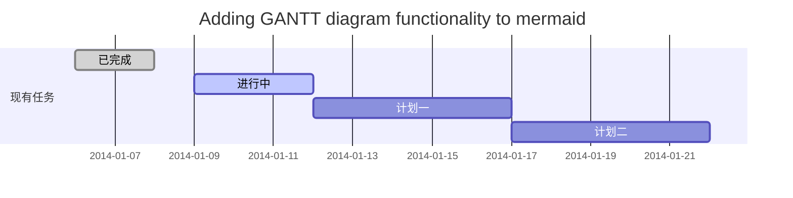
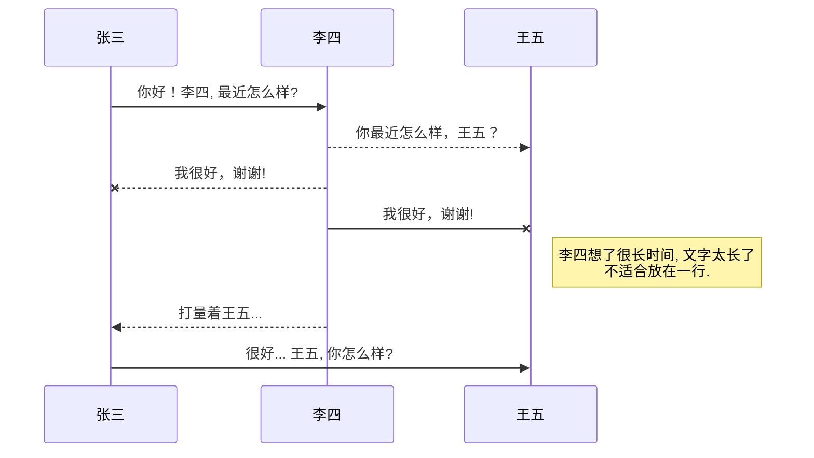
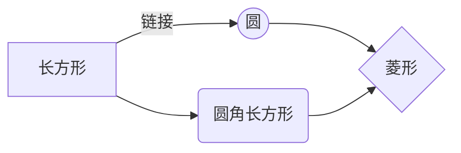

\*斜体\*


#### **在markdown中可以使用\<mark>\</mark>来时让文字背景高亮，效果如下**
<mark>在markdown中可以使用\<mark>\</mark>来时让文字背景高亮，效果如下</mark>
\<mark>标签默认背景颜色为黄色，如果想要其他颜色，可以使用style属性，style=background-color:colorName

**示例如下：**
<mark style=background-color:red>\<mark>标签默认背景颜色为黄色，如果想要其他颜色，可以使用style属性，style=background-color:colorName</mark>
若要换成其他颜色，使用其他<mark><font size=3 color=FF0000>**颜色关键字(Color Keywords)**</font></mark>即可：其他颜色关键字可见：**https://www.html.cn/book/css/appendix/color-keywords.htm#basic**
再者：如果要同时设置背景色和字体颜色，需要使用分号（ **;** ）分隔两个设置，示例如下：
<mark style=color:red;background-color:lime>如果要同时设置背景色和字体颜色，需要使用分号（ **;** ）分隔两个设置</mark>
虽然上面的\<mark style=background-color:>\<font>...\</font>\</mark>也可以实现类似的效果


#### **在markdown中添加<mark>代码块</mark>，可以在\```之后加上语言名称，即可实现对应语言的语法高亮。示例如下**
  ```java
   @AutoConfigurationPackage
   @Import({EnableAutoConfigurationImportSelector.class})
   public @interface EnableAutoConfiguration {...}
  ```
更多支持的语言，见链接：[**markdown代码块支持的语言**](https://www.jianshu.com/p/1f223eb78ad8)，以及补充：[**markdown 代码块(```code)支持的语言列表**](https://www.jianshu.com/p/d32a3328489c)

同时：若要标注<mark>**段落中的代码**</mark>，使用<mark> **\`** </mark>即可，示例如下：`print('hello wolrd')`


#### **若要用markdown生成多级列表，方法如下：在'-'前按下Tab即可；效果如下**
- 一级列表1
  - 二级列表1
  - 二级列表2
  - 二级列表3
- 一级列表2


#### **类似的，若要生成有序多级列表，方法如下：在写下一级有序列表时前缩进4个空格（按下Tab）即可；效果如下**

1. 一级列表1
   1. 二级列表1
   2. 二级列表2
   3. 二级列表3
2. 一级列表2


#### 使用markdown生成页内跳转方法：

定义一个锚(id)：\<span id="jump">跳转到的地方\</span>
使用markdown语法：\[点击跳转\](#jump)

#### **类似的markdown插入跳转的方法：**
\[链接文字\](链接网址 "Optinal title")
<font color=FF0000>**示例如下：**</font>
**This is an [example link](http://www.baidu.com/ "With a Title").** 


#### **markdown插入图片**

**有两种方法：**

- markdown特有格式：<font color=FF0000>**\!\[Alt text](address "optional title")**</font>
  - Alt text: 当按下Alt时显示的文字，用于描述图片的关键词，可以不写
  - address: 就是地址，可以写绝对路径和相对路径
  - optional title: 鼠标悬置于图片上会出现的标题文字，可以不写

<mark>同时若要对图片**进行缩放**，在**VS Code**和**Typora**中似乎只能使用<mark>HTML的格式：**\**</mark>

至于其他markdown编辑器似乎可用``，见知乎问题：[**markdown中插入图片怎么定义图片的大小或比例？**](https://www.zhihu.com/question/23378396)

至于更多markdown中插入图片的问题，比如：[**markdown多张图片并排显示**](https://www.cnblogs.com/jaycethanks/p/12201959.html)，遇到再说。


#### **markdown插入表格**

<font color=FF0000>**模板如下：**</font>
<font color=FF0000 size=4>\|</font>title1<font color=FF0000 size=4>\|</font>title2<font color=FF0000 size=4>\|</font>...<font color=FF0000 size=4>\|</font>
<font color=FF0000 size=4>\|-\|-\|-\|-\|</font>
<font color=FF0000 size=4>|</font>1-1<font color=FF0000 size=4>|</font>1-2<font color=FF0000 size=4>|</font>...<font color=FF0000 size=4>|</font>
<font color=FF0000 size=4>|</font>2-1<font color=FF0000 size=4>|</font>2-2<font color=FF0000 size=4>|</font>...<font color=FF0000 size=4>|</font>
<font color=FF0000 size=4>|</font>...<font color=FF0000 size=4>|</font>...<font color=FF0000 size=4>|</font>...<font color=FF0000 size=4>|</font>
效果如下：

|title1|title2|...|
|-|-|-|
|1-1|1-2|...|
|2-1|2-2|...|
|...|...|...|


#### **Markdown插入分割线**

使用\***以产生分割线，如下：

***


#### markdown中使标题居中

```html
<div align='center'><font size='40'>实习总结报告</font></div>
```

效果如下：

<div align='center' ><font size='40'>实习总结报告</font></div>


## CSDN的markdown编辑器详细使用说明、语法快速索引手册

地址：https://blog.csdn.net/davidhzq/article/details/100904811

#### 本文目录

- [Markdown介绍](https://blog.csdn.net/davidhzq/article/details/100904811#Markdown_1)
- [1、标题](https://blog.csdn.net/davidhzq/article/details/100904811#1_19)
- [2、粗体/斜体/删除线/字体底色](https://blog.csdn.net/davidhzq/article/details/100904811#2_30)
- [3、上标/下标](https://blog.csdn.net/davidhzq/article/details/100904811#3_48)
- [4、无序排列](https://blog.csdn.net/davidhzq/article/details/100904811#4_60)
- [5、有序排列](https://blog.csdn.net/davidhzq/article/details/100904811#5_72)
- [6、待办事项](https://blog.csdn.net/davidhzq/article/details/100904811#6_83)
- [7、引用](https://blog.csdn.net/davidhzq/article/details/100904811#7_93)
- [8、脚注](https://blog.csdn.net/davidhzq/article/details/100904811#8_101)
- [9、自动注释](https://blog.csdn.net/davidhzq/article/details/100904811#9_120)
- [10、链接](https://blog.csdn.net/davidhzq/article/details/100904811#10_131)
  - [ a) 地址链接](https://blog.csdn.net/davidhzq/article/details/100904811#emspa__134)
  - [ b) 文字链接](https://blog.csdn.net/davidhzq/article/details/100904811#emspb__141)
- [11、图片链接](https://blog.csdn.net/davidhzq/article/details/100904811#11_148)
  - [ a) 一般图片](https://blog.csdn.net/davidhzq/article/details/100904811#emspa__150)
  - [ b) 带尺寸图片](https://blog.csdn.net/davidhzq/article/details/100904811#emspb__163)
  - [ c) 图片居中](https://blog.csdn.net/davidhzq/article/details/100904811#emspc__176)
  - [ d) 图片居中且带尺寸](https://blog.csdn.net/davidhzq/article/details/100904811#emspd__188)
- [12、参考式链接](https://blog.csdn.net/davidhzq/article/details/100904811#12_197)
- [13、表格](https://blog.csdn.net/davidhzq/article/details/100904811#13_200)
- [14、代码块](https://blog.csdn.net/davidhzq/article/details/100904811#14_234)
- [高端用法：](https://blog.csdn.net/davidhzq/article/details/100904811#_253)
  - [1、Latex数学公式](https://blog.csdn.net/davidhzq/article/details/100904811#1Latex_255)
  - [2、甘特图](https://blog.csdn.net/davidhzq/article/details/100904811#2_272)
  - [4、Mermaid流程图](https://blog.csdn.net/davidhzq/article/details/100904811#4Mermaid_331)
  - [5、Flowchart流程图](https://blog.csdn.net/davidhzq/article/details/100904811#5Flowchart_353)
  - [导出与导入](https://blog.csdn.net/davidhzq/article/details/100904811#_383)
  - [离线写博客](https://blog.csdn.net/davidhzq/article/details/100904811#_390)
- [最后](https://blog.csdn.net/davidhzq/article/details/100904811#_396)

## Markdown介绍

 Markdown 是一种轻量级标记语言，它允许人们使用易读易写的纯文本格式编写文档，然后转换成格式丰富的HTML页面。这几年Markdown编辑器以其独到的优势迅速火起来了，很多写作平台都开始支持了。
 Markdown语法常用的也就十个左右，Markdown编辑器深受技术人员和效率写手的喜爱，很多Markdown编辑器还可以轻松地将文本转换为pdf等格式。

#### 1、标题

 助记：#+空格，1个#号表示1级标题，6个#表示6级标题，#号越多字体越小。

```code
# 标题1
## 标题2
### 标题3
#### 标题4
##### 标题5
###### 标题6
```


#### 2、粗体/斜体/删除线/字体底色

```code
**粗体是每边两个星号**
```

**粗体是每边两个星号**

```code
*斜体是每边一个星号*
```

*斜体是每边一个星号*

```code
~~删除线是每边两个波浪线~~
```

~~删除线是每边两个波浪线

```code
==字体底色是每边两个等号==
```

==字体底色是每边两个等号==

#### 3、上标/下标

- 助记：**上标**每边一个^符号

```code
2^10^ 运算结果是 1024。
```

2^10^ 运算结果是 1024。

- 助记：**下标**每边一个~符号

```code
H~2~O 就是水。
```

H~2~O 就是水。

#### 4、无序排列

 助记：列表分为三种无序列表、有序列表、待办事项列表。
 无序列表是：-（减号）+空格，或：*+空格，或：+（加号）+空格，效果都是一样的，样式只有小黑点一种。

```code
- 无序
* 无序
+ 无序
```

- 无序
- 无序
- 无序

#### 5、有序排列

 助记：有序列表是：数字+.(英文句号)+空格，样式只有数字一种。

```code
1. 有序
2. 有序
3. 有序
```

1. 有序
2. 有序
3. 有序

#### 6、待办事项

 助记：计划事项是：-（减号）+空格+[+空格+]+空格
 已完成事项：-（减号）+空格+[+字母x（大小写都可以）+]+空格

```code
- [ ] 计划任务
- [x] 完成任务
```

-  [ ] 计划任务
-  [x] 完成任务

#### 7、引用

 引用主要用于形成一个带底色的方框，表示引用其他的文字或说明。
 助记：>(大于号)+空格

```code
> 这里是引用的文字
```

> 这里是引用的文字

#### 8、脚注

 脚注是对某一段话，某一个词的备注说明，专业性表格或技术论文中经常使用。

- 助记(引用)：\[^数字]

```code
这是一段话[^1]
这是二段话[^2]
```

这是一段话[1](https://blog.csdn.net/davidhzq/article/details/100904811#fn1)
这是二段话[2](https://blog.csdn.net/davidhzq/article/details/100904811#fn2)

- 助记：冒号\[^数字]

```code
[^1]:这是脚注1
[^2]:这是脚注2
```

[^1]:这是脚注1
[^2]:这是脚注2

脚注的内容可以写在任何地方，但预览或发布时会自动显示在页面最底下，并在上面添加一个分割线。

#### 9、自动注释

 脚注是对某一段话，某一个词的专有说明，而自动注释可以对文中所有出现的某个词进行说明，并以鼠标提示的方式进行说明。
 助记：被说明的词前后空格或跟着标点符号，
 注释内容：*[某个词]:要提示的说明文字

```code
Markdown兼容标准的 HTML 语法。
*[HTML]:一种超文本标记语言
```

Markdown兼容标准的 HTML 语法。
*[HTML]:一种超文本标记语言

#### 10、链接

 助记：常用链接有三种，地址链接，文字链接，图片链接(参见下文单独的说明)

#####  a) 地址链接

 助记：<http开头的地址>

```code
<https://www.baidu.com>
```

<https://www.baidu.com>

#####  b) 文字链接

 助记：`[文字内容](http开头的地址)`

```code
[百度](https://www.baidu.com/)
```

[百度](https://www.baidu.com/)

#### 11、图片链接

#####  a) 一般图片

 助记：

```
![图片提示性文字，可不(图片地址)图片地址)]
```

在一般文字链接前面多了一个叹号！

例如：

```

显示如下的头像图标：
```


#####  b) 带尺寸图片

 助记：

```
，=号前面有空格
```

在末尾多了一个 =号

例如：

```code

```

显示如下的头像图标：


#####  c) 图片居中

 助记：

```
，#号前面不能有空格
```

例如：

```code

```

显示如下的头像图标：


#####  d) 图片居中且带尺寸

 助记：将上述两者结合即可

​	例如：

```code

```

显示如下的头像图标：


#### 12、参考式链接

 CSDN目前不支持这种链接，它用的也比较少，使用上有点类似于脚注。脚注是给某段文字加文字性说明，参考式链接是给某段文字加链接。类似于HTML中的文章内部 锚和命名。

#### 13、表格

 表格的语法格式如下：竖线表示表格每一列，横线以上是表头，其余表格线系统自动添加。

```code
项目    	| 价格
-------	| ---
电脑		| ￥5600
电话 	| ￥3500
PAD    	| ￥2000
```

| 项目 | 价格   |
| ---- | ------ |
| 电脑 | ￥5600 |
| 电话 | ￥3500 |
| PAD  | ￥2000 |

**可以使用冒号来定义对齐方式：**

- 使用 **:**---------**:** 居中（或者没有:号，默认也是居中）
- 使用 **:**----------居左
- 使用----------**:** 居右

```code
项目    	| 价格
:-------	| :---
电脑		| ￥5600
电话 	| ￥3500
PAD    	| ￥2000
12345
```

| 项目 | 价格   |
| ---- | ------ |
| 电脑 | ￥5600 |
| 电话 | ￥3500 |
| PAD  | ￥2000 |

#### 14、代码块

 助记：```开始，```结束，中间是代码，`是键盘数字1前面那个按键，开始标记后面可插入编程语言的名字，CSDN支持常见的十几多种编程语言，如图：


```
```javascript
　	//代码高亮显示例子
　	var aa= 'this';
　	var bb= 'that';
　	let cc= aa+ bb;
​```
```
效果如下：
```javascript
//代码高亮显示例子
var aa= 'this';
var bb= 'that';
let cc= aa+ bb;
```


#### 高端用法：

##### 1、Latex数学公式

 CSDN可以使用latex语法来渲染数学公式，例如：

```code
Gamma公式展示 $\Gamma(n) = (n-1)!\quad\forall
n\in\mathbb N$ 是通过欧拉积分
$$
\Gamma(z) = \int_0^\infty t^{z-1}e^{-t}dt\,.
$$
```

Gamma公式展示 $\Gamma(n) = (n-1)!\quad\forall
n\in\mathbb N$ 是通过欧拉积分
$$
\Gamma(z) = \int_0^\infty t^{z-1}e^{-t}dt\,.
$$
更多latex数学符号详见：[常用数学符号的 LaTeX 表示方法](https://www.mohu.org/info/symbols/symbols.htm)
kaTeX数学表达式参见：[KaTeX](https://khan.github.io/KaTeX/)

##### 2、甘特图

 一个常见的甘特图例子如下：

~~~code
　```mermaid
	gantt
	        dateFormat  YYYY-MM-DD
	        title Adding GANTT diagram functionality to mermaid
	        section 现有任务
	        已完成               :done,    des1, 2014-01-06,2014-01-08
	        进行中               :active,  des2, 2014-01-09, 3d
	        计划一               :         des3, after des2, 5d
	        计划二               :         des4, after des3, 5d
　```
	#甘特图代码例子
~~~


更多甘特图用法参考：[参考文档](https://mermaidjs.github.io/#/gantt)

##### 3、UML序列图

 一个常见的UML序列图例子如下：

~~~code

#UML序列图代码例子
~~~


更多UML序列图用法参考： [参考文档](https://mermaidjs.github.io/#/sequenceDiagram)

##### 4、Mermaid流程图

 一个常见的Mermaid流程图例子如下：

```code
```mermaid
	graph LR
	A[长方形] -- 链接 --> B((圆))
	A --> C(圆角长方形)
	B --> D{菱形}
	C --> D
​```
#Mermaid流程图代码例子
```



更多Mermaid流程图用法参考：[参考文档](https://mermaidjs.github.io/#/flowchart?id=graph)

##### 5、Flowchart流程图

 一个常见的Flowchart流程图例子如下：

```code
```mermaid
	flowchart
	st=>start: 开始
	e=>end: 结束
	op=>operation: 我的操作
	cond=>condition: 确认？

	st->op->cond
	cond(yes)->e
	cond(no)->op
​```
#Flowchart流程图代码例子
```

```mermaid
flowchart
	st=>start: 开始
	e=>end: 结束
	op=>operation: 我的操作
	cond=>condition: 确认？
	
	st->op->cond
	cond(yes)->e
	cond(no)->op
```

更多Flowchart流程图用法参考：[参考文档](http://flowchart.js.org/)

#### markdown 显示与隐藏

由于 markdown 可以解析 html 代码，所以可以用 html 中的 \<details> 标签 实现：
```markdown
<details>
<summary>点击查看详细内容</summary>
展开的内容
</details>
```
 效果如下：
 <details>
<summary>点击查看详细内容</summary>
展开的内容
</details>