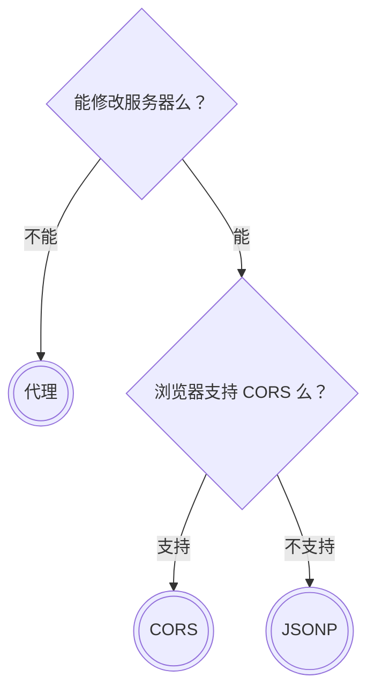

# 前端面试点总结


## HTML & CSS


> 摘自：[全面系统讲解CSS 工作应用+面试一步搞定](https://coding.imooc.com/class/chapter/164.html)

#### HTML 常见元素

##### header 标签

`<header>` 中的元素包含：meta、title、style、link、script、base；这些元素不会在页面上直接留下内容，主要是页面相关的资源和信息描述

meta 中 viewport 表示：手机屏幕代表页面的多大尺寸，即设置 viewport 的宽度等于屏幕的宽度。用于设配移动端，<font color=FF0000> 这是第一步，也是最重要的一步</font>。

##### body 标签

`<body>` 中的元素主要包含（这里不全）：

- div / section / article / aside / header / footer
- 段落：p
- 行内元素：span / em / strong
- 表格：table / thead / body / tr / td
- 列表：ul / ol / li / dl / dt / dd
- 链接：a
- 表单：form / input / select / textarea / button


#### HTML 的重要属性

- `table td[colspan, rowspan]` ：用于合并单元格

- `form[target, method, enctype]` ：

  - target：表示表单要提交到哪里
  - method：用什么方式提交，一般是 get / post
  - enctype：用什么编码方式提交，主要针对 post 方式。主要有两种编码：1. url encode 2. formdata（用 formdata 可以用于上传文件）

- `input type="radio"[name]` ：当多个 radio（单选框）在一起时，通过<font color=FF0000> 设置同样的 name，表明它们是一组的，只能选择其中一个</font>

- `button[type]` ：用于指定按钮的类型

  - <font color=dodgerBlue>**问题：**</font>在表单中，比如使用 AJAX，不通过 `<button type="submit">` 去提交代码，是否可以不加上 `<form>` 标签？

    答：技术上讲是可以不使用 form 元素的，但是使用 form 有如下优点：

    - 使用 `<form>` 可以利用 `<button type="submit">`、`<button type="reset">` 等特性，方便开发，如果没有 form 元素，将无法使用。
    - 使用 form 元素，可以通过一些方式批量获取表单
    - 使用 form 元素，可以与框架结合，或者与验证组件结合，做表单验证
    - 使用 form 元素，浏览器或密码管理工具会记住用户名和密码，方便用户，提升用户体验


#### 理解 HTML 是什么

- HTML 是一个文档（ HTML5 加入语义化的标签，就是为了让 HTML 文档结构更清晰，语意更明显）
- 有描述文档的结构
- 有区块有大纲

可以使用 [h5o - HTML5 Outliner](https://h5o.github.io/) 查看文档结构，可用于优化 SEO


#### HTML 版本

| HTML4                                     | XHTML                | HTML5                                           |
| ----------------------------------------- | -------------------- | ----------------------------------------------- |
| <font color=FF0000> 标签允许不结束</font> | 标签必须结束         | <font color=FF0000> 标签允许不结束</font>       |
| 属性不用带引号                            | 属性必须带引号       | 属性不用带引号                                  |
| 标签属性可大写                            | 标签属性必须小写     | 标签属性可大写                                  |
| Boolean 属性可省略值                      | Boolean 属性必须写值 | <font color=red>**Boolean 属性可省略值**</font> |


可以使用 [W3C - Markup Validation Service](http://validator.w3.org/) 来验证 html 页面书写是否规范


#### HTML5 新增内容

- 新的区块标签：section / article / nav / aside
- 表单增强：
  - 日期、时间、搜索 ( `type="search"` )
  - 表单验证
    - require 属性
    - min / max
    - pattern 指定正则表达式，检测输入是否如何
  - placeholder、自动聚焦（autofocus）
- 语义化：
  - header /  footer：表示头尾
  - section / article：表示区域，其中如果是一篇文章，用article
  - nav：导航
  - aside：表示不重要的内容
  - em / strong：强调
  - i：在HTML4中表示斜体，但是由于用作图标的使用广泛，所以在 HTML5 中表示 icon


#### HTML 元素分类

##### 按默认样式分类

- 块级 block
- 行内 inline，与文本相关的元素：span、em、strong 等
- 行内块级 inline-block，一些表单元素，比如下拉框

##### 按照内容分类


- **Flow：**在文档流中有影响的元素，大部分可见的元素都是Flow元素
- **metadata：**部分是在Flow之外的（如图），比如 head 中的 title base script，不占据文档流，所以在 Flow之外
- **heading：**标题 h1 - h6
- **sectioning：**分区的元素， section、article、aside、nav
- **interactive：**与用户有交互的元素
- **phrasing：**短语，不是完整的句子、不是一个完整的段落。如em、strong
- **embedded：**嵌入的资源，如 audio、vedio

更多的：可以看 https://html.spec.whatwg.org/multipage/dom.html#kinds-of-content


#### HTML 的嵌套关系

- 块级元素可以包含行内元素

- 块级元素<font color=FF0000> 不一定</font>能包含块级元素，如 p 不能包含 div，因为它是一个段落

- 行内元素<font color=FF0000> 一般不能</font>包含块级元素，比如 anchor 元素可以包含块级元素（ `a > div` ）

  > 💡 补充
  >
  > anchor 是透明的（ transport 的内容模型，即在计算内容模型时，透明的元素是不参与计算的 ）


#### HTML 元素默认样式

##### 默认样式的意义

带有默认样式，简化工作量

##### 默认样式带来的问题

- 有些默认样式是我们不想要的
- html 也是有样式的，所以在修改样式时，可以从 html 元素改起
- body 默认是有 margin 的

由于默认样式可能会有问题，所以可以使用 css reset，比如 [normalize.css](https://github.com/necolas/normalize.css)


#### HTML 面试题

##### doctype 的意义是什么？

- 让浏览器以标准模式渲染（这里有一些历史因素在里面，与盒子模型相关）
- 让浏览器知道元素的合法性（在不同版本的 html 中，代码的合法性是不同的）

##### HTML XHTML HTML5 的关系？

- HTML 属于 SGML
- XHTML 属于 XML ，是 HTML 进行 XML 严格化的结果
- <font color=FF0000> HTML5 不属于 SGML 或 XML，比 XHTML 宽松</font>

##### HTML 5有什么变化？

- 新的语义化元素

- 表单增强（添加日期、搜索，<font color=FF0000>添加验证功能</font> ）

- <font color=FF0000>**新的 API ，与 JS 相关**</font>
  
  - **离线：**ApplicationCache、Service Worker。
  
    AppCache 已经过时，由 Service Worker 替代（比如 Chrome 官方的文章 [准备进行 AppCache 移除](https://web.dev/i18n/zh/appcache-removal/) ）
  
    ApplicationCache 即 AppCache。另外，一般基于建立一个基于一个新建的 `*.appcache` 文件的缓存机制，通过这个<font color=FF0000>文件上的 **解析清单** 离线存储资源</font>，这些资源就会像 cookie 一样被存储了下来。相关 html 代码为：
  
    ```html
    <html manifest="foo.appcache">
    ```
  
    另外，这里由于篇幅，更多内容略。详见：[「2021」高频前端面试题汇总之HTML篇](https://juejin.cn/post/6905294475539513352) 中的 10、11 
  
  - 音视频（ 内置 audio、video，而不是借助 flash ）
  
  - 图形（ canvas、svg，之前只能借助 flash ）
  
  - 实时通信（ websocket ）
  
  - 本地存储（ localStorage、indexedDB ）
  
  - 设备能力 （ <font color=FF0000>定位</font>，获取加速计、陀螺仪的状态 ）
  
  - Drag & Drop API、History API
  
  - DOM 操作：document.querySelect() 、document.querySelectAll()
  
- 分类和嵌套变更

##### em 和 i 有什么区别？

- em 和 i 的默认样式都是斜体的
- em 是语义化的标签，表示强调
- i 是纯样式的标签，表斜体
- HTML5 中 i 不推荐使用，一般用作图标

##### 语义化的意义是什么？

- 开发者容易理解，增加代码的可读性，便于代码维护
- 机器容易理解结构（ 搜索、盲人使用的读屏软件 ）
- 有助于 SEO
- semantic microdata

##### 哪些元素可以自闭合？

- 表单元素 input
- 图片 img
- br hr
- meta link

##### HTML 和 DOM 的关系

- HTML 是 “死” 的，就是一串字符串，要经过浏览器解析，解析之后才变成 DOM
- DOM 由 HTML 解析而来，是活的
- JS 可以维护 DOM

##### property 和 attribute 的区别

- Attribute：<font color=red>HTML 属性</font>，书写在标签内的属性，通过 `setAttribute()` 和 `getAttribute()` 进行设置和获取。
- Property：<font color=red>DOM 属性</font>，HTML 标签对应的 DOM节点属性，通过 `.prop` 或 `[prop]` 设置和获取。
- 两边独立，不会互相影响：property 被修改，不会影响 attribute；同时，attribute 被修改也不会影响 property

###### 示例

```html
<input type="text" value="1" />
```

这里的 value 是 attribute，是属性，属性 value 值为 1。

而在浏览器上，选中 input 之后，在控制台中输入 `$0.value`（表示选中的元素的 value 特性），这时获得的值是特性。

使用 `$0.setAttribute('value', 2)` 以修改属性，这时 `$0.value` 还是 1。使用 `$0.value = 2` 修改特性，这时 `$0.getAttribute('value')` 的值还是 1

##### Attribute 和 Property 补充

###### Attribute（特性）

<font color=FF0000>**attribute 特性由 HTML 定义**</font>，所有出现在 HTML 标签内的描述节点都是 attribute 特性。

```html
<div id="test" class="button" custom-attr="1"></div>
```

```js
document.getElementById('test').attributes; // return: [custom-attr="hello", class="button", id="test"]
```

<font color=FF0000>attribute 特性的类型总是字符串类型</font>。以上边的 DIV 为例，`document.getElementById('test').getAttribute('custom-attr')` 或者 `$('#test').attr('custom-attr')` 总是返回字符串类型的 `"1"`。

###### Property（属性）

<font color=FF0000>property 属性**属于 DOM 对象**</font>，DOM 实质就是 JavaScript 中的对象。可以跟在 JS 中像操作普通对象一样获取、设置 DOM 对象的属性，并且 <font color=FF0000>property 属性可以是任意类型</font>。

```js
document.getElementById('test').foo = 1; // 设置属性: foo 为 number类型: 1
document.getElementById('test').foo; // 获取属性值, return number: 1
$('#test').prop('foo'); // 使用jquery获取属性值, return number: 1
```

```js
$('#test').prop('foo', {
   age: 23,
   name: 'John'
}); // 使用jquery设置一个名为foo的对象
document.getElementById('test').foo.age; // return number类型: 23
document.getElementById('test').foo.name; // return string类型: "John"
```

译者注：这里的 property 可以是任意类型指的是我们为 DOM 对象自定义添加的属性，对于 DOM 对象的原始属性，类似 name 属性，无论我们设置什么类型的值，最后返回的都是字符类型。

###### 最佳实践

在 javascript 中我们推荐使用 **property属性** 因为这个属性相对 **attribute** 更快，更简便。尤其是有些类型本该是布尔类型的attribute 特性。比如："checked", "disabled", "selected"。浏览器会自动将这些值转变成布尔值传给 property 属性。

摘自：[[译]HTML attribute与DOM property之间的区别？](https://segmentfault.com/a/1190000008781121)

#### form 的作用有哪些？

  - 直接提交表单
  - 使用 submit / reset
  - 便于浏览器保存表单
  - 第三库可以整体提取值
  - 第三方库可以进行表单验证


#### HTML5 Drag & Drop API

- **drag<mark>start</mark>：**<font color=FF0000>事件主体是**被拖放元素**</font>，在开始拖放被拖放元素时触发
- **<mark style="background: fuchsia">darg</mark>：**事件主体是被 <font color=FF0000 size=4>*拖放元素*</font>，在正在拖放被拖放元素时触发
- **drag<mark style="background: aqua">enter</mark>：**事件主体是**目标元素**，在被拖放元素进入某元素时触发
- **dragover：**事件主体是**目标元素**，在被拖放在某元素内移动时触发
- **drag<mark style="background: aqua">leave</mark>：**事件主体是 **目标元素**，在被拖放元素移出目标元素是触发
- **<mark style="background: fuchsia">drop</mark>：**事件主体是 <font color=FF0000 size=4>*目标元素*</font>，在目标元素完全接受被拖放元素时触发。
- **drag<mark>end</mark>：**<font color=FF0000>事件主体是**被拖放元素**</font>，在整个拖放操作结束时触发。

摘自：[「2021」高频前端面试题汇总之HTML篇](https://juejin.cn/post/6905294475539513352)


#### CSS的解析顺序

CSS 的解析顺序是从右向左的，如下：

```css
.foo .bar .baz {
  ...
}
```

这里浏览器对与 CSS 是先从 `.baz` 开始的，先找到 `.baz` ，在查找上层是否有 `.bar` ，一直向上。这样做是从性能方面去考虑的，只需要对 CSS 的一部分进行分析，如果存在，则继续向上；而不是直接对于整个 CSS 文档进行分析，这样很耗性能


#### 选择器的分类

- 元素选择器：`a{}`
- 伪元素选择器： `::before{}`
- 类选择器：`.link{}`
- 属性选择器：`[type=radio]{}`
- 伪类选择器：`:hover{}`
- ID选择器：`#id{}`
- 组合选择器：`[type=checkbox] + label{}`
- 否定选择器： `:not(link){}`
- 通用选择器： `*{}`

> 💡 补充：伪类代表一个状态，伪元素是一个真实存在的元素


#### padding 和 margin 的区别

- padding 是 框线 ( border ) 和 内容 ( content ) 之间的距离，<font color=fuchsia>margin 是框线和其他元素之间的距离</font>

  > 👀 这句话是之前完全没有想到的 ⭐️

- padding 会被背景颜色覆盖，但 margin 不会

- 如果元素是一个可以点击的元素，padding 会被纳入可点击的范围；而 margin 不会

- <font color=red>margin 可能会出现塌陷的情况，而 padding 不会</font>

- <font color=red>margin 对于 行内元素，只对 左右 ( margin-left、margin-right ) 有效，上下无效</font>；而 <font color=red>padding 都可以，但是 由于行内元素没有高度，所以垂直样式上看不太出来</font>（ 👀 详见视频）

学习自：[[CSS] Box Model 盒子模型（Padding、Border、Margin）](https://www.bilibili.com/video/BV1WA411h7Y1)

##### 关于 “行内元素” 的补充

行内元素，设置 `width`、`height` 属性无效；但 <font color=fuchsia>可以设置 **水平方向** 的 **margin** 和 **padding** 属性</font>，<font color=fuchsia>不能设置 **垂直方向** 的 padding 和 margin</font>


#### 特指度 / 优先级 ( Specificity )

下面列表中，选择器类型的优先级是递增的：

1. <font color=red>**类型选择器**</font>（元素选择器），例如 `h1` 

   <font color=fuchsia>**伪元素**</font>， 例如 `::before` 

2. **类选择器**，例如 `.example`

   **属性选择器**，例如 `[type="radio"]`

   <font color=fuchsia>**伪类**</font>，例如 `:hover`

3. **ID 选择器**，例如 `#example`

4. 给元素添加的 <font color=red>**内联样式**</font>（例如 `style="font-weight: bold"` ）总会覆盖外部样式表的任何样式 ，因此可看作是具有最高的优先级

5. 当在一个样式声明中使用一个 **`!important` **规则时，此声明将覆盖任何其他声明。

   虽然，<font color=red>从技术上讲，`!important` 与优先级无关</font>，但它与最终的结果直接相关。

   使用 `!important` 是一个**坏习惯**，应该尽量避免；因为这破坏了样式表中的固有的级联规则 使得调试找 bug 变得更加困难

**通配选择符** universal selector ( `*` ) 、**关系选择符** combinators ( `+` , `>` , `~` , `' '` , `||` ) 和 **否定伪类** negation pseudo-class ( `:not()` ) <font color=fuchsia>**对优先级没有影响**</font>；但是，<font color=LightSeaGreen>在 `:not()` 内部声明的选择器会影响优先级</font>

<font color=dodgerBlue>当优先级与多个 CSS 声明中任意一个声明的 **优先级相等**</font> 时，<font color=FF0000>CSS 中最后的那个声明将会被应用到元素上</font>。

摘自：[MDN - 优先级](https://developer.mozilla.org/zh-CN/docs/Web/CSS/Specificity) 另外，在《CSS权威指南 第四版》第三章 “特指度和层叠”有更详细的阐述。


#### CSS中可继承与不可继承属性有哪些

##### 无继承性的属性

- <font color=FF0000>**display**</font> ： 规定元素应该生成的框的类型（ 👀 这个也在情理之中）

- **文本属性**：

  - vertical-align：垂直文本对齐

  - text-decoration：规定添加到文本的装饰

  - text-shadow：文本阴影效果

  - white-space：空白符的处理

  - unicode-bidi：设置文本的方向

- **盒子模型的属性**：width、height、margin、border、padding

- **背景属性**：background、background-color、background-image、background-repeat、background-position、background-attachment

- **定位属性**：float、clear、position、top、right、bottom、left、min-width、min-height、max-width、max-height、overflow、clip、<font color=red>z-index</font>

- **生成内容属性**：content、counter-reset、counter-increment

- **轮廓样式属性**：outline-style、outline-width、outline-color、outline

- **页面样式属性**：size、page-break-before、page-break-after

- **声音样式属性**：pause-before、pause-after、pause、cue-before、cue-after、cue、play-during

##### 有继承性的属性

- **字体系列属性**

  - <font color=FF0000>font-family</font> ：字体系列

  - <font color=FF0000>font-weight</font> ：字体的粗细

  - <font color=FF0000>font-size</font> ：字体的大小

  - font-style ：字体的风格

- **文本系列属性**

  - <font color=FF0000>text-indent</font> ：文本缩进
  - <font color=FF0000>text-align</font> ：文本水平对齐
  - <font color=FF0000>**line-height**</font> ：行高
  - word-spacing ：单词之间的间距
  - letter-spacing ：中文或者字母之间的间距
  - text-transform ：控制文本大小写（就是 uppercase、lowercase、capitalize 这三个）
  - <font color=FF0000>**color**</font> ：文本颜色
  
  > 👀 在工作中搜了下，还有 `word-break`
- **元素可见性**
  - <font color=FF0000>**visibility**</font> ：控制元素显示隐藏（👀 这个有继承性，感觉情理之中）

- **列表布局属性**
  - list-style ：列表风格，包括 list-style-type、list-style-image 等

- **光标属性**
  - cursor ：光标显示为何种形态

摘自：[「2021」高频前端面试题汇总之CSS篇](https://juejin.cn/post/6905539198107942919)


#### 定位

##### static

<font color=LightSeaGreen>`position` 默认值为 **`static`**</font> ，<font color=red>`static` 的元素对于 `top` 、`bottom`、`left`、 `right` 和 `z-index` 均不会生效</font>

##### relative & absolute

**`relative`** 和 `static` 类似，都会跟随 html 的排版流程移动（👀 这里是否可以说为受到文档流影响？）；`relative` 元素 相对于自己（本来的、不设置定位的）位置进行移动。但 `absolute` 不会

<font color=dodgerBlue>`relative` 最重要的功能是</font>：在它里面的的 `absolute` 元素会根据 `relative` 的位置去定位（即：子绝父相）；而如果将 `absolute` 元素用 `static` 元素包裹，则完全不会按照父元素的位置去定位。

> ⚠️ 值得注意的是：上面 “子绝父相” 中的 <font color=red>“父子” 未必是指 dom 树中绝对的父子关系，祖先和子孙也可以</font>。
>
> 另外，一直以来对于 absolute 定位的理解都是存在问题的：未必限制是 “子绝父相”，也可以是其他非 `static` 定位的祖先元素。可以看下 https://g.co/gemini/share/144d9692cf60 中 Gemini 的回答
>
> > 绝对定位元素<font color=red>相对于 “最近的非 `static` 祖先元素” 定位</font>。<font color=dodgerBlue>当这样的祖先元素不存在时</font>，<font color=fuchsia>则相对于 ICB（ initial containing block，初始包含块）</font>。
> >
> > 摘自：[MDN - position](https://developer.mozilla.org/zh-CN/docs/Web/CSS/position)
>
> 这里的内容可以参考下 [[#包含块]] 中的内容。

##### fixed

**`fixed`** 是根据窗口定位。另外，即使 `fixed` 的元素被 `relative` 的父元素所包裹，但依然会根据 body 去定位；但是有一个特殊的地方，<font color=dodgerBlue>如果 `top` 、`bottom`、`left`、`right` <font size=4>**都**</font> 没有设置</font>，<font color=fuchsia>**则 `fixed` 的效果和 `absolute` 一样，相对位置是相较于 `relative` 父元素**</font>。

###### 修改 fixed 的基准参照对象

- 父元素设置 `transform` 属性，除了值为 `none` ，子属性以这个设置了 `transform` 的元素为参照，而不是浏览器窗口

  > 💡 包含下面的属性只要设置了值为 `none` 应该都不行吧 ...

- 父属性设置了 `perspective` 属性，

- 父属性设置了 `filter` 属性

- 父属性设置了 `background-filter` 属性

- 父属性设置了 `contain` 属性中的 `paint` 以及 `paint` 相关的复合值（`strict`、`content` 等）
  > 👀 经过测试，只要有  `paint` 就可以 ( `strict` 和 `content` 都是包含 `paint` 复合值) ，`style`、`size` 以及 `none` 不行；见下面示例：
  > ```html
  > <div class="contain-wrap">
  >   <div class="fixed"></div>
  > </div>
  > 
  > <style>
  >   * {
  >     margin: 0;
  >     padding: 0;
  >   }
  > 
  >   .contain-wrap {
  >     contain: paint; /* style、size 不行 */
  >     background-color: aqua;
  >     width: 500px;
  >     height: 500px;
  >   }
  > 
  >   .fixed {
  >     position: fixed;
  >     bottom: 100px;
  >     right: 100px;
  >     width: 100px;
  >     height: 100px;
  >     background-color: lightcoral;
  >   }
  > </style>
  > ```
  
  > 💡 另外，在此补充一下 CSS 的 contain 特性：
  >
  > 

学习自：[面试官的灵魂拷问：position: fixed的基准参照对象能修改吗？](https://juejin.cn/post/7472019111939620876)

另外，相关内容在 Vue3 `<Teleport>` 的文档中也有说明：


> `position: fixed` 能够相对于浏览器窗口放置有一个条件，那就是 <font color=red>**不能有任何祖先元素设置了 `transform`、`perspective` 或者 `filter` 样式属性**</font>。也就是说如果我们想要用 CSS `transform` 为祖先节点 `<div class="outer">` 设置动画，就会不小心破坏模态框的布局！
> 
> 摘自：[Vue3 doc - Teleport # 基本用法](https://cn.vuejs.org/guide/built-ins/teleport.html#basic-usage)

###### 如何避免 fixed 的基准参照对象被修改

在 Vue 开发环境下，可以使用 `<Teleport to="body"></Teleport>` 的方式，强制让一个元素归属于 body 下，而不会跑到其他地方去。

##### sticky

**`sticky`** （粘性布局）会像 `relative` 一样，默认位受到 html 排版的影响；但是一旦页面滚动，将会固定在设置的 `top` `bottom` `left` `right` 指定的位置。一般是 y 轴滚动，所以，可以只设置 `top` ，当 “sticky 块” y 轴的位置移动到 `top` 的位置，则会固定 ( fixed ) 下来。 👀 这也是教程视频中的示例。

> 👀 根据 [阮一峰的说法](https://www.ruanyifeng.com/blog/2019/11/css-position.html)：
>
> > <font color=FF0000>`sticky` 在 `position: relative` 与 `position: fixed` 定位之间切换</font>。
>
> 另外，在 [MDN - position # 粘性定位](https://developer.mozilla.org/zh-CN/docs/Web/CSS/position#粘性定位) 中也有说明：
>
> > 粘性定位可以被认为是相对定位和固定定位的混合。
>
> 此外，MDN sticky 示例中代码值得复习

学习自：[[CSS] 认识 Position](https://www.bilibili.com/video/BV1iE411W7ug)


#### 伪类和伪元素的不同

伪类用于当已有元素处于的某个状态时，为其添加对应的样式，这个状态是根据用户行为而动态变化的

<font color=lightSeaGreen>**伪元素不是 DOM 中的真实元素**</font>，<font color=red>但是 **存在于最终的渲染树中，可以为其添加样式**</font>

摘自：[CSS 重点知识汇总](https://www.nowcoder.com/discuss/642120)


#### 隐藏元素的方法 及其 事件效果

- **`display: none`** ：<font color=fuchsia>渲染树 **不会包含该 渲染对象**</font>，因此<font color=FF0000>该元素不会在页面中占据位置</font>，也<font color=FF0000>**不会响应绑定的监听事件**</font>

  > 💡 **渲染对象** 是 **渲染树** 的节点。另外，不可见的 DOM 元素不会被插入渲染树；其中不可见的 DOM，也包含 meta 元素

- **`visibility: hidden`** ：<font color=fuchsia>元素在页面中仍占据空间</font>，但是 <font color=fuchsia>**不会响应绑定的监听事件**</font>

- **`opacity: 0`** ：将元素的透明度设置为 0，以此来实现元素的隐藏。<font color=FF0000>元素在页面中仍然占据空间</font>，并且 <font color=FF0000>**能够响应元素绑定的监听事件**</font>

- **`position: absolute`**：通过使用绝对定位将元素移除可视区域内，以此来实现元素的隐藏

- **`z-index: 负值`**：用其他元素遮盖住该元素，以此来实现隐藏。⚠️ <font color=red>如果上面没有元素，那么依然会显示</font>

- **`clip` / `clip-path`** ：使用元素裁剪的方法来实现元素的隐藏，这种方法下，元素仍在页面中占据位置，但是不会响应绑定的监听事件

- **`transform: scale(0, 0)`**：将元素缩放为 0 ，来实现元素的隐藏。这种方法下，<font color=FF0000>元素仍在页面中占据位置</font>，但是<font color=FF0000>不会响应绑定的监听事件</font>

##### `display: none` 与 `visibility: hidden` 的区别

这两个属性都是让元素隐藏，不可见。<font color=dodgerBlue>两者区别如下</font>：

- **在渲染树中**
  
  - `display: none ` 会让元素完全从渲染树中消失，渲染时不会占据任何空间
  
  - `visibility: hidden` 不会让元素从渲染树中消失，渲染的元素还会占据相应的空间，只是内容不可见
  
- **是否是继承属性**

  - `display: none` 是<font color=FF0000>非继承属性</font>，子孙节点会随着父节点从渲染树消失，<font color=red>通过修改子孙节点的属性也无法显示</font>

  - `visibility: hidden` 是继承属性，<font color=fuchsia>子孙节点消失是由于继承了 `hidden` ，**通过设置 `visibility: visible` 可让子孙节点显示**</font>

    > ⚠️ 这一点之前完全没有听过... 值得注意

- <font color=FF0000>修改常规文档流中元素的 `display` **通常会造成文档的重排**</font>，但 <font color=FF0000>修改 `visibility` 属性**只会造成本元素的重绘**</font>

- 如果使用读屏器，设置为 `display: none` 的内容不会被读取，设置为 `visibility: hidden` 的内容会被读取

摘自：[「2021」高频前端面试题汇总之CSS篇](https://juejin.cn/post/6905539198107942919)


#### `<link>` 和 `@import` 的区别

两者都是外部引用 CSS 的方式，<font color=dodgerBlue>它们的区别如下</font>：

- <font color=FF0000> `<link>` 是 XHTML 标签</font>，除了加载 CSS 外，还可以定义 RSS 等其他事务；<font color=FF0000>`@import` 属于 CSS 范畴（只能在 CSS 中使用），只能加载 CSS</font>

  > 👀 根据 [MDN - `<link>` ：外部资源链接元素](https://developer.mozilla.org/zh-CN/docs/Web/HTML/Element/link) 的说法（ 可见 [[HTML & CSS备忘录#\<link>]] ）：link 标签还可以引入 图标、字体 等各种文件。

- <font color=FF0000>link 引用 CSS 时，在页面载入时同时加载</font>；<font color=FF0000 size=4>**`@import` 需要页面网页完全载入以后加载**</font>

  > 👀 这里的 “加载” 是指解析 parse，不是渲染 render 。参考 [[#`<script>` 和 `<link>` 对 DOM 解析 和 渲染的补充]] 中的内容

- link 是 XHTML 标签，无兼容问题；<font color=lightSeaGreen>`@import` 是在 CSS2.1 提出的，低版本的浏览器不支持</font>

- link 支持 **通过事件**，使用 JavaScript 控制 DOM 去改变样式（或者做一些其他事情？）；而 `@import` 不支持

  > 💡 上面说的 “ Javascript 控制 DOM 去改变样式”， [MDN - `<link>`：外部资源链接元素](https://developer.mozilla.org/zh-CN/docs/Web/HTML/Element/link) 中有示例：
  >
  > ```html
  > <link rel="stylesheet" href="mystylesheet.css" onload="sheetLoaded()" onerror="sheetError()">
  > ```

摘自：[「2021」高频前端面试题汇总之CSS篇](https://juejin.cn/post/6905539198107942919)


#### 为什么有时候⽤ translate 来改变位置⽽不是定位？

translate 是 transform 属性的⼀个值。<font color=fuchsia size=4>改变 transform 或 opacity **不会触发浏览器 重新布局 ( reflow ) 或 重绘 ( repaint )，只会触发 合成 ( compositions ) **</font>。⽽ <font color=FF0000 size=4>改变 绝对定位 **会触发重新布局**，**会触发重绘和合成**</font>。

> ⚠️ 上面这点，当时记录的时候没有注意；在其他地方看到时，感觉难以置信；结果发现这里做了笔记；所以做一下重点标记。

<font color=fuchsia size=4>**`transform` 使浏览器为元素创建⼀个 GPU 图层**</font>，但改变绝对定位会使⽤到 CPU 。 因此 `translate()` 更⾼效，可以缩短平滑动画的绘制时间。 ⽽ translate 改变位置时，元素依然会占据其原始空间，绝对定位就不会发⽣这种情况。

> 👀 这里可以看下 [[#绘画阶段，由布局树生成绘画树]] 中的 “要想拥有独立的绘画层，需要满足以下条件”

摘自：[「2021」高频前端面试题汇总之CSS篇](https://juejin.cn/post/6905539198107942919)

#### z-index

##### 定义

CSS **`z-index`** 属性设置定位元素（⚠️ 注意不包含 `static` ）及其后代元素或 flexbox 或 gridbox 中的子元素（ 👀 原文是 “... or flex and grid items”，关于 flex items 和 grid-items 可以看下 [[#BFC 背景 及 winter 讲解]] ）的 Z 轴顺序。`z-index` 较大的重叠元素会覆盖较小的元素。

摘自：[MDN - `z-index`](https://developer.mozilla.org/zh-CN/docs/Web/CSS/z-index) 和 [MDN US - `z-index`](https://developer.mozilla.org/en-US/docs/Web/CSS/z-index)

##### z-index 没有继承

虽然 `z-index` 没有继承，不过通过两个实践发现如下问题：

1. 如果父亲的 `z-index` 小于兄弟，那么儿子的 `z-index` 再大，层级也不会再父亲的兄弟之上。

   实践 🔗 见：[mozilla play](https://developer.mozilla.org/zh-CN/play?id=XRV%2F%2BC%2BQHtefBaL%2FbOfhkiql%2FfL2OLlIXksBM478Pd8tnY0BNL5Dvp8BgUT14akfBOCTamOm6qqbZxhN)

2. 类似的，如果父亲的 `z-index` 大于兄弟，哪怕儿子的 `z-index` 再小，也不会在父亲的兄弟之下。

   实践 🔗 见：[mozilla play](https://developer.mozilla.org/zh-CN/play?id=aGyHj9eEKU0nP8DM4M%2Bqvcm9q8gNRw4b1LU2ru%2F4Y9FDLn3aV6OQGZfc1Ao3fFVxMW%2Fs3VR%2F146bTCUV)

至于原因：应该是形成了 “层叠上下文”

理由如下：首先，如下几种情况下会生成 “层叠上下文”

> 文档中的层叠上下文由满足以下任意一个条件的元素形成：
>
> - 文档根元素（`<html>`）；
> - <font color=red>`position` 值为 `absolute`（绝对定位）或 `relative`（相对定位）</font>**且** <font color=red>`z-index` 值不为 `auto` 的元素</font>；
> - <font color=red>`position` 值为 `fixed`（固定定位）</font>或 `sticky`（粘滞定位）<font color=red>的元素</font>（沾滞定位适配所有移动设备上的浏览器，但老的桌面浏览器不支持）；
> - <font color=red>flex (`flex`) 容器的子元素，且 `z-index` 值不为 `auto`</font>；
> - <font color=red>grid (`grid`) 容器的子元素，且 `z-index` 值不为 `auto`</font>；
> - `opacity` 属性值小于 `1` 的元素（参见 [the specification for opacity](https://www.w3.org/TR/css3-color/#transparency)）；
> - `mix-blend-mode` 属性值不为 `normal` 的元素；
> - 以下任意属性值不为 `none` 的元素：
>   - `transform`
>   - `filter`
>   - `backdrop-filter`
>   - `perspective`
>   - `clip-path`
>   - `mask` / `mask-image` / `mask-border`
> - `isolation` 属性值为 `isolate` 的元素；
> - `will-change` 值设定了任一属性而该属性在 non-initial 值时会创建层叠上下文的元素（参考[这篇文章](https://dev.opera.com/articles/css-will-change-property/)）；
> - `contain` 属性值为 `layout`、`paint` 或包含它们其中之一的合成值（比如 `contain: strict`、`contain: content`）的元素。

其中，`z-index` 生效的所有条件（红色高亮部分）都是包含的，所以可以理解为：`z-index` 只要生效，一定会生成 “层叠上下文”

另外，层叠上下文存在如下机制：

> - 层叠上下文可以包含在其他层叠上下文中，并且一起创建一个层叠上下文的层级。
> - <font color=lightSeaGreen>每个层叠上下文都完全独立于它的兄弟元素</font>：<font color=red>当处理层叠时只考虑子元素</font>
> - 每个层叠上下文都是自包含的：<font color=red>当一个元素的内容发生层叠后，**该元素将被作为整体在父级层叠上下文中按顺序进行层叠**</font>。

所以，会出现上文中的现象。

以上相关引用均摘自：[MDN - 层叠上下文](https://developer.mozilla.org/zh-CN/docs/Web/CSS/CSS_positioned_layout/Stacking_context)

##### z-index 属性在什么情况下会失效

<font color=red>**`z-index` 元素的 `position` 属性不能是 `static`**</font>。

> 💡 补充
>
> 问了下 Gemini 2.5Pro，回复是：对于 flex items 和 grid items，即使 position 为 static，设置非 auto 的 z-index 也能生效。
>
> 另外，关于 `position` 的值是否能是 `sticky` ，Gemini 2.5Pro 回复说是可以的

- 元素没有设置 position 属性为非 `static` 属性

  **解决方案**：设置该元素的 position 属性为 relative、absolute 或是 fixed 中的一种

- 元素在设置 `z-index` 的同时还设置了 float 浮动

  **解决方案**：float 去除，改为 `display: inline-block`


摘自：[「2021」高频前端面试题汇总之CSS篇](https://juejin.cn/post/6905539198107942919)


#### 修改文档流的方法

如下方法，有的会导致元素脱离文档流（<font color=red>可以理解为：把对应的元素放入新的图层中</font>），有的不会。

- **display** ：包含 inline、block、inline-block、flex、grid、table 布局（ table 布局包含： table、table-row、table-cell ），这些都 <font color=red size=4>**不会**</font> 让元素脱离文档流
- **multi-column** ：进行多列布局，<font color=FF0000 size=4>**不会**</font> 让元素脱离文档流
- **float** ：浮动，<font color=FF0000 size=4>**会**</font> 让元素脱离文档流
- **position** ：定位，默认是 static，遵守正常的文档流。<font color=red>relative 不会脱离文档流，**剩下的 absolute 之类的都会脱离文档流**</font> （ sticky 是在文档滚动到规定位置，脱离文档流）

学习自：[2 分钟掌握网页文档流](https://www.bilibili.com/video/BV1q3411u7wr)


#### Flexbox


##### flex 的属性

###### `place-content` 

**`place-content`** 属性是 `align-content` 和 `justify-content`的简写。

##### flex-item 中的属性

###### `order`

**`order`**  <font color=red>默认值为 0</font> ，且 <font color=red>`order` 越大，`item` 越靠右边</font>；同理，`order` 越小，`item` 越靠左边

###### `align-self`

**`align-self`** 是<font color=red>用来覆盖 flex-container 的 `align-item` 的设定</font>的，自然的，可选值和 `align-item` 一样

###### `flex-basis` 

**`flex-basis`** 是设置 `flex-item` 的主轴方向（ flex-container 根据 `flex-direction` 来设置）的<font color=FF0000>基础大小</font>的。（即，<font color=fuchsia>是 **flex-item 的 基本宽度**</font>）

###### `flex-grow` 

**`flex-grow`** 是指：<font color=dodgerBlue>当 flex-container 的主轴方向有剩余空间时</font>，<font color=red>`flex-item` 沿主轴方向扩大（延伸）的设置</font>。flex-item 会将 <font color=fuchsia>**原本主轴剩余的空间 按照比例 均分**</font>，就是根据 `flex-grow` 的值作为比例分配，<font color=fuchsia>**添加**</font> 到原本的 flex-item的 主轴方向的宽度上。

💡 **flex-item 属性举例**

假设 flex-container 中 `flex-direction` 为 `row` ，宽度为 `300px` ，其中包含 A、B、C 三个 flex-item ；预设宽度为 `60px`，这样就剩下了 `300px - 3 * 60px = 120px` 的宽度。设置 flex-item-B 的 `flex-grow` 为 3 （ `flex-grow` 默认值为 1 ），则 A、B、C 的宽度分别为：`60px + (120px / 1 + 3 + 1) * 1 = 84px` ，`60px + 120px / (1 + 3 + 1) * 3 = 132px` ，`60px + 120px / (1 + 3 + 1) * 1 = 84px`

###### `flex-shrink`

**`flex-shrink`** 和 `flex-grow` 相反， 是指<font color=dodgerBlue>当 flex-item 主轴方向的大小总和 超过 flex-container 时</font>，<font color=red>flex-item 沿着主轴方向如何缩小的设置</font>。

由于就是 `flex-grow` 的逆过程，所以不再举例。

⚠️ 需要注意的是：在 `flex-grow` 中的剩余空间，在 `flex-shrink` 中就是超出的空间。<font color=fuchsia>**如果 `flex-shrink` 等于 0，则完全不收缩**；如果 flex-item 的 `flex-shrink` 都为 0，则会超出 flex-container</font>

###### `flex` 缩写

**`flex`** 是 `flex-grow`、`flex-shrink` 、`flex-basis` 组合起来的缩写

- **`flex: 1 1 auto`** ：则同步的、平均的 放大或缩小；同时，完全撑满整个 flex-container
- **`flex: 0 1 150px`** ：则不会放大，但是会缩小；同时，默认宽度（在这里 `flex-grow: 0` 也可以理解为最大宽度）为 150px
- **`flex: 0 0 200px`** ：不会放大和缩小，固定的宽度为 `200px`

> 💡 补充
>
> The list below summarizes the effects of the four `flex` values that represent most commonly-desired effects:
>
> - `flex: initial`
>
>   Equivalent to `flex: 0 1 auto`. (<font color=red>This is the initial value</font>.) Sizes the item based on the `width`/`height` properties. (If the item’s [main size property](https://www.w3.org/TR/css-flexbox-1/#main-size-property) computes to `auto` , this will size the flex item based on its contents.) Makes the flex item inflexible when there is positive free space, but allows it to shrink to its minimum size when there is insufficient space. The [alignment abilities](https://www.w3.org/TR/css-flexbox-1/#alignment) or [auto margins](https://www.w3.org/TR/css-flexbox-1/#auto-margins) can be used to align flex items along the [main axis](https://www.w3.org/TR/css-flexbox-1/#main-axis).
>
> - `flex: auto`
>
>   Equivalent to `flex: 1 1 auto`. Sizes the item based on the width/height properties, but makes them fully flexible, so that they absorb any free space along the [main axis](https://www.w3.org/TR/css-flexbox-1/#main-axis). If all items are either `flex: auto` , `flex: initial` , or `flex: none` , any positive free space after the items have been sized will be distributed evenly to the items with `flex: auto` .
>
> - `flex: none`
>
>   Equivalent to `flex: 0 0 auto` . This value sizes the item according to the `width`/`height` properties, but makes the flex item [fully inflexible](https://www.w3.org/TR/css-flexbox-1/#fully-inflexible). This is similar to `initial` , except that flex items are not allowed to shrink, even in overflow situations.
>
> - `flex: <positive-number>`
>
>   Equivalent to `flex: <positive-number> 1 0`. Makes the flex item flexible and sets the `flex-basis` to zero, resulting in an item that receives the specified proportion of the free space in the flex container. If all items in the flex container use this pattern, their sizes will be proportional to the specified flex factor.
>
>   > 👀 相关的，这里也就解释了 `flex: 1` 是 `flex: 1 1 0`
>
> By default, flex items won’t shrink below their minimum content size (the length of the longest word or fixed-size element). To change this, set the `min-width` or `min-height` property. (See [§4.5 Automatic Minimum Size of Flex Items](https://www.w3.org/TR/css-flexbox-1/#min-size-auto).)
>
> 摘自：[w3.org - css-flexbox-1 # flex-common](https://www.w3.org/TR/css-flexbox-1/#flex-common)

学习自：[Flexbox 网页布局完全解构](https://www.bilibili.com/video/BV1qJ411N7TA)


#### BFC

##### BFC 背景 及 winter 讲解

> Formatting Context 其实在 CSS 中地位相当重要。<font color=dodgerBlue size=4>CSS 的 **排版布局** 和两样东西相关</font>：<font color=fuchsia>**BOX 和 formating context**</font> 。所谓 BOX 即盒子模型，content + padding + border + margin 。而  <font color=fuchsia size=4>**盒子放在哪里** 需要一个 “上下文”</font>，<font color=red>这就需要 Formatting Context</font>
>
> <font color=dodgerBlue>**CSS 标准中 明确讲到的 Formatting Context 有四种：**</font>
>
> - **BFC** （ block，包含 block container，它其中有 block-level box )
> - **IFC**（ line，包含 line-box，它其中有 inline-level box ）
> - **FFC**（ flex，包含 flex-container，它其中有 flex items ）
> - **GFC**（ grid，包含 grid-container，它其中有 grid items ）
>
> 其中： <font color=fuchsia>**BFC 和 IFC 均在正常流中**</font>。
>
> > 💡 根据 [永远不要用inline-block布局【渡一教育】](https://www.bilibili.com/video/BV1ck4y157dj) 的说法，inline-block 结合了 IFC 的规则和部分 BFC 的规则（所以一些细节往往会出问题）
>
> > 💡 最近也在看浏览器“绘制顺序”相关概念的东西，里面自然而然提到 stack context 。回看这里，感觉和 stack context 存在关系
> >
> > 
> >
> > 
>
> ##### winter 的讲解
>
> BFC 中有一个容器和子元素（子box）的概念，容器叫 block container ，其中的子元素叫 block-level box 。类似的：IFC 中的容器叫作 line box ，子元素叫作 inline-level box。
>
> FFC 中容器叫作 flex container，子元素叫作 flex item；GFC 中容器叫作 gird container，子元素叫作 grid item 。
>
> BFC 类似于：一行写不完，换下一行；IFC 一行写不完，还会继续写。
>
> <font color=dodgerBlue>所以对于问题 “**什么情况下会生成 BFC 的问题？**” 可以这样回答</font>：<font size=4>除了根元素 ( html ) 外</font>（ 👀 因为“根元素”一定是 BFC ），<font size=4><font color=fuchsia>元素不在正常流中（在正常流的容器中）</font>，<font color=dodgerBlue>**且**</font> <font color=fuchsia>**包含可以换行的 文字**</font></font>（ ⚠️ 注意是文字），<font size=4>则会创建一个 BFC</font>（ ⚠️ 这点很重要，下面也会具体说）。
>
> 因为 `table-row` 中只能存放 `table-cell`，不能放文字，所以不能生成 BFC ；而 `table-cell` 和 `table-caption` 中可以放文字，所以是 BFC 。
>
> 因为 <font color=red>flex 中的内容是 flex-item，flex-item 才会生成 BFC，所以 flex 无法生成 BFC（**它是 FFC** ）</font>，而 本身不是 flex 的 flex-item 是 BFC ；同理，grid 和 grid-item 。
>
> <font color=dodgerBlue>值得注意的是</font>：<font color=fuchsia>**`overflow` 不为 `visible`  的情况下，会生成 BFC**</font> ：既是 block container，也是 block-level box 的元素（即：在一个 block container 中放入了另一个 block container，这个被放入的元素 ），被称为 block box，简称 block。<font color=fuchsia>block 在 `overflow` 为 `visible` 的情况下，不产生 BFC</font> ；因为外面的盒子是 BFC，所以里面就不产生 BFC 。
>
> 学习自：[鉴定一下网络热门面试题：什么情况下会触发BFC？](https://www.bilibili.com/video/BV17f4y1f7f6)
>
> <font color=dodgerBlue>**和 BFC 无关的属性**</font>： float 的位置，到父盒子的左边或右边 和 父盒子是否是 BFC 无关。`position` 定位的起点 依赖于 containing block，和 BFC 无关，只和 position 的属性相关。

##### BFC 概念

Formatting Context（格式化上下文）是 W3C CSS2.1 规范中的一个概念。它<font color=red>**是页面中的一块渲染区域，并且有一套渲染规则**</font>，<font color=fuchsia>**它决定了其子元素将如何定位，以及 和其他元素的关系和相互作用**</font>。

<font color=dodgerBlue>**那么 BFC 是什么呢？**</font>BFC 即 Block Formatting Contexts 块级格式化上下文，它属于 普通流 ( common flow )；还有哪些流见 [[#文档中的三种流]]

<font color=dodgerblue>具有 BFC 特性的元素可以看作是</font> <font color=fuchsia size=4>**隔离了的独立容器，容器里面的元素不会在布局上影响到外面的元素**</font>，并且 BFC 具有普通容器所没有的一些特性。

通俗一点来讲，<font color=lightSeaGreen>可以把 BFC 理解为一个封闭的大箱子，箱子内部的元素无论如何翻江倒海，都不会影响到外部</font>。

摘自：[10 分钟理解 BFC 原理](https://zhuanlan.zhihu.com/p/25321647)

##### 文档中的三种流

- **普通流** ：标准文档流
- **定位流** ：使用 `position`
- **浮动流** ：使用 `float`

<font color=fuchsia>**这三种流在使用（布局）时会出现一些问题（会相互影响）**</font>，<font color=red>所以需要使用 BFC</font> ( Block Formatting Context ) 块级元素格式上下文 <font color=red>来解决</font>。简单来说 BFC 就是：<font color=fuchsia size=4>就是被隔离的区间，BFC 的子元素不会对外界的元素产生影响</font>。

##### BFC 包含

- **html 元素** ：天生是 BFC

- **float** : left | right，没有 none

- **overflow** : hidden | scroll | auto，没有 visible

- **display** : inline-block | table-cell | table-caption | flex 中的 flex item ，且 flex item 中没有再使用 flexbox | grid 中的 grid item ，且 grid item 中没有再使用 gridbox 。

  没有 none、inline 和 block、table-row

- **position** : absolute | fixed，没有 relative

##### BFC 解决的问题

- **margin 重合** ：比如<font color=dodgerBlue>上下兄弟元素</font>，`margin-bottom` 和 `margin-top` 会重合

  解决方案：给兄弟元素外层分别套上一个容器（此时他们就不是兄弟了），使得两个容器变成 BFC

- **margin 塌陷** ：比如<font color=dodgerBlue>父子元素</font>，父子元素同使用 `margin-top` ，父元素会受到子元素的 `margin-top` 影响而塌陷

  解决方案：使父元素成为 BFC

- **高度塌陷** ：子元素有宽和高，父元素只有宽度、高度被子元素撑开（为了表现父元素的轮廓，可以给父元素添加 border ）；如果子元素样式中包含  `float: right` ，会发现父元素消失；具体表现为：border 只有宽度而没有高度。

  解决方案：使父元素成为 BFC。或者父元素使用伪元素，设置伪元素为 `clear: both`，这种方式被称为 clearfix 。
  
  > 💡关于“父元素使用伪元素”的解决方案，具体示例可见 [[HTML & CSS备忘录#clear#示例补充| clear 使用伪元素示例补充]]

学习自：[深挖BFC（BFC是什么？怎么触发？解决的是什么问题？怎么解决的？该怎么用？）](https://www.bilibili.com/video/BV1eA411c7Mh)

##### BFC 解决的问题

- **清除浮动：**消除父元素中其他子元素受到浮动子元素的影响
- **包裹浮动：**父盒子的高度没有浮动的子元素高， 这时候子元素会超出父元素；这时可以给父元素创建 BFC，以包裹子元素
- **避免边距塌陷：**父元素和子元素都有 `margin-bottom` ，两者重合。创建 BFC 以消除重合

##### 创建 BFC 的常见方法

- **设置 `overflow` 属性** ：除了 `visible` 和 `clip` 以外的值都可以，例如 `overflaw: hidden` <font color=FF0000>（因为可能会影响滚动行为，所以没有 `display: flow-root` 更推荐）</font>

  另外，MDN 文档中 不推荐使用 `overflow` ，而更推荐 `display: flow-root` ：

  > 使用 `overflow` 创建新的 BFC 的问题在于： `overflow` 属性用于告诉浏览器您希望如何处理溢出的内容。在某些情况下，当您纯粹使用此属性创建 BFC 时，您会发现不需要的滚动条或剪切阴影。另外，对于未来的开发人员来说，它可能不太可读，因为不能显式地表明为什么要使用溢出来实现这一目的。如果您使用了这个方法，最好对代码进行注释以便他人理解。
  >
  > 摘自：[MDN - Introduction to formatting contexts 格式化上下文简介](https://developer.mozilla.org/zh-CN/docs/Web/CSS/CSS_Flow_Layout/Intro_to_formatting_contexts)

- <font color=fuchsia>**设置 `display: flow-root`**（最推荐使用）</font>，但是还有一个问题是：`disploy: flow-root` 的兼容性不太好，比如不兼容 IE（学习自：[[CSS] Float](https://www.bilibili.com/video/BV1Gk4y1k7Q5)）

  > `flow-root` 关键字的意义是，创建的内容本质上类似于一个新的根元素（如 `<html>` 所做），并确定这个新的上下文如何创建及其流布局如何实现
  >
  > 摘自：[MDN - Introduction to formatting contexts 格式化上下文简介](https://developer.mozilla.org/zh-CN/docs/Web/CSS/CSS_Flow_Layout/Intro_to_formatting_contexts)
  
  > 💡 另外，看了下 [Can I use - `display: flow-root`](https://caniuse.com/?search=display%3A%20flow-root) ，发现它 IE 11 也不兼容，可以说：整个 IE 都不兼容 `display: flow-root`

学习自：[什么是 CSS BFC？](https://www.bilibili.com/video/BV1Ug411K7Fz)

> 👀 这里创建 BFC 的条件没有介绍完整，详见：[MDN - 块格式化上下文](https://developer.mozilla.org/zh-CN/docs/Web/Guide/CSS/Block_formatting_context)


#### REM 布局原理

rem 布局的本质是等比缩放，<font color=red>一般是基于宽度</font>。

如何让 html 字体大小一直等于屏幕宽度的百分之一呢？ 可以通过 js 来设置，一般需要在页面 dom ready ( `document.readyState` )、resize 和 屏幕旋转 ( [`ScreenOrientation.onchange`](https://developer.mozilla.org/en-US/docs/Web/API/ScreenOrientation) ) 中设置

```js
document.documentElement.style.fontSize = document.documentElement.clientWidth / 100 + 'px';
```

其中 `document.documentElement` 就是指 “html 元素”，而 `document.documentElement.style.fontSize` 自然就是 “html 元素” 的字体大小了。

摘自：[Rem布局的原理解析](https://yanhaijing.com/css/2017/09/29/principle-of-rem-layout/)


#### 样式继承

##### initial、inherit、unset、revert 属性值的区别

initial（初始）、inherit（继承）、unset（未设置）、revert（还原）

- `inherit` 可以继承父级元素的属性
- `initial` 则是不继承，使用 CSS 属性的默认值
   > ⚠️值得注意的是：这里我开始的理解是错误的，即：将其设置为 UA StyleSheet；而这是完全错误的。这里摘抄下 [MDN - `initial`](https://developer.mozilla.org/zh-CN/docs/Web/CSS/initial) 的内容：
   > 
   > > CSS 关键字 **`initial`** 将属性的初始（或默认）值应用于元素。不应将初始值与浏览器样式表指定的值混淆。
- `unset` 表示如果该属性默认可继承，则值为 `inherit` ，否则值为 `initial` 。
- `revert` 表示样式表中定义的元素属性的默认值。若用户定义样式表中显式设置，则按此设置；否则，按照浏览器定义样式表 ( UA stylesheet ) 中的样式设置；否则，等价于 `unset`

> 💡 可以看下 [[HTML & CSS备忘录#initial、unset 和 revert]] 中的内容

学习自：[fe-interview - [css] 第299天 说下你对css样式的这几个属性值initial、inherit、unset、revert的理解](https://github.com/haizlin/fe-interview/issues/1877)

##### 如何取消从父级元素继承下来的CSS样式

如果是恢复单个属性样式，例如 `font-size` ，可以使用 `font-size: initial;`

如果是将所有属性样式恢复为默认状态，可以使用 `all: initial;`

学习自：[fe-interview - [css] 第300天 如何取消从父级元素继承下来的CSS样式呢？](https://github.com/haizlin/fe-interview/issues/1881)


#### 行内元素

##### span与span之间有看不见的空白间隔是什么原因引起的

```html
<!-- 下面的元素没有任何自定义的样式 -->
<div class="wrap">
  <span>foo</span>
  <span>bar</span>
</div>
```

效果如下，foo bar 之间出现了空白间隔：


原因是：元素被当成行内元素排版的时候，元素之间的空白符（空格、回车换行等）都会被浏览器转换成一个空白字符（💡 补充：是一个 `#text` 的对象。另外，这里说的不完善，参考 [[JavaScript备忘录#Node.nextSibling#实践中的发现]] 中的内容），这个字符的大小受 `font-size` 影响。

所以可以通过将两个 span 写在一行解决。不过这样，代码可读性很差，尤其是很多 span 中内容很多的情况下。还有如下解决方法：

- 父元素使用 flexbox、inline-flex、table 等等 布局
- 父元素设置 `font-size: 0;` ，span 子元素再设置字体大小 `font-size: 16px;`
- span 子元素设置 `float: left;`

学习自：[fe-interview - [css] 第43天 span与span之间有看不见的空白间隔是什么原因引起的？有什么解决办法？](https://github.com/haizlin/fe-interview/issues/162)


#### 包含块

<font color=dodgerBlue>CSS 中最重要的两个概念</font>

- **属性计算 ( computed style )**：确定每个元素的样式是什么，因为元素的样式不仅仅受到开发者书写的 CSS 样式影响，也会收到 User Agent StyleSheet 的影响
- **视觉格式化模型**：完成页面的布局。IFC、BFC、FFC、GFC 都属于这一块的范畴。

> 此外，根据 [使用chrome调试工具解决问题【渡一教育】](https://www.bilibili.com/video/BV18tM7ziEYv) 中的说法：“样式计算” 和 “视觉格式化模型” 分别对应 浏览器渲染管线 中渲染的的 第二步（形成 CSSOM 树） 和 第三步

而“包含块” ( containing block ) 属于视觉格式化模型的基本概念，包含块的概念是：<font color=fuchsia>一个元素在哪个区域里边排列</font>

<font color=dodgerBlue>所以出现如下概念：</font>

下面这些属性的决定，<font color=red>**并不完全是根据父元素决定**</font>，<font color=fuchsia>**更准确的说法是由包含块决定**</font>

- 元素的 `width` 百分比相对的是包含块宽度
- 元素的 `height` 百分比相对的是包含块高度
- 元素的 `margin` 百分比相对的是包含块宽度
- 元素的 `padding` 百分比相对的是包含块宽度
- 元素的 `left` 相对的是包含块的左边缘
- 元素的 `top` 相对的是包含块的上边缘

##### 如何确定包含块

1. 所有的浮动元素和常规元素，它们的包含块是父元素的 **内容区域**（父元素的内容盒）
2. 一个绝对定位 ( `position: absolute` ) 的元素，它的包含块是离它最近的定位祖先的 padding 区域（填充盒）
3. 一个固定定位 `position: fixed` 的元素，它的包含块要看它的祖先中是否改动了 transform。如果有，则是这个祖先的填充盒区域；如果没有，则为浏览器的视口

学习自：[包含块【渡一教育】](https://www.bilibili.com/video/BV1XW421R7Su)


#### CSS 属性计算

属性计算一共分为四个步骤：1. 声明 2. 层叠 3. 继承 4. 默认

##### 层叠

层叠的比较同样有步骤。不过，在哪一步骤中出了比较的结果，便不会继续往下执行

1. 优先级：优先级如下

   1. 作者（开发者编写的）样式表中的 `!important`

   2. <font color=red>默认样式表 ( user agent style sheet ) 中的 `!important`</font>

      > 👀 这点有点细节，不过不太重要，可以了解下

   3. 作者样式表

   4. 默认样式表

2. 特殊性（也就是《CSS权威指南 4e》中说的“特指度”）

3. 源代码中的次序，后面覆盖前面

学习自：[层叠规则【渡一教育】](https://www.bilibili.com/video/BV1V4421S7Ft)

##### 《亚像素渲染：浏览器如何处理小数像素的渲染？》 笔记补充
###### CSS值的处理过程

CSS值的定义到最终渲染实际上会经过一系列的步骤，这一过程在 [W3C Recommendation](https://link.juejin.cn?target=https%3A%2F%2Fwww.w3.org%2FTR%2Fcss-cascade-3%2F%23value-stages) 中有介绍，<font color=dodgerBlue>整个过程一共分为6步</font>：

- **声明值**：应用于元素的每个属性都会为它提供一个声明值，当然也可能存在多个，比如在多个样式表中重复声明
- **级联值**：这一步其实就是在计算样式属性的权重（特指度），从而得到一个权重最高的值
- **指定值**：它一般等于级联值或者默认值，继承属性用的继承值 `inherit`，非继承属性将用初始值 `initial`，也可以显式的设置 `initial / inherit / unset` 等关键字，从而保证每个元素上的每个属性都存在一个值
- **计算值**：这一步是为 CSS 计算得出的值，转为需要使用的像素值（色彩值等），注意：这里最终得到的是绝对单位，比如 `rem` 在这一步就会转换成 `px`
- **使用值**：获取计算值并完成所有剩余计算的结果，使其成为文档格式化中使用的绝对理论值。
- **实际值**：使用值 <font color=dodgerBlue>**原则上** 可以直接使用</font>，但<font color=red>用户代理可能无法在给定环境中使用该值</font>。例如，<font color=dodgerBlue>用户代理可能只能渲染具有整数像素宽度的边框</font>，因此可能<font color=red>必须近似于已使用的宽度</font>。此外，元素的字体大小可能需要根据字体的可用性或 `font-size-adjust` 属性的值进行调整。实际值是进行任何此类调整后的已使用值。

| 属性        | 声明值                | 级联值   | 指定值   | 计算值    | 使用值     | 实际值   |
| --------- | ------------------ | ----- | ----- | ------ | ------- | ----- |
| font-size | `font-size: 1.2em` | 1.2em | 1.2em | 14.1px | 14.1px  | 14px  |
| width     | `width: 80%`       | 80%   | 80%   | 80%    | 354.2px | 354px |

摘自：[亚像素渲染：浏览器如何处理小数像素的渲染？](https://juejin.cn/post/7492417173630369831)


#### HTMLCollection 和 NodeList

HTMLCollection 是通过 `document.getElementByClassName` 以及 `document.getElementByTag` 获取得到的，它的特点是实时的，即这个集合中的内容始终和当前页面上的元素是挂钩的，也就是说：页面上元素的变动和修改，始终会影响 HTMLCollection 的内容。而这样的特性是存在风险的，因为它会发生一些超出预期的行为，比如刚刚可以访问到的内容消失了，再比如通过 `for (let i = 0; i < collections.length; i++)` 的方式往页面添加元素，它会陷入死循环，因为 collections 的 length 一直在增加；这样会导致程序中存在隐藏的 bug。再者，开发者未必想要把 JS 中存储的 DOM 元素显示到页面上。

基于此上种种，引入了新的 API ：`document.querySelectorAll` ，它获取到的是 NodeList ，它不与页面中的元素实时挂钩，不会出现 NodeList 获取后，页面元素影响 NodeList 中内容的情况。

学习自：[HTMLCollection & NodeList【渡一教育】](https://www.bilibili.com/video/BV12J4m1T718)

#### document 和 window 之间的区别

在事件传播机制的层面，window 在 document 的外层，同时支持的事件不一致，比如 `resize`  、`load` 事件都是 window 所独有的，同时，document 有 `DOMContentLoaded` 事件；另外，window 的 `load` 事件会晚于 document 的 `DOMContentLoaded` 事件，当所有 DOM、图片、样式表加载好后才会触发 window 的 `load` 事件

学习自：[window和document【渡一教育】](https://www.bilibili.com/video/BV1NSdUYFEWJ) 以及评论区

## JS


#### var let const 以及 提升

> 💡 [MDN - 提升](https://developer.mozilla.org/zh-CN/docs/Glossary/Hoisting) 定义补充
>
> > JavaScript 提升是指：<font color=red>解释器在执行代码之前</font>，<font color=fuchsia>**似乎** 将函数、变量、**类** 或 **导入的声明**</font> 移动到其作用域的顶部的过程。
> >
> > <font color=fuchsia>**提升不是 ECMAScript 规范中规范定义的术语**</font>。规范确实将一组声明定义为可提升的声明，但这 <font color=dodgerBlue>**只包括**</font> `function`、`function*`、`async function` 以及 `async function*` 声明。提升通常也被认为是 `var` 声明的一个特性，尽管方式不同。用通俗的话来说，<font color=dodgerBlue>**以下任何行为都可以被视为提升**</font>：
> >
> > 1. 能够在声明变量之前在其作用域中使用该变量的值。（“值提升”）
> >
> > 2. 能够在声明变量之前在其作用域中引用该变量而不抛出 `ReferenceError`，但值始终是 `undefined`。（“声明提升”）
> >
> >    > 👀 上面两个很正常，也是一般所理解的；而下面两个没听过
> >
> > 3. <font color=fuchsia>变量的声明导致在声明行之前的作用域中行为发生变化。</font>
> >
> > 4. <font color=fuchsia>声明的 **副作用** 在评估包含该声明的其余代码之前产生。</font>
> >
> > 前面说到的四种函数声明的提升表现为第 1 种行为；`var` 声明的提升表现为第 2 种行为；<font color=red>`let`、`const` 和 `class` 声明（也称为 “词法声明” ）的提升表现为第 3 种行为</font>；<font color=fuchsia>`import` 声明的提升表现为第 1 和第 4 种行为</font>。
> >
> > **有些人更倾向于<font color=red>将 `let`、`const` 和 `class` 视为不提升的</font>，因为<font color=lightSeaGreen>暂时性死区严格禁止在声明之前使用变量</font>**。<font color=red>这种看法是可以接受的，**因为提升并不是一个普遍认同的术语**</font>。然而，<font color=red>暂时性死区可以导致其作用域内的其他可观察变化，这表明**存在某种形式的提升**</font>：
> >
> > ```js
> > const x = 1;
> > {
> >   console.log(x); // ReferenceError
> >   const x = 2;
> > }
> > ```
> >
> > <font color=fuchsia>如果 `const x = 2` 声明完全没有提升（即仅在执行时生效），那么 `console.log(x)` 语句应该能够读取上层作用域的 `x` 值</font>。然而，由于 `const` 声明仍然“污染”了其定义的整个作用域，`console.log(x)` 语句读取的是 `const x = 2` 声明的 `x`，但它尚未初始化，因此抛出 `ReferenceError`。不过，<font color=dodgerBlue>从实用角度看</font>，<font color=red>**将词法声明视为不提升可能更有用**</font>，因为这些声明的提升并没有带来任何有意义的特性。
> >
> > 注意以下情况不属于提升：
> >
> > ```js
> > {
> >   var x = 1;
> > }
> > console.log(x); // 1
> > ```
> >
> > 这里没有“在声明前访问”；只是因为 `var` 声明不是块级作用域的。

##### 变量提升

<font color=red>var 定义的变量会在执行前，提升到</font> <font color=fuchsia>**作用域顶部**</font>；同时，提升到最上方的定义，<font color=red>变量值为 `undefined`</font> ；而提升前真正的定义处，才是赋值的地方。

示例如下：

```js
var a = 1
f()
function f() {
  console.log(a)
  if (false) {
    var a = 2
  }
}
```

该代码会变成：

```js
var a // undefined
funtion f() {
  var a // undefined
  console.log(a)
  if (false) {
    a = 2
  }
}
a = 1
f()
```

参考自：[程序员的崩溃早已注定](https://www.bilibili.com/video/BV1rv411K7q8)

##### 《JS 高程》 - 变量声明 笔记

###### 使用 var 的函数作用域声明

在使用 `var` 声明变量时，变量会被自动添加到最接近的上下文。在函数中，最接近的上下文就是函数的局部上下文。

> 💡 <font color=dodgerBlue>JS 中一共有三种上下文</font>：全局上下文、函数上下文、eval 上下文；参见 [[#技术蛋老师 的视频讲解]]
>
> 另外，值得补充的是：JS 还存在 “特殊执行上下文”，如下图：
>
> 

> 💡 **补充**
>
> <font color=fuchsia size=4>**var 是没有块级作用域，但是有函数作用域**</font>
>
> 学习自：[后盾人 - 第九章 这次把JS闭包给你讲得明明白白](https://www.bilibili.com/video/BV1YJ411R7ap)

<font color=dodgerBlue>**如果变量未经声明就被初始化了**</font>（👀 类似 python：直接使用一个变量，未使用 var 之类的定义关键字）， 那么<font color=red>**它就会自动被添加到全局上下文**</font>（💡 可以理解为：挂载到 `global` 下）。如下示例：

```js
function add(num1, num2) {   
  var sum = num1 + num2;
  return sum;
}
let result = add(10, 20); // 30 
console.log(sum);         // 报错：sum 在这里不是有效变量
```

这里，函数 `add()` 定义了一个局部变量 `sum` ，保存加法操作的结果。这个值作为函数的值被返回， 但变量 sum 在函数外部是访问不到的。<font color=lightSeaGreen>如果省略上面例子中的关键字 `var` ，那么 sum 在 `add()` 被调用 之后就变成可以访问的了</font>，如下所示：

```js
function add(num1, num2) {   
  sum = num1 + num2;      // ⚠️ 这里没有 var
  return sum; 
}
let result = add(10, 20); // 30
console.log(sum);         // 30
```

这一次，变量 sum 被用加法操作的结果初始化时并没有使用 `var` 声明。<font color=fuchsia>在调用 `add()` 之后，sum 被添加到了全局上下文，在函数退出之后依然存在，从而在后面可以访问到</font>。

> 💡 上面所说的是：使用 `var` 定义，和不使用 `var` 直接定义的区别中的一个；
>
> 还有一个是：不使用 `var` 定义可以被 `delete` 掉（ 因为它被挂载到 `global` 下了。另外，`delete` 操作返回 `true` ），而使用 `var` 定义，无法被 `delete` 掉（ `delete` 操作返回 `true` ）。
>
> 感觉可以理解为：
>
> ```js
> nonVarDefVariable = 'bar'
> delete nonVarDefVariable // true
> ```
>
> 无论 `nonVarDefVariable` 定义在哪里，都等价于 `delete global.nonVarDefVariable` 。
>
> ```js
> varDefVariable = 'bar'
> delete varDefVariable // false
> ```
>
> 而 `varDefVariable` 可能在函数中被定义，在函数外将无法访问。如下示例：
>
> ```js
> function fn() {
>      var foo = 'bar'
> }
> fn()
> 
> try {
>      console.log(foo)
> } catch {
>      console.log('access foo is failed') // access foo is failed
> }
> 
> console.log(delete foo) // true
> ```
>
> 另外，由上面 `delete foo` 为 `true` 可知，由于这里 `var foo = 'bar'` 的 foo 在函数作用域外无法访问，所以这里 `delete foo` 还是等价于 `delete global.foo`

> ⚠️ **注意：**<font color=FF0000>未经声明而初始化变量是 JavaScript 编程中一个非常常见的错误，会导致很多问题。 为此，在初始化变量之前一定要先声明变量</font>。<font color=fuchsia size=4>**在严格模式下，未经声明就初始化变量 会报错**</font>。

另外，如下代码相等：

```js
var name = 'Jake'
// 等价于

name = 'Jake'
var name
```

> 💡 **补充**
>
> 如果需要定义多个变量，可以在一条语句中用逗号分隔每个变量（及可选的初始化）：
>
> ```js
> var message = "hi",
>     found = false,
>     age = 29
> ```
>
> 这里定义并初始化了 3 个变量。因为 ECMAScript 是松散类型的，所以使用不同数据类型初始化的 变量可以用一条语句来声明。插入换行和空格缩进并不是必需的，但这样有利于阅读理解。
>
> 摘自：《JS高程 - 第四版 - 3.3 变量》P25

###### 使用 let 的块级作用域声明 

ES6 新增的 `let` 关键字跟 `var` 很相似，但 <font color=FF0000>它的作用域是块级的，这也是 JavaScript 中的新概念</font>。<font color=fuchsia>**块级作用域由最近的一对包含花括号 `{}` 界定**</font>。换句话说，<font color=fuchsia>if 块、while 块、function 块，甚至连单独的块也是 `let` 声明变量的作用域</font>

<font color=dodgerBlue>`let` 与 `var` 的另一个不同之处是</font>： `let` 在同一作用域内不能声明两次。<font color=red>重复的 `var` 声明会被忽略</font>，而重复的 `let` 声明会抛出 SyntaxError

> 💡 另外，值得补充的是：虽然使用 let 定义的变量不会污染全局作用域，但是，还是<font color=red>可以跨 script 标签使用</font>；代码示例如下：
>
> ```html
> <script>
>   let a = 1
> </script>
> 
> <script>
>   console.log(a) // 1
> </script>
> ```
> 学习自：[let和var的区别 【渡一教育】](https://www.bilibili.com/video/BV18E9dY2ETM)

###### 使用 const 的常量声明

除了 `let` ，ES6 还增加了 `const` 关键字。<font color=red>使用 `const` 声明的变量，声明的同时必须同时初始化为某个值</font>（👀 经过实验，初始化的值为 `undefined` 也是可以的）。 一经声明，在其生命周期的任何时候都不能再重新赋予新值。

```js
const a; // SyntaxError: 常量声明时没有初始化
```

<font color=FF0000>`const` 声明只应用到顶层的原始类型或者对象</font>（👀 原文这里 “顶层的原始类型” 原来是 “顶级原语”，感觉是翻译错误。详见下面的“注”）。换句话说，赋值为对象的 `const` 变量不能再被重新赋值为其他引用值，但对象的键则不受限制（ 👀 即 引用指向的内存地址是 不可修改的，但内存地址上的内容是可以的）。

> 👀 上面 “原语” 部分没看懂，看了下英文原版，英文原版是：“The const declaration only applies to the top-level primitive or object”，有点明白了，大概率机翻。
>
> 另外，“top-level” 也没懂它的含义，所以问了下 GPT：
>
> 

<font color=fuchsia>如果想让整个对象都不能修改，可以使用 `Object.freeze()`</font> ，这样再给属性赋值时虽然不会报错， 但会静默失败：

```js
const o3 = Object.freeze({});
o3.name = 'Jake';
console.log(o3.name); // undefined
```

###### 标识符查找

> 👀 简单的说就是：变量查找

当在特定上下文中为读取或写入而引用一个标识符时，必须通过搜索确定这个标识符表示什么。<font color=lightSeaGreen>搜索开始于作用域链</font>（👀 的）<font color=lightSeaGreen>前端</font>，以给定的名称搜索对应的标识符。如果在局部上下文中找到该标识符，则搜索停止，变量确定；如果没有找到变量名，则继续沿作用域链搜索。（注意，<font color=fuchsia>作用域链中的对象也有一个原型链，因此搜索可能涉及每个对象的原型链</font>）这个过程一直持续到搜索至全局上下文的变量对象。 如果仍然没有找到标识符，则说明其未声明。

> 在解析代码时，JavaScript 引擎也会注意出现在块后面的 `let` 声明，只不过在此之前不能以任何方式来引用未声明的变量。<font color=fuchsia>在 `let` 声明之前的执行瞬间被称为 “暂时性死区” ( temporal dead zone ) ，**在此阶段引用任何后面才声明的变量都会抛出 ReferenceError**</font> 。
>

摘自：JS高程 - 第四版 - 4.2.2 变量声明 ( P90 ) 开始

##### 《我用了两个月的时间才理解 let》笔记

```js
var liList = document.querySelectorAll('li') // 假设共 5 个 li
for( let i = 0; i < liList.length; i++) {
  liList[i].onclick = function(){
    console.log(i)
  }
}
```

###### 代码中隐藏点如下

> 💡 作者在这里参考了 [ES2015 文档 - 13.7.4.7 章节](https://262.ecma-international.org/6.0/#sec-for-statement-runtime-semantics-labelledevaluation)

1. `for( let i = 0; i < 5; i++)` **这句话的圆括号之间，有一个隐藏的作用域**
2. `for( let i = 0; i < 5; i++) { 循环体 }` **在每次执行循环体之前，JS 引擎会把 `i` 在循环体的上下文中重新声明及初始化一次。**

###### 所以上面的代码可以近似理解为

```js
var liList = document.querySelectorAll('li') // 共5个li
for( let i = 0; i < liList.length; i++){
  let i = 隐藏作用域中的i // 看这里看这里看这里
  liList[i].onclick = function(){
    console.log(i)
  }
}
```

那样的话，5 次循环，就会有 5 个不同的  `i` ，`console.log` 打印出来的 `i` 当然也是不同的值。再加上隐藏作用域里的 `i`，一共有 6 个 `i`  。

<font color=dodgerBlue>**总的来说就是**</font>：`let` / `const` 在与 `for` 一起用时，会有一个 per-iteration-bindings 的概念（一种语法糖）。

###### 《JS高程》中的解释

> ```js
>for (var i = 0; i < 5; ++i) {
> 	setTimeout(() => console.log(i), 0)
> } // 会输出 5、5、5、5、5
> ```
> 
> 之所以会这样，是因为在退出循环时，迭代变量保存的是导致循环退出的值：5。在之后执行超时逻辑时，所有的 `i` 都是同一个变量，因而输出的都是同一个最终值。
>
> 摘自：JS高程 - 第四版 - 3.3变量 P26

###### 知乎问题 “前端初学js萌新，想问关于let的问题?“ 紫云飞的回答 补充

<font color=red>for-let 的块级作用域</font> 和 <font color=red>每次迭代一个新作用域</font> <font color=fuchsia>是两个独立的东西</font>

<font color=dodgerBlue>let 的块级作用域本身是容易理解的，它就是说</font> <font color=red>大括号外面访问不到这个 let 变量</font>。<font color=lightSeaGreen>**ES6 制定时期**</font>，<font color=fuchsia>TC39 又从 Dart 的 for-var 学到了 **“每次迭代给一个新作用域”** 的做法</font>，JS 肯定<font color=red>不能修改 for-var，只能给 for-let</font> ：


我在 19 年的一篇回答 [let声明的变量的生命周期是怎样的？](https://www.zhihu.com/question/332840306/answer/736247946) 里提到了  `for (let i = 0; i < 3; i++) {}` 是产生了 5 个不同的 `i` ，存在于 5 个不同的作用域里。

因为这里有四次循环，`i` 从 `0` 循环到 `3`，很多人认为只有四个 `i` 。其实<font color=dodgerBlue>规范里的逻辑是</font>：<font color=red>**每次循环新建的作用域都是在 for 循环已有的那层作用域的下层新创建的**</font>。

已有的<font color=fuchsia>**上层作用域里 `i = 0`**</font> ，然后<font color=red>每次循环在它下层创建了一个新的作用域，第一次内层作用域 `i = 0`</font> ：


然后第二次循环时，再创建一个新的内层的作用域，`i` 的初始值为 0，再执行 `i++` ，也就变成了 `1`，外层的那个 `i` 其实是不变化的，一直是 `0` ：


然后后面还有两个新的内层作用域，分别是 `i = 2` 和 `i = 3`。所以一共产生了 5 个 `i` 。

本来这是规范里的逻辑，引擎可以不按照这个实现，但是 V8 在一些代码里 debugger 的时候还是把这个逻辑暴露了出来。

摘自：[前端初学js萌新，想问关于let的问题? - 紫云飞的回答 - 知乎](https://www.zhihu.com/question/663627652/answer/3588547851)

###### let 到底有没有类型提升？

首先明确一点：提升不是一个技术名词。

<font color=red>**要搞清楚提升的本质，需要理解 JS 变量的「创建 create、初始化 initialize 和赋值 assign 」**</font>。

有的地方把创建说成是声明 ( declare )，为了将这个概念与变量声明区别开，我故意不使用声明这个字眼。

有的地方把初始化叫做绑定 ( binding )，但我感觉这个词不如初始化形象。

###### 来看看 var 声明的「创建、初始化和赋值」过程

假设有如下代码：

```js
function fn() { 
  var x = 1 
  var y = 2
}

fn()
```

在<font color=red>执行 fn</font> 时，<font color=dodgerBlue>会有以下过程（不完全）</font>：

1. 进入 fn，为 fn 创建一个环境（ 👀 执行上下文）

2. <font color=red>找到 fn 中所有用 `var` 声明的变量</font>，在这个环境中「创建」这些变量（即 x 和 y）

   > 👀 另外，注意是在第二步；这一步也就是 hoisting

3. <font color=FF0000>将这些变量「<font size=4>**初始化**</font>」为 `undefined`</font>（ 👀 这里只是初始化，并不是赋值）

4. 开始执行代码

5. `x = 1` 将 x 变量「赋值」为 1

6. `y = 2` 将 y 变量「赋值」为 2

也就是说： `var` 声明会在代码执行之前就将「创建变量，并将其初始化为 `undefined` 」。这就解释了为什么在 `var x = 1` 之前 `console.log(x)` 会得到 `undefined` 。

###### 接下来来看 `function` 声明的「创建、初始化和赋值」过程

假设代码如下：

```js
fn2()
function fn2() { console.log(2) }
```

<font color=dodgerBlue>**JS 引擎会有以下过程：**</font>

1. <font color=FF0000>找到所有用 `function` 声明的变量，在环境中「创建」这些变量</font>

2. <font color=FF0000>将这些变量「初始化」并「赋值」为 `function() { console.log(2) }`</font>

3. 开始执行代码 `fn2()`

也就是说： `function` 声明会在代码执行之前就「创建、初始化并赋值」。

###### 接下来看 `let` 声明的「创建、初始化和赋值」过程

假设代码如下：

```js
{ 
  let x = 1
  x = 2 
}
```

<font color=dodgerBlue>只看 `{}` 里面的过程：</font>

> ⚠️ 注意和 [[#来看看 var 声明的「创建、初始化和赋值」过程]] 中过程进行对比。重点是“初始化”的执行时机，感觉这里 let 定义的变量 “初始化”的执行时机是本文最为重要的部分

1. <font color=fuchsia size=4>**找到所有用 `let` 声明的变量，在环境中「创建」这些变量**</font>

2. 开始执行代码（ ⚠️ 注意现在还没有初始化）

3. 执行 `x = 1` ，将 x 「<font color=fuchsia size=4>**初始化**</font>」为 1（ ⚠️ 这并不是一次赋值，如果代码是 `let x` ，就将 x 初始化为 `undefined` ）

4. 执行 `x = 2` ，对 x 进行「赋值」

**这就解释了为什么在 `let x` 之前使用 x 会报错：**执行 `log` 时 x 还没「初始化」，所以不能使用（也就是所谓的暂时死区）

###### 接下来讨论 `var foo` 和 `function foo()` 的优先级

下面两种写法，结果都是 `[Function: foo]`

```js
var foo
function foo()
console.log(foo) // [Function: foo]
```

```js
function foo() {}
var foo
console.log(foo) // [Function: foo]
```

由于（ 👀 在该环境（执行上下文中）的**变量创建阶段**） <font color=fuchsia size=4>**`function` 比 `var` 多一个「赋值」过程**</font>，所以两个代码的输出都是函数。你也可以记住结论：`function` 比 `var` 牛逼。

> 💡 也可以理解为：函数是一等公民，优先级更高

###### 最后看 const

其实 const 和 let 只有一个区别，那就是 <font color=FF0000>const 只有「创建」和「初始化」</font>，<font color=FF0000 size=4>**没有「赋值」过程**</font>（因为初始化的值就是 let 赋值的值）。

###### 这四种声明，用下图就可以快速理解

> ⭐️ 这张图很精髓。另外，注意：下面的是变量 `x` ，而不是表示是否执行的 “叉” ...


所谓暂时死区，就是：<font color=red>**不能在初始化之前，使用变量**</font>。

故事依然没有结束，这周我在知乎上问了一个问题：[如何理解 let x = x 报错之后，再次 let x 依然会报错？](https://www.zhihu.com/question/62966713)（这个问题是饥人谷的学生问我的）


这个问题说明：<font color=dodgerBlue>**如果 `let x` 的初始化过程失败了，那么：**</font>

<font color=fuchsia size=4>**`x` 变量就将永远处于 created 状态**</font>。<font color=fuchsia size=4>**无法再次对 `x` 进行初始化（初始化只有一次机会，而那次机会你失败了）**</font>。<font color=fuchsia size=4>**由于 `x` 无法被初始化，所以 `x` 永远处在暂时死区**（处于一种：「既被定义了，又没被定义」的中间状态）</font>（也就是盗梦空间里的 limbo）！

有人会觉得 JS 坑，怎么能出现这种情况；其实问题不大，因为此时代码已经报错了，后面的代码想执行也没机会。

摘自：[我用了两个月的时间才理解 let](https://zhuanlan.zhihu.com/p/28140450)

> 💡 补充：在 TDZ 状态中，`let` 声明的变量 **会被设置为 `<uninitialized>` 标志位**

学习自：[JS夯实之执行上下文与词法环境](https://juejin.cn/post/6844904145372053511) 另外，[现代js教程 - 变量作用域，闭包](https://zh.javascript.info/closure) 中也有提及

##### “ JavaScript 为什么要进行变量提升？” 的补充

<font color=dodgerBlue>造成变量声明提升的 **本质原因**</font> 是 <font color=fuchsia size=4>JS 引擎在代码 **执行前** 有一个 **解析的过程**</font>：<font color=red>创建执行上下文，初始化一些代码执行时需要用到的对象</font>。当访问一个变量时，会到当前执行上下文中的作用域链中去查找，而作用域链的首端指向的是当前执行上下文的变量对象，这个变量对象是执行上下文的一个属性，它包含了函数的形参、所有的函数和变量声明，这个对象的是在代码解析的时候创建的。

###### JS 在拿到一个变量或者一个函数的时候，会有两步操作，即解析和执行

- <font color=fuchsia>**在解析阶段**</font>：JS 会<font color=fuchsia>**检查语法**</font>，并<font color=fuchsia size=4>**对函数进行预编译**</font>。<font color=fuchsia>解析的时候会先创建一个 **全局执行上下文环境**</font>，先把代码中即将执行的变量、函数声明都拿出来，变量先赋值为 undefined ，函数先声明好可使用（ 👀 即：进行 函数提升 / 变量提升）。<font color=FF0000>在一个函数执行之前，也会创建一个 **函数执行上下文环境**</font>；<font color=fuchsia>跟全局执行上下文类似，不过 **函数执行上下文会多出 this、arguments 和 函数的参数**</font>。
  - **全局上下文** ：变量定义，函数声明
  - **函数上下文** ：变量定义，函数声明，this，arguments
- **在执行阶段**：就是按照代码的顺序依次执行。

###### 进行变量提升，主要有两个原因

- **提高性能**：<font color=fuchsia>**在 JS 代码执行之前，会进行语法检查和预编译，并且这一操作只进行一次**</font>。<font color=fuchsia>这么做就是为了提高性能</font>，如果没有这一步，那么每次执行代码前都必须重新解析一遍该变量 / 函数，而这是没有必要的，<font color=FF0000>因为变量 / 函数的代码并不会改变</font>（静态的），<font color=red>解析一遍就够了</font>。

  <font color=FF0000>在解析的过程中，还会 **为函数生成预编译代码**</font>。<font color=LightSeaGreen>在预编译时，会统计声明了哪些变量、创建了哪些函数，并对函数的代码进行压缩，去除注释、不必要的空白等</font>。<font color=dodgerBlue>这样做的好处是</font>：<font color=red>每次执行函数时都可以直接为该函数分配栈空间</font>（不需要再解析一遍去获取代码中声明了哪些变量，创建了哪些函数），并且因为代码压缩的原因，代码执行也更快了。

  > 👀 这里执行上下文相关，可以参考下 [[#词法环境 和 执行上下文 的区别#执行栈工作过程示例]]

- **容错性更好**：（ 👀 感觉相当牵强 ）变量提升可以在一定程度上提高 JS 的容错性，看下面的代码：

  ```javascript
  a = 1;
  var a;
  console.log(a);
  ```
  
  如果没有变量提升，这两行代码就会报错，但是因为有了变量提升，这段代码就可以正常执行。

###### 变量提升原因的总结

- 解析 和 预编译 过程中的声明提升可以提高性能，让函数可以在执行时预先为变量分配栈空间
- 声明提升还可以提高 JS 代码的容错性，使一些不规范的代码也可以正常执行


摘自：[「2021」高频前端面试题汇总之JavaScript篇（上）](https://juejin.cn/post/6940945178899251230)

##### 变量和函数提升优先级的补充

经过实验发现：“ `function`  关键字定义的函数” 优先级大于 “ `var` 变量接收的一般变量/函数“（可以认为是函数是第一公民）；且相同优先级下，后面的定义会覆盖前面的定义。这点在 [[#接下来讨论 `var foo` 和 `function foo()` 的优先级]] 中也有介绍，并给出原因

> 💡 补充
>
> 根据《现代JS教程》中的说法，函数表达式 没有函数提升：
>
> > 这种行为（ 👀 即，变量提升）仅适用于函数声明，而不适用于 将函数分配给变量的 <font color=fuchsia>函数表达式</font>，例如 `let say = function(name)` ...
> >
> > 摘自：[现代JS教程 - 变量作用域，闭包](https://zh.javascript.info/closure)

```js
console.log(foo)

var foo = 1;                                           // 1
var foo = function() { console.log('foo var fn') }     // 2
function foo() { console.log('foo fn') }               // 3
function foo() { console.log('foo fn 2') }             // 4
```

- 只有 1 和 3 的情况下（顺序不变），打印结果为 3 的定义；
- 只有 3 和 4 的情况下，打印结果为 'foo fn 2'（优先级相同，先定义的被后定义的被覆盖）。
- 只有 1 和 2 的情况下，打印结果为 `undefined` ，因为“函数表达式”不能“函数提升”。

其他结果，自己实验。

另外，值得说明的是：函数在后面被调用的时候，只会使用最后一个定义（且没有被提升）的（之前定义的被覆盖了）。如下：

```js
// 上面定义代码略
foo() // 打印结果为：foo var fn，函数表达式没有提升，所以覆盖了其他已经提升的函数定义，最后运行。
```

这里可以参考 [[JS面试题#变量 函数提升]] 第2题


##### number 类型转换规则

> 👀 即，使用 `Number()` 进行显式转换

| 值            | 变成……                                                       |
| :------------ | :----------------------------------------------------------- |
| undefined     | NaN                                                          |
| null          | 0                                                            |
| true 和 false | 1 and 0                                                      |
| string        | 去掉首尾空格后的纯数字字符串中含有的数字。如果剩余字符串为空，则转换结果为 0。否则，将会从剩余字符串中“读取” 数字。当类型转换出现 error 时返回 NaN。 |

摘自：[现代JS教程 - 类型转换](https://zh.javascript.info/type-conversions)


#### 运算

##### 布尔判定

布尔判定的返回值，是最后一个判定的那一项，以 `1 && 2` 为例，返回值为 `2` ；再进一步：`1 && 2 || false` 返回值同样为 `2`

学习自：[布尔判定和短路规则【渡一教育】](https://www.bilibili.com/video/BV1zNTCzWEHY)


#### undefined 和 null

##### undefined 和 null 的区别

###### 历史

1995 年 JavaScript 诞生时，最初像 Java 一样，只设置了 null 作为表示 “无” 的值。但是，JavaScript 的设计者 Brendan Eich，觉得这样做还不够，有两个原因：

- 首先，null 像在 Java 里一样，被当成一个对象。但是，JavaScript 的数据类型分成 原始类型 ( primitive ) 和合成类型 ( complex ) 两大类，Brendan Eich 觉得表示 “无” 的值最好不是对象。

- 其次，JavaScript 最初版本没有包括错误处理机制，发生数据类型不匹配时，往往是自动转换类型或者默默地失败。Brendan Eich 觉得，如果 null 自动转为 0，很不容易发现错误。

因此，Brendan Eich 又设计了一个 undefined。

###### 开始的区别

JavaScript 的<font color=dodgerBlue>**最初版本**是这样区分的</font>：**null 是一个表示 “无” 的<font color=fuchsia>对象</font>，转为数值时为 0；undefined 是一个表示 “无” 的<font color=fuchsia>原始值</font>，<font color=fuchsia size=4>转为数值时为 NaN</font>** 。

> ⚠️ `Number(undefined) === NaN` 这点相当容易遗忘和混淆

> [!TIP]
>
> >  <font color=red>null 在内存里的表示就是：栈中的变量没有指向堆中的内存对象</font>。
> >
> > 摘自：[JS 基础篇(七)：Undefined与Null的区别](https://juejin.cn/post/6844903777506426893)

###### 现在的区别

<font color=dodgerBlue>上面这样的区分，**在实践中很快就被证明不可行**</font>。

**null 表示 “没有对象”，即该处不应该有值。**<font color=dodgerBlue>典型用法是</font>：

1. 作为函数的参数，表示该函数的参数不是对象
2. 作为对象原型链的终点

**undefined 表示 “缺少值”，就是此处应该有一个值，但是还没有定义。**<font color=dodgerBlue>典型用法是</font>：

1. 变量被声明了，但没有赋值时，就等于 undefined
2. 调用函数时，应该提供的参数没有提供，该参数等于 undefined
3. 对象没有赋值的属性，该属性的值为 undefined
4. 函数没有返回值时，默认返回 undefined

##### 一些补充

###### getElementById

`var dom = document.getElementById('domId');` 如果不存在 domId ，dom 变量为 null 。

###### 使用 void 对表达式求值结果为 undefined                                        

```js
void 0 ;               // undefined
void false;            // undefined
void [];               // undefined
void null;             // undefined
void function fn(){} ; // undefined
```

<font color=dodgerBlue>ECMAScript 明确规定</font>： <font color=red>**void 操作符 对任何表达式求值都返回 undefined**</font> ，<font color=LightSeaGreen>这和函数执行操作后没有返回值的作用是一样的，JavaScript 中的函数都有返回值，当没有 return 操作时，就默认返回一个原始的状态值，这个值就是 undefined</font> ，表明函数的返回值未被定义。

###### 一般在以下两种情况下我们会将变量赋值为 null

- <font color=dodgerBlue>如果定义的变量在将来用于保存对象</font>，<font color=lightSeaGreen>那么最好将该变量初始化为 null，而不是其他值</font>。换句话说，只要意在保存对象的变量还没有真正保存对象，就应该明确地让该变量保存 null 值，这样有助于进一步区分 null 和 undefined 。
- <font color=dodgerBlue>当一个数据不再需要使用时</font>，我们<font color=red>最好通过将其值设置为 null 来释放其引用，这个做法叫做解除引用</font>。不过解除一个值的引用并不意味着自动回收改值所占用的内存。<font color=LightSeaGreen>解除引用的真正作用是让值脱离执行环境，以便垃圾收集器在下次运行时将其回收</font>。解除引用还有助于消除有可能出现的循环引用的情况。这一做法适用于大多数全局变量和全局对象的属性，局部变量会在它们离开执行环境时（函数执行完时）自动被解除引用。

摘自：[undefined与null的区别](https://www.ruanyifeng.com/blog/2014/03/undefined-vs-null.html) 、[JS 基础篇(七)：Undefined与Null的区别](https://juejin.cn/post/6844903777506426893)


#### Symbol 相关

##### Symbol 与数字相关

Symbol 无论做显式 ( `Number(Symbol(1))` ) 还是隐式 ( `Symbol(1) + 2` ) 数字转换时都会报错；报错信息如下：

```
Uncaught TypeError: Cannot convert a Symbol value to a number
    at Number (<anonymous>)
```


#### JS 类型转换

##### 双等号的运算规则

<font color=dodgerBlue>从上到下按照规则比较，直到能得到确切结果为止：</font>

  1. 两端存在 NaN，返回 false
 2. undefined 和 null 只有与自身比较，或者互相比较时，才会返回 true；其他情况返回 false
 3. 两端类型相同时，比较值
 4. 两端都是原始类型，转换成数字重新比较
 5. 一端是原始类型，一端是对象类型，把对象转换成原始类型后重新比较

##### 对象如何转原始类型

###### 渡一的说法

从上到下运行：

 1. 如果对象拥有 `[Symbol.toPrimitive]` 方法，调用该方法。

  - 若该方法能得到原始值，使用该原始值；

  - 若得不到原始值，抛出异常

 2. 调用对象的 `valueOf` 方法

  - 若该方法能得到原始值，使用该原始值；
  - 若得不到原始值，进入下一步

 3. 调用对象的 `toString` 方法

  - 若该方法能得到原始值，使用该原始值；
  - 若得不到原始值，抛出异常

摘自：[等号运算符的运算和转换规则【渡一教育】](https://www.bilibili.com/video/BV15T421a7fA)

###### 现代 JS 教程 中的说法

JavaScript 是如何决定应用哪种转换的？类型转换在各种情况下有三种变体。它们被称为 “hint”，在 [tc39 ecma262 规范 # sec-toprimitive](https://tc39.github.io/ecma262/#sec-toprimitive) 所述：


摘自：[现代 JS 教程 - 对象 —— 原始值转换](https://zh.javascript.info/object-toprimitive)

辅助参考：[加法运算规则【渡一教育】](https://www.bilibili.com/video/BV1rT421r7FS)


##### 数据是如何运算的

根据不同情况采用不同的策略

- 算术运算 `+ - * / % ++ --`：转换为原始类型
	- 转换为数字，然后运算
	- 特殊情况：`x + y` ，`x` 和 `y` 中有一个是字符串，则转换为字符串，然后拼接
	- 特殊情况：`NaN` 和任何类型运算得到的都是 `NaN`
- 比较运算 `> >= < <= == != === !==` ：
	- `> >= < <=` ：转换成原始类型
		- 转换为数字，然后比较
		- 特殊情况：两端都是字符串，比较字典序
		- 特殊情况：两端存在 `NaN` ，一定为 `false`
	- `===` ：
		- 类型和值必须都相同
		- 特殊情况：两端存在 `NaN` ，一定位 `false`
	- `==` ：
		- 两端类型相同，比较值
		- 两端都是原始类型，转换成数字比较
		- 一端是原始类型，一段是对象类型，把对象转换为原始类型后比较
		- 特殊情况：`undefine` 和 `null` 只有与自身比较，或者相互比较时，才会返回 `true`
		- 特殊情况：两端存在 `NaN` ，一定为 `false`
	- `!= !==` ：对相等取反
- 逻辑运算 `! && || ?:` ：转换为 `boolean`
	- `x && y` ：`x` 为 `false` ，返回 `x`；`x` 为 `true` ，返回 `y`
	- `x || y` ：`x` 为 `false` ，返回 `y` ；`x` 为 `true` ，返回 `x`
	学习自：[数据是如何运算的【渡一教育】](https://www.bilibili.com/video/BV1GjKZzJE8q)

#### 对象属性有序性

ES5 及之前，key 是无序的；ES6 及之后，规则修改了，key 是有序的

##### 排序规则

1. <font color=dodgerBlue>Key 都为自然数（正整数或 0）</font>，按照自然数的大小进行升序排序（⚠️ 这里所属的自然数：包含不带引号的自然数、科学计数法自然数，和带引号但是可以被成功转换为自然数的自然数字符串）。<font color=dodgerBlue>如果是其他类的 Number</font> —— 浮点数或者负数 —— 都会走到下一组类型（即：String ）里，像 `NaN` 或者 `Infinity` 这种也自然归到下一个类型里；另外，科学计数法的数字会被转换为直接表示的数字，作为 key，并按照这里的规则进行排序

   > ⚠️ 值得注意的是：[[#如何应对对象属性的有序性]] 中 `statusMap` 中的 `'00'` ，它不是正整数，因为是正整数的应该是 `'0'` ，而  `'00'` 和 `'0'` 显然不是一个东西。另外， `statusMap` 可以定义为下面这样，应该能减少不少困惑。
   >
   > ```js
   > const statusMap = {
   >   40: '报警关',
   >   30: '定时关',
   >   21: '远程开',
   >   20: '远程关',
   >   11: '手动开',
   >   10: '手动关',
   >   '01': '自动开',
   >   '00': '自动关',
   > }
   > ```

2. 如果 <font color=fuchsia>key 是不为自然数的 String（Number 也会转为 String ）处理</font>，则<font color=red>**按照加入的时间顺序进行排序**</font>。

   > 👀 “按照加入的时间顺序进行排序” 这点在看 [Property和Element【渡一教育】](https://www.bilibili.com/video/BV1c1hKexEJB) 发现完全遗忘，还以为也会按照字典序排序。另外，视频中还说了，为什么要将自然数放在前面

   > 无论是存在 小数点 还是存在 正负号，都会作为 string 处理

3. Key 都为 Symbol，顺序和 String 一样，也是按照添加的顺序进行排序的（⚠️ 还是要排在字符串后面）

> 💡 这里只是放了结论，更多内容与实践见 [[JavaScript备忘录#Object 中的 key 是否有序？]]


##### 如何应对对象属性的有序性

在工作中发现，对如下对象取“值的数组”，并不能按照预想的顺序获得“值的数组”；而是根据排序规则排序后的对象，之后按次序分别取值，并形成数组的。

```js
const statusMap = {
  '40': '报警关',
  '30': '定时关',
  '21': '远程开',
  '20': '远程关',
  '11': '手动开',
  '10': '手动关',
  '01': '自动开',
  '00': '自动关',
}

const statusVals = Object.keys(statusMap)
```

可以使用 Map 突破这一问题：

```js
const map = new Map([
  ['40', '报警关'],
  ['30', '定时关'],
  ['21', '远程开'],
  ['20', '远程关'],
  ['11', '手动开'],
  ['10', '手动关'],
  ['01', '自动开'],
  ['00', '自动关'],
])

const statusVals = Array.from(map.values())
```

另外，个人感觉对象属性的有序性应该是预编译时处理好的，如下示例：

```js
const map = new Map(Object.entries({
  '40': '报警关',
  '30': '定时关',
  '21': '远程开',
  '20': '远程关',
  '11': '手动开',
  '10': '手动关',
  '01': '自动开',
  '00': '自动关',
}))

const statusVals = Array.from(map.values())
```

通过这种方法获得的 map ，并不能获得预期顺序的“值的数组”，原因应该就是：在预编译这一步就已经排好序了


#### 属性访问器 ( Property accessors )

访问对象属性有两种方式：“点号表示法” 和 “方括号表示法”，且这两者存在区别

学习自：[MDN - 属性访问器](https://developer.mozilla.org/zh-CN/docs/Web/JavaScript/Reference/Operators/Property_accessors)

##### “点号表示法” 和 “方括号表示法” 的区别

“点号表示法” 和 “方括号表示法” 都会调用内部方法 `[[GET]]` ，不过，调用的方法不同：

- 点号表示法 ：比如 `obj.name` ，调用 `[[GET]]` 的方法逻辑是 `[[GET]](obj, 'name', this)` ，第一个参数是对象，第二个参数是属性标识符的字符串，第三个参数是 ThisBinding 的 this 值

- 方括号表示法 ：比如 `obj[prop]` ，调用 `[[GET]]` 的方法逻辑是 `[[GET]](obj, isSymbol(prop) ? prop : String(prop) , this)` ，一三参数含义一样，第二个参数不同：如果是 symbol，则直接使用 symobl ，否则要使用 String 包装类包一下，返回的字符串结果为属性名。以如下代码为例：

  ```js
  obj[obj] = 1 // obj['[object Object]'] = 1
  obj[1] = 1   // obj['1'] = 1
  
  obj = { toString() { return 'abc' } }
  obj[obj] = 1 // obj['abc'] = 1
  ```

  而如果使用 “点号表示法” ：

  ```js
  obj.obj = 1 // obj = { 'obj': 1 }
  ```

>[!NOTE]
一点思考：通过 “点号表示法” 取值 `obj.key` 中的 `key` 一定是字符串，所以 `[[GET]]` 的第二个参数直接是 `'key'` ；而 “方括号表示法“  `obj[key]` 则灵活太多，`key` 可以是任意表达式，甚至是函数调用，所以比 “点号表示法” 复杂也在情理之中

学习自：[属性名的类型【渡一教育】](https://www.bilibili.com/video/BV1JfWHejEqt)

#### 动态执行 JS 代码

在 JS 中存在如下方法可以执行 “代码字符串”：

另外，通过如下代码可以看出它们的作用域

```js
var a = 1
function exec(code) {
  var a = 2
  
  // 各种实现方法调用
}

const codeStr = `console.log('a', a)`
exec(codStr)
```

- eval ：同步。结果为：`a 2` ，所以作用域为：当前作用域

- new Function ：同步。包含多种方式，其中也包含

  ```js
  new Function(codeStr)()
  ```

  > 👀 这也算是某种 IIFE 的写法吧。

  结果为 `a 1` ，所以作用域为：全局作用域

- script ：同步。

  ```js
  const script = document.createElement('script')
  script.innerHTML = 'code'
  document.head.appendChild(script)
  ```

  结果为 `a 1` ，所以作用域为：全局作用域

- setTimeout ：异步。

  > ```js
  > setTimeout(code, [delay])
  > ```
  >
  > 这是一个代替语法，允许你包含在定时器到期后编译和执行的字符串而非函数。这个语法因为与 `eval()` 存在相同的安全风险所以**不推荐**使用。
  >
  > 摘自：[MDN - Window：setTimeout() 方法](https://developer.mozilla.org/zh-CN/docs/Web/API/Window/setTimeout)

  作用域：全局作用域

学习自：[动态执行JS【渡一教育】](https://www.bilibili.com/video/BV16EPaeREPf)

> 💡 另外值得补充的是：在 [[计算机网络# `script-src` 的特殊值]] 中的 `'unsafe-eval'` 部分也有做类似的总结？


#### 形参 与 arguments

在 <font color=dodgerBlue>**非严格模式**</font> 下，`arugments` 会和对应参数的内容保持一致的，无论修改哪一个，另一个都会被修改。而这显然是不太合理的，<font color=lightSeaGreen>为了兼容性考虑，**在 ES5 添加的严格模式中，上面的特性将不会存在**</font>。同时，如果使用默认参数，哪怕不在严格模式下，`arugments` 和对应参数的机制也和严格模式一样。

###### 函数的 `length`

函数的 `length` 等于第一个函数默认值之前的形参数量

###### 行参的默认值也可以是表达式

比如是下面的函数调用，这个函数调用的时机是默认值被使用的情况下。

```js
let n = 1
function getVal() { return n++ }

function foo(a, b = getVal()) { console.log(a, b) }

foo(1, 2) // 1 2
foo(1)    // 1 1
foo(1)    // 1 2
foo(1)    // 1 3
```

##### 参数默认值的暂时性死区

对于如下代码，是可以正常执行的：

```js
function getVal() { return n * 2 }
function foo(a, b = getVal(a)) {
  console.log(a, b)
}

foo(1) // 1 2
foo(2) // 2 4
```

不过，稍微改一下，将会报错

```js
function getVal() { return n * 2 }
function foo(a = getVal(b), b)) {
  console.log(a, b)
}

foo(undefined, 1) // error
foo(undefined, 2) // error
```

这种写法就类似于

```js
let a = getVal(b)
let b = 1
```

#### 箭头函数 总结

##### 没有（属于自己的） this

> [!TIP]
>
> 由于 箭头函数 没有自己的 this 指针，<font color=fuchsia size=4>通过 `call()` 或 `apply()` 方法调用一个函数时，只能传递参数（不能绑定 this ---译者注），他们的**第一个参数会被忽略**</font>。（这种现象对于 bind 方法同样成立 ---译者注）
>
> 摘自：[MDN - 箭头函数](https://developer.mozilla.org/zh-CN/docs/Web/JavaScript/Reference/Functions/Arrow_functions)
>
> ⚠️ 关于箭头函数和 `call()`、`apply()`、`bind()` 的关系，非常重要！这是 [[#this 相关面试题#面试题二]] 最后一个打印结果的关键
>
> 👀 所以，对于 “ this 的绑定和 调用方式以及调用的位置 有关系” 不适用于 箭头函数，<font color=fuchsia>**它只和定义处相关**</font>

##### 没有 `arguments`

> ⚠️ 2023/1/32 这个忘记了... 有必要注意下

> 如果想要实现类似 `arguments` 的效果，可以通过 rest 参数 实现：
>
> ```js
> // 会报错，因为箭头函数没有 arguments
> const arrowFnWithArgument = () => console.log(arguments)
> 
> // 解决方法
> const arrowFnUseRest = (...values) => { console.log(values) }
> ```
>
> 学习自：[什么时候不能使用箭头函数？](https://juejin.cn/post/7103702621369663518)

##### 不能使用 `new` 进行调用

> 👀 即：<font color=fuchsia>**不能作为构造函数使用**</font>

MDN 中没有说明原因，可以参考下：[99.9%的人都不知道的箭头函数不能当做构造函数的秘密](https://juejin.cn/post/7050492355056664612)

> [!TIP]
> 
> ###### 一句话答案
>
> <font color=fuchsia>因为箭头函数没有 `[[Construct]]` 这个内部槽</font>（ 👀 即：内部方法 internal method ）
>
> ###### 进一步解释
>
> <font color=dodgerBlue>**函数对象**</font> 是一个<font color=fuchsia>支持 `[[Call]]`、`[[Construct]]` 内部方法的对象</font>。<font color=FF0000>每个支持 `[[Construct]]` 的对象必须支持 `[[Call]]`</font> ，<font color=dodgerBlue>也就是说</font>：<font color=red>每个构造函数必须是一个函数对象</font>。因此，构造函数也可以被称为 “构造函数函数” 或 “构造函数对象”。 所以，<font color=fuchsia><font size=4>**想要对某个对象使用 `new` ，就得确保该对象具有 `[[Construct]]` 内部方法**</font>；**而箭头函数没有 `[[Construct]]`**</font>
>
> <font color=dodgerBlue>为什么没有 `[[Construct]]` ：</font>
>
> 因为<font color=FF0000>箭头函数设计之初，就是为了设计一种更简短的函数并且不绑定 `this`</font> ；<font color=fuchsia>所以 <font size=4>**箭头函数不为参数 `super`、`this` 或 `new.target` 定义本地绑定**</font></font>。<font color=lightSeaGreen>箭头函数中的</font> <font color=FF0000>**`this`、`super`、`arguments` 及 `new.target`**</font> <font color=LightSeaGreen>这些值由外围最近一层非箭头函数决定</font>。而这样的一个函数，设计者认为没有必要委托给能够 `[[Construct]]` 的目标函数，所以箭头函数没有 `[[Construct]]` 。同时，<font color=fuchsia>因为没有构造原型的需求，所以 **箭头函数不存在 `prototype` 属性**</font>。
>
>摘自：[99.9%的人都不知道的箭头函数不能当做构造函数的秘密](https://juejin.cn/post/7050492355056664612)

###### 一点补充

由于 JS 函数不仅可以是一般的函数（直接调用的流程封装），也可以是构造函数（通过 new 调用）；为了保证函数是前一种纯粹的函数，ES6 提出了箭头函数，以消除二义性；所以在箭头函数中与面向对象相关的 new、super、this、<font color=red>prototype</font>、bind、appply、call 都没有。

另外，值得注意的是：箭头函数的 prototype 为 undefined ；另外，对一个箭头函数通过 new 调用，将会报错。示例如下：

```js
const arrowFn = () => {}
console.log(arrowFn.prototype) // undefined
new arrowFn() // Uncaught TypeError: arrowFn is not a constructor
```

学习自：[ES6箭头函数，你会正确使用吗【渡一教育】](https://www.bilibili.com/video/BV1E84y1Z7xX) [箭头函数的意义【渡一教育】](https://www.bilibili.com/video/BV1SW4219734)

##### 没有 super 函数

摘自：[现代JS教程 - 深入理解箭头函数](https://zh.javascript.info/arrow-functions)

##### 工作时发现的箭头函数遗漏的重点补充

<font color=FF0000 size=4>用 `params => { object: literal }` 这种简单的语法返回对象字面量是行不通的</font>

```js
var func = () => { foo: 1 }; // Calling func() returns undefined!
var func = () => { foo: function() {} }; // SyntaxError: function statement requires a name
```

这是因为 <font color=fuchsia>**花括号 `{}` 里面的代码被解析为一系列语句**</font>（即 `foo` 被认为是一个标签，而非对象字面量的组成部分）。

> 👀 这里可以参考下 [[#IIFE]] 中使用 `()` 消除 function 作为一个函数定义标识的歧义。

所以，记得用圆括号把对象字面量包起来：

```js
var func = () => ({ foo: 1 });
```

##### 其他 MDN 中的说明

- <font color=FF0000>箭头函数在参数和箭头之间不能换行</font>

  ```js
  var func = ()
             => 1; // SyntaxError: expected expression, got '=>'
  ```

  但是，可以通过在 `=>` 之后换行，或者用 `( ) `、`{ }` 来实现换行，如下：

  ```js
  var func = (a, b, c) =>
    1;
  
  var func = (a, b, c) => (
    1
  );
  
  var func = (a, b, c) => {
    return 1
  };
  
  var func = (
    a,
    b,
    c
  ) => 1;
  ```

- <font color=fuchsia>**yield 关键字通过不能在 箭头函数 中使用**</font>。

摘自：[MDN - 箭头函数](https://developer.mozilla.org/zh-CN/docs/Web/JavaScript/Reference/Functions/Arrow_functions)

##### 什么时候不能使用箭头函数

###### 对象方法中，不适用箭头函数，ThisBinding 会失效

```js
const obj = {
  name: '张三', 
  getName: () => this.name, // ❌
}
```

> [!NOTE]
> 要用也是可以的，不会报错；不会得到预期的效果。如下代码：
>
> ```js
> const obj = {
>   foo: 1,
>   arrowFn: () => console.log(this)
> }
> obj.arrowFn()
> ```
>
> 在浏览器中运行，会打印出 `window` 对象；在 Node 环境中会打印一个空对象 `{}` （ 使用 `Reflect.ownKeys(this)` 打印，也是空数组）

###### 原型方法中，不适用箭头函数

```js
obj.__proto__.arrowFn = () => { ... } // ❌
```

###### 构造函数中，不适用箭头函数

```js
const ArrowCtor = (param, param2) => { // ❌
  this.param = param
  this.param2 = param2
}
```

###### 动态上下文中的回调函数

比如下面添加按钮点击事件：

```js
const btn1 = document.getElementById('btn1')
btn1.addEventListener('click', () => {
    this.innerHTML = 'clicked'
})
```

###### Vue 组件 lifecycle hooks 和 methods 中不能使用箭头函数

不过，React 可以

<font color=fuchsia>因为 Vue 组件本质上是一个 JS 对象</font>。React 组件（非Hooks）本质上是一个 ES6 的 Class

>Vue 的组件编译后是一个组件对象，而 React （ 👀 Hooks ）组件就是一个函数。
>
>一个 Vue 组件到底是什么样的？比如这个子组件 `count-child.vue` ：
>
>```vue
><template>
>    <h1>count的值是: {{ count }}</h1>
>    <button @click="count++">count++</button>
></template>
>
><script setup lang="ts">
>   import { ref } from "vue";
>
>   const count = ref(0);
></script>
>```
>
>直接在父组件里面把他打印出来就知道这个组件是什么了，父组件代码如下：
>
>```vue
><script setup lang="ts">
>   import CountChild from "./count-child.vue";
>   console.log(CountChild);
></script>
>```
>
>在控制台上面看看打印出来的 `CountChild` 长什么样，如下图：
>
>
>
>从上图中可以看到 `import` 导入进来的 `CountChild` 变量是一个对象，并且对象上面还有一些属性的方法：`render`、`setup` 。
>
>在父组件里 `import CountChild from "./count-child.vue"`，这是使用了 `import` 语法，讲道理子组件里面应该是有 `export` 的，但是在子组件里面没有看到任何 `export` 的代码。
>
>其实这些都是 `vue-loader` 或 `@vitejs/plugin-vue` 做的工作，底层还是调用 Vue 暴露出来的编译 API 。经过它们的处理，一个 `.vue` 文件就变成了一个组件对象。
>
>摘自：[面试官最想听到的Vue和React区别](https://juejin.cn/post/7473404251915403302)

摘自：[什么时候不能使用箭头函数？](https://juejin.cn/post/7103702621369663518)


#### 数组

##### 如何判定一个对象是数组

一般存在三种方法，但是为确保万无一失，请尽量使用第三种

1. 判断 `Object.prototype.toString.call()` 是否是 `'[object Array]'`

   该方法存在如下漏洞：可以通过修改 `Symbol.toStringTag` 为 `'Array'`  ，如下：

   ```js
   const obj = {
     [Symbol.toStringTag]: 'Array'
   }
   ```

2. 判断 `instanceof Array` 是否为 `true` 

   存在如下漏洞：可以通过 `setPrototypeOf(obj, Array.prototype)` 的形式修改原型

   除此以外，在带有 iframe 的 html 页面上也存在问题

   ```html
   <body>
     <iframe src="" frameborder="0"></iframe>
   </body>
   
   <script>
     const Array1 = window.Array;
     const frame = document.querySelector('iframe')
     const Array2 = frame.contentWindow.Array
     
     console.log({ Array1 }, { Array2 })
     console.log(Array1 === Array2) // false
     
     const arr = new Array2()
     // 这里的 Array 是当前 window 下的 Array
     console.log(arr instanceof Array) // false
   </script>
   ```

3. 通过 C++ 原生代码实现的 `Array.isArray` ，通过判断该对象是否经过 `Array` 构造函数创建实现

学习自：[判断是不是数组【渡一教育】](https://www.bilibili.com/video/BV1FQV8zTEcn)


#### 可迭代 ( iterable ) 和 类数组 ( array-like )

##### iterable

iterable 是实现了 `Symbol.iterator` 方法的对象。

- `obj[Symbol.iterator]()` 的结果被称为 **迭代器 ( iterator )**
- 一个迭代器必须有 `next()` 方法，它返回一个 `{ done: Boolean, value: any }` 对象，这里 `done: true` 表明迭代结束，否则 `value` 就是下一个值。
- `Symbol.iterator` 方法会被 `for...of` 自动调用，但也可以直接调用它。
- 内建的可迭代对象例如字符串和数组，都实现了 `Symbol.iterator`。
- 字符串迭代器能够识别代理对 ( surrogate pair )。（译注：代理对也就是 UTF-16 扩展字符。）

##### Array-like

Array-like 是有 索引 和 `length` 属性的对象，所以它们看起来很像数组。比如：

```js
let arrayLike = {
  0: "Hello",
  1: "World",
  length: 2
};
```

一个可迭代对象也许不是类数组对象。反之亦然，类数组对象可能不可迭代。

全局方法 `Array.from` 可以接受一个 <font color=red>**可迭代**</font> 或 类数组 的值，并从中获取一个“真正的”数组

摘自：[现代JS教程 - Iterable object（可迭代对象）](https://zh.javascript.info/iterable)


#### 迭代器 和 生成器

实现迭代器必须要： 实现 可迭代协议 和 迭代器协议

<font color=fuchsia size=4>**生成器 可以 生成迭代器**</font>，代码示例如下：

```js
function* genFn() {
  yield 1
  yield 2
  yield 3
  yield 4
}

const iterator = genFn()
for (const it of iterator) {
  console.log(it) // 1 2 3 4
}

const iterator2 = genFn()
console.log(iterator2.next()) // { value: 1, done: false }
console.log(iterator2.next()) // { value: 2, done: false }
console.log(iterator2.next()) // { value: 3, done: false }
console.log(iterator2.next()) // { value: 4, done: false }
console.log(iterator2.next()) // { value: undefined, done: true }
```

<font color=fuchsia>**生成器函数的返回值由 `yield` 决定**</font>，<font color=lightSeaGreen>和 `return` 起到了类似的效果</font>，但 <font color=red>**`return` 只能 return 一次**</font>，`return` 多次不起效果；但 <font color=fuchsia>**`yield` 可以多次**</font>。

如下示例，另外：示例的生成器函数中也加上了打印，注意打印结果：

```js
function* genFn() {
  console.log('1')
  yield 2
  console.log('3')
  return 'ret'
}

const genRet = genFn()
console.log(genRet)
console.log(genRet.next())
console.log(genRet.next())
// Object [Generator] {} **打印结果不是return 的 'ret'**
// 1
// { value: 2, done: false }
// 3
// { value: ret, done: true }
```

如果把 `return 'ret'` 放到上面，`yield` 会失效；`return` 会作为 `next()` 的结果：

```js
function* genFn() {
  return 'ret'
  console.log('1')
  yield 2
  console.log('3')
}

const genRet = genFn()
console.log(genRet)
console.log(genRet.next()) 
console.log(genRet.next())
// Object [Generator] {}
// { value: 'ret', done: true } 👀 这时，yield 将不会执行
// { value: undefined, done: true }
```

> [!TIP]
> 关于 yield 和 return 的关系，可参考下面 [MDN - yield](https://developer.mozilla.org/zh-CN/docs/Web/JavaScript/Reference/Operators/yield) 引用的最后一点：
>
> > <font color=fuchsia>每次调用生成器的 `next()` 方法时，生成器都会恢复执行</font>，<font color=dodgerBlue>**直到达到以下某个值**</font>：
> >
> > - `yield` 导致生成器再次暂停并返回生成器的新值。下一次调用 `next()` 时，在 `yield` 之后紧接着的语句继续执行。
> > - `throw` 用于从生成器中抛出异常。这<font color=red>让生成器完全停止执行</font>，并在调用者中继续执行，正如通常情况下抛出异常一样。
> > - 到达生成器函数的结尾。在这种情况下，生成器的执行结束，并且 `IteratorResult` 给调用者返回 `value` 的值是 `undefined` 并且 `done` 为 `true`。
> > - <font color=dodgerBlue>到达 `return` 语句</font>。<font color=red>**在这种情况下，生成器的执行结束**</font>，并<font color=fuchsia>将 `IteratorResult` 返回给调用者，其 `value` 的值是由 `return` 语句指定的，并且 `done` 为 `true`</font>。
> >
> > 摘自：[MDN - yield](https://developer.mozilla.org/zh-CN/docs/Web/JavaScript/Reference/Operators/yield)

调用生成器函数 `next()` ，是可以在 `next()` 中传递参数的，并且传入的参数，被上一个 yield 函数接收：

```js
function* genFn() {
  const arg = yield 1
  console.log(arg) // arg2
  yield 2
}

const iterator = genFn()
iterator.next('arg1')
iterator.next('arg2')
```

可以通过 `return` 来类比解释，运行到 `yield 1` 时，代码暂停，前面的 `const arg` 也没有执行，等待下次调用 `next()`。下次调用 `next()` 时，`yield 2` 调用，此时 `const arg` 也执行了，并接收到 第二次 `next()` 传来的参数 arg2；所以打印结果为 arg2。

async-await 是通过 生成器函数 和 执行器函数 产生的（实际上通过 generator + yield 实现的 <font color=red>**无栈协程**</font> ），执行器函数由 TJ 的 [co](https://github.com/tj/co) 实现。执行器的实现就是不断的调用 `next()` 方法，拿到 yield 语句 获得的值；使用获取的值，再调用 `next()` 方法

 

#### IIFE

定义一个函数，像这样 `function foo() {}` 或者 `var foo = function() {}` ，调用时，你都需要在后面加上一对圆括号，像这样 `foo()` 。

因为 `foo` 相对于函数表达式 `function() {/* code */}` 只是一个引用变量。那这可以说明函数表达式可以通过在其后加上一对括号自己调用自己吗？

```js
function foo() { /* code */ }(); // SyntaxError: Unexpected token ')'
// 👀 这样的报错，和原文中的不一样，因为无法复现原文中的报错。另外，这里的写法等价于如下代码：
function foo() { /* code */ } // 这里可以换行
(); // 这里报错是因为：括号中没有值，无法求值。这里括号的作用参见下面的补充：括号的作用。如果在括号中加上内容，是不会报错的

function foo() { /* code */ }(1) // 但是，没有输出，因为没有调用 foo 函数
```

正如你所看到的，这里捕获了一个错误。<font color=dodgerBlue>**这是因为：**</font>当圆括号为了调用函数出现在函数后面时，<font color=red>**无论在 全局环境 或者 局部环境 里遇到了 `function` 关键字**</font>，<font color=fuchsia>**默认的，JS 会将它当作是一个函数声明，而不是函数表达式**</font>。<font color=dodgerBlue>如果你不明确的告诉圆括号它（它是指 `function() {}` ）是一个表达式</font>，<font color=FF0000>它会将其当作没有名字的函数声明并且抛出一个错误，因为函数声明需要一个名字</font>。

那么就可以 **先给函数加上名字再调用**，这样是可以的：

```js
var foo = function() { console.log('foo') }()
```

使用 IIFE，最流行也最被接受的方法是 <font color=FF0000>将函数声明包裹在圆括号里 来告诉语法分析器去表达一个函数表达式</font>（👀 即 `( () => {} )()` ），因为 <font color=fuchsia size=4>**在 JS 里，圆括号不能包含声明**</font>

<font color=dodgerBlue>因为这点</font>，<font color=red>当 JS 解析器遇上了 `function` 关键词，它便知道将它作为一个函数表达式去解析而不是函数声明</font>。

> [!NOTE]
> 这里原文有点看不明白（尤其是 “当圆括号为了包裹函数”？），看了下一下原文 [Immediately-Invoked Function Expression (IIFE)](https://benalman.com/news/2010/11/immediately-invoked-function-expression/#iife) ：
>
> > The most widely accepted way to tell the parser to expect a function expression is just to wrap it in parens, because in JavaScript, parens can’t contain statements. <font color=lightSeaGreen>At this point, when the parser encounters the `function` keyword, it knows to parse it as a function expression and not a function declaration</font>.
> 
> 感觉是翻译问题

##### 生成 IIFE 的方式

<font color=dodgerBlue>如下两种模式，都可以被用来立即调用一个函数表达式，利用函数的执行来创造私有变量</font>

```js
// Crockford recommends this one，括号内的表达式代表函数立即调用表达式
( function(){ /* code */ }() ); // ⚠️
// But this one works just as well，括号内的表达式代表函数表达式
( function(){ /* code */ } )();
```

可以使用 **括号** 或者 强制类型转换的运算符，消除（ function 语句）是 “函数表达式” 还是 “函数声明” 的歧义

```js
var i = function(){ return 10 }();
true && function(){ /* code */ }();
0, function(){}();
```

如果并不关心返回值，或者让代码尽可能的易读，可以通过在函数前面带上一个一元操作符来存储字节

```js
!function(){ /* code */ }();
~function(){ /* code */ }();
-function(){ /* code */ }();
+function(){ /* code */ }();
```

如下也是一种方法：

```js
new function(){ /* code */ }() // Only need parens if passing arguments
```

##### 关于括号生成 IIFE 方法

额外的带着歧义的括号围绕在函数表达式周围是没有必要的（因为这时候的括号已经将其作为一个表达式去表达），但当括号用于调用函数表达式时，这仍然是一个好主意

这样的括号指明函数表达式将会被立即调用，并且变量将会储存函数的结果，而不是函数本身。当这是一个非常长的函数表达式时，这可以节约比人阅读你代码的时间，不用滚到页面底部去看这个函数是否被调用。

摘自：[[译] JavaScript：立即执行函数表达式（IIFE）](https://segmentfault.com/a/1190000003985390) ，原文：[Immediately-Invoked Function Expression (IIFE)](https://benalman.com/news/2010/11/immediately-invoked-function-expression)

##### 视频 “IIFE 立即执行函数 中的坑 && () 括号的用法” 的补充

括号的作用：
1. 求值（返回一个值。同时，括号中不能写表达式，会报错。另外，其中是可以写一个函数的，因为：函数是一个值。）
2. 让 function 语句 被认为是 “表达式”，使其 “求值”，从而获到表达式。比如通过：赋值、括号求值、以及运算（算术运算、逻辑运算、位运算）

学习自：[IIFE 立即执行函数 中的坑 && （） 括号的用法【前端必会核心】](https://www.bilibili.com/video/BV1ob4y1k7Qw)

#### 用户交互事件

##### Event

`event` 对象的一些属性：

- `event.type` ：事件类型
- `event.target` ：引发事件的 “目标” 元素，<font color=fuchsia>**在冒泡过程中不会发生变化**</font>。
- `event.currentTarget` ：处理事件的元素。这<font color=fuchsia>与 `this` 相同</font>，除非处理程序是一个箭头函数，或者它的 `this` 被绑定到了其他东西上，之后就可以从 `event.currentTarget` 获取元素了。
- `event.clientX` / `event.clientY` ：指针事件 ( pointer event ) 的指针的窗口相对坐标。

还有很多属性。其中很多都取决于事件类型：键盘事件具有一组属性，指针事件具有另一组属性。

##### 冒泡

冒泡事件从目标元素开始向上冒泡。通常，它会一直上升到 `<html>`，然后再到 `document` 对象，有些事件甚至会到达 `window`，它们会调用路径上所有的处理程序。

**几乎** 所有事件都会冒泡。但并不是所有事件都会冒泡，比如 `focus` 事件不会冒泡。

任意处理程序都可以决定事件已经被完全处理，并停止冒泡。用于停止冒泡的方法是 `event.stopPropagation()`。

###### `event.stopImmediatePropagation()`

如果一个元素在一个事件上有多个处理程序，即使其中一个停止冒泡，其他处理程序仍会执行。

换句话说，`event.stopPropagation()` 使当前的处理程序停止向上移动，但是<font color=fuchsia>当前元素上的其他处理程序都会继续运行</font>。

`event.stopImmediatePropagation()` 方法，可以用于停止冒泡，并阻止当前元素上的处理程序运行。<font color=red>使用该方法之后，其他处理程序就不会被执行</font>。

##### 捕获

DOM 事件标准描述了事件传播的 3 个阶段：

- 捕获阶段 ( Capturing phase) ：事件（从 Window）向下走近元素。
- 目标阶段 ( Target phase) ： 事件到达目标元素。
- 冒泡阶段 ( Bubbling phase) ： 事件从元素上开始冒泡。

有一个属性 `event.eventPhase`，它告诉我们捕获事件的阶段数。其中：capturing=1，target=2，bubbling=3

###### `capture` 选项

为了在捕获阶段捕获事件，需要将处理程序的 `capture` 选项设置为 `true`；有两种方法：

```js
elem.addEventListener(..., { capture: true })
elem.addEventListener(..., true) // 简写
```

`capture` 选项有两个可能的值：

- 如果为 `false`（默认值），则在冒泡阶段设置处理程序。
- 如果为 `true`，则在捕获阶段设置处理程序。

> [!WARNING]
> 这里也说明了一个问题：“冒泡” 和 “捕获” 是互斥的，在同一个事件处理程序中无法同时使用

###### 要移除处理程序，`removeEventListener` 需要同一阶段

如果我们 `addEventListener(..., true)`，那么我们应该在 `removeEventListener(..., true)` 中提到同一阶段，以正确删除处理程序。
###### 同一元素的同一阶段的监听器按其设置顺序运行

如果我们在<font color=red>同一阶段</font>有多个事件处理程序，并通过 `addEventListener` 分配给了相同的元素，则它们的运行顺序与创建顺序相同：

```js
elem.addEventListener('click', e => alert(1)) // 会先被触发
elem.addEventListener('click', e => alert(2))
```

整理自：[现代 JS 教程 - 冒泡和捕获](https://zh.javascript.info/bubbling-and-capturing) 、[现代 JS 教程 - 浏览器事件简介](https://zh.javascript.info/introduction-browser-events)

#### 事件循环 Event Loop

##### 为什么 JavaScript 是单线程？

<font color=FF0000>JavaScript 语言的一大特点就是单线程</font>，也就是说，<font color=FF0000>同一个时间只能做一件事</font>。

<font color=dodgerBlue>**JavaScript 的单线程，与它的用途有关**</font>。<font color=FF0000>作为浏览器脚本语言，JavaScript 的主要用途是与用户互动，以及操作 DOM</font>。<font color=fuchsia>**这决定了它只能是单线程，否则会带来很复杂的同步问题**</font>。比如，<font color=LightSeaGreen>假定 JavaScript 同时有两个线程，一个线程在某个 DOM 节点上添加内容，另一个线程删除了这个节点，这时浏览器应该以哪个线程为准</font>？所以，为了避免复杂性，从一诞生，JavaScript 就是单线程，这已经成了这门语言的核心特征，将来也不会改变。

<font color=FF0000>为了利用多核 CPU 的计算能力，HTML5 提出 **Web Worker 标准**，**允许 JavaScript 脚本创建多个线程，但是子线程完全受主线程控制，且不得操作 DOM**</font>。所以，这个新标准并没有改变 JavaScript 单线程的本质。

##### 任务队列

<font color=LightSeaGreen>单线程就意味着，所有任务需要排队，前一个任务结束，才会执行后一个任务</font>。<font color=LightSeaGreen>如果前一个任务耗时很长，后一个任务就不得不一直等着</font>。如果排队是因为计算量大，CPU 忙不过来，倒也算了，但是很多时候 CPU 是闲着的，因为 IO 设备很慢（比如 AJAX 操作从网络读取数据），不得不等着结果出来，再往下执行。

JavaScript 语言的设计者意识到：<font color=fuchsia>这时主线程完全可以不管 IO 设备，**挂起处于等待中的任务，先运行排在后面的任务。等到 IO设备返回了结果，再回过头 把挂起的任务继续执行下去**</font>。

于是，<font color=dodgerblue>**所有任务可以分成两种，一种是同步任务 ( synchronous ) ，另一种是异步任务 ( asynchronous )**</font>

- 同步任务 ：<font color=FF0000>在主线程上排队执行的任务</font>，只有前一个任务执行完毕，才能执行后一个任务。<font color=fuchsia size=4>**同步任务运行在执行栈中**</font>
- 异步任务 ：<font color=fuchsia size=4>**不进入主线程**、先进入**“任务队列” ( task queue )** 的任务；**只有 “任务队列” 通知主线程，某个异步任务可以执行了，该任务才会进入主线程执行**</font>

> ⚠️ 注意：要分清 “执行栈” 和 “任务队列” 的区别，区别在上面。

##### 异步执行的运行机制

>👀 同步执行也是如此，因为它可以被视为没有异步任务的异步执行

1. 所有同步任务都在主线程上执行，形成一个 <font color=FF0000 size=4>**执行栈**</font> ( execution context stack ) 

2. 主线程之外，还存在一个 “任务队列” ( task queue )。<font color=fuchsia size=4>**只要异步任务有了运行结果，就在 “任务队列” 之中放置一个事件**</font>

   > [!WARNING]
   > 
   > “放置一个事件” 的这个机制，容易忽略和遗忘

3. <font color=fuchsia size=4>**一旦 “执行栈” 中的所有同步任务执行完毕，系统就会读取 “任务队列”，看看里面有哪些事件**</font>。那些对应的异步任务，于是结束等待状态，进入执行栈，开始执行。

4. <font color=FF0000>主线程不断重复上面的第三步</font>。

下图就是主线程和任务队列的示意图：只要主线程空了，就会去读取 “任务队列” ，这就是 JavaScript 的运行机制；这个过程会不断重复。


##### 事件和回调函数

“任务队列” 是一个事件的队列（也可以理解成消息的队列），<font color=fuchsia size=4>**IO 设备完成一项任务，就在 “任务队列” 中添加一个事件，表示相关的异步任务可以进入“执行栈”了**</font>（ ⚠️ 记录这段笔记之前，我的理解有问题；而且确实很容易遗忘）。<font color=fuchsia>主线程读取 “任务队列”，就是读取里面有哪些事件</font>。

<font color=dodgerBlue>“任务队列” 中的事件，**除了 IO 设备的事件以外**</font>，<font color=red>**还包括一些用户产生的事件**（比如鼠标点击、页面滚动等等）</font>。<font color=LightSeaGreen>只要指定过回调函数，这些事件发生时就会进入 “任务队列” ，等待主线程读取</font>。

所谓 “回调函数” ( callback )，就是那些会被主线程挂起来的代码。<font color=fuchsia size=4>异步任务必须指定回调函数</font>，当主线程开始执行异步任务，就是执行对应的回调函数。

<font color=LightSeaGreen>“任务队列” 是一个先进先出的数据结构，排在前面的事件，优先被主线程读取</font>。主线程的读取过程基本上是自动的，<font color=FF0000>只要执行栈一清空，“任务队列” 上第一位的事件就自动进入主线程</font>。但是，由于存在后文提到的 “定时器” 功能，主线程首先要检查一下执行时间，某些事件只有到了规定的时间，才能返回主线程。

##### Event Loop

主线程从 “任务队列” 中读取事件，这个过程是循环不断的，所以整个的这种运行机制又称为 Event Loop（事件循环）。

为了更好地理解 Event Loop，请看下图（转引自 Philip Roberts 的演讲[《Help, I'm stuck in an event-loop》](https://vimeo.com/96425312)）


<font color=dodgerBlue>**上图中**</font>，<font color=fuchsia size=4>主线程运行的时候，产生堆 ( heap ) 和 栈 ( stack ) ，**栈中的代码调用各种外部 API，它们在 “任务队列” 中加入各种事件** ( click , load , done ) </font>。<font color=LightSeaGreen>只要栈中的代码执行完毕，主线程就会去读取 “任务队列” ，依次执行那些事件所对应的回调函数</font>。

执行栈中的代码（同步任务），总是在读取 “任务队列”（异步任务）之前执行

##### 定时器

除了放置异步任务的事件，“任务队列” 还可以放置定时事件，即指定某些代码在多少时间之后执行。这叫做 “定时器” ( timer ) 功能，也就是定时执行的代码。

定时器功能主要由 `setTimeout()` 和 `setInterval()` 这两个函数来完成，<font color=red>它们的内部运行机制完全一样</font>，区别在于：前者指定的代码是一次性执行，后者则为反复执行。<font color=dodgerBlue>以下主要讨论 `setTimeout()`</font> ：

`setTimeout()` 接受两个参数，第一个是回调函数，第二个是推迟执行的毫秒数。如果将 `setTimeout()` 的第二个参数设为 0，就表示 当前代码执行完（执行栈清空）以后，立即执行（ 0毫秒间隔）指定的回调函数。

`setTimeout(fn, 0)` 的含义是：<font color=FF0000>指定某个任务在主线程最早可得的空闲时间执行</font>，也就是说，尽可能早地执行。<font color=fuchsia size=4>**它在 “任务队列” 的尾部添加一个事件**</font>，因此 <font color=fuchsia>**要等到 同步任务和 “任务队列” <font size=4>现有的事件都处理完，才会得到执行</font>**</font>。

> ⚠️ 上面所说是：`setTimeout` 是在 “任务队列” 的尾部添加一个事件，不是 “执行栈” 的尾部。另外，这里要注意 `setTimeout(fn, 0)` 和 `process.nextTick` 的区别

<font color=fuchsia>HTML5 标准规定了 `setTimeout()` 的第二个参数的最小值（最短间隔），**不得低于 4毫秒**，如果低于这个值，就会自动增加</font>。在此之前，老版本的浏览器都将最短间隔设为 10毫秒。<font color=fuchsia>另外，对于那些 DOM 的变动（尤其是涉及页面重新渲染的部分），通常不会立即执行，而是每 16 毫秒执行一次</font>（ 👀 为了满足 60hz 的刷新率 ）。这时使用 `requestAnimationFrame()` 的效果要好于 `setTimeout()` 。

> [!TIP]
>
> [为什么 setTimeout 有最小时延 4ms ? - BY1024的文章 - 知乎](
> https://zhuanlan.zhihu.com/p/155752686) 这篇文章很好的讲述了“不得低于4ms”的原因。另外，值得注意的是，文章中的测试代码
>
> ```js
> const { log } = console
> 
> setTimeout(() => log(5), 5)
> setTimeout(() => log(4), 4)
> setTimeout(() => log(3), 3)
> setTimeout(() => log(2), 2)
> setTimeout(() => log(1), 1)
> setTimeout(() => log(0), 0)
> ```
>
> 在 Chrome、Safari、Edge 的 DevTools 中的结果，在当下 ( 2023/7/16 ) 的运行结果 ( 0 1 2 3 4 5 ) 和文章中的 ( 1 0 2 3 4 5 ) 不一致了（和 Firefox 一样了）；另外，目前的 Node v23.9.0 结果还是 1 0 2 3 4 5
>
> 另外，看了下文中说到的 Chromium Blink 源码中的 [DOMTimer.cpp](https://chromium.googlesource.com/chromium/blink/+/master/Source/core/frame/DOMTimer.cpp) ，看了下 blame，发现最后的修改还是 2015 年，感觉已经不维护了；问了下 [grok3](https://grok.com/share/bGVnYWN5_22c0ecd3-f23d-4eea-9d75-3d3f3ec00976)，得知：现在的 Blink 模块源码地址是 https://chromium.googlesource.com/chromium/src/+/main/third_party/blink/
>
> 此外，在 [现代 JS 教程 - 调度：setTimeout 和 setInterval # 总结](https://zh.javascript.info/settimeout-setinterval#zong-jie) 中有提及：
>
> > 浏览器会将 `setTimeout` 或 `setInterval` 的五层或更多层嵌套调用（调用五次之后）的最小延时限制在 4ms。这是历史遗留问题。
> > > If nesting level is greater than 5, and timeout is less than 4, then set timeout to 4.
> > > 
> > > 摘自：[HTML Living Standard # 8.6 Timers](https://html.spec.whatwg.org/multipage/timers-and-user-prompts.html#timers)


⚠️ 需要注意的是，`setTimeout()` 只是将事件插入了 “任务队列”，必须等到当前代码（执行栈）执行完，主线程才会去执行它指定的回调函数。要是当前代码耗时很长，有可能要等很久，所以并<font color=red>没有办法保证，回调函数一定会在 `setTimeout()` 指定的时间执行</font>。

##### Node 的 Event Loop

<font color=dodgerblue>Node.js 也是单线程的 Event Loop，但是它的运行机制不同于浏览器环境</font>。请看下面的示意图（作者[@BusyRich](https://twitter.com/BusyRich/status/494959181871316992)）。


<font color=dodgerBlue>根据上图，Node.js 的运行机制如下：</font>

1. V8 引擎解析 JavaScript 脚本
2. 解析后的代码，调用 Node API
3. libuv 库负责 Node API 的执行。它将不同的任务分配给不同的线程，形成一个 Event Loop（事件循环），以异步的方式将任务的执行结果返回给 V8 引擎
4. V8 引擎 再将结果返回给用户

除了 `setTimeout` 和 `setInterval` 这两个方法，Node.js 还提供了另外两个与 “任务队列” 有关的方法：[`process.nextTick`](https://nodejs.org/docs/latest/api/process.html#process_process_nexttick_callback) 和 [`setImmediate`](https://nodejs.org/docs/latest/api/timers.html#timers_setimmediate_callback_arg) 。它们可以帮助我们加深对"任务队列"的理解。

###### process.nextTick

`process.nextTick` 方法可以 <font color=fuchsia><font size=4>在当前 **“执行栈” 的尾部**，**下一次 Event Loop**</font>（主线程读取 “任务队列”）<font size=4>**之前触发回调函数**</font></font>。也就是说，<font color=fuchsia size=4>它指定的任务 总是发生在所有异步任务之前</font>。

```js
process.nextTick(function A() {
  console.log(1);
  process.nextTick(function B(){ 
    console.log(2) 
  });
});

setTimeout(function timeout() {
  console.log('TIMEOUT FIRED');
}, 0)
// 1, 2, TIMEOUT FIRED
```

上面代码中，由于 `process.nextTick` 方法指定的回调函数，总是在当前 “执行栈” 的尾部触发，所以不仅函数 A 比 `setTimeout` 指定的回调函数 timeout 先执行，而且函数 B 也比 timeout 先执行。这说明，<font color=fuchsia size=4>**如果有多个 `process.nextTick` 语句（不管它们是否嵌套），将全部在当前 “执行栈” 执行**</font>。

> 👀 上面这个运行结果想错了，值得注意 ⚠️

###### setImmediate

setImmediate 方法则是 <font color=fuchsia size=4>**在当前 “任务队列” 的尾部添加事件**</font>，也就是说，<font color=fuchsia>它指定的任务总是在下一次 Event Loop 时执行</font>，这与 `setTimeout(fn, 0)` 很像

###### process.nextTick 和 setImmediate 区别

<font color=dodgerBlue>**`process.nextTick` 和 `setImmediate` 的一个重要区别**</font> ：<font color=fuchsia>**多个 `process.nextTick` 语句总是在当前 “执行栈” 一次执行完**</font>，<font color=red>多个 `setImmediate` 可能则需要多次 loop 才能执行完</font>。<font color=dodgerblue>事实上，这正是 Node.js 10.0 版添加 `setImmediate` 方法的原因</font>；否则<font color=red>像 **下面这样** 的递归调用 `process.nextTick` ，将会没完没了，主线程根本不会去读取 “事件队列”</font> ！

```js
process.nextTick(function foo() {
  process.nextTick(foo);
});
```

事实上，现在要是你写出递归的 `process.nextTick` ，Node.js 会抛出一个警告，要求你改成 `setImmediate` 。

摘自：[阮一峰 - JavaScript 运行机制详解：再谈Event Loop](https://www.ruanyifeng.com/blog/2014/10/event-loop.html)

##### Event Queue & Event Table

异步函数（比如 setTimeout ）执行之后，浏览器会把异步函数（比如 `setTimeout(fn, 5000)` ）的回调函数 放到 <font color=FF0000 size=4>Event Table</font> 中。<font color=fuchsia size=4>**Event Table 就是个注册站：调用栈让 Event Table 注册一个函数**，该函数会在5秒之后被调用</font>。<font color=FF0000 size=4>当指定的事情发生时，Event Table 会将这个函数移到 Event Queue</font>。<font color=FF0000 size=4>**Event Queue 其实就是个缓冲区域**，这里的函数等着被调用并移到调用栈</font>

问题来了，什么时候函数会从 Event Queue 移到调用栈？<font color=FF0000>JavaScript 引擎依据一条规则：有一个 monitoring process</font> （👀 监控进程？）<font color=red>会持续不断地检查调用栈是否为空，一旦为空，它会检查 Event Queue 里边是否有等待被调用的函数</font>。如果存在，它就会调用这个 Queue 中第一个函数并将其移到调用栈中。如果 Event Queue 为空，那么这个 monitoring process 会继续不定期的检查。这一整个过程就是 **Event Loop** 。

摘自：[JavaScript 事件循环（译文JavaScript Event Loop）](https://segmentfault.com/a/1190000006811224) 另外，其中有 代码流程示例，推荐阅读。

##### 示图


摘自：[再学JavaScript ES(6-11)全版本语法大全 - 4 - 1](https://coding.imooc.com/class/chapter/444.html)

##### 名词解释补充

- **Event Table** ：可以理解成一张 “事件 --> 回调函数” 的对应表，用来存储 JavaScript 中的异步事件 ( request , setTimeout , IO etc ) 及其对应的回调函数的列表
- **Event Queue** ：简单理解就是 回调函数 队列，所以它也叫 Callback Queue。<font color=FF0000>**当 Event Table 中的事件被触发，事件对应的 回调函数 就会被 push 进这个 Event Queue**</font>，然后等待被执行

摘自：[浅析 JS 中的 EventLoop 事件循环（新手向）](https://mp.weixin.qq.com/s/_izT6XaJNrQBOu-GIHa6PA)

###### ChatGPT 的解释


简而言之：Event Table 是 Event Queue 的一部分，起到（映射）查找作用

> 💡 补充：在“神说要有光”的文章 [Event Loop 和 JS 引擎、渲染引擎的关系](https://mp.weixin.qq.com/s/1PCQMgrXt4bPYtW-uVZgHQ) 中，对 event loop 做了论述；当然文章的侧重点不完全在 event loop；此文已阅读，在 [[JavaScript备忘录#Event Loop 和 JS 引擎、渲染引擎的关系]] 部分 做了摘抄、笔记和备注。

##### 如何实现一个精确的 setInterval

###### 为什么不精确？

1. 事件循环模型影响回调时机：定时器是宏任务，浏览器会处理完同步任务和微任务后，才会处理宏任务；导致间隔延后
2. 存在 4ms 最小时间：定时器嵌套 5 层以上，必须做 4ms 的延时
3. 失活页面的间隔会被强制调整为 1s：哪怕设置的间隔远小于 1s，浏览器也会将间隔调整为 1s

###### 如何实现

1. 回调中通过 `Performance.now()` 计算间隔偏差，并实时调整。受上述 1 和 2 的影响较小，主要受 3 的影响
2. 使用 rAF ：通过渲染帧实现。不受失活页面影响，但是受其他因素影响：比如 OS、浏览器、其他页面卡了，都会受影响，导致渲染帧延后。所以可以考虑结合上面的 “计算间隔偏差，并实时调整” 实现
3. 使用 Web Worker ：不受到主线程卡顿影响，新开一个线程；也不会受到渲染帧的影响。

摘自：[如何实现精确的setInterval?【渡一教育】](https://www.bilibili.com/video/BV1Dm62YZEeS)


#### Promise

##### Promise 介绍

Promise 是异步编程的一种解决方案，它<font color=red>是一个对象</font>，可以获取异步操作的消息，它的出现大大改善了异步编程的困境，避免了地狱回调，它比传统的解决方案回调函数和事件更合理和更强大。

> Promise 的出现最重要的原因是：为了统一 JS 中的异步实现方案（在此之前都是使用回调，且使用方法千奇百怪：回调的个数，以及回调传参个数都不确定）。另外，正是因为异步实现方案的统一，所以才会有 async / await 之类的出现
>
> 学习自：[前端部分常见笔面试题点评【渡一教育】](https://www.bilibili.com/video/BV1jPKwe6EA4)

promise 本身只是一个容器，真正异步的是它的两个回调 `resolve()` 和 `reject()`

promise 本质 <font color=dodgerBlue>**不是**</font> **控制异步代码的执行顺序（无法控制）**，<font color=dodgerBlue>**而是**</font> <font color=fuchsia size=4>控制异步代码**结果处理的顺序**</font>

> 👀 这里之前感觉自己是忽略了，也感觉这点很奇特，但是其实：异步任务在有了结果之后才会放入异步队列中；另外，可参考 [[#具体来说，异步执行的运行机制]] 第2点的内容

###### 什么是 Promise

提到 Promise ，它有两层概念：一个是 [Promises/A+ 规范](https://promisesaplus.com/)，另一个是 ES6 中的 Promise。

<font color=dodgerBlue>关于 Promises/A+ 规范中的 Promise</font> ：Promises/A+ 是一个社区规范，它出现的时间比较早（早于 ES6 Promise）；在它看来：Promise 就是一个带有 `then` 方法的东西，它可以是对象，也可以是函数。

```js
function A() {}
A.then = function() {}
```

如上也算是一个 Promise。

>在 jQuery 的 `$ajax` 返回的就是有 then 方法的 Promise，即 Promises/A+ 规范的 Promise。另外，只要满足  Promises/A+ 的 Promise 就是可以互操作的

>  💡 可以参考下 [[JS 函数手写实现#`Promise.resolve` 实现]] 中 `isPromiseLike` 工具函数的实现，原理很简单，就是判断是否为对象或者函数，且改对象包含 `.then` 方法

<font color=dodgerBlue>关于 ES6 的 Promise</font> ：ES6 中创建了构造函数 Promise ，他算是对 Promises/A+ 规范的实现（因为当时第三方库对 Promises/A+ 的遵守和实现已经相当普遍），通过构造函数 Promise 去创建 Promise 对象。构造函数 Promise 没有 `then` 方法，他创建的对象中拥有 `then` 方法。在这基础上，ES6 Promise 还加入了 `finally` 和 `catch` 方法。

学习自：[什么是Promise【渡一教育】](https://www.bilibili.com/video/BV1qu4y1D7Tr)

##### Promise 的三种状态

- Pending 进行中

- Fulfilled 已完成 

  > ⚠️ 不要和 resolved 混淆

- Rejected 已拒绝

> 由 `new Promise` 构造器返回的 `promise` 对象具有以下 <font color=red>内部属性</font>：
>
>- `state` —— 最初是 `"pending"`，然后在 `resolve` 被调用时变为 `"fulfilled"`，或者在 `reject` 被调用时变为 `"rejected"`。
>- `result` —— 最初是 `undefined`，然后在 `resolve(value)` 被调用时变为 `value`，或者在 `reject(error)` 被调用时变为 `error`。
>
>Promise 对象的 `state` 和 `result` 属性都是内部的，我们无法直接访问它们。
>
>摘自：[现代 JS 教程 - Promise](https://zh.javascript.info/promise-basics)
>
>This **Promise Object** contains several internal slots, including the `[[PromiseState]]`, `[[PromiseResult]]`, `[[PromiseIsHandled]]`,`[[PromiseFulfillReactions]]`, and `[[PromiseRejectReactions]]`.
>
>摘自：[JavaScript Visualized: Promise Execution](https://www.lydiahallie.com/blog/promise-execution)

##### 改变 promise 的状态

- `resolve(value)` ：如果当前是 pending ， 就会变为 resolved

- `reject(error)` ： 如果当前是 pending ， 就会变为 rejected

- <font color=fuchsia>**抛出异常**</font> ： 如果当前是 pending 就会变为 rejected   

  > ⚠️ 注意：这点很容易遗忘

> ⚠️ 注意：一旦从 pending 状态变成为其他状态 ，就永远不能再更改状态了（变成 settled / resolved 状态），即：状态不可逆。
>
> > 如果一个 promise 已经被兑现或被拒绝，那么我们也可以说它处于 *已敲定 ( settled )* 状态。
> >
> > 
> >
> > 你还会听到一个经常跟 promise 一起使用的术语：*已决议 ( resolved )*，它表示 promise 已经处于已敲定状态，或者为了匹配另一个 promise 的状态被“锁定”了，进一步 resolve 或 reject 它都没有影响。
> >
> > 摘自：[MDN - Promise](https://developer.mozilla.org/zh-CN/docs/Web/JavaScript/Reference/Global_Objects/Promise)

##### 创建 Promise 的方法

###### new Promise()

一般情况下都会使用 `new Promise(resolve, reject)` 来创建 Promise 对象，但是也可以使用 `Promise.resolve` 和 `Promise.reject` 这两个方法。

###### Promise.resolve

> The `Promise.resolve()` method "resolves" a given value to a `Promise` . <font color=dodgerBlue>If the value is a promise</font>, that promise is returned; <font color=dodgerBlue>**if the value is a [thenable](https://developer.mozilla.org/en-US/docs/Web/JavaScript/Reference/Global_Objects/Promise#thenables)**</font> , `Promise.resolve()` will call the `then()` method with two callbacks it prepared; <font color=dodgerBlue>**otherwise**</font> <font color=red>the returned promise **will be fulfilled with the value**</font>.
>
> 摘自：[MDN - US - `Promise.resolve()`](https://developer.mozilla.org/en-US/docs/Web/JavaScript/Reference/Global_Objects/Promise/resolve)  👀 中文版翻译的很差。此外，根据这里的描述就已经可以实现一个 `Promise.resolve` 了；代码见 [[JS 函数手写实现#`Promise.resolve` 实现]]

示例如下：

```js
Promise.resolve(11).then(function(value) {
  console.log(value); // 打印出11
});
```

###### Promise.reject

> `Promise.reject()` 方法返回一个 <font color=fuchsia>带有拒绝原因的 Promise 对象</font>。
>
> ```js
> function resolved(result) { console.log('Resolved'); }
> function rejected(result) { console.error(result); }
> 
> Promise.reject(new Error('fail')).then(resolved, rejected); // expected output: Error: fail
> ```
>
> 摘自：[MDN - `Promise.reject()`](https://developer.mozilla.org/zh-CN/docs/Web/JavaScript/Reference/Global_Objects/Promise/reject)

##### Promise 的实例方法

###### then

`then` 方法可以接受两个回调函数作为参数。第一个回调函数是 Promise 对象的状态变为 `resolved` 时调用，第二个回调函数是 Promise 对象的状态变为 `rejected` 时调用（ 👀 和 `new Promise()` 一样）。其中第二个参数可以省略。<font color=red>`then` 方法返回的是一个新的 Promise 实例</font>（<font color=LightSeaGreen>**不是原来那个 Promise  实例**</font>）。因此可以采用链式写法，即 `then` 方法后面再调用另一个 `then` 方法。

###### catch

该方法 <font color=red>相当于 `then` 方法的第二个参数，指向 `reject` 的回调函数</font>。不过 `catch` 方法还有一个作用，就是在执行 `resolve` 回调函数时，如果出现错误，抛出异常，不会停止运行，而是进入 `catch` 方法中。

<font color=fuchsia>Promise 对象的错误</font> ( 👀 Error ) <font color=fuchsia>具有“冒泡”性质，会一直向后传递，直到被捕获</font> ( 👀 catch / unhandledrejection ) 为止。错误总是会被下一个 `catch` 语句捕获

- 当使用 Promise 的 then 链式调用时，可以在最后指定失败的回调
- 前面任何操作出了异常，都会传到最后失败的回调中处理

###### finally

`finally` 方法用于指定不管 Promise 对象最后状态如何，都会执行的操作。该方法是 ES2018 引入标准的。

`finally` 方法的回调函数不接受任何参数，这意味着没有办法知道，前面的 Promise 状态到底是 `fulfilled` 还是 `rejected`。这表明，`finally` 方法里面的操作，应该是与状态无关的，不依赖于 Promise 的执行结果。

##### Promise 缺点

> 👀 这里只是总结的结论。具体内容见 [[JS 机制与原理#Promise 的局限性]]

- **Promise 内部的错误不会影响到 Promise 外部的代码**，如果不使用 catch，将无从获知 Promise 内部的错误

- **Promise 只能有一个完成值或一个拒绝原因**，然而在真实使用的时候，往往需要传递多个值，一般做法都是构造一个对象或数组，然后再传

- **无法取消 Promise**：一旦新建它就会立即执行，无法中途取消

  > 💡 在知乎中存在问题 [Promise 不能被取消，真的算是它的缺点吗？](https://www.zhihu.com/question/495412354) 其中有些内容相当值得参考
  >
  > > Promise 被设计为 eager，也就是一旦启动（👀 这里改成 “被创建” 可能会更好些？）就立即开始执行，尽快获得执行结果，而不是等到你需要结果时才开始执行。这种设计使得 Promise 的取消往往毫无意义。
  > >
  > > ***
  > >
  > > 要有明确的可撤销语义，很快你发现你重新发明了 Observable，那你为什么不直接用 Observable 呢？
  > >
  > > 回到上面的例子，你有一个复杂的异步操作，需要多阶段调用 fetch，封装成 Observable 就可以一步一步往前走，你不让它往前走时，剩余步骤的开销就不会发生。所谓的取消，就是不再驱动它往前走，这一个变量就能控制。
  > >
  > > 摘自：[Promise 不能被取消，真的算是它的缺点吗？ - Cat Chen的回答 - 知乎](https://www.zhihu.com/question/495412354/answer/2245003711)
  >
  > 下面内容，可能有点答非所问？不过，还是感觉内容还是相当有启发的：
  >
  > > HTTP 请求真的能取消，不然 `AbortController` 是干什么的。<font color=lightSeaGreen>虽然 HTTP 并没有定义“取消”这种东西，但你底下是 TCP/QUIC 啊，TCP/QUIC 连接是能关闭的啊，而且还有完善的关闭事件的处理支持</font>
  > >
  > > 在页面加载时，你按 ESC 中止加载的瞬间浏览器就会断开和服务器的连接，<font color=red>此时服务器是能收到 FIN 信号的</font>，利用 `AbortController` 中止 `fetch` 请求也同理。
  > >
  > > <font color=dodgerBlue>像 asp. net core 等框架就 **实现了取消正在进行中的请求来避免资源的浪费**</font>：<font color=red>在服务器收到连接终止信号时会触发分配给当前请求的 `CancellationToken` 的取消信号，使得整个异步请求中所有的操作都能够被尽可能快地中止</font>。因此<font color=fuchsia>对于加载一半然后被取消的请求而言，是真的能做到请求被取消的时候立刻停止正在进行的数据库查询以及正在拼接的 HTML 和数据的</font>。
  > >
  > > 摘自：[Promise 不能被取消，真的算是它的缺点吗？ - hez2010的回答 - 知乎](https://www.zhihu.com/question/495412354/answer/3228911512)

- 当处于 pending 状态时，无法得知目前进展到哪一个阶段（刚刚开始还是即将完成）

##### async / await

###### 返回值

<font color=red>async 函数返回一个 Promise 对象</font>

> ```js
> async function f() {
>   return 1;
> }
> 
> f().then(alert); // 1
> ```
>
> `async` 确保了函数返回一个 promise，也会将非 promise 的值包装进去。
>
> 摘自：[现代 JS 教程 - async/await](https://zh.javascript.info/async-await)

<font color=red>**async 函数内部 return 语句返回的值，会成为 then 方法回调函数的参数**</font>。

<font color=fuchsia>async 函数内部抛出错误，会导致返回的 Promise 对象变为 rejected 状态</font>。抛出的错误对象会被 catch 方法回调函数接收到

###### async 返回值的等待时间

> 💡 在做题目 [[JS面试题#事件队列#事件队列第6题]] 时，发现还有些概念没完全搞清楚，下面做下补充：

`async` 函数处理返回值，会像 `Promise.prototype.then` 一样，会对返回值的类型进行辨识。<font color=dodgerBlue>**根据返回值的类型**，引起  JS引擎 对返回值处理方式的不同</font>：

- <font color=fuchsia>**return 结果值为 非 `thenable` / 非 `promise` ：不等待**</font>
- return 结果值为 `thenable`：等待 1 个 `then` 的时间（这个比较正常）
- <font color=fuchsia size=4>**return 结果值为 `promise` ：等待 2个 `then` 的时间**</font>

> [!warning]
>
> 这里<font color=dodgerBlue>**“等待时间”是指**</font>：async 函数中 await 所等待的 <font color=fuchsia>**“返回值”**</font>（这是上述总结的前提，首先要存在返回值 ，即：`return sth` ），而不是 async 函数内部代码的执行（毕竟在 await 时，async 函数将控制权暂时交给 await 后面**紧跟的逻辑**，这部分的逻辑可以理解为函数外了），比如 [[JS面试题#事件队列#事件队列第6题#类似经典面试题]] 中的 async2 函数 return 中逻辑的执行

> 💡 thenable 是指一个包含 then 方法的对象。
>
> > 如果这个值是 thenable（即带有 `then` 方法）， 后面略。
> >
> > ```js
> > var thenable = {
> >      then: function(resolve) {
> >        throw new TypeError("Throwing");
> >        resolve("Resolving");
> > }};
> > ```
> >
> > 摘自：[MDN - `Promise.resolve()`](https://developer.mozilla.org/zh-CN/docs/Web/JavaScript/Reference/Global_Objects/Promise/resolve)

> [!warning]
> 
> 关于这里的 `return sth` 强烈建议结合 [[#await 后接内容等待时间 总结]] ，看下 [[JS面试题#事件队列#事件队列第7题 变体1|事件队列第7题 变体]]

摘自：[📢 你不知道的 async、await 魔鬼细节](https://juejin.cn/post/7194744938276323384)

###### await 在等待什么

<font color=fuchsia>await 等待的是一个**表达式**</font>，这个<font color=red>表达式的计算结果是 Promise 对象或者其它值</font>（换句话说，就是没有特殊限定）。await 不仅仅用于等 Promise 对象，它可以等任意表达式的结果；所以，await 后面实际是可以接普通函数调用或者直接量（👀 字面量？）的。

<font color=dodgerBlue>await 表达式的运算结果取决于它等的是什么：</font>

- <font color=dodgerBlue>如果它等到的 **不是一个 Promise 对象**</font>， <font color=fuchsia>那 await 表达式的运算结果就是它等到的东西</font>。

- <font color=dodgerBlue>如果它等到的 **是一个 Promise 对象**</font> ，await 就忙起来了，<font color=fuchsia>它 <font size=4>**会阻塞后面的代码**</font>，等着 Promise 对象 resolve，然后得到 resolve 的值，作为 await 表达式的运算结果</font>。


> [!warning]
> 
> 注意这里的行为需要和 [[#async 返回值的等待时间]] 的 “async 返回值” 区分。先前混淆过一次。

> 💡 鉴于上面说的 “await 在等待什么” 并没有完全搞懂一些题目，下面做下补充：

###### await 后接内容等待时间 总结

- <font color=red>**非 thenable**</font> ：立即向微任务队列添加一个微任务，**但<font color=red>不需等待</font>**。

- thenable 类型：需要**等待一个 `then` 的时间之后**执行

  > 👀 感觉可以理解为：多等待一个微任务（的时间）

- <font color=red>**promise 类型**</font>：<font color=fuchsia size=4>**表现和 “非 promise” 一样**</font>。立即向微任务队列添加一个微任务，**但<font color=red>不需等待</font>**。

  > 👀 promise 类型的行为是我没有想到的，毕竟和 “async 函数中 return 一个 Promise” 的等待时间不一样，这也是会做笔记的很大一部分原因。

  示例代码如下：

  ```js
  async function test() {
    console.log(1);
    await new Promise((resolve, reject) => {
      resolve()
    })
    console.log(2);
  }
  
  test();
  console.log(3);
  
  Promise.resolve()
    .then(() => console.log(4))
    .then(() => console.log(5))
    .then(() => console.log(6))
    .then(() => console.log(7));
  // 结果为 “1 3 2 4 5 6 7”
  ```

  <font color=fuchsia>TC 39 对 `await` 后面是 `promise` 的情况如何处理进行了一次修改，**移除**了额外的两个微任务</font>；在<font color=red>**早期版本**，依然会等待两个 `then` 的时间</font>

  掘金上有大佬翻译了官方解释：[更快的 async 函数和 promises # async 性能优化](https://juejin.cn/post/6844903715342647310#heading-3)，但在这次更新中并没有修改 `thenable` 的情况。

  > 💡 原文地址见 [Faster async functions and promises](https://v8.dev/blog/fast-async)

> ⚠️ 这里的内容相当重要，比如 [[JS面试题#事件队列#事件队列第7题|事件队列第7题]] 运行结果的原理就是出自这里，而这题的结果有点颠覆我对 await 的认知。这里强烈建议去看下这道题

摘自：[📢 你不知道的 async、await 魔鬼细节](https://juejin.cn/post/7194744938276323384)


###### top-await

<font color=lightSeaGreen>从 ES2022 开始</font>，<font color=fuchsia>允许在 **模块** ( module ) 的**顶层**独立使用 `await` 命令</font>；主要目的是使用 `await` 解决模块异步加载的问题。

###### async / await 使用注意点

- `await` 命令后面的 `Promise` 对象，运行结果可能是 `rejected` ，所以<font color=fuchsia>最好把 `await` 命令放在 `try...catch` 代码块中</font>。

  > 💡 也可使用 [await-to-js](https://github.com/scopsy/await-to-js) 。另外，对于一些简单的情况，比如调接口前将 `loading` 设置为 `true`，可以在 await 函数调用处紧跟 `catch` 将 `loading` 设置为 `false` ，代码示例：`await asyncFn().catch(() => { loading = false })`

- 多个 `await` 命令后面的异步操作，如果不存在继发关系，最好让它们同时触发 ( 👀 `Promise.all` / `Promise.allSettled` )

- `await` 命令只能用在 `async` 函数之中，如果用在普通函数，就会报错。

- <font color=fuchsia>async 函数可以保留运行堆栈</font>

> 👀 上面 Promise 的内容，大部分摘自：[2022年我的面试万字总结（JS篇下）](https://juejin.cn/post/7150861842888261668)

##### async /await 对比 Promise 的优势

- <font color=FF0000>代码读起来更加同步</font>，Promise 虽然摆脱了回调地狱，但是 then 的链式调⽤也会带来额外的阅读负担
- <font color=fuchsia>Promise 传递中间值⾮常麻烦</font>，⽽ async / await ⼏乎是同步的写法，⾮常优雅
- <font color=fuchsia>错误处理友好，**async / await 可以⽤成熟的 try / catch**，**Promise 的错误捕获⾮常冗余**</font>
- <font color=FF0000>**调试友好**</font>：Promise 的调试很差，由于没有代码块，你不能在⼀个返回表达式的箭头函数中设置断点，如果你在⼀个 `.then` 代码块中使⽤调试器的步进 ( step-over ) 功能，调试器并不会进⼊后续的 `.then` 代码块，因为调试器只能跟踪同步代码的每⼀步。

摘自：[「2021」高频前端面试题汇总之JavaScript篇（下）](https://juejin.cn/post/6941194115392634888)


#### 宏任务和微任务

##### 宏任务队列 ( macrotask queue )

- `<script>` 标签中的运行代码（ 👀 <font color=fuchsia>**整个 script 标签是个宏任务**</font>）

  

- 网络任务源：ajax、fetch

- <font color=fuchsia>事件触发的回调函数</font>：例如 <font color=red>DOM Events</font>、<font color=red>I/O</font>

  > 👀 之前这里是有 rAF 的，但是感觉争议性较大；所以问了下 Claude，得到如下结果：
  >
  > 
  > 
  >   结果是既不是宏任务，也不是微任务
  
- setTimeout、setInterval 的回调函数、setImmediate（非标准的函数，Node 环境下的）

- <font color=fuchsia>UI Rendering</font>

- DOM 操作任务源：如元素以非阻塞方式插入文档

- <font color=fuchsia>**History API**</font>：原文如下

  > **The history traversal task source:** This task source is used to queue calls to `history.back()` and similar APIs. 
  >
  > 摘自：[whatwg - 8.1.6.4 Generic task sources](https://html.spec.whatwg.org/multipage/webappapis.html#generic-task-sources)

- IndexedDB 数据库操作等 I/O

> 💡 **关于 fetch 为什么是宏任务**
>
> fetch 不是一个单纯的 promise。关键在于，fetch 会发起一个网络请求，当请求被响应时，怎么通知主线程来处理回调? 在 XHR 中，是将回调放入对应于网络请求的任务队列中，fetch 是否也是这样呢？
>
> 对于 fetch，其实浏览器还是沿用一样的网络请求处理逻辑，只是在响应时，推入对应任务队列的任务，执行了将 promise 回调推入微任务的动作。
>
> 摘自：[fetch返回一个promise，所以它在收到响应时直接进入微任务队列么？](https://ginobilee.github.io/blog/2019/01/28/xhr%20vs%20fetch/)

##### 微任务队列 ( microtask queue )

- **Promise 的 then 回调** ：（<font color=fuchsia>**在 `promise.then` 回调前面的代码还算同步代码**</font>）
- **async / await** ：
  - <font color=FF0000>**把 await 关键字后面执行的代码，看作是包裹在 `(resolve, reject) => { ... }` 中的代码**</font>
  - <font color=FF0000>**await 的下一条语句，可以看做 `.then( res => { ... } )` 中的代码 ）**</font>
- Mutation Observer API
- queueMicrotask 等
- `Proccess.nextTick` ( Node )

上面，宏任务有哪些 的部分内容摘自：[深入探究 eventloop 与浏览器渲染的时序问题](https://www.404forest.com/2017/07/18/how-javascript-actually-works-eventloop-and-uirendering)。另外，其中有一些不常见的宏任务，是引用自：[whatwg - 8.1.7.4 Generic task sources](https://html.spec.whatwg.org/multipage/webappapis.html#generic-task-sources)，所以还是非常靠谱的。下面的内容是他的具体内容，这里摘抄过来：

> ##### 8.1.7.4 Generic task sources
>
> The following [task sources](https://html.spec.whatwg.org/multipage/webappapis.html#task-source) are used by a number of mostly unrelated features in this and other specifications.
>
> - The DOM manipulation task source
>
>   This task source is used for features that react to DOM manipulations, such as things that happen in a non-blocking fashion when an element is [inserted into the document](https://html.spec.whatwg.org/multipage/infrastructure.html#insert-an-element-into-a-document).
>
> - The user interaction task source
>
>   This task source is used for features that react to user interaction, for example keyboard or mouse input.Events sent in response to user input (e.g. `click` events) must be fired using [tasks](https://html.spec.whatwg.org/multipage/webappapis.html#concept-task) [queued](https://html.spec.whatwg.org/multipage/webappapis.html#queue-a-task) with the [user interaction task source](https://html.spec.whatwg.org/multipage/webappapis.html#user-interaction-task-source). [`[UIEVENTS]`](https://html.spec.whatwg.org/multipage/references.html#refsUIEVENTS)
>
> - The networking task source
>
>   This task source is used for features that trigger in response to network activity.
>
> - The navigation and traversal task source
>
>   This task source is used to queue tasks involved in [navigation](https://html.spec.whatwg.org/multipage/browsing-the-web.html#navigate) and [history traversal](https://html.spec.whatwg.org/multipage/browsing-the-web.html#apply-the-traverse-history-step).

###### 手写微队列

因为一般这种题目是出现在 “手写 Promise“ 类似的题目中，<font color=lightSeaGreen>所以一般不使用 `Promise.resolve().then(fn)`</font>

```js
function runMicroTask(fn) {
  // 判断是否支持 queueMicrotask，如果支持，则优先使用；不过兼容性较差
  if (typeof queueMicrotask === 'function') {
    queueMicrotask(fn)
  } else if (typeof Process === 'object' && typeof process.nextTick === 'function') {
    // 判断是否是 node 环境，如果是，则使用 process.nextTick；
    // 虽然在 Node 中，nextTick 并不能代表微队列，因为它的优先级比微队列还要高
    process.nextTick(fn)
  } else if (typeof MutationObserver === 'function') {
    // 判断是否是浏览器环境，如果是，则使用 MutationObserver
    // 另外，在 Vue 中对于微队列的模拟也在用使用 MutationObserver
    const observer = new MutationObserver(() => fn);
    const textNode = document.createTextNode('');
    observer.observe(textNode, { characterData: true });
    textNode.data = ' ';
  } else {
    // 如果上面的判断均不满足，则只能使用宏任务模拟了
    setTimeout(fn, 0)
  }
}
```

学习自：[手写Promise-微队列和PromiseLike 【渡一教育】](https://www.bilibili.com/video/BV1k9AqeGE12)

##### 事件循环


上图是对的，微任务 先于 宏任务执行也是对的；因为 `<script>` 标签就是一个宏任务。要先执行上下文，这就是所谓的第一个宏任务；宏任务就是浏览器事件的 callback 。

可以理解为：每一个宏任务都会有一个微任务跟着，所以在当前宏任务结束之前，要执行本次宏任务中的微任务；接着再去执行下一个宏任务。

**event loop 就是浏览器 + js引擎 + 渲染引擎  合作的一个循环机制**

以上内容，摘自 codingstartup 微信群，关于 微任务 和 宏任务的讨论

> 任务队列分为 macro-task（宏任务）与 micro-task（微任务），在最新标准中，它们被分别称为 task 与 jobs。
>
> 摘自：[前端基础进阶（十四）：深入核心，详解事件循环机制]()

##### 《MDN - 在 JavaScript 中通过 queueMicrotask() 使用微任务》笔记

一个 **任务** 就是由执行诸如从头执行一段程序、执行一个事件回调或一个 interval / timeout 被触发之类的标准机制而被调度的任意 JavaScript 代码。这些都在 **任务队列 ( task queue )**上被调度。

<font color=dodgerBlue>在以下时机，任务会被添加到任务队列：</font>

- 一段新程序或子程序被直接执行时（比如从一个控制台，或在一个 `<script>` 元素中运行代码）。
- 触发了一个事件，将其回调函数添加到任务队列时。
- 执行到一个由 `setTimeout()` 或 `setInterval()` 创建的 timeout 或 interval，以致相应的回调函数被添加到任务队列时。

摘自：[MDN - 在 JavaScript 中通过 queueMicrotask() 使用微任务](https://developer.mozilla.org/zh-CN/docs/Web/API/HTML_DOM_API/Microtask_guide)

##### 《浏览器和 Node.js 的 EventLoop 为什么这么设计？》笔记

###### 理解宏微任务的划分

定时器、网络请求 这种都是在别的线程跑完之后通知主线程的普通异步逻辑，所以都是宏任务。

高优任务的这三种 ( `Promise.then` 、`MutationObserver` 、`Object.observe` ) 也很好理解，MutationObserver 和 `Object.observe` 都是监听某个对象的变化的，变化是很瞬时的事情，肯定要马上响应，不然可能又变了，Promise 是组织异步流程的，异步结束调用 then 也是很高优的。


> 💡 关于 `Object.observe` ( 🗑️ )
>
> `Object.observe()` 方法用于异步地监视一个对象的修改。当对象属性被修改时，方法的回调函数会提供一个有序的修改流。然而，<font color=red>这个接口已经被废弃并从各浏览器中移除</font>。你<font color=red>可以使用更通用的 `Proxy` 对象替代</font>。
>
> 摘自：[wayback machine - MDN - `Object.observe`()](https://web.archive.org/web/20210307101929/https://developer.mozilla.org/zh-CN/docs/Web/JavaScript/Reference/Global_Objects/Object/observe)

<font color=dodgerBlue>**浏览器的 Event Loop 只分了两层优先级**</font>，<font color=red>**一层是宏任务，一层是微任务**</font>。但是<font color=lightSeaGreen>宏任务之间没有再划分优先级，微任务之间也没有再划分优先级</font>。

而 <font color=dodgerBlue>**Node.js 任务宏任务之间也是有优先级的**</font>，比如<font color=red>定时器 Timer 的逻辑就比 IO 的逻辑优先级高，因为涉及到时间，越早越准确</font>；而 close 资源的处理逻辑优先级就很低，因为不 close 最多多占点内存等资源，影响不大。于是就把<font color=red>宏任务队列拆成了五个优先级：Timers、Pending、Poll、Check、Close</font>。


- **Timers Callback**： 涉及到时间，肯定越早执行越准确，所以这个优先级最高很容易理解。

- **Pending Callback**：<font color=lightSeaGreen>处理网络、IO 等异常时的回调</font>，有的 \*nix 系统会等待发生错误的上报，所以得处理下。

- **Poll Callback**：处理 IO 的 data，网络的 connection，服务器主要处理的就是这个。

- **Check Callback**：执行 setImmediate 的回调，特点是刚执行完 IO 之后就能回调这个。

- **Close Callback**：关闭资源的回调，晚点执行影响也不到，优先级最低。

( Node ) 除了宏任务有优先级，微任务也划分了优先级，多了一个 `process.nextTick` 的高优先级微任务，在所有的普通微任务之前来跑。

摘自：[浏览器和 Node.js 的 EventLoop 为什么这么设计？ - 神说要有光的文章 - 知乎](https://zhuanlan.zhihu.com/p/453370934)

##### 《深入探究 eventloop 与浏览器渲染的时序问题》笔记

###### 每轮 eventloop 是如何执行的

1. 从 task 队列（一个或多个）中选出最老的一个 task，执行它。

   > 👀 这里的 task 队列是指 macrotask 队列

2. 执行 microtask 检查点。简单说，会执行 microtask 队列中的所有 microtask，直到队列为空。如果 microtask 中又添加了新的 microtask，直接放进本队列末尾。

3. **执行 UI render 操作**

   1. <font color=FF0000>**判断 document 在此时间点渲染是否会「获益」**</font>。<font color=LightSeaGreen>浏览器只需保证 60Hz 的刷新率即可</font>（在机器负荷重时还会降低刷新率），<font color=LightSeaGreen>若 eventloop 频率过高，即使渲染了浏览器也无法及时展示</font>。所以 <font color=FF0000>**并不是每轮 eventloop 都会执行 UI Render**</font>。

   2. <font color=FF0000>**执行各种渲染所需工作**</font>，如 触发 resize、scroll 事件、建立媒体查询、运行 CSS 动画等等

   3. 执行 animation frame callbacks

   4. 执行 IntersectionObserver callback

   5. 渲染 UI

用一张图来概括整体流程：


摘自：[深入探究 eventloop 与浏览器渲染的时序问题](https://www.404forest.com/2017/07/18/how-javascript-actually-works-eventloop-and-uirendering)


#### XHR 和 Fetch 的区别

| 功能点                  | XHR   | Fetch   |
| -------------------- | ----- | ------- |
| 基本的请求能力              | ✅     | ✅       |
| 基本的获取响应能力            | ✅     | ✅       |
| 监控请求进度               | ✅     | ❌       |
| 监控响应进度               | ❌     | ✅       |
| Service Worker 中是否可用 | ❌     | ✅       |
| 控制 cookie 的携带        | ❌     | ✅       |
| 控制重定向                | ❌     | ✅       |
| 请求取消                 | ✅     | ✅       |
| 自定义 referrer         | ❌     | ✅       |
| 流                    | ❌     | ✅       |
| API风格                | Event | Promise |
| 活跃度                  | 停止更新  | 不断更新    |
学习自：[Ajax中的各种常见概念【渡一教育】](https://www.bilibili.com/video/BV1uN411L7Sa)


#### Map 和 Set 注意点

##### Map
###### Map 的键可以是任意类型

Map 和一般 JS 对象最大的区别是：<font color=fuchsia>Map 的键可以是任意类型，且不会被转换</font>；而对象只能使用 string 和 symbol；同时，<font color=red>Map 一定是可迭代的，而对象不是</font>。

> ⚠️ 25/4/16 发现有所遗忘

示例如下：

```js
const map = new Map()
map.set(1, 1)
map.set(1n, 1)
map.set([1], 1)
map.set(Number.NaN, 1)
map.set(true, 1)
map.set(Symbol.for('1'), 1)
map.set({ 1: 1 }, 1)
map.set(/1/, 1)
map.set(new Map(), 1)

console.log(map)
```

运行结果如下：

```js
Map(9) {
  1 => 1,
  1n => 1,
  [ 1 ] => 1,
  NaN => 1,
  true => 1,
  Symbol(1) => 1,
  { '1': 1 } => 1,
  /1/ => 1,
  Map(0) {} => 1
}
```

另外，值得注意的是：上面使用的是 `map.set` ，如果使用 `map[key]=val` 的，那么 map 将会被视作 JS 的 plain object 。示例如下：

```js
const mapAssignedAsPlainObj = new Map()
mapAssignedAsPlainObj[{ a: 1 }] = 1
console.log(mapAssignedAsPlainObj)

mapAssignedAsPlainObj.set({ a: 1 }, 1)
console.log(mapAssignedAsPlainObj)
```

结果如下：

```
Map(0) { '[object Object]': 1 }
Map(1) { { a: 1 } => 1, '[object Object]': 1 }
```

###### Map 是有序的

> 👀 不要和对象属性的有序性混淆

迭代的顺序与插入值的顺序相同。

###### Map 的 `set` 方法是可以链式调用的

示例如下：

```js
const map = new Map()
map.set(1, 1).set(2, 3).set(3, 3)
console.log(map)
// Map(3) { 1 => 1, 2 => 3, 3 => 3 }
```

###### Map 和 Object 的互相转换

由于在创建一个 Map 后，可以传入一个带有键值对的数组（或其它可迭代对象）来进行初始化；示例如下：

```js
const map = new Map([
  [1, 1],
  [{ a: 1 }, 2],
  [true, 3]
])
console.log(map)
// Map(3) { 1 => 1, { a: 1 } => 2, true => 3 }
```

所以可以通过 `new Map( Object.entries(obj) )` 的方式将 Object 转为 Map

相似的，可以通过 `Object.entries()` 的逆方法 `Object.fromEntires()` 通过 “一个带有键值对的数组” 生成一个对象；示例如下：

```js
const obj = Object.fromEntries([
  [1, 1],
  [2, 2]
])
console.log(obj)
// { '1': 1, '2': 2 }
```

所以，可以使用 `Object.fromEntries( map.entries() )` 生成一个对象。不过，`map` 的标准迭代会返回跟 `map.entries()` 一样的键/值对，所以 `.entires()` 可以省略；即：`Object.fromEntries(map）

以上学习自：[JS 现代教程 - Map and Set（映射和集合）](https://zh.javascript.info/map-set)

###### 一些其他补充

Map 键的比较基于 SameValueZero 算法，类似于 SameValue ，但 `+0` 和 `-0` 被视为相等。sameValueZero 与 `===` 的区别仅在于将 NaN 视为等效，而与 SameValue 的区别仅在于将 `-0` 视为等效于 `0`。·

<font color=dodgerBlue>Map 和 Object 的性能比较</font>：<font color=red>**Map 在涉及频繁添加和删除键值对的场景中表现更好**</font>，而 <font color=red>Object 未针对频繁添加和删除键值对进行优化</font>。

Map 没有对序列化或解析的原生支持，但开发者可以通过使用 `JSON.stringify()` 及其 `replacer` 参数和 `JSON.parse()` （ `JSON.stringify(value[, replacer [, space]])` ）及其 `reviver` 参数（ `JSON.parse(text, reviver)` ）来为 Map 构建自己的序列化和解析支持。

学习自：[2025 年 Object 和 Map 如何选择？](https://mp.weixin.qq.com/s/Ia7byLHAVsHtPbzuGz9JDg)

#### 垃圾回收 与 weakMap weakSet

垃圾回收的主要概念：JavaScript 中主要的内存管理概念是 <font color=FF0000 size=4>**可达性**</font>

##### weakMap 和 weakSet 存在的意义

示例如下：

- 单纯的对象赋值为 null ，可以回收内存

  ```js
  let john = { name: "John" };// 该对象能被访问，john 是它的引用
  john = null; // 覆盖引用
  console.log(john) // null，该对象将会被从内存中清除
  ```

- 对 对象或者数组中的 对象赋值为空，对象中的对象不会被内存回收

  ```js
  let john = { name: "John" };
  let obj = { john }
  
  john = null
  console.log(obj) // 前面由 john 所引用的那个对象被存储在了 obj 中，所以它不会被垃圾回收机制回收
  ```

- **使用 weakMap，内存会被回收**

  ```js
  let john = { name: "John" };
  
  let weakMap = new WeakMap();
  weakMap.set(john, "...");
  
  john = null; // 覆盖引用
  console.log(weakMap.get(john))  // john 被从内存中删除了！
  ```

WeakMap 是类似于 Map 的集合，它仅允许对象作为 key，并且<font color=fuchsia size=4>**一旦通过其他方式无法访问 key**</font>（不可达），<font color=fuchsia size=4>**便会将它们与其关联值一同删除**</font>。

> 💡 另外，值得注意的是：WeakSet / WeakMap 的回收与否由浏览器控制，并不是将 element / key 一设置为 null，则立即触发回收。这也是为什么 WeakSet / WeakMap 无法遍历的原因：因为无法确定当前要遍历的是否还存在，是否已经被回收，遍历结果是不可预期的，更是容易引发 bug 的。
> 
> 学习自：[WeakSet的垃圾回收问题【渡一教育】](https://www.bilibili.com/video/BV1LWQJYSEAS)

WeakSet 是类似于 Set 的集合，它仅存储对象，并且一旦通过其他方式无法访问它们，便会将其删除。

###### WeakMap 只支持如下方法

- weakMap.get(key)
- weakMap.set(key, value)
- weakMap.delete(key)
- weakMap.has(key)

不支持迭代以及 keys()，values() 和 entries() 方法。这是由JS引擎的实现机制决定的（见上面的补充）

**类似的：** weakMap 只支持 add、has、delete 方法，不支持 size 和 keys()

以上学习自：[现代JS教程 - WeakMap and WeakSet（弱映射和弱集合）](https://zh.javascript.info/weakmap-weakset)


#### new 操作符 的执行步骤

1. <font color=FF0000>创建一个空的</font>简单<font color=FF0000> JavaScript 对象</font>（即 `{}` ）；
2. <font color=FF0000>为</font> 步骤1 <font color=FF0000>新创建的对象添加属性 `__proto__`</font>，<font color=FF0000 size=4>**将该属性链接至构造函数的原型对象 **</font>；
3. <font color=FF0000>将</font> 步骤1 <font color=FF0000>新创建的对象 <font size=4>**作为 `this` 的上下文**</font> </font>；
4. <font color=FF0000>如果该函数没有返回对象，则返回 `this`</font> 。

##### 示例

当代码 `new Foo(...)` 执行时，会发生以下事情：

1. 一个继承自 `Foo.prototype` 的新对象被创建 。
2. 使用指定的参数调用构造函数 Foo，并将 this 绑定到新创建的对象。`new Foo` 等同于 `new Foo()` ，也就是没有指定参数列表，Foo 不带任何参数调用的情况。
3. 由构造函数返回的对象就是 new 表达式的结果。如果构造函数没有显式返回一个对象，则使用步骤1创建的对象。（一般情况下，构造函数不返回值，但是用户可以选择主动返回对象，来覆盖正常的对象创建步骤）

摘自：[MDN - new 运算符](https://developer.mozilla.org/zh-CN/docs/Web/JavaScript/Reference/Operators/new)


#### call，apply，bind

这三者都可以借用函数

- `call` ：可以添加（多个，假设有 n 个）参数，第一个参数是借用函数的对象 `thisArg` ，后面的 n-1 个参数是被借用对象的函数的参数（注意：除了 `thisArg` ，其他的参数是可选的）。立即执行
- `apply`：可以添加两个参数，第一个参数是借用方法的对象，第二个参数是一个数组。立即执行。
- `bind` ：可以添加一个参数，是借用方法的对象；不是立即执行，而是返回一个函数，等待调用方法的对象手动调用该函数，才会执行

学习自：[【JS】两分钟说完call, apply和bind](https://www.bilibili.com/video/BV1Ug411F7fZ)

##### 补充

bind 函数相当于：希望一个函数（ 👀 this 指向） “永久的”、“显式的”绑定到一个对象上

> 👀 经过实验（如下）后发现：这种说法 （bind 函数相当于：希望一个函数 “永久的”、“显式的”绑定到一个对象上）似乎并不很准确，因为 bind 只是返回一个函数，需要手动接住。而如何接住是调用者的事情了，可以用一个函数变量 `const fn = boundFn.bind(bindObj)` ，但这样 `fn`  并没有绑定到 `bindObj` 下。需要手动绑定  `bindObj.fn = boundFn.bind(bindObj)` 才行
>
> ```js
> function fn() { console.log(this) }
> 
> const bindObj = { foo: 1 }
> const boundFn = fn.bind(bindObj)
> 
> boundFn()                     // { foo: 1 }
> console.log(bindObj)         // { foo: 1 }
> console.log(bindObj.boundFn) // undefined
> ```

而使用 call 和 apply 不会将一个函数以属性的形式“永久的”绑定到对象中。

另外，可以使用 apply 或者 call 实现 bind：

```js
function bind(func, obj) {
  return function() {
    return func.apply(obj, arguments);
  }
}
```

>  💡 这里只是理想的、简化的过程，在 [[JS 函数手写实现#bind 函数]] 中有更完整的实现

另外，如果call、apply 中第一个对象传入的是 null、undefined，那么，该显式绑定将会被忽略。示例如下：

```js
function bindFn() { console.log(this) }

bindFn.call(null) //打印结果：window对象
```

参考自：[前端面试之彻底搞懂this指向](https://mp.weixin.qq.com/s/hYm0JgBI25grNG_2sCRlTA)

##### call 和 apply 的区别

call 的 thisArg 是可选的，而 <font color=fuchsia>**apply 的 thisArg 是必填的**</font>。

> 如果省略第一个 `thisArg` 参数，则默认为 `undefined`。在非严格模式下，`this` 值将被替换为 [`globalThis`](https://developer.mozilla.org/zh-CN/docs/Web/JavaScript/Reference/Global_Objects/globalThis)（类似于全局对象）。
> 摘自：[MDN - `Function.prototype.call()`](https://developer.mozilla.org/zh-CN/docs/Web/JavaScript/Reference/Global_Objects/Function/call)

参考自：[MDN - `Function.prototype.call()`](https://developer.mozilla.org/zh-CN/docs/Web/JavaScript/Reference/Global_Objects/Function/call) 和 [MDN - `Function.prototype.apply()`](https://developer.mozilla.org/zh-CN/docs/Web/JavaScript/Reference/Global_Objects/Function/apply)


#### 前端异常捕获与上报

<font color=LightSeaGreen>从根本上来说，异常就是一个数据结构，它存了异常发生时相关信息，譬如错误码、错误信息等</font>。

执行 JS 期间可能会发生的错误有很多类型。每种错误都有对应的错误类型，而当错误发生的时候就会抛出响应的错误对象。<font color=dodgerBlue>ECMA-262 中定义了下列 7 种错误类型</font>：

- `Error` ：错误的基类，其他错误都继承自该类型
- `EvalError` ：Eval 函数执行异常
- `RangeError` ：数组越界
- `ReferenceError` ：尝试引用一个未被定义的变量时，将会抛出此异常
- `SyntaxError` ：语法解析不合理
- `TypeError` ：类型错误，用来表示值的类型非预期类型时发生的错误
- `URIError` ：以一种错误的方式使用全局 URI 处理函数而产生的错误

> 💡 顺带一提的是：顺带一提的是：在 JS 某一个代码块中出现语法错误，不会有任何的输出，示例如下；因为语法错误是在预贬义时候就已经发现了，然后报出，完全不会运行；创建执行上下文都无法成功
> ```html
> <script>
>   console.log(123)
>   let a = 1
>   let a = 2
>   console.log(a)
> </script>
> ```
> 这里 `123` 以及后面的内容都完全不会被打印。
> 学习自：[let和var的区别 【渡一教育】](https://www.bilibili.com/video/BV18E9dY2ETM)

##### 异常捕获

- try-catch-finally：有如下特点
  - 能捕获包裹体内的同步执行错误
  - 不能捕获语法错误
  - <font color=fuchsia>不能捕获 **异步任务** 错误</font>
  - 不能捕获 Promise 任务错误
  - 不能捕获资源加载错误
  
- `window.onerror` 

- `window.addEventListener("error")`

  > ⚠️ 相当值得注意的是：<font color=fuchsia>`error` 事件是不会冒泡的</font>，即：通过冒泡无法监听，只能通过捕获监听；所以在使用 `EventTarget.addEventListener` 监听 error 事件时需要加上 `useCapture` 为 `true` ，或者 `options` 对象中设置 `capture` 为 `true` 。代码示例如下：
  >
  > ```js
  > window.addEventListener('error', () => {}, true)
  > window.addEventListener('error', () => {}, { capture: true })
  > ```
  >
  > 学习自：[脚本加载失败如何重试【渡一教育】](https://www.bilibili.com/video/BV1Faf8Y6EHG)

- `window.addEventListener("unhandledrejection")`


##### Vue 异常捕获

###### Vue2

使用 `Vue.config.errorHandler` ：

```js
Vue.config.errorHandler = function (err, vm, info) {
  // handle error
  // `info` 是 Vue 特定的错误信息，比如错误所在的生命周期钩子
  // 只在 2.2.0+ 可用
}
```

指定组件的渲染和观察期间未捕获错误的处理函数。这个处理函数被调用时，可获取错误信息和 Vue 实例。

摘自：[Vue2 官方文档 - API # errorHandler](https://v2.cn.vuejs.org/v2/api/#errorHandler)

###### Vue3

使用 `app.config.errorHandler`

```ts
interface AppConfig {
  errorHandler?: (
    err: unknown,
    instance: ComponentPublicInstance | null,
    // `info` 是一个 Vue 特定的错误信息，例如：错误是在哪个生命周期的钩子上抛出的
    info: string
  ) => void
}
```

摘自：[Vue3 官方文档 - APP - 应用实例 API # app.config.errorHandler](https://cn.vuejs.org/api/application.html#app-config-errorhandler)

##### React 异常

使用 ErrorBoundary

##### 异常上报

> 👀 这里就是前端监控上报的内容，上报可以通过 xhr ( 比如 fetch + fetch 自带的 `keepalive` 选项)，`new image()` ，`Navigator.sendBeacon()` 等方式，也可以用一些现成的解决方案，比如：Sentry。 更多内容详见 [[Web相关#埋点 & 监控 能做什么]] 中的 “异常监控”

摘抄自：[一文搞定前端错误捕获和上报](https://segmentfault.com/a/1190000040983348) & [前端异常的捕获与处理](https://segmentfault.com/a/1190000039264963)


#### 字符 & URI 转义方法

字符 &  URI 转义方法有：escape、encodeURI、encodeURIComponent

##### 区别

- **`encodeURI`** 是 <font color=FF0000>**对整个 URI 进行转义**</font>，将 URI 中的非法字符转换为合法字符，所以对于一些在 URI 中有特殊意义的字符不会进行转义

- **`encodeURIComponent`** 是 <font color=FF0000>**对 URI 的组成部分进行转义**</font>，所以一些特殊字符也会得到转义。

  > <font color=dodgerBlue>`encodeURI` 方法 **不会** 对下列字符编码：</font> **ASCII字母 数字 `~` `!` `@` `#` `$` `&` `*` `(` `)` `=` `:` <font color=fuchsia>`/`</font> `,` `;` `?` `+` `'`**
  >
  > <font color=dodgerBlue>`encodeURIComponent` 方法 **不会** 对下列字符编码：</font> **ASCII字母 数字 `~` `!` `*` `(` `)` `'`**
  >
  > 所以：<font color=lightSeaGreen>**`encodeURIComponent` 比 `encodeURI` 编码的范围更大**</font>。
  >
  > 摘自：[escape,encodeURI,encodeURIComponent有什么区别? - 大黄的回答 - 知乎](https://www.zhihu.com/question/21861899/answer/20300871)
  >
  > encodeURIComponent 是<font color=fuchsia>用来编码你准备用作 query 一部分的字符串的</font>。
  >
  > > 💡 [[#什么场合应该用什么方法]] 中也有类似的说法
  >
  > 摘自：[escape,encodeURI,encodeURIComponent有什么区别? - Cat Chen的回答 - 知乎](https://www.zhihu.com/question/21861899/answer/20301524)

- **`escape`**（ 🗑 已废弃，由上面两者替代） <font color=FF0000>**和 `encodeURI` 的作用相同**</font>，都属于百分号编码。不过有所区别：`escape` 在处理 0xff 之外字符时，直接使用字符的 unicode 在前面加上一个 `%u`，而 `encodeURI` 则是先进行 UTF-8，再在 UTF-8 的每个字节码前加上一个 `%`

  > `escape` 针对的是对 **字符串** 进行编码，而 `encodeURI*` 是对 URL
  >
  > 摘自：[escape,encodeURI,encodeURIComponent有什么区别? - 大黄的回答 - 知乎](https://www.zhihu.com/question/21861899/answer/20300871)
  >
  > `encodeURI` 是 W3C 的标准，而 `escape` 是非标准。
  >
  > 摘自：[escape,encodeURI,encodeURIComponent有什么区别? - 黑猫的回答 - 知乎](https://www.zhihu.com/question/21861899/answer/43480575)

##### 什么场合应该用什么方法

1. 如果<font color=red>只是编码字符串，不和 URL 有关系，那么用 escape</font>
2. 如果你需要编码整个 URL，然后需要使用这个 URL，那么用 encodeURI 。因为 <font color=fuchsia>`enocodeURIComponent` 会编码 `/` 为 `%2F` ，会导致 `scheme://` 不可用</font>。

3. 当你<font color=fuchsia>需要 <font size=4>编码 URL 中的参数 ( query )</font> 的时候，那么 `encodeURIComponent` 是最好方法</font>。

摘自：[「2021」高频前端面试题汇总之JavaScript篇（上）](https://juejin.cn/post/6940945178899251230) 、 [escape,encodeURI,encodeURIComponent有什么区别? - 大黄的回答 - 知乎](https://www.zhihu.com/question/21861899/answer/20300871)


#### ES Module & CommonJs

- CJS 的 <font color=fuchsia size=4>**require 语法是同步的**</font>，<font color=lightSeaGreen>所以 CJS 只适合用在服务端</font>；<font color=fuchsia size=4>**ESM 语法是异步的**</font>，无论是在浏览器端还是服务端都是可以使用，但在服务端中，ESM 还需要遵循一些特殊的规则才能使用

- <font color=red>CJS 模块输出的是 **单个值的拷贝**</font>，而 <font color=red>ESM 输出的是**（多个）值的引用**</font>

  > [!TIP]
  >
  > 这里 ESM 输出的 “值的引用”，更准确的说：这叫 <font color=fuchsia>“**live bindings**”</font> 。这也<font color=fuchsia>是 JS 中唯一一个存在“值的引用”机制（使用同一块内存空间）的地方</font>（其他地方，哪怕是函数参数传递都是复制一份新的空间存储（对象的）地址（即：值传递），而不是引用传递，直接把原地址传过去）。也正是因为该机制，引入了 “消费者 / importee 可能会直接修改原数据” 的风险。所以，对于被导出的数据，务必将其定义为常量 ( constant )，而不是变量；这样杜绝了被修改导致数据错乱的风险
  >
  > > [!warning]
  > > 另外，**相当值得注意的是** ：<font color=fuchsia>live bindings 在中文中没有一个共识性的翻译</font>，所以渡一将其翻译为 “符号绑定”（参见 [带你对比分析一下，具名导入是在解构吗？【渡一教育】- 第 130秒开始]( https://www.bilibili.com/video/BV1M94y1V7jZ/?t=130) ），但是实际上 Google 搜索 “ JS 符号绑定” 是没有相关内容的；所以不要面试或者与人交谈不要说 “符号绑定” ，要说也是 “live bindings”
  >
  > > [!note]
  > > 还有，在 [严格和非严格模式下JS输出的结果分别是？【渡一教育】](https://www.bilibili.com/video/BV1cFL7z3EW8) 中也有提及：还存在另一个 “符号绑定” 的情况，就是在非严格模式下的 `arguments`。代码示例如下：
  > >
  > > ```js
  > > function func(a) {
  > >   console.log(a === arguments[0])
  > >   a = 2
  > >   console.log(a === arguments[0])
  > > }
  > > func(1)
  > > ```
  > >
  > > 在严格模式下结果为 `true` 、`false` ，但在非严格模式（必须手动加上 `"use strict"`）下结果为 `true`、`true`
  > > 
  > > 此外，再做一下延伸：在 [参数默认值【渡一教育】](https://www.bilibili.com/video/BV16wgrzbERz) 中有提及：如果使用默认参数，则行为和默认行为是一样的
  >
  > 关于 live bindings ，参考 [MDN US - `import`](https://developer.mozilla.org/en-US/docs/Web/JavaScript/Reference/Statements/import) 中的内容，摘抄如下：
  >
  > > The static **`import`** declaration is used to import read-only live [bindings](https://developer.mozilla.org/en-US/docs/Glossary/Binding) which are [exported](https://developer.mozilla.org/en-US/docs/Web/JavaScript/Reference/Statements/export) by another module. <font color=red>**The imported bindings are called *live bindings***</font> because they are updated by the module that exported the binding, but <font color=lightSeaGreen>cannot be re-assigned by the importing module</font>.
  >
  > 学习自：[ESM中的符号绑定【渡一教育】](https://www.bilibili.com/video/BV1yb421E7Tv)，同时可以参考 [JS真的有引用传递吗【渡一教育】](https://www.bilibili.com/video/BV1oM4m1y7LS)

- <font color=red>CJS 模块是 **运行时加载**</font>，而 <font color=fuchsia>ESM 是 **编译时输出接口**</font>，<font color=red>使得对 JS 的模块进行静态分析成为了可能</font>；

- 因为两个模块加载机制的不同，所以在对待<font color=dodgerBlue>**循环加载**</font>的时候，它们会有不同的表现。

  >[!NOTE] 
  > 可以简单理解为：<font color=fuchsia>CJS 对于导入的内容是存在缓存的</font>：如果一个内容已经被导入过一遍，那么下一次导入将直接使用缓存。而 <font color=fuchsia>ESM 不存在缓存</font>

  CJS 遇到循环引用时，只会输出已经执行的部分（👀 也就是说：输出变量的结果会被缓存），后续的输出或者变化，<font color=red>不会影响已经输出的变量</font>。而 ESM 相反，使用 import 加载一个变量，变量不会被缓存，真正取值的时候就能取到最终的值

- 关于两个模块<font color=dodgerBlue>互相引用</font>的问题，<font color=red>**在 ESM 中，是支持加载 CJS 模块的**</font>。但反过来，<font color=red>CJS 并不能 require ES6 Module</font> ，在 Node 中，两种模块方案是分开处理的

- <font color=dodgerBlue>关于模块顶层的 this 指向</font>：在 CJS 顶层，this 指向当前模块；ESM 中，this 指向 undefined

摘自：[CommonJS和ES6模块的区别](https://juejin.cn/post/6844904067651600391)

> 💡 更详细的可参见 [[JS 机制与原理#CommonJS 和 ES6 Module 区别]]


#### 参数按值传递

在 《 JavaScript 高级程序设计》 第五版的 chapter 4. Variables, Scope, and Memory - Argument Passing 中有提及“参数传递”：

> <font color=fuchsia>**All function arguments** in ECMAScript are **passed by value**</font>. This means that the value outside of the function is copied into an argument on the inside of the function the same way a value is copied from one variable to another. <font color=dodgerBlue>If the value is primitive</font>, then <font color=lightSeaGreen>it acts just like a primitive variable copy</font>, and <font color=dodgerBlue>if the value is a reference</font>, it <font color=red>acts just like a reference variable copy</font>.

更详细的说法：

> When an argument is <font color=dodgerBlue>**passed by value**</font>, the value is copied into a local variable (a named argument and, in ECMAScript, a slot in the arguments object). When an argument is <font color=dodgerBlue>**passed by reference**</font>, the location of the value in memory is stored into a local variable, which means that changes to the local variable are reflected outside of the function.


#### use strict 严格模式

use strict 是一种 ECMAScript5 添加的“严格模式”运行模式，这种模式使得 JavaScript 在更严格的条件下运行。

##### 设立严格模式的目的

- 消除 JavaScript 语法的不合理、不严谨之处，减少怪异行为
- <font color=LightSeaGreen>消除代码运行的不安全之处，保证代码运行的安全</font>
- <font color=LightSeaGreen>提高编译器效率，增加运行速度</font>
- 为未来新版本的 JavaScript 做好铺垫

##### 和非严格模式的区别

- 禁止使用 with 语句。
- 禁止 this 关键字指向全局对象
- 对象不能有重名的属性。


#### ES6 Class

##### 将 class 转为 function

将如下 class 写法转变为 function 的写法：

```js
class Example {
  constructor(name) {
    this.name = name
  }
  func() {
    console.log(this.name)
  }
}
```

需要注意的要点如下（<font color=dodgerBlue>这里也说明了 ES6 Class 的定义和 ES5 Function 的区别</font>）：

1. class 需要置于严格模式下，所以需要加上 `'use strict'`
2. class 不能直接调用（会报错），需要使用 `new` 的方式去调用。这就需要使用 `new.target` （用于获取 `new` 出来对象的 `this` 指向。使用 `new` 调用，在这里结果为 `[Function: Example]`，不使用 new 调用，将会为 `undefined` ）去判断是否通过 `new` 调用
3. 通过 class 创建的对象实例中，方法 和 访问器属性 都是不可枚举的。所以需要在定义时，通过 `Object.defineProperty` 定义，并将 `enumerable` 设置为 `false`
   > 👀 访问器属性不可枚举的说法来自 [如何对class降级【渡一教育】](https://www.bilibili.com/video/BV1WYtqzYEwy)
4. 通过 class 创建的对象实例中，方法是不能通过 `new` 来调用的

> [!TIP]
> 另外，值得补充的是：
>
> 在 [现代JS教程 - 类 - Class 基本语法 # 不仅仅是语法糖](https://zh.javascript.info/class#bu-jin-jin-shi-yu-fa-tang) 也有介绍 ES6 Class 和 ES5 Function 的差别，一共三点，相同的有两点：1. 严格模式 2. 类方法无法枚举。不同的一点是值得注意的，在这里做了摘抄：
>
> > <font color=red>通过 `class` 创建的函数具有特殊的内部属性</font>（👀 这里英文原文确实是 “internal property”。另外，见下面的“注”）<font color=red>标记 `[[IsClassConstructor]]: true`</font> 。因此，它与手动创建并不完全相同。
> >
> > > [!TIP]
> > >
> > >  之前一直以为 `[[]]` 叫作 “内部属性 internal property”，不过最近看文章，发现了 “internal methods”，便怀疑之前是不是记错了。于是便开始了搜索：使用 Google 搜索 `site: https://tc39.es/ecma262 internal method` 是可以搜到文档的 [ecma262 - 10 Ordinary and Exotic Objects Behaviours # 10.1 Ordinary Object Internal Methods and Internal Slots](https://tc39.es/ecma262/multipage/ordinary-and-exotic-objects-behaviours.html#sec-ordinary-object-internal-methods-and-internal-slots) 的，另外，Google 的预览标题显示的是 “ECMAScript® 2025 Language Specification”，这是目前最新的 ES 版本
> > >
> > > 同时，使用 Google 搜索 `site: https://262.ecma-international.org/ "internal property"` ，也能搜到相关结果，不过基本上是 ES6 之前版本的 ES 文档，甚至还有 ES1 的文档。
> > >
> > > 所以，感觉可以做如下推测：ES5 以及之前，被称为 “internal property“，ES6 以及之后，被称为 “internal method”
> >
> > 编程语言会在许多地方检查该属性。例如，与普通函数不同，必须使用 `new` 来调用它：
> >
> > ```js
> > class User {
> >   constructor() {}
> > }
> > 
> > alert(typeof User); // function
> > User(); // Error: Class constructor User cannot be invoked without 'new'
> > ```
> >
> > 此外，大多数 JavaScript 引擎中的类构造器的字符串表示形式都以 “class…” 开头。

<font color=dodgerBlue>最终结果如下：</font>

```js
'use strict';

function Example(name) {
  if (!new.target) {
    throw new TypeError(`Class constructor Example cannot be invoked without 'new'`)
  }

  this.name = name
}

Object.defineProperty(Example.prototype, 'func', {
  value: function() {
    if (new.target) {
      throw new TypeError(`Class method cannot be invoked with 'new'`)
    }
    console.log(this.name)
  },
  enumerable: false
})
```

学习自：[class转function【渡一教育】](https://www.bilibili.com/video/BV11C4y1J7vp)


#### Proxy

##### Proxy 无法拦截的行为

- `typeof proxy`
  `typeof` 是静态操作，不触发运行时 hook。

- 原始值强制转换：`String(proxy)`、`Number(proxy)`、`+proxy`
  虽然你可能能拦住 `toString` 的访问，但你 **无法拦住** 整个 “类型强转行为”。像 `+proxy`、`Number(proxy)`、`== null` 等比较运算，底层通过 `ToPrimitive` 转换，不触发 trap。

- `instanceof` 操作符（如果目标不是构造函数）

  ```js
  const target = {};
  
  const proxy = new Proxy(target, {
    getPrototypeOf(target) {
      console.log('getPrototypeOf called');
      return Reflect.getPrototypeOf(target);
    }
  })
  
  const res = target instanceof Object;
  ```

  因为 `instanceof` 是基于 `proxy.[[Prototype]]` 来查找构造链的，除非你修改其 `getPrototypeOf`，否则也无法改变。

  更重要的是：

  - 如果目标不是 callable，`instanceof` 也不会触发任何 trap。
  - 要改变 `instanceof` 的行为，只能返回一个特殊的构造器对象。

> 👀 剩下的还有三种，不过不是看不懂，就是经过实验发现有问题，这里略；等有空再研究和记录

摘自：[Proxy 有哪些东西是无法拦截的？深入解释 Reflect 与陷阱盲区](https://juejin.cn/post/7519356060715270194)


### ThisBinding

#### this 在不同情况下的指向

<font color=dodgerBlue>JavaScript 中 this 不是固定不变的</font>，它 <font color=red>**会随着执行环境的改变而改变**</font>。

- 在 **对象方法** 中，this 表示**该方法所属的对象**。

- 如果 **单独使用**，this 表示**全局对象**（严格模式下也这样）。

- 在 **函数** 中，（宽松模式下 浏览器中？）this 表示**全局对象**。在**严格模式**下，**this 是未定义的 **( undefined )

- 在**类**中：

  > <font color=fuchsia><font size=4>**this 在 类 中的表现与在函数中类似**</font>，因为 <font size=4>**类 本质上也是函数**</font></font>，但也有一些区别和注意事项。
  >
  > <font color=FF0000>在类的构造函数中，this 是一个常规对象</font>。类中所有非静态的方法都会被添加到 this 的原型中
  >
  > <font color=dodgerBlue>**派生类中的 this**</font> ：不像基类的构造函数，<font color=red>派生类的构造函数没有初始的 this 绑定</font>。在<font color=red>构造函数中调用 `super()` 会生成一个 this 绑定</font>，并相当于执行如下代码，Base 为基类：
  >
  > ```js
  > this = new Base();
  > ```
  >
  > ⚠️ 注意：在调用 `super()` 之前引用 this 会抛出错误
  >
  > 摘自：[MDN - this](https://developer.mozilla.org/zh-CN/docs/Web/JavaScript/Reference/Operators/this)

- 在**事件**中（👀 一般和节点相关），this 表示**接收事件的元素**。

  > 即 `this === event.currentTarget`
  >
  > 摘自：[MDN - this](https://developer.mozilla.org/zh-CN/docs/Web/JavaScript/Reference/Operators/this)

- 类似 `call()` 和 `apply()` 方法可以将 this 引用到任何对象。

  > ⚠️ 这里有必要注意一下箭头函数 this 的指向，详见 [[#箭头函数 总结#没有（属于自己的） this]] 。如下代码，`this` 指向的是全局对象
  >
  > ```js
  > const obj = {
  >     arrowFn: () => { console.log(this) }
  > }
  > obj.arrowFn() // window
  > ```

摘自：[runoob - JavaScript this 关键字](https://www.runoob.com/js/js-this.html)

> [!WARNING]
> 在对象的最外层，比如：
>
> ```js
> const obj = { prop: this, /* 这里 */ }
> ```
>
> this 指向全局对象。另外，顺带做了下实验（如下），哪怕是嵌套对象中，this 依然指向全局对象。
>
> ```js
> const outerObj = {
>   innerObj: {
>     prop: this // 在浏览器中是 window 
>   }
> }
> ```

#### this 指向（学习自 coderwhy 的文章）

在常见的编程语言中，几乎都有 this 这个关键字（ Objective-C（ 👀 还有 Python ）中使用的是 `self` ），但是 JavaScript 中的 this 和常见的面向对象语言中的 this 不太一样：

- <font color=LightSeaGreen>常见面向对象的编程语言中</font>，比如 Java、C++、Swift、Dart 等等一系列语言中，<font color=LightSeaGreen>**this 通常只会出现在 *类的方法* 中**</font>。也就是你需要有一个类，<font color=FF0000>**类中的方法（特别是实例方法）中，this 代表的是当前调用对象**</font>。
- 但是 <font color=FF0000>JavaScript 中的 this 更加灵活，无论是它出现的位置还是它代表的含义</font>。

<font color=dodgerBlue>如果没有 `this`，那么我们的代码会是下面的写法</font>：

在方法中，为了能够获取到 name 名称，必须通过 obj 的引用（变量名称）来获取。但是这样做有一个很大的弊端：如果将 obj 的名称换成了 info，那么所有的方法中的 obj 都需要换成 info 。

> 👀 即：代码泛化能力不足，过于耦合

```js
var obj = {
  name: "why",
  running: function() { console.log(obj.name + " running") },
  eating: function() { console.log(obj.name + " eating") },
  studying: function() { console.log(obj.name + " studying") }
}
```

事实上，上面的代码，在实际开发中，我们都会使用 this 来进行优化：

当我们通过 `obj` 去调用 `running`、`eating`、`studying` 这些方法时，this 就是指向的 obj 对象

```js
var obj = {
  name: "why",
  running: function() { console.log(this.name + " running") },
  eating: function() { console.log(this.name + " eating") },
  studying: function() { console.log(this.name + " studying") }
}
```

所以我们会发现，<font color=FF0000>在某些函数或者方法的编写中，this 可以让我们更加便捷的方式来引用对象，在进行一些 API 设计时，**代码更加的简洁和易于复用**</font>。

**全局作用域下：**在浏览器中，this 指向 window

> [!TIP]
> Node 中没有 `window` 对象，指向的全局对象 `global` ；Web Worker 需要使用 `self` ；详见 [[JS 机制与原理#如何实现自己的 underscore ( utility library )]] 中 this 在不同环境的指向问题。

但是，<font color=LightSeaGreen>开发中很少直接在全局作用域下去使用 `this` ，通常都是在**函数中使用**</font>。

<font color=fuchsia>**所有的函数在被调用时，都会创建一个 执行上下文 Context（即：运行环境）**</font>：<font color=fuchsia size=4>**这个上下文中记录着 函数的 调用栈、函数的调用方式、传入的参数信息等**</font>；<font color=fuchsia>**`this` 也是其中的一个属性**</font>。

##### 如下示例

<font color=dodgerBlue>定义一个函数，我们**采用三种不同的方式对它进行调用**，它**产生了三种不同的结果**</font>

```js
// 定义一个函数
function foo() { console.log(this) }

// 调用方式一: 直接调用
foo(); // window

// 调用方式二: 将 foo 放到一个对象中，再调用
var obj = { name: "why", foo } // 👀 ES6 省略写法，obj.foo = foo()，
obj.foo() // { name: 'why', foo: [Function: foo] }。即：obj 对象

// 调用方式三: 通过call/apply调用
foo.call("abc"); // 包装类 String {"abc"} 对象
```

##### 上面的示例可以给我们的启示

- <font color=FF0000>函数在调用时，JavaScript 会默认给 this 绑定一个值</font>

- this 的绑定和 <font color=fuchsia>**定义（编写代码）的位置 <font size=4>*没有关系*</font>**</font> ⭐️

- this 的绑定和 <font color=fuchsia size=4>**调用方式以及调用的位置 <font size=4>*有关系*</font>**</font> ⭐️

  >[!TIP]
  >
  > 参考  [[#this 相关面试题#面试题二]] 最后一个打印的结果和原理，以及 [[#箭头函数 总结#没有（属于自己的） this]] 的 “ call()、apply()、bind() 对 箭头函数 的 this 没有影响”；说明：<font color=fuchsia size=4>**箭头函数的 this 只和 “定义（编写代码）的位置” 相关**</font>！⭐️⭐️⭐️ **这个相当容易忘，怎么强调都不为过**

- <font color=fuchsia size=4>**this 是在运行时被绑定的**</font>（ 👀 即是 动态的）

##### this 的绑定规则

###### 默认绑定

在<font color=FF0000>**独立函数调用**</font>时，使用默认绑定。<font color=red>**独立函数调用** 可以理解成 <font size=4>**函数没有被绑定到 某个对象上 进行调用**</font></font>。<font color=dodgerBlue>通常**默认绑定**时</font>，<font color=fuchsia>**函数中的 this 指向全局对象 ( window )**</font>

<font color=dodgerBlue>示例如下：</font>

> 💡 值得注意，之前自己没有发觉的是：下面的示例确实如上面介绍中所说：（被调用的函数）没有被绑定到 某个对象 上进行调用

- **示例一** ：普通函数调用

  ```js
  function foo() { console.log(this) }
  foo(); // window
  ```

- **示例二** ：函数调用链（一个函数又调用另外一个函数）

  ```js
  function test1() {
    console.log(this); // window
    test2();
  }
  function test2() {
    console.log(this); // window
    test3()
  }
  function test3() {
    console.log(this); // window
  }
  test1();
  ```

- **示例三** ：将函数作为参数，传入到另一个函数中

  ```js
  function foo(func) { func() }
  function bar() {
    console.log(this)
  }
  
  foo(bar); // window
  ```

- **示例四** ：对上面的案例三做一些修改

  ```js
  function foo(func) { func() }
  
  var obj = {
    name: "why",
    bar: function() {
      console.log(this)
    }
  }
  
  foo(obj.bar) // window
  ```

  <font color=red>**这里结果依然是 `window`**</font> 。<font color=dodgerBlue>原因是</font>：<font color=fuchsia>在**真正函数调用的位置**，并没有进行任何的对象绑定，只是一个独立函数的调用</font>。如上面所说：<font color=fuchsia size=4>**this 的指向只看调用位置**</font>；也可以这样说：<font color=FF0000 size=4>**谁调用，this 就指向谁**</font>**。**
  
  <font color=dodgerBlue>**同时**</font> ：<font color=FF0000>这里 `foo` 函数传过去的 `obj.bar` 只是一个值，没有调用</font>

###### 隐式绑定

另一种比较常见的调用方式是<font color=red>**通过某个对象进行调用**</font>。即：它的调用位置中，是通过某个对象发起的函数调用

**示例如下：**

- **示例一** ：foo 调用时 this 会 <font color=FF0000 size=4>**隐式的**</font> 被绑定到 obj 对象上

  ```js
  function foo() {
    console.log(this)
  }
  
  var obj = { name: "why", foo }
  obj.foo() // obj对象
  ```
  
- **示例二** ：通过 obj2 又引用了 obj1 对象，再通过 obj1 对象调用 foo 函数；<font color=FF0000>foo 调用的位置上其实还是 obj1 被绑定了 this</font>

  ```js
  function foo() { 
    console.log(this)
  }
  
  var obj1 = { name: "obj1", foo }
  var obj2 = { name: "obj2", obj1 }
  
  obj2.obj1.foo() // { name: 'obj1', foo: [Function: foo] }
  ```

- **示例三** ：隐式丢失。最后结果为 window

  因为 foo 最终被调用的位置是 bar，而 <font color=fuchsia>bar 在进行调用时没有绑定任何的对象，也就没有形成隐式绑定</font>；相当于是一种默认绑定
  
  > 💡 这种情况，可以参考 [现代 JS 教程 - Reference Type](https://zh.javascript.info/reference-type) 中开头给出的案例
  
  ```js
  function foo() {
    console.log(this)
  }
  
  var obj1 = { name: "obj1", foo }
  
  // 将 obj1 的 foo 赋值给 bar
  var bar = obj1.foo;
  // 👀 console.log(bar) // function foo() { console.log(this); }
  bar(); // window
  ```
  
  > 👀 该示例和上面 [[#默认绑定]] 的 “示例四” 原理 很类似。另外，如代码中的 “注”，在调用 `bar()` 之前打印 `bar` ，会发现 `bar` 就是一个简单的、this 未绑定任何对象（默认绑定）的函数。

###### 显式绑定

<font color=dodgerBlue size=4>**隐式绑定**</font>（ ⚠️ 别看错） <font color=dodgerBlue> **有一个前提条件**</font>：<font color=FF0000>必须在调用的对象内部有一个对函数的引用</font>（比如一个属性），<font color=dodgerBlue>如果没有这样的引用</font>，<font color=red>在进行调用时，会报找不到该函数的错误</font>；正是通过这个引用，间接的将 this 绑定到了这个对象上。

> 👀 根据这里上下文，可以理解为：通过隐式绑定的 this 引用一个方法，但是前提是 this 指向的对象，必须包含该方法的定义

如果我们不希望在 **对象内部** 包含这个函数的引用，同时又希望在这个对象上进行强制调用，该怎么做？

<font color=FF0000>**JavaScript 所有的函数都可以使用 call 和 apply 方法**</font>（和 prototype 有关）。<font color=dodgerBlue>这两个函数的第一个参数都要求是一个对象，这个对象的作用是什么呢？</font> 就是 <font color=red>给 this 准备的</font>。在调用这个函数时，会将 this 绑定到这个传入的对象上。

**这就是显式绑定。** 

> 👀 另外，还有 bind 方法，参考 [[#call，apply，bind]]

**除了 bind / apply 的其他显式绑定：JS 的 内置函数**

有时，我们会调用一些 JavaScript 内置函数，或者一些第三方库中的内置函数。<font color=LightSeaGreen>这些内置函数会要求我们传入另外一个函数，自己并不会显示的调用这些函数，而是 JavaScript 内部或者第三方库内部会帮助我们执行</font>。这些函数中的 this 又是如何绑定的？示例如下：

- **示例一** ：`setTimeout` 。`setTimeout` 中会传入一个函数，这个函数中的 this 通常是 window

  ```js
  setTimeout(function() {
    console.log(this) // window
  }, 1000)
  ```

  为什么这里 this 是 window？这和 setTimeout 源码的内部调用有关，<font color=red>**`setTimeout` 内部是通过 `apply` 进行绑定的 `this` 对象，并且绑定的是全局对象**</font>。

- **示例二** ：数组的 `forEach` 。<font color=fuchsia>在 `forEach` 中传入的函数打印的也是 Window 对象</font>；<font color=lightSeaGreen>这是因为默认情况下传入的函数是自动调用函数（默认绑定）</font>

  > [!WARNING]
  >
  > > 在 forEach 中传入的函数打印的也是 Window 对象
  >
  > 这点有点遗忘。这也是，<font color=lightSeaGreen>为什么 forEach 中一般使用箭头函数的原因</font>。

  ```js
  var names = ["abc", "cba", "nba"];
  names.forEach(function(item) {
    console.log(this); // 三次 window
  });
  ```

  <font color=dodgerBlue>**如何改变 forEach 的 this 指向**？</font> 看下 `Array.prototype.forEach()` 的函数签名：

  ```js
  arr.forEach(callback(currentValue [, index [, array]])[, thisArg])
  ```

  最后的 `thisArg` 参数就是：当执行回调函数 `callback` 时，用作 this 的值

  ```js
  var names = ["abc", "cba", "nba"]
  var obj = { name: "why" }
  names.forEach(function(item) {
    console.log(this) // 三次 obj 对象
  }, obj);
  ```

- **示例三：**元素的点击。

  ```html
  <div class="box"></div>
  <style>
    .box {
      width: 200px;
      height: 200px;
      background-color: red;
    }
  </style>
  <script>
   var box = document.querySelector(".box");
   box.onclick = function() {
     console.log(this); // <div class="box"></div> 即：box对象
   }
  </script>
  ```
  
  这里 this 指向的是：box 对象。这是因为在发生点击时，执行传入的回调函数被调用时，会将 box 对象绑定到该函数中。
  
  > 👀 这里可以参考 [[#this 在不同情况下的指向]] 中 “在事件中，this 表示接收事件的元素” ，这种 this 的指向情况。

###### new 绑定

JavaScript 中的函数可以当做一个类的构造函数来使用，也就是使用 `new` 关键字。

<font color=dodgerBlue>使用 `new` 关键字来调用函数时，会执行如下的操作：</font>

1. 创建一个全新的对象

2. 这个新对象会被执行 prototype 连接 

   > 👀 上面两步可以通过 `Object.create()` 来实现

3. <font color=fuchsia>**这个新对象会绑定到函数调用的 this 上**</font>（ this 的绑定在这步完成）

4. 如果函数没有返回其他对象，表达式会返回这个新对象


> 💡 new 的实现代码，参见 [[JS 函数手写实现#new 运算符]]，实现步骤和上面说的一模一样

##### 优先级

<font color=dodgerblue>**上面一共介绍了四种绑定方式**，它们之间是有优先级的：</font>

- **默认规则的优先级最低**

- <font color=FF0000>显式绑定 优先级高于 隐式绑定</font>

  ```js
  function foo() {
    console.log(this);
  }
  var obj1 = { name: "obj1", foo }
  var obj2 = { name: "obj2", foo }
  
  // 隐式绑定
  obj1.foo(); // obj1
  obj2.foo(); // obj2
  // 隐式绑定和显式绑定同时存在
  obj1.foo.call(obj2); // obj2, 说明显式绑定优先级更高
  ```

- new 绑定 优先级高于 隐式绑定

  ```js
  function foo() {
    console.log(this);
  }
  var obj = { name: "why", foo }
  
  new obj.foo(); // foo对象, 说明 new 绑定优先级更高
  ```

- new 绑定 优先级高于 bind

  ```js
  function foo() {
    console.log(this)
  }
  var obj = { name: "obj" }
  
  // var foo = new foo.call(obj); // 会报错，下面有解释
  var bar = foo.bind(obj)
  var foo = new bar() // 打印结果：`foo {}`, 说明使用的是 new绑定。👀 如果没有 new 运算符，bar() 的打印结果为 obj 对象。
  ```
  

另外，<font color=fuchsia size=4>**new 绑定 和 call、apply 是不允许同时使用的**，所以不存在谁的优先级更高</font>

**优先级总结：**<font color=fuchsia size=4>**new 绑定 > 显式绑定 ( bind ) > 隐式绑定 > 默认绑定**</font>

##### 上述四种绑定方式的其他情况

- <font color=dodgerBlue>如果在显式绑定中</font>，<font color=red>传入一个 null 或 undefined</font>，那么<font color=fuchsia>这个显式绑定会被忽略，使用默认规则</font>。

  > ⚠️ 这是在浏览器的 “宽松模式” 下的设定。

- <font color=FF0000 size=4>**创建一个函数的 间接引用，这种情况使用默认绑定规则**</font>。示例如下：

  ```js
  function foo() {
    console.log(this)
  }
  var obj1 = { name: "obj1", foo }
  var obj2 = { name: "obj2" }
  
  obj1.foo(); // obj1对象
  (obj2.foo = obj1.foo)();  // window
  ```
  > 👀 这里解释的不完整，详细的解释，可以参考 [[#this 取值过程具体分析]] 中 `(foo.bar = foo.bar)()` 的情况；另外，除了这种情况，它下面的  `(false || foo.bar)()` 和 `(foo.bar, foo.bar)()` 也可作为良好补充。

- <font color=dodgerBlue size=4>**箭头函数**</font> ：<font color=FF0000>**箭头函数不使用 `this` 的四种标准规则（也就是不绑定 this ），而是根据外层作用域来决定 this**</font>

  > [!TIP]
  >
  > 箭头函数中的 this 不会因为 `call()` / `apply()` 而改变绑定。原理见：[[#箭头函数 总结]] 中的 “没有 this” 中的补充内容

  代码示例如下：

###### 未使用箭头函数的代码

  ```js
  var obj = {
    data: [],
    getData: function() {
      var _this = this;
      setTimeout(function() {
        var res = ["abc", "cba", "nba"]; // 模拟获取到的数据
        _this.data.push(...res);
      }, 1000);
    }
  }
  
  obj.getData();
  ```

  由于在 `setTimeout` 中的 this 是 window，所以需要通过  `_this` 保存 当前的 this（ 即：obj 对象）

  ###### 使用箭头函数的代码

  ```js
  var obj = {
    data: [],
    getData: function() {
      setTimeout(() => {
        var res = ["abc", "cba", "nba"]; // 模拟获取到的数据
        this.data.push(...res);
      }, 1000);
    }
  }
  
  obj.getData();
  ```

  因为箭头函数并不绑定 this 对象，那么 this 引用就会从上层作用域中找到对应的 this；而外层的 this 就是 obj 对象。

##### this 相关面试题

> 👀 考虑到题目的答案就写在后面的注释中，所以建议题目去看原文的内容

###### 面试题一

```js
var name = "window";
var person = {
  name: "person",
  sayName: function () {
    console.log(this.name);
  }
};
function sayName() {
  var sss = person.sayName;
  sss();                  // window ❌；错误原因和上面的一样：调用时是“独立函数调用”（或者说：this丢失），没有和任何对象关联
  person.sayName();       // person ✅
  (person.sayName)();     // person ✅
  (b = person.sayName)(); // window ❌ 这里错了是以为是window对象；没注意后面的this.name；所以是window
}
sayName();
```

> [!NOTE]
> 做题记录：
>
> 第二次做全对，但是 “第三个” 不确定。
>
> 第三次 ( 2022/9/27 ) 做，全对
>
> 第四次 ( 2023/2/21 ) 做，全对
>
> 第五次 ( 2023/7/13 ) 做，全对

###### 面试题二

```js
var name = 'window'
var person1 = {
  name: 'person1',
  foo1: function () { console.log(this.name) },
  foo2: () => console.log(this.name),
  foo3: function () {
    return function () { console.log(this.name) }
  },
  foo4: function () {
    return () => { console.log(this.name) }
  }
}

var person2 = { name: 'person2' }

person1.foo1();                // person1 ✅ 隐式绑定
person1.foo1.call(person2);    // person2 ✅ 隐式绑定和显式绑定的结合，显式绑定生效

person1.foo2();                // window ✅ foo2() 是一个箭头函数，不适用所有的规则。👀 这里可以参考下最后一题的解释：箭头函数会向上（应该是定义处的上方）寻找 this，而 **对象中**（不是函数中） this 为 全局对象，所以，结果为 window
person1.foo2.call(person2);    // window ✅ foo2 依然是箭头函数，不适用于显式绑定的规则。👀 解释见上面一题

person1.foo3()();              // window ❌ 获取到foo3，但是调用位置是全局作用域下，所以是默认绑定 window。👀 返回函数 function() { console.log(this.name) }；（没有携带 this 相关的上下文）这个时候调用返回函数，相当于 IIFE，相当于还是在最外层调用 this.name。另外，题目代码相当于 ( (person1.foo3()) )()  ⭐️⭐️⭐️ 很重要，易错！
person1.foo3.call(person2)();  // window ❌ foo3 显式绑定到 person2 中，但是**拿到的返回函数依然是在全局下调用**，所以依然是 window。👀 可以这样看待调用： ( person1.foo3.call(person2) )() ，其中 person1.foo3.call(person2) 返回的是 function () { console.log(this.name) }，不过还是在全局调用了，所以是 this 还是 window。
person1.foo3().call(person2);  // person2 ✅ 拿到 foo3 返回的函数，通过显式绑定到 person2 中，所以是 person2 。

person1.foo4()();              // person1 ✅ foo4() 的函数返回的是一个箭头函数，箭头函数的执行找（**定义处的上方**）上层作用域，是 person1。👀 这里的找上层作用域就是去调用处，即前面调用者 person1 的 this。⭐️⭐️⭐️ 重要
person1.foo4.call(person2)();  // person2 ❌ foo4() 显式绑定到 person2 中，并且返回一个箭头函数。箭头函数找上层作用域，是 person2 👀 原理和上一题一样
person1.foo4().call(person2);  // person1 ❌ foo4 返回的是箭头函数，箭头函数只看（**定义处上方**）上层作用域；同时“**箭头函数使用 call 不会改变 this 的绑定**” ⭐️⭐️⭐️ 重要
```

> [!NOTE]
> 做题记录：
>
> 第二次做，最后三个都错了，倒数第四第五个不确定；错误答案如下：
>
> ```js
> person1.foo4()();             // window
> person1.foo4.call(person2)(); // window 
> person1.foo4().call(person2); // person2
> ```
>
> 第三次 ( 22/9/27 ) 做，最后五题都错了。错误答案分别是：person2、window、window、window、window；其中倒数四五题，参考上面的分析，都不该错。
>
> 第四次 ( 23/2/21 ) 做，第 5、6、8、10 题错了，错误答案是 person1、person2 、window、window；其中第8个确实不该错。
>
> 第五次 ( 23/7/16 ) 做，第 6、8、10 题错了，错误答案分别是 person2、window、window。第6题不该错，毕竟原理和第5题一模一样。第8、10 题错误的原因，所忽略的重点是：箭头函数是找 <font color=fuchsia size=4>**代码运行后**</font>（因为可以通过显式绑定的方法，修改 this 指向），<font color=fuchsia size=4>**定义处外层**</font> 作用域的 this
>
> 第六次 ( 24/8/25 ) 做，第 10 题错了，还是对 “箭头函数只看**定义处上层**的作用域” 有所遗忘。另外，第 5、6、8 题不确定
> 
> 第七次 ( 25/8/20 ) 做，第 5 题错了，第 6 题不确定；但是想了下：第 5、6 大差不差，不应该出现一题错，一题对的情况啊

###### 面试题三

```js
var name = 'window'
// 和上一题的区别在这里
function Person (name) {
  this.name = name
  this.foo1 = function () { console.log(this.name) },
  this.foo2 = () => console.log(this.name),
  this.foo3 = function () {
    return function () { console.log(this.name) }
  },
  this.foo4 = function () {
    return () => { console.log(this.name) }
  }
}
var person1 = new Person('person1')
var person2 = new Person('person2')

person1.foo1()               // person1 ☑️ 隐式绑定
person1.foo1.call(person2)   // person2 ☑️ 显式绑定优先级大于隐式绑定

person1.foo2()               // person1 ❌ foo 是一个箭头函数，会找上层作用域中的 this，那么就是person1 👀 第二次做的理解：由于 new 会改变对象中 this 的指向；所以，这里定义处对象中的 this 的指向为 person1。这就是 构造函数创建的对象 和 对象字面量 的区别 ⭐️⭐️⭐️
person1.foo2.call(person2)   // person1 ❌ **foo 是一个箭头函数，使用 call 调用不会影响 this 的绑定**，和上面一样向上层查找 ⭐️⭐️⭐️

person1.foo3()()             // window ☑️ 调用位置是全局直接调用，所以依然是 window（默认绑定）
person1.foo3.call(person2)() // window ☑️ 最终还是拿到了 foo3 返回的函数，在全局直接调用（默认绑定）
person1.foo3().call(person2) // person2 ☑️ 拿到 foo3 返回的函数后，通过 call绑定到 person2 中进行了调用

person1.foo4()()             // person1 ☑️ foo4 返回了箭头函数，和自身绑定没有关系，上层找到 person1
person1.foo4.call(person2)() // person2 ☑️ foo4 调用时绑定了 person2，返回了箭头函数，调用时找到了上层绑定的 person2
person1.foo4().call(person2) // person1 ☑️ foo4 调用返回的箭头函数，和 call 调用没有关系，找到上层的 person1
```

> [!NOTE]
> 
> 做题记录：
>
> 第二次做，错的和上面的一样。
>
> 第三次 ( 22/9/27 ) 做，第三个错了。
>
> 第四次 ( 23/7/17 ) 做，第三第四个错了。这里错误的重点是：<font color=fuchsia size=4>**`new` 会改变对象中 this 的指向**</font>。做了如下实验：
>
> ```js
> function ObjCtor() {
>     this.prop = this
>     this.fn = function () { console.log(this.prop) },
>     this.arrowFn = () => console.log(this.prop)
> }
> 
> const obj = new ObjCtor()
> obj.fn() // ObjCtor
> obj.arrowFn() // ObjCtor
> // ------------------------------------
> 
> const rawObj = {
>     prop: this,
>     fn: function() { console.log(this.prop) },
>     arrownFn: () => console.log(this.prop)
> }
> 
> rawObj.fn() // window
> rawObj.arrowFn() // undefined
> ```
> 
> 第五次（ 25/8/20 ）做，还是第三第四个做错。

###### 面试题四

```js
var name = 'window'
function Person (name) {
  this.name = name
  this.obj = {
    name: 'obj',
    foo1: function () {
      return function () { console.log(this.name) }
    },
    foo2: function () {
      return () => { console.log(this.name) }
    }
  }
}
var person1 = new Person('person1')
var person2 = new Person('person2')

person1.obj.foo1()()             // window ✅ obj.foo1() 返回一个函数，这个函数在全局作用于下直接执行（默认绑定）
person1.obj.foo1.call(person2)() // window ✅ 最终还是拿到一个返回的函数（虽然多了一步 call 的绑定），这个函数在全局作用于下直接执行（默认绑定）
person1.obj.foo1().call(person2) // person2 ❌ 这里不应该错

person1.obj.foo2()()             // obj ❌ 这里不该错。拿到 foo2() 的返回值，是一个箭头函数；箭头函数在执行时找上层作用域下的 this，就是 obj
person1.obj.foo2.call(person2)() // person2 ❌ foo2() 的返回值，依然是箭头函数，但是在执行 foo2 时绑定了person2 ；箭头函数在执行时找上层作用域下的 this，找到的是 person2
person1.obj.foo2().call(person2) // obj ❌ foo2() 的返回值，依然是箭头函数；**箭头函数通过 call 调用是不会绑定 this**，所以找上层作用域下的 this 是 obj 👀 这里和第三题第三个一样，还是因为 new 改变了 this 的指向；见下面第三次的进一步解释 ⭐️⭐️⭐️
```

> [!NOTE]
> 
> 做题记录：
>
> 第二次做，第三条和第五条错了；但是是题目看错了，不该错
>
> ```js
> person1.obj.foo1().call(person2) // obj，没看到 foo1 后面的()
> 
> person1.obj.foo2.call(person2)() // obj，同样不该错。
> ```
>
> 第三次 ( 22/9/27 ) 做，倒数第一和第三个错了。原因还是 new 改变了 this 的指向，如果这里不是 使用构造函数的话，this 应该指向 window：
>
> ```js
> const parent = {
>    son: {
>        arrowFn: () => console.log(this)
>    }
> }
> 
> parent.son.arrowFn() // window
> ```
>
> 然而上面 new 改变了 this 的指向，指向了 person1 ，不再是 window。
>
> 第四次 ( 23/7/17 ) 做，第四个、第五个错了，错误答案是 person1、person1。第四个错误原因可能是 没注意嵌套的 obj 对象？第五个不该错
>
> ###### 类似的题目
>
> > ```js
> > var fullName = "1";
> > 
> > var obj = {
> >     fullName: "2",
> >     prop: {
> >       fullName: "3",
> >       getFullName: () => this.fullName
> >     },
> > };
> > 
> > console.log(obj.prop.getFullName()); // 1
> > 
> > var test = obj.prop.getFullName;
> > console.log(test()); // 1
> > ```
> >
> > 摘自：[字节TikTok直播前端实习一面二面](https://www.nowcoder.com/discuss/679551)
> 
> 第五次 ( 25/8/21 ) 做：第一、二、四、六题错了；应该是第三题 new 会对箭头函数的 thisBinding 产生影响；另外就是低级错误有点多

摘自：[前端面试之彻底搞懂this指向](https://mp.weixin.qq.com/s/hYm0JgBI25grNG_2sCRlTA)

#### 从 ECMAScript 规范理解 this

> 👀 学习自“冴羽”的 GitHub 文章。另外，感觉文章有点难懂，可以先读下 [[#《现代 JS 教程 - Reference Type》中 this 与 Reference Type 关系的补充]]

对于每个执行上下文，都有三个重要属性

- 变量对象 ( Variable Object，VO )
- 作用域链 ( Scope chain )
- this

这里讲 this，要从 ECMASciript5 规范开始讲起

##### Type

首先是第 8 章 Types：

> Types are further subclassified（细分） into ECMAScript <font color=red>language types and specification types</font>.

> An ECMAScript language type corresponds to values that are directly manipulated by an ECMAScript programmer using the ECMAScript language. <font color=red>The ECMAScript language types are Undefined, Null, Boolean, String, Number, and Object</font>.

> A specification type corresponds to <font color=red>**meta-values**</font> that are used within algorithms to describe the semantics of ECMAScript language constructs and ECMAScript language types. <font color=fuchsia>The specification types are Reference, List, Completion, Property Descriptor, Property Identifier, Lexical Environment, and Environment Record</font>.

简单的翻译一下：

ECMAScript 的类型分为 **语言类型** 和 <font color=fuchsia size=4>**规范类型**</font>。

- ECMAScript <font color=FF0000>**语言类型**</font> <font color=LightSeaGreen>是开发者直接使用 ECMAScript 可以操作的</font>。其实就是我们常说的 Undefined, Null, Boolean, String, Number 和 Object。
- <font color=fuchsia size=4>**规范类型**</font> <font color=fuchsia>**相当于 meta-values**</font>，是 <font color=fuchsia>**用算法 <font size=4>描述</font> ECMAScript 语言结构 和 ECMAScript 语言类型的**</font>。规范类型<font color=FF0000>**包括：<font color=fuchsia size=4>Reference</font>, List, Completion, Property Descriptor, Property Identifier, Lexical Environment 和 Environment Record**</font>。

简单来说： ECMAScript 规范中还有一种只存在于规范中的类型，它们的作用是<font color=LightSeaGreen>用来描述语言底层行为逻辑</font>。其中 <font color=fuchsia size=4>**Reference 类型**</font> <font color=FF0000>**与 this 的指向有着密切的关联**</font>

##### Reference

**什么是 Reference ？**让我们看 8.7 章 The Reference Specification Type：

> The <font color=dodgerBlue>Reference type</font> is used to <font color=FF0000>explain the behaviour of such **operators**</font> <font color=dodgerBlue>**as**</font> <font color=red>**delete**, **typeof**, and the **assignment operators**</font>.

所以 <font color=fuchsia>**Reference 类型就是用来解释诸如 delete、typeof 以及 赋值 等操作行为的**</font>。抄袭尤雨溪大大的话，就是：

> 这里的 Reference 是一个 Specification Type，也就是 “只存在于规范里的抽象类型”。它们是为了更好地描述语言的底层行为逻辑才存在的，但并不存在于实际的 JS 代码中。

**再看接下来的这段具体介绍 Reference 的内容：**

> A Reference is a resolved name binding（ 引用 是 已解析的名称绑定）.

> A Reference <font color=dodgerBlue>consists of three components</font>, the <font size=4><font color=FF0000>base value</font>, the <font color=FF0000>referenced name</font> and the <font color=FF0000>Boolean valued strict reference flag</font></font>.

> The <font color=FF0000>**base value**</font> is <font color=lightSeaGreen><font size=4>**either**</font> undefined, **an Object** , a Boolean, a String, a Number</font>, <font color=fuchsia><font size=4>**or**</font> an environment record</font> (10.2.1).

> <font color=red>A base value of `undefined` indicates that the **reference could not be resolved to a binding**</font>. The <font color=lightSeaGreen>**referenced name** is a String</font>.

这段讲述了 <font color=dodgerBlue>Reference 的构成，由三个组成部分，分别是：</font>

- base value

- referenced name

- strict reference

**可是这些到底是什么呢？我们简单的理解的话：**

- base value 就是 <font color=fuchsia size=4>**属性所在的对象**</font> 或者 <font color=red>就是 EnvironmentRecord</font>（ 👀 如果是 EnvironmentRecord ，即该变量没有所属对象；亦即，它在全局作用域下），它的值只可能是 undefined, an Object, a Boolean, a String, a Number, or an environment record 其中的一种。

  > 👀 感觉这里所说的 Environment Record 和 ES6 中词法环境中的 ER 虽然同名，但是应该是 JS 不同版本的两个东西

- referenced name 就是属性的名称

如下示例：

```js
var foo = 1;

// 对应的 Reference 是：
var fooReference = {
    base: EnvironmentRecord, // 👀 base，即 base value；该属性所属的对象。由于是在全局作用域下，所以是 EnvironmentRecord
    name: 'foo', // 👀 name 即：referenced name
    strict: false // 👀 strict 即：strict reference
};
```

```js
var foo = {
    bar: function () { return this; }
};
foo.bar(); // foo

// bar 对应的 Reference 是：
var BarReference = {
    base: foo,
    propertyName: 'bar',
    strict: false
};
```

而且<font color=LightSeaGreen>规范中还提供了获取 Reference 组成部分的方法，比如 GetBase 和 IsPropertyReference</font>。这两个方法很简单，简单看一看：

- **GetBase**

  > GetBase(V). <font color=FF0000>Returns the base value component of the reference V</font>.
  
  返回 reference（ 👀 在这里是 V ）的 <font color=FF0000>base value</font>。
  
  > 👀 该属性所属的 对象 或者（在全局作用域上，没有所属对象） Environment Record（这里重复是为了再次强调）

- **IsPropertyReference**

  > IsPropertyReference(V). <font color=FF0000>Returns true if</font> <font color=dodgerBlue>**either**</font> the <font color=red>base value is an object</font> <font color=dodgerBlue>**or**</font> <font color=red>`HasPrimitiveBase(V)` is true</font>; <font color=lightSeaGreen>**otherwise returns false**</font>.

  简单的理解：<font color=FF0000>如果 base value 是一个对象 ( reference )，就返回 true</font>。

>  ⚠️ 注意：上面两个函数下面会用到。

**GetValue**

除此之外，紧接着在 8.7.1 章规范中就讲了一个<font color=FF0000>用于从 Reference 类型 **获取对应值** 的方法：GetValue</font>。简单模拟 GetValue 的使用：

```js
var foo = 1;

var fooReference = {
    base: EnvironmentRecord,
    name: 'foo',
    strict: false
};
GetValue(fooReference) // 1;
```

GetValue 返回对象属性真正的值，但是 <font color=FF0000>**要注意**</font> ⚠️：（如同名字所示）<font color=fuchsia size=4>**调用 GetValue，返回的将是具体的值，而不再是一个 Reference **</font>。

> 👀 下面的 `(foo.bar = foo.bar)()` 以及下面更多的例子 会用到，重要！⭐️

##### 如何确定 this 的值

关于 Reference 讲了那么多，为什么要讲 Reference 呢？到底 Reference 跟本文的主题 this 有哪些关联呢？如果你能耐心看完之前的内容，<font color=dodgerBlue>以下开始进入高能阶段：</font>

看规范 11.2.3 Function Calls：<font color=dodgerBlue>这里讲了 **当函数调用的时候，如何确定 this 的取值**</font>

###### 只看第一步、第六步、第七步

> 1. <font color=fuchsia>Let <font size=4>***ref***</font> be the <font size=4>result of **evaluating MemberExpression**</font></font>.

> 6. If Type(*ref*) is Reference, then
>
>    > 🌏 如果 ref 是 Reference 规范类型，然后 ...  
>    >
>    > 👀 如何判断 是否是 Reference ，见 [[#this 取值过程具体分析#2. 判断 ref 是不是一个 Reference 类型]] 及后面的内容
>
> ​       a. If `IsPropertyReference(ref)` is true, then 👀 如果 ref 是一个对象（通过 IsPropertyReference 判断）
>
> ​              i. Let thisValue be GetBase(ref).      🌏 则 <font color=fuchsia size=4>通过 GetValue(ref) **获取它的值为 this**</font>
>
> ​       b. Else, the base of ref is an Environment Record  🌏 如果 ref 不是对象，并且该 ref 的 base 是一个 Environment Record
>
> ​             i. Let **thisValue** be the result of calling the ImplicitThisValue concrete method of `GetBase(ref)`. 
>
> ​		    🌏 将 this 的值 设置为 调用 GetBase(ref) 的 ImplicitThisValue 具体方法的结果
>
> ​            👀 关于 ImplicitThisValue 方法见 [[#让我们描述一下]]，即：始终返回 undefined

> 7. Else, Type(*ref*) is not Reference.  👀 ref 的 规范类型 不是 Reference
>
> ​       a. Let thisValue be undefined.  👀 则，this 的值为 undefined（在浏览器“宽松模式”下 undefined 会被当作 window 处理）

###### 让我们描述一下

1. <font color=fuchsia>**计算 MemberExpression 的结果赋值给 ref**</font>

   > ⚠️ 这一点容易被忽略，但实际上很重要

2. 判断 ref 是不是一个 Reference 类型
   1. 如果 <font color=fuchsia>**ref 是 Reference**</font>，并且 `IsPropertyReference(ref)` 是 `true`（  👀 ref 是一个对象）， 那么 this 的值为 `GetBase(ref)`

   2. 如果 <font color=fuchsia>**ref 是 Reference**</font>，并且 base value 值是 Environment Record（ 👀 `IsPropertyReference(ref)` 是 `false`，即 ref 不是一个对象）， 那么 this 的值为 `ImplicitThisValue(ref)`

      > 👀 根据最后 [[#最后，最最普通的情况]] 的说明，`ImplicitThisValue(ref)` 始终返回 undefined，所以在非严格模式下，this 为 window

   3. 如果 <font color=red>**ref 不是 Reference**</font>，那么 this 的值为 undefined（浏览器宽松环境下当作全局对象 window）

##### this 取值过程具体分析

让我们一步一步看：

###### 1. 计算 MemberExpression 的结果赋值给 ref

什么是 MemberExpression？看规范 11.2 Left-Hand-Side Expressions  ：

> **MemberExpression :**
>
> - PrimaryExpression // 原始表达式，可以参见《JavaScript权威指南》第四章
>
> - FunctionExpression // 函数定义表达式
>
> - MemberExpression [ Expression ] // 属性访问表达式。
>
>   > 👀 通过 `[]` 成员访问器 获取成员
>
> - MemberExpression . IdentifierName // 属性访问表达式。
>
>   > 👀 通过 `.` 成员访问器 获取成员
>
> - new MemberExpression Arguments // 对象创建表达式
>
>   > 👀 `new` 运算符

举例：

```js
function foo() {
  console.log(this)
}
foo(); // MemberExpression 是 foo

function foo() {
  return function() {
    console.log(this)
  }
}
foo()(); // MemberExpression 是 foo()

var foo = {
  bar: function () {
    return this;
  }
}
foo.bar(); // MemberExpression 是 foo.bar
```

所以 <font color=red>简单理解 MemberExpression 其实就是 `()` 左边的部分</font>

###### 2. 判断 ref 是不是一个 Reference 类型

关键就在于：<font color=FF0000>**看规范** 是如何处理各种 MemberExpression</font>，返回的结果是不是一个 Reference 类型。举最后一个例子：

```js
var value = 1;

var foo = {
  value: 2,
  bar: function () {
    return this.value;
  }
}

//示例1
console.log(foo.bar());
//示例2
console.log((foo.bar)());
//示例3
console.log((foo.bar = foo.bar)());
//示例4
console.log((false || foo.bar)());
//示例5
console.log((foo.bar, foo.bar)());
```


##### foo.bar()

在示例1 中，MemberExpression 计算的结果是 `foo.bar`，那么 `foo.bar` 是不是一个 Reference 呢？

查看规范 11.2.1 Property Accessors（ 👀 译为 “属性访问器”，即：其他语言中的“成员运算符” ），这里展示了一个计算的过程，什么都不管了，就看最后一步：

> Return a value of type Reference whose base value is baseValue and whose referenced name is propertyNameString, and whose strict mode flag is strict.
>
> 🌏 <font color=FF0000>**返回一个规范类型为 Reference 的值**</font>，其“基值“( base value ) 为 baseValue，其引用名称为 properNameString，其严格模式标志是严格的。

我们得知该表达式返回了一个 Reference 类型！根据之前的内容，我们知道该值为：

```js
var Reference = {
  base: foo,
  name: 'bar',
  strict: false
};
```

接下来按照 2.1 的判断流程走：

> 2.1 如果 ref 是 Reference，并且 `IsPropertyReference(ref)` 是 true , 那么 this 的值为 `GetBase(ref)`

该值是 Reference 类型，那么 `IsPropertyReference(ref)` 的结果是多少呢？

前面我们已经铺垫了 `IsPropertyReference` 方法，如果 base value 是一个对象，结果返回 true。

base value 为 foo，是一个对象，所以 `IsPropertyReference(ref)` 结果为 true。这个时候我们就可以确定 this 的值了：

```js
this = GetBase(ref)，
```

GetBase 也已经铺垫了，获得 base value 值，这个例子中就是 foo，所以 this 的值就是 foo ，示例1的结果就是 2！

##### (foo.bar)()

看示例2：

```
console.log((foo.bar)());
```

`foo.bar` 被 `()` （ 👀 圆括号操作符）包住，查看规范 11.1.6 The Grouping Operator；直接看结果部分：

> Return the result of evaluating Expression. This may be of type Reference.

> NOTE This algorithm does not apply GetValue to the result of evaluating Expression.

实际上 `()` 并没有对 MemberExpression 进行计算，所以其实跟示例 1 的结果是一样的。

##### (foo.bar = foo.bar)()

看示例3，有赋值操作符，查看规范 11.13.1 Simple Assignment ( = )。计算的第三步：

> 3. Let rval be GetValue(rref).

<font color=red>**因为使用了 GetValue，所以返回的值**</font>（👀 返回的是“具体值”），<font color=red>**不是 Reference 类型**</font>；按照之前讲的判断逻辑：

> 2.3 <font color=FF0000>如果 ref 不是 Reference，那么 this 的值为 undefined</font>

<font color=FF0000>this 为 undefined</font>，<font color=lightSeaGreen>非严格模式下，this 的值为 undefined 的时候，其值会被隐式转换为全局对象</font>。

##### (false || foo.bar)()

看示例4，逻辑与算法，查看规范 11.11 Binary Logical Operators。计算第二步：

> 2.Let lval be GetValue(lref).

<font color=FF0000>因为使用了 GetValue，所以返回的不是 Reference 类型，this 为 undefined</font>

##### (foo.bar, foo.bar)()

看示例5，逗号操作符，查看规范11.14 Comma Operator ( , )。计算第二步：

> 2.Call GetValue(lref).

<font color=FF0000>因为使用了 GetValue，所以返回的不是 Reference 类型，this 为 undefined</font>

所以结果为：

```js
var value = 1;

var foo = {
  value: 2,
  bar: function () {
    return this.value;
  }
}

console.log(foo.bar()); // 2
console.log((foo.bar)()); // 2
console.log((foo.bar = foo.bar)()); // 1
console.log((false || foo.bar)()); // 1
console.log((foo.bar, foo.bar)()); // 1
```

##### 最后，最最普通的情况

```js
function foo() {
  console.log(this)
}
foo(); 
```

MemberExpression 是 foo，解析标识符，查看规范 10.3.1 Identifier Resolution，会返回一个 Reference 类型的值：

```js
var fooReference = {
    base: EnvironmentRecord,
    name: 'foo',
    strict: false
};
```

接下来进行判断：

> 2.1 如果 ref 是 Reference，并且 `IsPropertyReference(ref)` 是 true, 那么 this 的值为 `GetBase(ref)`

因为 base value 是 EnvironmentRecord，并不是一个 Object 类型，还记得前面讲过的 base value 的取值可能吗？ 只可能是 undefined, an Object, a Boolean, a String, a Number 和 an environment record 中的一种。

IsPropertyReference(ref) 的结果为 false，进入下个判断：

> 2.2 如果 ref 是 Reference，并且 base value 值是 Environment Record, 那么 this 的值为 `ImplicitThisValue(ref)`

base value 正是 Environment Record，所以会调用 `ImplicitThisValue(ref)`

查看规范 10.2.1.1.6，<font color=fuchsia>ImplicitThisValue 方法的介绍：<font size=4>**该函数始终返回 undefined**</font></font>。所以最后 this 的值就是 undefined。

##### 多说一句

尽管我们可以简单的理解 this 为调用函数的对象，如果是这样的话，如何解释下面这个例子呢？

```js
var value = 1;

var foo = {
  value: 2,
  bar: function () {
    return this.value;
  }
}
console.log((false || foo.bar)()); // 1
```

此外，又如何确定调用函数的对象是谁呢？在写文章之初，我就面临着这些问题，最后还是放弃从多个情形下给大家讲解 this 指向的思路，而是追根溯源的从 ECMASciript 规范讲解 this 的指向，尽管从这个角度写起来和读起来都比较吃力，但是一旦多读几遍，明白原理，绝对会给你一个全新的视角看待 this 。而你也就能明白，尽管 `foo()` 和 `(foo.bar = foo.bar)()` 最后结果都指向了 undefined，但是两者从规范的角度上却有着本质的区别

##### 关于文章 this 死记硬背的总结

对于：赋值运算、二元逻辑运算（ AND / OR 运算等）、逗号操作符都会造成 this 的丢失，this 都指向 window

> [!TIP]
>
> 上面是 冴羽 文章中示例的总结，下面还有其他 有心人的总结：
>
> 虽然我们不是江湖郎中，但是每次查询规范也有点麻烦，此处还是有一定规律可循的。
>
> 我们观察上述过程，其实<font color=fuchsia>最关键的就是判断返回值是不是 reference ，如果不是，直接可以推出等于window，如果是，只需要看是不是属性 reference</font>。这里有外国友人统计过一张速查表：
>
> | Example                 | Reference? | Notes                                                  |
> | :---------------------- | :--------- | :----------------------------------------------------- |
> | “foo”                   | No         |                                                        |
> | 123                     | No         |                                                        |
> | /x/                     | No         |                                                        |
> | ({})                    | No         |                                                        |
> | (function(){})          | No         |                                                        |
> | foo                     | Yes        | Could be unresolved reference if `foo` is not defined  |
> | foo.bar                 | Yes        | Property reference                                     |
> | (123).toString          | Yes        | Property reference                                     |
> | (function(){}).toString | Yes        | Property reference                                     |
> | (1,foo.bar)             | No         | Already evaluated, BUT see grouping operator exception |
> | (f = foo.bar)           | No         | Already evaluated, BUT see grouping operator exception |
> | (foo)                   | Yes        | Grouping operator does not evaluate reference          |
> | (foo.bar)               | Yes        | Ditto with property reference                          |
>
> 摘自：[根治JavaScript中的this-ECMAScript规范解读](http://liyangready.github.io/2016/07/31/%E6%A0%B9%E6%B2%BBJavaScript%E4%B8%AD%E7%9A%84this-ECMAScript%E8%A7%84%E8%8C%83%E8%A7%A3%E8%AF%BB/)

摘自：[JavaScript深入之从ECMAScript规范解读this](https://github.com/mqyqingfeng/Blog/issues/7)


#### 《现代 JS 教程 - Reference Type》中 this 与 Reference Type 关系的补充
<font color=FF0000 size=4>**一个动态执行的方法调用可能会丢失 `this` **</font>。例如：

```js
let user = {
  name: "John",
  hi() { alert(this.name); },
  bye() { alert("Bye"); }
};

user.hi(); // 正常运行

// 现在让我们基于 name 来选择调用 user.hi 或 user.bye
(user.name == "John" ? user.hi : user.bye)(); // Error!
```

在最后一行有个在 `user.hi` 和 `user.bye` 中做选择的条件（三元）运算符。当前情形下的结果是 `user.hi`。

接着该方法被通过 `()` 立刻调用。但是并不能正常工作！

如你所见，此处调用导致了一个错误，<font color=FF0000 size=4>**因为在该调用中 `"this"` 的值变成了 `undefined` **</font>。

**这样是能工作的（ 对象.方法 ）：**

```js
user.hi();
```

**这就无法工作了（被评估的方法）：**

```js
(user.name == "John" ? user.hi : user.bye)(); // Error!
```

为什么呢？欲知缘何，且让我们深入 `obj.method()` 调用运行的本质。

##### Reference type 解读

仔细看的话，我们可能注意到 `obj.method()` 语句中的两个操作：

1. 首先，点 `'.'` 取了属性 `obj.method` 的值。
2. 接着 `()` 执行了它。

那么，<font color=FF0000>**`this` 的信息是怎么从第一部分传递到第二部分的呢？<font size=4>如果我们将这些操作放在不同的行，`this` 必定是会丢失的</font>**</font>：

```js
let user = {
  name: "John",
  hi() { alert(this.name); }
}

// 把获取方法和调用方法拆成两行
let hi = user.hi;
hi(); // 报错了，因为 this 的值是 undefined
```

这里 `hi = user.hi` 把函数赋值给了一个变量，<font color=FF0000>**接下来在最后一行它是完全独立的，所以这里没有 `this`**</font>。

**为确保 `user.hi()` 调用正常运行，JavaScript 玩了个小把戏：<font color=fuchsia>点 `'.'` 返回的不是一个函数，而是一个特殊的 [Reference Type](https://tc39.github.io/ecma262/#sec-reference-specification-type) 的值</font>。**

<font color=FF0000>**Reference Type 是 ECMA 中的一个 “规范类型” **</font>。我们<font color=lightSeaGreen>不能直接使用它，但它被用在 JavaScript 语言内部</font>。

<font color=fuchsia>**Reference Type 的值是一个三个值的组合 `(base, name, strict)` **</font>，其中：

- `base` 是对象。
- `name` 是属性名。
- <font color=FF0000>**`strict` 在 `use strict` 模式下为 true**</font>

<font color=fuchsia>**对属性 `user.hi` 访问的结果不是一个函数，而是一个 Reference Type 的值**</font>。对于 `user.hi`，在严格模式下是：

```javascript
// Reference Type 的值
(user, "hi", true)
```

当 `()` 被在 Reference Type 上调用时，它们会接收到关于对象和对象的方法的完整信息，然后可以设置正确的 `this`（在此处 `=user` ）

<font color=fuchsia size=4>**Reference Type 是一个特殊的 “中间人” 内部类型，目的是从 `.` 传递信息给 `()` 调用**</font>。

<font color=FF0000>**<font size=4>任何例如赋值 `hi = user.hi` 等其他的操作，都会将 Reference Type 作为一个整体丢弃掉</font>，而会取 `user.hi`（一个函数）的值并继续传递**</font>。所以任何后续操作都 “丢失” 了 `this` 。

因此，`this` 的值仅在函数直接被通过点符号 `obj.method()` 或方括号 `obj['method']()` 语法（此处它们作用相同）调用时才被正确传递。

摘自：[现代 JS 教程 - Reference Type](https://zh.javascript.info/reference-type)


### 原型链 & 继承

#### typeof 和 instanceof 的实现原理

typeof 一般被用于判断一个变量的类型，可以利用 typeof 来判断 number , string , object , boolean , function , undefined , symbol 这七种类型（ 💡 还有 BigInt ）。很遗憾的一点是，typeof 在判断一个 object 的数据的时候只能告诉我们这个数据是 object， 而不能细致的具体到是哪一种 object。（ 👀 可参见：[[JavaScript备忘录#关于 typeof 判断类型的不足 解决方法的补充]]）。要想判断一个数据具体是哪一种 object 的时候，我们需要利用 instanceof 这个操作符来判断
##### typeof 的实现原理

可以先想一个很有意思的问题，<font color=dodgerBlue>JS 在底层是怎么存储数据的类型信息呢</font>？或者说，<font color=FF0000>一个 JS 的变量，在它的底层实现中，它的类型信息是怎么实现的呢</font>？其实，<font color=fuchsia size=4>JS 在底层存储变量的时候，会在变量的机器码的 **低位 1-3 位** ⚠️ 存储其类型信息</font>

> [!TIP]
>
>  [「2021」高频前端面试题汇总之JavaScript篇（上）](https://juejin.cn/post/6940945178899251230) 中的说法：
>
> > 在 JavaScript 第一个版本中，<font color=FF0000>所有值都存储在 32 位的单元中</font>，<font color=fuchsia size=4>每个单元包含一个小的 **类型标签 ( 1~3 bits )**</font>  ，以及当前要存储值的真实数据

-   **000：**<font color=FF0000 size=4>**对象**</font>
-   **010：**浮点数
-   **100：**字符串
-   **110：**布尔
-   **1：**整数

但是，对于 `undefined` 和 `null` 来说，这两个值的信息存储是有点特殊的：<font color=fuchsia size=4>`null` ：**所有机器码均为 0**；`undefined` ：**用 $−2^{30}$ 整数来表示**。</font>所以，typeof 在判断 null 的时候就出现问题了，由于 null 的所有机器码均为 0，因此直接被当做了对象来看待。

> [!TIP]
>
> [MDN - typeof](https://developer.mozilla.org/zh-CN/docs/Web/JavaScript/Reference/Operators/typeof) 中的说法：
>
> > 在 JavaScript 最初的实现中，<font color=dodgerBlue>JavaScript 中的值是由</font> <font color=red>**一个表示类型的标签**</font> 和 <font color=lightSeaGreen>实际数据值表示的</font>。对象的类型标签是 0。<font color=fuchsia>由于 `null` 代表的是空指针（大多数平台下值为 0x00），因此，null 的类型标签是 0</font>，`typeof null` 也因此返回 `"object"`。（[参考来源](https://www.2ality.com/2013/10/typeof-null.html)）

> 👀 因为 null 本身就是用来说明 “当前的 ‘内存地址’ 没有指向的 引用类型/对象” ，所以这样的结果似乎也存在部分合理性的。另外，上面这句话和 [[#undefined 和 null#开始的区别]] 中引用的 “ null 在内存里的表示就是，栈中的变量没有指向堆中的内存对象。” 相互印证。

<font color=dodgerBlue>如果用 `instanceof` 来判断的话：</font>

```js
null instanceof null // TypeError: Right-hand side of 'instanceof' is not an object
```

null 直接被判断为不是 object，这也是 JavaScript 的历史遗留 bug，可以参考 [MDN - typeof](https://developer.mozilla.org/zh-CN/docs/Web/JavaScript/Reference/Operators/typeof)。

另外，还可以使用 `Object.prototype.toString.call()` ，详见：[[JavaScript备忘录#关于 typeof 判断类型的不足 解决方法的补充]]

##### instanceof 操作符的实现原理

根据 ECMAScript 语言规范，梳理了一下大概的思路，然后整理了一段代码如下：

```js
function new_instance_of(leftVaule, rightVaule) {
  // ⚠️ 注意：这里 rightValue 是一个 **构造函数**，所以才有 prototype 属性
  let rightProto = rightVaule.prototype; // 取右表达式的 prototype 值
  leftVaule = leftVaule.__proto__ ; // 取左表达式的 __proto__值。leftValue 是一个对象
  while (true) {
  	if (leftVaule === null) { return false; } // Object.__prototype__ 为 null了，找到最上面了；则可以确认不是了
    if (leftVaule === rightProto) { return true; }
    leftVaule = leftVaule.__proto__ // 继续往上级找，依次类推；直到找到，或为 null
  }
}
```

> [!TIP]
> 看了 Codeium 的 VSC 插件自动补全的 `myInstanceof` 代码（如下），感觉上面 `leftValue` 和 `rightValue` 命名，不足以描述清楚这两者在 instanceof 运算中的起到的作用，甚至容易混淆；而 `obj` 和 `type` 要清楚很多
>
> 

关于原型继承，可以用一张图来表示：


> [!TIP]
> 
>  根据上图的一些想法：
>
> 构造函数（比如 `function Foo() {}` ）是有 `prototype` 属性的，用来指向 “生成新对象 所绑定的” 原型对象；但它本身也是一个函数，所以它的 `__proto__` （比如 `Foo.__proto__`）是 `Function.prototype` （即：`Foo.__proto__ === Function.prototype`）。类似的： `function Object() {}` 同样是一个构造函数，根据上面的说法： `Object.__proto__ === Function.prototype` 也是在情理之中的。此外，`Function.__proto__ === Function.prototype` 也是同样的道理
> 
> 文章 [写给自己的Object和Function的3个灵魂拷问](https://juejin.cn/post/6854573208109056007) 中上图理解的摘抄和总结
> 
> > `Function.__proto__ === Function.prototype` 成立，于是 `Function.prototype.__proto__ === Object.prototype` ；所以 `Function instanceof Object` 成立。
> > 
> > ###### `Function.prototype` 是一个函数
> > ```js
> > Function.prototype;
> > // ƒ () { [native code] }
> > 
> > Function.prototype(); // 是可以正常执行的，不过没结果
> > 
> > typeof Function.prototype // "function"
> > ```
>
>  另外一点补充：
>
> > 在 JS 中函数也是对象，对于一个对象，只要包含 `[[Call]]` 和 `[[Construct]]` 这两个内部方法，它就是一个函数对象
> >
> > 学习自：[数据类型和typeof【渡一教育】](https://www.bilibili.com/video/BV1gD3TzQEEe)
> > 
> > 另外，上面这点也可以在 [[#不能使用 `new` 进行调用]] 中找到相似的叙述

##### instanceof 比较重要 / 典型 的例子

```js
function Foo() {}

Object instanceof Object // true
Function instanceof Function // true     
Function instanceof Object // true
Object instanceof Function // true。👀 这个学习自：如何理解在 JavaScript 中 "函数是第一等公民" 这句话? - justjavac的回答 - 知乎 https://www.zhihu.com/question/67652709/answer/255460149。
// 虽然感觉在搞懂 Object 和 Function 的关系（或者搞懂 instanceof 的原理）之后，这些都是可以推导出的，难度不大

Foo instanceof Foo // false
Foo instanceof Object // true
Foo instanceof Function // true
```

###### `Object instanceof Object === true`

由图可知，<font color=dodgerBlue>右侧 Object</font> 的 prototype 属性是 `Object.prototype` ，而由于<font color=dodgerBlue>左侧 Object</font> 本身是一个函数（ 👀 构造函数），由 Function 所创建，所以 `Object.__proto__` 的值是 `Function.prototype` ；而 `Function.prototype` 的 `__proto__` 属性是 `Object.prototype` 。所以我们可以判断出，`Object instanceof Object` 的结果是 true 

```js
leftValue = Object.__proto__ === Function.prototype;
rightValue = Object.prototype;

leftValue != rightValue // 第一次判断
leftValue = Function.prototype.__proto__ = Object.prototype

leftValue === rightValue // /第二次判断，返回 true
```

> 👀 上面的说法也解释了 `Object instanceof Function === true`。因为 `Object.__proto__ === Function.prototype`

###### `Foo instanceof Foo === false`

Foo 函数的 prototype 属性是 `Foo.prototype` ，而 Foo 的 `__proto__` 属性是 `Function.prototype` ，由图可知，Foo 的原型链上并没有 `Foo.prototype` ，因此 `Foo instanceof Foo` 也就返回 false

```js
leftValue = Foo.__proto === Function.prototype
rightValue = Foo.prototype

leftValue != rightValue // 第一次判断
leftValue = Function.prototype.__proto__ = Object.prototype

leftValue != rightValue // 第二次判断
leftValue = Object.prototype = null

leftValue === null // 第三次判断。返回 false
```

###### `Foo instanceof Object === true`

```js
leftValue = Foo.__proto__ === Function.prototype
rightValue = Object.prototype

leftValue != rightValue // 第一次判断
leftValue = Function.prototype.__proto__ = Object.prototype

leftValue === rightValue // 第二次判断。返回 true
```

###### `Foo instanceof Function === true`

```js
leftValue = Foo.__proto__ === Function.prototype
rightValue = Function.prototype

leftValue === rightValue // 第一次判断。返回 true
```


摘自：[typeof 和 instanceof 的实现原理](https://juejin.cn/post/6844903613584654344)

##### 其他 instanceof 补充

###### `1 instanceof Object === false`

显然，1 作为原始类型没有 `__proto__` ，也和 instanceof 没什么关系了，所以无论如何都不会成立

###### `Number(1) instanceof Number === false`

这里的 `Number(1)` 起的作用不是构造函数，而是包装类 ( primitive wrapper types ) ，获得的依然是原始值，依然没有 `__proto__` ；所以，和上面同理

###### `new Number(1) instanceof Number === true`

这里 `new Number(1)` 获得的是一个对象，显然为 true

###### `Number(1).__proto__ === number.prototype === true`

这个有点怪，不过还是能解释：因为使用了对象的属性，所以做了自动的隐式转换；有点类似于 `1..toFixed(1)` 

学习自：[请选择结果为true的表达式【渡一教育】](https://www.bilibili.com/video/BV1bLcdePEtg)


#### 原型链

<font color=FF0000>每个函数都有一个 `prototype` 属性</font>，就是我们经常在各种例子中看到的那个 prototype。另外，<font color=fuchsia>`prototype` **是函数才会有的属性**</font>（ ⚠️ 这点，在记笔记前从没听过... ）。如下示例：

```js
function Person() {}
Person.prototype.name = 'Kevin';
// 👀 Person.prototype.name 的意思是：给 Person 的原型（对象）上加上 name 这个 property
// 类似的，Person.prototype.age = 11，都是可以的。
// 打印 Person.prototype 可见到赋值的 property 组成的对象。比如：{ name: 'Kevin', age: 11 }

var person1 = new Person();
var person2 = new Person();
console.log(person1.name) // Kevin
console.log(person2.name) // Kevin
```

<font color=fuchsia size=4>函数的 `prototype` 属性指向了一个对象，**这个对象正是调用该构造函数，而创建的实例的原型**</font>，<font color=FF0000>也就是这个例子中 `person1` 和 `person2` 的原型</font>。

> [!WARNING]
> 这句话，非常重要！
>
> <font color=lightSeaGreen>打印下 `Object.getPrototypeOf(person1)` ，会发现，结果为：`{ name: 'Kevin' , constructor
> : Person() }`</font> 

<font color=dodgerBlue>什么是 <font size=4>**原型**</font>，可以这样理解</font>：<font color=fuchsia size=4>每一个 JavaScript 对象（ null 除外）**在创建的时候就会与之关联另一个对象**</font>，<font color=red size=4>这个对象就是我们所说的原型</font>，<font color=fuchsia size=4>**每一个对象都会从原型 “继承” 属性**</font>。

> [!TIP]
> 关于原型的作用：就是为了实现 OOP 。OOP 的实现有两种途径：
> 
> 1. 使用类型元数据（很多强类型语言如 Java 和 C# 通过这种方式实现 OOP）
> 2. 使用原型（一些弱类型语言实现 OOP）。
> 
> 这两种方式的目的都是为了 “记录类型” ，个人感觉是 “记录结构的名称”；如果没有的话，也就无法知道指向关系了，封装、继承和多态也无从谈起
> 
> 学习自：[前端部分常见笔面试题点评【渡一教育】](https://www.bilibili.com/video/BV1usGMzpE99)


##### `__protot__`

每一个 JavaScript 对象（除了 null ）都具有的一个属性，叫 `__proto__`，这个属性会指向该对象的原型。

```js
function Person() {}
var person = new Person();
console.log(person.__proto__ === Person.prototype); // true
```

所以，实例对象和构造函数都可以指向原型

> 👀 分别通过 `__protot__` 和 `prototype` 。

`__proto__` ，绝大部分浏览器都支持这个非标准的方法访问原型，然而它并不存在于 `Person.prototype` 中，实际上，<font color=red>它是来自于 `Object.prototype`</font> ，与其说是一个属性，不如说 <font color=FF0000>是一个 getter / setter</font>，当使用 `obj.__proto__` 时，可以理解成返回了 `Object.getPrototypeOf(obj)` 。

原型也有属性指向构造函数，即 `constrcutor` 。

##### constructor

每个原型都有一个 `constructor` 属性指向关联的构造函数

```js
function Person() {}
console.log(Person === Person.prototype.constructor); // true
```

> [!TIP]
>
> 可以在 DevTools 打印一下 `Person.prototype` ：
>
> ```js
> function Person() {}
> console.log(Person.prototype)
> ```
>
> 
>
> 可以发现：除了 `[[Prototype]]` ，还有 `constructor` 。
>
> 另外，不要在 Node 的 REPL 中打印，因为只会打印 `{}` ，得不到预期的效果

##### Object.prototype

`Object.prototype` 的原型是什么？是 null，即：`( Object.prototype.__proto__ === null ) === true` 。而 null 表示：“没有对象”，即该处不应该有值。

所以 `Object.prototype.__proto__` 的值为 null 跟 `Object.prototype` 没有原型，其实表达了一个意思。所以查找属性的时候查到 `Object.prototype` 就可以停止查找了。

所以，原型链的关系图为：


> [!TIP]
>
> 关于 JS 原型继承
>
> ```js
> let animal = { eats: true };
> 
> function Rabbit(name) { this.name = name; }
> Rabbit.prototype = animal; // 👀
> 
> let rabbit = new Rabbit("White Rabbit"); //  rabbit.__proto__ == animal
> 
> console.log( rabbit.eats ); // true
> ```
>
> 设置 `Rabbit.prototype = animal` 的字面意思是：<font color=fuchsia>**“当创建了一个 `new Rabbit` 时，把它的 `[[Prototype]]` 赋值为 `animal`”**</font>。
>
> > ℹ️ **`F.prototype` 仅用在 `new F` 时**
> >
> > <font color=fuchsia size=4>**`F.prototype` 属性仅在 `new F` 被调用时使用**，它为新对象的 `[[Prototype]]` 赋值</font>。
> >
> > 如果在创建之后，`F.prototype` 属性有了变化 ( `F.prototype = <another object>` ) ，那么<font color=fuchsia>通过 `new F` 创建的新对象也将随之拥有新的对象作为 `[[Prototype]]`</font> ，但已经存在的对象将保持旧有的值。
>
> 摘自：[现代JS教程 - 原型，继承 - F.prototype](https://zh.javascript.info/function-prototype)

##### JS 的继承思想

JS 的继承是一个十分具有迷惑性的说法，引用《你不知道的JavaScript》中的话：

> 继承意味着复制操作，然而 JavaScript 默认并不会复制对象的属性，相反，JavaScript 只是在两个对象之间创建一个关联，这样，一个对象就可以 <font color=fuchsia>**通过委托 访问**另一个对象的属性和函数</font>，所以与其叫继承，委托的说法反而更准确些。

摘自：[JavaScript深入之从原型到原型链](https://github.com/mqyqingfeng/Blog/issues/2)

#### JS 的继承的多种方式和优缺点

##### 原型链继承

```js
function Parent () {
  this.names = ['kevin', 'daisy'];
}
Parent.prototype.foo = function() {
  console.log('foo')
}

function Child () {}
Child.prototype = new Parent(); // 👀

var child1 = new Child();
child1.names.push('yayu');
console.log(child1.names); // ["kevin", "daisy", "yayu"]

var child2 = new Child();
console.log(child2.names); // ["kevin", "daisy", "yayu"]
```

###### 特性

- <font color=fuchsia size=4>**引用类型的属性** 被所有实例共享</font>（ 👀 如上面代码运行结果所示 ）。

  > ⚠️ 注意：这里是 引用属性被共享，而 JS 基础类型不会

  另外，父类的方法同样被继承。

- 在创建 Child 的实例时，不能向 Parent 传参。

  > 👀 感觉用 “在创建 Child 实例的同时”（毕竟无法向 Child 构造函数中传参），这样的表述更清晰些？

##### 借用构造函数（经典继承）

```js
function Parent () {
  this.names = ['kevin', 'daisy'];
}
function Child () {
  Parent.call(this); // 👀 核心代码
}

var child1 = new Child();
child1.names.push('yayu');
console.log(child1.names); // ["kevin", "daisy", "yayu"]

var child2 = new Child();
console.log(child2.names); // ["kevin", "daisy"]
```

###### 优点

- <font color=FF0000>避免了 <font size=4>**引用类型**</font> 的属性被所有实例共享</font>

- 可以在 Child 中向 Parent 传参。

  > 👀 通过 call 的方法，示例如下：
  >
  > ```js
  > function Parent (name) {
  >   this.name = name;
  > }
  > function Child (name) {
  >   Parent.call(this, name);
  > }
  > var child1 = new Child('kevin');
  > ```
###### 缺点

> 如果仅仅借用构造函数，那么将无法避免构造函数模式存在的问题：（👀 父类的）<font color=red>方法都在构造函数中定义</font>，因此<font color=red>函数复用也就不可用了</font>。而且超类型（如 Father ）中定义的方法，对子类型而言也是不可见的。
>
> 摘自：[JS原型链与继承别再被问倒了](https://juejin.cn/post/6844903475021627400)
>
> > 👀 之后读上面的引用，发现有点看不懂了... 再看了下，看懂了：如下示例 [[#借用构造函数无法使用父类的函数]]，如果子类想要使用父类的方法，就必须要将 Parent 的方法全部定义在自身的构造函数 中，这样耦合度太高了，不利于复用

###### 借用构造函数无法使用父类的函数

示例如下：

```js
function Parent () {
  this.names = ['kevin', 'daisy'];
}
Parent.prototype.foo = function() {
  console.log('foo')
}

function Child () {
  Parent.call(this);
}
var child1 = new Child();
child1.foo() // 报错 TypeError: child1.foo is not a function
```

##### 组合继承

**原型链继承和经典继承双剑合璧**

> 基本思路：使用 <font color=FF0000>***原型链*** 实现对 **原型属性和方法** 的继承</font>，通过 <font color=FF0000>***借用构造函数*** 来实现对 **实例属性**（写在父类构造函数内的）的继承</font>
>
> 摘自：[JS原型链与继承别再被问倒了](https://juejin.cn/post/6844903475021627400)

```js
function Parent (name) {
    this.name = name;
    this.colors = ['red', 'blue', 'green'];
}
Parent.prototype.getName = function () {
  console.log(this.name)
}

function Child (name, age) {
    Parent.call(this, name);
    this.age = age;
}

Child.prototype = new Parent(); // 👀 原型链继承
Child.prototype.constructor = Child; // 👀 为 Child 添加构造函数，使得 Child.prototype 更完整；如果不加上，Child.prototype 将没有 constructor 这一属性

var child1 = new Child('kevin', '18'); // 👀 下面代码略，请参见原链接
```

###### 优点

融合原型链继承和构造函数的优点，<font color=FF0000>是 JavaScript 中最常用的继承模式</font>

###### 缺点

组合继承最大的缺点是会调用两次父构造函数。

- 一次是设置子类型实例的原型的时候：

  ```js
  Child.prototype = new Parent();
  ```

- 一次在创建子类型实例的时候：

  ```js
  var child1 = new Child('kevin', '18');
  ```

##### 原型式继承

```js
function createObj(o) {
    function F() {}
    F.prototype = o;
    return new F();
}
```

就是 ES5 `Object.create` 的模拟实现（ 👀 即：可以作为 `Object.create()` 的手写实现），将传入的对象作为创建的对象的原型。

###### 缺点

<font color=FF0000>包含引用类型的属性值始终都会共享相应的值</font>，这点跟原型链继承一样。

##### 寄生式继承

创建一个仅用于封装继承过程的函数，该函数在内部以某种形式来做增强对象，最后返回对象。

```js
function createObj (o) {
    var clone = Object.create(o); // 👀 创建“使用 o 的 prototype” 的空对象
    clone.sayName = function () { // 👀 对空对象进行挂载
      console.log('hi');
    } 
    return clone;
}
```

###### 缺点

跟借用构造函数模式一样，每次创建对象都会创建一遍方法。

##### 寄生组合式继承

组合继承最大的缺点是会调用两次父构造函数，这一点上面有提及 [[#组合继承#缺点]]

###### 解决思路

如果我们打印 `child1` 对象，我们会发现 `Child.prototype` 和 `child1` 都有一个属性为 `colors`，属性值为 `['red', 'blue', 'green']` 。<font color=dodgerBlue>我们该如何精益求精，避免这一次重复调用呢？</font>

如果我们不使用 `Child.prototype = new Parent()` ，而是 <font color=fuchsia>**间接地让 Child.prototype 访问到 Parent.prototype**</font> 呢？

```js
function Parent (name) {
    this.name = name;
    this.colors = ['red', 'blue', 'green'];
}
Parent.prototype.getName = function () {
  console.log(this.name)
}

function Child (name, age) {
    Parent.call(this, name);
    this.age = age;
}

// 关键的三步， 👀 上面的代码和 “组合继承” 没区别
// 下面的方法借鉴了 原型式继承
var F = function () {};

F.prototype = Parent.prototype;

Child.prototype = new F();

var child1 = new Child('kevin', '18');

console.log(child1);
```

最后我们封装一下这个继承方法：

```js
function object(o) {
    function F() {}
    F.prototype = o;
    return new F();
}

function prototype(child, parent) {
    var prototype = object(parent.prototype); // 调用 
    prototype.constructor = child;
    child.prototype = prototype;
}

// 当我们使用的时候：
prototype(Child, Parent);
```

引用《JavaScript 高级程序设计》中对寄生组合式继承的夸赞就是：

这种方式的高效率体现<font color=red>它只调用了一次 Parent 构造函数</font>，并且因此避免了在 `Parent.prototype` 上面创建不必要的、多余的属性。与此同时，<font color=red>原型链还能保持不变</font>；因此，<font color=red>还能够正常使用 `instanceof` 和 `isPrototypeOf`</font>。开发人员普遍认为寄生组合式继承是引用类型最理想的继承范式。

> [!TIP]
>
> **寄生组合式继承就是为了降低调用父类构造函数的开销而出现的**
>
> > 其背后的基本思路是：不必为了指定子类型的原型而调用超类型的构造函数
>
> 摘自：[JS原型链与继承别再被问倒了](https://juejin.cn/post/6844903475021627400)

摘自：[JavaScript深入之继承的多种方式和优缺点](https://github.com/mqyqingfeng/Blog/issues/16) ，补充摘自：[JS原型链与继承别再被问倒了](https://juejin.cn/post/6844903475021627400)


### 闭包与执行上下文

##### 闭包简要概括


截图自：[C++11 中值得关注的几大变化（详解）](https://coolshell.cn/articles/5265.html) ，了解自：[什么是闭包？ - 锦鲤的回答 - 知乎](https://www.zhihu.com/question/34210214/answer/92681959)

另外，[什么是闭包？ - 胖君的回答 - 知乎](https://www.zhihu.com/question/34210214/answer/110177125) 更加体系，从 Java “类的实现” 的角度分析了下 闭包

> **闭包 = 函数 + 词法环境**
>
> 另外，视频中还提及：闭包来源于函数式编程，想了下好像没问什么问题，毕竟很多闭包产生都源自于返回一个函数的高阶函数。
>
> 闭包与内存泄露的关联
> - 有本该被回收的函数没有回收，从而导致其关联的词法环境也无法被回收，最终导致内存泄漏
>   ```js
>   function fn() {
>     const bigArr = new Array(1000000)
>     return () => {
>       bigArr
>     }
>   }
>                           
>   const retFn = fn()
>   ```
>
> - <font color=fuchsia>**当多个函数共享词法环境时，可能会造成词法环境的膨胀，从而导致出现无法访问且无法回收的内存空间**</font>
>
>   > [!warning]
>   >
>   > 这个相当冷门，但这种情况确实存在
>
>   ```js
>   function fn() {
>     const bigArr = new Array(1000000)
>     const returnedFn = () => {}
>     const causeMemLeakFn = () => { bigArr }
>     return returnedFn
>   }
>                           
>   const retFn = fn()
>   ```
>
>   可以通过做实验，并通过查看 DevTools 的 Memory 面板观察内存占用情况（视频中有做实验）
>
> 学习自：[内存泄漏和闭包【渡一教育】](https://www.bilibili.com/video/BV1M8VtzCEik)

#### 冴羽《JavaScript深入之闭包》笔记

> 👀 下面的摘抄是 2022/3/1 写的，再下面的摘抄要早于 2022/3/1；但是，因为直到这篇才完全搞懂闭包的原理，而且感觉写得非常好，所以放在最前面（虽然，无法否认的是：没有前面（早于 2022/3/1）的阅读，这篇文章不可能看懂）

###### MDN 对闭包的定义

> <font color=fuchsia size=4>闭包是指 **那些能够访问自由变量的函数**</font>。

> 👀 目前 ( 2022/3/1 ) 这句话在 MDN 上找不到了... 不过在 Wayback Machine 中找到了，虽然有点早，是 2017 年 1 月的 [archive](https://web.archive.org/web/20170116063418/https://developer.mozilla.org/zh-CN/docs/Web/JavaScript/Closures)

###### 什么是自由变量

> <font color=FF0000>**自由变量 是指 在函数中使用的，但既不是函数参数也不是函数的局部变量的变量**</font>。

由此，可以看出闭包共有两部分组成：

> 闭包 = 函数 + 函数能够访问的自由变量

在《JavaScript权威指南》中就讲到：<font color=FF0000>从技术的角度讲，所有的 JavaScript <font size=4>**函数**</font> 都是闭包</font>。

这怎么跟我们平时看到的讲到的闭包不一样呢！？别着急，这是理论上的闭包，其实还有一个实践角度上的闭包，让我们看看汤姆大叔翻译的关于闭包的文章中的定义：

###### ECMAScript 中，闭包指的是

- **从理论角度** ：所有的函数。因为它们都在创建的时候就将上层上下文的数据保存起来了。哪怕是简单的全局变量也是如此，因为<font color=fuchsia>函数中访问全局变量就相当于是在访问自由变量，这个时候使用最外层的作用域</font>。

- **从实践角度** ：以下函数才算是闭包
  
  - <font color=fuchsia size=4>**即使创建它的上下文已经销毁，它仍然存在（比如，内部函数从父函数中返回）**</font>。
  
    > 👀 这个很重要，也是下面重点讲的
  
  - 在代码中引用了自由变量

接下来就来讲讲实践上的闭包。

##### 分析

让我们先写个例子，例子依然是来自《JavaScript权威指南》，稍微做点改动：

```js
var scope = "global scope";
function checkscope(){
    var scope = "local scope";
    function f() { return scope; }
    return f;
}

var foo = checkscope();
foo();
```

首先我们要分析一下这段代码中执行上下文栈和执行上下文的变化情况。

另一个与这段代码相似的例子，在[《JavaScript深入之执行上下文》](https://github.com/mqyqingfeng/Blog/issues/8)中有着非常详细的分析。如果看不懂以下的执行过程，建议先阅读这篇文章。

###### 这里直接给出简要的执行过程

1. 进入全局代码，<font color=fuchsia>**创建全局执行上下文，（将）全局执行上下文 压入 执行上下文栈**</font>
2. 全局执行上下文初始化
3. 执行 `checkscope` 函数，<font color=fuchsia>创建 `checkscope` 函数执行上下文，<font size=4>**`checkscope` 执行上下文被压入执行上下文栈**</font></font>
4. <font color=fuchsia>`checkscope` 执行上下文初始化，<font size=4>**创建 变量对象、作用域链、this** 等</font></font>
5. `checkscope` 函数执行完毕，`checkscope` 执行上下文从执行上下文栈中弹出
6. 执行 `f` 函数，创建 `f` 函数执行上下文，`f` 执行上下文被压入执行上下文栈
7. `f` 执行上下文初始化，创建变量对象、作用域链、this 等
8. `f` 函数执行完毕，`f` 函数上下文从执行上下文栈中弹出

> [!NOTE]
> 
> 个人总结
>
> 这里无论是 `checkscope` 函数，还是 `f` 函数，上面的执行过程都是非常类似的：
>
> 1. 开始执行函数
> 2. 创建 “函数执行上下文”
> 3. 将 “函数执行上下文” 压入 “执行上下文栈”
> 4. 执行上下文初始化：创建 VO、作用域链、this 这三样
> 5. 函数执行完毕
> 6. “函数执行上下文” 从 “执行上下文栈” 中弹出
>
> 另外，前3步 “全局代码” 也有。

了解到这个过程，我们应该思考一个问题，那就是：<font color=dodgerBlue>当 `f` 函数执行的时候，`checkscope` 函数上下文已经被销毁了啊（即从执行上下文栈中被弹出），怎么还会读取到 `checkscope` 作用域下的 scope 值呢？</font>

当我们了解了具体的执行过程后，我们知道 `f` 执行上下文维护了一个作用域链：

```js
fContext = {
    Scope: [AO, checkscopeContext.AO, globalContext.VO],
}
```

对的，<font color=FF0000>就是因为这个作用域链，`f` 函数依然可以读取到 `checkscopeContext.AO` 的值</font>，说明 <font color=fuchsia size=4>**当 `f` 函数引用了 `checkscopeContext.AO` 中的值的时候，即使 `checkscopeContext` 被销毁了，但是 JavaScript 依然会让 `checkscopeContext.AO` 活在内存中，`f` 函数依然可以通过 `f` 函数的作用域链找到它**</font>（ 👀 这就是闭包的原理），正是因为 JavaScript 做到了这一点，从而实现了闭包这个概念。

<font color=dodgerBlue>这里再补充一个《JavaScript权威指南》英文原版对闭包的定义</font>：

> This combination of a function object and a scope (a set of variable bindings) in which the function’s variables are resolved is called a closure in the computer science literature.

闭包在计算机科学中也只是一个普通的概念，大家不要去想得太复杂。

##### 经典闭包题

```js
var data = [];
for (var i = 0; i < 3; i++) {
  data[i] = function () { console.log(i); };
}

data[0](); // 3
data[1](); // 3
data[2](); // 3
```

###### 分析一下原因

当执行到 `data[0]` 函数（第6行）之前，此时全局上下文的 VO 为：

```js
globalContext = {
    VO: {
        data: [...],
        i: 3
    }
}
```

当执行 `data[0]` 函数的时候，`data[0]` 函数的作用域链为：

```js
data[0]Context = {
    Scope: [AO, globalContext.VO] // 👀 由内到外，依次保存
}
```

`data[0]` Context 的 AO 并没有 `i` 值（ 👀 因为 `function () { console.log(i) }` 中没有 传入或创建 `i` ），所以会从 `globalContext.VO` 中查找，`i` 为 3，所以打印的结果就是 3。

`data[1]` 和 `data[2]` 是一样的道理。

##### 使用闭包的写法

```js
var data = [];
for (var i = 0; i < 3; i++) {
  data[i] = (function (i) {
        return function(){ console.log(i); }
  })(i);
}

data[0](); // 0
data[1](); // 1
data[2](); // 2
```

当执行到 `data[0]` 函数之前，此时全局上下文的 VO 为：

```js
globalContext = {
    VO: {
        data: [...],
        i: 3
    }
}
```

跟没改之前一模一样。

当执行 `data[0]` 函数的时候，`data[0]` 函数的作用域链发生了改变：

```js
data[0]Context = {
    Scope: [AO, 匿名函数Context.AO, globalContext.VO]
}
```

匿名函数执行上下文的 AO 为：

```js
匿名函数Context = {
    AO: {
        arguments: {
            0: 0,
            length: 1
        },
        i: 0
    }
}
```

<font color=fuchsia>data[0] Context 的 AO 并没有 `i` 值，所以会沿着作用域链从匿名函数 `Context.AO` 中查找，**这时候就会找 `i` 为 0，找到了就不会往 `globalContext.VO` 中查找了**</font>，<font color=red>即使 `globalContext.VO` 也有 `i` 的（ 值为 3 ）</font>，所以打印的结果就是 0。

`data[1]` 和 `data[2]` 是一样的道理

摘自：[JavaScript深入之闭包](https://github.com/mqyqingfeng/Blog/issues/9)

#### MDN 闭包 笔记

**闭包** ( closure ) 是一个函数以及其捆绑的周边环境状态（ **lexical environment**，**词法环境**）的引用的组合。换而言之，闭包让开发者可以从内部函数访问外部函数的作用域。在 JavaScript 中，闭包会随着函数的创建而被同时创建。

<font color=dodgerBlue>词法 ( lexical ）一词指的是</font>：词法作用域根据源代码中声明变量的位置来确定该变量在何处可用

闭包很有用，因为<font color=FF0000>它允许将函数与其所操作的某些数据（环境）关联起来</font>。这<font color=FF0000>显然类似于面向对象编程</font>。在面向对象编程中，对象允许我们将某些数据（对象的属性）与一个或者多个方法相关联。（ 👀 这里和 OOP 类似的说法，示例参见 [[#后盾人视频的“闭包”讲解#构造函数与闭包]]）

因此，<font color=FF0000 size=4>通常你使用只有一个方法的对象的地方，都可以使用闭包</font>。

> 👀 在  [MDN - 闭包 - 在循环中创建闭包：一个常见错误](https://developer.mozilla.org/zh-CN/docs/Web/JavaScript/Closures#creating_closures_in_loops_a_common_mistake) 部分，对于文中的示例，我还是错了；总结如下：闭包产生的必要条件之一是：在函数中 定义 函数。

###### 性能考量

<font color=FF0000>如果不是某些特定任务需要使用闭包，在其它函数中创建函数是不明智的</font>，因为<font color=FF0000>闭包**在处理速度和内存消耗方面对脚本性能具有负面影响**</font>

摘自：[MDN - 闭包](https://developer.mozilla.org/zh-CN/docs/Web/JavaScript/Closures)

#### 《现代js教程》中的闭包原理

##### 定义

闭包 是指： <font color=fuchsia>内部函数总是可以访问**其所在的外部函数中声明的 变量 和 参数**，即使在其外部函数被返回（寿命终结）了之后</font>。在某些编程语言中，这是不可能的，或者应该以特殊的方式编写函数来实现。但是。<font color=fuchsia size=4>在 JavaScript 中，所有函数都是天生闭包的</font>；<font color=dodgerBlue>只有一个例外</font>，<font color=fuchsia size=4>即："new Function"</font>。

也就是说：JavaScript 中的函数会自动通过隐藏的 `[[Environment]]` 属性记住创建它们的位置，所以它们都可以访问外部变量。

在面试时，前端开发者通常会被问到 “什么是闭包？”，正确的回答应该是闭包的定义，并解释清楚为什么 JavaScript 中的所有函数都是闭包的，以及可能的关于 `[[Environment]]` 属性和词法环境原理的技术细节。

> 闭包是指 <font color=fuchsia>使用一个特殊的属性 `[[Environment]]` 来记录函数自身的创建时的环境的函数</font>。它<font color=FF0000>具体指向了函数创建时的词法环境</font>。
>
> 摘自：[现代js教程 - "new Function" 语法 - 闭包](https://zh.javascript.info/new-function#bi-bao)

> 👀 下面是定义讲解：

##### 一：变量

在 JavaScript 中，<font color=fuchsia> <font size=4>**每个**</font> 运行的函数，代码块 `{...}` 以及整个脚本，都有一个被称为 **词法环境 ( Lexical Environment ) ** 的内部（隐藏）的关联对象</font>。

###### 词法环境对象 由两部分组成

1. **环境记录 ( Environment Record )** ： 一个<font color=FF0000>存储所有局部变量作为其属性（包括一些其他信息，例如 <font size=
   4>**this 的值**</font>）的对象</font>。

2. <font color=fuchsia>对 **外部词法环境** 的引用</font>，与外部代码相关联。

   > 👀 由下面可知，这就是通过 `[[Environment]]` 内部方法 ( internal method ) 保存了 “对创建该函数的词法环境的引用”

> 👀 [[#LexicalEnvironment 由三个部分构成]] 中也说明了 “词法环境” 的组成部分，与这里不同的是：把 “ this 的绑定” 单独列出来了；可以作为参考。

一个 “变量” 只是 **环境记录**  这个特殊的内部对象的一个属性。“获取或修改变量” 意味着“获取或修改词法环境的一个属性”。

<font color=dodgerBlue>举个例子，这段没有函数的简单的代码中只有一个词法环境：</font>


这就是所谓的与整个脚本相关联的 **全局** 词法环境。

在上面的图片中，<font color=FF0000>矩形表示环境记录（变量存储），箭头表示外部引用</font>。<font color=lightSeaGreen>全局词法环境没有外部引用，所以箭头指向了 null</font> 。

随着代码开始并继续运行，词法环境发生了变化。

这是更长的代码：


<font color=dodgerBlue>**右侧的矩形演示了执行过程中全局词法环境的变化：**</font>

1. <font color=fuchsia size=4>**当脚本开始运行，词法环境预先填充了所有声明的变量**</font>

   <font color=FF0000>最初，它们处于 “未初始化 ( Uninitialized ) ” 状态</font>（ 👀 即，处于临时死区） 。<font color=fuchsia>这是一种特殊的内部状态，这意味着引擎知道变量，但是在用 let 声明前，不能引用它。几乎就像变量不存在一样</font>。

2. 然后 `let phrase` 定义出现了。<font color=fuchsia>**它尚未被赋值，因此它的值为 undefined**</font>。<font color=red>从这一刻起，我们就可以使用变量了</font>。

3. `phrase` 被赋予了一个值。

4. `phrase` 的值被修改。

现在看起来都挺简单的，是吧？

- 变量是特殊内部对象的属性，与当前正在执行的（代码）块 / 函数 / 脚本有关
- 操作变量实际上是操作该对象的属性

> ###### ℹ️ 词法环境是一个规范对象
>
> <font color=fuchsia>“词法环境” 是一个规范对象</font> ( specification object )：它仅仅是存在于 编程语言规范 中的 “理论上” 存在的
> ，用于描述事物如何运作的对象。我们无法在代码中获取该对象并直接对其进行操作。
>
> 但 JavaScript 引擎同样可以优化它，比如清除未被使用的变量以节省内存和执行其他内部技巧等，但显性行为应该是和上述的无差。

##### 二：函数声明

一个函数其实也是一个值，就像变量一样。**不同之处在于<font color=FF0000>函数声明的初始化会被立即完成</font>**

> 👀 即立即做 “函数提升”

<font color=FF0000>当创建了一个词法环境 ( Lexical Environment ) 时，函数声明会立即变为即用型函数</font> ( 👀 英文版为 “ready-to-use function” )（不像 let 那样直到声明处才可用）。<font color=FF0000>这就是为什么我们可以在（函数声明）的定义之前调用函数声明</font>（ 👀 就是 函数提升）。

例如，这是添加一个函数时全局词法环境的初始状态：


<font color=FF0000>**正常来说，这种行为仅适用于函数声明**</font>，而<font color=lightSeaGreen>不适用于我们将函数分配给变量的函数表达式</font>，例如 `let say = function(name)...`（ 👀 函数表达式 没有函数提升的特性）。

##### 三：内部和外部的词法环境

<font color=fuchsia>在 **一个函数运行时**，在调用刚开始时，**会自动创建一个新的词法环境以存储这个调用的局部变量和参数**</font>。

> 👀 可参考 [[#冴羽《JavaScript深入之闭包》笔记#这里直接给出简要的执行过程]]

例如，对于 `say("John")` ，它看起来像这样（当前执行位置在箭头标记的那一行上）：


<font color=dodgerblue>在这个函数调用期间，我们有两个词法环境：内部一个（用于函数调用）和外部一个（全局）</font>：

- 内部词法环境 与 `say` 的当前执行相对应。它具有一个单独的属性：`name `，函数的参数。我们调用的是 `say("John")`，所以 `name` 的值为 `"John"` 。
- 外部词法环境是全局词法环境。它具有 `phrase` 变量和函数本身。

内部词法环境引用了 `outer`。

<font color=FF0000>**当代码要访问一个变量时 —— 首先会搜索内部词法环境，然后搜索外部环境，然后搜索更外部的环境，以此类推，直到全局词法环境。**</font>

<font color=lightSeaGreen>如果在任何地方都找不到这个变量，那么在严格模式下就会报错</font>（在非严格模式下，为了向下兼容，给未定义的变量赋值会创建一个全局变量）。

<font color=dodgerBlue>在这个示例中，搜索过程如下：</font>

- 对于 `name` 变量，当 `say` 中的 `alert` 试图访问 `name` 时，会立即在内部词法环境中找到它。
- 当它试图访问 `phrase` 时，然而内部没有 `phrase`，所以它顺着对外部词法环境的引用找到了它。


##### 四：返回函数

让我们回到 `makeCounter` 这个例子。

```js
function makeCounter() {
  let count = 0;

  return function() {
    return count++;
  };
}

let counter = makeCounter();
```

在 <font color=fuchsia><font size=4>**每次**</font> `makeCounter()` 调用的开始，<font size=4>**都会** 创建一个新的词法环境对象</font>，以存储该 `makeCounter` 运行时的变量</font>

因此，我们有两层嵌套的词法环境，就像上面的示例一样：


不同的是，在执行 `makeCounter()` 的过程中创建了一个仅占一行的嵌套函数：`return count++` 。我们尚未运行它，仅创建了它。

<font color=fuchsia size=4>**所有的函数在“诞生”时都会记住创建它们的词法环境**</font>。从技术上讲，这里没有什么魔法：<font color=red>**所有函数都有名为 `[[Environment]]` 的隐藏属性**</font>（ 👀 “内部属性”），<font color=fuchsia size=4>**该属性保存了「对 “创建该函数” 的词法环境的 引用」**</font>（ 👀 即上面说的“词法环境对象 组成的另一部分”）。


<font color=LightSeaGreen>因此，`counter.[[Environment]]` 有对 `{ count: 0 }` 词法环境的引用</font>。这就是函数记住它创建于何处的方式，与函数被在哪儿调用无关。<font color=FF0000 size=4>**`[[Environment]]` 引用在函数创建时被设置并永久保存**</font>。

稍后，当调用 `counter()` 时，会为该调用创建一个新的词法环境，并且其外部词法环境引用获取于 `counter.[[Environment]]` ：


现在，当 `counter()` 中的代码查找 `count` 变量时，它首先搜索自己的词法环境（为空，因为那里没有局部变量），然后是外部 `makeCounter()` 的词法环境，并且在哪里找到就在哪里修改。**在变量所在的词法环境中更新变量。**

这是执行后的状态：


如果我们调用 `counter()` 多次，`count` 变量将在同一位置增加到 `2`，`3` 等。

##### JS 的 垃圾收集

> 👀 上面已经讲完了 词法环境的生成 和 运行时的状态

<font color=fuchsia size=4>**通常，函数调用完成后，会将词法环境和其中的所有变量从内存中删除**</font>。<font color=FF0000>因为现在没有任何对它们的引用了</font>。与 JavaScript 中的任何其他对象一样，<font color=fuchsia>**词法环境仅在可达时才会被保留在内存中**</font>（ 👀 “可达性” 是 JS 主要的内存管理的概念。详见：[现代JS教程 - 垃圾回收](https://zh.javascript.info/garbage-collection)）

但是，<font color=fuchsia>如果有一个嵌套的函数在函数结束后仍可达，则它将具有引用词法环境的 `[[Environment]]` 属性</font>。

> 👀 即，如果函数还有可能被使用，则不会被回收销毁；则它以及它可达的这条链上的 词法环境 将不会被销毁

在下面这个例子中，即使在函数执行完成后，词法环境仍然可达（ 👀 这里形成了闭包，在全局环境中被 全局变量引用）。因此，此嵌套函数仍然有效。

```js
function f() {
  let value = 123;

  return function() {
    alert(value);
  }
}

let g = f(); // g.[[Environment]] 存储了对相应 f() 调用的词法环境的引用
```

请注意，如果多次调用 `f()`，并且返回的函数被保存，那么所有相应的词法环境对象也会保留在内存中。下面代码中有三个这样的函数：

```js
function f() {
  let value = Math.random();

  return function() { alert(value); };
}

// 数组中的 3 个函数，每个都与来自对应的 f() 的词法环境相关联
let arr = [f(), f(), f()];
```

<font color=red>当词法环境对象变得不可达时，它就会死去</font>（就像其他任何对象一样）。换句话说，它仅在至少有一个嵌套函数引用它时才存在。

在下面的代码中，嵌套函数被删除后，其封闭的词法环境（以及其中的 `value`）也会被从内存中删除：

```js
function f() {
  let value = 123;

  return function() {
    alert(value);
  }
}

let g = f(); // 当 g 函数存在时，该值会被保留在内存中

g = null; // ……现在内存被清理了
```

摘自：[现代js教程 - 变量作用域，闭包](https://zh.javascript.info/closure)

##### 《现代js教程 - 变量作用域，闭包》的总结思维导图


摘自：[语雀 - 默言 - 前端学习](https://www.yuque.com/moyanfs/js/xg6x6a)

#### 方应杭的闭包说明

##### 闭包的定义

<font color=fuchsia>「函数」和「函数内部能访问到的变量」的总和，就是一个闭包</font>。

##### 闭包的作用

<font color=red>闭包常常用来「间接访问一个变量」</font>。换句话说，「隐藏一个变量」。

假设我们在做一个游戏，在写其中关于「还剩几条命」的代码。如果不用闭包，你可以直接用一个全局变量：

```js
window.lives = 30 // 还有三十条命
```

这样看起来很不妥。万一不小心把这个值改成 `-1` 了怎么办。所以我们不能让别人「直接访问」这个变量。怎么办呢？<font color=FF0000>用局部变量</font>。

但是用局部变量别人又访问不到，怎么办呢？<font color=FF0000>暴露一个访问器（函数），让别人可以「间接访问」</font>。代码示例如下：

```js
!function(){
  var lives = 50
  window.addOneLife = function(){
    lives += 1
  }
  window.minusOneLife = function(){
    lives -= 1
  }
}()
```

<font color=red>闭包是 JS 函数作用域的副产品</font>。换句话说，正是由于 JS 的函数内部可以使用函数外部的变量，所以这段代码正好符合了闭包的定义。而不是 JS 故意要使用闭包。只要你懂了 JS 的作用域，你自然而然就懂了闭包，即使你不知道那就是闭包！

##### 关于闭包的谣言

闭包会造成内存泄露？错。

说这话的人根本不知道什么是内存泄露。<font color=FF0000>内存泄露是指你用不到（访问不到）的变量，依然占居着内存空间，不能被再次利用起来</font>。

闭包里面的变量明明就是我们需要的变量 ( lives ) ，凭什么说是内存泄露？

这个谣言是如何来的？因为 IE。IE 有 bug，IE 在我们使用完闭包之后，依然回收不了闭包里面引用的变量。这是 IE 的问题，不是闭包的问题。参见司徒正美的 [这篇文章](https://link.zhihu.com/?target=http%3A//www.cnblogs.com/rubylouvre/p/3345294.html)。

摘自：[「每日一题」JS 中的闭包是什么？ - 方应杭的文章 - 知乎](https://zhuanlan.zhihu.com/p/22486908)

> [!TIP]
>
> [一道js面试题引发的思考](https://github.com/kuitos/kuitos.github.io/issues/18) 中有同样的看法：
>
> > 最后，关于闭包引起的内存泄露那都是因为浏览器的 GC 问题（ IE8以下为首）导致的，跟 JS 本身没有关系，所以，请不要再问 JS 闭包会不会引发内存泄露了，谢谢合作！

#### 阮一峰 文章中的 “闭包使用注意点”

1. <font color=FF0000>由于 **闭包会使得函数中的变量都被保存在内存中，内存消耗很大，所以不能滥用闭包**，否则会造成网页的性能问题</font>，在 IE 中可能导致内存泄露（ 👀 上面方应杭的文章说不会导致内存泄漏，而只是 IE 的 bug；详见上面）。<font color=FF0000>解决方法是，在退出函数之前，将不使用的局部变量全部删除</font>（ 👀 比如设置为 null ）。
2. <font color=FF0000>闭包会在父函数外部，改变父函数内部变量的值</font>。所以，如果你把父函数当作对象 ( object ) 使用，把闭包当作它的公用方法 ( public method )，把内部变量当作它的私有属性 ( private value )，这时一定要小心，不要随便改变父函数内部变量的值。

摘自：[阮一峰 - 学习Javascript闭包（Closure）](https://www.ruanyifeng.com/blog/2009/08/learning_javascript_closures.html)

#### 后盾人视频的“闭包”讲解

默认情况下，函数执行完毕就会被销毁掉（包含词法环境）；但是，存在执行完毕后不会被销毁掉的。之所以为什么不被销毁掉，是因为使用全局环境下的变量引用，仍有可能被使用，所以不会被销毁。

<font color=fuchsia>**一个函数被调用多次，就 <font size=4>会生成多个独立的（互不影响的）词法环境，生成多个内存空间</font>**</font> 。

```js
function foo() {
  let n = 1
  function sum() { console.log(++n) }
  sum()
}
foo() // 2
foo() // 2
```

如上面所说，上面的代码，结果是打印 两个 `2` 。如果想要打印 `2` 和 `3`，需要 将 sum 函数 return 出来，由一个全局环境的变量接受，这样就不会被销毁，也能让一块内容空间（词法环境）一直被使用

```js
function foo() {
  let n = 1
  return function sum() { console.log(++n) }
}
let bar = foo()
bar() // 2
bar() // 3
```

##### 构造函数与闭包

```js
// 构造函数Foo
function Foo() {
  let n = 1
  this.sum = function() {
    console.log(++n)
  }
}

let foo = new Foo()
foo.sum() // 2
foo.sum() // 3

let bar = new Foo()
bar.sum() // 2
bar.sum() // 3
```

上面的构造函数就类似于：

```js
function Foo() {
  let n = 1
  this.sum = function() {
    console.log(++n)
  }
  return sum
}
```

> 👀 上面说的 构造函数 类似于 return，感觉很有道理。

##### var 是没有块级作用域，但是有函数作用域

> [!TIP]
> 
> ⭐️ 这个说法之前没有听说过，有点重要。不过，并不完整，更完整的说法是：
>
> > 在《JavaScript 语言精髓与编程实践》的第一、二版中都讨论过：<font color=red>JavaScript 1.3~1.5 的语言设计中</font> <font color=fuchsia>没有 **补全 “语句” 和 “表达式”** 这两个级别的 <font size=4>**作用域**</font></font>。而<font color=fuchsia>从 ES6 开始，才有了 **“语句”** 级别，亦即是 **所谓的“块级作用域”**</font>。
> >
> > 并不是只有块语句才有 “块级作用域” ，也并不是所有的语句都有块级作用域。可以参见《JavaScript 语言精髓与编程实践（第3版）》“4.4 语句与代码分块”以及表4-6。
> >
> > 摘自：[在块语句中的函数声明](https://blog.csdn.net/aimingoo/article/details/115270358)

```js
for(var i = 0; i <= 3; i++) {
  setTimeout(function() {
    console.log(i)
  }, 1000)
} // 3 3 3
```

用 IIFE 将 var 包裹：

```js
for(var i = 0; i <= 3; i++) {
  (function(i) {
    setTimeout(function() {
      console.log(i)
    }, 1000)
  })(i)
} // 1 2 3
```

##### 闭包的应用

通过返回函数，让代码更有复用性

```js
let arr = [1, 2, 3, 4, 5]
function between(a, b) {
  return function(v) {
    return v >= a && v <= b
  }
}
console.log(arr.filter(between(2, 4)))
```

学习自：[后盾人 - 第九章 这次把JS闭包给你讲得明明白白](https://www.bilibili.com/video/BV1YJ411R7ap)

#### 技术蛋老师 的视频讲解

##### JS 执行上下文分为 三种

- **全局环境**
- **函数环境**
- **Eval 环境**（慎用）

> 💡 类似的，在《JS高程 第四版》中的 4.2.1 作用域链增强 ( P89 ) 中也有提到。

因为 JS 是单线程的（一次做一件事），JS 处理多个执行上下文的方式是通过“栈”的形式。

##### 创建执行上下文是分为两个步骤

1. **创建阶段**：会创建：
   
   - **作用域链**：相当于一个集合，包含：当前变量对象 + <font color=FF0000><font size=4>**所有父级** </font>变量对象</font>
   - **变量对象** ( VO )：包含：参数、变量、函数声明
   - **决定 this 的值** ( ThisBinding )
   
   >[!TIP]
   >
   > 根据 [JavaScript深入之执行上下文](https://github.com/mqyqingfeng/Blog/issues/8) 的说法：<font color=fuchsia>**每个执行上下文，都有三个重要属性：1) 变量对象 ( Variable object，VO )、2) 作用域链 ( Scope chain )、3) this**</font>；所以，这里创建的三个东西就是执行上下文中的内容。
   >
   > ⚠️ 值得注意的是：在 ES6 及以后，“作用域链” 概念被改为了 “环境纪录” Environment Record，“变量对象” 也改成了 “外层词法缓解的引用 Outer ”
   
2. **执行阶段：**执行函数中每一行代码，会进行：<font color=FF0000>变量赋值，函数引用等动作</font>

##### 执行上下文 示例如下

###### 代码

```js
function books() {
  var book = '书包里的书'
  return function() {
    console.log(book)
  }
}
var bag = books()
bag()
```

###### 栈（由上到下）和执行上下文 结构

- **匿名函数执行上下文：**

  { 作用域链 : { 匿名函数VO+ books VO + 全局VO } , { 变量对象 : 无 } }

- **books 执行上下文：**

  { 作用域链 : { books VO + 全局 VO } , { 变量对象 : book } }

- **全局执行上下文：**

  { 作用域链 : { 全局VO } , { 变量对象 : books , bag } }

##### 闭包代码题目

```js
for (var i = 0; i < 5; i++) {
  setTimeout(function() {
    console.log(i++)
  }, 4000)
}
console.log(i)
```

结果为 5 5 6 7 8 9。另外，<font color=red>`setTimeout` 输出的 5 6 7 8 9 是在 4 秒后 <font size=4>**一起**</font> 输出的</font>，而不是 分别间隔 4 秒输出。

###### 解释

这里的 setTimeout 中的匿名函数被放到了任务队列中，并且由于没有实际执行，所以这里没有计算结果（也就是：依然以 `i++` 的形式存在）。

##### 新的问题

修改代码，使得上面的代码，输出 5 0 1 2 3 4 ：

```js
for (var i = 0; i < 5; i++) {
  (function(i) {
    setTimeout(function() {
      console.log(i++)
    }, 4000)
  })(i)
}
console.log(i)
```

这里的原理是：把每一轮循环的 `i` 值保存起来，用 IIFE 实现（这里创建了 IIFE 的执行上下文，变量对象中的不再是 `i+1` ，而是值；这些值被放入队列）；等到出任务队列时，再使用即可。

学习自：[JavaScript闭包 - Web前端工程师面试题讲解](https://www.bilibili.com/video/BV1iE411q7Qd) 参考视频：[快速掌握 JS 面试题之『作用域和闭包』](https://bilibili.com/video/BV1Kv411778c)

#### Winter 的闭包讲解

根据闭包首次提出的论文：**[The Mechanical Evaluation of Expressions](https://academic.oup.com/comjnl/article/6/4/308/375725)** ，可知：<font color=red>**闭包 = 环境**</font>（包含变量的环境 / 容器，标识符） <font color=red>**+ 控制**</font>（函数体）

以 `x => y + x` （x 即 *参数* ） `λ x.y + x` 的 lambda 表达式（函数闭包）中，环境为“包含 y 的环境”，控制为 `λ x.y + x` 整个整体。

##### 闭包的定义

闭包 Closure 是1964 年提出的一个计算机编程的概念，按照当时论文《表达式的机器执行》的定义它包含控制和环境两个部分，在 JavaScript 中，以函数能够访问其定义时的环境中变量的方式得以实现。

学习自：[鉴定一下网络热门面试题：如何理解闭包的概念？](https://www.bilibili.com/video/BV1b3411w7rX)


#### 词法环境 和 执行上下文 的区别

在上面讲解闭包的过程中，由于《现代JS教程》通过词法环境进行解释，而蛋老师的 [JavaScript闭包 - Web前端工程师面试题讲解](https://www.bilibili.com/video/BV1iE411q7Qd) 则是通过执行上下文进行解释；让我产生了好奇，这两者的区别。

> [!NOTE]
> 以下内容摘自：[JS夯实之执行上下文与词法环境](https://juejin.cn/post/6844904145372053511)

<font size=4>**先说结论：<font color=fuchsia >执行上下文 包含 词法环境</font>**</font>

##### 执行上下文 ( Execution Context )

<font color=fuchsia>执行上下文 是用来 跟踪记录代码运行时环境的 抽象概念</font>。每一次代码运行都至少会生成一个执行上下文。代码都是在执行上下文中运行的。

在执行上下文中记录了代码执行过程中的状态信息，<font color=lightSeaGreen>根据不同运行场景，执行上下文会细分为：全局执行上下文、函数执行上下文、Eval 执行上下文</font>（ 👀 [[#技术蛋老师的视频讲解]] 中有详细讲解，这里略）

##### 执行栈

> 👀 也被称为 “调用栈”，这种说法来自 [百度百科 - 执行栈](https://baike.baidu.com/item/执行栈/22105693)；下面第二行也有说：

**有了执行上下文，就要有<font color=FF0000>合理管理它的工具</font>**。而 <font color=fuchsia>**执行上下文栈 ( Execution Context Stack ) 是用来 <font size=4>管理执行期间创建的所有执行上下文的数据结构</font>**</font>，它是一个 LIFO（后进先出）的栈，<font color=FF0000>它也是我们熟知的 <font size=4>**JS 程序运行过程中的 调用栈**</font></font>。 <font color=fuchsia>**程序开始运行时，会先创建一个全局执行上下文并压入到执行栈中，之后每当有函数被调用，都会创建一个新的函数执行上下文并压入栈内**</font>。

###### 执行栈工作过程示例

```js
console.log('script')
function foo(){
  function bar(){
    console.log('bar', isNaN(undefined))
  }
  bar()
  console.log('foo')
}
foo()
```

当这段 JS 程序<font color=FF0000>开始运行时</font>，它<font color=fuchsia>**会创建一个全局执行上下文 GlobalContext**</font>，其中 <font color=FF0000><font size=4>会初始化一些全局对象或全局函数</font>，如代码中的 console、undefined、isNaN</font>。<font color=FF0000>将全局执行上下文压入执行栈</font>，<font color=fuchsia size=4>**通常 JS 引擎都有一个指针 `running` 指向栈顶元素**</font>：


> [!TIP]
> 关于有哪些全局属性 / 函数，可以参考 [w3school - JavaScript 全局参考手册](https://www.w3school.com.cn/jsref/jsref_obj_global.asp)。另外，MDN 中也有讲述全局对象，不过不怎么详细，仅供参考：[MDN - 全局对象](https://developer.mozilla.org/zh-CN/docs/Glossary/Global_object)

<font color=FF0000>JS 引擎 会将 **全局范围内** 声明的 **函数** ( `foo` ) 初始化在全局上下文中</font>（<font color=lightSeaGreen>当然，当调用 “log 函数” 时，也是要新建函数上下文并压栈到调用栈中的。为了简单流程，忽略了 “log 函数” 上下文的创建过程</font>），之后开始一行行的执行代码，运行到 `console` 就在 `running` 指向的上下文中的词法环境中找到 “全局对象 `console` ” 并调用 `log` 函数。

运行到 `foo()` 时，识别为函数调用，此时<font color=FF0000>创建一个新的执行上下文 `FooContext` 并入栈</font>，<font color=fuchsia>将 `FooContext` 内词法环境的 <font size=4>outer 引用指向全局执行上下文的词法环境</font></font>（ ⚠️ 注意：这里是 “函数上下文” 的词法环境 outer 指向了 “全局上下文” 的词法环境，要注意下；👀 这是这里第一次提到 “词法环境” ），<font color=fuchsia>**移动 `running` 指针指向这个新的上下文**</font>：


在完成 `FooContext` 创建后，进入到 `FooContext` 中继续执行代码，运行到  `bar()`  时，同理仍需要新建一个执行上下文 `BarContext`，<font color=LightSeaGreen>此时 `BarContext` 内词法环境的 outer 引用会指向 FooContext 的词法环境</font>：


继续运行 `bar` 函数，<font color=FF0000 size=4>由于函数上下文内有 `outer` 引用实现层层递进引用，因此**在 `bar` 函数内仍可以获取到 `console` 对象并调用 `log`**</font>（ 👀 为防止忘记，提醒下（上面也有说到）创建全局执行上下文时，会初始化一些全局对象或全局函数，包含 console ）

<font color=FF0000>之后，完成 `bar` 和 `foo` 函数调用，会依次将上下文出栈，直至全局上下文出栈，程序结束运行</font>。


##### 执行上下文的创建

**执行上下文创建会做两件事情：**

1. <font color=fuchsia>**创建 词法环境**</font> ( Lexical Environment )：<font color=FF0000>词法环境是 **let、 const** </font>
2. <font color=fuchsia>**创建 变量环境**</font> ( Variable Environment )：<font color=FF0000>变量环境是为适配 **var** 专门存在的</font>

因此一个执行上下文在概念上应该是这样子的：

```js
ExecutionContext = {
  LexicalEnvironment = <ref. to LexicalEnvironment in memory>,
  VariableEnvironment = <ref. to VariableEnvironment in  memory>,
}
```

在全局执行上下文中，this 指向全局对象，`window` in browser / `global` in nodejs。

##### 词法环境 ( LexicalEnvironment )

<font color=red>词法环境是 ECMA 中的一个规范类型：基于代码词法嵌套结构用来 **记录 “标识符” 和 具体 “变量” 或 “函数” 的关联**</font>。 简单来说，<font color=fuchsia>**词法环境就是建立了<font size=4> “标识符——变量” </font>的映射表**</font>。这里的 <font color=fuchsia><font size=4>**标识符**</font> 指的是 <font size=4>**变量名称 或 函数名**</font></font>，而 <font color=fuchsia><font size=4>**变量**</font> 则是 实际变量原始值 或者 对象/函数的 <font size=4>**引用地址**</font></font>

###### LexicalEnvironment 由三个部分构成

- **环境记录 EnvironmentRecord** ：<font color=FF0000>**存放变量和函数声明的地方**</font>。 

  > 👀 这里提及的 “环境记录” 在下面有说明 [[#环境记录 ER]]

- **外层引用 outer** ：<font color=FF0000>提供了访问父词法环境的引用</font>，可能为 null

- **this 绑定 ThisBinding** ：<font color=FF0000>确定当前环境中 this 的指向</font>
  > [!TIP]
  > 在更新一些的 ECMA-262 规范中，ThisBinding 已经被纳入了 “环境记录” 中，是  FunctionEnvironmentRecord 的一部分。相关内容可看下 [GPT-5 的回答](https://chatgpt.com/share/68aaef8e-1b60-800d-b049-418969367cb5) ，这里作部分摘录
  > > **FunctionEnvironmentRecord**：函数执行时使用，除了普通标识符，还管理：
  > > 
> > - `this` 绑定（`[[ThisValue]]` 与 `[[ThisBindingStatus]]`；箭头函数是 _lexical this_）
> > - `super`、`new.target`、参数、函数名（命名函数表达式）等。
###### 词法环境 LexicalEnvironment 的类型

- **全局环境 ( GlobalEnvironment )** ：<font color=FF0000>在 JavaScript 代码运行伊始，宿主（浏览器、Node 等）会事先初始化全局环境，在全局环境的 EnvironmentRecord 中会绑定内置的全局对象（ `Infinity` 等）或 全局函数（ `eval`、`parseInt` 等），其他声明的全局变量或函数也会存储在全局词法环境中</font>。<font color=LightSeaGreen>全局环境的 outer 引用为 null</font>。

  > 这里提及的全局对象就有我们熟悉的所有内置对象，如 Math、Object、Array 等构造函数，以及 Infinity 等全局变量。全局函数则包含了 eval、parseInt 等函数。

- **<font color=FF0000>模块环境 ( ModuleEnvironment )</font>** ：你若写过 NodeJs 程序就会很熟悉这个环境，<font color=fuchsia size=4>**在模块环境中你可以读取到 `export` 、`module` 等变量，这些变量都是记录在模块环境的 ER 中**</font>。<font color=FF0000>模块环境的 outer 引用指向全局环境</font>。
- **函数环境 ( FunctionEnvironment )** ：<font color=fuchsia><font size=4>**每一次 **</font>**调用函数时** 都会产生函数环境，在函数环境中会涉及 `this` 的绑定或 `super` 的调用</font>。<font color=red>在 **环境记录 ( ER )** 中也会记录该函数的 `length` 和 `arguments` 属性</font>。<font color=LightSeaGreen>函数环境的 outer 引用指向调起该函数的父环境</font>。<font color=FF0000>在函数体内声明的变量或函数则记录在函数环境中</font>。

###### 环境记录 ER

<font color=fuchsia>**代码中声明的 变量 和 函数 都会存放在 EnvironmentRecord 中等待执行时访问**</font>。 <font color=dodgerBlue>环境记录 **EnvironmentRecord 也有两个不同类型**</font>（👀 见下面的 💡），<font color=dodgerBlue>分别为 **declarative ER** 和 **object ER**</font>

- <font color=FF0000>**declarative ER 是较为常见的类型，通常函数声明、变量声明都会生成这种类型的 ER**</font>

- <font color=red>**object ER** 可以由 with 语句触发的</font>，而 with 使用场景很少，一般开发者很少用到

  > 👀 值得注意的是：object ER *可以* 由 with 语句触发，不代表只能由 with 语句触发。感觉这里介绍有所缺失

> [!TIP]
>
> 看 winter 的 [鉴定一下网络热门面试题：如何理解闭包的概念？](https://www.bilibili.com/video/BV1b3411w7rX) 时，发现 ER 多了一种类型：global ER，另外，本文下面也提到 “全局ER ”
>
> 另外，有如下结构图：见 [[JS 机制与原理#ES6 中的执行上下文#总述]] 中最上面的引用部分

如果你在函数体中遇到诸如 var、const、let、class、module、import 函数声明，那么环境记录就是 declarative 类型的。

值得一提的是：<font color=fuchsia size=4>**全局上下文的 ER** 有一点特殊</font>，<font color=dodgerBlue>因为</font> <font color=fuchsia size=4>**它是 object ER 与 declarative ER 的混合体**</font>。

- **object ER** 中存放的是<font color=FF0000>全局对象函数、function函数声明、async、generator、var 关键词变量</font>
- **declarative ER** 则<font color=FF0000>存放其他方式声明的变量，如 let、const、class 等</font>

<font color=FF0000>**由于标准中将 object ER 视作 基准ER，因此这里我们仍将 全局ER 的类型视作 object**</font>

```js
GlobalExecutionContext = {
    LexicalEnvironment: {
        EnvironmentRecord: {
            type: 'object',  // 混合 object + declarative
            NaN,
            parseInt,
            Object,
            myFunc,
            a,
            b,
            ...
        },
        outer: null,
        this: <globalObject>
    }
}
```

LexicalEnvironment 只存储函数声明和 let / const 声明的变量，与下文的 VariableEnvironment 有所区别。

###### 示例

```js
let a = 10;
function foo(){
    let b = 20
    console.log(a, b)
}
foo()
```

<font color=dodgerBlue>词法环境伪码</font>

```js
GlobalEnvironment: {
    EnvironmentRecord: {
        type: 'object',
        a: <uninitialized>,
        foo: <func>
    },
    outer: <null>,
    this: <globalObject>
}

FunctionEnvironment: {
    EnvironmentRecord: {
        type: 'declarative',
        arguments: {length: 0},
        b: <uninitialized>,
    },
    outer: <GlobalEnvironment>,
    this: <globalObject>  // 严格模式下为 undefined
}
```

###### 函数环境记录

由于函数环境是日常开发过程最常见的词法环境，因此需要更加深入的研究一下函数环境的运行机制，帮助我们更好理解一些语言特性。

当调用一个函数时，会生成 “函数执行上下文”，函数执行上下文 的词法环境的环境记录就是函数类型的，有点拗口，用树形图代表一下：

```js
FunctionContext
    |LexicalEnvironment
        |EnvironmentRecord  //--> 函数类型
```

<font color=FF0000>**为什么要强调这个类型呢？因为 ECMA 针对函数式环境记录会额外增加一些内部方法：**</font>

| 内部方法                    | Value                                       | 说明                                                                  | 补充                                                           |
| ----------------------- | ------------------------------------------- | ------------------------------------------------------------------- | ------------------------------------------------------------ |
| `[[ThisValue]]`         | Any                                         | 函数内调用 this 时引用的地址，我们常说的函数 <font color=red>this 绑定就是给这个内部属性赋值</font> |                                                              |
| `[[ThisBindingStatus]]` | "lexical" / "initialized" / "uninitialized" | 若等于 lexical，则为箭头函数，意味着 this 是空的；                                    | 强行 new 箭头函数会报 TypeError 错误                                   |
| `FunctionObject`        | Object                                      | 在这个对象中有两个属性 `[[Call]]` 和 `[[Construct]]` ，它们都是函数，如何赋值取决于如何调用函数      | 正常的函数调用赋值 `[[Call]]`，而通过 new 或 super 调用函数则赋值 `[[Construct]]` |
| `[[HomeObject]]`        | Object / undefined                          | 如果该函数（非箭头函数）有super 属性（子类），则 `[[HomeObject]]` 指向父类构造函数               | 若你写过 extends 就知道我在说什么                                        |
| `[[NewTarget]]`         | Object / undefined                          | 如果是通过 `[[Construct]]` 方式调用的函数，那么 `[[NewTarget]]` 非空                 | 在函数中可以通过 `new.target` 读取到这个内部属性。以此来判断函数是否通过 new 来调用的         |

此外，函数环境记录中还存有一个arguments对象，记录了函数的入参信息。

##### 小结

<font color=dodgerBlue>概念类型太多，有一些凌乱了。简单速记一下：</font>

- 词法环境分类：全局 / 函数 / 模块
- 词法环境：<font color=fuchsia>ER ( env record ) + outer + this</font>
  - ER分类：declarative ( DER ) + object ( OER )
  - 全局ER：DER + OER

##### VariableEnvironment 变量环境

在 ES6 前，声明变量都是通过 var 关键词声明的，在 ES6 中则提倡使用 `let` 和 `const` 来声明变量，<font color=LightSeaGreen>为了兼容 `var` 的写法，于是使用变量环境来存储 `var` 声明的变量</font>

> var 关键词有个特性，会让变量提升，而通过 let / const 声明的变量则不会提升。为了区分这两种情况，就用不同的词法环境去区分

<font color=fuchsia>变量环境 本质上仍是 词法环境，但它只存储 var 声明的变量</font>，这样在初始化变量时可以赋值为 undefined。

有了这些概念，一个完整的执行上下文应该是什么样子的呢？来点例子 🌰：

```js
let a = 10;
const b = 20;
var sum;

function add(e, f){
    var d = 40;
    return d + e + f 
}

let utils = { add }

sum = utils.add(a, b)
```

完整的执行上下文如下所示：

```js
GlobalExecutionContext = {
    LexicalEnvironment: {
        EnvironmentRecord: {
            type: 'object',
            add: <function>,
            a: <uninitialized>,
            b: <uninitialized>,
            utils: <uninitialized>,
        },
        outer: null,
        this: <globalObject>
    },
    VariableEnvironment: {
        EnvironmentRecord: {
            type: 'object',
            sum: undefined
        },
        outer: null,
        this: <globalObject>
    },
}

// 当运行到函数add时才会创建函数执行上下文
FunctionExecutionContext = {
    LexicalEnvironment: {
        EnvironmentRecord: {
            type: 'declarative',
            arguments: {0: 10, 1: 20, length: 2},
            [[ThisValue]]: <utils>,
            [[NewTarget]]: undefined,
            ...
        },
        outer: <GlobalLexicalEnvironment>,
        this: <utils>
    },
    VariableEnvironment: {
        EnvironmentRecord: {
            type: 'declarative',
            d: undefined
        },
        outer: <GlobalLexicalEnvironment>,
        this: <utils>
    },
}
```

执行上下文创建后，进入到执行环节，变量在执行过程中赋值、读取、再赋值等。直至程序运行结束。 我们注意到，在执行上下文创建时，变量 `a` `b` 都是 `<uninitialized>` 的，而 `sum` 则被初始化为 undefined。这就是为什么你可以在声明之前访问 var 定义的变量（变量提升），而访问 let / const 定义的变量就会报引用错误的原因。

摘自：[JS夯实之执行上下文与词法环境](https://juejin.cn/post/6844904145372053511)


#### JS 有哪些作用域

JS 一共有 9 种作用域，如下：

- Global 作用域
- Local 作用域
- Block 作用域
- Script 作用域
- Module 作用域
- Catch Block 作用域
- With Block 作用域
- Closure 作用域
- Eval 作用域

学习自：[前端调试通关秘籍 - 调试代码会遇到的 9 种 JS 作用域](https://juejin.cn/book/7070324244772716556/section/7174425017621413921)

> 👀 这里只指出了存在哪些作用域，详细内容可见 [[Web调试与性能优化备忘录#调试代码会遇到的 9 种 JS 作用域]] ，其中有具体的介绍


## Vue

#### Vue 的特点

- **渐进式：**就是<font color=FF0000>一开始不需要你完全掌握它的全部功能特性，可以后续逐步增加功能</font>
- **轻量级：**只关注视图层，是一个构建数据的视图集合，大小只有几十 kb
- **组件化：**保留了 react 的优点，实现了 html 的封装和重用，在构建单页面应用方面有着独特的优势

#### 组件配置对象和组件实例

组件配置对象是定义 SFC 时写的那些描述组件该如何工作的配置，无论是 Options API 中导出的一个包含各种选项（`data`, `methods`, `mounted` 等）的对象，还是 Composition API 及 `<script setup>` 中 Vue 编译器会在背后将 `<script setup>` 里的代码编译成一个等效的组件配置对象（主要是一个包含 `setup()` 函数和 `render` 函数的对象）。

**组件实例**是 Vue 运行时 ( Runtime ) **根据组件配置对象创建出来的一个具体的、存活在内存中的对象**（有点类似于类和对象的关系）。它才是真正在页面上工作、与用户交互、管理着自己状态的那个 “东西” 。

> 👀 具体内容可以看下 [[TypeScript学习笔记#InstanceType]] 中摘抄 Gemini 回答作为的补充

另外，值得补充的是：在 Vue2 Options API 中，this 是指向组件实例的，因为 组件配置对象和组件实例是两个东西 ，所以 this 显然不会指向组件配置对象。同时，`methods` 中定义的内容在生成 组件实例时会通过 `bind` 绑定到组件实例上 ( `methods.method.bind(vm)` )，这也是为什么 `methods` 中的方法不允许使用箭头函数，是因为会导致 `bind` 失效；同时，因为 `data` 是一个工厂函数的原因，所以 `data` 选项不需要 `bind` 。所以，在写 Vue2 时，会发现有人会在 `data` 中定义作为组件 prop 值的方法的情况，可能就是这个原因。

学习自：[vue方法中属性丢失的问题【渡一教育】](https://www.bilibili.com/video/BV1EK6uYwET7)


#### Vue 对于 IE 的兼容

##### Vue2

是因为 vue2 的响应式原理是基于 ES5 的 `Object.defineProperty` 的，这个方法不支持 IE8 及以下，也无法被 shim（见 [[#Vue2 响应式原理#官方文档中关于响应式的补充]]）。另外还有一些特性至少在 IE10 才能用。

所以：不支持 IE8 及以下，部分兼容 IE9 ，完全兼容 IE10 以上。

摘自：[fe-interview - [vue] 你知道vue2.0兼容IE哪个版本以上吗？](https://github.com/haizlin/fe-interview/issues/549)

##### Vue3

Vue3 对 IE 不提供支持。


#### Vue 实例 property

##### Vue2 `$on` `$off`

`this.$on` 可以定义多个事件，绑定同一个处理函数；也可以为同一个事件绑定多个处理函数

- 定义多个事件，并绑定同一个处理函数

  ```js
  this.$on(['my_event', 'my_event2'], this.handleEvents)
  ```

- 同一个事件定义多个处理函数：

  ```js
  this.$on('my_event', this.handleEvents)
  this.$on('my_event', this.handleEvents2)
  ```

  处理函数会按照定义的（注册？）顺序，依次执行

##### `$options`

> 用于当前组件实例的初始化选项。当你需要在选项中包含自定义 property 时会有用处。
>
> 摘自：[Vue3官方文档 -  实例 property - $options](https://v3.cn.vuejs.org/api/instance-properties.html#options)

> 👀 官方文档中没有说明白，这个对象是记录 property 的初始值的。比如 data property 中一个变量 foo 初始值为 'foo'，在程序运行时被改变了，改成了 'bar'，这时候依然可以通过 `this.$options.data().foo` 来访问到变量最初的值 'foo'
>
> 学习自：[「自我检验」熬夜总结50个Vue知识点，全都会你就是神！！！](https://juejin.cn/post/6984210440276410399)

###### 问题：vue 中怎么重置 data？

```js
Object.assign(this.$data, this.$options.data()) // 一般方法
Object.assign(this.$data, this.$options.data.call(this)) // 评论区说这样才可以...
```

摘自：[fe-interview - [vue] vue中怎么重置data？](https://github.com/haizlin/fe-interview/issues/544)


##### `$el`

<font color=FF0000>**组件实例正在使用的根 DOM 元素**</font>。

对于使用了[片段](https://v3.cn.vuejs.org/guide/migration/fragments) 的组件，`$el` 是占位 DOM 节点，Vue 使用它来跟踪组件在 DOM 中的位置。建议使用[模板引用](https://v3.cn.vuejs.org/guide/component-template-refs.html)来直接访问 DOM 元素，而不是依赖于 `$el` 。

摘自：[Vue3官方文档 -  实例 property - $el](https://v3.cn.vuejs.org/api/instance-properties.html#el)


#### @hook

开发过程中我们有时候要创建一个定时器，在组件被销毁之前，这个定时器也要销毁。代码如下：

```js
mounted() {
  // 创建一个定时器
  this.timer = setInterval(() => {
    // ...
  }, 500)
},
// 销毁这个定时器。
beforeDestroy() {
  if (this.timer) {
    clearInterval(this.timer)
    this.timer = null
  }
}
```

这种写法有个很明显的弊端：定时器 timer 的创建和清理并不是在一个地方，这样很容易导致忘记去清理！

<font color=dodgerBlue>可以借助 hook 对代码整合，这样代码也更容易维护了：</font>

```js
mounted() {
    let timer = setInterval(() => {
      // ......
    }, 500);
    this.$once("hook:beforeDestroy", function() {
      if (timer) {
        clearInterval(timer);
        timer = null;
      }
    });
  }
```

在 Vue 组件中，可以用过 `$on`、`$once` 去监听所有的生命周期钩子函数，如监听组件的 updated 钩子函数可以写成 `this.$on('hook:updated', () => {})` 。

> 💡 补充
>
> 这样的话，我们就<font color=FF0000>可以在一个生命周期方法里监听其余生命周期的发生</font>。
>
> 摘自：[Vue@hook那些事](https://zhuanlan.zhihu.com/p/142395540)
>
> 在 [[Vue.js经验与总结#Vue3#在一个生命周期钩子中调用另一个生命周期钩子]] 中记录了，作用类似的 Vue3 Composition API 的版本，同时那种写法也是可行，甚至感觉在一些场景下，是值得推荐的（比如这种定时器创建与回收的场景，另外，这样不必暴露 `timer` 对象，也是增加了代码的安全性）。

hook 还可以 <font color=FF0000>**外部监听组件的生命周期函数**</font>。在某些情况下，我们需要在父组件中了解一个子组件何时被创建、挂载或更新。

比如，如果你要在第三方组件 CustomSelect 渲染时监听其 updated 钩子，可以通过 `@hook:updated` 来实现：

```vue
<template>
  <!-- 通过@hook:updated监听组件的updated生命钩子函数 -->
  <!-- 组件的所有生命周期钩子都可以通过@hook:钩子函数名 来监听触发 -->
  <custom-select @hook:updated="doSomething" />
</template>
<script>
import CustomSelect from "../components/custom-select";
export default {
  components: { CustomSelect },
  methods: {
    doSomething() {
      console.log("custom-select组件的updated钩子函数被触发")
    }
  }
};
</script>
```

摘自：[令人眼前一亮的 Vue 实战技巧](https://segmentfault.com/a/1190000040180294)

也可以参考：[Vue2文档 - 深入了解组件 - 处理边界情况 - 程序化的事件侦听器](https://cn.vuejs.org/v2/guide/components-edge-cases.html#:~:text=%E6%B3%A8%E5%85%A5%E7%9A%84%E7%9F%A5%E8%AF%86%E3%80%82-,%E7%A8%8B%E5%BA%8F%E5%8C%96%E7%9A%84%E4%BA%8B%E4%BB%B6%E4%BE%A6%E5%90%AC%E5%99%A8,-%E7%8E%B0%E5%9C%A8%EF%BC%8C%E4%BD%A0%E5%B7%B2%E7%BB%8F)

##### Vue3 的改动

上面用法都是 Vue2 的，在 Vue3 中前缀由 `hook:` 变成了 `vnode-` ，到目前( 25/06/30 ) 又变成了 `vue:`

>  在 Vue 2 中，我们可以通过事件来监听组件生命周期中的关键阶段。这些事件名都是以 `hook:` 前缀开头，并跟随相应的生命周期钩子的名字。
>
> 在 Vue 3 中，这个前缀已被更改为 `vnode-` 。额外地，这些事件现在也可用于 HTML 元素，和在组件上的用法一样。
>
> ###### 2.x 语法
>
> 在 Vue 2 中，这些事件名和相应的生命周期钩子一致，并带有 `hook:` 前缀：
>
> ```html
> <template>
>     <child-component @hook:updated="onUpdated">
> </template>
> ```
>
> ###### 3.x 语法
>
> 在 Vue 3 中，<font color=lightSeaGreen>**事件名附带的是 `vnode-` 前缀**</font>：
>
> ```html
> <template>
>     <child-component @vnode-updated="onUpdated">
> </template>
> ```
>
> 或者在驼峰命名法的情况下附带前缀 `vnode`：
>
> ```html
> <template>
>     <child-component @vnodeUpdated="onUpdated">
> </template>
> ```
>
> 摘自：[Vue3 非正式版文档 - 从 Vue2 迁移 - VNode 生命周期事件](https://web.archive.org/web/20220123020015/https://v3.cn.vuejs.org/guide/migration/vnode-lifecycle-events.html#%E6%A6%82%E8%BF%B0)

> 在 Vue 3 中，<font color=red>**这个前缀已被更改为 `vue:`**</font>
>
> ``` vue
> <template>
>   <child-component @vue:updated="onUpdated">
> </template>
> ```
>
> 摘自：[Vue3 文档 - Vue 3 迁移指南 - VNode 生命周期事件](https://v3-migration.vuejs.org/zh/breaking-changes/vnode-lifecycle-events)

##### 文章《同事用了个@vue:mounted，我去官网找了半天没找到》补充

在文章 [同事用了个@vue:mounted，我去官网找了半天没找到](https://juejin.cn/post/7514275553726644235) 中有提到：关于 `@vue:` 这种用法，在 [Github - Vue org - discussions - Why there is no documentation about the @hook/@vue event? #9298](https://github.com/orgs/vuejs/discussions/9298) 中，Vue core team member 的 [NataliaTepluhina](https://github.com/NataliaTepluhina) 给出了如下回复：

> This functionality is not intended to be used in user applications; that's why we decided not to document it.

评论区也给出了其他评论，也得到了她的肯定：

> [schirre](https://github.com/schirrel):
>
> Thanks [@NataliaTepluhina](https://github.com/NataliaTepluhina) so it means that we <font color=red>should avoid to use **cuz it may go away**?</font>
>
> ***
>
> [absidue](https://github.com/absidue) :
>
> <font color=red>Undocumented means no stability guarantees</font>, so yes <font color=red>may go away or may change behaviour</font>, neither of which <font color=red>you would be warned about in the docs or a changelog and if any changes to those undocumented APIs do break your code</font>, don't expect anyone from the Vue team to help you out.
>
> ***
>
> [NataliaTepluhina](https://github.com/NataliaTepluhina) :
>
> [@schirrel](https://github.com/schirrel) [@absidue](https://github.com/absidue) is correct: <font color=dodgerBlue>you *can* use the functionality</font>, <font color=dodgerBlue>but</font> <font color=red>it's at your own risk</font>. For example, you can see that the breaking change to the name of these events was done in the minor version (which is not usually done for public-facing API).


#### Vue 修饰符

##### 事件修饰符的作用

- `.stop` ：和 `Event.stopPropagation()` 作用一样，阻止单击事件继续传播

- `.prevent` ：和 `Event.preventDefault()` 作用一样，提交事件不再重载页面。比如 `submit` 事件触发后默认重载页面，而加上后则不会再重载

- `.capture` ：<font color=FF0000> 添加事件监听器时使用事件捕获模式</font>，即：内部元素触发的事件先在此处理，然后才交由内部元素进行处理

- `.self` ：<font color=FF0000> 只当在 `event.target` 是当前元素自身时触发处理函数</font>

- `.once` ：事件只会触发一次

- `.passive` ：<font color=FF0000>Vue为 `EventTarget.addEventListener` 中的 `passive` 选项添加了 `.passive` 修饰符</font>。<font color=fuchsia> 事件的默认行为将会 <font size=4>**立即触发**</font>，而不会等待绑定的事件完成</font>。在 `addEventListener` 中，`passive` 为 `true` 表示：`listener` 永远不会调用 `preventDefault()` 

  不要把 `.passive` 和 `.prevent` 一起使用，因为<font color=FF0000> **`.prevent` 将会被忽略** </font>，同时浏览器可能会向你展示一个警告。（即：`.prevent` 的优先级没有 `.passive` 高）

**补充：**修饰符可以串联。但是：<font color=FF0000> 使用顺序很重要</font>；相应的代码会以同样的顺序产生

摘自：[Vue3官方文档 -  事件处理 - 事件修饰符](https://v3.cn.vuejs.org/guide/events.html#%E4%BA%8B%E4%BB%B6%E4%BF%AE%E9%A5%B0%E7%AC%A6)

##### 修饰符的实现原理 / 等价函数

| 修饰符                                       | 处理函数中的等价操作                                         |
| -------------------------------------------- | ------------------------------------------------------------ |
| `.stop`                                      | event.stopPropagation()                                      |
| `.prevent`                                   | event.preventDefault()                                       |
| `.self`                                      | if (event.target !== event.currentTarget) return             |
| 按键：`.enter`, `.13`                        | if (event.keyCode !== 13) return (对于别的按键修饰符来说，可将 13 改为另一个按键码 |
| 修饰键： `.ctrl` , `.alt`, `.shift`, `.meta` | if (!event.ctrlKey) return (将 ctrlKey 分别修改为 altKey, shiftKey, 或 metaKey) |

摘自：[Vue3官方文档 - 渲染函数 - 事件修饰符](https://v3.cn.vuejs.org/guide/render-function.html#%E4%BA%8B%E4%BB%B6%E4%BF%AE%E9%A5%B0%E7%AC%A6)

##### Vue2 修饰符总结


##### camel 修饰符

将 kebab-case attribute 名转换为 camelCase

```vue
<!-- 不加camel viewBox会被识别成viewbox -->
<svg :viewBox="viewBox"></svg>

<!-- 加了canmel viewBox才会被识别成viewBox -->
<svg :viewBox.camel="viewBox"></svg>
```

摘自：[「百毒不侵」面试官最喜欢问的13种Vue修饰符](https://juejin.cn/post/6981628129089421326)

##### Vue2：事件修饰符 native

想要在一个 <font color=fuchsia size=4>**自定义组件的根元素上**</font> <font color=red>**直接监听 **</font>一个<font color=fuchsia>**原生事件**</font>，<font color=fuchsia>可以使用 `v-on` 的 `.native` 修饰符</font>：

> 👀 官方文档的解释有点费解，一段时间后很容易忘记 native 修饰符是做什么的。下面是我的理解，为了方便记忆，记录下来：
>
> 如下 BaseInput 组件带有一个 focus 事件，但是：一个 「自定义组件」不应该有一个 focus 事件；这个 focus 事件应该是 BaseInput 中的 `<input>` 原生组件自带的（这里只是假设是 `<input>` 组件，也有可能是其他带有 focus 事件的原生组件）。所以：正常来说，这个BaseInput 自定义组件是无法直接监听 focus 原生事件的，所以需要加上 native 修饰符。

```html
<base-input v-on:focus.native="onFocus" />
```

摘自：[Vue2 doc - 自定义事件 # 将原生事件绑定到组件](https://v2.cn.vuejs.org/v2/guide/components-custom-events.html#将原生事件绑定到组件)

native 是原生事件，native 一定是用于自定义组件（用在原生组件上会报错）

###### 代码示例如下

```html
<body>
    <div id="app">
        <div class="box" >
            <Son @click='handler1'></Son>
            <Son @click.native='handler1'></Son>
        </div>
    </div>
</body>
<script>
    const Son = Vue.component('Son', {
        template: '<button class="box1">son</button>',
    })
    new Vue({
        el: "#app",
        components: { Son },
        methods: {
            handler1 (e) { console.log('父级') }
        }
    })
</script>
```

###### 注意

1. 当 `<Son @click='handler1'></Son>` ，子组件中的 `this.$listeners` 返回的是 `{click: ƒ}` ，box1 的 dom 上没有绑定 click 事件（可以打开 F12 查看），所以这个事件不是原生的 click

2. 当 `<Son @click.native='handler1'></Son>` ，子组件中的 `this.$listeners` 返回的是 `{}` ，box1 的 dom 上绑定了 click 事件（可以打开 F12 查看），所以这个事件是原生的 click

**为什么有时候组件点击事件不会生效**，猜测如下：

1. <font color=FF0000>子组件 html 标签没有定义 click 原生事件</font>
2. 子组件没有执行 `this.$emit('click')`

摘自：[Vue事件修饰符native和self](https://juejin.cn/post/6844903885916618759)

> 💡 补充
>
> 在 Vue3 中 `.native` 修饰符 已被移除。另外，可以在组件定义的 `emits` 选项中添加 click 事件，并且不使用 `$emit` 触发这个事件。在调用处再添加 `@click="onClick"` 将不会生效（可以理解为覆盖了）。代码示例如下：
>
> ```js
> emits: ['myEvt', 'click'],
> methods: {
>   // 里面没有 this.$emit('click')
> }
> ```

**在 Vue2 中：**<font color=FF0000>默认情况下，传递给带有 v-on 的组件的事件监听器只能通过 `this.$emit` 触发</font>。要将原生 DOM 监听器添加到子组件的根元素中，可以使用 `.native` 修饰符：

```html
<my-component
  v-on:close="handleComponentEvent"
  v-on:click.native="handleNativeClickEvent"
/>
```

**在 3.x 中：**`v-on` 的 `.native` 修饰符已被移除。同时，<font color=FF0000>新增的 <font size=4>**emits 选项**</font> 允许子组件定义真正会被触发的事件</font>。因此，对于子组件中未被定义为组件触发的所有事件监听器，Vue 现在将把它们作为原生事件监听器添加到子组件的根元素中（ 除非在子组件的选项中设置了 `inheritAttrs: false` ）

```vue
<my-component
  v-on:close="handleComponentEvent"
  v-on:click="handleNativeClickEvent"
/>

<script>
  export default {
    emits: ['close']
  }
</script>
```

摘自：[Vue3 官方文档 - 从Vue2迁移 - 移除v-on.native修饰符](https://v3.cn.vuejs.org/guide/migration/v-on-native-modifier-removed.html#移除-v-on-native-修饰符)

> ⚠️ 注意：<font color=FF0000>**Vue2 组件中没有规范定义 `emits` option**</font>
>
> 👀 另外，值得补充的是：今天 (2024/11/8) 在修改一个 uni-app + vue2 的项目时，发现 `<van-button @click.stop="onClick">` 的 `.stop` 始终无法生效，哪怕在 `onClick` 中调用 `event.stopPropagation()` 也不行，总之让人非常困惑，问了 GPT ，给出的建议是在外层套一个 `<view>` 对其添加 `@click.stop` ，试了下，确实生效了。然后想到了：能不能用 `<van-button @click.native.stop="onClick">` ？试了下，也确实是可以的。

##### Vue2：sync 修饰符

>  👀 现在来看，Vue2 官方文档 [这部分](https://v2.cn.vuejs.org/v2/guide/components-custom-events.html#sync-%E4%BF%AE%E9%A5%B0%E7%AC%A6) 写的能看懂的（可能当时水平不够，或 Vue 基础不扎实... 没看明白），建议再去看下。

document 是一个组件，接受一个 prop title 用于展示；现在要在父组件上修改 title: document 子组件使用和以往一样，单向数据流，emit 触发 update:title 事件 ( ` this.$emit( 'update:title', 'newVal' ) ` )

而在父组件中：

```vue
<!-- 不使用.sync的方法 -->
<document
   :title="title"
   @update:title="title = $event"
/>

<!-- 使用.sync的方法 -->
<document :title.sync="title" />
```

使用了 `.sync` 相当于将 prop title 变成了一个“双向绑定”的数据，无需父组件通过事件（即上面第一种的写法）来修改。

另外，`.sync` 修饰符还可以 用于 `v-bind.sync` ，示例：`v-bind.sync="propObj"`

摘自：[使用.sync修饰符【Vue小技巧】](https://www.bilibili.com/video/BV1iL411J76u)


#### Vue2 `$listeners`

`$listeners` property 是一个对象，包含了父作用域中的（ <font color=FF0000>**不含 `.native` 修饰器**</font>的 ） `v-on` 事件监听器。例如：

```js
{
  focus: function (event) { /* ... */ }
  input: function (value) { /* ... */ },
}
```

它可以通过 `v-on="$listeners"` 传入内部组件——在创建更高层次的组件时非常有用。

摘自：[Vue2 文档 - 自定义事件](https://cn.vuejs.org/v2/guide/components-custom-events.html) 、[Vue2 文档 - API - vm.$listeners](https://cn.vuejs.org/v2/api/#vm-listeners)

##### `$listeners` 在子组件中使用的补充

官方文档中没讲清楚，在 [「2021」高频前端面试题汇总之Vue篇 （上）](https://juejin.cn/post/6919373017218809864) 有更多信息：

> `$listeners` 是一个对象，里面包含了作用在这个组件上的所有监听器，<font color=FF0000>**可以配合 `v-on="$listeners"` 将所有的事件监听器指向这个组件的某个特定的子元素（相当于子组件继承父组件的事件）**</font>。
>
> > 👀 这样就可以解决 native 修饰符不起作用的问题，比如 [Vue2 文档 - 自定义事件 # 将原生事件绑定到组件](https://v2.cn.vuejs.org/v2/guide/components-custom-events.html#%E5%B0%86%E5%8E%9F%E7%94%9F%E4%BA%8B%E4%BB%B6%E7%BB%91%E5%AE%9A%E5%88%B0%E7%BB%84%E4%BB%B6) 中引出 `$listeners` 的情况 ）
>
> 摘自：[「2021」高频前端面试题汇总之Vue篇 （上）](https://juejin.cn/post/6919373017218809864)

`$listeners` 对象在 Vue 3 中已被移除。事件监听器现在是 `$attrs` 的一部分：

```js
{
  text: '这是一个 attribute',
  onClose: () => console.log('close 事件被触发')
}
```

摘自：[Vue3 文档 - 从 Vue2 迁移 - 移除$listeners](https://v3.cn.vuejs.org/guide/migration/listeners-removed.html)


#### Vue2 `Vue.extend()`

Vue.extend 可以用于创建一个 基于 Vue 构造函数的 “子类”，其参数应为一个包含组件选项的对象。示例如下：

```js
// Profile是一个构造器（构造函数）
const Profile = Vue.extend( myComponent )
// 调用Profile构造器，并挂载
new Profile().$mount('#mount-point')
```

在 Vue 3.x 中，已经没有组件构造器的概念了。应该始终使用 createApp 这个全局 API 来挂载组件

```js
const Profile = myComponent
Vue.createApp(Profile).mount('#mount-point')
```

摘自：[Vue3文档 - 用于迁移的构建版本 - Vue extend 移除](https://v3.cn.vuejs.org/guide/migration/global-api.html#vue-extend-移除)

补充内容：[Vue2文档 - API - Vue.extend(options)](https://cn.vuejs.org/v2/api/#Vue-extend-options)、[如何使用Vue.extend来动态创建组件？【Vue】](https://www.bilibili.com/video/BV1D54y1C7ST)

补充：`Vue.extend()` 是Vue 组件实例化中一个非常重要的方法，就是用于生成组件的构造函数。


#### Vue2 filter

Vue.js 允许你自定义过滤器，可被用于一些常见的文本格式化。

过滤器可以用在两个地方：**双花括号插值和 `v-bind` 表达式**（后者从 2.1.0+ 开始支持）。过滤器应该被添加在 JavaScript 表达式的尾部，由“管道”符号指示：

```vue
<!-- 在双花括号中 -->
{{ message | capitalize }}

<!-- 在 `v-bind` 中 -->
<div v-bind:id="rawId | formatId"></div>
```

**可以<font color=FF0000>在一个组件的选项中定义本地的过滤器</font>：**

```js
filters: {
  capitalize: function (value) {
    if (!value) return ''
    value = value.toString()
    return value.charAt(0).toUpperCase() + value.slice(1)
  }
}
```

**或者在创建 Vue 实例之前<font color=FF0000>全局定义过滤器</font>：**

```js
Vue.filter('capitalize', function (value) {
  if (!value) return ''
  value = value.toString()
  return value.charAt(0).toUpperCase() + value.slice(1)
})

new Vue({ /* ... */ })
```

当全局过滤器和局部过滤器重名时，会采用局部过滤器。

<font color=FF0000>过滤器函数总接收表达式的值（之前的操作链的结果）作为第一个参数</font>。在上述例子中，`capitalize` 过滤器函数将会收到 `message` 的值作为第一个参数。

**过滤器可以串联：**

```js
{{ message | filterA | filterB }}
```

`filterA` 被定义为接收单个参数的过滤器函数，表达式 `message` 的值将作为参数传入到函数中。然后继续调用同样被定义为接收单个参数的过滤器函数 `filterB`，将 `filterA`的结果传递到 `filterB` 中。

<font color=FF0000>**过滤器是 JavaScript 函数，因此可以接收参数：**</font>

```js
{{ message | filterA('arg1', arg2) }}
```

这里，<font color=FF0000>`filterA` 被定义为接收三个参数的过滤器函数</font>。<font color=FF0000>其中 `message` 的值作为第一个参数，普通字符串 `'arg1'` 作为第二个参数，表达式 `arg2` 的值作为第三个参数</font>。

摘自：[Vue2文档 - 过滤器](https://cn.vuejs.org/v2/guide/filters.html)

从 Vue 3.0 开始，过滤器已移除，且不再支持。虽然过滤器看起来很方便，但它需要一个自定义语法，打破了大括号内的表达式“只是 JavaScript ” 的假设，这不仅有学习成本，而且有实现成本。建议用方法调用或计算属性来替换它们

摘自：[Vue3 - 迁移 - 过滤器](https://v3.cn.vuejs.org/guide/migration/filters.html#过滤器)


#### Vue2 Observable

###### 语法

```js
Vue.observable( object )
```

##### 用法

<font color=FF0000>**让一个对象可响应**</font>。<font color=FF0000>**<font size=4>Vue 内部</font> 会用它来处理 data 函数返回的对象**</font>。

<font color=FF0000>**返回的对象可以直接用于渲染函数和计算属性内**</font>，并且会在发生变更时触发相应的更新。也可以作为最小化的跨组件状态存储器，用于简单的场景：

```js
const state = Vue.observable({ count: 0 })

const Demo = {
  render(h) {
    return h('button', {
      on: { click: () => { state.count++ }}
    }, `count is: ${state.count}`)
  }
}
```

摘自：[Vue2 文档 - API - Vue.observable( object )](https://cn.vuejs.org/v2/api/#Vue-observable)


#### Vue2 响应式原理

Vue2 实现响应式的核心API 是 ` Object.definePropery( obj, prop, descriptor ) ` ，其中 `descriptor` 除了包含 `configurable`、`enumerable`、`writable` 和 `value` 外，还可以使用 get 和 set 对 读取和写入操作 进行拦截（即 数据描述符 和 存取描述符）。

但是 <font color=FF0000>Object.defineProperty 有一个问题：**无法对对象的 属性添加 和 属性删除 作出响应**</font>；这是 Vue2 响应式的一大痛点。因此，Vue 添加了 Vue.delete() 和 Vue.set() 这两个 API，以对 属性删除 和 属性添加 这两个 操作 进行监听（依赖收集？）

这里学习自：[（完整版）快速掌握Vue2响应式原理【Vue】](https://www.bilibili.com/video/BV1VA411x76D) 具体是在第三集

##### 官方文档中关于响应式的补充

当你<font color=FF0000>把一个普通的 JavaScript 对象传入 Vue 实例作为 data 选项</font>，<font color=fuchsia>**Vue 将遍历此对象所有的 property** ，并**使用 Object.defineProperty 把这些 property 全部转为 getter/setter**</font> 。<font color=lightSeaGreen>Object.defineProperty 是 ES5 中一个无法 shim 的特性，这也就是 Vue 不支持 IE8 以及更低版本浏览器的原因</font>。

<font color=FF0000>这些 getter/setter 对用户来说是不可见的，但是在内部它们让 Vue 能够追踪依赖，在 property 被访问和修改时通知变更</font>。

<font color=fuchsia><font size=4>**每个组件实例都有相应的 watcher 程序实例**</font>，它会在组件渲染的过程中把 “接触” 过的属性记录为依赖，之后 <font size=4>**当依赖项的 setter 被调用时，会通知 watcher 重新计算，从而致使它关联的组件得以更新**</font></font>。

> 👀 <font color=FF0000>**在 Vue3 中 watcher 被换成了 Effect**</font>


有时你可能需要为已有对象赋值多个新 property，比如使用 `Object.assign()` 或 `_.extend()` 。但是，这样添加到对象上的新 property 不会触发更新。在这种情况下，你应该用原对象与要混合进去的对象的 property 一起创建一个新的对象。（即：类似于重新给 data option 中的数据 赋值（覆盖掉））

```js
// 代替 `Object.assign(this.someObject, { a: 1, b: 2 })`
this.someObject = Object.assign({}, this.someObject, { a: 1, b: 2 })
```

**Vue 不能检测以下数组的变动（<font color=FF0000>这也就是 Object.defineProperty 进行“数据劫持”的缺点</font> ）：**

1. 当你利用索引直接设置一个数组项时，例如：`vm.items[indexOfItem] = newValue`
2. 当你修改数组的长度时，例如：`vm.items.length = newLength`

举个例子：

```js
var vm = new Vue({
  data: {
    items: ['a', 'b', 'c']
  }
})
vm.items[1] = 'x' // 不是响应性的
vm.items.length = 2 // 不是响应性的
```

为了解决第一类问题，以下两种方式都可以实现和 `vm.items[indexOfItem] = newValue` 相同的效果，同时也将在响应式系统内触发状态更新：

```js
// Vue.set
Vue.set(vm.items, indexOfItem, newValue)
// Array.prototype.splice
vm.items.splice(indexOfItem, 1, newValue)
```

你也可以使用 `vm.$set` 实例方法，该方法是全局方法 Vue.set 的一个别名：

```js
vm.$set(vm.items, indexOfItem, newValue)
```

为了解决第二类问题，你可以使用 splice：

```js
vm.items.splice(newLength)
```

摘自：[Vue2 文档 -  深入响应式原理](https://cn.vuejs.org/v2/guide/reactivity.html#如何追踪变化)

##### Vue2 对于 数组类型数据 响应式的处理

- **数组的变更方法：**“变更方法” 会变更调用了这些方法的原始数组，Vue 将被侦听的数组的 <font color=FF0000>**变更方法**</font> 进行了 <font color=FF0000>**包裹**</font>，所以它们也将会触发视图更新。这些被包裹过的方法包括：push()、pop()、shift()、unshift()、splice()、sort()、reverse()

- **数组的替换方法：**相比“变更方法”，也有 “非变更方法” ，例如 filter()、concat() 和 slice() 。它们不会变更原始数组，而总是返回一个新数组。当使用非变更方法时，可以用新数组替换旧数组：

  ```js
  example1.items = example1.items.filter(item => item.message.match(/Foo/))
  ```

  你可能认为这将导致 Vue 丢弃现有 DOM 并重新渲染整个列表。幸运的是，事实并非如此。Vue 为了使得 DOM 元素得到最大范围的重用而实现了一些智能的启发式方法，所以用一个含有相同元素的数组去替换原来的数组是非常高效的操作

摘自：[Vue3 文档 - 列表渲染](https://v3.cn.vuejs.org/guide/list.html)

##### 对 “变更方法” 包装的原理

源码略，见原链接。

vue 源码里缓存了 Array 的原型链，然后<font color=FF0000>重写了数组中的那些原生方法</font>，首先获取到这个数组的 `__ob__` ，也就是它的 Observer 对象，如果有新的值，就调用 observeArray 继续对新的值观察变化（ 也就是通过 `target.__proto__ == arrayMethods` 来改变了数组实例的原型 ），然后手动调用 notify，通知渲染 watcher，执行 update 。

摘自：[「2021」高频前端面试题汇总之Vue篇 （上）](https://juejin.cn/post/6919373017218809864)


#### Vue 依赖收集原理

在初始化 Vue 的每个组件时，会对组件的 data 进行初始化，就会将由普通对象变成响应式对象；<font color=FF0000>**在这个过程中便会进行依赖收集的相关逻辑**</font>，如下所示：

```js
function defieneReactive (obj, key, val) {
  const dep = new Dep();
  // ...
  Object.defineProperty(obj, key, {
    // ...
    get: function reactiveGetter () {
      if (Dep.target) {
        dep.depend();
        // ...
      }
      return val
    }
    // ...
  })
}
```

以上只保留了关键代码，<font color=FF0000>主要就是  `const dep = new Dep()` 实例化一个 Dep 的实例</font>，然后<font color=FF0000>在 get 函数中通过 `dep.depend()` 进行依赖收集</font>。

##### Dep

Dep 是整个依赖收集的核心，其关键代码如下：

```js
class Dep {
  static target;
  subs;

  constructor () {
    // ...
    this.subs = [];
  }
  addSub (sub) { this.subs.push(sub) }
  removeSub (sub) { remove(this.subs, sub) }
  depend () {
    if (Dep.target) { Dep.target.addDep(this) }
  }
  notify () {
    const subs = this.subds.slice();
    for(let i = 0; i < subs.length; i++){ subs[i].update() }
  }
}
```

Dep 是一个 class ，其中有一个关键的<font color=red>静态属性 target，它指向了一个全局唯一 Watcher，保证了同一时间全局只有一个 watcher 被计算</font>，另一个属性 subs 则是一个 Watcher 的数组，所以 Dep 实际上就是对 Watcher 的管理

##### Watcher

```js
class Watcher {
  getter;
  // ...
  constructor (vm, expression){
    // ...
    this.getter = expression;
    this.get();
  }
  get () {
    pushTarget(this);
    value = this.getter.call(vm, vm)
    // ...
    return value
  }
  addDep (dep){
    // ...
    dep.addSub(this)
  }
  // ...
}
function pushTarget (_target) {
  Dep.target = _target
}
```

Watcher 是一个 class，它定义了一些方法，其中和依赖收集相关的主要有 get、addDep 等。

##### 过程

在实例化 Vue 时，依赖收集的相关过程如下：初始化状 态 `initState` ， 这中间便会通过 `defineReactive` 将数据变成响应式对象，其中的 getter 部分便是用来依赖收集的。 初始化最终会走 mount 过程，其中会实例化 Watcher ，进入 Watcher 中，便会执行 `this.get()` 方法，get 方法中的 pushTarget 实际上就是把 `Dep.target` 赋值为当前的 watcher。

```js
updateComponent = () => {
  vm._update(vm._render())
}
new Watcher(vm, updateComponent)
```

`this.getter.call(vm，vm)` ，这里的 getter 会执行 `vm._render()` 方法，在这个过程中便会触发数据对象的 getter。那么每个对象值的 getter 都持有一个 dep，在触发 getter 的时候会调用 `dep.depend()` 方法，也就会执行 `Dep.target.addDep(this)` 。刚才 `Dep.target` 已经被赋值为 watcher，于是便会执行 addDep 方法，然后走到 `dep.addSub()` 方法，便将当前的 watcher 订阅到这个数据持有的 dep 的 subs 中，这个目的是为后续数据变化时候能通知到哪些 subs 做准备。所以在 `vm._render()` 过程中，会触发所有数据的 getter，这样便已经完成了一个依赖收集的过程。


#### Vue template 到 render 的过程

vue 的模板编译过程主要如下：<font color=FF0000 size=4>**template -> AST -> render 函数**</font>

<font color=FF0000>**vue 在模板编译版本的码中会执行 compileToFunctions 将 template 转化为 render 函数**</font>

```javascript
// 将模板编译为 render 函数
const { render, staticRenderFns } = compileToFunctions(template, options /* options 对象比较大，这里略 */ }, this)
```

##### CompileToFunctions 中的主要逻辑

1. <font color=FF0000>**调用 <font size=4>parse 方法</font> 将 template 转化为 AST**</font>

   ```js
   const ast = parse(template.trim(), options)
   ```

   - **parse 的目标**：把 template 转换为 AST ，AST 是一种用 JavaScript 对象的形式来描述整个模板。

   - **解析过程**：<font color=FF0000>**利用正则表达式顺序解析模板**</font>，当解析到开始标签、闭合标签、文本的时候都会分别执行对应的 回调函数，来达到构造 AST 的目的。

   AST 元素节点总共三种类型：type 为 1 为普通元素、2 为表达式、3 为纯文本

2. <font color=FF0000>**对静态节点做优化**</font>

   ```javascript
   optimize(ast, options)
   ```

   这个过程主要<font color=FF0000>**分析出哪些是静态节点**，给其 **打一个标记**，为后续更新渲染可以直接跳过静态节点做优化</font>

   <font color=FF0000>**深度遍历  AST**</font> ，查看每个子树的节点元素是否为静态节点或者静态节点根。<font color=FF0000>如果为静态节点，他们生成的 DOM 永远不会改变</font>，这对运行时模板更新起到了极大的优化作用。

3. **生成代码**

   ```javascript
   const code = generate(ast, options)
   ```

   <font color=FF0000>**generate 将 AST 编译成 render 字符串**，并将静态部分放到 staticRenderFns 中；最后通过 `new Function(render)` 生成 render 函数</font>。

摘自：[「2021」高频前端面试题汇总之Vue篇 （上）](https://juejin.cn/post/6919373017218809864)


#### 数据双向绑定的原理

> 👀 这是 Vue2 的原理。Vue3 数据劫持 换成了 Proxy ，watcher 换成了 Effect

<font color=FF0000 size=4>Vue.js 是采用 **数据劫持** 结合 **发布者 - 订阅者模式** 的方式</font>，通过 `Object.defineProperty()` 来劫持各个属性的 setter / getter ；<font color=FF0000>**在数据变动时发布消息给订阅者，触发相应的监听回调**</font>。

##### 主要分为以下几个步骤

1. <font color=FF0000><font size=4>**Observer**</font> 对需要 observe 的数据对象进行递归遍历，包括子属性对象的属性，都加上 setter 和 getter</font> 。这样的话，给这个对象的某个值赋值，就会触发 setter，那么就能监听到了数据变化。

   > 👀 感觉可以理解为 Model 层

2. <font color=FF0000><font size=4>**Compile**</font> 解析模板指令，**将模板中的变量替换成数据**</font>，然后初始化渲染页面视图，并将每个指令对应的节点绑定更新函数，<font color=FF0000><font size=4>**添加监听数据的订阅者**</font>，一旦数据有变动，收到通知，更新视图</font>。

   > 👀 感觉可以理解为 View 层

3. <font color=FF0000>**<font size=4>Watcher 订阅者</font> 是 Observer 和 Compile 之间通信的桥梁**</font>，主要做的事情是：

   - 在自身实例化时往属性订阅器 ( dep ) 里面添加自己
   - 自身必须有一个 update() 方法
   - 待属性变动 dep.notice() 通知时，能调用自身的 update() 方法，并触发 Compile 中绑定的回调，则功成身退。

   > 👀 感觉可以理解为 ViewModel 层

4. <font color=FF0000>**MVVM 作为数据绑定的入口，整合 Observer、Compile 和 Watcher 三者**</font>。

   通过 <font color=fuchsia>**Observer 来监听自己的 model 数据变化，通过 Compile 来解析编译模板指令，最终利用 Watcher 搭起 Observer 和 Compile 之间的通信桥梁**</font>，达到数据变化 -> 视图更新；视图交互变化 ( input )  -> 数据 model 变更的双向绑定效果。


摘自：[「2021」高频前端面试题汇总之Vue篇 （上）](https://juejin.cn/post/6919373017218809864)


####  Vue & MVVM 架构

##### Vue 不完全是 MVVM

> 虽然 <font color=FF0000>没有完全遵循 MVVM 模型</font>，但是 Vue 的设计也受到了它的启发。因此在文档中经常会使用 vm ( ViewModel 的缩写) 这个变量名表示组件实例。
>
> 摘自：[Vue 文档 - 应用 & 组件实例 - 根组件](https://v3.cn.vuejs.org/guide/instance.html#%E6%A0%B9%E7%BB%84%E4%BB%B6)

##### 为什么不是 MVVM

vue主题也是按照 MVVM 的：只去改变数据，通过双向绑定，自动更新视图。但是 vue 中添加了一个属性 ref，通过 ref 可以拿到 dom 对象，通过 ref 直接去操作视图。这一点上，违背了 mvvm

摘自：[为什么说vue没有完全遵循mvvm](https://blog.csdn.net/qq_43140093/article/details/109329254)

MVVM 是严格的数据流的（所以，因为 ref 的存在，Vue 不是 MVVM ）

了解自：CodingStartup 微信交流群 群友

另外，可以参考：[為什麼尤雨溪尤大說VUE沒有完全遵循MVVM？](https://www.getit01.com/p20200503632705099/) （其中关键的截图如下）。另外，这似乎是 Vue1 的东西？


#### 异步更新队列

<font color=FF0000 size=4>Vue 更新 DOM 是 **异步执行** 的</font>。<font color=FF0000>只要侦听到数据变化，**Vue 将开启一个（异步更新）队列**，并缓冲在同一事件循环中发生的所有数据变更</font>。<font color=fuchsia><font size=4>如果同一个 watcher 被多次触发，**只会被推入到队列中一次**</font>。这种在缓冲时 **去除重复数据** 对于 **避免不必要的计算和 DOM 操作** 是非常重要的</font>。然后，<font color=fuchsia>在下一个的事件循环 “tick” 中，**Vue 刷新队列并执行实际（已去重的）工作**</font>。Vue 在内部对异步队列尝试使用原生的 `Promise.then` 、`MutationObserver` 和 `setImmediate` ，如果执行环境不支持，则会采用 `setTimeout( fn, 0 )` 代替

> 👀 关于通过 MutationObserver 模拟微队列的实现，可以看下 [[#手写微队列]] 中的代码和解释

例如，当你设置 ` vm.someData = 'new value' ` ，<font color=fuchsia size=4>**该组件不会立即重新渲染**</font>。<font color=FF0000>**当刷新队列时，组件会在下一个事件循环 “tick” 中更新**</font>。多数情况我们不需要关心这个过程，但是如果你想基于更新后的 DOM 状态来做点什么，这就可能会有些棘手。虽然 Vue.js 通常鼓励开发人员使用 “数据驱动” 的方式思考，避免直接接触 DOM，但是有时我们必须要这么做。<font color=FF0000>为了在数据变化之后等待 Vue 完成更新 DOM，可以在数据变化之后立即使用 `Vue.nextTick(callback)`  。这样回调函数将在 DOM 更新完成后被调用</font>。

摘自：[Vue2 文档 -  深入响应式原理 - 异步更新队列](https://cn.vuejs.org/v2/guide/reactivity.html#异步更新队列)

##### 问题：为什么 vue 使用异步更新组件？

批量更新，收集当前的改动一次性更新，节省 diff 开销

摘自：[fe-interview - issuse - [vue] 为什么vue使用异步更新组件？](https://github.com/haizlin/fe-interview/issues/326)


#### `nextTick`

##### nextTick 原理

<font color=dodgerBlue>**背景**</font>：Vue 中 DOM 操作是异步的，是在 “异步更新队列” 中的。具体见上面的 [[#异步更新队列]]

<font color=fuchisa size=4>**本轮事件结束后** vue 开始**处理收集到的 watcher 逻辑**</font>， 这就是一个 Tick ，然后执行你传入的回调。

学习自：codingstatup 微信群 群友

##### 使用 nextTick 的场景

- 在数据变化后需要执行的某个操作，而 <font color=FF0000>这个操作需要使用随数据变化而变化的 **DOM 结构**</font> 时，这个操作就需要方法在 `nextTick()` 的回调函数中执行。

- 在 vue 生命周期中，如果<font color=FF0000>在 `created()` 钩子进行 DOM 操作，要放在 `nextTick()` 的回调函数中</font>。

  因为在 `created()` 钩子函数中，页面的 DOM 还未渲染，这时候也没办法操作 DOM ；所以，此时如果想要操作 DOM，必须将操作的代码放在 `nextTick()` 的回调函数中。

摘自：[「2021」高频前端面试题汇总之Vue篇 （上）](https://juejin.cn/post/6919373017218809864)

##### `$nextTick()` 返回值

<font color=red>`$nextTick()` 返回一个 Promise 对象</font>，所以你可以使用新的 ES2017 async/await 语法完成相同的事情：

```js
methods: {
  updateMessage: async function () {
    this.message = 'updated'
    console.log(this.$el.textContent) // => 'not updated'
    await this.$nextTick()
    console.log(this.$el.textContent) // => 'updated'
  }
}
```

摘自：[Vue3文档 -  Vue 2 中更改检测的注意事项 - 异步更新队列](https://v3.cn.vuejs.org/guide/change-detection.html#异步更新队列)


#### `<keep-alive>`

##### 特性

和 keep-alive 搭配使用的一般有：动态组件 和 `<router-view>`

<font color=fuchsia>`<keep-alive>` 是一个**抽象组件**：在组件定义中，abstract 属性为 true</font>

<font color=FF0000>当组件被换掉时，会被缓存到内存中，并触发 deactivated 生命周期</font>。当组件被切回来时，再去缓存里找这个组件；并触发 activated 钩子函数。

##### 源码实现

<font color=fuchsia>keep-alive 是通过 cache 数组缓存所有组件的 vnode 实例</font>。当 cache 内原有组件被使用时，会将该组件 key 从 keys 数组中删除，然后 push 到 keys 数组最后 ( LRU )，以便清除最不常用组件。

##### LRU

对于 keep-alive 的 “作用对象” 进行替换，是采用 “LRU ( Least Recently Used ) 缓存策略” 进行的。

策略方法是：从内存中找出最久未使用的数据并置换新的数据。核心思想是：如果数据最近被访问过，那么将来被访问的几率也更高。

###### 详细算法实现

- 新数据插入到链表头部
- 每当缓存命中（即缓存数据被访问），则将数据移到链表头部
- 链表满的时候，将链表尾部的数据丢弃

摘自：[「2021」高频前端面试题汇总之Vue篇 （上）](https://juejin.cn/post/6919373017218809864) 

> 👀 这里原理阐述很不全；由于没怎么读源码，也感觉这里讲的一知半解，所以只选了自己能看懂的摘录。

#### `Teleport`

#### key 的作用

key 的作用主要是为了高效的更新 虚拟DOM 。<font color=FF0000>另外 vue 中在使用相同标签名元素的过渡切换时，也会使用到 key 属性，其目的也是为了让 vue 可以区分它们，否则 vue 只会替换其内部属性而不会触发过渡效果</font>

摘自：[vue中使用v-for时为什么不能用index作为key？](https://segmentfault.com/a/1190000019961419)

##### 还可以用 key 的改变，作为强制更新

我们在项目开发时，可能会遇到这样问题：当页面切换到同一个路由但不同参数地址时，比如 `/detail/1` ，跳转到 `/detail/2` ，页面跳转后数据竟然没更新？路由配置如下：

```js
{ path: "/detail/:id", name: "detail", component: Detail }
```

这是因为 <font color=FF0000>vue-router 会识别出两个路由使用的是同一个组件从而进行复用，并不会重新创建组件，而且组件的生命周期钩子自然也不会被触发，导致跳转后数据没有更新</font>。那我们如何解决这个问题呢？
我们可以为 router-view 组件添加属性 key ，例子如下：

```vue
<router-view :key="$route.fullpath"></router-view>
```

<font color=FF0000>这种办法主要是利用虚拟 DOM 在渲染时候通过 key 来对比两个节点是否相同，如果 key 不相同，就会判定 router-view 组件是一个新节点，从而先销毁组件，然后再重新创建新组件，这样组件内的生命周期会重新触发。</font>

摘自：[令人眼前一亮的 Vue 实战技巧](https://segmentfault.com/a/1190000040180294)

类似的，也有 `el-cascader` 懒加载数据回显的问题（一般是编辑），通过 手动修改 key 绑定的值来进行让数据重新展示（应该是销毁了数据？）。参考了：[vue框架下 element 动态加载级联选择器主动清空内容_aj951225的博客-程序员ITS301](https://www.its301.com/article/aj951225/106857977)

> 👀 这个更多是 react 的 feature


#### Diff 算法

##### diff 算法原理

**patch 函数：比较 老的虚拟DOM 和 新的虚拟DOM**

- <font color=fuchsia>**只比较同一层级，不进行跨级比较**</font>
- 比较 标签名 tagName：如果标签名不同，直接删除整个子树，不继续深度比较
- 标签名相同，则再比较 key
- 如果 key 相同，则认为是相同的节点，不继续深度比较

###### patchVnode 分为如下情况

- 老的 Vnode 有 children，新的 Vnode 也有 children
  - 这也就是 updateChidren 方法
- 老的 Vnode 有 text，新的 Vnode 有 children
- 老的 Vnode 有 children，新的 Vnode 有 text
- 老的 Vnode 有 text，新的 Vnode 也有 text

###### updateChidren 方法 用四个指针进行比较，判断是否为同一个节点；这分为四种情况

- 老的 Vnode 的开始指针 和 新的 Vnode 的开始指针 进行比较
- 老的 Vnode 的结束指针 和 新的 Vnode 的结束指针 进行比较
- 老的 Vnode 的开始指针 和 新的 Vnode 的结束指针 进行比较
- 老的 Vnode 的结束指针 和 新的 Vnode 的开始指针 进行比较

学习自：[（完整版）快速掌握虚拟DOM和diff算法【Vue】](https://www.bilibili.com/video/BV1dV411a7mT)

##### 《为什么 Vue 中不要用 index 作为 key ？（diff 算法详解）》笔记

<font color=FF0000>响应式数据更新</font>后，<font color=fuchsia>触发了 渲染 Watcher 的回调函数 `vm._update( vm._render() )` 去驱动视图更新</font>，<font color=fuchsia>`vm._render()` 其实 **生成的就是 vnode**</font>，而 <font color=fuchsia>`vm._update` 就会 **带着新的 vnode** 去走触发 `__patch__` 过程</font>。

> 💡 在 Vue2  `src/platform/web/runtime/index.ts` 文件中，找到了 `Vue.prototype.__patch__` 的定义。
>
> ```ts
> import { patch } from './patch'
> 
> // install platform patch function
> Vue.prototype.__patch__ = inBrowser ? patch : noop
> ```

###### patch 函数

对比新旧节点是否是相同类型的节点

1. **<font color=dodgerBlue>不是相同节点</font>（TagName 或 key 不相同）：**

   isSameNode 为 false ，<font color=FF0000>直接销毁旧的 vnode，渲染新的 vnode</font>。这也解释了为什么 diff 是同层对比。

   > 👀 当前的 vue2 的源码是通过 sameVnode 函数返回 boolean 进行判断是否是相同节点，isSameNode 通过全局搜索已经完全找不到了...

2. **是<font color=dodgerBlue>相同节点</font>，要尽可能的做节点的复用：**<font color=fuchsia>调用 `src/core/vdom/patch.js` 下的 patchVNode 方法</font>

   - **如果新 vnode 是文字 vnode：**直接调用浏览器的 dom api 把节点的直接替换掉文字内容就好

   - **如果新 vnode 不是文字 vnode：**开始对子节点 children 进行对比了

   - **如果有新 children 而没有旧 children：**说明是新增 children，直接 <font color=red>`addVnodes` 添加新子节点</font>

   - **如果有旧 children 而没有新 children：**说明是删除 children，直接 <font color=red>`removeVnodes` 删除旧子节点</font>

   - **如果新旧 children 都存在：**则开始 <font color=FF0000>新旧节点的 diff 过程</font>，通过<font color=fuchsia size=4> **`updateChildren`** 函数</font> 实现（源码在下面）


###### 如果新旧 children 都存在 的情况

创建 新老 Vnode 的首尾指针 oldStartIdx、newStartIdx、oldEndIdx、newEndIdx。

根据这些指针，在一个 <font color=FF0000>while 循环中不停的对新旧节点的两端的进行对比</font>（通过 sameVnode 函数进行对比），然后<font color=FF0000>把两端的指针向不断内部收缩，直到没有节点可以对比</font>。

```js
// sameVnode 实现，其中 key 的比较是最靠前的，具有最高优先级，且有短路的作用
function sameVnode (a, b) {
  return (
    a.key === b.key && (
      (
        a.tag === b.tag &&
        a.isComment === b.isComment &&
        isDef(a.data) === isDef(b.data) && /* 👀 isDef 判断为非空值，返回值为 bool */
        sameInputType(a, b) // 💡 当标签为 input 时，type 也要相同
      )
    )
  )
}
```

然后接着进入 `diff` 过程，每一轮都是同样的对比，<font color=dodgerBlue>**其中某一项命中了**</font>，<font color=fuchsia>就 **递归** 的进入 `patchVnode` 针对单个 `vnode` 进行的过程</font>（如果这个 `vnode` 又有 `children`，那么还会来到这个 `diff children` 的过程 ）：

1. 旧首节点和新首节点用 `sameNode` 对比。

   > 👀 感觉原文是有问题的，应该是 sameVnode 进行对比？下面的类似

2. 旧尾节点和新尾节点用 `sameNode` 对比

3. 旧首节点和新尾节点用 `sameNode` 对比

4. 旧尾节点和新首节点用 `sameNode` 对比

5. <font color=dodgerBlue>如果**以上逻辑都匹配不到**</font>，<font color=fuchsia size4>再把所有旧子节点的 `key` 做一个映射到旧节点下标的 `key -> index` 表</font>，然后 <font color=fuchsia size=4>**用新 `vnode` 的 `key` 去找出在旧节点中可以复用的位置**</font>。

<font color=FF0000>**然后不停的把匹配到的指针向内部收缩**</font>，<font color=fuchsia>**直到新旧节点有一端的指针相遇**</font>（<font color=FF0000>说明这个端的节点都被 patch 过了</font>）

###### 在指针相遇以后，还有两种比较特殊的情况

1. **有新节点需要加入：** <font color=dodgerBlue>如果更新完以后，`oldStartIdx > oldEndIdx`</font> ，<font color=fuchsia>说明 <font size=4>**旧节点**</font> 都被 patch 完了，但是有可能还有新的节点没有被处理到</font>。接着会去 <font color=FF0000>判断是否要 <font size=4>**新增子节点**</font></font>。
2. **有旧节点需要删除：** <font color=dodgerBlue>如果新节点先 patch 完了</font>，那么<font color=fuchsia>此时会走 `newStartIdx > newEndIdx` 的逻辑，那么就会去 <font size=4>**删除多余的旧子节点**</font></font>。

所以：<font color=dodgerBlue>退出循环的条件为</font> **老Vnode首指针和尾指针相遇** <font color=FF0000 size=4>**且**</font> **新Vnode首指针和尾指针相遇**。

> 👀 只出现一种指针相遇，说明：有新节点需要加入 或 有旧节点需要删除

###### 一些文提及的方法与作用

- `sameVnode` ：比较两个 Vnode 是否是同一个 Vnode。判断的内容是：`key`、 `tag`、是否有`data`的存在（不关心内部具体的值）、是否是注释节点、是否是相同的 `input type`
- `patchVNode` ：进行 patch 操作
- `addVnodes` ：添加新子节点
- `removeVnodes` ：删除旧子节点
- `createElm` ： 重新建立 一个新节点
- `createKeyToOldIdx` ：建立旧节点的 key -> index 映射表
- `findIdxInOld` ：去映射表里找可以复用的 index

###### 其他值得摘抄部分

- Vue 对于组件的 diff 是不关心子组件内部实现的，也感知不到子组件里面到底是什么样的实现（不会深入子组件去对比文本内容），它只会看你在模板上声明的传递给子组件的一些属性是否有更新。
- 是否可以用 `Math.random()` 作为 `key` ？ 显然不可以：因为 key 会随着列表改变，生成新的随机数，到时候，双端比较会失败；<font color=fuchsia>**旧节点会建立 `key -> index` 的映射表，用新节点的 key 去匹配**</font>，然后显然几乎无法匹配到；将会重新建立所有子节点，并销毁之前的所有子节点。

- eslint 的 eslint-plugin-react 甚至也专门有一个 rule 叫做 `react/no-array-index-key`

  > Warn if an element uses an Array index in its `key `.
  >
  > The `key` is used by React to [identify which items have changed, are added, or are removed and should be stable](https://facebook.github.io/react/docs/lists-and-keys.html#keys).
  >
  > <font color=red>It's a bad idea to use the array index since it doesn't uniquely identify your elements</font>. In cases where the array is sorted or an element is added to the beginning of the array, the index will be changed even though the element representing that index may be the same. This results in unnecessary renders.
  >
  > **错误示例**
  >
  > ```jsx
  > things.map((thing, index) => (
  >     <Hello key={index} />
  > ));
  > ```
  >
  > > 💡关于 React key & diff 相关的，见 [React Doc - Reconciliation](https://reactjs.org/docs/reconciliation.html)
  >
  > 摘自：[GitHub - eslint-plugin-react / no-array-index-key.md](https://github.com/jsx-eslint/eslint-plugin-react/blob/master/docs/rules/no-array-index-key.md)

##### 源码

```js
/* 源码地址：https://github.com/vuejs/vue/blob/bd6cea0973247e2a8e1d4a2250614c0bf44f0b26/src/core/vdom/patch.js#L404-L474 */
function updateChildren (parentElm, oldCh, newCh, insertedVnodeQueue, removeOnly) {
  let oldStartIdx = 0 // 老Vnode 首指针索引
  let newStartIdx = 0 // 新Vnode 首指针索引
  let oldEndIdx = oldCh.length - 1 // 老Vnode 尾指针索引
  let oldStartVnode = oldCh[0]
  let oldEndVnode = oldCh[oldEndIdx]
  let newEndIdx = newCh.length - 1 // 新Vnode 尾指针索引
  let newStartVnode = newCh[0]
  let newEndVnode = newCh[newEndIdx]
  let oldKeyToIdx, idxInOld, vnodeToMove, refElm

  // removeOnly is a special flag used only by <transition-group>
  // to ensure removed elements stay in correct relative positions
  // during leaving transitions
  const canMove = !removeOnly

  if (process.env.NODE_ENV !== 'production') {
    checkDuplicateKeys(newCh)
  }

  // 循环执行 sameVnode函数 进行比较。退出条件为 老Vnode首指针和尾指针相遇 **且** 新Vnode首指针和尾指针相遇
  while (oldStartIdx <= oldEndIdx && newStartIdx <= newEndIdx) {
    if (isUndef(oldStartVnode)) {
      oldStartVnode = oldCh[++oldStartIdx] // Vnode has been moved left
    } else if (isUndef(oldEndVnode)) {
      oldEndVnode = oldCh[--oldEndIdx]
    } 
    // 老Vnode 和 新Vnode 首指针对比，命中则调用patchVNode，这里相当于递归。
    // 退出子VNode的patchVNode之后，老Vnode 和 新Vnode 开始指针分别++
    else if (sameVnode(oldStartVnode, newStartVnode)) {
      patchVnode(oldStartVnode, newStartVnode, insertedVnodeQueue, newCh, newStartIdx)
      oldStartVnode = oldCh[++oldStartIdx]
      newStartVnode = newCh[++newStartIdx]
    } 
    // 老Vnode 和 新Vnode 尾指针对比。命中后的操作类似
    else if (sameVnode(oldEndVnode, newEndVnode)) {
      patchVnode(oldEndVnode, newEndVnode, insertedVnodeQueue, newCh, newEndIdx)
      oldEndVnode = oldCh[--oldEndIdx]
      newEndVnode = newCh[--newEndIdx]
    } 
    // 老Vnode首指针 和 新Vnode 尾指针对比。命中后的操作类似
    else if (sameVnode(oldStartVnode, newEndVnode)) { // Vnode moved right
      patchVnode(oldStartVnode, newEndVnode, insertedVnodeQueue, newCh, newEndIdx)
      canMove && nodeOps.insertBefore(parentElm, oldStartVnode.elm, nodeOps.nextSibling(oldEndVnode.elm))
      oldStartVnode = oldCh[++oldStartIdx]
      newEndVnode = newCh[--newEndIdx]
    }
    // 老Vnode尾指针 和 新Vnode 首指针对比。命中后的操作类似
    else if (sameVnode(oldEndVnode, newStartVnode)) { // Vnode moved left
      patchVnode(oldEndVnode, newStartVnode, insertedVnodeQueue, newCh, newStartIdx)
      canMove && nodeOps.insertBefore(parentElm, oldEndVnode.elm, oldStartVnode.elm)
      oldEndVnode = oldCh[--oldEndIdx]
      newStartVnode = newCh[++newStartIdx]
    }
    // 都无法匹配
    else {
      if (isUndef(oldKeyToIdx)) oldKeyToIdx = createKeyToOldIdx(oldCh, oldStartIdx, oldEndIdx)
      idxInOld = isDef(newStartVnode.key)
        ? oldKeyToIdx[newStartVnode.key]
        : findIdxInOld(newStartVnode, oldCh, oldStartIdx, oldEndIdx)
      if (isUndef(idxInOld)) { // New element
        createElm(newStartVnode, insertedVnodeQueue, parentElm, oldStartVnode.elm, false, newCh, newStartIdx)
      } else {
        vnodeToMove = oldCh[idxInOld]
        if (sameVnode(vnodeToMove, newStartVnode)) {
          patchVnode(vnodeToMove, newStartVnode, insertedVnodeQueue, newCh, newStartIdx)
          oldCh[idxInOld] = undefined
          canMove && nodeOps.insertBefore(parentElm, vnodeToMove.elm, oldStartVnode.elm)
        } else {
          // same key but different element. treat as new element
          createElm(newStartVnode, insertedVnodeQueue, parentElm, oldStartVnode.elm, false, newCh, newStartIdx)
        }
      }
      newStartVnode = newCh[++newStartIdx]
    }
  }
  if (oldStartIdx > oldEndIdx) {
    refElm = isUndef(newCh[newEndIdx + 1]) ? null : newCh[newEndIdx + 1].elm
    addVnodes(parentElm, refElm, newCh, newStartIdx, newEndIdx, insertedVnodeQueue)
  } else if (newStartIdx > newEndIdx) {
    removeVnodes(oldCh, oldStartIdx, oldEndIdx)
  }
}
```

不建议使用 <font color=FF0000>index</font>（不仅仅是性能损耗，严重的甚至会造成 bug；即使是静态的列表，也要考虑到团队代码规范等等，所以也不建议使用 index） 或者 <font color=FF0000>随机数</font>（导致 key 不幂等，key 完全失效；导致组件销毁和重建） 作为 key 的原因，以及分别会造成什么问题；这篇文章中也有提到。

摘自：[为什么 Vue 中不要用 index 作为 key？（diff 算法详解）](https://juejin.cn/post/6844904113587634184)

> 💡 补充
>
> 由看 [vue 中 key 的作用和工作原理](https://juejin.cn/post/6907456768222330893) 所引发的思考：
>
> ```
> oldVnode: W L O M
> newVnode: W L C O M
> 
> // 首次循环patch W，进行oldVnode和newVnode首指针比较，命中
> W L O M
> W L C O M
> 
> //第2次循环patch L，进行oldVnode和newVnode首指针比较，命中
> L O M
> L C O M
> 
> //第3次循环patch M，进行oldVnode和newVnode首指针比较，未命中；进行oldVnode和newVnode尾指针比较，命中
> O M
> C O M
> 
> //第4次循环patch O，进行oldVnode和newVnode首指针比较，未命中；进行oldVnode和newVnode尾指针比较，命中
> O 
> C O 
> 
> //oldCh全部处理结束，newCh中剩下的C，创建C并插入到O前面
> // 共进行了4次的patch，和一次的追加新dom的操作
> ```


#### Vue 响应式 Object.defineProperty 和 Proxy 两种实现的区别

- `defineProperty` <font color=fuchsia>只能通过递归劫持对象的属性</font>，而 `Proxy` 是 <font color=fuchsia>代理整个对象，且是惰性的，只会代理对象的第一层</font>

  由于 <font color=FF0000>`Object.defineProperty` 只能对属性进行劫持，**需要递归遍历对象的每个属性**</font>。而 <font color=fuchsia>`Proxy` 直接代理对象，不需要遍历操作</font>

  > 在 Vue3 中使用 `Proxy` 并不能监听到对象内部深层次的属性变化，因此<font color=red>它的处理方式是在 `[[Get]]` 中递归响应式</font>，这样的好处是：真正访问到的内部属性才会变成响应式，减少性能消耗。
  >
  > ###### Proxy 只会代理对象的第一层，Vue3 如何处理
  >
  > - 判断当前 `Reflect.get` 的返回值是否为 `Object` ，如果是，则通过 `reactive` 方法做代理，这样就实现了深度观测
  > - 检测数组的时候可能触发了多个 `get/set`，那么<font color=dodgerBlue>如何防止触发多次呢</font>？可以判断 `key` 是否是当前被代理的 `target` 自身属性
  >
  > 摘自：[「2022」寒冬下我的面试知识点复盘【Vue3、Vue2、Vite】篇](https://juejin.cn/post/7166446028266733581)

- **`Object.defineProperty` 对新增属性需要手动进行 Observe**

  <font color=FF0000>由于 `Object.defineProperty` 劫持的是对象的属性，所以新增属性时，需要重新遍历对象，对其新增属性再使用 `Object.defineProperty` 进行劫持</font>。也正是因为这个原因，使用 Vue 给 data 中的数组或对象新增属性时，需要使用 `vm.$set` 才能保证新增的属性也是响应式的。

  > [!TIP]
  >
  > > data 新添属性无法被监听是因为：<font color=red>在 Vue 实例初始化时，Vue 会将 data 里的所有属性进行监听</font>；而后面再给 data 添加的属性没有被 vue 进行监听处理过。（所以需要使用 `Vue.$set` ）
  >
  > 摘自：[fe-interview - [vue] 动态给vue的data添加一个新的属性时会发生什么？怎样解决？](https://github.com/haizlin/fe-interview/issues/284)

  如果<font color=FF0000>采用 `Proxy` 实现，`Proxy` 通过 `set(target, propKey, value, receiver)` 拦截对象属性的设置，是可以拦截到对象的新增属性的</font>

- `defineProperty` 不支持 `Map`、`Set` 等数据结构

  > Vue3 对 `Map`、`Set` 做了很多特殊处理，由于 `Proxy` 无法直接拦截 `Set`、`Map` ，因为 `Set`、`Map` 的方法必须得在它们自己身上调用；`Proxy` 返回的是代理对象
  >
  > 所以 Vue3 在这里的处理是，封装了 `toRaw()` 方法返回原对象，通过 `Proxy` 的拦截，在调用诸如 set、add 方法时，在原对象身上调用方法
  >
  > 摘自：[「2022」寒冬下我的面试知识点复盘【Vue3、Vue2、Vite】篇](https://juejin.cn/post/7166446028266733581)

- `Proxy` 支持 13 种拦截操作，`defineProperty` 只支持 `[[Get]]` 和 `[[Set]]`

  > 👀 这里拦截操作列表 略，详见 [[JavaScript备忘录#Proxy#handler 对象的方法]]

  > 💡 这里提到了 Proxy 的 13 个 Handler ，这里做下补充：
  >
  > Proxy 用来 拦截 和 重定义 一个对象的基本操作，它的拦截是全面的，没有任何遗漏的；而 defineProperty 只是众多基本操作之一。正是因为这个，导致 Vue2 的监听改变数组长度的操作时，无法直接监听（示例如下），只能通过修改数组原型的方式，在其中夹了一个中间对象类型，方便监听 `push` 等修改数组长度的操作
  > ```js
  > const arr = [1, 2, 3]
  > Object.defineProperty(arr, 'length', {
  >   get() {
  >     console.log('get', 'length')
  >     return 3
  >   }
  >   set(value) {
  >     console.log('set', 'length', value)
  >   }
  > })
  > 
  > arr.push(4)
  > /* 将会报错：Object.defineProperty(arr, 'length', { 
  >                   ^
  >    TypeError: Cannot redefine property: length */
  > ```
  >
  > > The **`Proxy`** object enables you to create a proxy for another object, which can intercept and redefine fundamental operations for that object.
  > > 摘自：[MDN US - Proxy](https://developer.mozilla.org/en-US/docs/Web/JavaScript/Reference/Global_Objects/Proxy)
  >
  > 学习自：[Proxy和DefineProperty【渡一教育】](https://www.bilibili.com/video/BV1FjgPzsEDz)
  >
  > Reflect 的作用只有一个：完成对象的基本操作
  > 
  > 学习自：[什么是Reflect?有什么作用？【渡一教育】](https://www.bilibili.com/video/BV167NbeQExD)
  > 
  > 另外，在 Vue3 的 Proxy 内部使用 Reflect 是因为：
  > 
  > > `Reflect` 保留了原始对象操作的行为语义，<font color=red>确保原型链正确、上下文正确</font>（特别是 setter / getter 中的 this）。
  > > 
  > > 摘自：[Proxy 有哪些东西是无法拦截的？深入解释 Reflect 与陷阱盲区](https://juejin.cn/post/7519356060715270194)

- 新标准性能红利：`Proxy` 作为新标准，从长远来看，JS 引擎会继续优化 `Proxy` ，但 `defineProperty` 基本不会再有针对性优化

- `Proxy` 兼容性差：并且目前并没有一个完整支持 `Proxy` 所有拦截方法的 Polyfill 方案

学习自：[Vue Object.defindPropety 和Proxy区别](https://juejin.cn/post/6844904009812148237) 、[「2022」寒冬下我的面试知识点复盘【Vue3、Vue2、Vite】篇](https://juejin.cn/post/7166446028266733581)


#### 计算属性和函数的区别

> 我们可以将同一函数定义为一个方法而不是一个计算属性。<font color=LightSeaGreen>（计算属性和函数）两种方式的最终结果确实是完全相同的</font>。然而，<font color=FF0000> 不同的是计算属性是基于它们的 <font size=4>**响应依赖关系 缓存 **</font>的</font>。<font color=FF0000> 计算属性只在相关响应式依赖发生改变时它们才会重新求值</font>。<font color=FF0000> 这就意味着只要 author.books 还没有发生改变</font>，多次访问 publishedBookMessage 计算属性会立即返回之前的计算结果，<font color=FF0000> 而不必再次执行函数</font>。
>
> <font color=FF0000> 相比之下，每当触发重新渲染时，调用方法将总会再次执行函数</font>
>
> 我们<font color=dodgerBlue>为什么需要缓存？</font>假设我们有一个性能开销比较大的计算属性 list，它需要遍历一个巨大的数组并做大量的计算。然后我们可能有其他的计算属性依赖于 list。<font color=LightSeaGreen>如果没有缓存，我们将不可避免的多次执行 list 的 getter！</font>如果你不希望有缓存，请用 method 来替代

摘自：[Vue3官方文档 - 计算属性和侦听器 - 计算属性缓存 vs 方法](https://v3.cn.vuejs.org/guide/computed.html#%E8%AE%A1%E7%AE%97%E5%B1%9E%E6%80%A7%E7%BC%93%E5%AD%98-vs-%E6%96%B9%E6%B3%95)

#### 计算属性和监听器的区别

> 当需要在<font color=FF0000> 数据变化时<font size=4>**执行异步或开销较大的操作**</font>时</font>，（监听器）这个方式是最有用的。
>
> 使用 <font color=FF0000> watch 选项允许我们执行<font size=4>**异步操作**</font> (访问一个 API )，限制我们执行该操作的频率</font>，<font color=FF0000> 并在我们得到最终结果前，设置中间状态</font>。这些都是计算属性无法做到的
>
> Vue 提供了一种更通用的方式来观察和响应当前活动的实例上的数据变动：侦听属性。当你有一些数据需要随着其它数据变动而变动时，你很容易滥用 watch ；然而，通常更好的做法是使用计算属性而不是命令式的 watch 回调

摘自：[Vue3官方文档 - 计算属性和侦听器 - 计算属性 vs 侦听器](https://v3.cn.vuejs.org/guide/computed.html#%E8%AE%A1%E7%AE%97%E5%B1%9E%E6%80%A7-vs-%E4%BE%A6%E5%90%AC%E5%99%A8)


#### v-if 和 v-show 的区别

v-if 支持 `<template>`，而 v-show 不支持

<font color=FF0000> v-if 是“真正”的条件渲染</font>，因为它会确保 <font color=FF0000>在切换过程中，条件块内的事件监听器和子组件适当地被销毁和重建</font>。

<font color=FF0000> v-if 也是**惰性**的</font>：<font color=LightSeaGreen>如果在初始渲染时条件为假，则什么也不做，直到条件第一次变为真时，才会开始渲染条件块</font>。

相比之下，v-show 就简单得多——<font color=FF0000> 不管初始条件是什么，元素总是会被渲染（**非惰性**）</font>，<font color=FF0000> 并且只是简单地基于 CSS 进行切换</font>。

一般来说，<font color=fuchsia> v-if 有更高的**切换开销**，而 v-show 有更高的**初始渲染开销**</font>。因此，如果需要非常频繁地切换，则使用 v-show 较好；<font color=FF0000> **如果在运行时条件很少改变，则使用 v-if 较好**</font>

摘自：[Vue3官方文档 -  条件渲染 - v-if vs v-show](https://v3.cn.vuejs.org/guide/conditional.html#v-if-vs-v-show)

<font color=FF0000>v-if 会调用 addIfCondition 方法</font>，如果为 falsy ，则生成 vnode 的时候会忽略对应节点，render 的时候就不会渲染

v-show 始终会生成 vnode，render 的时候也会渲染成真实节点，只是在 render 过程中会在节点的属性中修改 show 属性值，也就是常说的display

摘自：[「2021」高频前端面试题汇总之Vue篇 （上）](https://juejin.cn/post/6919373017218809864)

#### 为什么不推荐同时使用 v-if 和 v-for

> 当它们处于同一节点，v-if 的优先级比 v-for 更高，这<font color=FF0000>意味着 v-if 将没有权限访问 v-for 里的变量</font>

摘自：[Vue3官方文档 -  列表渲染 - v-for 与 v-if 一同使用](https://v3.cn.vuejs.org/guide/list.html#v-for-%E4%B8%8E-v-if-%E4%B8%80%E5%90%8C%E4%BD%BF%E7%94%A8)

对于后面一句，可以参考：[Vue3 风格指南 - 避免 v-if 和 v-for 一起使用](https://v3.cn.vuejs.org/style-guide/#%E9%81%BF%E5%85%8D-v-if-%E5%92%8C-v-for-%E4%B8%80%E8%B5%B7%E4%BD%BF%E7%94%A8%E5%BF%85%E8%A6%81) 中的解释和示例

另外，根据 [Vue3文档 - 迁移 - 模板指令](https://v3.cn.vuejs.org/guide/migration/introduction.html#模板指令) 可知：在同一元素上使用的 v-if 和 v-for 优先级已更改，Vue2 是 v-for 更高，Vue3 是 v-if 更高

#### v-cloak

这个指令保持在元素上直到关联组件实例结束编译。和 CSS 规则如 `[v-cloak] { display: none }` 一起用时，这个指令可以隐藏未编译的 Mustache 标签直到组件实例准备完毕。示例如下：

```html
<div v-cloak> {{ message }} </div>

<style>
  [v-cloak] { display: none; }
</style>
```

`<div>` 不会显示（如果显示将会显示 `{{ message }}` ），直到编译结束

摘自：[Vue3 文档 - API - 指令 - v-cloak](https://v3.cn.vuejs.org/api/directives.html#v-cloak)

##### v-cloak 指令解决的痛点

使用 vue 开发时，在 vue 初始化之前，由于 div 是不归 vue 管的，所以我们写的代码在还没有解析的情况下会容易出现花屏现象，看到类似于 `{{message}}` 的字样，虽然一般情况下这个时间很短暂，但是还是有必要让解决这个问题的。

摘自：摘自：[「2021」高频前端面试题汇总之Vue篇 （上）](https://juejin.cn/post/6919373017218809864)


#### v-model 实现原理 与 语法糖

```html
<input v-model="searchText" />
```

等价于：

```html
<input :value="searchText" @input="searchText = $event.target.value" />
```

上面是写在表单元素上的。如果用在组件上时，v-model 则会这样：

```vue
<!-- 👀 下面的 model-value 就是一个 prop，可以换成其他名字 -->
<custom-input
  :model-value="searchText"
  @update:model-value="searchText = $event"
/>
<!-- 👀 这里的 @update ，不是上面的 @input；@update 绑定 model-value prop -->
```

写成代码之后是这样的：

```js
app.component('custom-input', {
  props: ['modelValue'],
  emits: ['update:modelValue'],
  template: `
    <input
      :value="modelValue"
      @input="$emit('update:modelValue', $event.target.value)"
    >
  `
})
```

现在 v-model 就可以在这个组件上完美地工作起来了：

```html
<custom-input v-model="searchText" />
```

摘自：[Vue3官方文档 - 组件基础](https://v3.cn.vuejs.org/guide/component-basics.html#在组件上使用-v-model)

<font color=fuchsia size=4>v-model 本质是一个 父子组件通信 的语法糖，通过 `prop` 和 `$emit` 实现</font>

摘自：[「2021」高频前端面试题汇总之Vue篇 （上）](https://juejin.cn/post/6919373017218809864)

##### Vue2 自定义组件 v-model 实现方法

> 一个组件上的 `v-model` 默认会利用名为 `value` 的 prop 和名为 `input` 的事件，但是像单选框、复选框等类型的输入控件可能会将 `value` attribute 用于[不同的目的](https://developer.mozilla.org/en-US/docs/Web/HTML/Element/input/checkbox#Value)。<font color=fuchsia>`model` 选项可以用来避免这样的冲突</font>：
>
> ```vue
> Vue.component('base-checkbox', {
>   model: {
>     prop: 'checked',
>     event: 'change'
>   },
>   props: {
>     checked: Boolean
>   },
>   template: `
>     <input
>       type="checkbox"
>       v-bind:checked="checked"
>       v-on:change="$emit('change', $event.target.checked)"
>     >
>   `
> })
> ```
>
> 摘自：[Vue2 doc - 自定义事件 # 自定义组件的 v-model](https://v2.cn.vuejs.org/v2/guide/components-custom-events.html#%E8%87%AA%E5%AE%9A%E4%B9%89%E7%BB%84%E4%BB%B6%E7%9A%84-v-model)

感觉文档中说的不够明白，用更容易理解的说法描述：一个子组件中 `emit` 的自定义事件名必须为 `input`，同时父子组件中传的值键名必须为 `value`，这会导致麻烦和困扰。所以，可以通过配置 `model` 来解决该问题；通过`model.prop` 来指定子组件中的 value 名称，通过 `model.event` 来指定子组件中触发的事件名称。在最后 `$emit` 是操作的就是 `this.$emit('model_event', model_prop_processed_result)`

学习自：[父子组件prop值的双向绑定](https://mirai027.github.io/blog/interview/vue/父子组件prop值的双向绑定.html)


#### props 和 `$attrs` 的区别

- props 要先声明才能取值，`$attrs` 不用先声明
- props 不包含事件，<font color=FF0000>`$attrs` 包含事件</font>
- props 中没有声明的属性，会跑到 `$attrs` 里

摘自：[props VS attrs](https://juejin.cn/post/6895314863350874126)

> [透传 Attributes](https://cn.vuejs.org/guide/components/attrs.html) 是指<font color=lightSeaGreen>由父组件传入</font>，且<font color=red>没有被子组件声明为 props</font> 或是<font color=red>组件**自定义事件的 attributes** 和事件处理函数</font>。
>
> 默认情况下，若是单一根节点组件，`$attrs` 中的所有属性都是直接自动继承自组件的根元素。而多根节点组件则不会如此，同时你也可以通过配置 [`inheritAttrs`](https://cn.vuejs.org/api/options-misc.html#inheritattrs) 选项来显式地关闭该行为。
>
> 摘自：[Vue3 官方文档 - API - 实例 property](https://cn.vuejs.org/api/component-instance.html#attrs)


#### prop 类型检查的原理

prop 中的 type 对应的 是 类型的构造函数，所以首字母大写。另外，在自定义对象（自定义构造函数）会通过 `instanceof` 来检查确认。或许原生类型可以通过 JavaScript 自带的方法进行检测，但是原理上也是可以通过 `instanceof` 来进行检测。


#### Vue 组件通信的方式

1. props & `$emit`
2. `$children` & `$parent`
3. `provide` & `reject`
4. `$ref`
5. EventBus
6. Vuex / Pinia
7. localStorage & sessionStorage
8. `$attrs` & `$listeners`
9. v-model

摘自：[vue中8种组件通信方式, 值得收藏!](https://juejin.cn/post/6844903887162310669)


#### slot

##### 插槽实现原理

当<font color=FF0000>子组件 vm 实例化时，获取到父组件传入的 slot 标签的内容，存放在 `vm.$slot` 中</font> ；默认插槽为 `vm.$slot.default` ，具名插槽为 `vm.$slot.slotName` ，slotName 为插槽名。<font color=FF0000>当组件执行渲染函数时候，遇到 slot 标签，使用 `$slot` 中的内容进行替换，此时可以为插槽传递数据 ；若存在数据，则可称该插槽为作用域插槽</font>

摘自：[「2021」高频前端面试题汇总之Vue篇 （上）](https://juejin.cn/post/6919373017218809864)

##### 插槽的本质

插槽的本质是对象，以如下 Vue 插槽代码为例：

```vue
<!-- slot def -->
<template>
  <div>
    <slot></slot>
    <slot name="slot1"></slot>
    <slot name="slot2" msg="hello world"></slot>
  </div>
</template>

<!-- slot usage -->
<template>
  <Comp>
    <p>default slot</p>
    <template #slot1>
      <p>slot1</p>
    </template>
    <template #slot2="{ msg }">
      <p>slot2: {{ msg }}</p>
    </template>
  </Comp>
</template>
```

其插槽对应的是一个对象：

```js
{
  default: function(...args) {},
  slot1: function(...args) {},
  slot2: function({ msg }) {}, // 这里的 { msg } 也就是“作用域插槽”的含义
  // ...
  [slotName]: function(...args) {}, // 类似的，“动态插槽名”也就是一个计算属性名
}
```

模版中的内容如 `<p>default slot</p>`、`<p>slot1</p>`是函数的返回结果。

另外，通过返回 VNode 的代码形式定义，效果是一样的；不过，可以更直观的表现出效果：

```js
import { createElementVNode } from 'vue'

export default {
  setup(props, { slots }) {
    const defaultSlot = slot.default();
    const slot1 = slot.slot1();
    const slot2 = slot.slot2({ msg: 'hello world' })
    
    return () => createElementVNode('div', null, [
      ...defaultSlot, ...slot1, ...slot2
    ])
  }
}
```

学习自：[深入理解插槽【渡一教育】](https://www.bilibili.com/video/BV1s64y1w7uw)。另外，更详细的可见 [花3分钟来了解一下Vue3中的插槽到底是什么玩意](https://mp.weixin.qq.com/s/Ep-EuJWAiJc7d7q399j3UQ?poc_token=HGTJ1mejJLqe_daWyAVNUQjZFWelwH1ubvmP2Rkh)


##### v-slot 的使用

一般状况下，v-slot 只能被用在 `<template>` 上。当然也有特殊情况：<font color=FF0000>当被提供的内容只有默认插槽时，组件的标签才可以被当作插槽的模板来使用</font>；即：独占插槽。

摘自：[Vue3 文档 - 插槽](https://v3.cn.vuejs.org/guide/component-slots.html)


#### provide / inject 使用注意点

如果需要在 provide 组件实例中的 property，或者 property 相关的内容（比如 有 property 是数组，需要 provide 该数组的长度），需要使用 return 一个对象（类似于 Options API 中的 data 选项，也需要返回一个对象），防止改数据被多子组件实例篡改，造成数据混乱。

另外，provide / inject 可以理解为 “长距离的 prop” ( long range props )，同 props 传递一样，provide / inject 也是需要遵循 “单向数据流” 原则的。

另外，如 [官方文档 - 依赖注入 # 和响应式数据配合使用](https://cn.vuejs.org/guide/components/provide-inject.html#working-with-reactivity) 中所说：

> 当提供 / 注入响应式的数据时，<font color=red>**建议尽可能将任何对响应式状态的变更都保持在供给方组件中**</font>。这样可以确保所提供状态的声明和变更操作都内聚在同一个组件内，使其更容易维护。
>
> 有的时候，我们可能需要在注入方组件中更改数据。在这种情况下，我们推荐在供给方组件内声明并提供一个更改数据的方法函数：
>
> ```vue
> <!-- 在供给方组件内 -->
> <script setup>
> import { provide, ref } from 'vue'
> 
> const location = ref('North Pole')
> function updateLocation() { location.value = 'South Pole' }
> 
> provide('location', { location, updateLocation })
> </script>
> ```
>
> ```vue
> <!-- 在注入方组件 -->
> <script setup>
> import { inject } from 'vue'
> 
> const { location, updateLocation } = inject('location')
> </script>
> 
> <template>
>   <button @click="updateLocation">{{ location }}</button>
> </template>
> ```
>
> 最后，如果你想确保提供的数据不能被注入方的组件更改，你可以使用 `readonly()` 来包装提供的值。
>
> ```vue
> <script setup>
> import { ref, provide, readonly } from 'vue'
> 
> const count = ref(0)
> provide('read-only-count', readonly(count))
> </script>
> ```

通过 provide 传入方法，使得祖孙组件间双向通信成为了可能。甚至，在 “祖先需要获知子孙中的某一个状态” 这一场景下，甚至只需要提供 ( provide ) 方法，当然子孙对应状态变化时通过调用方法通知下祖先即可；而不需要传入状态变量


#### `<transition>`

**CSS过渡**：**在进入/离开的过渡中，会有 6 个 class 切换。**

1. **v-enter-from：**定义<mark>**进入( enter ) **</mark>过渡的 <mark>**开始( from )**</mark> 状态。在<font color=FF0000>元素被插入之前生效，在元素被插入之后的下一帧移除</font>。

1. **v-enter-active：**定义 <mark>**进入( center )**</mark>  过渡 <mark>**生效( active )**</mark>  时的状态。<font color=FF0000>在整个进入过渡的阶段中应用，**在元素被插入之前生效，在过渡/动画完成之后移除**</font>。这个类可以被用来定义进入过渡的过程时间，延迟和曲线函数。
2. **v-enter-to：**定义 <mark>**进入( center )**</mark> 过渡的 <mark>**结束 ( to ) 状态**</mark>。<font color=FF0000>在元素被插入之后下一帧生效 (与此同时 v-enter-from被移除)，在过渡/动画完成之后移除</font>。
3. **v-leave-from：**定义 <mark>**离开( leave )**</mark> 过渡的 <mark>**开始( from )**</mark> 状态。<font color=FF0000>在离开过渡被触发时立刻生效，下一帧被移除</font>。
4. **v-leave-active：**定义 <mark>**离开( leave )**</mark> 过渡 <mark>**生效( active )**</mark> 时的状态。在整个离开过渡的阶段中应用，在离开过渡被触发时立刻生效，在过渡/动画完成之后移除。这个类可以被用来定义离开过渡的过程时间，延迟和曲线函数。
5. **v-leave-to：**<mark>**离开( leave )**</mark> 过渡的 <mark>**结束( to )**</mark> 状态。在离开过渡被触发之后下一帧生效 (与此同时 v-leave-from被移除)，在过渡/动画完成之后移除。

<font color=FF0000 size=4>**辅助记忆：** </font>**enter -> leave** ；**from -> active -> to**；另外，注意下图中active的范围。


#### Computed 和 Watch

##### computed 函数

computed 函数，它如果只给它设置了一个 getter，它将<font color=FF0000>接受 getter 函数并为 getter 返回的值</font> <font color=fuchsia> **返回一个不可变的响应式 ref 对象** </font>。如果设置了 setter，则返回一个可变的 ref 对象。

##### computed 的（外部）不可修改性

面试中遇到这样一个问题：在 methods 中是否可以修改 computed ？

因为之前并没有做过类似的尝试（需要手动修改的数据为什么要作为计算属性？没必要），当时感觉不可以，至少感觉不应该；当时提到了 getter 和 setter，也算是说中了一些？事后便查了下，确实不可以，也在 Vue 文档中发现如下文字：

> ##### 避免直接修改计算属性值
>
> <font color=fuchsia>从计算属性返回的值是派生状态</font>。<font color=fuchsia>可以把它看作是一个“临时快照”</font>，每当源状态发生变化时，就会创建一个新的快照。更改快照是没有意义的，因此<font color=red>计算属性的返回值应该被视为只读的，并且永远不应该被更改</font>——应该更新它所依赖的源状态以触发新的计算。
>
> 摘自：[Vue doc - 计算属性 # 避免直接修改计算属性值](https://cn.vuejs.org/guide/essentials/computed.html#avoid-mutating-computed-value)

另外，也手写实践了下：

```js
computed: {
  foo () { return 'foo' }
},
methods: {
  modComputed() {
    this.foo = 'bar'
    console.log(this.foo) // 依然是 foo
  }
},
```


##### Computed 之前被忽略的特点

- 它 <font color=fuchsia>**支持缓存**</font>，只有依赖的数据发生了变化，才会重新计算。<font color=FF0000>Computed 的值会默认走缓存</font>，计算属性是基于它们的响应式依赖进行缓存的：也就是基于 data 声明过，或者父组件传递过来的 props 中的数据进行计算的（ 👀 watch 也有同样的性质，见 [[#Watch 之前被忽略的特点]] 中的第三点）
- <font color=fuchsia>**不支持异步**</font>，<font color=red>当 **Computed 中有异步操作时，无法监听数据的变化**</font>
- > <font color=fuchsia>计算属性的计算函数应只做计算而 **没有任何其他的副作用**</font>，这一点非常重要，请务必牢记。举例来说，<font color=red>**不要在计算函数中做异步请求或者更改 DOM**！</font>一个计算属性的声明中描述的是如何根据其他值派生一个值。因此计算函数的职责应该仅为计算和返回该值。在之后的指引中我们会讨论如何使用监听器根据其他响应式状态的变更来创建副作用。
  >
  > 摘自：[Vue.js 官方文档 - 计算属性 # 最佳实践](https://cn.vuejs.org/guide/essentials/computed.html#best-practices)

##### Watch 之前被忽略的特点

- 它<font color=FF0000>**不支持缓存**</font>，数据变化时，它就会触发相应的操作

- <font color=fuchsia size=4>**支持异步监听**</font>

  > 👀 watchEffect 是不支持异步的，也就是说：只支持同步
  >
  > > <font color=fuchsia>`watchEffect` 仅会在其同步执行期间，才追踪依赖</font> 。在使用异步回调时，<font color=red>**只有在第一个 `await` 正常工作前访问到的属性才会被追踪**</font>。
  > >
  > > `watchEffect`，则会在副作用发生期间追踪依赖。它会<font color=fuchsia>在同步执行过程中，自动追踪</font>所有能访问到的响应式属性。
  > >
  > > 摘自：[Vue.js 官方文档 - 侦听器](https://cn.vuejs.org/guide/essentials/watchers.html)
  >
  > > 💡 对于确实要使用 watchEffect，且 watchEffect 的回调函数确实要使用 `async await` ，可以将 `await` 表达式放在最后，<font color=red>因为 `await` 表达式后面的依赖将无法被收集到</font>。如果确实有依赖必须要放在 `await` 表达式后面（比如，依赖 `await` 表达式的返回结果），可以将依赖放在括号中，放在 `await` 表达式前面，示例如下：
  > >
  > > ```js
  > > watchEffect(async () => {
  > >   // 只是让 watchEffect 可以收集到依赖，并没有起到其他作用
  > >   ( reactiveDependAsyncFn, otherReactiveDependAsyncFn, ... );
  > >   
  > >   const res = await asyncFn()
  > >   reactiveDependAsyncFn = res.foo
  > >   otherReactiveDependAsyncFn = res.bar
  > > })
  > > ```
  > >
  > > 学习自：[watchEffect中的异步问题【渡一教育】](https://www.bilibili.com/video/BV1YC411b7Rg) 。另外，上面示例代码是根据视频最后的代码抽象、一般化得到的

- <font color=fuchsia>监听数据必须是 data 中声明的，或者父组件传递过来的 props 中的数据</font>

- <font color=red>侦听器必须用 <font size=4>**同步**</font> 语句创建</font>

  > 侦听器必须用 **同步** 语句创建：如果用异步回调创建一个侦听器，那么它不会绑定到当前组件上，你<font color=red>**必须手动停止它**</font>（👀 默认情况下，会在宿主组件卸载时自动停止），<font color=red>**以防内存泄漏 **</font>：
  >
  > ```vue
  > <script setup>
  > import { watchEffect } from 'vue'
  > 
  > // 不会自动停止
  > setTimeout(() => {
  >      watchEffect(() => {})
  > }, 100)
  > </script>
  > ```
  >
  > 摘自：[Vue3 官方文档 - 侦听器 # 停止侦听器](https://cn.vuejs.org/guide/essentials/watchers.html#stopping-a-watcher)


- 在 Vue3.5 的新特性中，`watch` 的配置选项中 `deep` 除了可以设置为 `boolean` ，还可以设置为 `number` 用来设置监听的层数。

  ```ts
  interface WatchOptions extends WatchEffectOptions {
    immediate?: boolean // 默认：false
    deep?: boolean | number // 默认：false
    flush?: 'pre' | 'post' | 'sync' // 默认：'pre'
    onTrack?: (event: DebuggerEvent) => void
    onTrigger?: (event: DebuggerEvent) => void
    once?: boolean // 默认：false (3.4+)
  }
  ```

- 和 `watchEffect` 一样，`watch` 同样支持 停止侦听器 `stop()` 、 暂停/恢复侦听器 `pause()` / `resume()`

  ```ts
  interface WatchHandle {
    (): void // 可调用，与 `stop` 相同
    pause: () => void
    resume: () => void
    stop: () => void
  }
  ```

- <font color=fuchsia>watch 在定义后会立即执行一次第一个函数，因为它要收集依赖</font>

  ```js
  import { watch, reactive } from 'vue'
  
  const state = reactive({ count: 0 })
  function handler1() {
    console.log(1)
    return state.count
  }
  function handler2() {
    console.log(2)
  }
  watch(handler1, handler2)
  state.count ++
  ```

  上面的代码，运行结果为 `1 1 2` ，有一个 `2` 是符合预期的，但是为什么会出现两个 `1` ，第一个就是依赖收集、运行第一个参数时打印的，第二个是 `state.count ++` 时触发的

  另外，这个收集依赖的执行和 “`watch` 默认是懒执行的：仅当数据源变化时，才会执行回调” 并不矛盾，比较前者是第一个参数，后一个是回调（第二个参数）

  学习自：[仅用1个多月，他从运维转到了前端！【渡一教育】](https://www.bilibili.com/video/BV1Yf3szuEuu)


##### computed 和 watch 分别的运用场景

- 当需要进行数值计算，并且<font color=FF0000>依赖于其它数据时</font>，应该使用 computed ；因为可以利用 computed 的缓存特性，避免每次获取值时都要重新计算。
- 当需要在数据变化时 <font color=FF0000>执行异步 或 开销较大的操作时，应该使用 watch</font> ；<font color=fuchsia>使用 watch 选项允许执行异步操作</font> ( 访问一个 API )，限制执行该操作的频率，并在得到最终结果前，设置中间状态。这些都是计算属性无法做到的
- <font color=red>**computed 不应有副作用**</font>，而 <font color=red>**watch 可以有副作用**</font>
  
  > <font color=fuchsia>计算属性的计算函数应只做计算而 **没有任何其他的副作用**</font>。然而<font color=fuchsia>**在有些情况下，我们需要在状态变化时执行一些“副作用”**</font>：例如更改 DOM，或是根据异步操作的结果去修改另一处的状态；这时可以使用 watch
  >
  > 摘自：[Vue3 官方文档 - 侦听器](https://cn.vuejs.org/guide/essentials/watchers.html)


摘自：[「2021」高频前端面试题汇总之Vue篇 （上）](https://juejin.cn/post/6919373017218809864)


##### watch 和 watchEffect 的相同与区别

###### watch 与 watchEffect 相同的行为

watch 与 watchEffect 在手动停止侦听（返回值为 stop 的函数）、清除副作用（使用 `onCleanup` ）、刷新时机 ( flush ) 和调试方面( `onTrack / onTrigger` )有相同的行为

###### 与 watchEffect 相比，watch 允许我们

- <font color=fuchsia>惰性</font>地执行<font color=red>副作用</font>
- 更加明确是应该由哪个状态触发侦听器重新执行；
- 可以访问所侦听状态的前一个值和当前值。

摘自：[Vue.js 官方文档 - API - 响应式 API：核心 # watch](https://cn.vuejs.org/api/reactivity-core.html#watch)

##### watch 和 watchEffect 的区别

###### watch

- 具备一定的惰性 lazy（数据不改变则不会执行）

  如果想要让 watch 变成 immediate ，只需要在 watch 函数之后加上配置：`{ immediate: true }`

- 参数可以拿到原始和当前值

- 可以侦听多个数据的变化，用一个侦听器承载

###### watchEffect

- 立即执行，没有惰性 `immediate`

- <font color=fuchsia> 不需要传递你要侦听的内容，**自动会感知代码依赖**</font>，不需要传递很多参数，只要传递一个回掉函数

  > `watchEffect` 会在副作用发生期间追踪依赖。<font color=fuchsia>它会在同步执行过程中，自动追踪所有能访问到的响应式属性</font>
  >
  > 摘自：[Vue3 官方文档 - 侦听器 # watchEffect()](https://cn.vuejs.org/guide/essentials/watchers.html#watcheffect)

- 不能获取之前数据的值

摘自：[ imooc - Vue3 系统入门与项目实战 - 6-9 / 6-10](https://coding.imooc.com/class/chapter/472.html)


##### watch 的使用

###### 如果侦听的是 单个数据源

侦听器数据源可以是 <font color=FF0000>返回值的 getter 函数</font>，也可以<font color=FF0000>直接是 ref</font>

```js
// 侦听一个 getter
const state = reactive({ count: 0 })
watch(
  () => state.count,
  (count, prevCount) => {
    /* ... */
  }
)

// 直接侦听ref
const count = ref(0)
watch(count, (count, prevCount) => {
  /* ... */
})
```

###### 如果侦听的是 多个数据源

侦听器还可以<font color=FF0000>使用数组同时侦听多个源</font>：

```js
const firstName = ref('')
const lastName = ref('')

watch([firstName, lastName], (newValues, prevValues) => {
  console.log(newValues, prevValues)
})

firstName.value = 'John' // logs: ["John", ""] ["", ""]
lastName.value = 'Smith' // logs: ["John", "Smith"] ["John", ""]
```

尽管如此，如果你在同一个函数里同时改变这些被侦听的来源，侦听器仍只会执行一次。原因是 watch 是一个微任务，同步代码优先执行，所以一次同步事件队列，只会侦听一次。

> 👀 2023/8/27 重读，感觉上面解释原因有些问题（同时由于摘抄的时候，vue3 文档还是 beta 版，现在搜索同样的话，找不到当时内容了），感觉更合适的解释是：
>
> 因为 vue 的响应式是异步事件队列，同时为了不必要的多次处理，只在一个 Tick 中侦听一次

使用侦听器来比较一个数组或对象的值，这些值是响应式的，要求它有一个由值构成的副本。

```js
const numbers = reactive([1, 2, 3, 4])

watch(
  () => [...numbers],
  (numbers, prevNumbers) => { console.log(numbers, prevNumbers) }
)

numbers.push(5) // logs: [1,2,3,4,5] [1,2,3,4]
```

尝试检查深度嵌套对象或数组中的 property 变化时，仍然需要 `deep` 选项设置为 true

更多的示例 可以参考官方文档中的：[Vue3 doc - api - options # watch](https://cn.vuejs.org/api/options-state#watch)

```js
export default {
  data() {
    return {
      a: 1,
      b: 2,
      c: {
        d: 4
      },
      e: 5,
      f: 6
    }
  },
  watch: {
    // 侦听根级属性
    a(val, oldVal) {
      console.log(`new: ${val}, old: ${oldVal}`)
    },
    // 字符串方法名称
    b: 'someMethod',
    // 该回调将会在被侦听的对象的属性改变时调动，无论其被嵌套多深
    c: {
      handler(val, oldVal) {
        console.log('c changed')
      },
      deep: true
    },
    // 侦听单个嵌套属性：
    'c.d': function (val, oldVal) {
      // do something
    },
    // 该回调将会在侦听开始之后立即调用
    e: {
      handler(val, oldVal) {
        console.log('e changed')
      },
      immediate: true
    },
    // 你可以传入回调数组，它们将会被逐一调用
    f: [
      'handle1',
      function handle2(val, oldVal) {
        console.log('handle2 triggered')
      },
      {
        handler: function handle3(val, oldVal) {
          console.log('handle3 triggered')
        }
        /* ... */
      }
    ]
  },
  methods: {
    someMethod() {
      console.log('b changed')
    },
    handle1() {
      console.log('handle 1 triggered')
    }
  },
  created() {
    this.a = 3 // => new: 3, old: 1
  }
}
```

###### watch 的 `flush` 属性

<font color=dodgerBlue>默认情况下</font>，<font color=fuchsia>用户创建的侦听器回调，都会在 Vue 组件更新**之前**被调用</font>（ 👀 `flush: sync`，即：在组件渲染之前调用）。这意味着你在侦听器回调中访问的 DOM 将是被 Vue 更新之前的状态。

<font color=red>**如果想在侦听器回调中能访问被 Vue 更新之后的 DOM**，你需要指明 `flush: 'post'` 选项</font>

摘自：[Vue 官方文档 - 侦听器 # 回调的触发时机](https://cn.vuejs.org/guide/essentials/watchers.html#callback-flush-timing)


#### Vue3 Tree Shaking

在 Vue3 中的 main.js 文件中

```js
import { createApp } from 'vue'
import App from './App.vue'
import router from './router'
import store from './store'

createApp.use(router).use(store).mounted('#app')
```

而在 Vue2 中是 `import vue from 'vue'` ，这样写用了解构赋值的方法，不需要将 vue 完全引入项目，便于进行 tree shaking，减小项目的体积。

另外，Tree Shaking 的原理在这里也提一下：是 ESM 的静态分析能力

这部分的内容可以参考：[Vue3 - 从Vue2迁移 - 全局 API Treeshaking](https://v3.cn.vuejs.org/guide/migration/global-api-treeshaking.html)


#### Vue.reactive 和 reactive

<font color=FF0000>**`Vue.reactive()` 相当于 Vue 2.x 中的 `Vue.observable()` API**</font> ，为避免与 RxJS 中的 observables 混淆因此对其重命名。该 API 返回一个响应式的对象状态。<font color=FF0000>**该响应式转换是“深度转换”——它会影响传递对象的所有嵌套 property**</font>。

摘自：[Vue3 文档 - 响应性基础](https://v3.cn.vuejs.org/guide/reactivity-fundamentals.html)


#### Vue3 中 reactive 和 ref

##### reactive 和 ref 的区别

- reactive API 对**传入的类型是有限制的**，它要求我们必须传入的是**一个对象或者数组类型**（👀 即引用类型）；如果传入一个基本数据类型 ( String、Number、Boolean ）会报一个警告
- ref 可以被用于 原始数据类型

##### ref 存在的必要

###### 官方文档的说法

> `reactive()` 的种种限制归根结底是因为 <font color=red>JavaScript 没有可以作用于所有值类型的 “引用” 机制</font>。为此，Vue 提供了一个 `ref()` 方法来允许我们创建可以使用任何值类型的响应式 **ref**
>
> 摘自：[Vue3 官方文档 - 响应式基础 # 用 `ref()` 定义响应式变量](https://cn.vuejs.org/guide/essentials/reactivity-fundamentals.html#reactive-variables-with-ref)

###### 自己的理解

文档中所说 “ <font color=dodgerBlue>JavaScript 没有可以作用于所有值类型的 “引用” 机制</font> ”，即：ref 包装的数据可以是 原始类型 ( primitive types ) ，因为不是对象也就无法进行引用。所以需要 refImpl 对象 先对 数据进行包裹，然后再使用 Proxy 进行代理。

##### ref 为什么要用 `.value` 取值

因为 <font color=red>Vue3 使用 Proxy 实现响应式</font>，而 <font color=fuchsia>Proxy 只能代理引用类型</font>；而 ref 包装的数据可以是 原始类型 ( primitive types ) ，不是对象也就无法进行引用。所以，<font color=fuchsia>**ref 使用 `refImpl` 对象对 ref 包装的变量进行了包装**</font>（实现原理参见 [[Vue原理与实现#Ref 实现]]）。

学习自：codingstartup 交流群 群友

#### 解构与响应式丢失

<font color=dodgerBlue>对 Vue3 响应式数据进行解构</font>，<font color=fuchsia>解构出来的是一个 “引用对象类型” 时，**它还是响应式的**</font>；但是<font color=red>结构出的是 “基本数据类型” 时，响应式会丢失</font>。

> 👀 经过实验，这个说法是正确的。链接分别见 [Vue SFC Playground - 解构出引用对象类型 响应式不丢失](https://play.vuejs.org/#eNp9UrFuwjAQ/ZWTl4JAiVA7oRCVVgztUKq2o5fgXMCQ2JbtUKQo/96LowSGiiXy3Xv3/J5zDVsbE51rZEuWOGGl8eDQ1yblSlZGWw8NWCzm9MmEl2eEFgqrK3igoQeuuBJaOT/C290RVmM1abgCKLReQjgB7DK7hEV3brlqp1cBrdZ5TqOTKazSnt0DTTdPt15V6Y5uLghHJAizGWlxlcR9AvJOhcfKlJlHqgCSwyJtuiSjQjQMt20SExpYu9p7reBZlFKcVpwFU5ylGVnTCpO4JxA5iW/02Zx5R24LuY+OTit6zBCAM6ErI0u0W+MlpeFsfAjOsrLUv++h522N86EvDihO//SP7tL1OPu06NCekbMR85ndo+/hzfcHXug8gpXO65LYd8AvdLqsO4897aVWOdm+4QW3b2ElpNr/uM3Fo3JDqM5o+KmBzxktx+ud6Fe7j9HTsAys/QOp5NnL) & [Vue SFC Playground - 解构出基本数据类型 响应式丢失](https://play.vuejs.org/#eNp9kTFvwjAQhf/KyUtBICLUTihEpRVDO5Sq7eglJBcwOLZlOxQpyn/v2RGBoWKJcvfeu3yXa9nKmNmpQbZgqSusMB4c+sZkXInaaOuhBYvVlB554cUJoYPK6hoeKPTAFVeFVs4P8mZ7gOVQjVqotF7AHLrx1avVqizJNRrDMoOWKwCJ4UPkpfHXOA0LKYjCZMJVx1Wa9JgESIXH2sjcI1UA6X6etQF3SM/ixC5NSImObeO9VvBcSFEcl5xFFM6ynIC0wjTpDWROk5vZbMq8I/hK7GYHpxX9rYjNWaFrIyTajfGCluNs0S8UtFxK/fsee942OL30iz0Wx3/6B3cOPc4+LTq0J+Rs0Hxud+h7ef39gWd6H8Ral40k9x3xC52WTWDsbS+NKgn7xhdp3+LNhdr9uPXZo3KXpQJocHbRzxld//XO6lfcx9lTzNHxWPcHMwDPtA==)

因为`Proxy`只能监听对象的第一层，深层对象的监听 Vue是 通过`reactive` 方法再次代理，所以返回的引用仍然是一个 `Proxy` 对象，而基本数据类型就是值。

学习自：[「2022」寒冬下我的面试知识点复盘【Vue3、Vue2、Vite】篇](https://juejin.cn/post/7166446028266733581)

#### `toRef` 和 `toRefs`

##### `toRef`

根据官方文档中的两种使用方式的类型定义

```ts
// 规范化签名 (3.3+)
function toRef<T>(
  value: T
): T extends () => infer R
  ? Readonly<Ref<R>>
  	: T extends Ref
  		? T
  		: Ref<UnwrapRef<T>>
```

```ts
// 对象属性签名
function toRef<T extends object, K extends keyof T>(
  object: T,
  key: K,
  defaultValue?: T[K]
): ToRef<T[K]>

type ToRef<T> = T extends Ref ? T : Ref<T>
```

可以做出如下总结：`toRef` 可以传入：

1. 非响应式的值。等价于传入 `ref()` 获得响应式

   ```ts
   toRef(1) // 从非函数的值中创建普通的 ref ，等同于 ref(1)
   ```

2. ref 响应式数据。返回本身

   ```ts
   toRef(existingRef)
   ```

3. getters。返回一个 <font color=red>**只读**</font> 的 ref 

   ```ts
   toRef(() => props.foo)
   ```

4. 传入 reactive 对象，以及其中的一个顶层属性。返回传入属性的 ref

   ```ts
   const state = reactive({
     foo: 1,
     bar: 2
   })
   
   // 双向 ref，会与源属性同步
   const fooRef = toRef(state, 'foo')
   
   // 更改该 ref 会更新源属性
   fooRef.value++
   console.log(state.foo) // 2
   
   // 更改源属性也会更新该 ref
   state.foo++
   console.log(fooRef.value) // 3
   ```

##### `toRefs`

Vue3 的 `toRefs` 设计本意上，参数就应该是一个 `reactive` 生成的响应式对象，而不应该是其他。虽然，似乎使用 `ref` 生成响应式对象也可以，不过还是不符合本意了。

> 💡 这部分内容详见 Gemini2.5 Pro 的回答 https://g.co/gemini/share/f6edb3e779d7

不过，VueUse 也同样实现了一版 [`toRefs`](https://vueuse.org/shared/toRefs/) ，这个版本的 `toRefs` 不仅支持 `ref` 生成的响应式对象，也支持 `ref` 和 `reactive` 生成的响应式数组了


#### Vue 响应式原理的补充

Vue 的响应式本质上是：<font color=fuchsia>描述函数和数据之间的关联</font>。数据和数据之间（在没有“介质”的情况下）是无法形成关联的：无论是在 JS ，还是使用 JS 编写的 Vue 中，一个数据的变化，显然无法直接影响到另一个数据。

接下来的问题是：<font color=dodgerBlue>**哪些函数和哪些数据之间的关联和响应式相关，要符合哪些条件？**</font>答案如下：

1. **被监控的函数**

   无论是 Vue2 中的 Watcher，和 Vue3 中的 Effect，这两种做的事情都是一样的：监控函数的执行。

   <font color=dodgerBlue>被监控的函数包括</font>：<font color=fuchsia>**render 模版、computed 回调、watchEffect 回调、watch 的第一个参数函数**</font>（虽然 watch 的第一个参数可以不写为函数，但是在编译时也会被转为函数）

2. **函数运行期间用到了响应式数据**

   在 Vue 中只有两个：`ref`  和 `reactive` 这两个对象。另外，<font color=red>**`computed` 属于 `ref`**</font> ，<font color=red>**`props` 属于 `reactive`**</font>

3. **响应式数据变化会导致函数重新运行**

   因为函数已经被监控，在运行期间和响应式数据产生关联；而对应的响应式数据变化，函数就会重新运行

> [!WARNING]
>
> 另外，值得注意的是：在视频中存在这样的写法：
> ```js
> function useDouble(count) {
>   const doubleCount = ref(count * 2)
>   watchEffect(() => {
>     doubleCount.value = count * 2
>   })
> }
> const doubleCount = useDouble(props.count)
> ```
>
> 这种情况下之所以不可以，是因为这里作为形参的 `count` 已经响应式丢失，已经是一个原始类型了，自然无法实现预期的 `doubleCount` 随着 `props.count` 的修改而修改。如果一定要修改，可以传入 `props` ，而不是仅仅传入 `props.count`
> 

学习自：[最后一次谈响应式【渡一教育】](https://www.bilibili.com/video/BV1R7421P7Zf)


#### setup

##### props

setup 函数中的 props 参数 是响应式的，也因此不能使用 ES6 的解构，这样会使得 prop 的响应式丢失；如果需要使用解构，可以使用 `toRefs()` 将 props 解构为 响应式的 prop

##### context

setup 函数中的 context 参数包含：attrs、slots、emits、expose 。同时，context 不是响应式的，所以可以放心的使用 ES6 解构。

另外：attrs 和 slots 是有状态的对象，它们总是会随组件本身的更新而更新。这意味着你应该<font color=lightSeaGreen>避免对它们进行解构</font>，并始终以 `attrs.x` 或 `slots.x` 的方式引用 property。但是：与 props 不同，attrs 和 slots 的 property 是非响应式的。如果打算根据 attrs 或 slots 的更改应用副作用，那么应该在 onBeforeUpdate 生命周期钩子中执行此操

##### 为什么在 setup 不使用 this

> 在 `setup()` 内部，this 不是该活跃实例的引用，因为 <font color=FF0000>`setup()` 是在解析其它组件选项之前被调用的，所以 `setup()` 内部的 this 的行为与其它选项中的 this 完全不同</font>。<font color=lightSeaGreen>这使得 `setup()` 在和其它选项式 API 一起使用时可能会导致混淆</font>。


#### Mixin

mixin 引入的数据 ( data ) 和当前组件的数据 出现冲突时，调用的规则是 “就近原则”，即：

> 在 数据 的 property 发生冲突时，会以组件自身的数据为优先

另外

> 同名“钩子函数”将合并为一个数组，因此都将被调用。另外，<font color=FF0000>mixin 对象的钩子将在组件自身钩子之前调用</font>。

同时：

> 值为对象的选项，例如 methods、components 和 directives，将被合并为同一个对象。两个对象键名冲突时，取组件对象的键值对。

摘自：[Vue3 文档 - Mixin](https://v3.cn.vuejs.org/guide/mixins.html)


#### 自定义指令

##### 使用场景

对普通 DOM 元素进行底层操作，这时候就会用到自定义指令。

##### 定义语法

###### 全局定义 directive

```js
Vue.directive("directiveName", { /* lifecycle hooks */ })
```

###### 局部定义 directives

```js
// component definition
{
  // other component's property
  directives: { directiveName: { /* lifecycle hooks */ } }
}
```

##### 钩子函数

**Vue3 中：**beforeMount、mounted、beforeUpdate、updated、beforeUnmount、unmounted。即：常用的生命周期钩子中，除了 beforeCreate 外都有。

> ⚠️ 这里注意下和 Vue3 生命周期的不同，多了 created

**Vue2 中：**bind （ Vue3 中变成 beforeMount ）、inserted （ Vue3 中变成 mounted ）、update （ Vue3 中被移除）、componentUpdated （ Vue3 中变成 updated ）、unbind （ Vue3 中变成 unmounted ）

##### 钩子函数中的参数

- `el` ：指令绑定到的元素。这可用于直接操作 DOM（注：比如 `el.style.color = 'red'` ）

- `binding` ：<font color=FF0000>包含以下 property 的对象</font>
  - `instance` ：使用指令的组件实例。
  
  - `value` ：<font color=FF0000>传递给指令的值</font>。例如，在 `v-my-directive="1 + 1"` 中，该值为 2。
  
  - `oldValue` ：先前的值，<font color=FF0000>仅在 beforeUpdate 和 updated 中可用</font> （👀 这是很自然，也很容易理解）。无论值是否有更改都可用。
  
  - `arg` ：传递给指令的参数（如果有的话）。例如在 ` v-my-directive: foo` 中，<font color=FF0000>arg 为 "foo"</font>。
  
  - `modifiers` ：包含修饰符（如果有的话）的对象。例如在 `v-my-directive.foo.bar` 中，<font color=FF0000>modifiers 为 `{foo: true, bar: true}`</font>
  
  - `dir` ：一个对象，在注册指令时作为参数传递。
  
- `vnode` ：一个真实 DOM 元素的蓝图，对应上面收到的 el 参数。

- `prevNode` ：上一个虚拟节点，<font color=FF0000>仅在 beforeUpdate 和 updated 钩子中可用</font>（👀 这是很自然，很容易理解的）

摘自：[Vue3 文档 - API - 应用 API - directive](https://v3.cn.vuejs.org/api/application-api.html#directive) Vue3 和 Vue2 自定义指令的区别，摘自：[Vue3 文档 - 从 Vue2 迁移 - 自定义指令](https://v3-migration.vuejs.org/zh/breaking-changes/custom-directives.html) 

> 👀 值得注意的是，由于这里 vue3 文档由 v3.cn.vuejs.org 切换到了 cn.vuejs.org 所以很多内容被修改了，上面摘抄的内容也是。


#### 函数式组件

函数式组件是自身没有任何状态的组件的另一种形式。它们<font color=FF0000>在渲染过程中不会创建组件实例，并跳过常规的组件生命周期</font>。

我们<font color=FF0000>使用的是一个简单函数，而不是一个选项对象，来创建函数式组件</font>。该函数实际上就是该组件的 render 函数。而因为函数式组件里没有 this 引用，Vue 会把 props 当作第一个参数传入：

```js
const FunctionalComponent = (props, context) => {
  // ...
}
```

第二个参数 context 包含三个 property：attrs、emit 和 slots。它们分别相当于实例的 `$attrs`、`$emit` 和 `$slots` 这几个 property。

大多数常规组件的配置选项在函数式组件中都不可用。然而我们还是可以把 `props` 和 `emits` 作为 property 加入，以达到定义它们的目的：

```js
FunctionalComponent.props = ['value']
FunctionalComponent.emits = ['click']
```

摘自：[Vue 官方文档 - 渲染函数 & JSX # 函数式组件](https://cn.vuejs.org/guide/extras/render-function.html#functional-components)


#### 虚拟 DOM

##### 为什么需要虚拟 DOM？

我们用 JavaScript 生成名为 Virtual Dom 的 DOM 副本，这样做的原因是用 JavaScript 直接操作 DOM 的计算成本很高。虽然用 JavaScript 执行更新很快，但是<font color=FF0000> 找到所需的 DOM 节点并用 JavaScript 更新它们的成本却很高</font>。<font color=FF0000> 所以我们批量处理调用，并一次性更改 DOM</font>。

<font color=FF0000> 如果需要更新列表项，我们可以借助前面提到的响应性在 JavaScript 中进行。我们将更改应用至 JavaScript 副本、虚拟 DOM 中，然后在它们和实际 DOM 之间执行 diff</font>。只有这样，我们才能对已更改的内容进行更新。虚拟 DOM 允许我们对 UI 进行高效的更新！

##### 一些纠正与补充

上面所说的 “虚拟 DOM 是为了提高效率”，这并不完全准确，因为：React Fiber 机制就是为了处理虚拟 DOM 的效率问题（因为 React 的全量 diff 与更新），同时还有 Svelte 是一个没有使用虚拟 DOM 的框架，且操作效率更高；同时，在 Vue 和 React 的官方网站中，都无法找到 “虚拟 DOM 是提升效率的” 这类说法。

所以，使用虚拟 DOM 的原因有两个：

1. **框架设计**：因为当前 Vue 和 React 这种实现方案（组件化开发，更新的粒度为组件级；一个组件中可能会有非常多的元素，其中几个元素发生修改，不方便（可以做到，但是非常复杂（应该是算法复杂度），所以做了 trade-off ）针对性地做修改对应的元素）无法做到将数据和某一个具体的 DOM 进行关联，所以用虚拟 DOM 去替代全量渲染
2. **跨平台**：比如一些原生环境中不存在 DOM，所以需要虚拟 DOM 去描述 DOM 结构，从而和环境的原生组件进行对应。另外，可以参考 [[#虚拟DOM 与 跨平台]]

学习自：[你真的理解虚拟DOM吗？【渡一教育】](https://www.bilibili.com/video/BV1Ac411U7Ug)

##### 虚拟DOM 与 跨平台

> <font color=fuchsia>**虚拟 DOM 其实并不见得比手动修改 DOM 快**</font>，但是他却提供了一个非常重要的特性：**可以接受 Parser 解析转化**。这意味着其实相当多的东西我们都可以在编译阶段解决，比如：XSS 攻击、合并 DOM 操作、跨平台等等。<font color=fuchsia>**其中我认为最重要的就是跨平台**</font>， 比如：移植到其他平台、SSR
>
> 摘自：[Vue 为什么要用虚拟 DOM(Virtual DOM)](https://learnku.com/articles/50487)

另外，也可以参考：[[Vue3 + TS 学习笔记#虚拟DOM的优势]]

##### 虚拟 DOM 的介绍

虚拟 DOM 是轻量级的 JavaScript 对象，<font color=FF0000> 由渲染函数创建</font>。<font color=FF0000> 它**包含三个参数：元素，具有数据、prop、attr 等的对象，以及一个数组**</font>。<font color=FF0000> 数组是我们传递子级的地方，子级也具有所有这些参数</font>，然后它们也可以具有子级，依此类推，直到我们构建完整的元素树为止。

摘自：[Vue3官方文档 -  渲染机制和优化 - 虚拟DOM](https://v3.cn.vuejs.org/guide/optimizations.html#%E8%99%9A%E6%8B%9F-dom)

Vue 在更新 DOM 时是异步执行的。<font color=FF0000>只要侦听到数据变化，<font size=4>**Vue 将开启一个队列**</font>，并缓冲在同一事件循环中发生的所有数据变更</font>。<font color=FF0000>如果同一个侦听器被多次触发，它<font size=4>**只会被推入到队列中一次**</font></font>。


#### render 函数

> render 函数中的 h函数返回一个虚拟节点 ( VNode )
>
> 摘自：https://v3.cn.vuejs.org/api/global-api.html#h

> render 函数的优先级高于根据 template 选项或挂载元素的 DOM 内 HTML 模板编译的渲染函数。
>
> 摘自：https://v3.cn.vuejs.org/api/options-dom.html#render


#### Vue SFC

Vue SFC 是框架指定的文件格式，必须由 [`@vue/compiler-sfc`](https://github.com/vuejs/vue-next/tree/master/packages/compiler-sfc) 预编译为标准的 JavaScript 与 CSS。编译后的 SFC 是一个标准的 JavaScript ( ES ) 模块


#### 各生命周期的作用


> ⚠️ 注意上图中，composition api setup 和 options api 初始化的时机

##### 必经的生命周期

- **beforeCreate** ：<font color=fuchsia>在组件实例 **初始化完成 <font size=4>之后</font>** <font size=4>**立即调用**</font></font>。

  在<font color=red>**实例初始化完成**</font>、<font color=fuchsia>props 解析 <font size=4>**之后**</font></font>、<font color=fuchsia>**`data()` 和 `computed`** 等选项处理 <font size=4>**之前**</font></font> 立即调用。

  > 👀 也就是说：此时无法访问各种 property

- **created** ：在<font color=red>组件实例处理完所有与状态相关的选项后调用</font>。

  当这个钩子被调用时，<font color=red>以下内容已经设置完成：响应式数据、计算属性、方法和侦听器</font>。然而，<font color=dodgerBlue>此时挂载阶段还未开始</font>，因此 <font color=red>`$el` 属性仍不可用</font>

- **beforeMount** ：在组件被挂载之前调用。

  当这个钩子被调用时，<font color=fuchsia>**组件已经完成了其响应式状态的设置**</font>，但还没有创建 DOM 节点。它即将首次执行 DOM 渲染过程。

- **mounted** ：在组件被挂载之后调用。

  组件在以下情况下被视为已挂载：

  - <font color=fuchsia>所有 **同步子组件** 都已经被挂载</font>。(不包含异步组件或 `<Suspense>` 树内的组件)

    > ⚠️ 这里和 vue3 早期文档有所变动，当时说的是：只保证当前组件挂载完成，如果要等待到子组件挂载完成，需要在 mounted 内部调用 `nextTick()` ，在 `nextTick` 内部或者 `await nextTick` 之后是可以保证子组件挂载完成的

  - 其自身的 DOM 树已经创建完成并插入了父容器中。注意仅当根容器在文档中时，才可以保证组件 DOM 树也在文档中

  这个钩子通常用于执行需要访问组件所渲染的 DOM 树相关的副作用，或是在服务端渲染应用中用于确保 DOM 相关代码仅在客户端被调用。

- **beforeUpdate** ：在组件即将因为一个响应式状态变更而更新其 DOM 树之前调用。

  这个钩子<font color=red>可以用来在 Vue 更新 DOM 之前访问 DOM 状态</font>。在这个钩子中更改状态也是安全的。

- **updated** ：在组件因为一个响应式状态变更而更新其 DOM 树之后调用。

  <font color=fuchsia>**父组件的更新钩子将在其子组件的更新钩子之后调用**</font>。

  <font color=red>这个钩子会在组件的 **任意 DOM 更新后被调用**</font>，这些更新可能是由不同的状态变更导致的。如果你需要在某个特定的状态更改后访问更新后的 DOM，请使用 `nextTick()` 作为替代。

- **beforeUnmount** ：在一个组件实例被卸载之前调用。

  当这个钩子被调用时，组件实例依然还保有全部的功能。

- **unmounted** ：在一个组件实例被卸载之后调用。

  <font color=dodgerBlue>**一个组件在以下情况下被视为已卸载**</font>：

  - 其所有子组件都已经被卸载。
  - 所有相关的响应式作用（渲染作用以及 `setup()` 时创建的计算属性和侦听器）都已经停止。

  可以在这个钩子中手动清理一些副作用，例如计时器、DOM 事件监听器或者与服务器的连接。

##### 其他的生命周期

- **errorCaptured** ：在捕获了后代组件传递的错误时调用

  <font color=dodgerBlue>错误可以从以下几个来源中捕获：</font>

  - 组件渲染
  - 事件处理器
  - 生命周期钩子
  - `setup()` 函数
  - 侦听器
  - 自定义指令钩子
  - 过渡钩子

  **类型**

  ```ts
  interface ComponentOptions {
    errorCaptured?(
      this: ComponentPublicInstance,
      err: unknown,
      instance: ComponentPublicInstance | null,
      info: string
    ): boolean | void
  }
  ```

  这个钩子带有三个实参：错误对象 `err`、触发该错误的组件实例 `instance`，以及一个说明错误来源类型的信息字符串 `info` 。

  你可以在 `errorCaptured()` 中更改组件状态来为用户显示一个错误状态。然而重要的是，<font color=lightSeaGreen>不要让错误状态渲染为导致本次错误的内容，否则组件就会进入无限的渲染循环中</font>。

  <font color=red>这个钩子可以通过返回 `false` 来阻止错误继续向上传递</font>，<font color=dodgerBlue>请看下方的传递细节介绍</font>：

  **错误传递规则**

  - <font color=dodgerBlue>默认情况下</font>，<font color=red>所有的错误都会被发送到应用级的 [`app.config.errorHandler`](https://cn.vuejs.org/api/application.html#app-config-errorhandler) </font>（前提是这个函数已经定义），这样<font color=lightSeaGreen>这些错误都能在一个统一的地方报告给分析服务</font>。
  - <font color=dodgerBlue>**如果组件的继承链或组件链上存在多个 `errorCaptured` 钩子**</font>，对于同一个错误，<font color=red>这些钩子会被按从底至上的顺序一一调用。这个过程被称为“向上传递”</font>，类似于原生 DOM 事件的冒泡机制。
  - <font color=dodgerBlue>**如果 `errorCaptured` 钩子本身抛出了一个错误**</font>，那么这个错误和原来捕获到的错误都将被发送到 `app.config.errorHandler`。
  - <font color=red>`errorCaptured` 钩子可以通过返回 `false` 来阻止错误继续向上传递</font>。即表示“这个错误已经被处理了，应当被忽略”，它将阻止其他的 `errorCaptured` 钩子或 `app.config.errorHandler` 因这个错误而被调用

- **renderTracked** ：在一个<font color=red>响应式依赖被组件的渲染作用追踪后调用</font>。

  **这个钩子仅在开发模式下可用，且在服务器端渲染期间不会被调用。**

- **renderTriggered：**在一个响应式依赖被组件触发了<font color=red>重新渲染之后调用</font>。

  **这个钩子仅在开发模式下可用，且在服务器端渲染期间不会被调用。**

- **actived** ：若组件实例是 `<keep-alive>` 缓存树的一部分，当<font color=red>组件被插入到 DOM 中时调用</font>。

- **deactived** ：若组件实例是 `<keep-alive>` 缓存树的一部分，<font color=red>当组件从 DOM 中被移除时调用</font>。

摘自：[Vue3官方文档 - 生命周期钩子](https://v3.cn.vuejs.org/api/options-lifecycle-hooks.html)

##### 选项式 API 的生命周期选项和组合式 API 之间的映射

- ~~beforeCreate~~ -> <font color=FF0000> 使用 `setup()`</font>
- ~~created~~ -> <font color=FF0000> 使用 `setup()`</font>

- beforeMount -> onBeforeMount

- mounted -> onMounted

- beforeUpdate -> onBeforeUpdate

- updated -> onUpdated

- beforeUnmount -> onBeforeUnmount

- unmounted -> onUnmounted

- errorCaptured -> onErrorCaptured

- renderTracked -> onRenderTracked

- renderTriggered -> onRenderTriggered

- activated -> onActivated

- deactivated -> onDeactivated

摘自：[Vue3官方文档 - 组合式 API - 生命周期钩子](https://v3.cn.vuejs.org/api/composition-api.html#生命周期钩子)

##### Vue2 生命周期总结


##### 父子组件生命周期顺序

父 beforeCreate -> 父 created -> 父 beforeMount -> <font color=lightSeaGreen>子 beforeCreate -> 子 created -> 子 beforeMount -> 子 mounted</font> -> 父 mounted -> 父 beforeUpdate -> <font color=lightSeaGreen>子 beforeUpdate -> 子 updated</font> -> 父 updated -> 父 beforeDestory -> <font color=lightSeaGreen>子 beforeDestroy -> 子 destroyed</font> -> 父 destroyed

> 👀 虽然这么说，很不严谨，但是感觉执行顺序和 koa 的洋葱模型有点相似

##### AB 兄弟组件生命周期顺序

<font color=lightSeaGreen>A created -> A beforeMount</font> -> B created -> B beforeMount -> <font color=lightSeaGreen>A mounted</font> -> B mounted

所有子组件（即 A B ）被推到一个列表，等根组件插入到 dom 后，再遍历列表调用 mounted

#####  一般在哪个生命周期请求异步数据                                                                  

我们可以在钩子函数 created、beforeMount、mounted 中进行调用，因为在这三个钩子函数中，data 已经创建，可以将服务端端返回的数据进行赋值。

<font color=FF0000>推荐在 created 钩子函数中调用异步请求</font>，因为在 created 钩子函数中调用异步请求 <font color=dodgerBlue>**有以下优点**</font>：

- <font color=FF0000>能更快获取到服务端数据，减少页面加载时间，用户体验更好</font>
- <font color=FF0000>SSR 不支持 beforeMount 、mounted 钩子函数，放在 created 中有助于一致性</font>

摘自：[「2021」高频前端面试题汇总之Vue篇 （上）](https://juejin.cn/post/6919373017218809864)


#### assets 和 static 的区别

##### 相同点

assets 和 static 两个都是存放静态资源文件。项目中所需要的资源文件图片，字体图标，样式文件等都可以放在这两个文件下。

##### 不同点

在打包时，webpack 会把 assets 中放置的静态资源文件进行打包上传，在 file-loader 和 url-loader （ webpack5 中是 asset modules ）处理压缩，体积缩小。而压缩后的静态资源文件最终也都会放置在 static 文件中跟着 `index.html` 一同上传至服务器。而 static 在打包时是直接复制一遍，不会经过 webpack 处理。

另外，在 [[Vue2 学习笔记#assets与static的区别]] 也有详细解释，可以参考。


#### Vue 如何进行 SEO

- 通用的 SEO 方式：TDK，HTML5 语义化标签，友链，购买竞价...

- 使用 SSR ：比如 Nuxt、vite-plugin-ssr

- 使用无头浏览器针对爬虫做处理

  > 💡 按照 [下列哪些情况可能会触发reflow？【渡一教育】](https://www.bilibili.com/video/BV1gkA8eqEzZ) 的说法：如果只是为了优化 SEO，没必要上 SSR，使用无头浏览器即可。

- [vue-meta-info](https://github.com/muwoo/vue-meta-info) 配合 [prerender-spa-plugin](https://github.com/chrisvfritz/prerender-spa-plugin) 进行预渲染（👀 就是 SSG ）

  > 👀 值得注意的是：[vue-meta-info](https://github.com/muwoo/vue-meta-info) 上次更新已经是 6 年前，可以认为不再更新了。另外，readme 中的介绍中也在说 “ `vue-meta-info` 是一个基于 vue 2.0 的插件”，未必适合 Vue3 的开发。其次，[prerender-spa-plugin](https://github.com/chrisvfritz/prerender-spa-plugin) 也已经被 deprecated 并 archive 了，感觉可以使用 [Vike](https://github.com/vikejs/vike) ( 即 vite-plugin-ssr ) 作为替代

  > 💡 关于“预渲染”
  >
  > > 预渲染 ( Prerendering ) 是<font color=fuchsia>在构建时生成静态 HTML 文件的过程</font>。与 SSR 不同，预渲染是在构建阶段生成静态页面，而不是在每次请求时动态生成。这些静态 HTML 文件可以直接提供给搜索引擎爬虫和用户浏览器，确保内容被正确索引。
  > >
  > > 摘自：[Vue 项目 SEO 优化的关键](https://mp.weixin.qq.com/s/SzZpWcknk9fxpJgGpxqCDw)
  > >
  > > Pre-rendering means to render the HTML of pages at build-time (when running `$ vite build`).
  > >
  > > <font color=dodgerBlue>Without pre-rendering</font>, the <font color=red>HTML of a page is rendered at request-time</font> (when the user goes to that page).
  > >
  > > <font color=dodgerBlue>If you pre-render all of your pages</font>, then <font color=red>you **no longer need a production server**: your app will consist only of static assets (HTML, JS, CSS, images, ...)</font> that you can deploy to so-called "static hosts" such as [GitHub Pages](https://vike.dev/github-pages), [Cloudflare Pages](https://vike.dev/cloudflare-pages), or [Netlify](https://vike.dev/netlify).
  > >
  > > <font color=dodgerBlue>If you don't pre-render</font>, then <font color=red>you need a production server in order to be able to dynamically render the HTML of your pages at request-time</font>. (A Node.js production server, or a Node.js-like production environment such as [Cloudflare Workers](https://vike.dev/cloudflare-workers) or [Vercel](https://vike.dev/vercel).)
  > >
  > > > Tools that <font color=fuchsia>pre-render pages are also **known as "SSG"** (Static-Site Generators)</font>.
  > >
  > > 摘自：[Viki doc - Guides - Pre-rendering (SSG) # What is pre-rendering?](https://vike.dev/pre-rendering#what-is-pre-rendering)
  > >
  > > ⚠️ 上面所说：预渲染就是 SSG，这点我才知道...

学习自：[fe-interview - [vue] 使用vue后怎么针对搜索引擎做SEO优化？](https://github.com/haizlin/fe-interview/issues/552)


#### Vue 定义一个全局方法

- 挂载到 `Vue.prototype` 上。
- 使用 “全局 mixin ” `Vue.mixin(targetMixin)`

###### Vue3

- 使用 `app.config.globalProperties`

学习自：[fe-interview - [vue] 怎么给vue定义全局的方法？](https://github.com/haizlin/fe-interview/issues/556)

## Vue 生态

### Vue Router

#### router-link

##### 为什么使用 `router-link` 而不使用 `<a>` ？

请注意，我们没有使用常规的 a 标签，而是使用一个自定义组件 router-link 来创建链接。<font color=FF0000> 这使得 Vue Router 可以在**不重新加载页面的情况下更改 URL，处理 URL 的生成以及编码** </font>。

摘自：[Vue Router 4官方文档 - 入门 - router-view](https://next.router.vuejs.org/zh/guide/#:~:text=router-view-,%23,-router-view%20%E5%B0%86)

另外，router-link 还可以实现一些 Vue router 自定义的功能，这是 `<a>` 所做不到的。

> - 当 ( router-link ) 被点击后，内部会立刻把 `to` 的值传到 `router.push()`，所以这个值可以是一个 地址字符串 或者是 [描述目标位置的对象](https://next.router.vuejs.org/zh/api/#routelocationraw) （<font color=FF0000>即：router.push() 中可以使用的对象，及对象中设定的参数（path、params、query），均可以使用</font> ）。（这里示例略，详见下面引用链接）
>
> - **replace属性：**<font color=FF0000>设置 `replace` 属性的话，当点击时，会调用 `router.replace()`</font>，而不是 `router.push()`，所以<font color=FF0000>导航后不会留下历史记录</font>。
>
>   ```vue
>   <router-link to="/abc" replace></router-link>
>   ```
>
> - **custom属性：**类型：boolean，默认值：false。
>
>   custom属性表示：<font color=FF0000>\<router-link> 是否应该将其内容包裹在 \<a> 元素中</font>。<font color=FF0000>**在使用 v-slot 创建自定义 RouterLink 时很有用**</font>。<font color=FF0000 size=4>**默认情况下**，\<router-link> 会将其内容（个人注：这里的内容表示：\<router-link>中包含的标签/内容）包裹在 \<a> 元素中，即使使用 v-slot 也是如此</font>。传递 `custom` prop，可以去除这种行为。
>
>   ```vue
>   <router-link to="/home" custom v-slot="{ navigate, href, route }">
>     <a :href="href" @click="navigate">{{ route.fullPath }}</a>
>   </router-link>
>   ```
>
>   渲染成 `<a href="/home">/home</a>`。
>
>   ```vue
>   <router-link to="/home" v-slot="{ route }">
>     <span>{{ route.fullPath }}</span>
>   </router-link>
>   ```
>
>   渲染成 `<a href="/home"><span>/home</span></a>`。
>
>   > **补充：**custom === true 表示 <font color=FF0000>不会把 \<router-link> 中间的内容用 \<a> 标签包起来（也就<font size=4> **无法自动实现路由跳转的功能，需要手动实现**</font>）</font>
>   >
>   > 摘自：[vue-router@4 路由 - \<router-link custom> custom](https://zhuanlan.zhihu.com/p/423504666)
>
> - **\<router-link> 的 v-slot：**\<router-link> <font color=FF0000>通过一个作用域插槽暴露底层的定制能力</font>。注意：记得把 `custom` 配置传递给 \<router-link>，以防止它将内容包裹在 \<a> 元素内。
>
>   ```vue
>   <router-link to="/about"
>                custom
>                v-slot="{ href, route, navigate, isActive, isExactActive }"
>   >
>     <NavLink :active="isActive" :href="href" @click="navigate">{{ route.fullPath }}</NavLink>
>   </router-link>
>   ```
>
> 以上摘自：[Vue-router - API 参考 - \<router-link> Props](https://next.router.vuejs.org/zh/api/#router-link-props)


#### router-view

##### router-view 的 prop

- **name：** 类型为 string ，默认值为 "default"；如果 `<router-view>` 设置了 name，则会渲染对应的路由配置中 components 下的相应组件
- **route：**类型为 `RouteLocationNormalized`

##### router-view 的 v-slot

- `<router-view>` 暴露了一个 v-slot API ，主要使用 `<transition>` 和 `<keep-alive>` 组件来包裹你的路由组件。 

- **v-slot 包含如下参数：**
  - **Component：**要传递给 `<component>` 的 VNodes 是 prop。

  - **route：**解析出的标准化路由地址。


示例如下：

```vue
<Suspense>
  <template #default>
    <router-view v-slot="{ Component, route }">
      <transition :name="route.meta.transition || 'fade'" mode="out-in">
        <keep-alive>
          <component
            :is="Component"
            :key="route.meta.usePathKey ? route.path : undefined"
          />
        </keep-alive>
      </transition>
    </router-view>
  </template>
  <template #fallback> Loading... </template>
</Suspense>
```

摘自：[Vue router API router-view](https://next.router.vuejs.org/zh/api/#router-view-props)

**补充：**有时候想同时 (同级) 展示多个视图，而不是嵌套展示，例如创建一个布局，有 sidebar (侧导航) 和 main (主内容) 两个视图，这个时候命名视图就派上用场了。

你可以在界面中拥有多个单独命名的视图，而不是只有一个单独的出口。

如果 router-view 没有设置名字，那么默认为 default。

```vue
<router-view class="view one"></router-view>
<router-view class="view two" name="a"></router-view>
<router-view class="view three" name="b"></router-view>
```

摘自：[Vue Router 10 条高级技巧](https://segmentfault.com/a/1190000039921701)


#### hash 路由 和 history 路由

##### 两者区别

- 进行回车刷新操作，hash路由会加载到地址栏对应的页面，而 history 路由一般就 404 报错了（刷新是网络请求，没有后端准备时会报错）。

  > 👀 这正是 historyApiFallback 所解决的问题。

  history 的这种模式需要后台配置支持。比如：当我们进行项目的主页的时候，一切正常，可以访问，但是当我们刷新页面或者直接访问路径的时候就会返回 404，那是因为在 history 模式下，只是动态的通过 js 操作 `window.history` 来改变浏览器地址栏里的路径，并没有发起 http 请求，但是当我直接在浏览器里输入这个地址的时候，就一定要对服务器发起 http 请求，但是这个目标在服务器上又不存在，所以会返回 404

- hash 路由 支持低版本的浏览器（兼容性更好），而 history 路由是 HTML5 新增的 History API

- hash 模式下，仅 `#` 符号之前的内容会被包含在请求中，如 `http://www.abc.com` ，因此对于后端来说：即使没有做到对路由的全覆盖，也不会返回 404 错误。

  history模式下，前端的URL必须和实际向后端发起请求的URL一致。如 `http://www.abc.com/book/id` 。如果后端缺少对 `/book/id`  的路由处理，将返回 404 错误

摘自：[VUE hash路由和history路由的区别](https://www.jianshu.com/p/f598d49b484c)

**一点额外的补充**

- `pushState()` 设置的新 URL 可以与当前 URL 一模一样，这样也会把记录添加到栈中；而 hash 设置的新值必须与原来不一样才会触发动作将记录添加到栈中
- `pushState()` 通过 stateObject 参数（即：`pushState` 的第一个参数 state 可以是（任何可以序列化的）对象）可以添加任意类型的数据到记录中；而 hash 只可添加短字符串；
- `pushState()` 可额外设置 title 属性供后续使用

##### hash 路由 和 history 路由 实现原理

- hash 路由的原理，是通过监听 `hashchange` 事件 实现
- history 路由的原理，是通过 history API，最主要的 API 有以下两个：`history.pushState()` 和 `history.repalceState()`


#### 各种跳转实现方式的区别

- 使用 `location.href=/url ` 跳转，简单方便，但是<font color=FF0000>刷新了页面</font>
- 使用 `history.pushState(/url)` ，<font color=FF0000>无刷新页面，静态跳转</font>
- 使用 `router.push(/url)` 来跳转，使用了 diff  算法，实现了按需加载，减少了 dom 的消耗。其实<font color=FF0000>**使用 router 跳转和使用 `history.pushState()` 没什么差别**</font>，因为 vue-router 就是用了 `history.pushState()` ，尤其是在 history 模式下

摘自：[「2021」高频前端面试题汇总之Vue篇（下）](https://juejin.cn/post/6964779204462247950/)


#### useLink

返回 v-slot API 暴露的所有内容。


#### START_LOCATION

- **类型：**RouteLocationNormalized

- **详细内容**：

  <font color=FF0000>路由所在的初始路由地址</font>。可用于导航守卫中，以区分初始导航。

  ```js
  import { START_LOCATION } from 'vue-router'
  
  router.beforeEach((to, from) => {
    if (from === START_LOCATION) {
      // 初始导航
    }
  })
  ```


#### \$router 和 $route

在 router/index.js 文件夹下，会创建 router 示例，其中会创建一个 routers 数组，其中包含的 path 和 component 的对象就是一个一个 route

- vue-router 中路由 name 必须是唯一的

- 路由记录 ( name ) 独一无二的名称。

参考自：[Vue Router 4官方文档 - 动态路由 - 删除路由](https://next.router.vuejs.org/zh/guide/advanced/dynamic-routing.html#%E5%88%A0%E9%99%A4%E8%B7%AF%E7%94%B1) / https://next.router.vuejs.org/zh/api/#name-1

##### `$router` 和 `$router` 的区别

- `$route` 是 “路由信息对象”，包括 path，params，hash，query，fullPath，matched，name 等路由信息参数

- `$router` 是 “路由实例” 对象，包括了路由的跳转方法，钩子函数等。

摘自：[「2021」高频前端面试题汇总之Vue篇（下）](https://juejin.cn/post/6964779204462247950/)

##### Composition API 中的使用

###### useRoute

<font color=FF0000>返回当前路由地址</font>。<font color=FF0000>相当于在模板中使用 `$route`</font>。必须在 `setup()` 中调用。函数签名如下：

```ts
export declare function useRoute(): RouteLocationNormalized
```

###### useRouter

<font color=FF0000>返回 router 实例</font>。<font color=FF0000>相当于在模板中使用 `$router`</font>。必须在 `setup()` 中调用。函数签名如下：

```ts
export declare function useRouter(): Router
```

摘自：[Vue router - API](https://next.router.vuejs.org/zh/api/#useroute)


#### router 的属性和方法

- **currentRoute：**只读，当前路由地址（个人注：感觉和 this.$route 没什么区别 ）

- **options：**只读，创建 Router 时传递的原始配置对象

- **addRoute：**有两种功能

  - 添加一条新的路由记录<font color=FF0000>作为现有路由的子路由</font>。如果路由有一个 name，并且已经有一个与之名字相同的路由，它会先删除之前的路由。函数签名如下：

    ```ts
    addRoute(parentName: string | symbol, route: RouteRecordRaw): () => void
    ```

    | 参数       | 类型             | 描述                                 |
    | ---------- | ---------------- | ------------------------------------ |
    | parentName | string \| symbol | 父路由记录，route 应该被添加到的位置 |
    | route      | RouteRecordRaw   | 要添加的路由记录                     |

  - <font color=FF0000>添加一条新的路由记录到路由</font>。如果路由有一个 name，并且已经有一个与之名字相同的路由，它会先删除之前的路由。**函数签名如下：**

    ```ts
    addRoute(route: RouteRecordRaw): () => void
    ```

    | 参数  | 类型           | 描述             |
    | ----- | -------------- | ---------------- |
    | route | RouteRecordRaw | 要添加的路由记录 |

- **getRoutes：**<font color=FF0000>获取所有 路由记录的完整列表</font>。函数签名如下：

  ```ts
  getRoutes(): RouteRecord[]
  ```

- **hasRoute：**<font color=FF0000>确认是否存在指定名称的路由</font>。函数签名如下：

  ```ts
  hasRoute(name: string | symbol): boolean
  ```

  | 参数 | 类型             | 描述             |
  | ---- | ---------------- | ---------------- |
  | name | string \| symbol | 要确认的路由名称 |

- **resolve：**<font color=FF0000>返回路由地址的标准化版本</font>。还包括一个包含任何现有 base 的 href 属性（准确的说：是完整链接）。函数签名如下：

  ```ts
  resolve(to: RouteLocationRaw): RouteLocation & {href: string}
  ```

  | 参数 | 类型             | 描述                 |
  | ---- | ---------------- | -------------------- |
  | to   | RouteLocationRaw | 要解析的原始路由地址 |

摘自：[Vue router - api - router方法](https://next.router.vuejs.org/zh/api/#router-方法)


#### RouteLocationNormalized

标准化的路由地址，（个人感觉：就是 `this.$route` ？）

- fullPath：URL 编码与路由地址有关。包括 `path`、 `query` 和 `hash`。

摘自：https://next.router.vuejs.org/zh/api/#routelocationnormalized


#### 路由守卫

> 守卫是<font color=fuchsia>异步解析执行</font>，此时导航在所有守卫 resolve 完之前一直处于**等待中** （ 👀 阻塞）。
>
> 摘自：[Vue router - 导航守卫](https://router.vuejs.org/zh/guide/advanced/navigation-guards.html)

##### 全局守卫

- **router.beforeEach：**全局前置守卫，**添加一个导航守卫，在任何导航前执行**。返回一个删除注册钩子的函数。
- **router.beforeResolve:** 全局解析守卫，**添加一个导航守卫，在导航即将解析之前执行**。**在这个状态下，所有的组件都已经被获取，并且其他导航守卫也已经成功**。返回一个删除已注册守卫的函数。<font color=FF0000>一般在 beforeRouteEnter 调用之后调用</font>
- **router.afterEach：**全局后置守卫，**添加一个导航钩子，在每次导航后执行**。返回一个删除注册钩子的函数。

##### 路由守卫

- **beforeEnter：**在进入特定于此记录的守卫之前。注意如果记录有重定向属性，则 beforeEnter 无效。

  > `beforeEnter` 守卫 **只在进入路由时触发**，不会在 `params`、`query` 或 `hash` 改变时触发。
  >
  > 可以将一个函数数组传递给 `beforeEnter` ，如下：
  >
  > ```js
  > const routes = [
  >   {
  >     path: '/users/:id',
  >     component: UserDetails,
  >     beforeEnter: [removeQueryParams, removeHash],
  >   },
  > ]
  > ```
  >
  > 摘自：[Vue router - 导航守卫](https://router.vuejs.org/zh/guide/advanced/navigation-guards.html)

##### 组件守卫

- beforeRouteEnter( to, from, next )

  `beforeRouteEnter` 守卫 **不能** 访问 `this`，因为守卫在导航确认前被调用，因此即将登场的新组件还没被创建。不过，可以通过传一个回调给 `next` 来访问组件实例。

  ```js
  beforeRouteEnter (to, from, next) {
    next(vm => {
      // 通过 `vm` 访问组件实例
    })
  }
  ```

  `beforeRouteEnter` 是支持给 `next` 传递回调的唯一守卫

- beforeRouteUpdate( to, from )

- beforeRouteLeave( to, from )

##### 完整的导航解析流程

所有路由守卫执行顺序

1. 导航被触发。
2. 在失活的<mark style=background-color:aqua>组件</mark>里调用 <mark style=background-color:aqua>beforeRouteLeave</mark> 守卫
3. 调用<mark style=background-color:hotpink>全局</mark>的 <mark style=background-color:hotpink>beforeEach</mark> 守卫
4. 在重用的<mark style=background-color:aqua>组件</mark>里调用 <mark style=background-color:aqua>beforeRouteUpdate</mark> 守卫 ( 2.2+ )
5. 在<mark>路由配置</mark>里调用 <mark>beforeEnter</mark>
6. 解析异步路由组件
7. 在被激活的<mark style=background-color:aqua>组件</mark>里调用 <mark style=background-color:aqua>beforeRouteEnter</mark>
8. 调用<mark style=background-color:hotpink>全局</mark>的 <mark style=background-color:hotpink>beforeResolve</mark> 守卫 ( 2.5+ )
9. 导航被确认
10. 调用<mark style=background-color:hotpink>全局</mark>的 <mark style=background-color:hotpink>afterEach</mark> 钩子
11. 触发 DOM 更新
12. <font color=FF0000>**调用** beforeRouteEnter 守卫中传给 **next 的回调函数**</font>，创建好的组件实例会作为回调函数的参数传入

摘自：[Vue Router 4官方文档 - 导航守卫](https://next.router.vuejs.org/zh/guide/advanced/navigation-guards.html)


#### watch 侦听路由变化的方法

##### 方法一

```js
watch: {
  $route(to, from) { console.log(to.path) }
}
```

##### 方法二

```js
watch: {
  $route: {
    handler: function(val, oldVal) { console.log(val) },
    deep: true // 深度观察监听
  }
}
```

##### 方法三

```js
watch: { '$route': 'getPath' },
methods: {
  getPath() { console.log(this.$route.path) }
}
```

摘自：[vue 监听路由变化](https://www.cnblogs.com/crazycode2/p/8727410.html)


#### vue-router 配置 404 页面

```js
// router/index.js
export default new Router({
  routes: [
    // ...
    // 因为通配符的原因（捕获无法匹配上面配置的页面），404 页面必须放在 routes 数组的最后一个
    { path: '*', name: 'notfound', component: 'notfound' }
  ]
})
```

学习自：[fe-interview - [vue] vue-router怎么配置404页面？](https://github.com/haizlin/fe-interview/issues/418)


### Vuex

#### Vuex 的特性

<font color=FF0000>**Vuex 的状态存储是响应式的**</font>，当 Vue 组件从 store 中读取状态的时候，若 store 中的状态发生变化，那么相应的组件也会相应地得到高效更新。


#### Vuex 运行逻辑


Vue Components 是 vue 组件，组件会触发 ( dispatch ) 一些事件或动作，也就是图中的 Actions。

在组件中发出的动作，肯定是想获取或者改变数据的；但是在 vuex 中，数据是集中管理的，不能直接去更改数据；所以会把这个动作提交 ( Commit ) 到 Mutations 中。然后 Mutations 就去改变 ( Mutate ) State 中的数据。

当 State 中的数据被改变之后，就会重新渲染 ( Render ) 到 Vue Components 中去，组件展示更新后的数据，完成一个流程。

##### 各模块在核心流程中的主要功能

- **Vue Components**：Vue 组件。HTML 页面上，负责接收用户操作等交互行为，执行 dispatch 方法触发对应 action 进行回应
- **dispatch**：操作行为触发方法，是唯一能执行 action 的方法。
- **actions**：操作行为处理模块。负责处理 Vue Components 接收到的所有交互行为。包含同步/异步操作，支持多个同名方法，按照注册的顺序依次触发。向后台 API 请求的操作就在这个模块中进行，包括触发其他 action 以及提交 mutation 的操作。该模块提供了 Promise 的封装，以支持 action 的链式触发。
- **commit**：状态改变提交操作方法。对 mutation 进行提交，<font color=FF0000>是唯一能执行 mutation 的方法</font>
- **mutations**：状态改变操作方法。<font color=FF0000>是 Vuex 修改 state 的 **唯一推荐方法**，**其他修改方式在严格模式下将会报错**</font>（比如直接修改）。该方法只能进行同步操作，且<font color=FF0000>方法名只能全局唯一</font>。操作之中会有一些 hook 暴露出来，以进行 state 的监控等
- **state**∶ 页面状态管理容器对象。集中存储 Vue Components 中 data 对象的零散数据，<font color=FF0000>全局唯一</font>，以进行统一的状态管理。页面显示所需的数据从该对象中进行读取，利用 Vue 的细粒度数据响应机制来进行高效的状态更新
- **getters**：state 对象读取方法（类似于 store 的计算属性）。<font color=FF0000>上图中没有单独列出该模块，应该被包含在了 render 中</font>，Vue Components 通过该方法读取全局 state 对象

> 👀 由于 mutation 是一个 “同步事务”（[Vuex 官方文档 - Mutation - 下一步：Action](https://vuex.vuejs.org/zh/guide/mutations.html#%E4%B8%8B%E4%B8%80%E6%AD%A5%EF%BC%9Aaction) 中有提及），在 “事务” 中使用 commit 作为提交动作，是一个很正常的命名法。

摘自：[「2021」高频前端面试题汇总之Vue篇（下）](https://juejin.cn/post/6964779204462247950/)


#### Getters

Getter 接受 state 作为其第一个参数，也可以接受其他 getter 作为第二个参数。

```js
getters: {
  // ...
  doneTodosCount (state, getters) {
    return getters.doneTodos.length
  }
}
```

在 store 上注册 getter，getter 方法接受以下参数：

```js
state,     // 如果在模块中定义则为模块的局部状态
getters,   // 等同于 store.getters
```

当<font color=FF0000>定义在一个模块里</font>时会特别一些：

```js
state,       // 如果在模块中定义则为模块的局部状态
getters,     // 等同于 store.getters
rootState    // 等同于 store.state
rootGetters  // 所有 getters
```

注册的 getter 暴露为 store.getters


#### Actions

在 store 上注册 action。处理函数总是接受 context 作为第一个参数，payload 作为第二个参数（可选）。

**context 对象包含以下属性：**

```js
context: {
	state,      // 等同于 `store.state`，若在模块中则为局部状态
	rootState,  // 等同于 `store.state`，只存在于模块中
	commit,     // 等同于 `store.commit`
	dispatch,   // 等同于 `store.dispatch`
	getters,    // 等同于 `store.getters`
	rootGetters // 等同于 `store.getters`，只存在于模块中
}
```

> 同时，可以使用 “参数解构” 来解构 context：
>
> ```js
> actions: {
>     increment ({ commit }) {
>        commit('increment')
>     }
> }
> ```
>
> 摘自：[Vuex4 官方文档 - Action](https://vuex.vuejs.org/zh/guide/actions.html)

同时如果有第二个参数 payload 的话，也能够接收

摘自：https://next.vuex.vuejs.org/zh/api/#actions

##### dispatch 和 promise

store.dispatch 可以处理被触发的 action 的处理函数返回的 Promise，并且 store.dispatch 仍旧返回 Promise。这使得 store.dispatch 可以链式调用：

```js
store.dispatch('actionA').then(() => {
  // ...
})
```

还可以利用 async / await

摘自：[Vuex文档 - actions - 组合](https://next.vuex.vuejs.org/zh/guide/actions.html#组合-action)


#### Mutation 和 Action 的区别

- Mutation 专注于修改 State，理论上是修改 State 的唯一途径；Action 用于业务代码、异步请求。

- Mutation：必须同步执行；Action：可以异步，但不能直接操作 State

- <font color=FF0000>**在视图更新时，先触发 actions** ，Actions 再触发 Mutation</font>

- Mutation 的参数是 State，它包含 Store 中的数据；Action 的参数是 Context，它是 State 的父级，包含 State、Getter


摘自：[「2021」高频前端面试题汇总之Vue篇（下）](https://juejin.cn/post/6964779204462247950/)


#### 为什么 Vuex 的 mutation 中不能做异步操作

- Vuex 中所有的状态更新的唯一途径都是 Mutation ，异步操作通过 Action 来提交 Mutation 实现，这样可以方便地跟踪每一个状态的变化，从而能够实现一些工具帮助更好地了解我们的应用。
- <font color=lightSeaGreen>每个 mutation 执行完成后都会对应到一个新的状态变更，这样 devtools 就可以打个快照存下来，然后就可以实现 “时间旅行” 了</font>。<font color=FF0000>**如果 mutation 支持异步操作，就没有办法知道状态是何时更新的，无法很好的进行状态的追踪，给调试带来困难**</font>。

摘自：[「2021」高频前端面试题汇总之Vue篇（下）](https://juejin.cn/post/6964779204462247950/) 另外也可以参考：[Vuex4 文档 - Mutation 必须是同步函数](https://vuex.vuejs.org/zh/guide/mutations.html#mutation-必须是同步函数)


#### Vuex 的严格模式

在严格模式下，无论何时发生了状态变更且不是由 mutation 函数引起的，将会抛出错误。这能保证所有的状态变更都能被调试工具跟踪到。

Vuex 严格模式开启方法：在 Vuex.Store 构造器选项中开启，如下

```js
const store = new Vuex.Store({
    strict: true,
})
```


摘自：[「2021」高频前端面试题汇总之Vue篇（下）](https://juejin.cn/post/6964779204462247950/)


#### mapXXX

mapState、mapGetters 应该被放在 Computed 中；mapMutations、mapActions 应该被放在 Methods 中

另外，mapXXX 都可以加上 <font color=FF0000 size=4>**可选的** 第一个参数 namespace </font>

参见：https://next.vuex.vuejs.org/zh/api/#组件绑定的辅助函数


#### namespace

加上 namespace 的原因：

> <font color=FF0000 size=4>**模块内部的 action 和 mutation 仍然是注册在全局命名空间的**</font>——这样使得多个模块能够对同一个 action 或 mutation 作出响应。<font color=FF0000>Getter 同样也默认注册在全局命名空间</font>，但是目前这并非出于功能上的目的（仅仅是维持现状来避免非兼容性变更）。必须注意，不要在不同的、无命名空间的模块中定义两个相同的 getter 从而导致错误。
>
> <font color=FF0000>如果希望你的模块具有更高的封装度和复用性，你可以通过添加 namespaced: true 的方式使其成为带命名空间的模块</font>
>
> 摘自：https://next.vuex.vuejs.org/zh/guide/modules.html#命名空间


#### createNamespacedHelpers

```ts
createNamespacedHelpers(namespace: string): Object
```

创建基于命名空间的组件绑定辅助函数。其返回一个包含 mapState、mapGetters、mapActions 和 mapMutations 的对象。它们都已经绑定在了给定的命名空间上。

摘自：https://vuex.vuejs.org/zh/api/#createnamespacedhelpers

##### 示例如下

```js
import { createNamespacedHelpers } from 'vuex'

const { mapState, mapActions } = createNamespacedHelpers('some/nested/module')

export default {
  computed: {
    // 在 `some/nested/module` 中查找
    ...mapState({
      a: state => state.a,
      b: state => state.b
    })
  },
  methods: {
    // 在 `some/nested/module` 中查找
    ...mapActions([ 'foo', bar' ])
  }
}
```

摘自：https://vuex.vuejs.org/zh/guide/modules.html#%E5%B8%A6%E5%91%BD%E5%90%8D%E7%A9%BA%E9%97%B4%E7%9A%84%E7%BB%91%E5%AE%9A%E5%87%BD%E6%95%B0 

这样写不需要加上复杂的前缀什么的


#### Vuex 中数据持久化方案

- 使用 sessionStorge / localStorage
- 使用 [vuex-persistedstate](https://github.com/robinvdvleuten/vuex-persistedstate)

学习自：[fe-interview - [vue] 页面刷新后vuex的state数据丢失怎么解决？](https://github.com/haizlin/fe-interview/issues/389)


### Pinia

#### Pinia 和 Vuex 的区别

Pinia API is very different from Vuex ≤4, namely:

- <font color=FF0000 size=4>**mutations no longer exist**</font>. They were very often perceived as extremely verbose. They initially brought devtools integration but that is no longer an issue.

- No need to create custom complex wrappers to support TypeScript, <font color=FF0000>everything is typed</font> and the API is designed in a way to leverage TS type inference as much as possible.

- <font color=FF0000>**No more magic strings to inject**</font>, import the functions, call them, enjoy autocompletion!

  > 💡 关于 什么是 magic string：
  >
  > “magic string” like “moduleName” and “actionName” below
  >
  > ```js
  >...mapActions('moduleName', [ 'actionName' ])
  > ```
  > 
  >   摘自：[Vuex - mapActions and mapMutations without magic strings](https://forum.vuejs.org/t/vuex-mapactions-and-mapmutations-without-magic-strings/11154)
  
- <font color=FF0000>No need to dynamically add stores</font>, <font color=FF0000>they are all dynamic by default</font> and you won't even notice. Note you can still manually use a store to register it whenever you want but because it is automatic you don't need to worry about it.

- <font color=FF0000>**No more nested**</font>（🌏 嵌套的） <font color=FF0000>**structuring of modules**</font>. <font color=LightSeaGreen>You can still nest stores implicitly by importing and using a store inside another</font> <font color=FF0000>but **Pinia offers a flat structuring by design** while still enabling ways of cross composition among stores</font>. You can even have circular dependencies of stores.

- <font color=FF0000 size=4>**No namespaced modules**</font>. Given the flat architecture of stores, "namespacing" stores is inherent to how they are defined and you could say all stores are namespaced.

摘自：https://pinia.vuejs.org/introduction.html#comparison-with-vuex-3-x-4-x


#### 什么是 store

A Store ( like Pinia ) is an <font color=FF0000>entity holding state and business logic</font> that <font color=FF0000>isn't bound</font>（🌏 绑定）<font color=FF0000> to your Component tree</font>. In other words, <font color=FF0000>it hosts **global state**</font>. It's <font color=LightSeaGreen>a bit like a component that is always there and that everybody can read off and write to</font>. <font color=FF0000>It has three concepts, the state, getters and actions and it's safe to assume these concepts are the **equivalent of** data, computed and methods in components</font>

摘自：https://pinia.vuejs.org/getting-started.html#what-is-a-store


#### mapState

在 pinia 中，不推荐使用mapGetters，mapGetters仅仅用于Vuex4的迁移。mapGetters相关功能，通过mapState实现。


### Vue CLI

#### vue add 和 npm install的区别

vue add 可能会改变现有的项目结构，但是 npm install 仅仅是安装包而不会改变项目的结构

- 如果你下载的库, 特别是 Ui 库, 希望对脚手架结构产生影响，那就选择 vue add

- 如果不希望对脚手架结构产生影响, 只是单纯的使用, 比如 axios 这个插件，那就选择 npm install

摘自：[Vue创建一个新的项目、vue add 和npm install区别](https://codeleading.com/article/35174593221/)

vue add 的设计意图是为了安装和调用 Vue CLI 插件。这不意味着替换掉普通的 npm 包。对于这些普通的 npm 包，你仍然需要选用包管理器。

摘自：[Vue CLI官方文档 - 插件和 Preset](https://cli.vuejs.org/zh/guide/browser-compatibility.html#插件)


#### 文件指纹的作用

是<font color=FF0000> 为更好的缓存而做的自动的 vendor chunk splitting</font>

摘自：[Vue3 CLI文档 - CLI 服务 - vue-cli-service build](https://cli.vuejs.org/zh/guide/cli-service.html#vue-cli-service-build)


### Vue loader

#### 热重载 HMR

“热重载” 不只是当你修改文件的时候简单重新加载页面。启用热重载后，当你修改 `.vue` 文件时，该组件的所有实例将在**不刷新页面**的情况下被替换。它甚至保持了应用程序和被替换组件的当前状态！

##### 状态保留规则

- 当 <font color=FF0000>**编辑一个组件的 `<template>` 时，这个组件实例将就地重新渲染，并保留当前所有的私有状态**</font>。能够做到这一点是因为模板被编译成了新的无副作用的渲染函数。
- 当 <font color=FF0000 size=4>**编辑一个组件的 `<script>` 时，这个组件实例将就地销毁并重新创建**</font>（应用中其它组件的状态将会被保留）。<font color=FF0000>因为 `<script>` **可能包含带有副作用的生命周期钩子，所以将重新渲染替换为重新加载是必须的**，这样做**可以确保组件行为的一致性**</font>。这也意味着，如果你的组件带有全局副作用，则整个页面将会被重新加载。
- `<style>` 会通过 `vue-style-loader` 自行热重载，所以它不会影响应用的状态。

##### 用法

当使用脚手架工具 `vue-cli` 时，热重载是开箱即用的。

当手动设置你的工程时，热重载会在你启动 `webpack-dev-server --hot` 服务时自动开启。

##### 关闭热重载

<font color=dodgerBlue>热重载默认是开启的，**除非遇到以下情况**</font>：

- <font color=FF0000>webpack 的 `target` 的值是 `node` （服务端渲染）</font>
- webpack 会压缩代码
- <font color=FF0000>`process.env.NODE_ENV === 'production'` 即，生产环境</font>

你<font color=FF0000>可以设置 `hotReload: false` 选项来显式地关闭热重载</font>：

```js
module: {
  rules: [
    {
      test: /\.vue$/,
      loader: 'vue-loader',
      options: {
        hotReload: false // 关闭热重载
      }
    }
  ]
}
```

摘自：[Vue loader doc - 热重载 - 状态保留规则](https://vue-loader.vuejs.org/zh/guide/hot-reload.html#状态保留规则)


## Vite

### Vite 实现思路

##### 缓慢的服务器启动

当冷启动开发服务器时，基于打包器的方式启动必须优先抓取并构建你的整个应用，然后才能提供服务。

<font color=red>Vite 通过在一开始将应用中的模块区分为 **依赖** 和 **源码** 两类</font>，改进了开发服务器启动时间。

-   **依赖** 大多为在开发时不会变动的纯 JavaScript。一些较大的依赖（例如有上百个模块的组件库）处理的代价也很高。依赖也通常会存在多种模块化格式（例如 ESM 或者 CommonJS ）。
    
    Vite 将会使用 [esbuild](https://esbuild.github.io/) [预构建依赖](https://cn.vitejs.dev/guide/dep-pre-bundling.html)。esbuild 使用 Go 编写，并且比以 JavaScript 编写的打包器预构建依赖快 10-100 倍。
    
    > [!TIP]
    > 
    > **一些必要补充**
    >
    > 开发阶段中，Vite 的开发服务器将所有代码视为原生 ES 模块。因此，Vite 必须先将作为 CommonJS 或 UMD 发布的依赖项转换为 ESM。
    >
    > <font color=red>**Vite 会将预构建的依赖缓存到 `node_modules/.vite`**</font>。<font color=dodgerBlue>它根据几个源来决定是否需要重新运行预构建步骤</font>：
    >
    > - 包管理器的 lockfile 内容，例如 `package-lock.json`，`yarn.lock`，`pnpm-lock.yaml`，或者 `bun.lockb`
    > - 补丁文件夹的修改时间
    > - 可能在 `vite.config.js` 相关字段中配置过的
    > - `NODE_ENV` 中的值
    >
    > <font color=red>只有在上述其中一项发生更改时，才需要重新运行预构建</font>。
    >
    > 摘自：[Vite Doc - 依赖预构建](https://cn.vitejs.dev/guide/dep-pre-bundling.html#dependency-pre-bundling)
    
-   **源码** 通常包含一些并非直接是 JavaScript 的文件，需要转换（例如 JSX，CSS 或者 Vue/Svelte 组件），时常会被编辑。同时，并不是所有的源码都需要同时被加载（例如基于路由拆分的代码模块）。
    
    Vite 以 [原生 ESM](https://developer.mozilla.org/en-US/docs/Web/JavaScript/Guide/Modules) 方式提供源码。这实际上是让浏览器接管了打包程序的部分工作：<font color=fuchsia>Vite 只需要在浏览器请求源码时进行转换并 <font size=4>**按需提供源码**</font></font>。<font color=fuchsia>根据情景动态导入代码</font>，即只在当前屏幕上实际使用时才会被处理。


##### 缓慢的更新

基于打包器启动时，重建整个包的效率很低。原因显而易见：因为这样更新速度会随着应用体积增长而直线下降。

一些打包器的开发服务器将构建内容存入内存，这样它们只需要在文件更改时使模块图的一部分失活，但它也仍需要整个重新构建并重载页面。这样代价很高，并且重新加载页面会消除应用的当前状态，所以打包器支持了动态模块热替换 ( HMR )：允许一个模块 “热替换” 它自己，而不会影响页面其余部分。这大大改进了开发体验 —— 然而，在实践中我们发现，即使采用了 HMR 模式，其热更新速度也会随着应用规模的增长而显著下降。

在 Vite 中，HMR 是在原生 ESM 上执行的。<font color=dodgerBlue>当编辑一个文件时</font>，<font color=red>Vite 只需要精确地使已编辑的模块与其最近的 HMR 边界之间的 **链** 失活</font>（大多数时候只是模块本身），使得无论应用大小如何，HMR 始终能保持快速更新。

Vite 同时利用 HTTP 头来加速整个页面的重新加载（再次让浏览器为我们做更多事情）：源码模块的请求会根据 `304 Not Modified` 进行协商缓存，而依赖模块请求则会通过 `Cache-Control: max-age=31536000,immutable` 进行强缓存，因此一旦被缓存它们将不需要再次请求。

#### 配置

##### `server.proxy`

类型：`Record<string, string | ProxyOptions>`

为开发服务器配置自定义代理规则。期望接收一个 `{ key : options }` 对象。如果 key 值以 `^` 开头，将会被解释为 RegExp

摘自：[Vite doc - 配置 - 开发服务器选项 # `server.proxy`](https://cn.vitejs.dev/config/server-options.html#server-proxy)

> 💡 **补充**
>
> 类似的 webpack `devServer.proxy` 中的配置应该也是：如果 key 值以 `^` 开头，将会被解释为 RegExp

#### 杂项

##### 为什么 Vite 不需要配置 CSS 预处理器

首先，Vite 具有 “约定大于配置” 的理念，其次是 Vite 内置 PostCSS 处理器；另外，可见 [vite gh repo - vite package - package.json](https://github.com/vitejs/vite/blob/main/packages/vite/package.json)


## 网络

#### 请求之间的区别

##### GET 和 POST 的区别

- **应用场景** ：<font color=FF0000>GET 请求是一个 **幂等** 的请求</font>，一般 <font color=FF0000>GET 请求用于对服务器资源不会产生影响的场景</font>，比如说请求一个网页的资源；而 <font color=FF0000>POST **不**是一个**幂等**的请求，一般用于对服务器资源会产生影响的情景</font>，比如注册用户这类的操作

- **是否缓存** ：因为两者应用场景不同，<font color=FF0000>浏览器一般会对 GET 请求缓存</font>，但<font color=red>**很少对 POST 请求缓存**</font>。

- **发送的报文格式** ：<font color=FF0000>GET 请求的报文中 **实体部分一般情况下为空**</font>，<font color=FF0000>POST 请求的报文中 **实体部分一般为向服务器发送的数据**</font>。可以看下 [[#GET 和 POST 的区别#一些补充]] 中关于 “实体部分” 的内容

- **安全性** ：<font color=fuchsia>GET 请求可以将请求的参数放入 URL 中向服务器发送</font>，这样的做法相对于 POST 请求来说是不太安全的，因为<font color=fuchsia>请求的 URL 会被保留在历史记录中</font>

- **请求长度** ：<font color=fuchsia>浏览器由于对 URL 长度的限制</font>，所以<font color=fuchsia>会影响 GET 请求发送数据时的长度</font>。这个限制是浏览器规定的（不同浏览器的规则不同），并不是 RFC 规定的

  > [!NOTE]
  > 对于过长的 GET 请求 URL，<font color=lightSeaGreen>有可能</font> 会触发 414 URI Too Long 状态码；可以通过 POST 请求把一些不必要的参数放到请求体中（虽然对应的也有 431 Request Header Fields Too Large 状态码 表示 首部字段的值过大）
  >
  > ###### 更多补充
  >
  > 
  >
  > 

- **参数类型** ：<font color=fuchsia>POST 的参数传递支持更多的数据类型</font> ( MIME types )，而 GET 只能使用 ASCII 字符；另外，GET 只能使用 URL 编码，而 POST 支持各种编码方式

摘自：[「2021」高频前端面试题汇总之计算机网络篇 ](https://juejin.cn/post/6908327746473033741)

###### 一些补充

以下将从三个层面来说 GET 和 POST 的区别：

- 在协议层面：GET 和 POST 请求方法只有语义上的区别。

  在请求报文中分为三个部分（如下）。

  ```http
  请求行
  请求头
  \n
  \n
  请求体 // 请求体上面空两行
  ```

  请求方法是请求行的第一个单词，在<font color=lightSeaGreen>协议层面并没有说明第一个单词必须写什么单词，只是预置了一些常见的单词，告诉这些单词有什么含义（语义）</font>；所以 <font color=red>GET 请求也是可以携带请求体的</font>

- 在应用层面：GET 请求一般不会携带请求体，或者说：请求体留空（有请求体，但是为空字符串）。另外，HTTP 协议中规定，必须存在请求体，但是请求体可以为空

- 浏览器层面：也就是上面 [[#GET 和 POST 的区别]] 中说明的内容

学习自：[前端部分常见笔面试题点评【渡一教育】](https://www.bilibili.com/video/BV1jPKwe6EA4)

##### POST 和 PUT 的区别

PUT 与 POST 方法的区别在于：<font color=red>PUT 方法是幂等的</font>，调用一次与连续调用多次是等价的（即没有副作用），而连续调用多次 POST 方法可能会有副作用，比如将一个订单重复提交多次。

摘自：[MDN - PUT](https://developer.mozilla.org/zh-CN/docs/Web/HTTP/Methods/PUT)

另外，PUT 一般用于 上传文件，更新数据。

摘自：[「2021」高频前端面试题汇总之计算机网络篇 ](https://juejin.cn/post/6908327746473033741)


#### 常见的 HTTP 请求方法

- GET：向服务器获取数据

- POST：将实体**提交**到指定的资源，通常会造成服务器资源的修改

- PUT：<font color=FF0000>**上传**文件，**更新**数据</font>

- DELETE：删除服务器上的对象

- HEAD：<font color=fuchsia>获取报文首部</font>，<font color=FF0000>与 GET 相比，不返回报文主体部分</font>

- OPTIONS：<font color=fuchsia>询问支持的请求方法</font>，一般情况下 **用来做 预检请求**。

- CONNECT：要求在与 <font color=red>代理服务器 通信时建立隧道</font>，使用隧道进行 TCP 通信。

  > [!TIP]
  >
  > 上面 CONNECT 方法的描述有点抽象，不便理解，请求示例如下：
  >
  > ```http
  > CONNECT www.example.com:443 HTTP/1.1
  > ```
  >
  > 另外，问了下 ChatGPT [介绍一下 http 中的 connect 方法](https://chat.openai.com/share/c75d0d46-519b-4871-8fba-9e36dd110cf4)，得到如下回复：
  >
  > > HTTP 中的 CONNECT 方法是一种特殊的 HTTP 请求方法，它 <font color=fuchsia>主要用于在 **HTTP代理服务器** 和 **目标服务器** 之间建立一条隧道连接 ( Tunneling )，以支持安全的 HTTPS 通信或其他加密协议</font>。CONNECT 方法允许客户端请求代理服务器将其连接到目标服务器的端口上，而后续的数据传输将直接在客户端和目标服务器之间进行，代理服务器只是起到中转的作用。
  >
  > ⚠️ 这里需要注意的是：是 HTTP代理服务器 和 目标服务器 之间建立一条隧道连接，而不是 浏览器和服务器 之间建立隧道连接；不要误解

- TRACE：<font color=FF0000>回显服务器收到的请求，主要⽤于测试或诊断</font>。

  > 💡 用于 “消息回环测试”


摘自：[「2021」高频前端面试题汇总之计算机网络篇 ](https://juejin.cn/post/6908327746473033741)

##### 为什么偏好无脑使用 POST ?

> 👀 以下内容摘自：[对接后端同事的接口，他定义的所有接口都是 post 请求，理由是 post 更通用和安全。你怎么看？ - rui0608的回答 - 知乎](https://www.zhihu.com/question/4299672066/answer/40976245209)

<font color=dodgerBlue>POST 在现实实践中最大的好处</font>是，<font color=lightSeaGreen>能够屏蔽这个被玩儿坏的世界</font>。

<font color=dodgerBlue>我见过这么几种场景：</font>

1. <font color=red>**GET 请求被中间网关、运营商、客户端缓存，导致一致性问题**</font>
2. 一些请求包括 DELETE、PUT、PATCH 等，被中间网关、运营商屏蔽，或者被安全团队扫描出来发单子给你说不让使用
3. 服务端和客户端的基础代码，<font color=dodgerBlue>对 GET 方法的 QueryString 传输参数时</font>，格式定义不同，或者有其他限制（<font color=lightSeaGreen>**例如上古代码常见 URI 长度限制、数据类型限制**</font>），导致除非大改或更换基础代码，否则无法用这套基础代码完成部分情况下的 GET 请求互通。

RESTful 的设计有一定想法（但不多，经常无法满足一些场景，不过这不是重点），关键问题是这个世界很乱，<font color=lightSeaGreen>有人认为 GET 一定可以被缓存，DELETE 一定没用</font>。<font color=red>POST 唯一好处是，大家恰好都默认，我们不会对 POST 请求采取奇怪的操作</font>。

所以如果出于某种原因，你的通信要基于 HTTP，那么 POST 就只是一个非常稳妥的默认选择罢了，只是把 HTTP 调用退化成 RPC 思想的简单远程调用。

> 👀 后面还有部分关于 RPC 的内容，略。不过，可以总结一下：很多 RPC 都是 Over HTTP 的。JSON-RPC 其应用在 HTTP 之上时，建议 POST-only；gRPC 设计在了 HTTP/2 之上，在 HTTP 层也是 all in POST

#### OPTIONS 请求方法及使用场景

OPTIONS 方法是用于请求获得由 Request-URI 标识的资源在 “请求 / 响应” 的通信过程中可以使用的功能选项。通过这个方法，客户端可以在采取具体资源请求之前，决定对该资源采取何种必要措施，或者了解服务器的性能。<font color=FF0000>该请求方法的响应不能缓存</font>

##### OPTIONS 的主要用途

- 获取服务器支持的所有 HTTP 请求方法

- 用来检查访问权限。例如：在进行 CORS 跨域资源共享时，对于复杂请求，就是使用 `OPTIONS` 方法发送嗅探请求，以判断是否有对指定资源的访问权限。

  > 👀 即，作为预检请求的请求方法


摘自：[「2021」高频前端面试题汇总之计算机网络篇 ](https://juejin.cn/post/6908327746473033741)


#### 在浏览器中输入 URL 并且按下回车之后发生了什么

1. **解析 URL** ：首先会对 URL 进行解析，分析所需要使用的传输协议和请求的资源的路径。<font color=lightSeaGreen>如果输入的 URL 中的协议或者主机名不合法，将会把地址栏中输入的内容传递给搜索引擎</font>。如果没有问题，浏览器会检查 URL 中是否出现了非法字符，<font color=fuchsia>**如果存在非法字符，则 <font size=4>对非法字符进行转义</font>**</font>（ 进行 URL 编码 ） <font color=fuchsia>**后再进行下一过程**</font>。

   > 💡 关于 URL 解析发生了什么，可以参考 [Chrome 是怎么判断地址栏输入的东西是不是网址? - 紫云飞的回答 - 知乎](https://www.zhihu.com/question/560616439/answer/2722866208)

2. **缓存判断** ：浏览器会 <font color=fuchsia>判断所请求的资源是否在缓存里，如果 **请求的资源在缓存里 并且 <font size=4>没有失效</font>**，那么就直接使用</font>，否则向服务器发起新的请求。这里具体可以看下 [[#浏览器缓存的全过程]] 中以及后面相关的内容

   > ⚠️ 这里顺序不要记错，先进行 缓存判断，如果无法使用缓存，然后才是 DNS 解析

3. **DNS 解析** ：下一步首先需要获取的是输入的 URL 中的 <font color=LightSeaGreen>域名的 IP 地址</font>，<font color=FF0000>首先会判断本地</font> ( 👀 localhost 。另外，这里应该也分为 浏览器 DNS 缓存和 OS 的 DNS 缓存) <font color=red>是否有该域名的 IP 地址的缓存，如果有则使用</font>；<font color=red>如果没有，则向本地 DNS 服务器发起请求</font>。本地 DNS 服务器也会先检查是否存在缓存，如果没有就会先向根域名服务器发起请求，获得负责的顶级域名服务器的地址后，再向顶级域名服务器请求，然后获得负责的权威域名服务器的地址后，再向权威域名服务器发起请求，最终获得域名的 IP 地址后，本地 DNS 服务器再将这个 IP 地址返回给请求的用户。

   <font color=FF0000>**用户向本地 DNS 服务器发起请求属于递归请求，本地 DNS 服务器向各级域名服务器发起请求属于迭代请求**</font>

   > 👀 这里可以看下 [[#DNS 解析过程]] ，有更完整的过程

4. **获取 MAC 地址** ：<font color=dodgerBlue>**当浏览器得到 IP 地址后，数据传输还需要知道目的主机 MAC 地址 **</font>。

   因为应用层下发数据给传输层，TCP 协议会指定源端口号和目的端口号，然后下发给网络层。网络层会将本机地址作为源地址，获取的 IP 地址作为目的地址；然后将下发给数据链路层，<font color=FF0000>**数据链路层** 的发送需要加入通信双方的 MAC 地址，本机的 MAC 地址作为 源 MAC 地址，目的 MAC 地址需要分情况处理</font>。

   <font color=fuchsia>**通过将 IP 地址与本机的子网掩码相与，可以判断是否与请求主机在同一个子网里**</font>。<font color=dodgerBlue>如果在同一个子网里</font>，可以 <font color=fuchsia>**使用 ARP 协议获取到目的主机的 MAC 地址**</font>；<font color=dodgerBlue>如果不在一个子网里</font>，那么 **<font color=fuchsia>请求应该转发给 网关，由它代为转发</font>，此时同样可以通过 ARP 协议来获取网关的 MAC 地址**，此时目的主机的 MAC 地址应该为网关的地址。

   > 💡 总之，获取对方 MAC 地址就是通过 ARP 协议 ( Address Resolution Protocol )。
   > 另外，也可参考 [[计算机网络#ARP 协议|ARP协议]] 中的介绍的内容，说的非常直白易懂

5. **TCP 三次握手** ：下面是 TCP 建立连接的<font color=dodgerBlue>三次握手的过程</font>：首先，<font color=FF0000>客户端向服务器发送一个 **`SYN` 连接请求报文段** ( `SYN = 1` ) 和 一个 **随机序号 `seq=x`**</font>，服务端接收到请求后向客户端发送一个 `SYN` `ACK` 报文段，确认连接请求；并且向客户端发送一个随机序号 `seq=y` 。客户端接收服务器的确认应答后，进入连接建立的状态，同时向服务器也发送一个 `ACK` 确认报文段。<font color=FF0000>服务器端接收到确认后，也进入连接建立状态</font>；此时双方的连接就建立起来了。

   > 💡上面的说法有些模糊，这里补充一张示意图

   

6. **HTTPS 握手** ：如果使用的是 HTTPS 协议，在通信前还存在 <font color=FF0000>**TLS 的一个四次握手的过程**</font>。首先，由 <font color=dodgerBlue>**客户端** 向服务器端发送</font>：<font color=red>使用的协议的版本号、一个随机数 ( nonce ) 和 可以使用的加密方法</font>。<font color=dodgerBlue>服务器端收到后</font>，<font color=LightSeaGreen>确认加密方法，也向客户端发送一个随机数和自己的 CA 证书</font>。<font color=dodgerBlue>客户端收到后</font>，首先检查数字证书是否有效，如果有效，则再生成一个随机数，并<font color=fuchsia>使用证书中的公钥对随机数加密</font>，然后发送给服务器端，并且还会提供一个前面所有内容的 hash 值供服务器端检验。<font color=dodgerBlue>服务器端接收后</font>，使用自己的私钥对数据解密，同时向客户端发送一个前面所有内容的 hash 值供客户端检验。<font color=FF0000>**这个时候双方都有了三个随机数**，按照之前所约定的加密方法，**使用这三个随机数生成一把秘钥**，以后双方通信前，就使用这个秘钥对数据进行加密后再传输</font>。

   > 👀 如果这部分的内容看不懂，可以参考下面的 [[#HTTPS 协议#HTTPS 通信（握手）过程]] ，这个讲的详细很多（另外，[[#HTTPS 协议]] 还包含一些理解中必不可少的前置知识）。

7. **返回数据** ：当页面请求发送到服务器端后，<font color=FF0000>**服务器端会返回一个 html 文件作为响应**</font>；<font color=FF0000>浏览器接收到响应后，**开始对 html 文件进行解析**，开始页面的渲染过程</font>

8. **页面渲染** ：浏览器首先会根据 HTML 文件构建 DOM 树，根据解析到的 CSS 文件构建 CSSOM 树；<font color=FF0000>如果遇到 `<script>` 标签，则判端是否含有 `defer` 或者 `async` 属性，要不然 script 的加载和执行会造成页面的渲染的阻塞</font>。当 DOM 树 和 CSSOM 树 建立好后，根据它们来构建渲染树。渲染树构建好后，会根据渲染树来进行布局 ( layout ) 。布局完成后，最后使用浏览器的 UI 接口对页面进行绘制 ( paint ) 。这个时候整个页面就显示出来了。

9. **TCP 四次挥手** ：<font color=FF0000>**最后一步是 TCP 断开连接的四次挥手过程**</font>。若客户端认为数据发送完成，则<font color=FF0000>需要向服务端发送 **连接释放请求 ( FIN )**</font> 。服务端收到连接释放请求后，会告诉应用层要释放 TCP 链接；然后<font color=FF0000>**会发送 ACK 包**</font>，并进入 CLOSE_WAIT 状态；此时表明客户端到服务端的连接已经释放，不再接收客户端发的数据了。但是因为 TCP 连接是双向的，所以服务端仍旧可以发送数据给客户端。<font color=FF0000>**服务端如果此时还有没发完的数据会继续发送**，完毕后会向客户端发送连接释放请求，然后**服务端便进入 LAST-ACK 状态**</font>。客户端收到释放请求后，向服务端发送确认应答，此时客户端进入 TIME-WAIT 状态。<font color=FF0000>**该状态会持续 2MSL**</font>（最大段生存期 Max Segment Life ，指报文段在网络中生存的时间，超时会被抛弃） 时间，<font color=FF0000>若该时间段内没有服务端的重发请求的话，就进入 CLOSED 状态</font>。当服务端收到确认应答后，也便进入 CLOSED 状态。

   

摘自：[「2021」高频前端面试题汇总之计算机网络篇 ](https://juejin.cn/post/6908327746473033741)


#### 长连接 keep-alive

HTTP/1.0 的 <font color=red>通用头部 `Connection`</font> 是没有 `keep-alive` 选项的，<font color=red>HTTP/1.1 规定了 **默认保持长连接**</font>，数据传输完成了保持 TCP 连接不断开，等待在同域名下继续用这个通道传输数据。<font color=red>如果需要关闭，需要客户端发送 `Connection：close` 首部字段</font>。还可以通过 通用头部 `Keep-Alive` 设置长连接（比如，`timeout`：指定一个空闲连接需要保持打开状态的最小时长，`max` ：在连接关闭之前，在此连接可以发送的请求的最大值）。同时， <font color=fuchsia>**HTTP/2 不再使用 `Connection` 和 `Keep-Alive`**</font> 。

##### 开启 Keep-Alive 的优点

- 较少的 CPU 和内存的使⽤（由于同时打开的连接的减少了）
- 允许请求和应答的 HTTP 管线化
- 降低拥塞控制 （ TCP 连接减少了）
- 减少了后续请求的延迟（⽆需再进⾏握⼿）
- 报告错误⽆需关闭 TCP 重连

##### 开启 Keep-Alive 的缺点

- 长时间的 TCP 连接容易导致系统资源无效占用，浪费系统资源

摘自：[「2021」高频前端面试题汇总之计算机网络篇 ](https://juejin.cn/post/6908327746473033741)


#### 页面有多张图片，HTTP是怎样的加载表现

- 在 <font color=FF0000>**HTTP/1.1 下，浏览器对一个域名下最大 TCP 连接数为 6**</font>，所以会请求多次。可以用多域名部署解决。这样可以提高同时请求的数目，加快页面图片的获取速度。

  > [!TIP]
  > 
  > 更详细的说法是：在 HTTP/1.1 的版本下，一个浏览器在同一个时间点 <font color=red>对同一个域名</font> 只能同时发出 6 个请求；<font color=red>想要突破该限制，需要通过 “多域名并发” 实现</font>。同时，该限制在 HTTP/2 下不存在
  >
  > 学习自：[页面加载后发生大量的ajax请求，该如何优化？【渡一教育】](https://www.bilibili.com/video/BV1M8KKeuEEk)
  >
  > <font color=dodgerBlue>这里顺带给出上面视频的回答</font>
  >
  > - BFF ：做请求聚合。这也是首选和最容易想到的方案
  > - 请求队列：对请求做优先级，也可用 p-limit 
  > - 使用缓存：对于一些不必要、可使用缓存的请求，使用缓存替代。另外，也可使用协商缓存、基于 Hash 的缓存
  > - 压缩：gzip
  > - CDN
  > - 多域名请求：也是上面说的内容
  > - 使用 HTTP/2 ：解决 HTTP/1.1 的缺陷

- 在 HTTP/2 下，可以一瞬间加载出来很多资源，因为，<font color=FF0000>**HTTP/2 支持多路复用**，可以在同一个 TCP 连接中发送多个 HTTP 请求</font>

摘自：[「2021」高频前端面试题汇总之计算机网络篇 ](https://juejin.cn/post/6908327746473033741)


#### HTTP/1.0 和 HTTP/1.1 的区别

- **连接方面**：支持持久连接

  <font color=FF0000>http/1.0 默认使用 **非持久连接**，而 http/1.1 默认使用 **持久连接**</font> ( keep-alive ) ；<font color=fuchsia>**http/1.1 通过使用持久连接来使多个 http 请求复用同一个 TCP 连接，以此来避免使用非持久连接时每次需要建立连接的时延**</font>

- **资源请求方面**：支持断点续传

  在 http/1.0 中，存在一些浪费带宽的现象；例如<font color=dodgerBlue>客户端只是需要某个对象的一部分，而服务器却将整个对象送过来了</font>，并且 <font color=red>http/1.0 不支持断点续传功能</font>。<font color=fuchsia>**http/1.1 则支持断点续传**</font>，<font color=red>在请求头引入了 `Range` 首部，它允许只请求资源的某个部分</font>，即返回码是 `206 Partial Content` ，这样就方便了开发者自由的选择以便于充分利用带宽和连接。

- **缓存方面**：更多的缓存控制策略

  <font color=FF0000>在 http/1.0 中主要使用 header 里的 `If-Modified-Since` 、`Expires` 来做为缓存判断的标准</font>；<font color=fuchsia>**http/1.1 则引入了更多的缓存控制策略**</font>，<font color=LightSeaGreen>例如 <font size=4>**`Cache-Control`**</font>、<font size=4>**`Etag`**</font>、`If-Unmodified-Since`、`If-Match` 、`If-None-Match` 等更多可供选择的缓存头来控制缓存策略</font>

- http/1.1 中 <font color=FF0000>**新增了 `Host` 请求首部**，用来指定服务器的域名</font>。

  <font color=dodgerblue>**http/1.0 中认为每台服务器都绑定一个唯一的 IP 地址**</font>，因此，请求消息中的 URL 并没有传递主机名 ( hostname ) 。但<font color=lightSeaGreen>随着虚拟主机技术的发展，在一台物理服务器上可以存在多个虚拟主机，并且它们共享一个 IP 地址</font>。因此有了 `Host` 请求首部，这样就可以将请求发往到同一台服务器上的不同网站。

- http/1.1 相对于 http/1.0 <font color=red>新增了很多**请求方法**</font>，如 `PUT`、`HEAD`、`OPTIONS` 等

#### HTTP/1.1 和 HTTP/2 的区别

- **二进制协议**：<font color=fuchsia>**HTTP/2 是一个二进制协议**</font>。在 <font color=FF0000>**HTTP/1.1 中**，**报文的头信息必须是文本（ ASCII 编码 ）**，数据体可以是文本，也可以是二进制</font>（ 👀 比如媒体文件）。<font color=fuchsia>**HTTP/2 则是一个彻底的二进制协议**，头信息 和 数据体 都是二进制，并且**统称为 “帧”** ( Frame )，**可以分为 头信息帧 和 数据帧**</font>。 <font color=FF0000>**帧的概念是它实现多路复用的基础**</font>

  > [!TIP]
  > 
  > 这里涉及概念 “二进制分帧”。<font color=fuchsia>“帧” 是 http/2 中数据通信的最小单位消息</font>。
  >
  > > HTTP/2 会将所有传输的信息分割为更小的消息和帧，<font color=fuchsia>并对它们采用二进制格式的编码</font> ，其中 <font color=red>**HTTP/1.x 的首部信息会被封装到 “Headers帧”**</font>，而 <font color=red>**body 放在 “Data帧” 中**</font>
  > >
  > > 摘自：[HTTP2.0性能增强的核心：二进制分帧](https://blog.csdn.net/u011904605/article/details/53012844)

- **多路复用** ：<font color=fuchsia>**HTTP/2 实现了多路复用**</font>，HTTP/2 仍然复用 TCP 连接，但是<font color=fuchsia>在一个 ( TCP ) 连接里</font>，<font color=fuchsia>客户端和服务器都可以同时发送多个请求或回应，而且不用按照顺序一一发送</font>（ 👀 即，可以乱序发送），<font color=fuchsia>这样就 **缓解** 了 “队头堵塞” 的问题</font>。👀 另外，还 <font color=fuchsia>**引入了优先级**</font>（ ⚠️ 这点有所遗忘），如下：

  > 多路复用 ( MultiPlexing )：通过该功能，在一条连接上，您的浏览器可以同时发起无数个请求，并且响应可以同时返回。另外，<font color=fuchsia>多路复用中支持了流的优先级 ( Stream dependencies ) 设置，允许客户端告知服务器最优资源，可以优先传输</font>。
  >
  > 摘自：[阿里云 - 文档 - 配置HTTP/2](https://help.aliyun.com/zh/vod/user-guide/enable-http-or-2)

  > 👀 2023/8/20 复习：自己对 “多路复用” multiplexing 的概念存在遗忘和误解，可以看下 [[#HTTP/2 使用 TCP]]
  >
  > 另外，上面中原文是 “解决了队头阻塞的问题”，但实际上并没有解决，而只能说是（通过 **优先级** 和 **乱序发送**，防止无意义的等待）缓解了队头阻塞，但并没有消除，还是有其他情况会导致队头阻塞。这些问题，可以通过 HTTP/3 解决

  > [!TIP]
  >
  > ###### 关于队头阻塞
  >
  > **队头阻塞** 是由 HTTP 基本的 “请求 - 应答” 模型所导致的。HTTP 规定报文必须是 “一发一收”，这就形成了一个先进先出的“串行”队列。队列里的请求是没有优先级的，只有入队的先后顺序，排在最前面的请求会被最优先处理。如果队首的请求因为处理的太慢耽误了时间，那么队列里后面的所有请求也不得不跟着一起等待，结果就是其他的请求承担了不应有的时间成本，造成了队头堵塞的现象。

- **数据流** ：<font color=fuchsia>**HTTP/2 使用了数据流的概念**</font>，因为 <font color=red>HTTP/2 的“帧”是 **不按顺序发送的**</font>（乱序发送），<font color=fuchsia>同一个连接里面连续的帧，可能属于不同的请求</font>。因此，<font color=FF0000>必须要对做标记，指出它属于哪个请求</font>。<font color=fuchsia>HTTP/2 将每个请求或回应的所有帧，称为一个数据流</font>。<font color=FF0000>每个数据流都有一个独一无二的编号</font>。<font color=lightSeaGreen>帧发送时，都必须标记数据流 ID ，用来区分它属于哪个数据流</font>。最后，这些 “帧” 根据每个帧首部的 “流标识符” 重新组装

- **头信息压缩** ：<font color=FF0000>**HTTP/2 实现了头信息压缩**</font>，由于 <font color=dodgerBlue>HTTP/1.1 协议不带状态，每次请求都必须附上所有信息。所以，**请求的很多字段都是重复的**</font>，比如 <font color=dodgerBlue>Cookie</font> 和 User Agent ，<font color=fuchsia>一模一样的内容，每次请求都必须附带</font>，这会浪费很多带宽，也影响速度。HTTP/2 对这一点做了优化，引入了头信息压缩机制。

   > ⚠️ 这里 [Cookie](https://developer.mozilla.org/zh-CN/docs/Web/HTTP/Headers/Cookie) 请求头，每次请求都会携带；这一概念，相当容易疏忽。

  一方面，<font color=red>头信息使用 gzip 或 compress 压缩后再发送</font>；另一方面，<font color=fuchsia>客户端和服务器同时维护一张 <font size=4>**头信息表**</font></font>（首部表），<font color=fuchsia>所有字段都会存入这个表，<font size=4>**生成一个索引号**</font></font>，<font color=fuchsia>以后就不发送同样字段了，只发送索引号</font>，这样就能提高速度了。

- **服务器推送** ( Server Push )：HTTP/2 允许服务器未经请求，主动向客户端发送资源，这叫做 <font color=FF0000>**服务器推送**</font>。使用服务器推送提前给客户端推送必要的资源，这样就可以相对减少一些延迟时间。

  ⚠️ 需要注意的是： <font color=fuchsia size=4>http/2 下服务器**主动推送的是静态资源**</font>，<font color=red>和 WebSocket 以及使用 SSE 等方式向客户端发送即时数据的推送是不同的</font>。
  
  > [!TIP]
  > 
  > 对 http/2 的 server push 特性是否只支持推送静态资源有点好奇，便询问了 ChatGPT，如下：
  >
  > > HTTP/2的服务器推送 ( Server Push ) <font color=red>并不仅限于静态资源</font>，但<font color=fuchsia>**通常更适用于推送静态资源**</font>。HTTP/2 的服务器推送允许服务器在客户端请求之前主动将额外的资源推送给客户端，以提高页面加载性能。这些资源可以包括静态资源（如 CSS、JavaScript、图像等）以及动态生成的内容。
  > >
  > > 服务器推送的<font color=dodgerBlue>主要优势</font>在于<font color=red>它可以减少客户端请求的往返次数，从而缩短页面加载时间</font>。这对于减少延迟和提高性能非常有帮助，特别是在高延迟网络环境下。
  > >
  > > 然而，<font color=dodgerBlue>**服务器推送并不是在所有情况下都适用**</font>。它<font color=red>需要服务器能够预测客户端可能需要的资源，并在适当的时候将这些资源推送给客户端</font>。这可能需要一定的逻辑和资源管理，以<font color=red>确保不会浪费带宽和客户端资源</font>。👀 关于这点，可以先看下下面的 [[#wikipedia 中 HTTP/2 Server Push 的介绍]]
  > >
  > > 总之，HTTP/2 的服务器推送可以用于推送各种资源，不仅限于静态资源，但其最大的性能优势通常在于静态资源的推送。动态生成的内容通常更难以预测，因此需要谨慎使用服务器推送以避免不必要的推送。
  > >
  > > 源链接：[HTTP/2 Server Push: Resources](https://chat.openai.com/share/9a4e8614-0469-4b8e-b2f7-134eab2c8538)
  
  ##### wikipedia 中 HTTP/2 Server Push 的介绍
  
  **HTTP/2 Server Push** is an <font color=lightSeaGreen>optional feature</font> of the HTTP/2 and HTTP/3 network protocols which allows servers to <font color=red>send resources to a client before the client requests them</font>. Server Push is a performance technique aimed at reducing latency by loading resources preemptively, even before the client knows they will be needed. <font color=fuchsia>In practice, Server Push frequently results in wasted bandwidth</font> <font color=dodgerBlue>because</font> <font color=fuchsia>**the server rarely knows which resources are already loaded by the client**</font> and <font color=fuchsia>transmits the same resource multiple times</font>, <font color=fuchsia>**resulting in slowdowns**</font> <font color=red>if the resources being pushed compete for bandwidth with resources which were actually requested</font>.
  
  <font color=fuchsia>HTTP/2 Server Push is not a notification mechanism from server to client</font>. Instead, pushed resources are used by the client when it may have otherwise produced a request to get the resource anyway.
  
  摘自：[wikipedia - HTTP/2 Server Push](https://en.wikipedia.org/wiki/HTTP/2_Server_Push)
  
  

#### HTTP/2 补充

##### HTTP/2 使用 TCP

**HTTP 性能的关键在于低延迟而不是高带宽**。大多数 HTTP 连接的时间都很短，而且是突发性的，但 TCP 只在长时间连接传输大块数据时效率才最高。<font color=fuchsia>HTTP/2 通过 **让所有数据流共用同一个连接**，可以更有效地使用 TCP 连接，让高带宽也能真正的服务于 HTTP 的性能提升</font>。

> [!TIP]
>
> ###### http/1.x 中
>
> 和很多人想象不一样的是，浏览器从服务器获取的一个页面，通常由很多资源链接所组成。服务器给浏览器推送的第一个页面，页面里通常嵌入了图片资源文本链接、以及动态页面资源链接、或第三方网站的链接资源，还需要浏览器根据这些文本链接内容，去链接所对应的服务器，继续下载链接所对应的内容。
>
> <font color=fuchsia size=4>**浏览器通常采用的流程是，重新建立一个 TCP 连接、TLS 连接、HTTP交易**</font>。
>
> > 💡 根据 [IBM zh-tw doc - HTTP 交易](https://www.ibm.com/docs/zh-tw/control-desk/7.6.1.2?topic=integration-http-transactions) 中的内容发现：这里的 “HTTP交易” 是台湾的翻译，英文是 “http transaction” ，简中翻译也是 “http 事务”
>
> ###### http/2 的改动
>
> <font color=fuchsia>http/2 通过同一个 TCP 连接（TCP 连接重用），实现了：访问第二次页面 不需要重新建立一个 TCP 连接，一个 TLS 连接</font>。<font color=red>不过这也导致了 “队头阻塞” 的问题</font>。
>
> > 👀 感觉重点不是页面，而是访问图片等静态资源，不需要建立多个 TCP 连接；毕竟图片这些资源要比页面多很多，参考：
> >
> > 
> >
> > 当时的问题链接：https://chat.openai.com/share/ec96b678-84a7-493b-a565-eee885ce920b
>
> 学习自：[如何看待 HTTP/3 ？ - 车小胖的回答 - 知乎](https://www.zhihu.com/question/302412059/answer/533223530)

同时，<font color=dodgerBlue>单链接多资源的方式，使到至上而下的层面都得到了好处：</font>

1. <font color=red>可以减少服务链接压力</font>，内存占用少了，连接吞吐量大了

2. 由于 TCP 连接减少而使网络拥塞状况得以改观

3. 慢启动时间减少，拥塞和丢包恢复速度更快。

**也就是说，<font color=red>“资源合并减少请求” 的优化手段对于 HTTP/2 来说是没有效果的，只会增大无用的工作量而已</font>。** 👀 比如 “雪碧图”

摘自：[HTTP2.0性能增强的核心：二进制分帧](https://blog.csdn.net/u011904605/article/details/53012844)

> [!TIP]
> 
> 一直在说 HTTP/2 的多路复用，便有了如下疑问：“HTTP/2 支持多路复用的特性，那么 HTTP/2 是否只会建立一个 TCP 连接？”，询问 ChatGPT 结果如下：
>
> > HTTP/2 支持多路复用的特性，但<font color=red>它并不限制只建立一个TCP连接</font>。相反，HTTP/2 允许在一个TCP连接上同时处理多个请求和响应，从而提高了性能和效率。
> >
> > 在 HTTP/1.1 中，每个请求通常需要建立一个单独的 TCP连接，这会导致连接的开销和资源的浪费，特别是在移动网络等高延迟网络上。HTTP/2 引入了多路复用的概念，允许多个请求和响应通过同一个 TCP连接并行传输。这意味着，一个打开的 TCP连接可以同时处理多个请求，而不必等待一个请求的响应才能发送下一个请求。
> >
> > 这个特性有助于减少延迟，提高性能，以及更有效地利用网络带宽。所以，HTTP/2 可以在一个TCP连接上处理多个请求和响应，但是它并不限制只建立一个TCP连接，你仍然可以建立多个TCP连接来处理不同的请求，不过在HTTP/2中，多路复用是默认的行为，通常会更加高效。
> >
> > 源链接：https://chat.openai.com/share/ec96b678-84a7-493b-a565-eee885ce920b

##### HTTP/2 头部压缩原理

HTTP/2 的头部压缩是 **HPACK 算法**。<font color=FF0000>在 **客户端 和 服务器 两端建立 “字典”** ，用索引号表示重复的字符串，采用 **哈夫曼编码** 来压缩整数和字符串</font>，可以达到 50%~90% 的高压缩率。

> [!TIP]
>
> HTTP Header 是大小写不敏感的，不过，在 http/2.0 中有了点不同：
>
> > HTTP/2 多了额外的限制，因为增加了头部压缩，<font color=fuchsia>**要求在编码前必须转成小写**</font>。
> >
> > 摘自：[前端开发中的大小写敏感问题](https://zhuanlan.zhihu.com/p/545504140)
> >
> > 💡感觉这种从一个细小的概念切入，找共性、作归纳总结的文章很棒；类似的，还发现了 [程序或架构设计的抽象能力 - RMosaicDCFan的文章 - 知乎](https://zhuanlan.zhihu.com/p/1919853703936082787) ，有空可以去 [[CS知识杂谈#抽象与架构设计]] 处做下笔记

##### 具体来说

在 客户端 和 服务器端 使用 <font color=red>**“首部表”** 来跟踪和存储之前发送的键值对</font>，<font color=red>**对于相同的数据，不再通过每次请求和响应发送**</font>。

<font color=fuchsia>首部表在 HTTP/2 的连接存续期内始终存在，由客户端和服务器共同渐进地更新</font>。<font color=FF0000>每个**新的首部键值对要么被追加到当前表的末尾，要么替换表中之前的值**</font>

例如下图中的两个请求：请求一发送了所有的头部字段，<font color=FF0000>第二个请求则只需要发送差异数据</font>，这样可以减少冗余数据，降低开销。


摘自：[「2021」高频前端面试题汇总之计算机网络篇 ](https://juejin.cn/post/6908327746473033741)

##### HTTP/2 与文件上传

在 HTTP/2 中，所有请求共用一个 TCP 连接，如果上传大文件，会因为连接阻塞 ( HOL Blocking ) 影响其他请求。为了解决这个问题，可以将大文件请求和小请求分离。

```js
 const { Agent } = require('undici');
 const largeUploadAgent = new Agent({ maxStreamsPerConnection: 1 });
 const uploadLargeFile = async (largeFileUrl, bigFile) => {
    await fetch(largeFileUrl, { dispatcher: largeUploadAgent, body: bigFile });
 };
```

为了获得更好的性能，可以使用 **HTTP/3**，它基于 UDP，不会受到 TCP 的阻塞限制。

摘自：[【第3559期】深入分析 await fetch() 性能问题及优化方法](https://mp.weixin.qq.com/s/nFTQmP9oYkNwSIJ7O1xY8A)

#### HTTPS 协议

##### 什么是 HTTPS 协议

超文本传输安全协议（ Hypertext Transfer Protocol Secure，简称：HTTPS ）是一种通过计算机网络进行安全通信的传输协议。HTTPS 经由 HTTP 进行通信，利用 SSL / TLS 来加密数据包。<font color=FF0000>HTTPS 的主要目的是提供对网站服务器的身份认证，保护交换数据的隐私与完整性</font>

 

HTTP 协议采用 **明文传输**信息，存在**信息窃听**、**信息篡改**和**信息劫持**的风险；协议 TLS/SSL 具有**身份验证**、**信息加密**和**完整性校验**的功能，可以避免此类问题发生。

<font color=dodgerBlue>**安全层的主要职责** 是</font> **对发起的 HTTP 请求的数据进行 <font color=red size=4>加密操作</font>** 和 **对接收到的 HTTP 的内容进行 <font color=red size=4>解密操作</font>**。

##### TLS/SSL 的工作原理

<font color=dodgerBlue>TLS/SSL 的功能实现主要依赖三类基本算法</font>：<font color=fuchsia>**散列函数hash**、**对称加密**、**非对称加密**</font>。这三类算法的作用如下：

###### 散列函数

基于 **散列函数**（ 👀 消息摘要算法） <font color=fuchsia>验证信息的完整性</font>（👀 应该还有一致性 ？毕竟感觉完整的情况下，还有多出数据的可能）。防止信息被篡改 和 验证数据的完整性

常见的散列函数有 MD5、SHA1、SHA256

###### 对称加密算法

**对称加密算法** 采用 协商的秘钥 <font color=fuchsia>对数据加密</font>

对称加密的方法是：<font color=FF0000>双方使用 **同一个秘钥** 对数据进行 加密 和 解密</font>。但是<font color=dodgerblue>对称加密的存在一个问题</font>，就是：<font color=dodgerBlue>如何保证秘钥传输的安全性，因为秘钥还是会通过网络传输的，一旦秘钥被其他人获取到，那么整个加密过程就毫无作用了</font>。 这<font color=FF0000>就要用到非对称加密的方法</font>。

常见的对称加密算法有 AES-CBC、DES、3DES、AES-GCM 等

###### 非对称加密

**非对称加密** 实现 <font color=FF0000>身份认证</font> 和 <font color=FF0000>秘钥协商</font>

非对称加密的方法是：我们拥有两个秘钥，一个是公钥，一个是私钥；公钥是公开的，私钥是保密的。<font color=fuchsia>用**私钥加密的数据，只有对应的公钥才能解密**；用 **公钥加密的数据，只有对应的私钥才能解密**</font>。我们<font color=FF0000>可以将公钥公布出去，任何想和我们通信的客户， 都可以使用我们提供的公钥对数据进行加密，这样我们就可以使用私钥进行解密</font>，这样就能保证数据的安全了。

<font color=FF0000>**非对称加密有一个缺点就是加密的过程很慢**</font>，因此如果每次通信都使用非对称加密的方式的话，反而会造成等待时间过长的问题。

常见的非对称加密算法有 RSA、ECC（ 椭圆曲线密码学 ）、DH 等。

<font color=fuchsia>非对称加密的特点是信息 **一对多**</font>，<font color=lightSeaGreen>服务器只需要维持一个私钥就可以和多个客户端进行通信</font>；但<font color=LightSeaGreen>服务器发出的信息能够被所有的客户端解密</font>，且<font color=FF0000>该算法的计算复杂，加密的速度慢</font>。


##### 数字证书

<font color=dodgerblue>使用 TSL/SSL 后不一定是安全的，因为没办法确定得到的公钥就一定是安全的公钥</font>：**可能存在一个 <font color=FF0000 size=4>中间人</font>( MITM )**，截取了对方发给我们的公钥，然后将他自己的公钥发送给我们，当我们使用他的公钥加密后发送的信息，就可以被他用自己的私钥解密。然后他伪装成我们以同样的方法向对方发送信息，这样我们的信息就被窃取了，然而自己还不知道。<font color=dodgerblue size=4>为了解决这样的问题，可以使用数字证书</font>。

首先<font color=FF0000>使用一种 Hash 算法来对 **公钥** 和 其他信息 进行加密，生成一个 **信息摘要**</font>，然后<font color=fuchsia>让有公信力的认证中心</font> ( <font color=FF0000>CA</font> / Certificate Authority ) <font color=fuchsia>用它的私钥对 **消息摘要** 加密，形成 **签名**；最后将原始的信息和签名合在一起，称为 **数字证书**</font> 。当接收方收到数字证书的时候，先根据原始信息使用同样的 Hash 算法生成一个摘要，然后<font color=FF0000>使用 **CA 的公钥** 来对数字证书中的摘要进行解密，最后将解密的摘要和生成的摘要进行对比，就能发现得到的信息是否被更改了</font>。

这个方法最要的是认证中心的可靠性，一般浏览器里会内置一些顶层的认证中心的证书，相当于我们自动信任了他们，只有这样才能保证数据的安全。

##### HTTPS 通信（握手）过程

即：<font color=fuchsia>**TLS 四次握手**</font>

1. <font color=dodgerBlue>客户端向服务器 **发起请求**</font>，请求中包含：<font color=fuchsia>使用的 http 协议版本号</font>、<font color=lightSeaGreen>生成的一个随机数**1** </font>( nonce )、<font color=fuchsia>**客户端支持的加密方法**</font>

2. 服务器端接收到请求后，<font color=fuchsia>**确认双方使用的加密方法**</font>；并 <font color=fuchsia size=4>**给出服务器的证书**</font>、以及 <font color=lightSeaGreen>一个服务器生成的随机数**2** </font>

   > 💡 上面的证书是指 CA ( Certificate Authority ) 颁发的 SSL/TLS 证书
   >
   > 另外，根据 [aws 文档 - 什么是 SSL/TLS 证书？](https://aws.amazon.com/cn/what-is/ssl-certificate/) 中的内容：
   >
   > > Web 服务器发送包含公钥的 SSL/TLS 证书作为回复。
   >
   > 说明了，服务器返回 的证书是包含公钥的，也对应了步骤3 中客户端使用 证书中的公钥加密 这一过程

3. <font color=fuchsia size=4>**客户端确认服务器证书有效**</font> 后，<font color=lightSeaGreen>生成一个新的随机数 **3** </font>，并<font color=fuchsia>使用 **证书中的公钥**，加密这个随机数</font>，然后发给服务器。并且<font color=red>还会提供一个前面所有内容的 hash 的值，用来供服务器检验</font>。

4. <font color=FF0000>服务器使用自己的私钥，来解密客户端发送过来的随机数</font>；并提供前面所有内容的 hash 值来供客户端检验。

5. 客户端 和 服务器端 <font color=fuchsia size=4>根据约定的加密方法使用前面的 **三个随机数**，生成 **对话秘钥**</font> ，<font color=red>以后的对话过程都使用这个 **秘钥** 来加密信息</font>


##### HTTPS 的优点

- 使用 HTTPS 协议可以认证用户和服务器，确保数据发送到正确的客户端和服务器
- 使用 HTTPS 协议可以进行加密传输、身份认证，通信更加安全，防止数据在传输过程中被窃取、修改，确保数据安全性
- HTTPS 是现行架构下最安全的解决方案，<font color=FF0000>虽然不是绝对的安全，但是大幅增加了 **中间人攻击** 的成本</font>

##### HTTPS 的缺点

- HTTPS 需要做服务器和客户端双方的加密个解密处理，耗费更多服务器资源，过程复杂

- <font color=lightSeaGreen>HTTPS 协议握手阶段比较费时，增加页面的加载时间</font>

  > 💡 **补充**
  >
  > 增加了 RTT 次数。参考 [HTTPS和HTTP有什么区别？](https://github.com/LuckyWinty/fe-weekly-questions/issues/2) 中的内容：在部分场景下，最多会增加 7次 RTT
  >
  > > TTPS 的访问过程，相比 HTTP 要复杂很多，<font color=dodgerBlue>在部分场景下，使用 HTTPS 访问有可能增加 7 个 RTT</font>。
  > >
  > > 1. 三次握手建立 TCP 连接。耗时一个 RTT。
  > >
  > > 2. 使用 HTTP 发起 GET 请求，服务端返回 302 跳转到 `https://www.baidu.com` 。需要一个 RTT 以及 302 跳转延时。
  > >
  > > 3. 三次握手重新建立 TCP 连接。耗时一个 RTT。
  > >
  > > 4. <font color=lightSeaGreen>TLS 完全握手阶段一</font>。耗时至少一个 RTT。
  > >
  > > 5. 解析 CA 站点的 DNS。耗时一个 RTT。
  > >
  > > 6. 三次握手建立 CA 站点的 TCP 连接。耗时一个 RTT。
  > >
  > > 7. 发起 OCSP 请求，获取响应。耗时一个 RTT。
  > >
  > >    > 💡 OCSP: Online Certificate Status Protocol
  > >
  > > 8. <font color=lightSeaGreen>完全握手阶段二</font>，耗时一个 RTT 及计算时间。
  > >
  > > 9. 完全握手结束后，浏览器和服务器之间进行应用层（也就是 HTTP）数据传输。
  > >
  > > 当然<font color=lightSeaGreen>**不是每个请求都需要增加 7 个 RTT 才能完成 HTTPS 首次请求交互**</font>。大概只有不到 0.01% 的请求才有可能需要经历上述步骤。
  >
  > 另外，http/3 内置了 TLS1.3 以及 使用 UDP、不再需要 TCP连接 的三次握手，优化了部分 RTT。
  >
  > ###### CA 验证流程
  >
  > 
  >
  > > 👀 CSR ：证书签名申请 ( Certificate Signing Request )
  >
  > 摘自：[前端人必须掌握的抓包技能](https://juejin.cn/post/7140040425129115684)

- <font color=FF0000>SSL 证书是收费的</font>，功能越强大的证书费用越高

- HTTPS 连接服务器端资源占用高很多，支持访客稍多的网站需要投入更大的成本

- <font color=fuchsia>**SSL 证书需要绑定 IP ，不能再同一个 IP 上绑定多个域名**</font>


摘自：[「2021」高频前端面试题汇总之计算机网络篇 ](https://juejin.cn/post/6908327746473033741)


#### HTTP 和 HTTPS 的区别

- HTTPS 需要 CA 证书，费用较高；而 HTTP 协议不需要；
- <font color=red>HTTP</font> 是超文本传输协议，<font color=red>信息是明文传输的</font>，HTTPS 则是具有安全性的 SSL 加密传输协议；消息经过 **对称加密算法** 处理。
- 使用不同的连接方式，端口也不同：<font color=FF0000>**HTTP 端口是 80 ，HTTPS 端口是 443**</font>
- HTTP 连接很简单，是无状态的；HTTPS 是有 SSL 和 HTTP 构建的可进行加密传输、身份认证的网络协议，比 HTTP 更加安全

摘自：[「2021」高频前端面试题汇总之计算机网络篇 ](https://juejin.cn/post/6908327746473033741)


#### HTTP/3 特性

##### wiki 摘抄

> HTTP/3 是第三个主要版本的HTTP协议。与其前任 HTTP/1.1 和 HTTP/2 不同，在 HTTP/3 中，将弃用 TCP 协议，<font color=dodgerBlue>改为使用基于 UDP 协议的 QUIC 协议实现</font>。<font color=fuchsia>此变化 <font size=4>**主要为了解决 HTTP/2 中存在的队头阻塞问题**</font></font>。由于 <font color=red>HTTP/2 在单个 TCP 连接上使用了多路复用，受到 TCP 拥塞控制的影响，少量的丢包就可能导致整个 TCP 连接上的所有流被阻塞</font>。
>
> 摘自：[wikipedia - HTTP/3](https://zh.wikipedia.org/zh-hans/HTTP/3)

##### 特性总结

HTTP/3 <font color=red>基于 UDP 协议实现了类似于 TCP 的多路复用数据流、传输可靠性等功能</font>，这套功能被称为 QUIC 协议。


> ⚠️ QUIC 是<font color=fuchsia>传输层协议</font> ，同时 TLS 也是（毕竟 <font color=red>**T**ransport **L**ayer</font> Security ）

- <font color=fuchsia>**流量控制、传输可靠性功能**</font>：QUIC <font color=FF0000>在 UDP 的基础上增加了一层来保证数据传输可靠性</font>，它提供了（ 👀 感觉用 “实现了” 更合理些） 数据包重传、拥塞控制 等 TCP 中实现的特性 （ 👀 见上图）。

- **集成 TLS 加密功能**：QUIC 内置 TLS1.3 ，减少了 https 握手所花费的 RTT 数

  > 💡 **补充**
  >
  > TCP 单次握手的往返时间，连接的往返时间 称为 RTT ( Round Trip Time )。学习自：[TCP/IP之RTO、RTT](https://juejin.cn/post/6844903986189844493)
  >
  > 所以：三次握手花费的时间是 1.5个 RTT。学习自：[如何看待 HTTP/3 ？ - 车小胖的回答 - 知乎](https://www.zhihu.com/question/302412059/answer/533223530)

- **多路复用**：<font color=red>同一物理连接上可以有多个独立的 **逻辑数据流**</font>，实现了数据流的单独传输，解决了（ http/2 中 ）TCP 的“队头阻塞”问题

  

- **快速握手**：由于基于 UDP（👀 即不需要实现 TCP 三次握手 和 TLS 四次握手，共 3个 RTT），<font color=FF0000>可以实现使用 0 - 1 个 RTT 来建立连接</font>  

  > 💡 **补充**
  >
  > 这里的范围是没有“http事务”的情况，否则分别要 +1 ；0 RTT 是重连，1 RTT 是重头开始连接）。
  >
  > 这里省略了一些细节，详见 [如何看待 HTTP/3 ？ - 车小胖的回答 - 知乎](https://www.zhihu.com/question/302412059/answer/533223530)

摘自：[「2021」高频前端面试题汇总之计算机网络篇 ](https://juejin.cn/post/6908327746473033741)


#### URL 组成部分

以下面的 URL 为例：`http://www.aspxfans.com:8080/news/index.asp?boardID=5&ID=24618&page=1#name`，一个完整的 URL 包括以下几部分：

- 协议部分
- 域名部分
- 端口部分

- **虚拟目录部分**：从域名后的第一个 `/` 开始到最后一个 `/` 为止，是虚拟目录部分。虚拟目录也不是一个 URL 必须的部分。本例中的虚拟目录是 `/news/`
- **文件名部分**：从域名后的最后一个 `/` 开始到 `?` 为止，是文件名部分，如果没有 `?` ，则是从域名后的最后一个 `/` 开始到 `#` 为止，是文件部分，如果没有 `?` 和 `#` ，那么从域名后的最后一个 `/` 开始到结束，都是文件名部分。本例中的文件名是 `index.asp`。文件名部分也不是一个 URL 必须的部分，如果省略该部分，则使用默认的文件名
- **锚部分**：从`#` 开始到最后，都是锚部分。本例中的锚部分是 “name”。锚部分也不是一个 URL 必须的部分
- **参数部分**：从 `?` 开始到 `#` 为止之间的部分为参数部分，又称搜索部分、查询部分

摘自：[「2021」高频前端面试题汇总之计算机网络篇 ](https://juejin.cn/post/6908327746473033741)

> 💡 可以参考下 [[计算机网络#HTTP#URL]]


#### HTTP 状态码

| 分类 | 含义                                                         |
| ---- | ------------------------------------------------------------ |
| 1XX  | 表示<font color=red>消息</font>。这一类型的状态码，代表请求已被接受，需要继续处理。这类响应是临时响应，只包含状态行和某些可选的响应头信息，并以空行结束。 |
| 2XX  | 表示<font color=red>成功</font>。这一类型的状态码，代表请求已成功被服务器接收、理解、并接受 |
| 3XX  | 表示<font color=red>重定向</font>。这类状态码代表需要客户端采取进一步的操作才能完成请求。通常，这些状态码用来重定向，后续的请求地址（重定向目标）在本次响应的 Location 域中指明。 |
| 4XX  | 表示<font color=red>请求错误</font>。这类的状态码代表了客户端看起来可能发生了错误，妨碍了服务器的处理。除非响应的是一个 HEAD 请求，否则服务器就应该返回一个解释当前错误状况的实体，以及这是临时的还是永久性的状况。这些状态码适用于任何请求方法。浏览器应当向用户显示任何包含在此类错误响应中的实体内容 |
| 5XX  | 表示<font color=red>服务器错误</font>。这类状态码代表了服务器在处理请求的过程中有错误或者异常状态发生，也有可能是服务器意识到以当前的软硬件资源无法完成对请求的处理。除非这是一个 HEAD 请求，否则服务器应当包含一个解释当前错误状态以及这个状况是临时的还是永久的解释信息实体。浏览器应当向用户展示任何在当前响应中被包含的实体 |

上面表格中的内容，均摘自 [Wikipedia - HTTP状态码](https://zh.wikipedia.org/wiki/HTTP%E7%8A%B6%E6%80%81%E7%A0%81)

##### 2XX Success 成功状态码

- **`200 OK`** ：表示客户端发来的 <font color=FF0000>请求被服务器端正常处理了</font>
- **`204 No Content`** ：表示客户端发送的请求已经在服务器端正常处理了，但是<font color=FF0000>没有返回的内容</font>，响应报文中不包含实体的主体部分。一般在只需要从客户端往服务器端发送信息，而服务器端不需要往客户端发送内容时使用。
- **`206 Partial Content`** ：表示客户端进行了<font color=FF0000>范围请求</font>，而服务器端执行了这部分的 GET 请求。响应报文中包含由 `Content-Range` 指定范围的实体内容

##### 3XX Redirection 重定向状态码

- **`301 Moved Permanently`** ：**永久重定向**。<font color=red>表示请求的资源已经被分配了新的 URI ，以后应使用资源指定的 URI</font> ；<font color=fuchsia>新的 URI 会在 HTTP 响应头中的 `Location` 首部字段指定</font>。若用户已经把原来的 URI 保存为书签，此时会按照 `Location` 中新的 URI 重新保存该书签；同时，搜索引擎在抓取新内容的同时也将旧的网址替换为重定向之后的网址。

  ###### 使用场景

  - 当我们想换个域名，旧的域名不再使用时，用户访问旧域名时用 `301` 就重定向到新的域名。其实也是告诉搜索引擎收录的域名需要对新的域名进行收录。
  - 在搜索引擎的搜索结果中出现了不带 www 的域名，而带 www 的域名却没有收录，这个时候可以用 `301` 重定向来告诉搜索引擎我们目标的域名是哪一个。

- **`302 Found` **：**临时重定向**（ 👀 英文 `Found` 和 `301 Moved Permanently` 一点也不类似，注意下 ⚠️ ）。表示请求的资源被分配到了新的 URI，希望用户（本次）能使用新的 URI 访问资源。<font color=FF0000>和 `301 Moved Permanently` 状态码相似，但是 **`302` 代表的资源不是被永久重定向，只是临时性质的**</font>。也就是说已移动的资源对应的 URI 将来还有可能发生改变。<font color=lightSeaGreen>若用户把 URI 保存成书签，但不会像 301 状态码出现时那样去更新书签</font>，而是仍旧保留返回 `302` 状态码的页面对应的 URI 。同时，搜索引擎会抓取新的内容而保留旧的网址；因为服务器返回 302 代码，搜索引擎认为新的网址只是暂时的

  ###### 使用场景

  - 当我们在做活动时，登录到首页自动重定向，进入活动页面
  - 未登录的用户访问用户中心重定向到登录页面
  - 访问 404页面 重新定向到首页

  > [!TIP]
  > > HTTP **`302 Found`** 重定向状态码表明<font color=fuchsia>请求的资源被 **暂时的移动到了由该 HTTP 响应的响应头 `Location` 指定的 URL 上**</font>
  > >
  > > 摘自：[MDN - 302 Found](https://developer.mozilla.org/zh-CN/docs/Web/HTTP/Status/302)
  >
  > `302 Found` 和 `404 Not Found` 的名称可以合并记忆

- **`303 See Other` **：表示：<font color=FF0000>由于请求对应的资源存在着另一个 URI，**应使用 `GET` 方法定向获取请求的资源**</font>。 <font color=dodgerBlue>`303` 状态码和 `302 Found` 状态码有着相似的功能</font>，但是 <font color=fuchsia>**`303` 状态码明确表示客户端应当采用 `GET` 方法获取资源**</font>。

  > ⚠️ 这里作为一个细节在面试中确实是被问到了，虽然记得是有“ POST 转成 GET ”的状态码，但是记不住是哪个了

  <font color=red>303 状态码通常作为 `PUT` 或 `POST` 操作的返回结果</font>，它<font color=red>表示重定向链接指向的不是新上传的资源，而是另外一个页面</font>，比如消息确认页面或上传进度页面。而请求重定向页面的方法要总是使用 `GET` 。

  ###### 注意

  - 当 `301`、`302`、`303` 响应状态码返回时，几乎所有的浏览器都会把 `POST` 改成 `GET` ，并删除请求报文内的主体，之后请求会再次自动发送。
  - `301`、`302` 标准是禁止将 `POST` 方法变成 `GET` 方法的，但实际大家都会这么做。

- **`304 Not Modified`** ：<font color=fuchsia>**浏览器缓存相关**</font>。 表示客户端发送附带条件的请求时，服务器端允许请求访问资源，但未满足条件的情况。`304` 状态码返回时，不包含任何响应的主体部分。<font color=red>`304` 虽然被划分在 3XX 类别中，但是和重定向没有关系</font>。
  
  > 👀 想了下，可能和资源的重定向有关系？
  
  带条件的请求（ http 条件请求）：使用 `Get` 方法请求，请求报文中包含（ `if-match`、`if-none-match`、`if-modified-since`、`if-unmodified-since`、`if-range` ）中任意首部。
  
  状态码 304 并不是一种错误，而是<font color=fuchsia>告诉客户端有缓存，**直接使用缓存中的数据**</font>。返回页面的只有头部信息，是没有内容部分的，这样在一定程度上提高了网页的性能。
  
- **`307 Temporary Redirect`** ：**临时重定向。** 该状态码与 `302 Found` 有着相同含义，尽管 <font color=red>`302` 标准禁止 POST 变成 `GET`</font> ，但是实际使用时还是这样做了。

  <font color=FF0000>`307` 会遵守浏览器标准，**不会从 `POST` 变成 `GET`**</font> 。但是对于处理请求的行为时，不同浏览器还是会出现不同的情况。规范要求浏览器继续向 `Location` 的地址 `POST` 内容。规范要求浏览器继续向 `Location` 的地址 `POST` 内容。

##### 4XX （ Client Error 客户端错误状态码）

- **`400 Bad Request`**：<font color=FF0000>表示请求报文中存在语法错误</font>。当错误发生时，需修改请求的内容后再次发送请求。另外，浏览器会像 `200 OK` 一样对待该状态码

- **`401 Unauthorized`**：<font color=FF0000>表示发送的请求需要有通过 HTTP 认证</font>（ BASIC 认证、DIGEST 认证 ）的认证信息。<font color=FF0000>若之前已进行过一次请求，则表示用户认证失败</font>

  返回含有 401 的响应 <font color=red>必须</font> 包含一个适用于被请求资源的 `WWW-Authenticate` 首部用以质询 ( challenge ) 用户信息

  > [!WARNING]
  > 
  > 为防止忘记，这里说一下：
  >
  > 服务器 `401 Unauthorized` 并发送 `WWW-Authenticate` 响应首部后，浏览器需要发送 `Authorization` 请求首部 进行验证

- **`403 Forbidden`**：表明<font color=FF0000>请求资源的访问被服务器拒绝了</font>，服务器端没有必要给出详细理由，但是可以在响应报文实体的主体中进行说明。<font color=fuchsia>**进入该状态后，不能再继续进行验证（ 而 401 是可以的 ）**</font>。该访问是永久禁止的，并且与应用逻辑密切相关。

- **`404 Not Found`**：表明<font color=FF0000>服务器上无法找到请求的资源</font>。除此之外，<font color=lightSeaGreen>也可以在服务器端拒绝请求且不想说明理由时使用</font>
  > 👀 在 GitLab 中进入一个无权限的仓库时遇到过这种情况，

- **`405 Method Not Allowed`**：表示<font color=fuchsia>客户端请求的方法虽然能被服务器识别，但 **服务器禁止使用该方法**</font>。`GET` 和 `HEAD` 方法，服务器应该总是允许客户端进行访问。

  > [!NOTE]
  > 这个，一点印象都没有，注意下
  > 
  > 另外，在 5XX 有一个对应的 [501 Not Implemented](https://developer.mozilla.org/zh-CN/docs/Web/HTTP/Reference/Status/501) ：
  > > HTTP **`501 Not Implemented`** 服务器错误响应码表示请求的方法不被服务器支持，因此无法被处理。服务器必须支持的方法（即不会返回这个状态码的方法）只有 `GET` 和 `HEAD`。

##### 5XX （ Server Error 服务器错误状态码 ）

- **`500 Internal Server Error`** ：表明<font color=FF0000>服务器端在执行请求时发生了错误</font>。也有可能是 Web 应用存在的 bug 或某些临时的故障

- **`502 Bad Gateway`** ：表明<font color=FF0000>扮演网关或代理角色的服务器，从上游服务器中接收到的响应是无效的</font>。注意，502 错误通常不是客户端能够修复的，而是需要由途经的 Web 服务器或者代理服务器对其进行修复

- **`503 Service Unavailable`** ：表明<font color=FF0000>服务器暂时处于超负载或正在进行停机维护，现在无法处理请求</font>。如果事先得知解除以上状况需要的时间，最好写入 `Retry-After` 首部字段再返回给客户端。

- **`504 Gateway Timeout`**：表明<font color=FF0000>网关或者代理的服务器无法在规定的时间内获得想要的响应</font>。它是 HTTP/1.1 中新加入的

  > 💡 使用场景：代码执行时间超时，或者发生了死循环

#### 状态码总结

##### 2XX 成功

- 200 OK，表示从客户端发来的请求在服务器端被正确处理
- 204 No Content，表示请求成功，但响应报文不含实体的主体部分
- 205 Reset Content，表示请求成功，但响应报文不含实体的主体部分，但是与 204 响应不同在于要求请求方重置内容
- 206 Partial Content，进行范围请求

##### 3XX 重定向

- 301 moved permanently，永久性重定向，表示资源已被分配了新的 URL
- 302 found，临时性重定向，表示资源临时被分配了新的 URL
- 303 see other，表示资源存在着另一个 URL，应使用 GET 方法获取资源
- 304 not modified，表示服务器允许访问资源，但因发生请求未满足条件的情况
- 307 temporary redirect，临时重定向，和 302 含义类似，但是期望客户端保持请求方法不变向新的地址发出请求

##### 4XX 客户端错误

- 400 bad request，请求报文存在语法错误
- 401 unauthorized，表示发送的请求需要有通过 HTTP 认证的认证信息
- 403 forbidden，表示对请求资源的访问被服务器拒绝
- 404 not found，表示在服务器上没有找到请求的资源

##### 5XX 服务器错误

- 500 internal sever error，表示服务器端在执行请求时发生了错误
- 501 Not Implemented，表示服务器不支持当前请求所需要的某个功能
- 503 service unavailable，表明服务器暂时处于超负载或正在停机维护，无法处理请求


#### 304 Not Modified 的好坏

<font color=FF0000>服务器为了提高网站访问速度，对之前访问的部分页面 **制定缓存机制**</font>。当客户端在此对这些页面进行请求，服务器会根据缓存内容判断页面与之前是否相同；<font color=FF0000>若相同便直接返回 `304` ，此时客户端调用缓存内容，不必进行二次下载</font>。

状态码 `304` 不应该认为是一种错误，而是对客户端**有缓存情况下**服务端的一种响应。

<font color=FF0000>搜索引擎 Spider 会更加青睐内容源更新频繁的网站</font>。通过特定时间内对网站抓取返回的状态码来调节对该网站的抓取频次。<font color=fuchsia>若网站在一定时间内一直处于 `304` 的状态，那么 Spider 可能会降低对网站的抓取次数</font>。相反，若网站变化的频率非常之快，每次抓取都能获取新内容，那么日积月累，回访率也会提高。

##### 产生较多 304 状态码的原因

- 页面更新周期长或不更新
- 纯静态页面或强制生成静态 html

##### 304 状态码出现过多会造成以下问题

- 网站快照停止
- 收录减少
- 权重下降

摘自：[「2021」高频前端面试题汇总之计算机网络篇 ](https://juejin.cn/post/6908327746473033741)


#### DNS

DNS 是域名系统 ( Domain Name System ) ，提供的是一种 主机名 到 IP 地址 的转换服务。它是一个由 <font color=FF0000>分层的 DNS 服务器</font> 组成的 <font color=FF0000>分布式数据库</font>。

##### DNS 占用 53 号端口，同时使用 TCP 和 UDP 协议

- <font color=FF0000>在区域传输的时候使用 TCP 协议</font>（即：**DNS 服务器之间 数据更新** ）

  **辅域名服务器** 会定时（一般 3小时）向 **主域名服务器** 进行查询以便了解数据是否有变动。如有变动，会执行一次区域传送，进行数据同步。区域传送使用 TCP 而不是 UDP ，因为数据同步传送的数据量比一个请求应答的数据量要多得多。

- <font color=FF0000>在域名解析的时候使用 UDP 协议</font>（即：**查询 IP 地址** ）

  客户端向 DNS 服务器查询域名，一般返回的内容都不超过 512 字节，<font color=red>用 UDP 传输即可，不用经过三次握手</font>。这样 <font color=lightSeaGreen>**DNS 服务器负载更低，响应更快**</font>。<font color=dodgerBlue>理论上</font>说，客户端也可以指定向 DNS 服务器查询时用 TCP；但<font color=dodgerBlue>事实上</font>，<font color=lightSeaGreen>很多 DNS 服务器进行配置的时候，仅支持 UDP 查询包</font>

##### DNS 解析过程

- 首先会在 **浏览器的缓存** 中查找对应的 IP 地址，如果查找到直接返回；否则，继续下一步

- 检查 **操作系统缓存**，常见的 如 Hosts 文件，找到就直接返回；否则，继续下一步

- 将请求发送给 **本地 DNS 服务器**（ 路由器 / ISP 提供的 DNS ） ，在本地域名服务器缓存中查询。如果查找到，就直接将查找结果返回，若找不到继续下一步

- <font color=red>***本地 DNS 服务器*** 向 **根域名服务器** 发送请求</font>，<font color=lightSeaGreen>根域名服务器会返回一个 **所查询域的顶级域名服务器地址**</font>

  > 任何一个域名进行解析，只要自己无法解析，就<font color=FF0000>首先要求助于根域名服务器</font>
  >
  > 《计算机网络》谢希仁 第七版 P256 - P257

- <font color=red>***本地 DNS 服务器*** 向 **顶级域名服务器** 发送请求</font>，接受请求的服务器查询自己的缓存，<font color=dodgerBlue>如果有记录</font>，<font color=red>**就返回查询结果**</font>，<font color=dodgerBlue>如果没有</font>，<font color=red>就返回相关的下一级的权威域名服务器的地址</font>

- ***本地 DNS 服务器*** 向 **权威域名服务器** 发送请求，域名服务器返回对应的结果

- ***本地 DNS 服务器*** <font color=red>将返回结果保存在缓存中</font>，便于下次使用

- <font color=red>***本地 DNS 服务器*** 将返回结果返回给浏览器</font>

##### 迭代查询 与 递归查询

实际上，DNS 解析是一个包含 **迭代查询** 和 **递归查询** 的过程。

- **递归查询**：查询请求发出后，域名服务器 <font color=FF0000 size=4>**代**</font> 为向下一级域名服务器发出请求，最后向用户返回查询的最终结果。使用递归查询，<font color=FF0000>**用户只需要发出一次查询请求**</font>
- **迭代查询**：查询请求后，域名服务器返回单次查询的结果；<font color=FF0000>下一级的查询由用户自己请求</font>。使用迭代查询，用户需要发出多次的查询请求

一般，<font color=red>（用户）向本地 DNS 服务器发送请求的方式就是递归查询</font>，因为我们只需要发出一次请求，然后本地 DNS 服务器返回给我 们最终的请求结果。而 <font color=red>本地 DNS 服务器向其他域名服务器请求的过程是迭代查询的过程</font>，因为<font color=fuchsia>每一次域名服务器只返回单次查询的结果，下一级的查询 **由本地 DNS 服务器自己进行**</font>。

摘自：[「2021」高频前端面试题汇总之计算机网络篇 ](https://juejin.cn/post/6908327746473033741)


#### OSI 模型


- **应用层** ：<font color=FF0000>为计算机用户 **提供应用接口**，也为用户直接提供各种网络服务</font>

- **表示层** ：表示层<font color=FF0000>提供各种用于应用层数据的 **编码 和 转换 功能**，确保一个系统的应用层发送的数据能被另一个系统的应用层识别</font>。如果必要，该层可提供一种标准表示形式，用于将计算机内部的多种数据格式转换成通信中采用的标准表示形式。<font color=LightSeaGreen>数据压缩和加密也是表示层可提供的转换功能之一</font>。

- **会话层** ：<font color=FF0000>负责建立、管理和终止 **表示层实体之间** 的通信会话</font>。该层的通信由不同设备中的应用程序之间的服务请求和响应组成。

- **传输层** ：<font color=FF0000>**建立了主机 端到端 的连接**</font>。<font color=dodgerBlue>传输层的作用是</font>：<font color=fuchsia>**为上层协议提供 端到端的 可靠和透明的 数据传输服务，包括处理 差错控制 和 流量控制 等问题**</font>。该层向高层屏蔽了下层数据通信的细节，使高层用户看到的只是在两个传输实体间的一条主机到主机的、可由用户控制和设定的、可靠的数据通路。TCP UDP 就是在这一层。<font color=FF0000>**端口号即是这里的 “端”**</font>

- **网络层** ：<font color=FF0000>**通过 IP 寻址来建立两个节点之间的连接**</font>，<font color=fuchsia>为源端的运输层送来的分组，选择合适的路由和交换节点，**正确无误地按照地址传送给目的端的运输层**</font>，就是通常说的 IP 层。这一层就是我们经常说的 IP 协议层。

  可以这样理解：<font color=fuchsia>**网络层规定了数据包的传输路线，而传输层则规定了数据包的传输方式**</font>

- **数据链路层** ：<font color=FF0000>将比特组合成字节，再将字节组合成帧</font>，使用链路层地址（以太网使用 MAC 地址）来访问介质，<font color=FF0000>并进行差错检测</font>。 网络层与数据链路层的对比。

  可以这样理解：网络层是规划了数据包的传输路线，而数据链路层就是传输路线；不过，在数据链路层上还增加了差错控制的功能

- **物理层** ：<font color=FF0000>实际最终信号的传输是通过物理层实现的</font>。通过物理介质传输比特流，规定了电平、速度和电缆针脚。常用设备有（各种物理设备）集线器、中继器、调制解调器、网线、双绞线、同轴电缆。这些都是物理层的传输介质。

#### TCP/IP 五层协议


#### TCP / UDP

##### UDP

UDP ( User Datagram Protocol ) **用户数据报协议**，是一种无连接的协议，在 OSI 模型中在传输层。<font color=lightSeaGreen>UDP 有 **不提供数据包分组、组装 和 不能对数据包进行排序** 的缺点</font>；即：<font color=FF0000>当报文发送之后，是**无法得知其是否安全完整到达**的</font>

###### UDP 的特点

- **面向无连接**：UDP <font color=FF0000>不需要和 TCP 一样在发送数据前进行三次握手建立连接，想发数据就可以开始发送</font>；并且<font color=FF0000>只是数据报文的搬运工，**不会对数据报文进行任何拆分和拼接操作**</font>；<font color=dodgerBlue>具体来说就是</font>：
  
  - 在<font color=dodgerBlue>发送端</font>：应用层将数据传递给传输层的 UDP 协议，<font color=FF0000>UDP 只会给数据增加一个 UDP 头 标识下是 UDP 协议</font>，就传递给网络层了
  - 在<font color=dodgerBlue>接收端</font>：网络层将数据传递给传输层，<font color=FF0000>UDP 只去除 IP 报文头就传递给应用层</font>，不会任何拼接操作
  
- **面向报文**：发送方的 UDP 对应用程序交下来的报文，在添加首部后就向下交付网络层。UDP <font color=FF0000>对应用层交下来的报文，既不合并，也不拆分，而是保留这些报文的边界</font>。因此，<font color=FF0000>**应用程序必须选择合适大小的报文**</font>

  > 👀 和上条内容类似

- **不可靠性**：首先 <font color=FF0000>**无连接**</font>，通信不需要建立连接，想发就发，这样的情况肯定不可靠。并且，<font color=FF0000>收到什么数据就传递什么数据，并且也不会备份数据，发送数据也 **不会关心对方是否已经正确接收到数据 **了</font>。再者，网络环境时好时坏，但是 UDP 因为<font color=fuchsia>没有拥塞控制，一直会以恒定的速度发送数据</font>；即使网络条件不好，也不会对发送速率进行调整。这样实现的弊端就是在网络条件不好的情况下可能会导致丢包，但是优点也很明显，在某些实时性要求高的场景（比如电话会议）就需要使用 UDP 而不是 TCP。

- **提供 单播、多播、广播的功能**：UDP 不止支持一对一的传输方式，同样支持一对多、多对多、多对一的方式，即：<font color=red>UDP 提供了单播、多播、广播的功能</font>。

- **头部开销小，传输数据报文很高效**。<font color=dodgerBlue>UDP 头部包含了以下几个数据</font>：

  - 两个 16 位的端口号，分别为 **源端口**（可选字段）和 **目标端口**
  
  - 整个数据报文的长度 Length

  - 整个数据报文的 **检验和** CheckSum（ IPv4 可选字段），<font color=red>该字段用于发现头部信息和数据中的错误</font>

    > [!TIP]
    > 
    > 如上所述，UDP 也是提供差错检测的。
    >
    > 另外，如下摘抄作为补充
    >
    > > RFC 768 定义的 UDP 只是做了传输协议能够做的最少工作，<font color=dodgerBlue>它仅在 IP 的数据报服务之上增加了两个最基本的服务</font>：<font color=red>复用和分用以及 **差错检测**</font>。如果应用程序开发者选择 UDP 而非 TCP，那么应用程序几乎直接与 IP 打交道。
    > >
    > > 摘自：《2021王道 - 计算机网络》P214
  
  因此 <font color=red>UDP 的头部开销小，**只有 8 字节**</font>，<font color=lightSeaGreen>相比 TCP 的 **至少 20 字节 **要少得多</font>，在传输数据报文时是很高效的
  
  ###### UDP 数据报格式补充
  
  > 
  >
  > 摘自：《2021 王道 计算机网络》P215

##### TCP

TCP ( Transmission Control Protocol ) **传输控制协议**，是一种 <font color=FF0000>面向连接的、可靠的</font>、<font color=fuchsia>基于**字节流**</font> 的 传输层通信协议

###### TCP 特点

- **面向连接**：<font color=FF0000>发送数据之前必须 **在两端建立连接**</font>。建立连接的方法是 “三次握手”，这样能建立可靠的连接。建立连接，是为数据的可靠传输打下了基础。

- **仅支持单播传输**：<font color=fuchsia>每条 TCP 传输连接只能有两个端点，只能进行 **点对点** 的数据传输</font>，<font color=red>不支持多播和广播传输方式</font>。

- **面向字节流**：TCP 不像 UDP 一样那样一个个报文独立地传输，而是 <font color=FF0000>在 **不保留报文边界** 的情况下 **以字节流方式** 进行传输</font>。

- **可靠传输**：对于可靠传输，判断丢包、误码，靠的是 TCP 的 段编号（ 👀 [[#TCP 数据报格式补充]] 中的 “序号”，也是 [[#三次挥手]] 中的 seq ） 以及 确认号 （👀 是 [[#三次挥手]] 中的 ack ）。<font color=FF0000>TCP 为了保证报文传输的可靠，**给每个包一个序号**，同时序号也保证了传送到接收端实体的包的按序接收</font>。同时，<font color=FF0000>接收端实体对已成功收到的字节发回一个相应的确认 ( ACK )</font> ；<font color=lightSeaGreen>如果发送端实体在合理的 **往返时延** ( RTT / Round-Trip Time ) 内未收到确认，那么对应的数据（假设丢失了）将会被重传</font>

  > [!TIP]
  > 
  > 段 -> Segment
  >
  > 关于这里的 “每个包的序号”，可以参见 [[#TCP 数据报格式补充]]
  >
  > > 序号字段，占 4B。TCP 是面向字节流的（即 TCP 传送时是逐个字节传送的)，所以 <font color=red>TCP 连接传送的数据流中的 **每个字节都编上一个序号**</font>。<font color=fuchsia>序号字段的值指的是 **本报文段所发送的数据的第一个字节的序号**</font>
  > >
  > > 摘自：《2021 王道 计算机网络》P222

- **提供拥塞控制**：<font color=fuchsia>**当网络出现拥塞的时候，TCP 能够减小向网络注入数据的速率和数量，缓解拥塞**</font>。

- **提供全双工通信**：<font color=red>TCP 允许 **通信双方** 的应用程序 **在任何时候** 都能发送数据</font>，因为 <font color=fuchsia>**TCP 连接的两端都设有缓存**，用来 **临时存放双向通信的数据**</font>。当然，TCP 可以立即发送一个数据段，也可以缓存一段时间以便一次发送更多的数据段（<font color=lightSeaGreen>最大的数据段大小取决于 MSS ( Maximum Segment Size )</font> ）

###### TCP 数据报格式补充

> 
>
> 摘自：《2021 王道 计算机网络》P222

##### TCP 和 UDP 的区别

|              | UDP                                        | TCP                                                  |
| ------------ | ------------------------------------------ | ---------------------------------------------------- |
| 是否连接     | 无连接                                     | 面向连接                                             |
| 是否可靠     | 不可靠传输，不使用流量控制和拥塞控制       | 可靠传输（数据顺序和正确性），使用流量控制和拥塞控制 |
| 连接对象个数 | 支持一对一，一对多，多对一和多对多交互通信 | 只能是一对一通信                                     |
| 传输方式     | 面向报文                                   | 面向字节流                                           |
| 首部开销     | 首部开销小，仅 8 字节                      | 首部最小 20 字节，最大 60 字节                       |
| 适用场景     | 适用于实时应用，例如视频会议、直播         | 适用于要求可靠传输的应用，例如文件传输               |

##### TCP 和 UDP 的使用场景

- **TCP 应用场景** ：<font color=FF0000>效率要求相对低，但对准确性要求相对高的场景</font>。因为传输中需要对数据确认、重发、排序等操作，相比之下效率没有 UDP 高。例如：文件传输（准确高要求高、但是速度可以相对慢）、接受邮件、远程登录。
- **UDP 应用场景** ：<font color=FF0000>效率要求相对高，对准确性要求相对低的场景</font>。例如：QQ聊天、在线视频、网络语音电话（即时通讯，速度要求高，但是出现偶尔断续不是太大问题，并且此处完全不可以使用重发机制）、广播通信（广播、多播）。

##### UDP 协议不可靠的原因

UDP 在传输数据之前不需要先建立连接，接收到 UDP 报文后，不需要确认，提供不可靠交付。<font color=dodgerBlue>总结就以下四点</font>：

- 不保证消息交付：不确认，不重传，无超时
- 不保证交付顺序：<font color=red>不设置包序号，不重排，不会发生队首阻塞</font>
- 不跟踪连接状态：不必建立连接或重启状态机
- 不进行拥塞控制：不内置客户端或网络 **反馈机制**

##### TCP 的重传机制

由于 TCP 的下层的 **网络层** 可能出现 **丢失、重复或失序** 的情况，TCP 协议提供可靠数据传输服务。为保证数据传输的正确性，TCP 会重传其认为已丢失（包括报文中的比特错误）的包。<font color=dodgerBlue>TCP 使用两套独立的机制来完成重传</font>，<font color=red><font size=4>**基于时间**</font> 和 <font size=4>**基于确认信息**</font></font> ( ACK )

<font color=FF0000>TCP 在发送一个数据之后，就开启一个定时器</font>；<font color=fuchsia>若是 **在这个时间内** **没有收到** 发送数据的 **ACK 确认报文**，则对该报文进行重传</font>；在达到一定次数还没有成功时放弃并发送一个复位信号

#####  TCP 的拥塞控制机制

<font color=dodgerBlue>TCP 的拥塞控制机制主要是以下四种机制</font>：<font color=FF0000>**慢启动（慢开始）、拥塞避免、快重传、快恢复**</font>

- **慢开始算法** ：在 TCP 刚连接好并开始发送 TCP 报文段时，先令拥塞窗口 cwnd=1，即一个最大报文段长度 MSS 。<font color=red>每收到一个对新报文段的确认后，将 cwnd 加 1，增大一个 MSS</font>。用这种方法逐步增大发送方的拥塞窗口 cwnd，可使分组注入网络的速率更加合理。

  > 💡 CWND 即： Congestion Window

  <font color=dodgerBlue>**使用慢开始算法后**</font>，<font color=red>**每经过一个传输轮次（即往返时延 RTT），拥塞窗口 cwnd 就会加倍**，即 cwnd 的大小指数式增长</font>。这样，慢开始一直<font color=fuchsia>把拥塞窗口 cwnd 增大到一个规定的慢开始门限 ssthresh（阈值），然后改用 **拥塞避免算法**</font>。

  > 💡 ssthred 即：slow start threshold

- **拥塞控制算法** ：发送端的拥塞窗口 cwnd 每经过一个 **往返时延** RTT 就增加一个 MSS 的大小，而不是加倍；使 cwnd 按线性规律缓慢增长（即加法增大），而<font color=fuchsia>当出现一次超时（网络拥塞）时，令 **慢开始门限** ssthresh 等于当前 cwnd 的一半</font>（即乘法减小）

  <font color=dodgerBlue>根据 cwnd 的大小执行不同的算法，可归纳如下：</font>

  - 当 cwnd < ssthresh 时，使用慢开始算法
  - 当 cwnd > ssthresh 时，停止使用慢开始算法，而改用拥塞避免算法
  - 当 cwnd = ssthresh时，既可使用慢开始算法，又可使用拥塞避免算法（通常做法）


##### TCP 三次握手与四次挥手

###### 三次挥手


> [!TIP]
> 值得注意的是：在 [询问 GPT](https://chatgpt.com/share/68ad0c97-c208-800d-96dd-39a170cb8900) 后获知：这里的 seq 和 ack 分别是指 [[#TCP 数据报格式补充]] 图中的 “序号” 和 “确认号”。

第一步：客户机的 TCP 首先向服务器的 TCP 发送一个连接请求报文段。<font color=lightSeaGreen>这个特殊的报文段中不含应用层数据</font>，其首部中的 <font color=red>**SYN 标志位被置为 1**</font>。另外，<font color=fuchsia>客户机会随机选择一个起始序号 **seq=x**</font> （连接请求报文不携带数据，但要消耗一个序号）。

第二步：服务器的 TCP 收到连接请求报文段后，<font color=dodgerBlue>如同意建立连接</font>，<font color=red>就向客户机发回确认，并 **为该 TCP 连接分配 TCP 缓存和变量**</font>。在确认报文段中， <font color=red>**SYN 和 ACK 位都被置为 1**</font>，<font color=fuchsia>确认号 ( ack ) 字段的值为 **x+1**</font>，并且服务器随机产生起始序号 seq=y（确认报文不携带数据，但也要消耗一个序号）。确认报文段同样不包含应用层数据。

第三步：当客户机收到确认报文段后，还要向服务器给出确认，并且<font color=red>**也要给该连接分配缓存和变量**</font>。这个报文段的 <font color=red>**ACK 标志位被置 1**</font>，<font color=fuchsia>序号( seq )字段为 x+1，确认号字段 ack=y+1</font>。该报文段可以携带数据，若不携带数据则不消耗序号。

成功进行以上三步后，就建立了 TCP连接，接下来就可以传送应用层数据。TCP 提供的是全双工通信，因此通信双方的应用进程在任何时候都能发送数据。

另外，值得注意的是：服务器端的资源是在完成第二次握手时分配的，而<font color=fuchsia>客户端的资源是在完成第三次握手时分配的</font>，这就使得服务器易于受到 SYN洪泛攻击。

> 💡 SYN洪泛攻击 是 DDoS攻击的一种类型

###### 四次挥手


第一步：客户机打算关闭连接时，向其 TCP 发送一个连接释放报文段，并停止发送数据，主动关闭 TCP 连接，该报文段的 <font color=red>**FIN 标志位被置 1**</font>， <font color=fuchsia>seq = u</font> ，它<font color=fuchsia>**等于前面已传送过的数据的最后一个字节的序号加 1**</font> （ FIN 报文段即使不携带数据，也要消耗一个序号）。TCP 是全双工的，即可以想象为一条 TCP 连接上有两条数据通路。发送 FIN报文时，发送 FIN 的一端不能再发送数据，即关闭了其中一条数据通路，但对方还可以发送数据。

第二步：服务器收到连接释放报文段后即发出确认，<font color=red>确认号是 ack=u+1</font>，而<font color=fuchsia>这个报文段自己的序号是 v，**等于它前面已传送过的数据的最后一个字节的序号加 1**</font>。此时，从客户机到服务器这个方向的连接就释放了，TCP 连接处于半关闭状态。但<font color=red>服务器若发送数据，客户机仍要接收</font>，即从服务器到客户机这个方向的连接并未关闭。

第三步：<font color=dodgerBlue>若服务器已经没有要向客户机发送的数据</font>，就通知 TCP 释放连接，此时其<font color=red>**发出 FIN = 1 的连接释放报文段**</font>

> ⚠️ 这里描述文字遗漏了 ACK = 1 ，seq=w 以及 ack=u+1

第四步：客户机收到连接释放报文段后，必须发出确认。在确认报文段中，ACK字段 被置为 1，确认号 ack=w+1，序号 seq=u+1。<font color=red>此时 TCP 连接还未释放</font>，<font color=fuchsia>**必须经过时间等待计时器设置的时间 2MSL 后**，客户机才进入连接关闭状态</font>。

> [!TIP]
> 
> MSL ：最大段生存期 Max Segment Life

<font color=dodgerBlue>**对上述 TCP 连接建立和释放的总结如下**</font>：

- 连接建立。分为 3 步
  1. SYN =1, seq=x
  2. SYN=1, ACK=1, seq=y, ack=x+1
  3. ACK=1, seq=x+1, ack=y+1

- 释放连接。分为 4 步：
  1. FIN = 1, seq = u
  2. ACK=1, seq=v, ack=u+1
  3. FIN=1, ACK=1, seq=w, ack=u+1
  4. ACK=1, seq =u+1, ack=w+1。

另外，连接和释放，ACK、SYN、FIN 一定等于1


#### WebSocket

WebSocket 是 HTML5 提供的一种浏览器与服务器进行 **全双工通讯** 的网络技术，属于<font color=FF0000>应用层协议</font>。它<font color=FF0000>**基于 TCP 传输协议**</font>，并<font color=FF0000>复用 HTTP 的握手通道</font>。浏览器和服务器只需要完成一次握手，两者之间就直接可以创建持久性的连接， 并进行双向数据传输。

##### WS 特点

- 支持双向通信，实时性更强
- 可以发送文本，也可以发送二进制数据
- 建立在 TCP 协议之上，服务端的实现比较容易
- <font color=red>数据格式比较轻量，性能开销小，通信高效</font>
- <font color=red>**没有同源限制**，客户端可以与任意服务器通信</font>
- 协议标识符是 ws（如果加密，则为 wss ），<font color=lightSeaGreen>服务器网址就是 URL</font>

##### 使用 WS

**WebSocket 事件：**open、message、error、close

**WebSocket 方法：**`socket.send( data )` 、`socket.close( [code], [reason] )`

###### 连接状态 `socket.readyState` 属性

- 0  CONNECTING：连接还未建立
- 1 OPEN：通信中
- 2 CLOSING：连接关闭中
- 3 CLOSED：连接已关闭

###### WS 数字码

- 1000：默认，正常关闭（如果没有指明 code 时使用它）
- 1006：没有办法手动设定这个数字码，表示连接丢失（没有 close frame ）

- 1001：一方正在离开，例如服务器正在关闭，或者浏览器离开了该页面
- 1009：消息太大，无法处理
- 1011：服务器上发生意外错误
- ……等。

###### 示例代码

```js
// 在 index.html 中直接写 WebSocket，设置服务端的端口号为 9999
const ws = new WebSocket('ws://localhost:9999');

// 在客户端与服务端建立连接后触发
ws.onopen = function() {
    console.log("Connection open."); 
    ws.send('hello');
};
// 在服务端给客户端发来消息的时候触发
ws.onmessage = function(res) {
    console.log(res);       // 打印的是 MessageEvent 对象
    console.log(res.data);  // 打印的是收到的消息
};
// 在客户端与服务端建立关闭后触发
ws.onclose = function(evt) {
  console.log("Connection closed.");
}; 
```


#### Token 放在 url、请求头、请求体三者的区别


除了如上截图，放在请求头中的另一个优点是：如果传输协议是 HTTP/2 ，且使用的请求头传输 Token；可以利用首部表的特性，只传输表中维护的索引，而不必传 Token 本身


## 浏览器相关

#### XSS 攻击

##### 概念

XSS 攻击（ cross-site scripting / 跨站脚本攻击 ） 指的是 **跨站脚本攻击**，是一种 <font color=FF0000>**代码注入攻击**</font>。<font color=LightSeaGreen>攻击者通过在网站 **注入恶意脚本**，使之在用户的浏览器上运行，从而盗取用户的信息如 Cookie 等</font>。

<font color=dodgerBlue>XSS 的本质是</font>：<font color=FF0000>网站 **没有对恶意代码进行过滤**，与正常的代码混合在一起，浏览器没有办法分辨哪些脚本是可信的，从而导致了恶意代码的执行</font>。

##### 攻击者可以通过 XSS 可以进行以下操作

- 获取页面的数据，如 DOM、Cookie、localStorage
- DoS 攻击，发送合理请求，占用服务器资源，从而使用户无法访问服务器
- 破坏页面结构
- 流量劫持（将链接指向某网站）

##### XSS 攻击类型

分为 存储型、反射型 和 DOM 型

- **存储型** ：<font color=lightSeaGreen>恶意脚本会 提交并存储在 **目标服务器** 上</font>，当用户浏览器请求数据时，脚本从服务器传回并执行（从而攻击更多用户）
- **反射型** ：攻击者诱导用户访问一个带有恶意代码的 URL 后，<font color=lightSeaGreen>服务器端接收 URL 拼接在 HTML 中，把 HTML 发送到浏览器端</font>，浏览器端解析这段带有 XSS 代码的数据后当做脚本执行，最终完成 XSS 攻击。 
- **DOM 型** ：通过修改页面的 DOM 节点形成的 XSS

##### 如何防御 XSS 攻击

- 可以<font color=FF0000>从浏览器的执行来进行预防</font>：

  - 一种是使用纯前端的方式，不用服务器端拼接后返回（不使用 SSR ）。

  - 另一种是<font color=FF0000>对需要插入到 HTML 中的代码做好充分的 **转义**</font>。对于 DOM 型的攻击，主要是前端脚本不可靠造成的，对于数据获取渲染和字符串拼接的时候应该对可能出现的恶意代码情况进行判断。

- <font color=FF0000>**使用 CSP**</font> ：CSP 的本质是建立一个白名单，告诉浏览器哪些外部资源可以加载和执行，从而防止恶意代码的注入攻击

  > CSP 内容安全策略，它的本质是建立一个白名单，<font color=red>告诉浏览器哪些外部资源可以加载和执行</font>。开发者只需配置规则，拦截由浏览器自己来实现。
  >
  > 通常有两种方式来开启 CSP ：一种是设置 HTTP 首部中的 `Content-Security-Policy` ，一种是设置 `meta` 标签的方式 ( `<meta http-equiv="Content-Security-Policy" content="..." />` )

- <font color=FF0000>**对一些敏感信息进行保护**</font> ：比如 Cookie 使用 `httpOnly` 选项，使脚本无法获取 Cookie ；也可以使用验证码，避免脚本伪装成用户执行一些操作

  > [!TIP]
  > 
  > 相较于 Cookie 的可以设置 `httpOnly` ，localStorage 和 sessionStorage 可以说是对于 XSS 完全不设防
  >
  > 学习自：[前端登录token到底应该存在哪？LocalStorage、SessionStorage还是Cookie？一篇说透！](https://juejin.cn/post/7521936882353471526)
  > 
  > 由于上述原因，Token 不建议放在 localStorage 和 sessionStorage 中；详见 [[#Token 前端的存储位置]]

#### CSRF 攻击

##### 概念

CSRF 攻击，Cross Site Request Forgery  **跨站请求伪造攻击**。<font color=FF0000>攻击者诱导 用户 进入一个第三方网站，第三方网站 向 被攻击网站 发送跨站请求</font>。<font color=fuchsia>如果用户在被攻击网站中保存了登录状态，那么攻击者就可以利用这个登录状态，绕过后台的用户验证，冒充用户向服务器执行一些操作</font>。

>  👀 光看 CSRF 的名字就可以大致猜到攻击方法，可以辅助记忆

> 💡 名称类似的，还有 SSRF ( Server-Side Request Forgery ) 。

 <font color=dodgerBlue>CSRF 攻击本质是</font>：<font color=fuchsia>利用 **Cookie 会在同源请求中携带发送给服务器** 的特点，以此来实现 **用户的冒充**</font>。

> 👀 这也是 Session + Cookie 这种登录状态保存方案较大的缺点；还有就是分布式系统中，Session 同步存在困难（虽然也有解决方案，一种是 Session 复制；另一种，也是更常用的：用 Redis 存储 Session，其他服务器都到 Redis 中查找）。第三个是出现跨域，甚至顶级域名都不一致的情况
> 
> 学习自：[Nest 通关秘籍 - 两种登录状态保存方式：JWT、Session](https://juejin.cn/book/7226988578700525605/section/7229127824358637605)
> 
> 另外，还是感觉上面的说法不够全面：毕竟 SSO 场景下，是可以通过独立出一个 “认证中心” 实现 Session 保存的
> 
> 另外，可以看下 [单点登录的模式【渡一教育】](https://www.bilibili.com/video/BV1oE421u71n) 讲了一些没 JWT 中 refresh_token 听过的东西

##### 常见的 CSRF 攻击有三种

- GET 类型的 CSRF 攻击（资源获取）：比如在网站中的一个 `img` 标签里构建一个请求，当用户打开这个网站时就会自动发起提交。
- POST 类型的 CSRF 攻击（表单提交）：比如构建一个表单，然后隐藏它，当用户进入页面时，自动提交这个表单
- 链接类型的 CSRF 攻击（链接）：比如在 `a` 标签的 `href` 属性里构建一个请求，然后诱导用户去点击。

##### CSRF 防御方法

- **进行同源检测：**<font color=fuchsia>服务器 **根据 http 请求头中 `origin` 或者 `referer`** 信息来 **判断请求是否为允许访问的站点，从而对请求进行过滤**</font>；当 `origin` 或者 `referer` 信息都不存在的时候，直接阻止请求。

  > [!TIP]
  > 
  > 发现自己对 “Origin” 的概念有所遗忘
  >
  > > 请求标头 `Origin` 表示了请求的来源（协议、主机、端口）
  > >
  > > 摘自：[MDN - Origin](https://developer.mozilla.org/zh-CN/docs/Web/HTTP/Headers/Origin)
  >
  > 这也说明了：这个 Origin 也就是 “同源” 概念中的的 “源”。
  > 
  > 关于 `Origin` 和 `Referer` 的补充：
  > 
  > > `Origin` 标头与 `Referer` 标头类似，但前者不会暴露 URL 的 path 部分，而且可以为 `null` 值。其用于为源站的请求提供 “安全上下文”，除非源站的信息敏感或不必要的。
  > > 
  > > 从广义上讲，<font color=dodgerBlue>**用户代理会在以下情况中添加 `Origin` 请求标头**</font>：
  > > - 跨源请求
  > > - 除 `GET` 以外的同源请求（即它会被添加到同源的 `POST`、`OPTIONS`、`PUT`、`PATCH` 和 `DELETE` 请求中）。
  > > 
  > > 摘自：[MDN - Origin](https://developer.mozilla.org/zh-CN/docs/Web/HTTP/Headers/Origin)

  <font color=dodgerBlue>同源检测的缺点</font>：<font color=LightSeaGreen>有些情况下 `referer` 可以被伪造，同时还会把搜索引擎的链接也给屏蔽了</font>。所以一般网站会允许搜索引擎的页面请求，但是相应的页面请求这种请求方式也可能被攻击者给利用

  > [!TIP]
  > 
  > `referer` 请求头 一般被用来作为防盗链的手段。不过，可以通 `<meta name="referrer" content="no-referrer">` 来告诉浏览器：所有请求都不带 `referer` 请求头，从而绕过 “防盗链” 的策略
  >
  > 学习自：[防盗链是依托于？【渡一教育】](https://www.bilibili.com/video/BV1QHdJYRErx)
  >
  > 另外，关于 `no-referrer` 的方案存在什么缺点，原视频没讲清楚，所以问了下 Gemini 2.5 Pro ，[回答](https://g.co/gemini/share/53daea42030d) 如下
  >
  > <font color=dodgerBlue>这种方案存在的缺点</font>
  >
  > 1. 并非万能
  >    - **服务器配置** ：这种方法能否成功，完全取决于目标服务器的防盗链配置。<font color=lightSeaGreen>如果服务器配置为 **必须** 有 `Referer` 头且必须是授权域名，或者 明确 **拒绝没有 `Referer` 头的请求**</font>，那么这种方法就会失效，甚至可能导致资源无法加载。
  >    - **其他防盗链技术** ：<font color=dodgerBlue>防盗链不只有检查 `Referer` 这一种方法</font>。<font color=dodgerBlue>网站可能使用更高级的技术</font>，如 token 验证、动态 URL、Cookie / Session 检查、CORS 策略等，这些技术 `no-referrer` 是无法绕过的。
  > 1. 影响自身网站分析
  >    - 设置了 `no-referrer` 后，从你的页面跳转到 **任何** 其他网站（包括你自己的其他页面或外部链接）时，都不会携带 `Referer` 信息。
  >    - 流量分析 ：这会导致你的网站分析工具（如 Google Analytics）无法追踪用户从这个页面具体跳转到了哪里，也无法统计来自这个页面的出站链接点击情况。
  >    - 合作方分析 ：如果你链接到合作伙伴的网站，他们也无法得知这部分流量是来自你的网站，可能影响合作效果的评估。
  > 3. **影响部分功能** ：某些依赖 `Referer` 进行逻辑判断的第三方服务或内部功能可能会失效。
  > 4. **调试困难** ：在排查资源加载失败或页面跳转问题时，缺少 `Referer` 信息可能会增加调试的难度

- **使用 CSRF Token 进行验证**：<font color=FF0000>服务器向用户返回一个 **随机数 Token** ，当网站再次发起请求时，在请求参数中加入服务器端返回的 Token ，然后服务器对这个 Token 进行验证</font>。

  使用 CSRF Token 解决了使用 Cookie 单一验证方式时，可能会被冒用的问题；但<font color=dodgerBlue>**存在一个缺点是**</font>：<font color=FF0000>需要给网站中的所有请求都添加上这个 Token，操作比较繁琐</font>。<font color=dodgerBlue>**还有一个问题是**</font>：<font color=lightSeaGreen>一般不会只有一台网站服务器，如果请求经过负载均衡转移到了其他的服务器，但是这个服务器的 Session 中没有保留这个 Token 的话，就没有办法验证了</font>。这种情况可以通过改变 Token 的构建方式来解决。

- **对 Cookie 进行双重验证**：<font color=FF0000>服务器在用户访问网站页面时，向请求域名注入一个 Cookie，内容为 **随机字符串**</font>；<font color=lightSeaGreen>**当用户再次向服务器发送请求的时候，从 Cookie 中取出这个字符串，添加到 URL 参数中，服务器通过对 Cookie 中的数据和参数中的数据进行比较，进行验证**</font>。

  使用 Cookie 双重验证，利用了攻击者只能利用 Cookie，但是不能访问获取 Cookie 的特点。该方法比 CSRF Token 的方法更加方便，并且<font color=red>不涉及到分布式访问的问题</font>。<font color=dodgerBlue>缺点</font>是如果网站存在 XSS 漏洞，会失效。同时，这种方式<font color=red>不能做到子域名的隔离</font>。

- **在设置 Cookie 时设置 `Samesite` 属性 ，限制 cookie 不能作为被第三方使用**：可以避免被攻击者利用。

  <font color=FF0000>`Samesite` 一共有两种模式：严格模式 ( strict ) 和 宽松模式 ( lax ) </font>。在严格模式下， Cookie <font color=red>**在任何情况下都不可能**</font> 作为第三方 Cookie 使用；在宽松模式下， Cookie 可以被请求是 GET 请求，且会发生页面跳转的请求所使用
 > 👀 该情况在 [Cookie中的SameSite【渡一教育】](https://www.bilibili.com/video/BV1shRnYyELE) 中也有提及，不过说法不同；说法是：会阻止发送 Cookie，但是对超链接放行，毕竟都已经离开该站点了。另外，视频中还有提及：`SameSite` 的默认值为 `lax` 

  > [!TIP]
  > 
  > 上面关于 lax 模式的允许条件感觉说的并不完善，这里摘录一下 《现代 JS 教程》 中的内容：
  >
  > > <font color=dodgerBlue>如果以下两个条件均成立，则会发送含 `samesite=lax` 的 cookie：</font>
  > >
  > > 1. HTTP 方法是“安全的”（例如 GET 方法，而不是 POST）。
  > >
  > >    所有安全的 HTTP 方法详见 [RFC7231 规范](https://tools.ietf.org/html/rfc7231)。基本上，这些都是用于读取而不是写入数据的方法。它们不得执行任何更改数据的操作。跟随链接始终是 GET，是安全的方法。
  > >
  > > 2. 该操作执行顶级导航（更改浏览器地址栏中的 URL）。
  > >
  > >    这通常是成立的，但是如果导航是在一个 `<iframe>` 中执行的，那么它就不是顶级的。此外，用于网络请求的 JavaScript 方法不会执行任何导航，因此它们不适合。
  > >
  > > 摘自：[现代 JS 教程 - Cookie，document.cookie # 输入 cookie samesite 选项](https://zh.javascript.info/cookie#shu-ru-cookiesamesite-xuan-xiang)
  >
  > 另外，[现代 JS 教程 - Cookie，document.cookie # 输入 cookie samesite 选项](https://zh.javascript.info/cookie#shu-ru-cookiesamesite-xuan-xiang) 中还提及：<font color=dodgerBlue>**`samesite` 有一个缺点**</font> ：
  >
  > > <font color=red>`samesite` 会被到 2017 年左右（👀 及以前）的旧版本浏览器忽略（不兼容）</font>。
  > >
  > > **因此，如果我们仅依靠 `samesite` 提供保护，那么在旧版本的浏览器上将很容易受到攻击。**
  > >
  > > 但是，我们肯定可以将 `samesite` 与其他保护措施一起使用，例如 CSRF token，这样可以多增加一层保护，将来，当旧版本的浏览器淘汰时，我们可能就可以删除 CSRF Token 这种方式了。

  > [!TIP]
  > 
  > 在 [Cookie中的SameSite【渡一教育】](https://www.bilibili.com/video/BV1shRnYyELE) 中有提及：将 `SameSite` 设置为 `None` ，必须要保证 `Secure` 被设置为 `true`；否则无效

#### 中间人攻击

中间⼈攻击 ( Man-in-the-middle attack , MITM ) 是指攻击者与通讯的两端分别创建独⽴的联系，并交换其所收到的数据，使通讯的两端认为他们正在通过⼀个私密的连接与对⽅直接对话，但事实上整个会话都被攻击者完全控制。在中间⼈攻击中，攻击者可以拦截通讯双⽅的通话并插⼊新的内容。

#### 网络劫持

⽹络劫持分为两种：**DNS 劫持** 和 **HTTP 劫持**

##### DNS 劫持

> DNS 劫持就是<font color=red>**通过劫持 DNS 服务器**</font>，通过某些手段<font color=lightSeaGreen>取得某域名的解析记录控制权</font>，进而<font color=red>修改此域名的解析结果，导致对该域名的访问由原IP地址转入到修改后的指定 IP</font>，其结果就是对特定的网址不能访问或访问的是假网址，从而实现窃取资料或者破坏原有正常服务的目的。
>
> 摘自：[【前端安全】JavaScript防http劫持与XSS](https://www.cnblogs.com/coco1s/p/5777260.html)

输⼊京东被强制跳转到淘宝，属于DNS 劫持。

- **DNS 强制解析** ：通过修改运营商的本地 DNS 记录，来引导⽤户流量到缓存服务器
- **302 跳转的⽅式** ：通过监控⽹络出⼝的流量，分析判断哪些内容是可以进⾏劫持处理的，再对劫持的内容发起 302 跳转的回复，引导⽤户获取内容

##### HTTP 劫持

访问⾕歌，但⼀直有贪玩蓝⽉的⼴告；属于 HTTP 劫持。

<font color=FF0000>**由于 HTTP 明⽂传输**，运营商会修改你的 HTTP 响应内容</font>（比如，添加⼴告）

DNS 劫持由于涉嫌违法，已经被监管起来，现在很少会有 DNS 劫持；⽽ HTTP 劫持 依然⾮常盛⾏。<font color=dodgerBlue>最有效的解决办法就是</font>：<font color=FF0000>全站 HTTPS ，将 HTTP 加密，这使得运营商⽆法获取明⽂，就⽆法劫持你的响应内容</font>。


#### 进程与线程

**进程** 描述了 CPU 在 运行指令 及 加载和保存上下文 所需的时间，放在应用上来说就代表了一个程序。

**线程** 是进程中的更小单位，描述了执行一段指令所需的时间。

<font color=fuchsia>**进程是资源分配的最小单位，线程是 CPU 调度的最小单位**</font>。

> [!TIP] 
> 关于协程：
>
> 

##### 进程和线程的关系

1. 进程中的<font color=FF0000>任意一线程执行出错，都会导致整个进程的崩溃</font>

2. <font color=FF0000>**线程 之间共享 进程 中的数据**</font>

3. <font color=FF0000>当一个进程关闭之后，操作系统会回收进程所占用的内存</font>；当一个进程退出时，操作系统会回收该进程所申请的所有资源。即使其中任意线程因为操作不当导致内存泄漏，当进程退出时，这些内存也会被正确回收。

4. <font color=lightSeaGreen>进程之间的内容相互隔离</font>。 进程隔离就是为了使操作系统中的进程互不干扰，每一个进程只能访问自己占有的数据，也就避免出现进程 A 写入数据到进程 B 的情况。正是因为进程之间的数据是严格隔离的，所以一个进程如果崩溃了，或者挂起了，是不会影响到其他进程的。如果进程之间需要进行数据的通信，这时候，就需要使用用于进程间通信的机制了。

##### 进程和线程的区别

- 进程可以看做独立应用，线程不能

- **资源** ：<font color=fuchsia>**进程 是 CPU 资源分配的最小单位**</font>（ <font color=FF0000>是能拥有资源和独立运行的最小单位</font> ）；<font color=fuchsia>**线程 是 CPU 调度的最小单位**</font>（ 线程是建立在进程的基础上的一次程序运行单位，一个进程中可以有多个线程 ）

- **通信方面** ：<font color=FF0000>线程间可以通过直接共享同一进程中的资源</font>，而<font color=FF0000>进程通信需要借助 **进程间通信**</font> ( 见 [[#进程间通信]] )。

- **调度** ：<font color=FF0000>**进程切换** 比 **线程切换** 的开销要大</font>。线程是 CPU 调度的基本单位，（进程内部的）线程切换不会引起进程切换；但某个进程中的线程切换到另一个进程中的线程时，会引起进程切换。

- **系统开销** ：由于创建或撤销进程时，系统都要为之分配或回收资源，如内存、I/O 等，其开销远大于创建或撤销线程时的开销。同理，在<font color=dodgerBlue>进行进程切换时</font>，<font color=red>涉及当前执行进程 CPU 环境还有各种各样状态的保存及新调度进程状态的设置</font>，而 <font color=dodgerBlue>线程切换时</font> <font color=red>只需保存和设置少量寄存器内容，开销较小</font>。

##### 进程间通信

>  👀 进程间通信 ：IPC / Inter-Process Communication

###### 进程间通信方式

- 管道通信 ( pipeline )
- 消息队列通信
- 信号量通信 ( semaphore )
- 信号通信 ( signal / 软中断信号 )
- 共享内存通信
- 套接字通信 ( socket )

##### 死锁概念

死锁是：多个进程在运行过程中因争夺资源而造成的一种僵局，当进程处于这种僵持状态时，若无外力作用，它们都将无法再向前推进。

##### 可剥夺资源 和 不可剥夺资源

- **可剥夺资源** ：某进程在获得这类资源后，该资源可以再被其他进程或系统剥夺，<font color=lightSeaGreen>CPU 和 主存 均属于可剥夺性资源</font>
- **不可剥夺资源** ：当系统把这类资源分配给某进程后，再不能强行收回，<font color=lightSeaGreen>只能在进程用完后自行释放</font>，如磁带机、打印机等

##### 产生死锁的原因

- **系统资源的竞争**：通常系统中拥有的不可剥夺资源，其数量不足以满足多个进程运行的需要，使得进程在运行过程中，会因争夺资源而陷入僵局，如磁带机、打印机等。

- **进程推进顺序非法**
- 进程在运行过程中，请求和释放资源的顺序不当，也同样会导致死锁。
  
- 信号量使用不当也会造成死锁：进程间彼此相互等待对方发来的消息，也会使得这些进程间无法继续向前推进。

##### 产生死锁的必要条件

- 互斥条件：进程要求对所分配的资源进行排它性控制，即在一段时间内某资源仅为一进程所占用。
- 请求和保持条件：当进程因请求资源而阻塞时，对已获得的资源保持不放。
- 不剥夺条件：进程已获得的资源在未使用完之前，不能剥夺，只能在使用完时由自己释放。
- 环路等待条件：在发生死锁时，必然存在一个进程——资源的环形链。

##### 预防死锁的方法

- 资源一次性分配：一次性分配所有资源，这样就不会再有请求了（破坏请求条件）
- 只要有一个资源得不到分配，也不给这个进程分配其他的资源（破坏请保持条件）
- 可剥夺资源：即当某进程获得了部分资源，但得不到其它资源，则释放已占有的资源（破坏不可剥夺条件）
- 资源有序分配法：系统给每类资源赋予一个编号，每一个进程按编号递增的顺序请求资源，释放则相反（破坏环路等待条件）


#### 浏览器组成

<font color=red>浏览器可以分为两部分，shell 和 内核</font>。其中 shell 的种类相对比较多，内核则比较少。也有一些浏览器并不区分外壳和内核。

- shell 是指浏览器的外壳：例如菜单，工具栏等。主要是提供给用户界面操作，参数设置等等。它是调用内核来实现各种功能的。
- 内核是浏览器的核心。内核是基于标记语言显示内容的程序或模块。

##### 浏览器内核

<font color=dodgerBlue>浏览器内核 主要分成两部分：</font>

###### 渲染引擎

职责就是渲染，即在浏览器窗口中显示所请求的内容。默认情况下，渲染引擎可以显示 HTML、XML 文档及图片，它也可以借助插件显示其他类型数据，例如使用 PDF 阅读器插件，可以显示 PDF 格式。

> 💡 比如 Blink ，如下：
>
> **Blink is the name of the [rendering engine](https://en.wikipedia.org/wiki/Web_browser_engine) used by Chromium** and particularly refers to the code living under ***[src/third_party/blink](https://chromium.googlesource.com/chromium/src/+/HEAD/third_party/blink/).***
>
> 摘自：[The Chromium Projects - Blink (Rendering Engine)](https://www.chromium.org/blink/#what-is-blink)

###### JS 引擎

解析和执行 JS 来实现网页的动态效果 

> 💡 比如 V8，如下：
>
> V8 is Google’s open source high-performance <font color=red>JavaScript and WebAssembly **engine**</font>, written in C++. 
>
> 摘自：[v8.dev - What is V8?](https://v8.dev)

##### 浏览器主要组成部分

- **⽤户界⾯**：包括地址栏、前进/后退按钮、书签菜单等。<font color=lightSeaGreen>除了浏览器主窗⼝显示的请求的⻚⾯外 </font>（ 👀 可以简单理解为 viewport ？），<font color=red>其他显示的各个部分都属于⽤户界⾯</font>

- **⽤户界⾯后端**：⽤于绘制基本的窗⼝⼩部件，⽐如组合框和窗⼝。其公开了与平台⽆关的通⽤接⼝，⽽在底层使⽤操作系统的⽤户界⾯⽅法。

  > 💡 有点没搞懂这是干什么的，也感觉上面没说清楚；问了下 gpt ，得到如下结果。
  >
  > 
  >
  > 实际上感觉就是负责管理用户绘制的浏览器内置组件的绘制与交互的模块

- **浏览器引擎**：在⽤户界⾯和渲染引擎之间传送指令。

  > 💡 感觉称为 “UI线程” 或者 “主线程” 似乎更好些？另外，参考 [[#Chrome 的多进程模型]] 图与具体介绍的 Browser Process 浏览器进程

- **渲染引擎**：负责显示请求的内容。如果请求的内容是 HTML，它就负责解析 HTML 和 CSS 内容，并将解析后的内容显示在屏幕上

- **⽹络模块**：⽤于⽹络调⽤，⽐如 HTTP 请求。其接⼝与平台⽆关，并为所有平台提供底层实现

- **JavaScript 引擎**：⽤于解析和执⾏ JavaScript 代码

- **数据存储**：这是持久层。浏览器需要在硬盘上保存各种数据，例如 Cookie、Web Stoarge、indexedDB

> 💡 应该还有：插件模块 和 安全模块

> ⚠️ 和⼤多数浏览器不同，Chrome 浏览器的每个标签⻚都分别对应⼀个渲染引擎实例；每个标签⻚都是⼀个独⽴的进程

#### Chrome 的多进程模型


各个进程具体负责的工作内容：

- **Browser** ：负责浏览器的 “Chrome” 部分， 包括导航栏，书签， 前进和后退按钮，同时这个进程还会控制那些我们看不见的部分，包括网络请求的发送以及文件的读写
- **Renderer** ：默认每个 Tab 页面都会开启一个渲染进程，主要负责 html 解析，js 的执行
- **Plugin** ：主要是负责插件的运行，因为我们每个人都可以编写插件，Chrome 为了不使插件的崩溃影响到整个浏览器，它<font color=lightSeaGreen>给每个插件都开启了一个独立的进程</font>

- **GPU** ：Chrome 刚开始发布的时候是没有 GPU 进程的，而 GPU 的使用初衷是为了实现 3D CSS 的效果，只是随后网页、Chrome 的 UI 界面都选择采用 GPU 来绘制，这使得 GPU 成为浏览器的普遍需求

  > ⚠️  关于 GPU 进程还是要注意下，虽然更早记录的 [[#Chrome 浏览器架构图]] 也有提到 “ GPU 进程”，但一点印象都没有了...

摘自：[浏览器渲染原理与弹幕](https://mp.weixin.qq.com/s/QLeqqSmLgZxy82m9fC7Cig)


#### Chrome 浏览器架构图


从图中可以看出，Chrome 浏览器包括：1 个浏览器主进程、1 个 GPU 进程、1 个网络进程、<font color=FF0000>**多个**渲染进程</font>（对应多个 Tab ）、<font color=FF0000>**多个**插件进程</font>

- **浏览器进程**：负责界面显示、用户交互、子进程管理，同时提供存储等功能
- **渲染进程**：<font color=FF0000>核心任务是 **将 HTML、CSS 和 JavaScript 转换为用户可以与之交互的网页**</font>，<font color=red>**排版引擎 Blink 和 JavaScript 引擎 V8 都是运行在该进程中**</font> （ 👀 详见 [[#渲染进程有哪些线程]] ）。<font color=fuchsia>默认情况下，**Chrome 会为每个 Tab 标签创建一个渲染进程**</font>。<font color=lightSeaGreen>出于安全考虑，渲染进程都是运行在沙箱模式下</font>
- **GPU 进程**：GPU 的使用初衷是为了实现 3D CSS 的效果，只是随后网页、Chrome 的 UI 界面都选择采用 GPU 来绘制，这使得 GPU 成为浏览器普遍的需求。最后，Chrome 在多进程架构上也引入了 GPU 进程。
- **网络进程**：<font color=FF0000>负责页面的网络资源加载</font>，之前是作为一个模块运行在浏览器进程里面的，直至最近才独立出来，成为一个单独的进程
- **插件进程**：<font color=FF0000>负责插件的运行</font>，**因插件易崩溃，所以需要通过插件进程来隔离**，以保证插件进程崩溃不会对浏览器和页面造成影响

#### 渲染进程有哪些线程


##### GUI 渲染线程 

负责渲染浏览器页面，解析 HTML、CSS，构建 DOM树、构建 CSSOM 树、构建渲染树 和 绘制页面；当界面需要 **重绘** 或由于某种操作引发 **回流** 时，该线程就会执行

> ⚠️ <font color=fuchsia>**GUI渲染线程** 和 **JS引擎线程** 是互斥的</font>。当 JS引擎 执行时， GUI 线程 会被挂起；GUI 更新 会被保存在一个队列中，等到 JS 引擎 空闲时立即被执行。

##### JS 引擎线程

<font color=red> JS 引擎线程 也称为 **JS 内核**</font>，<font color=FF0000>负责处理 JS 脚本程序，解析 JS 脚本，运行代码</font>；JS 引擎线程 一直等待着任务队列中任务的到来，然后加以处理，一个 Tab 页中无论什么时候都只有一个 JS 引擎线程在运行 JS 程序；

> ⚠️ <font color=fuchsia>**GUI 渲染线程** 与 **JS 引擎线程** 是互斥关系</font>：<font color=FF0000>如果 JS 执行的时间过长，会造成页面的渲染不连贯，导致页面渲染加载阻塞</font>

##### 事件触发线程

用来<font color=FF0000>控制事件循环</font>。当 JS引擎 执行代码块如 setTimeout 时（也可是来自浏览器内核的其他线程，如：鼠标点击、 Ajax 异步请求等 ），会将对应任务添加到 事件触发线程 中；当对应的事件符合触发条件被触发时，该线程会把事件添加到待处理队列的队尾，等待 JS 引擎的处理

> ⚠️ 由于 JS 单线程的关系，这些待处理队列中的事件都得排队等待 JS引擎 处理（ 当 JS引擎 空闲才会去执行）

##### 定时器触发线程

setInterval 与 setTimeout 所在线程。浏览器定时计数器并不是由  JS 引擎 计数的，<font color=FF0000>因为 JS 引擎 是单线程的，如果处于阻塞线程状态就会影响记计时的准确性；因此使用单独线程来计时并触发定时器</font>。计时完毕后，添加到事件队列中，等待 JS 引擎 空闲后执行，所以<font color=FF0000>定时器中的任务在设定的时间点不一定能够准时执行</font>，定时器只是在指定时间点将任务添加到事件队列中；

> ⚠️ W3C 在 HTML 标准中规定：<font color=FF0000>定时器的定时时间不能小于 4ms，如果是小于 4ms，则默认为 4ms</font>

##### 异步 http 请求线程

XMLHttpRequest 连接后通过浏览器新开一个线程请求。检测到状态变更时，如果设置有回调函数，异步线程就产生状态变更事件，将回调函数放入事件队列中，等待 JS引擎 空闲后执行

##### 其他说法补充

> <font color=dodgerBlue>渲染进程里面的主要线程：</font>
>
> - 一个主线程：负责 HTML、CSS 解析以及 JS 的执行
> - 一个合成线程：负责分割，生成帧数据，接收用户事件
> - 一个光栅线程池：将分割的图块转换为位图
> - 几个工作线程：例如 web worker 和 service worker 线程
> 
>摘自：[浏览器渲染原理与弹幕](https://mp.weixin.qq.com/s/QLeqqSmLgZxy82m9fC7Cig)


#### 浏览器缓存

##### 浏览器资源缓存的位置

<font color=dodgerBlue>资源缓存的位置一共有 4 种</font>，<font color=FF0000>按优先级 **从高到低**，从上往下依次检查是否命中</font>；<font color=lightSeaGreen>如果都没有命中，则重新发起请求</font>：

1. **Service Worker** ：Service Worker 运行在 JavaScript 主线程之外，虽然由于脱离了浏览器窗体无法直接访问 DOM，但是它可以完成 **离线缓存**、**消息推送**、**网络代理** 等功能。它可以让我们自由控制缓存哪些文件、如何匹配缓存、如何读取缓存，并且缓存是持续性的。<font color=FF0000>当 Service Worker 没有命中缓存的时候，需要去调用 `fetch` 函数获取数据</font>；也就是说：如果没有在 Service Worker 命中缓存，会根据缓存查找优先级去查找数据。但是，<font color=FF0000>不管是从 Memory Cache 中还是从网络请求中获取的数据，浏览器都会显示是从 Service Worker 中获取的内容</font>

2. **Memory Cache** ：Memory Cache 就是 <font color=FF0000>内存缓存</font>，它的效率最快；**但是内存缓存虽然读取高效，可是<font color=FF0000>缓存持续性很短，会随着进程的释放而释放</font>**。<font color=LightSeaGreen>一旦我们关闭 Tab 页面，内存中的缓存也就被释放了</font>

3. **Disk Cache** ：Disk Cache 也就是<font color=FF0000>存储在硬盘中的缓存</font>，读取速度慢点，但是什么都能存储到磁盘中，比之 Memory Cache **胜在容量和存储时效性上。**在所有浏览器缓存中，Disk Cache 覆盖面基本是最大的。<font color=fuchsia>它会根据 HTTP Header 中的字段判断哪些资源需要缓存，哪些资源可以不请求直接使用，哪些资源已经过期需要重新请求</font>（ 👀 即 强缓存、协商缓存 相关的 HTTP header ）。并且即使<font color=red>在跨站点的情况下，相同地址的资源一旦被硬盘缓存下来，就不会再次去请求数据</font>。

4. **Push Cache** ：<font color=lightSeaGreen>**Push Cache 是 HTTP/2 中的内容**</font>，<font color=red>**当以上三种缓存都没有命中时，它才会被使用**</font>。并且缓存时间也很短暂，<font color=red>只在会话 ( Session ) 中存在</font>，一旦会话结束就被释放。其<font color=dodgerBlue>具有以下特点</font>：

   - 所有的资源都能被推送，但是 Edge 和 Safari 浏览器兼容性不怎么好
     
   - 可以推送 `no-cache` 和 `no-store` 的资源
     
   - <font color=red>一旦连接被关闭，Push Cache 就被释放</font>
     
   - <font color=red>**多个页面可以使用相同的 HTTP/2 连接，也就是说能使用同样的缓存**</font>
     
   - <font color=fuchsia>Push Cache 中的缓存只能被使用一次</font>
   
   - <font color=fuchsia>浏览器可以拒绝接受已经存在的资源 推送</font>
     
     > 💡 上面的 “推送” 也正说明了 “Push” 的含义
     >
     > ⚠️ 上面两点是之前完全忽略的
   
   - 可以给其他域名推送资源
   
   > [!TIP]
   > 
   > 补充：push cache 和 server push 是否存在关系？
   >
   > 
   > 
   > 此外，
   > > HTTP2 的服务器推送功能，在 Chrome106 版本后不可用
   > >
   > >了解自：[「2022」寒冬下我的面试知识点复盘【浏览器原理&安全】篇](https://juejin.cn/post/7168637354536599559)

##### 浏览器缓存的全过程

1. 浏览器第一次加载资源，服务器返回 `200` ，浏览器从服务器下载资源文件，并 <font color=FF0000>缓存 **资源文件** 和 <font size=4>**response header**</font>，**以供下次加载时对比使用**</font>

2. 下一次加载资源时，<font color=fuchsia>由于 **强制缓存优先级较高**，先比较当前时间与上一次返回 `200` 时的时间差，**如果没有超过 `cache-control` 设置的 `max-age`**  ，则没有过期，**命中强缓存**，直接从本地读取资源</font>。<font color=dodgerBlue>**如果浏览器不支持 HTTP/1.1**</font>（ 👀 也就不支持 `cache-control` ），则<font color=red>**使用 `expires` 头判断是否过期**</font>

3. <font color=dodgerBlue>**如果资源已过期**（或者 `cache-control` 的值是 `no-cache` ）</font>，<font color=fuchsia>**则表明强制缓存没有被命中，则开始 协商缓存**</font> ：向服务器发送带有 `If-None-Match`（有 `ETag` 时）和 `If-Modified-Since`（没有 `ETag` 时）的请求

   > 💡 `If-None-Match` 的值是 `ETag` 或 `*` ，甚至是多个 `ETag`
   > > 辅助记忆：如上面所述，所以说： `If-None-Match` 在有 `ETag` 时触发，因为他可能要匹配多个 。另外，参考下面 MDN 的摘录：
   > > 
   > > > 对于 GET `GET` 和 `HEAD` 请求方法来说，当且仅当服务器上没有任何资源的 `ETag` 属性值与这个首部中列出的相匹配的时候，服务器端才会返回所请求的资源，响应码为 `200`。
   > > >
   > > > 摘自：[MDN - `If-None-Match`](https://developer.mozilla.org/zh-CN/docs/Web/HTTP/Reference/Headers/If-None-Match)
   > > 
   > > 也就是说：只有 `ETag`s 中没有一个匹配时( None-Match )，才会去请求资源。所以才是 `If-None-Match` 而不是 `If-Match`
   >
   > `If-Modified-Since` 的值是日期。<font color=dodgerBlue>`If-None-Match` 和 `If-Modified-Since` 同时出现时</font>，`If-None-Match` 的优先级更高（毕竟更精确）
   > 

4. 服务器收到请求后，<font color=red>**优先根据 `ETag` 的值判断被请求的文件有没有做修改**，`ETag` 值一致则没有修改，命中协商缓存，返回 `304 Not Modified` </font>；**如果不一致则有改动，直接 <font color=red>返回新的资源文件 **带上新的 ETag 值**</font> 并返回 200**

5. <font color=dodgerBlue>如果服务器收到的请求 **没有 `ETag` 值**</font>，<font color=red>则将 **`If-Modified-Since`** 和 **被请求文件的最后修改时间** 做比对</font>，一致则命中协商缓存，返回 `304 Not Modified`；不一致则 <font color=red>返回 **新的 `Last-Modified`** 和文件</font> 并返回 `200`


很多网站的资源后面都加了版本号（👀 或者 hash），这样做的目的是：<font color=red>每次升级了 JS 或 CSS 文件后，为了防止浏览器进行缓存，强制改变版本号，客户端浏览器就会重新下载新的 JS 或 CSS 文件</font> ，以保证用户能够及时获得网站的最新更新。

##### 强缓存

使用 **强缓存策略** 时，如果缓存资源有效，则直接使用缓存资源，不必再向服务器发起请求。<font color=dodgerBlue>强缓存策略可以通过两种方式来设置，分别是： **http 头信息中的 `Expires` 属性和 `Cache-Control` 属性**</font>。

> 💡 补充
>
> 在 [面试官：你懂 HTTP 缓存，那说下浏览器强制刷新是怎么实现的？](https://juejin.cn/post/7163506251304239135) 中有提及：
>
> > 可以通过 is 过滤器来过滤 from-cache 的请求，也就是所有直接拿了强缓存的请求。
>
> 这点有点意思，值得注意。这点在 [[Web调试与性能优化备忘录#常用的过滤器主要有这些]] 中也有提及
>
> 另外，在这篇文章还有提及：
>
> > 注意，<font color=fuchsia>**入口 html 文件是绝对不能强缓存的**</font>，<font color=red>**不然就更新不了了**</font>。
> >
> > 这种<font color=red>入口 html 文件设置 `no-cache` ，其他资源文件设置 `max-age`</font> 的缓存方式算是**最佳实践**了，你随便找一个网站看看都是这种方式。
>
> 这个最佳实践，是之前没注意，也是**完全不知道的**。
>
> 此外，文章还提出了：在触发 “强制缓存” 时，在 DevTools 的 Network 面板中，缓存策略没有改变，但事实上策略已经改变，不过被隐藏了；可以通过 charles 抓包看出：`Cache-Control` 变成了 `no-cache` ；这一现象值得注意

###### `Expires`

服务器通过在响应头中添加 `Expires` 属性，来指定资源的过期时间。在过期时间以内，该资源可以被缓存使用，不必再向服务器发送请求。<font color=fuchsia>**`Expires` 是一个绝对时间，是服务器的时间**</font>（ ⚠️ 这点已经多次遗忘了），因此<font color=dodgerblue>可能存在这样的问题</font>：<font color=red>客户端的时间和服务器端的时间不一致，或者 **用户可以对客户端时间进行修改的情况**，这样就可能会影响缓存命中的结果</font>。

> [!TIP]
> 
> 根据 [MDN US - Expires](https://developer.mozilla.org/en-US/docs/Web/HTTP/Reference/Headers/Expires) 中的说明，Expires 的日期格式为：
> 
> ```http
> Expires: <day-name>, <day> <month> <year> <hour>:<minute>:<second> GMT
> ```

###### `Cache-Control`

<font color=dodgerBlue>`Expires` 是 http/1.0 中的方式，因为它的一些缺点</font>，<font color=FF0000>HTTP/1.1 中提出了一个新的头部属性 `Cache-Control` ，它提供了对资源的缓存的更精确的控制</font>。<font color=dodgerBlue>它有很多不同的值，可设置如下字段：</font>

- **`public`** ：该资源可以被任何对象（包括：发送请求的客户端、代理服务器等等）缓存。这个字段值不常用，一般还是使用 `max-age=<seconds>` 来精确控制

- **`private`** ：<font color=FF0000>该资源**只能被用户浏览器缓存**，不允许任何代理服务器缓存</font>（ 👀 即 CDN ）。在实际开发当中，<font color=LightSeaGreen>对于一些含有用户信息的 HTML，通常都要设置这个字段值</font>，避免代理服务器 缓存

- **`no-cache`** ：<font color=fuchsia>需要先和服务端确认：返回的资源是否发生了变化</font>，如果资源未发生变化，则直接使用缓存好的资源

- **`no-store`** ：<font color=fuchsia>**禁止任何缓存**，每次都会向服务端发起新的请求</font>，拉取最新的资源

  > ⚠️ 注意上面两者的名称与区别

- **`max-age=<seconds>`** ：设置缓存的最大有效期，单位为秒

- **`s-maxage=<seconds>`** ：**优先级高于 `max-age=<seconds>`** ，<font color=FF0000>仅适用于共享缓存 <font size=4>**S**</font>haredCache</font>，优先级高于 `max-age` 、`Expires`

- **`max-stale[=<seconds>]`** ：<font color=fuchsia>**客户端愿意接收已经过期的资源**，但是不能超过给定的时间限制</font>

> 👀 上面的 **可选指令** 不全，详见 [MDN - `Cache-Control`](https://developer.mozilla.org/zh-CN/docs/Web/HTTP/Headers/Cache-Control)

一般来说只需要设置其中一种方式就可以实现强缓存策略，<font color=fuchsia>当两种方式一起使用时，**`Cache-Control` 的优先级要高于 `Expires`**</font>

##### 协商缓存

如果命中强制缓存，则无需发起新的请求，直接使用缓存内容；<font color=lightSeaGreen>如果没有命中强制缓存，同时设置了协商缓存，这时协商缓存就发挥作用了</font>。<font color=dodgerblue>命中 **协商缓存** 的条件有两个</font>：1) <font color=fuchsia size=4>**`max-age=<seconds>` 过期**</font>，2) <font color=fuchsia size=4>**值为 `no-cache`**</font>  

> [!TIP]
> 
> <font color=fuchsia>上面命中 协商缓存 的两个条件，只需 **满足一个即可**</font>。另外，原文这里写的是 `no-store`，不过根据原文上下文中的意思也应该是 `no-cache` ；同时 [MDN - `Cache-Control` # 指令](https://developer.mozilla.org/zh-CN/docs/Web/HTTP/Headers/Cache-Control#%E6%8C%87%E4%BB%A4) 中的 `no-cache` 中有说：
>
> > `no-cache` ：在发布缓存副本之前，强制要求缓存把请求提交给原始服务器进行验证（<font color=fuchsia>协商缓存验证</font>）
>
> ⚠️ 值得注意的是：发现自己把 `cache-control: no-cache` 会触发协商缓存的这种情况，完全遗忘了...

使用 协商缓存策略 时，会先向服务器发送一个请求。<font color=fuchsia>如果资源没有发生修改，则**返回一个 `304 Not Modified` 状态**，让浏览器使用本地的缓存副本</font>。如果资源发生了修改，则返回修改后的资源。

<font color=dodgerBlue>协商缓存也可以通过两种方式来设置，分别是 **HTTP 头信息中的 `ETag` 和 `Last-Modified`**</font>：

服务器通过在响应头中添加 <font color=red>`Last-Modified` 指出资源最后一次修改的时间</font>，<font color=dodgerBlue>当浏览器下一次发起请求时</font>（可能是很久之后），<font color=fuchsia>会在请求头中添加 `If-Modified-Since` ，**属性值为上一次资源返回时的 `Last-Modified` 的值**</font>。当请求发送到服务器后服务器会通过 `If-Modified-Since`  和资源的最后一次的修改时间进行比较，以此来判断资源是否做了修改。<font color=fuchsia>**如果资源没有修改，那么服务器返回 `304 Not Modified` 状态，让客户端使用本地的缓存**</font>。如果资源已经被修改了，则返回修改后的资源。<font color=dodgerBlue>**使用这种方法有一个缺点**</font>：<font color=FF0000>**`Last-Modified` 标注的最后修改时间只能精确到秒级**，如果某些文件在 1 秒钟以内，被修改多次的话，那么文件已将改变了但是 `Last-Modified` 却没有改变，这样会造成缓存命中的不准确</font>

<font color=dodgerBlue>因为 **`Last-Modified` 可能发生的不准确性（修改时间只能精确到秒级）**，http 中提供了另外一种方式</font>，那就是 <font color=FF0000>**`ETag`**</font>。服务器在返回资源的时候，在头信息中添加了 `ETag` ，<font color=FF0000>`ETag` 是资源生成的唯一标识符，当资源发生改变的时候，`ETag` 也会发生改变</font>。在下一次资源请求时，<font color=fuchsia>浏览器会在请求头中添加 `If-None-Match`，**`If-None-Match` 的值就是上次返回的资源的 `ETag`**</font>。服务端接收到请求后会根据 `ETag` 和资源当前的 `ETag` 来进行比较，来判断资源是否发生改变，是否需要返回资源。通过这种方式，比 `Last-Modified` 的方式更加精确

<font color=dodgerBlue>**`Last-Modified` 和 `ETag` 属性同时出现时**</font>，<font color=fuchsia>**`ETag` 的优先级更高**</font>。使用协商缓存的时候，服务器需要考虑负载平衡的问题，因此多个服务器上资源的 `Last-Modified` 应该保持一致，因为每个服务器上 `ETag` 的值都不一样，因此<font color=FF0000>在考虑负载平衡时，最好不要设置 `ETag` 属性</font>

##### 使用浏览器缓存的优点

- 减少了服务器的负担，提高了网站的性能
- <font color=FF0000>加快了客户端网页的加载速度</font>
- 减少了多余网络数据传输

##### 点击刷新按钮 / 按 F5、按 Ctrl+F5 （强制刷新）、地址栏回车 的区别

- **点击刷新按钮 / 按 F5** ：浏览器直接<font color=FF0000>**对本地的缓存文件过期**</font>，但是 <font color=fuchsia>**会**</font> <font color=red>带上 `If-Modifed-Since`、`If-None-Match`</font> ，这意味着服务器会对文件检查新鲜度，返回结果可能是 304，也有可能是 200。

  > 👀 即：会走缓存（强缓存、协商缓存）

- **按 Ctrl + F5（强制刷新）**：浏览器不仅 <font color=FF0000>**会对本地文件过期**</font>，而且 <font color=fuchsia>**不会**</font> <font color=red>带上 `If-Modifed-Since`，`If-None-Match`</font>，相当于之前从来没有请求过，返回结果是 200。

  > 👀 即：不会走缓存。
  >
  > 根据 [面试官：你懂 HTTP 缓存，那说下浏览器强制刷新是怎么实现的？](https://juejin.cn/post/7163506251304239135) 的说法：
  >
  > >强制刷新是设置 no-cache。
  >
  > 另外，“清空缓存并强制刷新” 就是清空本地强缓存再刷新了

- **地址栏回车** ：浏览器发起请求，按照正常流程，本地检查是否过期，然后服务器检查新鲜度，最后返回内容。

  > 👀 即：会走缓存（强缓存、协商缓存）


#### 浏览器渲染原理

##### 关键渲染路径步骤

DOM Tree -> CSSOM Tree -> Render Tree -> Layout -> Paint -> Composite

###### 过程

1. 首先解析收到的文档，根据文档定义构建一棵 DOM 树，DOM 树是由 DOM 元素及属性节点组成的。

   > [!TIP]
   >
   > ###### 值得一提的补充
   >
   > - DOM 是一道安全防线，DOM 解析阶段会过滤掉一些不安全的 DOM 内容
   > > 👀 防御DOM XSS 攻击
   > - <font color=red>HTML 文件字节流 在返回的过程中 **HTML 解析器** 就**一直在解析，边加载边解析**</font>
   >
   > ###### DOM树 被 HTML 解析器构造出来也分为几个步骤
   >
   > 1. **字节流转换为字符，与 W3C 标准令牌化**
   >
   >    读取 HTML 的原始字节流，并根据文件的指定编码（例如 UTF-8）将它们转换成各个字符；并将字符串转换成 W3C HTML5 标准规定的各种令牌，例如，“”、“”，以及其他尖括号内的字符串。每个令牌都具有特殊含义和一组规则。
   >
   > 2. **通过分词器将字节流转化为 Token**
   >
   >    分词器将字节流转换为一个一个的 Token，<font color=lightSeaGreen>Token 分为 Tag Token 和文本 Token</font>
   >
   > 3. **将 Token 解析为 DOM 节点，并将 DOM 节点添加到 DOM 树中**
   >
   >    <font color=red>HTML 解析器维护了一个 Token 栈结构</font>，这个<font color=red>**栈结构的目的就是用来计算节点间的父子关系**</font>，在上一个阶段生成的 Token 会被顺序压到这个栈中，<font color=dodgerBlue>以下是具体规则</font>：
   >
   >    > 👀 这个算法看起来和 “逆波兰表示法” 没什么区别
   >
   >    - HTML 解析器开始工作时，会默认创建了一个根为 document 的空 DOM 结构，同时会将一个 StartTag document 的 Token 压入栈底。
   >
   >      
   >
   >    - 如果压入到栈中的 StartTag Token，HTML 解析器会为该 Token 创建一个 DOM节点，然后将这个 DOM节点加入到 DOM树中，它的 `父节点` 就是栈中相邻的那个元素生成的 DOM节点
   >
   >      
   >
   >    - 如果分词器解析出来的是文本 Token，那么会生成一个文本节点，然后把这个文本 DOM 节点加入到 DOM 树中（注：文本Token 不需入栈 👀 感觉可以理解为文本 Token 是叶子结点，所以没必要入栈等待），它的 `父节点` 就是当前栈顶 Token 所对应的 DOM 节点。
   >
   >      
   >
   >    - 如果分词器解析出来的是 EndTag 标签，比如例子中的 EndTag div ，HTML 解析器会查看 Token 栈顶的元素是否是 StartTag div，如果是，就将 StartTag div 从栈中弹出，边上该 div 元素解析完成。
   >
   >      
   >
   >    - 最后按照上面的规则，分词器一路解析下来，就形成了这个简单的 DOM 树。
   >    
   >      
   >
   > 摘自：[渲染树的形成原理你真的很懂吗？](https://mp.weixin.qq.com/s/8w2LBudgZ7XtgMgjK0P7dw)

2. 然后对 CSS 进行解析，生成 CSSOM 规则树。

   > 💡 补充
   >
   > CSSOM Tree 和 DOM Tree 的生成过程，基本上一模一样。
   >
   > 看下最后构造的 CSSOM 树：
   >
   > 
   >
   > CSSOM 为何具有树结构？为页面上的任何对象计算最后一组样式时，浏览器都会先从适用于该节点的最通用规则开始（例如，如果该节点是 body 元素的子项，则应用所有 body 样式），然后通过应用更具体的规则（即规则 “向下级联” ）以递归方式优化计算的样式。
   >
   > 以上面的 CSSOM 树为例进行更具体的阐述。span 标记内包含的任何置于 body 元素内的文本都将具有 16 像素字号，并且颜色为红色 — font-size 指令从 body 向下级联至 span。不过，如果某个 span 标记是某个段落 ( p ) 标记的子项，则其内容将不会显示。
   >
   > > ⚠️ 注意点
   > >
   > > 1. CSS 解析可以与 DOM 解析同进行
   > > 2. 如果只有 CSS 和 HTML 的页面，CSS 不会影响 DOM 树的创建，但是如果页面中还有 JavaScript，结论就不一样了
   > 
   > 摘自：[渲染树的形成原理你真的很懂吗？](https://mp.weixin.qq.com/s/8w2LBudgZ7XtgMgjK0P7dw)

3. 根据 DOM 树和 CSSOM 规则树构建渲染树（ 👀 这里的说法并不清楚，根据下面 MDN 的摘抄，“DOM 和 CSSOM 树<font color=red>结合为渲染树</font>”，确实更清楚些）。<font color=red>渲染树的节点被称为 **渲染对象**</font>，<font color=fuchsia>**渲染对象是一个包含有颜色和大小等属性的对象**</font>（ 👀 见下面的 “注” ），<font color=red>渲染对象和 DOM 元素相对应</font>，但<font color=red>这种**对应关系不是一对一的**</font>，（ 👀 这是因为）<font color=fuchsia>不可见的 DOM 元素不会被插入渲染树</font>。还有一些 DOM元素对应几个可见对象，它们一般是一些具有复杂结构的元素，无法用一个矩形来描述。

   > 渲染树包括了内容和样式：<font color=fuchsia>DOM 和 CSSOM 树结合为渲染树</font>。<font color=dodgerBlue>为了构造渲染树</font>，浏览器 <font color=red>检查每个节点，从 DOM 树的根节点开始</font>，并且<font color=fuchsia>决定附加哪些 CSS 规则</font>。
   > 
   > 渲染树只包含了可见内容。<font color=red>头部（通常）不包含任何可见信息，因此不会被包含在渲染树中</font>。如果有元素上设置了 `display: none;`，它本身和其后代都不会出现在渲染树中。
   > 
   > 摘自：[MDN - 关键渲染路径](https://developer.mozilla.org/zh-CN/docs/Web/Performance/Guides/Critical_rendering_path#%E6%B8%B2%E6%9F%93%E6%A0%91)

   > 👀 参考 [[Web相关#浏览器访问网站的工作流程]] 中 “布局 Layout ” 的内容，这里的 “大小” 是当前可以确定的，还有 一些 “置换元素” 不知道大小，要等图片加载完才能知道；不过该步骤是在 layout 过程中做的；不应属于“生成 render tree” 阶段？

   > 💡 补充：将 DOM 树和 CSSOM 树结合，<font color=red>去除不可见元素，生成渲染树</font> ( Render Tree )。
   >
   > 摘自：[浏览器渲染之回流重绘](https://juejin.cn/post/7013131773756309517)

4. 当渲染对象被创建并添加到树中，<font color=dodgerBlue>它们并没有位置和大小</font>，所以当浏览器生成渲染树以后，就会根据渲染树来进行布局 layout（也可以叫做回流）。<font color=red>这一阶段浏览器要做的事情是要弄清楚各个节点在页面中的确切位置和大小</font>。通常这一行为也被称为 “自动重排”。

5. 布局阶段结束后是绘制阶段，遍历渲染树并调用渲染对象的 paint 方法将它们的内容显示在屏幕上，绘制使用 UI 基础组件。


> <font color=red>浏览器会在解析完 CSS 后，再进行渲染；这是为了防止样式突变带来的抖动</font>
>
> 学习自：[优化关键渲染路径](https://segmentfault.com/a/1190000010030524)

> [!TIP]
>
> > ###### 另一种 “浏览器渲染原理” 的说法
> >
> > - 主线程：解析 -> 样式计算 -> 布局 -> 分层 -> 绘制
> >
> >   <font color=fuchsia>**主线程完成之后，交给 合成线程**</font>
> >
> > - <font color=fuchsia>合成线程</font> ( compositor thread )：分块 -> 光栅化 -> 画
> > > 👀 这个具体可以看下 [[#合成线程任务]]
> >
> > 学习自： [下面哪种动画实现方式效率最高？【渡一教育】](https://www.bilibili.com/video/BV167NbeQEXj) 。之所以摘抄，感觉这个是说得是最清楚的
> >
> > 另外，视频中提及的两个值得注意的点
> >
> > - “在 CSS 动画中修改元素的 `transform` ” 甚至不会影响 “布局” ，甚至后面的 “绘制”，这也意味着：<font color=fuchsia>**该行为甚至不需要主线程的参与**</font>；只会影响 “画” 这一步。
> >
> >   这也引发了出现如下死循环的代码，虽然已经卡死（鼠标点不动按钮），但是动画依然正常运行
> >
> >   ```html
> >   <style>
> >     .item {
> >       width: 100px;
> >       height: 100px;
> >       border: 50%;
> >       background: #f40;
> >       animation: move 1s infinite alternate;
> >     }
> >   
> >     @keyframes move {
> >       to {
> >         transform: translateX(200px);
> >       }
> >     }
> >   </style>
> >   
> >   <body>
> >     <button>死循环</button>
> >     <div class="item"></div>
> >   
> >     <script>
> >       const btn = document.querySelector('button')
> >       btn.onclick = () => {
> >         while (1) { }
> >       }
> >     </script>
> >   </body>
> >   ```
> >
> > - “在 JS 中修改元素的样式，比如 `left` ”，将会导致渲染从 “解析” 这一步开始执行，因为它不仅改变了 DOM Tree 也改变了 CSSOM Tree
>
> > ###### 构建辅助功能树
> >
> > 浏览器还构建辅助设备用于分析和解释内容的辅助功能 ( [accessibility](https://developer.mozilla.org/zh-CN/docs/Learn/Accessibility) ) 树。无障碍对象模型 ( AOM ) 类似于 DOM 的语义版本。<font color=lightSeaGreen>当 DOM 更新时，浏览器会更新辅助功能树</font>。辅助技术本身无法修改无障碍树。
> >
> > 在构建 AOM 之前，屏幕阅读器 ( [screen readers](https://developer.mozilla.org/en-US/docs/Web/Accessibility/ARIA/ARIA_Screen_Reader_Implementors_Guide) ) 无法访问内容。
> >
> > 摘自：[MDN - 渲染页面：浏览器的工作原理 # 其他过程](https://developer.mozilla.org/zh-CN/docs/Web/Performance/How_browsers_work#其他过程) 。另外，这里 “其他过程” 包含在 “解析”（ 创建 DOM Tree 和 CSSOM Tree）过程中

##### 关键渲染路径 优化的常规步骤

1. 对关键路径进行分析和特性描述：资源数、字节数、长度

2. 最大限度减少关键资源的数量：删除它们，延迟它们的下载，将它们标记为异步等。

3. 优化关键字节数以缩短下载时间（往返次数）

4. 优化其余关键资源的加载顺序：需要尽早下载所有关键资源，以缩短关键路径长度

##### 像素管道


<font color=dodgerBlue>上图是一张很经典的流程图</font>，<font color=FF0000>**是浏览器运行的 单个帧 的渲染流水线，称为 <font size=4>像素管道</font>**</font>

- **JavaScript**：一般来说，我们会使用 JavaScript 来实现一些视觉变化的效果。比如用 jQuery 的 `animate` 函数做一个动画、对一个数据集进行排序或者往页面里添加一些 DOM 元素等。当然，除了 JavaScript，还有其他一些常用方法也可以实现视觉变化效果，比如：CSS Animations、Transitions 和 Web Animation API

- **样式计算**：此过程是根据匹配选择器（ 例如 `.headline` 或 `.nav > .nav__item` ）计算出哪些元素应用哪些 CSS 规则的过程。从中知道规则后，将应用规则并计算每个元素的最终样式。

  > 样式计算的流程：
  >
  > 1. 确定声明值
  > 2. 层叠冲突
  >    1. 优先级（样式定义的位置）
  >    2. 权重（特指度）
  >    3. 使用源次序
  > 3. 继承
  > 4. 使用默认值
  >
  > 学习自：[a元素的颜色是？【渡一教育】](https://www.bilibili.com/video/BV1hyA8eKE5A)

- **布局 ( layout )**：<font color=FF0000>在知道对一个元素应用哪些规则后</font>，<font color=fuchsia>浏览器即可开始计算 **它要占据的空间大小及其在屏幕的位置**</font>。网页的布局模式意味着一个元素可能影响其他元素，例如 `<body>` 元素的宽度一般会影响其子元素的宽度以及树中各处的节点，因此对于浏览器来说，布局过程是经常发生的。

- **绘制 ( paint )**：<font color=FF0000>绘制是填充像素的过程</font>。它<font color=fuchsia>涉及绘出文本、颜色、图像、边框和阴影，基本上包括元素的每个可视部分。绘制一般是在多个表面（通常称为层）上完成的</font>。绘制其实是分为两个步骤 ：创建绘图调用的列表，填充像素。

- **合成 ( composite )**：<font color=fuchsia>**由于页面的各部分可能被绘制到多层，由此它们需要按正确顺序绘制到屏幕上，以便正确渲染页面**</font>。对于与另一元素重叠的元素来说，这点特别重要，因为一个错误可能使一个元素错误地出现在另一个元素的上层。

  > 💡 关于合成 composite 的补充
  >
  > > Composite 在 [精读《深入了解现代浏览器四》](https://github.com/ascoders/weekly/blob/master/前沿技术/222.精读《深入了解现代浏览器四》.md) 详细介绍过，是在 GPU 进行光栅化
  > >
  > > 摘自：[精读《web reflow》](https://github.com/ascoders/weekly/blob/master/%E5%89%8D%E6%B2%BF%E6%8A%80%E6%9C%AF/242.%E7%B2%BE%E8%AF%BB%E3%80%8Aweb%20reflow%E3%80%8B.md) 
  >
  > > 在绘制或光栅化阶段，浏览器将在布局阶段计算的每个框转换为屏幕上的实际像素。
  > >
  > > 摘自：[MDN - 渲染页面：浏览器的工作原理 # 绘制](https://developer.mozilla.org/zh-CN/docs/Web/Performance/How_browsers_work#绘制)
  >
  > 更加具体的参考：[Inside look at modern web browser (part 4)](https://developer.chrome.com/blog/inside-browser-part4/)

#### 阅读《浏览器渲染原理与弹幕》的补充

> 👀  由于其他文章中关于 CRP 到 render 谈的很多，但是关于 composite， 甚至 GPU 相关的很少，[浏览器渲染原理与弹幕](https://mp.weixin.qq.com/s/QLeqqSmLgZxy82m9fC7Cig) 这篇文章给我带来了一些从没听过的东西；所以，很有必要记录一下。

##### 渲染进程作用

渲染进程的主要任务是将 HTML，CSS，以及 JS 转变为我们可以进行交互的网页内容。


<font color=dodgerBlue>**渲染进程里面的主要线程**：</font>

- 一个主线程：负责 HTML、CSS 解析以及 JS 的执行
- <font color=red>一个合成线程</font>：负责分割，<font color=red>生成帧数据</font>，接收用户事件
- <font color=red>一个**光栅线程池**</font>：<font color=red>**将分割的图块转换为位图**</font>
- 几个工作线程：例如 web worker 和 service worker 线程

##### 主线程任务

渲染进程在接收到 HTML 数据后，首先会在主线程执行：转换成字符流，经过词法分析，生成 Token 序列（<font color=lightSeaGreen>这时，浏览器会做一个优化，会把识别出来的资源地址，提前交给网络线程去加载数据</font>），然后是语法分析，解析 HTML，生成 DOM树，解析 CSS 生成 CSS 规则树

###### 生成 DOM树 后，会逐次生成的 4 种树结构，首先是结合 DOM树 和 CSS规则树 生成的布局树


主线程会遍历 DOM 树，结合 CSS 规则树，确定每个 DOM 节点的计算样式。


然后还会再遍历一次 DOM树，根据 DOM节点的计算样式<font color=red>计算出一个**布局树**</font>。布局树上每个节点会有它在页面上的 x，y 坐标以及盒子大小的具体信息。布局树长得和先前构建的 DOM树差不多，不同的是这颗树只有那些可见节点的信息。

举个例子，如果一个节点被设置为了 **`display: none`** ，这个节点就不会出现在布局树上面但是 **`visibility: hidden`** 的节点会出现在布局树上面。同样的，<font color=fuchsia>**如果有一个伪元素节点是显示状态，它也会出现在 DOM树上，但不会出现在 布局树上**</font>。


> [!TIP] 
>
> DOM 树 和 布局树 中的节点，为什么不是一一对应的，有如下原因：
>
> 1. DOM 树中存在隐藏的节点，比如：包含 `display: none` 的节点，<font color=fuchsia>`<head>` 元素节点</font>
>
> 2. 有些元素会生产多个盒：`<li>` 会生成两个盒，`::marker` 伪元素和本身的盒子
>
> 3. 存在匿名行和匿名块盒：<font color=fuchsia>一个块盒中是不能直接出现文本之类的内容的</font>（如下），<font color=fuchsia>内容必须要被行盒包裹</font>。为了解决这个问题：会在内容外加上一个匿名行盒，该匿名行盒在布局树中存在
>
>    ```html
>    <div>
>      foobar
>    </div>
>    ```
>
> 学习自：[何时发生重排、重绘？【渡一教育】](https://www.bilibili.com/video/BV1YTcdezEW1)

> ⚠️ **下面是重点**

###### 绘画阶段，由布局树生成绘画树

<font color=fuchsia>主线程会遍历之前得到的布局树来 **生成一系列的绘制记录**</font> ( paint record )。<font color=fuchsia>绘制记录是对绘画过程的注释</font>，例如 “首先画背景，然后是文本” ，类似我们用 canvas 绘画图形的时候，从一个点画到另一个点的操作记录。

> [!TIP]
> 搜了下绘制记录相关的东西，发现上面这句话内容翻译自：[Inside look at modern web browser (part 3)](https://developer.chrome.com/blog/inside-browser-part3)
>
> > At this paint step, the main thread walks the layout tree to create **paint records** . Paint record is a note of painting process like "background first, then text, then rectangle". If you have drawn on `<canvas>` element using JavaScript, this process might be familiar to you.
>
> 另外，本文附带中文翻译 [深入了解现代网络浏览器（第 3 部分）](https://developer.chrome.com/blog/inside-browser-part3?hl=zh-cn)

如图，我们可以看到，布局树生成绘画树会少一些节点：


这里，我们先看一个现象：


如图所示，a节点 和 b节点 在文档结构上是并列的关系，然后我们<font color=dodgerBlue>通过负 margin 来把 a，b节点设置为重叠</font>，然后会出现这种情况：<font color=lightSeaGreen>**b 的背景会盖到 a 的背景上，但是却没有覆盖到 a 的文字上**</font>，这是由于 <font color=red>a 和 b 不满足下面列的几点要求，**没有形成自己的绘画层**，**它们共用一个绘画层**</font>，而 （👀 在同一个“绘画层”中）<font color=red>**绘制记录生成的顺序是先画背景再画文字**</font>，所以会出现这种情况。

<font color=dodgerBlue>**要想拥有独立的绘画层，需要满足以下条件**：</font>

1. 页面的根对象

2. 具有显式 CSS 位置属性（相对、绝对或转换）

3. 是透明的

4. 有 CSS 过滤器

   > 👀 应该是 CSS filter 滤镜，这里机翻有点严重？

5. 具有三维（ WebGL ）上下文或加速二维上下文的 canvas 元素

6. video 元素

###### 合成阶段，由绘画树生成图形树，每个图形层也就是我们平时所说的合成层

> [!warning]
> 
> 注意上面的所说的 “图形树”，这点之前完全没有听过。
>
> 另外，上面所说的是 Composite 阶段；而且，之前似乎只提及了 Render Tree 。⚠️ 值得注意的是：渲染树即  Render Tree 概念，在本文中完全没有提到；此外，根据 https://g.co/gemini/share/b9f30869a530 中的回答内容：
> 
> > 在现代浏览器引擎（如 Google Chrome 使用的 Blink 引擎）的演进中，术语发生了一些细微变化：
> > - 过去常说的 **渲染树 (Render Tree)** 和 **渲染对象 (Render Object)**，在 Blink 引擎中现在被称为 **布局树 (Layout Tree)** 和 **布局对象 (Layout Object)**。
> > - 构建布局树之后，还有 **绘制 (Paint)** 和 **合成 (Composite)** 阶段。浏览器会根据布局树生成绘制记录，然后可能将页面的不同部分提升为独立的**合成层 (Compositing Layers)**，由 GPU 来独立绘制和变换，以提高性能。
>
> 现在，除了 Layout Tree 和 PaintLayer Tree，还有 GraphicsLayer Tree。另外，下图中也有说到：


它和上面介绍的布局树到绘画树的过程类似，<font color=LightSeaGreen>**只有满足特殊条件的绘画层，才能形成自己的图形层**</font>；否则，会使用它第一个祖先元素的图形层。

<font color=dodgerBlue>**要想拥有独立的合成层，需要满足以下条件：**</font>

1. 层具有三维或透视变换 CSS 属性

2. 层由使用加速视频解码的 video 元素使用

3. 层由具有 3D 上下文或加速 2D 上下文的 Canvas 元素使用

4. 层用于合成插件

5. 层使用 CSS 动画作为其不透明度，或使用动画 WebKit 变换

6. 层使用加速 CSS 过滤器

   > 👀 应该是 CSS filter 滤镜，这里机翻有点严重？

7. 层的子体是合成层

8. 层有一个具有较低 z-index 的同级，该同级有一个合成层（换句话说，该层与合成层重叠，应在其上渲染）

像我们平时使用的：

```css
will-change: transform;
transform: translate3d(0, 0, 0)
```

 可以在 Chrome 的控制台 ( Layers ) 查看当前页面的所有图形层。

> 👀 这个面板默认隐藏，打开方式如下：
> > ###### Open the Layers panel
> >
> > To open the **Layers** panel, follow these steps:
> >
> > 1. [Open DevTools](https://developer.chrome.com/docs/devtools/open).
> > 2. Open the **Command menu** by pressing:
> >    - macOS: ⌘ + ⇧ +P
> >    - Windows, Linux, ChromeOS: Control+Shift+P 
> > 1. Start typing `Layers`, select **Show Layers panel**, and press Enter.
> >
> > Alternatively, in the top right corner, select ︙ **More options** > **More tools** > **Layers panel**.
> >
> > Additionally, the **Performance** panel lets you view the layers of each frame of a recording in a **Layers** tab. To learn more, see [View layers information](https://developer.chrome.com/docs/devtools/performance/reference#layers).
> > > 👀 在当前笔记记录时 ( 25/8/13 ) ，文档给出的期望的 “Performance 面板中的 Layers 选项，并没有默认在页面中展示出来；或许还有其他配置控制展示吧
> > 摘自：[Chrome Dev Doc - Layers panel: Explore the layers of your website # Open the Layers panel](https://developer.chrome.com/docs/devtools/layers#open_the_layers_panel)


CSS3 动画在执行的时候，浏览器其实只是移动对应的图形层。


#####  合成线程任务

- **分割**：<font color=red>将图层分割为 256x256 或者 512x512 的图块</font>
- **栅格化**：是指 <font color=fuchsia>将图块上的 **绘制记录转换为位图**，位图存在 GPU 的内存里</font>
- **绘画四边形**：包含 <font color=red>图块在内存的位置</font> 以及 <font color=red>图层合成后图块在页面的位置</font> 之类的信息
- **合成帧**：代表 <font color=red>页面一个帧内容的绘画四边形集合</font>


<font color=fuchsia>**合成线程** 会将每个图层分别分割为图块，然后把图块数据发送给一系列 **光栅线程**</font>，<font color=dodgerBlue>**合成线程也会给不同的光栅线程赋予不同的优先级**</font>，进而使<font color=red>那些在视窗中的或附近的图块可以先被栅格化</font>（👀 首屏优先处理）。<font color=fuchsia>光栅线程会栅格化每个图块并且把它们存储在 GPU 的内存中</font>。当我们使用 CSS3 动画，并提升合成层之后，<font color=red>**每个合成层在做动画的时候，直接操作的是栅格化后的图层**</font>，而<font color=red>**不需要每次都栅格化**</font>。

顺便说一下：<font color=dodgerBlue>栅格化分为 软件栅格化 和 硬件栅格化</font>；<font color=lightSeaGreen>现在的新版浏览器基本上都是采用 GPU 硬件栅格化，又称为快速栅格化</font>。当图层上面的图块都被栅格化后，合成线程会收集图块上面叫作 “绘画四边形”（👀 名词介绍见上面列表）的信息来构建一个合成帧，然后合成线程会生成一系列的指令调用。<font color=dodgerBlue>由于沙盒的限制，渲染器进程不能直接调用操作系统提供的 3D API</font>。因此，<font color=LightSeaGreen>需要一个单独的进程来访问</font>，这 <font color=red>**就是前面所说的 GPU 进程**</font>。

###### GPU 进程

**合成线程生成一系列的指令调用都会被序列化并存入一个共享内存中，然后 GPU 进程从**共享内存中提取序列化命令，解析它们并执行适当的图形调用。

GPU 渲染完成后会将渲染结果存入 **帧缓冲区** ，视频控制器会按照 VSync 信号逐帧读取帧缓冲区的数据，经过数据转换后最终由显示器进行显示。


摘自：[浏览器渲染原理与弹幕](https://mp.weixin.qq.com/s/QLeqqSmLgZxy82m9fC7Cig)

#### 回流和重排

> 👀 下面的内容，承接上面 [[#像素管道]]（出自同一篇文章）

##### 管道针对指定帧的运行的三种方式

单帧的渲染流水线每个环节都可能对性能产生影响，所以我们<font color=FF0000>**要尽可能减少管道执行步骤**</font>。不一定每帧都总是会经过管道每个部分的处理，实际上，不管是使用 JavaScript、CSS 还是网络动画，在实现视觉变化时，<font color=FF0000>**管道针对指定帧的运行通常有三种方式**</font>：

###### JS / CSS > 样式 > 布局 > 绘制 > 合成


<font color=fuchsia>**修改元素的 layout 属性，也就触发了回流**</font>。例如改变元素的宽度、高度等，那么浏览器会触发重新布局。<font color=FF0000>**解析之后的一系列子阶段，这个过程就叫 回流 **</font>。<font color=fuchsia><font size=4>**回流需要更新完整的渲染流水线**</font>，所以开销也是最大的</font>。

###### JS / CSS > 样式 > 绘制 > 合成


如果修改了 背景图片、文字颜色 或 阴影 等不会影响页面布局的属性，则浏览器会跳过布局；但后面的绘制以及后面的流程还是会执行

###### JS / CSS > 样式 > 合成


<font color=fuchsia>有些属性可以使渲染流水线跳过布局和绘制环节，只需要做合成层的合并即可</font> ( composite )；例如：`transform` 和 `opacity` 属性。 

<font color=fuchsia>**只有元素提升为合成层后，`transform` 和 `opacity` 才不会触发 paint**</font>；<font color=red>**如果不是合成层，则其依然会触发 paint**</font>

> 👀 上面 transform 和 opacity 的内容可以结合 [[#为什么有时候⽤ translate 来改变位置⽽不是定位？]] 阅读

> ⚠️ 这点有必要注意下

<font color=fuchsia>按照渲染流水线的顺序可知：**回流一定会触发重绘，而重绘不一定发生回流**</font>

摘自：[浏览器渲染之回流重绘](https://juejin.cn/post/7013131773756309517)

> 💡 [CSS Triggers](https://csstriggers.com) 中列出了各个 CSS 属性 在不同渲染引擎下 是否会触发 布局（回流）、绘制（重绘）、合成

##### 回流与重绘的原理

WebKit 将渲染树中的元素成为渲染对象，<font color=fuchsia>每一个渲染对象都代表了一个矩形区域，通常对应相关节点的 CSS 框：**包含宽度、高度和位置等几何信息**</font>。<font color=FF0000>框的类型会受到与节点相关的 `display` 样式属性的影响，根据不同 `display` 类型创建不同渲染对象</font>：

- RenderInline
- RenderBlock 
- RenderListItem

WebKits 中 RenderObject 类是所有渲染对象的基类，其定义如下：

```cpp
class RenderObject {
  virtual void layout();
  virtual void paint(PaintInfo);
  virtual void rect repaintRect();
  Node* node;  // the DOM node
  RenderStyle* style;  // the computed style
  RenderLayer* containgLayer; // the containing z-index layer
}
```

**<font color=red>每个渲染对象都有 layout 和 paint 方法，分别对应了回流和重绘的方法</font>。<font color=red>布局是一个递归的过程</font>：根渲染对象是从 HTML 元素开始的，然后递归遍历部分或全部树结构，<font color=LightSeaGreen>每个渲染对象都会调用需要进行布局的子代的 layout 或 paint 方法</font>**。

摘自：[浏览器渲染之回流重绘](https://juejin.cn/post/7013131773756309517)

##### 回流（重排）的概念

<font color=fuchsia>当渲染树中 **部分** 或 **全部元素** 的 <font size=4>**尺寸、结构** 或者 **属性**</font> 发生变化时，浏览器会 **重新渲染 部分** 或 **全部文档** 的过程称为 **回流**</font> ( reflow )

> 💡 reflow 一词很形象的描述了文档流中，DOM 结构调整时的状态

> 渲染对象在创建完成并添加到渲染树时，<font color=FF0000>只是将 DOM 节点和它对应的样式结合起来，并不包含位置和大小信息</font>。所以<font color=fuchsia>还需要 Layout 这一过程计算他们的 <font size=4>**位置和大小**</font>，这一过程称为 **回流**</font> 。
>
> > 👀 “大小” 容易记住，“位置” 容易遗忘
>
> ###### 全局布局和增量布局
>
> - **全局布局**：是指 <font color=fuchsia>触发了整个渲染树范围的布局</font>，<font color=fuchsia>**一般是同步的**</font>，<font color=dodgerBlue>触发原因可能包括</font>：
>
>   - 影响所有渲染对象的全局样式更改，例如字体大小更改
>
>   - <font color=red>屏幕大小调整</font>（ 👀 应该还有屏幕旋转）
>
>     >  👀 屏幕大小调整，这点不容易想到
>
> - **增量布局**：是指<font color=fuchsia>对标记为 **“dirty”** 的渲染对象进行布局</font>。<font color=fuchsia>**一般是异步执行的**</font>，浏览器将增量布局的 **“reflow 命令”** 加入队列，而调度程序会触发这些命令的批量执行。但是，<font color=FF0000>请求样式信息（例如 `offsetHeight` ）的脚本可**同步触发增量布局**</font>
>
>   > <font color=dodgerblue>为避免对所有细小更改都进行整体布局，浏览器采用了一种 dirty 位系统</font>。<font color=red>如果某个渲染对象发生了更改，或者**将自身及其子代标注为 “dirty”**，则需要进行布局</font>。
>   >
>   > <font color=dodgerBlue>有两种标记</font>：“dirty” 和 “children are dirty”。“children are dirty” 表示尽管渲染对象自身没有变化，但它至少有一个子代需要布局。
>
> 摘自：[浏览器渲染之回流重绘](https://juejin.cn/post/7013131773756309517)

##### 回流触发条件

> 👀 辅助记忆，还是参考 reflow 和 文档流 这两个词

- <font color=fuchsia>页面的首次渲染</font>

- 浏览器的窗口大小发生变化，屏幕旋转

- 元素的内容发生变化

- <font color=fuchsia>元素的 **尺寸 或 位置** 发生变化</font>

- <font color=fuchsia>元素的字体大小发生变化</font>

- <font color=red>**激活 CSS 伪类**</font> 👀 即 `:focus`、`:hover`

- <font color=fuchsia>查询或调用 <font size=4>**“触发强制同步布局”**</font> 的属性和方法</font>

  > 💡 详见下面的补充，更多可搜索 “forced synchronous layout” 

  - 读 offset 家族、scroll 家族和 client 家族 这些只读属性时，<font color=red>浏览器必须 **reflow 才能给出准确的值**</font>
  - 调用 `getComputedStyle()` 、`elem.getBoundingClientRect()` 、`elem.focus()`（💡 这个和伪类 `:focus` 生效是一样的）、`inputElem.select()` 、`textareaElem.select()` 方法

  > [!TIP]
  > 
  > 原文中触发方法有所省略。文章 [What forces layout / reflow](https://gist.github.com/paulirish/5d52fb081b3570c81e3a) 具体且详细的说明了 “哪些 方法 / 事件 会导致回流” 。另外，[精读《web reflow》](https://github.com/ascoders/weekly/blob/master/%E5%89%8D%E6%B2%BF%E6%8A%80%E6%9C%AF/242.%E7%B2%BE%E8%AF%BB%E3%80%8Aweb%20reflow%E3%80%8B.md) 对其做了总结。
  > 
  > 其他值得补充的是：根据 [[JavaScript备忘录#getComputedStyle]] 的 “一些补充” 中所说：`Element.getBoundingClientRect()` 是从 Layout Tree 上获取的元素几何信息

###### 异步回流和同步回流的补充

<font color=dodgerBlue>**现代浏览器会对 频繁的 回流或重绘操作 进行优化**</font>，<font color=red size=4>**浏览器会维护一个队列，把所有引起回流和重绘的操作放入队列中**</font>（👀 参见下面的补充）；<font color=fuchsia>**如果队列中的任务数量或者时间间隔达到一个阈值的，浏览器就会将队列清空，进行一次批处理，这样可以把多次回流和重绘变成一次**</font>

  > [!TIP]
  >
  > 上面的描述不够完整，这里做下补充：
  >
  > > <font color=dodgerBlue>**什么时候会触发 Layout ( reflow ) 呢？**</font>一般来说，<font color=red>当元素位置发生变化时就会</font>。但也不尽然，因为<font color=fuchsia>**浏览器会自动合并更改，在达到某个数量或时间后，会合并为一次 reflow**</font>（👀 我能想到的就是： 取最后一个变化的去重 ），而 reflow 是渲染页面的重要一步，打开浏览器就一定会至少 reflow 一次，所以我们不可能避免 reflow。
  > >
  > > 那为什么要注意 reflow 导致的性能问题呢？这是因为某些代码可能导致浏览器优化失效，即明明能合并 reflow 时没有合并，这一般出现在我们用 JS API 访问某个元素尺寸时（ 👀 比如调用 `getComputedStyle()` ），<font color=red>为了保证拿到的是精确值，不得不提前触发一次 reflow</font>，即便写在 for 循环里。
  > >
  > > 当然也不是每次访问元素位置都会触发 reflow，<font color=red>在浏览器触发 reflow 后，所有已有元素位置都会记录快照</font>，<font color=lightSeaGreen>只要不再触发位置等变化，第二次开始访问位置就不会触发 reflow</font>。
  > >
  > > 摘自：[精读《web reflow》](https://github.com/ascoders/weekly/blob/master/前沿技术/242.精读《web%20reflow》.md)
  >
  > 这种队列的机制 类似于 “Vue 的异步更新队列”，（非实时）惰性处理，以减少开销
  >
  > 另外，在 [何时发生重排、重绘？【渡一教育】](https://www.bilibili.com/video/BV1YTcdezEW1) 中看到了新的、未听说过的内容；这里做下补充：
  >
  > > 对于布局树 layout tree 的<font color=fuchsia>修改</font>，不会立即触发重排，也就是异步的、类似于队列的重排。
  > >
  > > 对于布局树 layout tree 的读取，会立即触发重排，也就是同步重排。为什么会这样？因为如果继续使用异步重排，将会读取到旧数据（脏数据），这显然是不合适的。所以，必须同步（强制立即）重排一次，保证读取到的是最新的数据。
  > >
  > > 关于这种同步重排的使用，可以用在如何场景：
  > >
  > > ```js
  > > dom.style.width = '0px'
  > > dom.style.transition = '0.5s'
  > > 
  > > dom.style.width = '0px'
  > > ```
  > >
  > > 对于上述代码，由于异步重排的存在，将不会出现过渡效果。可以做如下修改：
  > >
  > > ```diff
  > >    dom.style.width = '0px'
  > >    dom.style.transition = '0.5s'
  > > +  dom.clientHeight
  > >    dom.style.width = '0px'
  > > ```
  > >
  > > 加上的代码看似毫无作用，但是可以触发同步重排，使得过渡效果生效。
  > > 
  > > 此外，根据 [【浏览器对回流的优化【渡一教育】 ](https://www.bilibili.com/video/BV1wSP8edEpw) 中的说法：浏览器也会对这种同步重排做优化：浏览器做了缓存，如果之前没有任何动作或交互，没有对页面上的几何信息产生影响，将不会通过立即回流获得准确信息，而是直接使用缓存数据作为返回。

  <font color=fuchsia>**而执行上面的方法，浏览器会会立刻清空队列**</font>

  > 💡 也可以参考：[避免强制性同步布局](https://wy-ei.gitee.io/notebook/posts/2016/avoid-forced-synchonous-layout/)

- <font color=fuchsia>**添加 或 删除 可见的 DOM 元素**</font>

在触发回流时，<font color=FF0000>**由于浏览器渲染页面是基于流式布局的，当触发回流时，会导致周围的 DOM 元素重新排列**</font>；它的影响范围有两种：

- **全局范围：**从根节点开始，对整个渲染树进行重新布局
- **局部范围：**对渲染树的某部分或者一个渲染对象进行重新布局

##### 重绘的概念

<font color=FF0000>当页面中 **某些元素的样式发生变化**</font>，<font color=fuchsia>**但不会影响其在文档流中的 大小 和 位置**</font> 时，<font color=red>浏览器就会对元素进行重新绘制，这个过程就是 **重绘**</font>

> 通过构造渲染树和回流阶段，知道了哪些节点是可见的，以及可见节点的样式和具体的几何信息（位置、大小），那么<font color=FF0000>就可以将渲染树的每个节点都转换为屏幕上的实际像素，这个过程就叫做 **重绘** </font>。
>
> 在重绘阶段，系统会遍历渲染树，并调用渲染对象的 paint 方法，将渲染对象的内容显示在屏幕上。和布局一样，绘制也分为全局（绘制整个呈现树）和增量两种。
>
> ###### 绘制顺序
>
> <font color=fuchsia>绘制的顺序其实就是**元素进入堆栈样式上下文的顺序**</font>。这些堆栈会从后往前绘制，因此这样的顺序会影响绘制。<font color=dodgerBlue>块渲染对象 ( RenderBlock Object ) 的堆栈顺序如下</font>：<font color=red>背景颜色 -> 背景图片 -> 边框 -> 子代 -> 轮廓</font>
>
> > [!TIP]
> >
> > 读到 “绘制顺序” 这里想起了 Stack Context 概念。
> >
> > 
> >
> > 
>
> 摘自：[浏览器渲染之回流重绘](https://juejin.cn/post/7013131773756309517)

##### 重绘触发条件

- **color、background 相关属性** ：background-color、background-image 等
- **outline 相关属性** ：outline-color、outline-width 、text-decoration
- border-radius、visibility、box-shadow

这些属性只是影响元素的外观，风格，并且<font color=FF0000>**没有影响几何属性**</font>的时候，会导致重绘 ( repaint )

> ⚠️ <font color=fuchsia>**当触发回流时，一定会触发重绘；但是重绘不一定会引发回流**</font>。可以说这是由 “CRP 中 Layout 在 Paint 之前” 这种顺序关系决定的；也可以参考 [[#管道针对指定帧的运行的三种方式]]

##### 减少 回流 和 重绘 的操作

- 操作 DOM 时，<font color=red>尽量在低层级的 DOM 节点进行操作</font>

- <font color=LightSeaGreen>不要使用 table 布局， 一个小的改动可能会使整个 table 进行重新布局</font>

- <font color=FF0000>**避免使用 CSS 表达式**</font>，如 `calc()`

- <font color=fuchsia>不要频繁操作元素的样式</font>，<font color=dodgerBlue>对于静态页面</font>，<font color=fuchsia>**可以修改类名，而不是样式**</font>

  > 👀 这点之前没有注意，有必要留心一下

- `position` 使用 `absolute` 或者 `fixed` ，<font color=FF0000>使元素脱离文档流</font>（ `z-index` 只在 `position` 为 `absoult` / `fixed` 时生效 ），这样它们发生变化就不会影响其他元素

  > 💡 上面的内容并不准确，这里做下补充：
  >
  > > 在定义要频繁触发回流的元素时，尽量使其脱离文档流，减少回流产生的影响
  > >
  > > 摘自：[精读《web reflow》](https://github.com/ascoders/weekly/blob/master/前沿技术/242.精读《web%20reflow》.md)

- 避免频繁操作 DOM，可以创建一个文档片段 documentFragment ，对它进行所有 DOM 操作，最后再把它添加到文档中

- <font color=FF0000>将元素先设置 `display: none` ，操作结束后再把它显示出来。因为 `display` 为 `none` 的元素上进行的 DOM 操作不会引发回流和重绘</font>

- <font color=red>将 DOM 的 多个读操作 / 多个写操作 放在一起</font>，而不是读写操作穿插着写。这得益于 <font color=fuchsia>**浏览器的渲染队列机制**，浏览器针对页面的回流与重绘，进行了自身的优化：**渲染队列**</font>。

  <font color=fuchsia>**浏览器会将所有的回流、重绘的操作放在一个队列中，当队列中的操作到了一定的数量或者到了一定的时间间隔，浏览器就会对队列进行批处理**</font>。这样就会让多次的回流、重绘变成一次回流重绘。

  将多个 读操作、写操作 放在一起，就会等所有的读操作进入队列之后执行，这样，原本应该触发多次回流，变成了只触发一次回流

- **使用硬件 ( GPU ) 加速**：样式中的合成层 类似于 PS 中图层的概念，不同层中的 Layout 和 Paint 互不影响。开启 GPU 加速元素会被单独提升到一层。

  **使用方法** ：使用 `will-change` ，以创建一个新的合成层；如果不支持 `will-change` ，则使用 `transform: translateZ(0)` 。不过也不建议滥用。

  >💡 为什么不推荐滥用 `will-change` ：
  >
  >硬件加速不是万金油，单独创建合成层是有代价的，每创建一个合成层，就要为其分配内存，内存大小取决于复合层的数量
  >
  ><font color=red>复合层的大小、层的管理也更为复杂，在一些低端和终端移动端设备中更为明显，滥用 GPU 加速会引起页面卡顿甚至闪退</font>。
  >
  >摘自：[浏览器渲染之回流重绘](https://juejin.cn/post/7013131773756309517)

  > [!TIP]
  >
  > > 绘制可以将布局树中的元素分解为多个层。将内容提升到 GPU 上的层（而不是 CPU 上的主线程）可以提高绘制和重新绘制性能。<font color=dodgerBlue>有一些特定的属性和元素可以实例化一个层</font>，<font color=red>**包括 `<video>` 和 `<canvas>`**</font> ，任何 CSS 属性为 `opacity` 、3D `transform`、`will-change` 的元素，还有一些其他元素（ 👀 更多可以看下 [MDN US - Stacking context # Description](https://developer.mozilla.org/en-US/docs/Web/CSS/CSS_positioned_layout/Understanding_z-index/Stacking_context#description) 中的列表）。这些节点将与子节点一起绘制到它们自己的层上，除非子节点由于上述一个（或多个）原因需要自己的层。
  > >
  > > 摘自：[MDN - 渲染页面：浏览器的工作原理 # 绘制](https://developer.mozilla.org/zh-CN/docs/Web/Performance/How_browsers_work#绘制)

  > 💡 有空看下：[CSS GPU Animation: Doing It Right](https://www.smashingmagazine.com/2016/12/gpu-animation-doing-it-right/) // TODO

- **减少使用强制同步布局的属性和方法**：参见 [[#回流触发条件]] 中 “触发强制同步布局” 的内容

- 使用 `window.requestAnimationFrame()`

  > **`window.requestAnimationFrame()`** 告诉浏览器——你希望执行一个动画，并且要求浏览器在下次重绘之前调用指定的回调函数更新动画。
  >
  > 摘自：[MDN - `window.requestAnimationFrame()`](https://developer.mozilla.org/zh-CN/docs/Web/API/Window/requestAnimationFrame)

- **使用 `window.requestIdleCallback`**

  `window.requestIdleCallback()` 方法<font color=red>将在浏览器的空闲时段内调用的函数排队</font>。这使开发者能够在主事件循环上执行后台和低优先级工作，而<font color=lightSeaGreen>不会影响延迟关键事件，如动画和输入响应</font>。函数一般会按先进先调用的顺序执行，然而，如果回调函数指定了执行超时时间 timeout，则有可能为了在超时前执行函数而打乱执行顺序。

  在 `requestIdleCallback` 的回调中构建 DocumentFragment，然后在下一帧的 `requestAnimationFrame` 回调进行真实的 DOM 变动
  
- 在 异步加载内容、图片 或 动态生成组件 等场景下可以使用 `contain-intrinsic-size` ，提前给定一个 “临时占位尺寸”，可以帮助浏览器更高效地处理布局变化，避免触发不必要的重排

  > 网页设计中常见的一个问题是布局偏移，也就是页面加载过程中元素的大小和位置发生变化。通过使用 `contain-intrinsic-size`，可以避免浏览器反复重新计算布局，从而保持布局稳定。这个技巧在异步加载内容、图片或动态生成组件时尤其有效。
  >
  > 摘自：[【第3496期】2025 年提升性能的最佳 CSS 单行代码：contain-intrinsic-size](https://mp.weixin.qq.com/s/q1BcOHBso54i4vY8zJvheQ)
  >
  > 尺寸局限允许用户代理将元素视为具有固定尺寸进行布局。由此<font color=red>**避免为确定实际尺寸而重渲子元素**</font>，阻止不必要的重排（进而改善用户体验）
  >
  > 摘自：[MDN - contain-intrinsic-size](https://developer.mozilla.org/zh-CN/docs/Web/CSS/contain-intrinsic-size)

部分补充内容摘自：[浏览器渲染之回流重绘](https://juejin.cn/post/7013131773756309517)


#### 渲染杂项

##### `<script>` 与 html 加载

- **`<script>`** ：<font color=FF0000>立即停止页面渲染去加载资源文件</font>，当<font color=FF0000>资源加载完毕后 **立即执行 JS 代码**</font>，JS 代码执行完毕后继续渲染页面

- **`defer`** ：<font color=FF0000>下载完成之后，立即异步加载</font>。加载好后，<font color=FF0000>如果 **DOM树 还没构建好，则先等 DOM树 解析好再执行**</font>；如果 <font color=FF0000>**DOM 树已经准备好，则立即执行**</font>。<font color=fuchsia>多个带 `defer` 属性的标签</font>，<font color=fuchsia size=4>**按照顺序执行**</font>

  > [!TIP]
  >
  > 具有 `defer` 特性的脚本不会阻塞页面
  >
  > 具有 `defer` 特性的脚本总是要等到 DOM 解析完毕，但 <font color=fuchsia size=4>在 `DOMContentLoaded` 事件 **之前** 执行</font>。
  > 
  > > 👀 细想了下，这个特性还是相当合理的，毕竟：带有 `defer` 的脚本它也是 `<script>` ，是 `<script>` 就可能会修改 DOM ，而 `DOMContentLoaded` 事件显然应该是在渲染前 DOM 不会变化的状态下触发的
  > > 
  > > 2024年8月12日补充：包含 `defer` 属性的 `<script>` 一定在  `DOMContentLoaded` 事件 **之前** 执行这点，一点印象都没有了...
  >
  > `DOMContentLoaded` 事件处理程序 <font color=red>等待具有 `defer` 特性的脚本执行完成</font>
  >
  > 摘自：[现代 JS 教程 - 脚本：async，defer # defer](https://zh.javascript.info/script-async-defer#defer)

- **`async`** ：<font color=FF0000>下载完成之后，立即异步加载</font>，加载好后立即执行，<font color=fuchsia>多个带 `async` 属性的标签，**不能保证加载的顺序**</font>


上图摘自文章：[优化关键渲染路径](https://segmentfault.com/a/1190000010030524)。另外，这篇文章中还提到一个没有听过的东西

> ###### preload
>
> ```html
> <link rel="preload" href="index_print.css" as="style" onload="this.rel='stylesheet'">
> ```
>
> <font color=red>`rel` 不是 `stylesheet` ，因此不会阻塞渲染</font>。`preload` 是 resource hint 规范中定义的一个功能，resource hint （<font color=red>**资源提示符**</font>）通过告知浏览器提前建立连接或加载资源，以提高资源加载的速度。浏览器遇到遇到标记为 `preload` 的 link 时，会开始加载，当 onload 事件发生时，将 `rel` 改为 stylesheet （ 👀 这里在说的是上面 `onload="this.rel='stylesheet'"` ），即可应用此样式。

有点没看懂，就继续搜索相关，终于了解到：只使用 preload，则未必会应用（生效），比如下面的 Roboto 样式；便需要监听 onload 事件，将 `rel="preload"` 变成 `rel="stylesheet"`

> Preload is also different since <font color=FF0000>**it has a functional `onload` event**</font> (which, at least in Chrome, wasn’t working for the other two `rel` values). 
> > 👀 另外两种 “资源提示符” 为 prefetch 和 presource
>
> Another cool hack is to <font color=FF0000>use the `onload` handler</font> in order to create some sort of a markup-based async loader（创建一些基于标签的异步加载器）. In short, you can do something like:
>
> ```html
> <link rel="preload" as="style" href="async_style.css" onload="this.rel='stylesheet'">
> ```
>
> 摘自：[Preload: What Is It Good For?](https://www.smashingmagazine.com/2016/02/preload-what-is-it-good-for/) 另外，腾讯 AlloyTeam 团队 对该文做了翻译：[Preload：有什么好处？（上）](http://www.alloyteam.com/2016/05/preload-what-is-it-good-for-part1/) [Preload：有什么好处？（下）](http://www.alloyteam.com/2016/07/preload-what-is-it-good-for-part2/)
>
> ```html
> <head>
>   <link
>      rel="preload"
>      as="style"
>      href='https://fonts.googleapis.com/css?family=Roboto:400,600|Material+Icons'
>   />
>  <style>
>      html { font-family: Roboto; }
>  </style>
> </head>
> ```
>
> <font color=FF0000>you may have noticed that the **CSS style hasn’t been applied to the text**</font>（ 👀 也就是说，这里使用 preload，但 preload 引入的 Roboto 字体样式没有在文本上生效；有了这个问题，便引出了 `onload="this.rel = 'stylesheet'"` ）.That’s <font color=FF0000>because using preload or prefetch **only fetches the resource**, but it **doesn’t apply it**</font>. Instead, preload and prefetch will keep the resource in memory. You have to define when the resource will be loaded.
>
> <font color=FF0000>The font needs to **be applied as soon as it loads**</font>. To make this happen, add the `onload` attribute to the `<link>` tag. Set `onload` equal to `"this.rel = 'stylesheet'"`:
>
> ```html
> <link
>     rel="preload"
>     as="style"
>     onload="this.rel = 'stylesheet'"
>     href='https://fonts.googleapis.com/css?family=Roboto:400,600|Material+Icons'
> />
> ```
>
> <font color=lightSeaGreen>By setting the `rel` attribute to `stylesheet` in `onload`, **the browser is told to use the resource**</font>. Since it’s been already downloaded in memory, it doesn’t download it again.
>
> 摘自：[How To Use Preload and Prefetch in HTML to Load Assets](https://www.digitalocean.com/community/tutorials/html-preload-prefetch)

##### CSS 引入和使用

- **`<style>`** ：GUI 直接渲染

- **`<link>`** ：<font color=fuchsia>**浏览器会派发一个新线程（ HTTP 线程）去加载资源文件**</font>，继续解析 DOM（但是<font color=fuchsia>会阻塞 DOM 渲染</font>）

  > 💡 辅助记忆与理解
  >
  > 毕竟 DOM 渲染是 在 CSSOM Tree 创建之后，而 `<link>` 可能会引入一个新的 CSS，可能会修改已有的 CSSOM Tree；所以阻塞 DOM 渲染是非常合理的

- **`@import`** ：<font color=fuchsia>**GUI 渲染线程会 <font size=4>暂时停止渲染，去服务器加载资源文件</font>**</font>；资源文件没有返回之前不会继续渲染（阻碍浏览器渲染）

  > 👀 与上面 `<link>` 同理

##### `<script>` 和 `<link>` 对 DOM 解析 和 渲染 的补充

###### `<script>` 标签的加载、解析和运行都会阻塞 DOM 的解析和渲染

这是因为 <font color=FF0000>**JS 可以操作 DOM，浏览器为了防止渲染过程出现不可预期的结果，让 GUI渲染线程 和  JS引擎线程  互斥**</font>，即 <font color=LightSeaGreen>**解析器 ( parser )** 在遇到 `<script>` 标记时会立即解析并执行（或请求）脚本，文档的解析将停止，直到脚本执行完毕后才会继续</font>。

如下示例，<font color=dodgerBlue>JS 将获取不到 div 元素</font>：

```html
<body>
  <!-- 不管 inline 或引入的 script 获取此标签之后的元素是获取不到的 -->
  <script>
    let div = document.querySelector('div');
    console.log(div); // null
  </script>

  <div>
    i am content.
  </div>
</body>
```

###### `<script>` 标签会触发页面 Paint

<font color=FF0000>**阻塞渲染并不是页面不渲染**</font>，<font color=lightSeaGreen>如果页面非要等到 JS 加载执行完毕之后再渲染，那用户等待时间也太长了</font>。<font color=lightSeaGreen>浏览器的设计肯定会尽早让用户看到页面</font>，因此 <font color=fuchsia size=4>**遇到 `<script>` 标签时，会触发一次 Paint**</font>，<font color=fuchsia size=4>**浏览器会将 `<script>` 标签之前的元素渲染出来**</font>。

###### 但并不是所有的 `<script>` 标签都会触发 Paint

- **`<head>` 中的 `<script>` 标签是不会触发的**（👀 即，只有 body 中 `<script>` 的才会触发），毕竟此时 `<body>` 还没有解析，触发 Paint 也看不到任何内容

- **inline 的 `<script>` 也不会触发 Paint**

  > 👀 inline 内联，即：非外链或引入，JS 代码直接写在 `<script>` 中

> 👀 另外，如下面 [[#`<script>` 和 `<link>` 对 DOM 解析 和 渲染 的补充#结论]] 中所说，还需要： `<script>` 标签之前的 `<link>` 标签需加载完毕 // TODO：这里说法很怪，建议改一下

因此，<font color=FF0000>**建议 `<script>` 标签放在 `</body>`（ body 结束标签）之前**</font>，这样不会阻塞页面整体内容的 DOM 解析和渲染；但 <font color=FF0000>**如果页面中只有 inline 的 `<script>` 标签，那么放在任何位置对页面的渲染影响都是一样的**</font>。

<font color=FF0000>`<script>` 标签会阻塞 DOM 解析 和 渲染，但 **在阻塞同时，其他线程会 解析文档的其余部分（预解析），找出并加载需要通过网络加载的其他资源**</font>。<font color=lightSeaGreen>通过这种方式，资源可以在并行连接上加载，从而提高总体速度</font>。预解析不会修改解析出来的 DOM 树，只会解析外部资源（例如外部脚本、样式表和图片）的引用。

###### `<link>` 标签 不会阻塞 DOM 解析，但会阻塞 DOM 渲染

<font color=fuchsia>**DOM 解析 和 CSSOM 解析 是一个并行的过程，两者互不影响**</font>。

> 👀 DOM 渲染，即 render。另外，参考 **关键渲染路径** 的顺序，这也是合乎逻辑的

<font color=FF0000>**`<link>` 标签 不会像带 `src` 属性的 `<script>` 标签一样会触发页面 paint**</font>。浏览器并行解析生成 DOM Tree 和 CSSOM Tree，**当两者都解析完毕，才会生成 Render Tree，页面才会渲染**。所以应尽量减小引入样式文件的大小，提高首屏展示速度。

###### `<link>` 标签会阻塞 JS 的执行

<font color=dodgerBlue>JS 运行时，**有可能会请求样式信息**</font>，<font color=red>**如果此时还没有加载和解析样式，JS 就有可能会得到错误的回复**</font>（👀 毕竟样式不存在），<font color=lightSeaGreen>产生很多问题</font>。因此，<font color=fuchsia>**浏览器在 `<link>` 标签的加载和解析过程中，会禁止脚本运行**</font>。

如下示例：

```html
<head>
  <script>
    console.log(Date.now());
  </script>
  <link
    rel="stylesheet"
    href="https://stackpath.bootstrapcdn.com/bootstrap/4.3.1/css/bootstrap.css"
  />
  <script>
    console.log(Date.now());
  </script>
</head>

<body>
  <div> i am content a. </div>
  <div> i am content b. </div>
</body>
```


可以发现：两次打印时间相差几秒，`<link>` 标签之后的 JS 是在样式下载完成之后才执行的。

###### 结论

- `<script>` 标签会阻塞 DOM 的解析 ( DOM Tree ) 和 渲染 ( Render )

- 带 `src` 属性的 `<script>` 标签会触发页面 paint，渲染此 `<script>` 标签之前的元素，但<font color=dodgerBlue>**也有一定的条件**</font>：
  - <font color=red>此 `<script>` 标签是在 `<body>` 中</font>的，`<head>` 中的不会触发 paint
  
  - <font color=fuchsia>**此 `<script>` 标签之前的 `<link>` 标签需加载完毕**</font>
  
    > 👀 感觉可以理解为：不做无用功，如果样式文件没有加载完，哪怕渲染出来的内容，也是不对的；索性不渲染了
  
  > 👀 <font color=red>上面两者应该要同时满足</font>
  
- <font color=red>**inline 的 `<script>` 标签不会触发页面 Paint**</font>，<font color=fuchsia size=4>**页面必须等到脚本执行完毕**</font>，<font color=red>且 DOM Tree 和 CSSOM Tree 解析完毕后才会渲染</font>

- `<link>` 标签 <font color=FF0000>**不会阻塞**</font> DOM 的解析 ( **DOM Tree** )

- `<link>` 标签 <font color=FF0000>**会阻塞**</font> DOM 的渲染 ( **Render** )

- `<link>` 标签同时还 <font color=FF0000>**会阻塞**</font> 其之后的 `<script>` 标签的执行。

摘自：[`<script>` 和 `<link>` 标签对 DOM解析和渲染的影响](https://juejin.cn/post/6844903936877395981)

##### 文档的预解析

Webkit 和 Firefox 都做了优化：当执行 JavaScript 脚本时，<font color=FF0000>另一个线程解析剩下的文档，并 <font size=4>**加载后面需要通过网络加载的资源**</font></font>。这种方式可以使资源<font color=lightSeaGreen>并行加载</font>从而使整体速度更快。需要注意的是：<font color=fuchsia>**预解析并不改变 DOM 树，它将这个工作留给主解析过程**；自己只解析外部资源的引用，比如外部脚本、样式表及图片</font>。

> ##### 预加载的内容
>
> - 脚本
> - 外部 CSS
> - 来自 `` 标签的图片
> - Firefox 预加载 video 元素 `poster` 属性
> - Chrome / Safari 预加载 `@import` 内联样式
>
> 摘自：[HTML - 预解析, async/defer 和 preload](https://afantasy.ninja/2018/01/13/speculative-parsing-async-defer-perload/)

> 💡 在 twiter 推文 https://twitter.com/Barret_China/status/1684192099024146432 中说明了 meta 标签推荐的排列顺序，截图如下：
>
> 
>
> 另外，参考 [GitHub - capo.js - readme](https://github.com/rviscomi/capo.js) 中的内容：
>
> > **Why it matters** : How you order elements in the `<head>` can have an effect on the (perceived) performance of the page.

##### 资源加载的优先级

// TODO [浏览器资源加载的优先级](https://juejin.cn/post/6844903789518946311) 以及作者推荐的 [浏览器页面资源加载过程与优化](https://juejin.cn/post/6844903545016156174)

##### 如何优化动画

一般情况下，<font color=FF0000>动画需要频繁的操作 DOM，就会导致页面的性能问题</font>。**可以将动画的 `position` 属性设置为 `absolute` 或者 `fixed` ，<font color=red>将动画脱离文档流</font>，这样它的回流就不会影响到页面了**。

> 💡 或者将动画所在的 DOM ，放在一个独立的合成层中
>
> 另外，“将一个元素脱离文档流”和“将一个元素放在一个独立的合成层中” 之间是否存在关系引起了我的好奇：
>
> 


##### rAF 和 rIC

###### rAF 和 rIC 的执行顺序

因为 <font color=fuchsia>rAF 的执行时机是在渲染之前</font>，而 `requestIdleCallback` 是在这一帧渲染完之后，处理完了之后，如果还是剩余时间，才会运行。

所以，如果只考虑同一帧的情况下，一定是 `rAF` 先运行，`rIC` 后运行	

```html
<button>触发</button>

<script>
const btn = document.querySelector('button')
btn.addEventListener('click', () => {
  requestAnimationFrame(() => {
    console.log('rAF1')
  })
  requestIdleCallback(() => {
    console.log('rIC1)
  })
})
</script>
```

如果是跨跃多帧的情况下，甚至更复杂的情况，执行顺序就不确定了，甚至可能和浏览器的具体渲染过程（甚至一些现代浏览器，遇到阻塞任务，也会有合成线程，做部分的渲染）相关。

下面的示例，如果没有其他干扰的情况下执行顺序应该是 `rAF1`、`rIC1`、`rAF2`、`rAF3`

```html
<button>触发</button>

<script>
const btn = document.querySelector('button')
btn.addEventListener('click', () => {
  requestAnimationFrame(() => {
    console.log('rAF1')
    requestAnimationFrame(() => {
      console.log('rAF2')
      requestAnimationFrame(() => {
        console.log('rAF3')
	  })
    })
  })
  requestIdleCallback(() => {
    console.log('rIC1)
  })
})
</script>
```

不过，由于每帧不一定会留足够的空闲时间给 rIC 执行，所以 rIC 可能会被跳过，不执行；所以是：可能执行，也有可能不执行。

```html
<button>触发</button>

<script>
const btn = document.querySelector('button')
function delay(duration = 1000) {
  const start = Date.now()
  while (Date.now() - start < duration ) {}
}
btn.addEventListener('click', () => {
  requestAnimationFrame(() => {
    console.log('rAF1')
    requestAnimationFrame(() => {
      console.log('rAF2')
      requestAnimationFrame(() => {
        console.log('rAF3')
	  })
    })
  })
  requestIdleCallback(() => {
    console.log('rIC1)
  })
  delay(100)
})
</script>
```

学习自：[rAF和rIC的先后问题【渡一教育】](https://www.bilibili.com/video/BV1Cq78znEUJ)


##### documentFragment 文档碎片

> DocumentFragment，文档片段接口，一个没有父对象的最小文档对象。它被作为一个轻量版的 Document 使用，就像标准的 document 一样，存储由节点 ( nodes ) 组成的文档结构。<font color=dodgerBlue>与 document 相比，最大的区别是</font>：<font color=FF0000>DocumentFragment 不是真实 DOM 树的一部分，它的变化不会触发 DOM 树的重新渲染，且不会导致性能等问题</font>。
> 
> 摘自：[MDN - `DocumentFragment`](https://developer.mozilla.org/zh-CN/docs/Web/API/DocumentFragment)

当我们把一个 DocumentFragment 节点插入文档树时，插入的不是 DocumentFragment 自身，而是它的所有子孙节点。在频繁的 DOM 操作时，我们就可以将 DOM 元素插入 DocumentFragment ，之后一次性的将所有的子孙节点插入文档中。和直接操作 DOM 相比，<font color=FF0000>将 DocumentFragment 节点插入 DOM 树时，不会触发页面的重绘，这样就大大提高了页面的性能</font>。


#### 本地存储

##### 前端存储的方式

Cookie、LocalStorage、SessionStorage、Web SQL、IndexedDB

##### Cookie 的特性

- Cookie 一旦创建成功，名称就无法修改
- <font color=fuchsia>Cookie 是无法 **跨域名** 的</font>，也就是说： a域名 和 b域名 下的 Cookie 无法共享。这是由 Cookie 的隐私安全性决定的，这样就能够阻止非法获取其他网站的 Cookie。另外，<font color=fuchsia size=4>Cookie 不是完全遵守 “同源策略” ，仅关注 **域名**</font>
- <font color=FF0000>每个域名 ( Domain ) 下 Cookie 的数量不能超过 20 个，每个 Cookie 的大小不能超过 4kb</font>
- 有安全问题：如果 Cookie 被拦截了，那就可获得 Session 的所有信息；即使加密也于事无补：无需知道 Cookie 的意义，只需转发 Cookie 就能达到目的
- Cookie 在请求一个新的页面的时候都会被发送过去

##### Cookie 相关设置

- `name` ：Cookie 的名称

- `value` ：Cookie 的值，对于认证 Cookie，value 值包括 web 服务器所提供的访问令牌

- `size` ： Cookie 的大小

- `domain` ：可以访问该 Cookie 的域名。<font color=fuchsia size=4>**Cookie 机制并未遵循严格的同源策略，允许子域设置或获取其父域的 Cookie**</font>。

  当需要实现单点登录 SSO 方案时，Cookie 的 `domain` 非常有用，然而也增加了 Cookie 受攻击的风险；比如：攻击者可以借此发动 会话定置攻击 ( 👀 Session Fixation Attack )。因此，浏览器禁止在 domain 属性中设置 `.org`、`.com` 等通用顶级域名、以及在国家及地区顶级域下注册的二级域名，以减小攻击发生的范围

- `path` ：可以访问此 Cookie 的页面路径。比如 domain 是 `abc.com` ，path 是 `/test` ，那只有 `abc.com/test` 路径下的页面可以读取 Cookie
- `httpOnly` ：设置 Cookie 能否通过脚本来访问，默认为空，即可以通过脚本访问
- `Expires` / `Max-age` ：<font color=FF0000>Cookie 的超时时间</font>。若设置其值为一个时间，那么当到达此时间后，此 Cookie 失效。<font color=lightSeaGreen>不设置的话 **默认值是 Session** ，意思是 Cookie 会和 Session 一起失效</font>（👀 见下面的图）。当浏览器关闭（不是浏览器标签页，而是整个浏览器）后，此 Cookie 失效
  

> 💡 此外还有 `Samesite` 和 `Secure`


###### Cookie 与攻击防护总结

- Secure 设置 Cookie 只在 HTTPS 下发送，防止 **中间人攻击**
- HttpOnly 设置禁止 JavaScript 访问 Cookie，防止 **XSS**
- SameSite 设置跨域时不携带 Cookie，防止 **CSRF**

摘自：[前后端接口鉴权全解 Cookie/Session/Token 的区别](https://segmentfault.com/a/1190000039303557)

##### 不同 域名间 跨域共享 Cookie

1. 使用 Nginx 反向代理
2. 在一个站点登录后，往其他网站写 Cookie。服务端的 Session 存储到一个节点，Cookie 存储 sessionId

##### localStorage 的特性

- 大小方面，localStorage 的大小一般为 10MB ( $5 \times 1024 \times 1024$ 的 UTF-16 ) 

  > 💡 可以参考下 [localStorage，sessionStorage存储限制是多大？](https://github.com/FrankKai/FrankKai.github.io/issues/179)里面的内容很详细

- <font color=fuchsia>localStorage 操作是 **同步的**</font>

- localStorage 是<font color=FF0000>持久储存</font>

- 仅储存在本地，也不会被爬虫读取到（ SessionStorage 也一样 ）

- 是 <font color=fuchsia>HTML5 提出的特性，存在浏览器兼容问题</font>，IE8 以下版本的浏览器不支持

- <font color=FF0000>如果浏览器设置为隐私模式，那将无法读取到 localStorage</font>

  > 👀 即：匿名模式拿不到非匿名模式 localStorage 的数据

- localStorage <font color=fuchsia>受到同源策略的限制</font>，即 协议、主机地址、端口 有任何一个不相同，都无法访问

  在 同源 的所有标签页和窗口之间共享数据。

  > 👀 所以，在不同源的标签中打印 / 访问 localStorage，值是不同的

- localStorage 是一个 “存储对象”，可以打印出：直接 `console.log` 或者 `for in` 遍历。

部分参考自：[《现代 JS 教程》- LocalStorage，sessionStorage](https://zh.javascript.info/localstorage)


##### SeesionStorage 的特性

SessionStorage 主要<font color=FF0000>用于临时保存同一窗口（或标签页）的数据，刷新页面时不会删除，关闭窗口或标签页之后将会删除这些数据</font>

SessionStorage <font color=FF0000>有 **同源策略** 的限制</font>，同时，有一条更加严格的限制：<font color=fuchsia>SessionStorage **只有在同一浏览器的同一窗口下才能够共享**</font>

##### IndexedDB 的特点

IndexedDB 是 HTML5 纳入标准的数据库储存⽅案，是 <font color=FF0000>NoSQL 数据库</font>，⽤键值对进⾏储存，可以进⾏快速读取操作，⾮常适合 web 场景，同时⽤ JavaScript 进⾏操作会⾮常便。

- **键值对储存**：IndexedDB 内部采用对象仓库 ( object store ) 存放数据。所有类型的数据都可以直接存入，包括 JavaScript 对象。对象仓库中，数据以 “键值对” 的形式保存，每一个数据记录都有对应的主键，主键是独一无二的，不能有重复，否则会抛出一个错误

- **异步**：<font color=lightSeaGreen>IndexedDB 操作时不会锁死浏览器，用户依然可以进行其他操作（异步）</font>；这与 <font color=FF0000>localStorage 形成对比，因为后者的操作是同步的</font>。异步设计是为了防止大量数据的读写，拖慢网页的表现

- **支持事务**：<font color=FF0000>IndexedDB 支持事务 ( transaction )</font>，这意味着一系列操作步骤之中，只要有一步失败，整个事务就都取消，数据库回滚到事务发生之前的状态，不存在只改写一部分数据的情况。

- **同源限制** ：<font color=red>IndexedDB 受同源限制</font>，每一个数据库对应创建它的域名；网页只能访问自身域名下的数据库，不能访问跨域的数据库

- **储存空间大**：IndexedDB 的储存空间比 localStorage 大得多，一般来说不少于 250MB，甚至没有上限

- **支持二进制储存**：IndexedDB 不仅可以储存字符串，还可以储存二进制数据（ ArrayBuffer 对象和 Blob 对象）


#### 同源策略

##### 同源概念

如果两个 URL 的 <font color=FF0000>protocol、port（如果有指定的话）和 host 都相同</font> 的话，则这两个 URL 是同源。这个方案也被称为 “协议/主机/端口 元组”，或者直接是 “元组”。（“元组” 是指一组项目构成的整体，双重/三重/四重/五重/等的通用形式）。

**下表给出了与 URL `http://store.company.com/dir/page.html` 的源进行对比的示例：**

| URL                                               | 结果 | 原因                               |
| :------------------------------------------------ | :--- | :--------------------------------- |
| `http://store.company.com/dir2/other.html`        | 同源 | 只有路径不同                       |
| `http://store.company.com/dir/inner/another.html` | 同源 | 只有路径不同                       |
| `https://store.company.com/secure.html`           | 失败 | 协议不同                           |
| `http://store.company.com:81/dir/etc.html`        | 失败 | 端口不同 ( `http://` 默认端口是80) |
| `http://news.company.com/dir/other.html`          | 失败 | 主机不同                           |

摘自：[MDN - 浏览器的同源策略](https://developer.mozilla.org/zh-CN/docs/Web/Security/Same-origin_policy)

##### 非同源在 同源策略 下的限制

- Cookie、LocalStorage 和 IndexedDB 无法读取

- 无法获得对方页面的 DOM

- AJAX 请求不能发送

##### same site

> [!TIP]
> 除了同源 ( same origin ) 概念之外，还有 同站 samesite 的概念。
>
> 可以参考下 web.dev 的文章 [理解“同站”和“同源”](https://web.dev/i18n/zh/same-site-same-origin) （建议阅读英文原版，感觉翻译丢失了部分信息）

###### eTLD 的概念

> [!TIP]
> 👀 由于  [理解“同站”和“同源”](https://web.dev/i18n/zh/same-site-same-origin)  并没有说清楚 eTLD 的概念，所以摘抄一下询问 ChatGPT eTLD 概念的回复：
>
> <font color=dodgerBlue>**询问 ChatGPT “解释一下 计算机网络中的 eTLD” 的回复如下：**</font>
>
> eTLD ( effective Top-Level Domain ) 是计算机网络中的一个概念，用于指代有效顶级域名。为了更好地理解这个概念，让我首先解释一下域名和顶级域名。
>
> 域名是用于标识互联网上特定资源（如网站、服务器等）的人类可读的字符序列。它们通常采用层次结构，从右到左依次包含各级域名。例如，在域名 `www.example.com` 中，`.com` 是顶级域名，`example.com` 是次级域名，`www.example.com` 是子域名。 
>
> 顶级域名( TLD )是域名层次结构中的最高一级。常见的顶级域名包括 `.com`、`.org`、`.net` 等。而 <font color=fuchsia>eTLD 即是在顶级域名的基础上，考虑了实际的域名层次结构，并排除了子域名部分，从而更准确地表示网站的归属</font>
>
> > 👀 个人理解：
> > TLD 就是顶级域名，就是 `.com` 之类域名最后中最后一串；而 eTLD 是确定域名归属（所有组织）的最短字符，在顶级域名（比如 `.com` ）产生的树上，从 eTLD 这个节点下面，所有的子孙节点都 **确定** 属于该组织
>
> 例如，对于域名 `www.example.co.uk` ，其顶级域名是 `.uk`，但在计算机网络中，为了更好地标识出实际的域名归属，eTLD 将会识别为 `example.co.uk` 。这有助于识别出不同网站的来源，方便进行网络分析、安全审计等操作。
>
> 总结起来，eTLD 是一个用于在计算机网络中更精确地标识出网站归属的概念，考虑了域名层次结构并排除了子域名部分。这有助于在网络分析和安全领域更准确地进行操作。
>
> 🔗 链接：[ChatGPT - eTLD in Computer Networks](https://chat.openai.com/share/a2b5601b-1b61-4ecb-a38c-1a3a232e19a4)

顶级域 ( TLD )，例如 `.com` 和 `.org` 列在 [根区数据库](https://www.iana.org/domains/root/db) 中。在上面的示例中，“站点” 是 TLD 与它之前的域部分的组合。例如，假设 URL 是 `https://www.example.com:443/foo` ，那么 “站点” 为 `example.com`。

但是，对于 `.co.jp` 或 `.github.io` 等域，仅使用 `.jp` 或 `.io` 的 TLD 不足以识别 “站点” 。同时，无法通过算法确定特定 TLD 的可注册域的级别。这就是创建 “有效 TLD” ( eTLD ) 列表的原因。这些域在 [公共后缀列表](https://wiki.mozilla.org/Public_Suffix_List) 中进行定义。eTLD 列表的维护网站是 [publicsuffix.org/list](https://publicsuffix.org/list/)  ；如果在编程时需要知道一个 url 的 “注册域” 是什么，可以查阅 [Public Suffix List - Learn more # Libraries](https://publicsuffix.org/learn/) 了解不同语言下使用什么 SDK；以 JS 为例，可以使用 [publicsuffixlist.js](https://github.com/gorhill/publicsuffixlist.js)

另外，Cookie 的 `domain` 和 `SameSite` 都是和 “站点域” 有关。如果 Cookie 无法设置，那么可能是 “站点域“ 出了问题。以 `domain` 为例：`domain` 很多情况下都会被设置为 “根域”，而究竟 “根域” 是什么，这就要通过 “公共后缀” 来确定。`SameSite` 也是同理，也会受到影响

学习自：[站点域和公共后缀【渡一教育】](https://www.bilibili.com/video/BV1fp4y1R7Qk)

###### same site 的认定规则

完整站点名称为 eTLD+1 。例如，假设 URL 为 `https://my-project.github.io`，则 eTLD 为 `.github.io`，而 eTLD+1 则为 `my-project.github.io`，这就是一个 “站点”。换句话说，eTLD+1 是有效的 TLD 加上它前面的域部分。


<font color=fuchsia size=4>**eTLD+1 相同的网站被视为“同站”。eTLD+1 不同的网站则被视为“跨站”**</font>。


摘自：[理解“同站”和“同源”](https://web.dev/i18n/zh/same-site-same-origin/)

###### same site 概念相关内容

- Cookie SameSite 选项
- Web 缓存，SameSite 触发缓存策略
- iframe 中的一些 API
- 可以通过 [`Sec-Fetch-Site`](https://developer.mozilla.org/en-US/docs/Web/HTTP/Headers/Sec-Fetch-Site) 获取元数据请求头 ( [Fetch Metadata Request Header](https://developer.mozilla.org/zh-CN/docs/Glossary/Fetch_metadata_request_header) ) 询问是 same site 、same origin，还是 cross site

##### CORS 定义

CORS（ Cross-Origin Resource Sharing， 跨域资源共享）<font color=FF0000>是一种机制</font>，它使用额外的 HTTP 头来告诉浏览器：让运行在一个 origin ( 协议 + 主机 + 端口 ) 上的 Web 应用被准许访问来自不同源服务器上的指定的资源。<font color=lightSeaGreen>当一个资源从与该资源本身所在的服务器不同的域、协议或端口请求一个资源时，资源会发起一个跨域 HTTP 请求</font>。

CORS 需要浏览器和服务器同时支持，整个 CORS 过程都是浏览器完成的，无需用户参与。因此，<font color=FF0000>实现 **CORS 的关键就是服务器，只要服务器实现了 CORS 请求**，就可以跨源通信了</font>。

<font color=dodgerBlue>浏览器将 CORS 分为 **简单请求** 和 **非简单请求**。</font>

> 针对不同的请求，CORS 规定了三种不同的交互模式，分别是：
>
> - 简单请求
> - 需要**预检**的请求
> - **附带身份凭证的请求**
>
> <font color=FF0000>这三种模式从上到下层层递进，**请求可以做的事越来越多，要求也越来越严格**</font>
>
> 摘自：[前端面试必会网络之跨域问题解决](https://juejin.cn/post/7094162429310926855)

##### 简单请求

简单请求不会触发 CORS 预检请求。<font color=dodgerBlue>若该请求满足以下两个条件，就可以看作是简单请求：</font>

- **请求方法是以下三种方法之一**
  
  - HEAD
  
  - GET
  
  - POST
  
- **HTTP 的头信息不超出以下几种字段**

  - Accept

  - Accept-Language

  - Content-Language

  - Range（只允许 [简单的范围标头值](https://fetch.spec.whatwg.org/#simple-range-header-value) 如 `bytes=256-` 或 `bytes=127-255`）

  - Content-Type：<font color=red>只限于三个值 `application/x-www-form-urlencoded`、`multipart/form-data`、`text/plain`</font>
  
    > 👀 <font color=red>注意没有 `application/json`</font> 。所以，就提交一般表单 `Content-Type` 为 `application/json` 来说，会是复杂请求。

若不满足以上条件，就属于非简单请求了。

> 👀 [前端面试必会网络之跨域问题解决 - 简单请求](https://juejin.cn/post/7094162429310926855) 中还提及了除了上面的一些请求头同样在约束条件中，不过 [MDN - CROS](https://developer.mozilla.org/zh-CN/docs/Web/HTTP/CORS) 中并没有提及。[MDN - CROS](https://developer.mozilla.org/zh-CN/docs/Web/HTTP/CORS) 中除了上面的两个约束，还有如下两个约束：
>
> > - 请求中的任意 `XMLHttpRequest` 对象均没有注册任何事件监听器；`XMLHttpRequest` 对象可以使用 `XMLHttpRequest.upload` 属性访问。
> > - 请求中没有使用 `ReadableStream` 对象。

> 💡关于 CORS 相关内容，可以看下 [掌握CORS跨域请求，看这个视频就够了【渡一教育】](https://www.bilibili.com/video/BV1rp4y1K7nU)

###### 简单请求过程

**对于简单请求，浏览器会直接发出 CORS 请求**（👀 不需要预检）；<font color=fuchsia>它会**在请求的头信息中增加一个 `Origin` 字段**，说明本次请求来自哪个源</font>（ <font color=fuchsia>协议 + 域名 + 端口</font> ，👀 即：`Origin: <scheme>://<hostname>:<port>`，另外，根据 [MDN - `Origin` # 语法](https://developer.mozilla.org/zh-CN/docs/Web/HTTP/Reference/Headers/Origin#语法) 中的内容：端口是选传的），<font color=FF0000>服务器会根据这个值来决定是否同意这次请求</font>。<font color=dodgerBlue>**如果 `Origin` 指定的域名在 白名单 内**</font>（👀 表示允许），<font color=dodgerBlue>服务器返回的响应就会多出以下信息头</font>：

```http
Access-Control-Allow-Origin: http://api.bob.com  // 和 Origin 一致
Access-Control-Allow-Credentials: true       // 表示是否允许发送 Credentials，可以是：Cookies、authorization headers
Access-Control-Expose-Headers: FooBar        // 指定返回 “其他” 响应首部
Content-Type: text/html; charset=utf-8       // 表示文档类型
```

**如果 `Origin` 指定的域名不在 白名单 内，服务器会返回一个正常的 HTTP 回应**；<font color=fuchsia size=4>**浏览器发现响应报文中没有 `Access-Control-Allow-Origin` ，就知道出错了**</font>。<font color=FF0000>这个错误无法通过状态码识别，因为返回的状态码可能是 200</font>

在简单请求中，在 响应报文 中，至少需要设置字段 `Access-Control-Allow-Origin`（ 👀 如上，没有 `Access-Control-Allow-Origin` 的话，就会识别为出错了）。另外，上面提到的 `Access-Control-Expose-Headers` 返回的 “非其他的” 响应首部，可见 [[计算机网络#Access-Control-Expose-Headers]]

##### 非简单请求过程

非简单请求是对服务器有特殊要求的请求，比如请求方法为 `DELETE` 或 `PUT` 。<font color=FF0000>非简单请求的 CORS 请求会在正式通信之前进行一次 HTTP 查询请求，称为 **预检请求**</font> 。

**浏览器会询问服务器：**<font color=red>当前所在的网页是否在服务器允许访问的范围内，以及可以使用哪些 HTTP 请求方式 和 头信息字段</font>；<font color=lightSeaGreen>只有得到肯定的回复，才会进行正式的 HTTP 请求，否则就会报错</font>。

<font color=FF0000>**预检请求** 使用的请求方法是 OPTIONS</font> ，表示该请求是来预检的。预检请求的头信息中的其中一个首部是 `Origin` ，表示请求来自哪个源。除此之外，头信息中还包括两个请求首部：

- `Access-Control-Request-Method`：该首部是 <font color=fuchsia>**必须**</font> 的，用来列出 <font color=FF0000>浏览器的 CORS 请求会用到哪些 HTTP 方法</font>
- `Access-Control-Request-Headers`： 该首部是<font color=FF0000>一个逗号分隔的字符串</font> ，<font color=FF0000>**指定浏览器 CORS 请求会额外发送的头信息字段**</font>

> [!note]
> 总结：预检请求会带上 `Origin` 、`Access-Control-Request-Method` 、`Access-Control-Request-Header` 这三个请求头

服务器在收到浏览器的预检请求之后，会根据头信息的三个字段 ( `Origin`、`Access-Control-Request-Method`、`Access-Control-Request-Header` ) 来进行判断。<font color=FF0000>如果返回的头信息在中有 `Access-Control-Allow-Origin` 这个字段就是 **允许跨域请求**</font>（ 👀 和上面简单请求一样），<font color=dodgerBlue>**如果没有**</font>，<font color=red>就是不同意这个预检请求，就会报错</font>。

**服务器回应的 CORS 的字段如下：**

```http
Access-Control-Allow-Origin: http://api.bob.com // 允许跨域的源地址
Access-Control-Allow-Methods: GET, POST, PUT    // 服务器支持的所有跨域请求的方法
Access-Control-Allow-Headers: X-Custom-Header   // 服务器支持的所有头信息字段
Access-Control-Allow-Credentials: true          // 表示是否允许发送 Credentials，比如 Cookie
Access-Control-Max-Age: 1728000                 // 用来指定本次预检请求的有效期，单位为秒
```

> [!TIP]
> 上面出现了两种类似的 HTTP 响应头： `Access-Control-Expose-Headers` 和 `Access-Control-Allow-Headers` ，发现之前几乎没有了解过两者区别，这里做下补充：
> > `Access-Control-Expose-Headers` 和 `Access-Control-Allow-Headers` 是 CORS (跨源资源共享) 机制中两个重要的响应头，但它们的作用截然不同。简单来说：
> >
> > - **`Access-Control-Allow-Headers`**：**用于 <font color=red>预检请求</font> ( preflight request ) 的响应**，告诉浏览器在实际请求中**允许携带**哪些自定义的请求头
> >
> >   
> > - **`Access-Control-Expose-Headers`**：**用于实际请求的响应**，告诉浏览器**允许**前端 `JavaScript` **访问**哪些响应头
> >
> > 链接：https://g.co/gemini/share/4bf0afbb51c8 ，另外，还顺带问了下 GPT5，🔗：https://chatgpt.com/share/68a1c17d-3d9c-800d-9947-4e6fbcc35bd3
> 
> 此外，[MDN - Access-Control-Allow-Headers](https://developer.mozilla.org/zh-CN/docs/Web/HTTP/Reference/Headers/Access-Control-Allow-Headers) 中也做了介绍，是我没听过（没印象）的
> > `Access-Control-Allow-Headers` 响应标头中用于响应包含了 `Access-Control-Request-Headers` 的预检请求，以指示在实际请求中可以使用哪些 HTTP 标头。
> > 
> > <font color=red>如果请求中包含 `Access-Control-Request-Headers` 标头，那么此响应标头是必需的</font>。

只要服务器通过了预检请求，在以后每次的 CORS 请求都会自带一个 `Origin` 头信息字段。服务器的回应，也都会有一个 `Access-Control-Allow-Origin` 头信息字段。

**在 <font color=dodgerBlue>非简单请求</font> 中，<font color=red>至少需要设置以下字段</font>：**

- `Access-Control-Allow-Origin`
- `Access-Control-Allow-Methods`
- `Access-Control-Allow-Headers`

##### 附带身份凭证的请求

> <font color=FF0000>默认情况下，Ajax 的跨域请求并不会附带 Cookie</font>，这样一来，某些需要权限的操作就无法进行
>
> 摘自：[前端面试必会网络之跨域问题解决](https://juejin.cn/post/7094162429310926855)

**在 CORS 请求中 想要传递 Cookie 需要满足条件**

- **在请求中设置 `withCredentials`**

  <font color=FF0000>默认情况下 跨域请求，浏览器是不带 Cookie 的</font>。但可以通过设置 `withCredentials` 来进行传递 Cookie

  ```js
  // 原生 XHR 的设置方式
  var xhr = new XMLHttpRequest();
  xhr.withCredentials = true;
  
  // axios 设置方式
  axios.defaults.withCredentials = true;
  
  // fetch 中
  credentials: 'include'
  ```

- **`Access-Control-Allow-Credentials` 设置为 `true`**
- **`Access-Control-Allow-Origin` 设置 不为 `*`** ，相关可见 [MDN - Reason: Credential is not supported if the CORS header ‘Access-Control-Allow-Origin’ is ‘*’](https://developer.mozilla.org/zh-CN/docs/Web/HTTP/CORS/Errors/CORSNotSupportingCredentials)

##### JSONP

> 👀 JSONP 全称为 JSON Padding

JSONP 的原理就是利用 `<script>` 标签没有跨域限制，通过 `<script>` 标签 `src` 属性，发送带有 `callback` 参数的 GET 请求，服务端将接口返回数据拼凑到 `callback` 函数中，返回给浏览器，浏览器解析执行，从而前端拿到 callback 函数返回的数据。

> [!TIP]
> 上面内容没说清楚，这里补充下 Gemini 的 [解释](https://g.co/gemini/share/4564768c749a)：
> 
> >###### JSONP 的核心工作原理
> >
> >JSONP 的本质不是“请求数据”，而是 “请求一段可执行的 JavaScript 脚本”。
> >
> > 1. **客户端**：在页面上动态创建一个 `<script>` 标签。
> >    
> > 2. **客户端**：将这个 `<script>` 标签的 `src` 属性指向后端的 API 地址，并通过 URL query 参数（例如 `callback=myFunction`）告诉服务器，我希望你调用名为 `myFunction` 的这个全局函数。
> >    
> > 3. **服务器端**：接收到请求后，获取 `callback` 参数的值（这里是 "myFunction"）。
> >    
> > 4. **服务器端**：<font color=fuchsia>将要返回的数据作为参数，动态拼接成一个函数调用的 JavaScript 字符串，例如：`myFunction({"name": "Alice", "id": 123})`</font>。
> >    
> > 5. **服务器端**：<font color=red>将这个字符串作为响应体返回，其 `Content-Type` 为 `application/javascript`</font>。
> >    
> > 6. **客户端**：浏览器接收到响应后，因为这是一个 `<script>` 标签，所以会立即将返回的内容作为 JavaScript 来执行。此时，页面上预先定义好的 `myFunction` 函数就被调用了，并且成功接收到了来自服务器的数据。

###### 缺点

- 具有局限性， 仅支持 GET 方法
- <font color=FF0000>不安全，可能会遭受 XSS 攻击</font>

##### postMessage 实现跨域

postMessage 可用于解决以下方面的问题：

- 页面 和 其打开的新窗口的 数据传递
- 多窗口之间消息传递
- <font color=FF0000>页面与嵌套的 iframe 消息传递</font>
- <font color=FF0000>上面三个场景的跨域数据传递</font>

##### 跨域问题解决方案



学习自：[跨域问题解决方案应用场景【渡一教育】](bilibili.com/video/BV1UNg6zqEhL)


#### 浏览器事件机制

##### 事件定义

事件是 <font color=red>用户操作网页时发生的交互动作</font>，比如 click / move， <font color=FF0000>事件除了用户触发的动作外，还可以是 文档加载、窗口滚动 和 大小调整</font>。**事件被封装成一个 Event 对象，包含了该事件发生时的所有相关信息（ Event 的属性）以及 可对事件进行的操作（ Event 的方法）**。

事件是用户操作网页时发生的交互动作或者网页本身的一些操作，<font color=dodgerBlue>现代浏览器一共有三种事件模型</font>：

- **DOM0 级事件模型**：<font color=FF0000>这种模型**事件不会传播**，所以 **没有事件流的概念**</font>；但现在有的浏览器支持以冒泡的方式实现，它可以在网页中直接定义监听函数，也可以通过 JS 属性来指定监听函数。<font color=FF0000>所有浏览器都兼容这种方式</font>。直接在 DOM 对象上注册事件名称，就是 DOM0 写法

- **IE 事件模型**：在该事件模型中，<font color=FF0000>一次事件共有 两个过程：**事件处理阶段** 和 **事件冒泡阶段**</font> 。事件处理阶段会首先执行目标元素绑定的监听事件。然后是事件冒泡阶段，冒泡指的是事件从目标元素冒泡到 document，依次检查经过的节点是否绑定了事件监听函数，如果有则执行。这种模型通过 attachEvent 来添加监听函数，可以添加多个监听函数，会按顺序依次执行。

- **DOM2 级事件模型**：在该事件模型中，<font color=dodgerBlue>一次事件共有三个过程</font>：<font color=red>**事件捕获**、**事件处理** 和 **事件冒泡**</font>

  <font color=lightSeaGreen>第一个过程是**事件捕获阶段**</font>，<font color=red>捕获指的是事件从 document 一直向下传播到目标元素</font>，依次检查经过的节点是否绑定了事件监听函数，如果有则执行。后面两个阶段和 IE 事件模型的两个阶段相同。

  这种事件模型，事件绑定的函数是 `addEventListener`，其中第三个参数可以指定事件是否在捕获阶段执行。

##### 事件委托 ( delegation ) 概念

事件委托本质上是利用了 **浏览器事件冒泡** 的机制。因为事件在冒泡过程中会上传到父节点，父节点可以通过事件对象获取到目标节点，因此可以把子节点的监听函数定义在父节点上，由父节点的监听函数统一处理多个子元素的事件，<font color=FF0000>这种方式称为 **事件委托** / **事件代理**</font> 。

使用 事件委托 可以<font color=FF0000>不必为每一个子元素都绑定一个监听事件，这样减少了内存上的消耗</font>；并且使用事件代理还可以实现 **事件的动态绑定**，比如说：<font color=FF0000>**新增一个子节点，不需要单独地为它添加一个监听事件**，它绑定的事件会交给父元素中的监听函数来处理</font>。

##### 事件委托优点

- **减少内存消耗**：对于列表没必要对每一项都绑定一个事件，通过委托，可以减少大量的内存消耗，节约效率。
- **动态绑定事件**：对于动态的（可添加 / 可删减的）列表，没必要去关心列表项的增减。

##### 事件委托的局限性

<font color=dodgerBlue>事件委托也是有局限的</font>，<font color=FF0000>比如 **focus、blur 之类的事件没有事件冒泡机制**，所以无法实现事件委托</font>；mousemove、mouseout 这样的事件，虽然有事件冒泡，但是只能不断通过位置去计算定位，对性能消耗高，因此也是不适合于事件委托的。

事件委托不是只有优点，它也<font color=dodgerBlue>是有**缺点**</font>：<font color=FF0000>事件委托会影响页面性能</font>，**主要影响因素有**：

- 元素中绑定事件委托的次数
- 点击的最底层元素，到绑定事件元素之间的 DOM 层数


#### 事件循环


##### Node 中的 Event Loop

Node 的 Event Loop 分为 6 个阶段，它们会 **按照顺序** 反复运行。每当进入某一个阶段的时候，都会从对应的回调队列中取出函数去执行。当队列为空或者执行的回调函数数量到达系统设定的阈值，就会进入下一阶段。


1. **Timers（计时器阶段）** ：初次进入事件循环，会从计时器阶段开始。此阶段 <font color=FF0000>会判断是否存在过期的计时器回调</font>（包含 `setTimeout` 和 `setInterval` ），如果存在则会执行所有过期的计时器回调；<font color=FF0000>执行完毕后，**如果回调中触发了相应的微任务，会接着执行所有微任务**</font>，<font color=lightSeaGreen>执行完微任务后再进入 Pending callbacks 阶段</font>

2. **Pending callbacks** ：执行推迟到下一个循环迭代的 I/O 回调（ 系统调用相关的回调 ）

3. **Idle / Prepare**：仅供内部使用

4. **Poll（轮询阶段）** ：
   - <font color=dodgerBlue>当回调队列不为空时</font>：会执行回调，若回调中触发了相应的微任务，这里的微任务执行时机和其他地方有所不同，不会等到所有回调执行完毕后才执行，而是针对每一个回调执行完毕后，就执行相应微任务。执行完所有的回调后，变为下面的情况。
   
   - <font color=dodgerBlue>当回调队列为空时</font>（没有回调 或 所有回调执行完毕）：但如果存在有计时器（ `setTimeout`、`setInterval` 和 `setImmediate` ）没有执行，会结束轮询阶段，进入 Check 阶段。否则会阻塞并等待任何正在执行的I/O操作完成，并马上执行相应的回调，直到所有回调执行完毕。
   
4. **Check（查询阶段）** ：会检查是否存在 `setImmediate` 相关的回调，如果存在则执行所有回调，执行完毕后，如果回调中触发了相应的微任务，会接着执行所有微任务，执行完微任务后再进入 Close callbacks 阶段。

5. **Close callbacks** ：执行一些关闭回调，比如 `socket.on('close', ...)` 等


#### 浏览器 GC

JavaScript 的 原始数据类型存在 **栈** 中，引用数据类型存在 **堆** 中。

>[!TIP] 
> 根据 [哪些数据在堆上，哪些数据在栈上？【渡一教育】](https://www.bilibili.com/video/BV1aTcdezEd5) 中的说法：
>
> 栈中保存的是：变量（包含原始类型和<font color=red>（对象的）地址</font>）、参数（与 “变量” 类似），<font color=red>堆上保存的是对象的内容</font>

##### 栈中垃圾回收

通过下移 ESP ( Extended Stack Pointer ) 来完成栈的垃圾回收

##### 堆中垃圾回收

V8 将 **堆** 分为 **新生代** 和 **老生代** 两部分。

###### 新生代

<font color=lightSeaGreen>新生代中的对象一般存活时间较短</font>，使用 Scavenger GC 算法。

<font color=dodgerBlue>在新生代空间中，内存空间分为两部分</font>，<font color=red>分别为 From 空间和 To 空间</font>。在这两个空间中，必定有一个空间是使用的，另一个空间是空闲的。新分配的对象会被放入 From 空间中，<font color=lightSeaGreen>**当 From 空间被占满时**，新生代 GC 就会启动了</font>。<font color=red>算法会检查 From 空间中存活的对象并复制到 To 空间中</font>，如果有失活的对象就会销毁。<font color=FF0000>当复制完成后将 From 空间和 To 空间互换</font>，这样 GC 就结束了。

###### 老生代

老生代中的对象一般存活时间较长且数量也多，使用了两个算法，分别是 **标记 - 清除算法** 和 **标记 - 压缩算法**。

<font color=dodgerBlue>先来说下什么情况下对象会出现在老生代空间中：</font>

- 新生代中的对象是否已经经历过一次 Scavenger 算法，如果经历过的话，会将对象从新生代空间移到老生代空间中。
  > [!TIP]
  > 上面的说法令人困惑，直白的说法是：“新生代” 中的对象经过两次 GC 便会晋升到 “老生代” 中。该观点经过 [Gemini 的确认](https://g.co/gemini/share/a13c57f8cd32)
- To 空间的对象占比大小超过 25%。在这种情况下，为了不影响到内存分配，会将对象从新生代空间移到老生代空间中

老生代中的空间很复杂，有如下几个空间

```js
enum AllocationSpace {
  // TODO(v8:7464): Actually map this space's memory as read-only.
  RO_SPACE,    // 不变的对象空间
  NEW_SPACE,   // 新生代用于 GC 复制算法的空间
  OLD_SPACE,   // 老生代常驻对象空间
  CODE_SPACE,  // 老生代代码对象空间
  MAP_SPACE,   // 老生代 map 对象
  LO_SPACE,    // 老生代大空间对象
  NEW_LO_SPACE,  // 新生代大空间对象
  FIRST_SPACE = RO_SPACE,
  LAST_SPACE = NEW_LO_SPACE,
  FIRST_GROWABLE_PAGED_SPACE = OLD_SPACE,
  LAST_GROWABLE_PAGED_SPACE = MAP_SPACE
};
```

<font color=dodgerBlue>在老生代中，以下情况会先启动标记清除算法：</font>

- 某一个空间没有分块的时候
- 空间中的对象超过一定限制
- 空间不能保证新生代中的对象移动到老生代中

在这个阶段中，会遍历堆中所有的对象，然后标记活的对象；<font color=FF0000>在标记完成后，销毁所有没有被标记的对象</font>。在标记大型内存时，可能需要几百毫秒才能完成一次标记。这就会导致一些性能上的问题。为了解决这个问题，2011 年，V8 从 stop-the-world 标记切换到增量标志。在增量标记期间，GC 将标记工作分解为更小的模块，可以让 JS 应用逻辑在模块间隙执行一会，从而不至于让应用出现停顿情况。但在 2018 年，GC 技术又有了一个重大突破，这项技术名为并发标记。该技术可以让 GC 扫描和标记对象时，同时允许 JS 运行。

> 👀 上面一段，原文中写的是 “在标记大型对内存时”，有点看不懂，感觉 “对” 字 有点多余；问了下 gpt ，得到肯定的结果：
>
> 

<font color=FF0000>清除对象后会造成堆内存出现碎片的情况，当碎片超过一定限制后会启动压缩算法</font>。在压缩过程中，将活的对象向一端移动，直到所有对象都移动完成然后清理掉不需要的内存。

详细可见：[[JS 机制与原理#JavaScript 垃圾回收]]


#### 浏览器跨标签通信方法

如下一共有七种跨页面通信的方式：

##### 同源页面间的跨页面通信

###### BroadCast Channel

BroadCast Channel 可以帮我们创建一个用于广播的通信频道。当所有页面都监听同一频道的消息时，其中某一个页面通过它发送的消息就会被其他所有页面收到。它的 API 和用法都非常简单：

```js
const bc = new BroadcastChannel("channelName") // 创建名为 channelName 的 BroadCastChannel 实例
bc.onmessage = function (e) { /* ... */ }  // 监听其他 BroadCastChannel 广播的消息
bc.postMessage(postData) // 向其他 BroadcastChannel 实例发送消息
```

###### Service Worker

> 👀 考虑该问题时，只想到了 Shared Worker，没想到 Service Worker

Service Worker 是一个可以长期运行在后台的 Worker，<font color=red>能够实现与页面的双向通信</font>。<font color=fuchsia>**多页面共享间的 Service Worker 可以共享**</font>，<font color=red>将 Service Worker 作为消息的处理中心（中央站）即可实现广播效果</font>。

首先，<font color=dodgerBlue>需要在页面注册 Service Worker：</font>

```js
navigator.serviceWorker.register('../util.sw.js').then(function () {
    console.log('Service Worker 注册成功');
});
```

其中 `../util.sw.js ` 是对应的 Service Worker 脚本。<font color=red>Service Worker **本身并不自动具备 “广播通信” 的功能**</font>，<font color=dodgerBlue>需要我们添加些代码，将其改造成消息中转站：</font>

```js
self.addEventListener('message', function (e) {
    console.log('service worker receive message', e.data);
    e.waitUntil( // 👀 注意 ExtendableEvent.waitUntil()
        self.clients.matchAll().then(function (clients) {
            if (!clients || clients.length === 0) return;
            clients.forEach(function (client) {
                client.postMessage(e.data); // 👀 批量发送消息
            });
        })
    );
});
```

在 Service Worker 中监听了 `message` 事件，获取页面（从 Service Worker 的角度叫 client ）发送的信息。然后通过 `self.clients.matchAll()` 获取当前注册了该 Service Worker 的所有页面，通过调用每个 client（即页面）的 `postMessage` 方法，向页面发送消息。这样就把从一处（某个 Tab 页面）收到的消息通知给了其他页面。

处理完 Service Worker，我们需要<font color=red>在页面监听 Service Worker 发送来的消息</font>：

```js
navigator.serviceWorker.addEventListener('message', function (e) { /* ... */ })
```

最后，当<font color=red>需要同步消息时，可以调用 Service Worker 的 `postMessage` 方法</font>：

```js
navigator.serviceWorker.controller.postMessage(mydata);
```

###### localStorage 的 StorageEvent 相关事件

<font color=red>当 LocalStorage 变化时，会触发 `storage` 事件</font>。利用这个特性，我们<font color=fuchsia>可以在发送消息时，把消息写入到某个 LocalStorage 中</font>；然后<font color=fuchsia>在各个页面内，通过监听 `storage` 事件即可收到通知</font>。

在各个页面添加如上的代码，即可监听到 LocalStorage 的变化：

```js
window.addEventListener('storage', function (e) {
    if (e.key === 'ctc-msg') { /* .... */ }
});
```

当某个页面需要发送消息时，只需要使用 `localStorage.setItem` 方法即可：

```javascript
mydata.st = +(new Date);
localStorage.setItem('ctc-msg', JSON.stringify(mydata));
```

注意，这里有个细节：在 `mydata` 上添加了一个取当前毫秒时间戳的 `st` 属性。这是因为，<font color=fuchsia>**`storage` 事件只有在值真正改变时才会触发**</font>

###### Shared Worker

<font color=red>普通的 Worker 之间是 **独立运行、数据互不相通**</font>；而<font color=fuchsia>多个 Tab 注册的 Shared Worker 则可以实现数据共享</font>。

<font color=dodgerBlue>Shared Worker 在实现跨页面通信时的问题在于</font>：<font color=red>它无法主动通知所有页面；因此，我们会使用轮询的方式，来拉取最新的数据</font>。思路如下：

让 Shared Worker 支持两种消息。一种是 post：Shared Worker 收到后会将该数据保存下来；另一种是 get：Shared Worker 收到该消息后会将保存的数据通过 `postMessage` 传给注册它的页面。也就是让页面通过 get 来主动获取（同步）最新消息。具体实现如下：

<font color=dodgerBlue>创建一个 Shared Worker：</font>

```js
const sharedWorker = new SharedWorker('../util.shared.js', 'SW_name');
```

然后，<font color=dodgerBlue>在该 Shared Worker 中支持 get 与 post 形式的消息</font>：

```js
let data = null;
self.addEventListener('connect', function (e) {
    const port = e.ports[0];
    port.addEventListener('message', function (event) {
        // get 指令则返回存储的消息数据
        if (event.data.get) { data && port.postMessage(data); }
        // 非 get 指令则存储该消息数据
        else { data = event.data; }
    });
    port.start();
});
```

之后，<font color=red>页面定时发送 get 指令的消息给 Shared Worker，轮询最新的消息数据</font>，并在页面监听返回信息：

```js
// 定时轮询，发送 get 指令的消息
setInterval(function () {
    sharedWorker.port.postMessage({ get: true });
}, 1000);

// 监听 get 消息的返回数据
sharedWorker.port.addEventListener('message', (e) => { /* ... */ }, false);
sharedWorker.port.start();
```

最后，当要跨页面通信时，只需给 Shared Worker `postMessage` 即可：

```js
sharedWorker.port.postMessage(mydata);
```

> [!WARNING]
> <font color=red>如果使用 `addEventListener` 来添加 Shared Worker 的消息监听，需要显式调用 `MessagePort.start` 方法</font>，即上文中的`sharedWorker.port.start()` ；<font color=red>如果使用 `onmessage` 绑定监听则不需要</font>。

###### IndexedDB

可以使用其他一些 “全局性”（支持跨页面）的存储方案。例如 IndexedDB 或 Cookie。

其思路很简单：与 Shared Worker 方案类似，消息发送方将消息存至 IndexedDB / Cookie 中；接收方（例如所有页面）则<font color=red>通过轮询去获取最新的信息</font>

> 👀 由于没用过 IndexedDB，之后要用 db，也是用 后端数据库了；这里实现代码略，详见源链接。

###### window.open + window.opener

使用 `window.open` 打开页面时，方法会返回一个被打开页面 `window` 的引用。而在未显示指定 `noopener` 时，被打开的页面可以通过 `window.opener` 获取到打开它的页面的引用 —— 通过这种方式我们就将这些页面建立起了联系（一种树形结构）。

> 👀 感觉 这种方式只能作用于 `window.open()` 打开的标签，泛用性很低... 所以，实现略。

###### WebSocket

> 原理：浏览器需要通信的 WebSocket 都监听 同一个 WS 服务器地址，将这个 WS 服务器作为消息中转。

##### 不同源页面间的跨页面通信

可以使用一个用户不可见的 iframe 作为 “桥”。由于 <font color=red>iframe 与父页面间可以通过指定 `origin` 来忽略同源限制</font>，因此<font color=fuchsia>可以在每个页面中嵌入一个 iframe</font> （例如：`http://sample.com/bridge.html` ），<font color=red>而**这些 iframe 由于使用的是一个 url ，因此属于同源页面**，其通信方式可以复用上面第一部分提到的各种方式</font>。

页面与 iframe 通信非常简单，首先需要在页面中监听 iframe 发来的消息，做相应的业务处理：

```javascript
/* 业务页面代码 */
window.addEventListener('message', function (e) { /* ... */ });
```

然后，<font color=dodgerBlue>当页面要与其他的同源或非同源页面通信时，会先给 iframe 发送消息</font>：

```dart
/* 业务页面代码 */
window.frames[0].window.postMessage(mydata, '*');
```

其中为了简便此处将 `postMessage` 的第二个参数设为了 `'*'` ，你也可以设为 iframe 的 URL。iframe 收到消息后，会使用某种跨页面消息通信技术在所有 iframe 间同步消息，例如下面使用的 Broadcast Channel ：

```js
/* iframe 内代码 */
const bc = new BroadcastChannel('channelName');
// 收到来自页面的消息后，在 iframe 间进行广播
window.addEventListener('message', function (e) {
    bc.postMessage(e.data);
});
```

其他 iframe 收到通知后，则会将该消息同步给所属的页面：

```javascript
/* iframe 内代码 */
// 对于收到的（iframe）广播消息，通知给所属的业务页面
bc.onmessage = function (e) {
    window.parent.postMessage(e.data, '*');
};
```

下图就是使用 iframe 作为“桥”的非同源页面间通信模式图。


其中“同源跨域通信方案”可以使用文章第一部分提到的某种技术。

##### 总结

对于同源页面，常见的方式包括：

- 广播模式：Broadcast Channel / Service Worker / LocalStorage + StorageEvent
- 共享存储模式：Shared Worker / IndexedDB / Cookie
- 口口相传模式：window.open + window.opener
- 基于服务端：Websocket / Comet / SSE 等

而对于非同源页面，则可以通过嵌入同源 iframe 作为“桥”，将非同源页面通信转换为同源页面通信。

摘自：[面试官：前端跨页面通信，你知道哪些方法？](https://juejin.cn/post/6844903811232825357)


## 服务器相关

#### 代理服务

##### 正向代理

客户端想获得一个服务器的数据，但因为种种原因无法直接获取。于是，客户端设置了一个代理服务器，并且指定目标服务器，之后代理服务器向目标服务器转交请求并将获得的内容发送给客户端。这样本质上起到了对真实服务器隐藏真实客户端的目的。<font color=FF0000><font size=4>**实现正向代理需要修改客户端**</font>，比如修改浏览器配置</font>。

##### 反向代理

服务器为了能够将 工作负载 分散到多个服务器来提高网站性能（负载均衡）等目的，当其受到请求后，会首先根据转发规则来确定请求应该被转发到哪个服务器上，然后将请求转发到对应的真实服务器上。<font color=FF0000>这本质上起到了对客户端隐藏真实服务器的作用</font>。一般使用反向代理后，需要通过修改 DNS 让域名解析到代理服务器 IP，<font color=FF0000>浏览器无法察觉到真正服务器的存在，当然也就 <font size=4>**不需要修改配置**</font> 了</font>。


两者区别如图：正向代理和反向代理的结构是一样的，都是 client -> proxy -> server 的结构，它们主要的区别就在于中间这个 proxy 是哪一方设置的。在正向代理中，proxy 是 client 设置的，用来隐藏 client；在反向代理中，proxy 是 server 设置的，用来隐藏 server。

#### Nginx

##### Nginx 概念及其工作原理

Nginx 是一款轻量级的 Web 服务器，也可用于<font color=FF0000>反向代理、负载平衡 和 HTTP 缓存</font> 等。Nginx 使用 ***异步事件驱动*** 来处理请求，是一款面向性能设计的 HTTP 服务器。

传统的 Web 服务器如 Apache 是 process-based 模型的，而 Nginx 是基于 event-driven 模型的。正是这个主要的区别带给了 Nginx 在性能上的优势。

Nginx 架构的最顶层是一个 master process，这个 master process 用于产生其他的 worker process，这一点和 Apache 非常像，但是 Nginx 的 worker process 可以同时处理大量的 HTTP 请求，而每个 Apache process 只能处理一个。


#### JWT

###### CheatSheet


摘自：https://x.com/alexxubyte/status/1732077250626179578


截图自：[彻底理解JWT 【渡一教育】](https://www.bilibili.com/video/BV1xPKGenED5)

##### 阮一峰的 JWT 教程摘抄

JWT 是一个很长的字符串，中间用点 `.` 分隔成三个部分；<font color=dodgerBlue>三部分依次如下：</font>

- Header：头部
- Payload：负载
- Signature：签名

###### Header

Header 部分是一个 JSON 对象，描述 JWT 的元数据，通常是下面的样子：

```json
{
  "alg": "HS256",
  "typ": "JWT"
}
```

上面代码中，`alg` 属性表示签名的算法 ( algorithm )，默认是 HMAC SHA256（写成 HS256）；`typ` 属性表示这个令牌 ( token ) 的类型 ( type )，JWT 令牌统一写为 `JWT` 。

最后，将上面的 JSON 对象使用 Base64URL 算法（详见 [[#Base64URL]]）转成字符串。

###### Payload

Payload 部分也是一个 JSON 对象，用来存放实际需要传递的数据。<font color=dodgerBlue>JWT 规定了7个官方字段，供选用</font>。

- `iss` ( issuer )：签发人
- `exp` ( expiration time )：过期时间
- `sub` ( subject )：主题
- `aud` ( audience )：受众
- `nbf` ( Not Before )：生效时间
- `iat` ( Issued At )：签发时间
- `jti` ( JWT ID )：编号

除了官方字段，还可以在这个部分定义私有字段，下面就是一个例子：

```json
{
  "sub": "1234567890",
  "name": "John Doe",
  "admin": true
}
```

注意，JWT 默认是不加密的（👀 只做编码），任何人都可以读到，所以不要把秘密信息放在这个部分。

这个 JSON 对象也要使用 Base64URL 算法转成字符串。

###### Signature

<font color=red>Signature 部分是对前两部分的签名，防止数据篡改</font>。

首先，需要指定一个密钥 ( secret )。这个密钥只有服务器才知道，不能泄露给用户。然后，使用 Header 里面指定的签名算法（默认是 HMAC SHA256），按照下面的公式产生签名。

```js
HMACSHA256(
  base64UrlEncode(header) + "." +
  base64UrlEncode(payload),
  secret)
```

<font color=dodgerBlue>算出签名后</font>，<font color=red>**把 Header、Payload、Signature 三个部分拼成一个字符串**，每个部分之间用"点" ( `.` ) 分隔，就可以返回给用户</font>。

###### Base64URL

Header 和 Payload 串型化的算法是 Base64URL。<font color=dodgerBlue>这个算法跟 Base64 算法**基本类似，但有一些小的不同**</font>。

JWT 作为一个令牌 ( token )，有些场合可能会放到 URL（比如 `api.example.com/?token=xxx` ）。Base64 有三个字符 `+` 、`/` 和 `=`，在 URL 里面有特殊含义，所以要被替换掉：`=` 被省略、`+` 替换成 `-`，`/` 替换成 `_` 。这就是 Base64URL 算法。

###### JWT 的使用方式

客户端收到服务器返回的 JWT，可以储存在 Cookie 里面，也可以储存在 localStorage。

此后，客户端每次与服务器通信，都要带上这个 JWT。你可以把它放在 Cookie 里面自动发送，但是这样不能跨域，所以更好的做法是放在 HTTP 请求的头信息 `Authorization` 字段里面。

```http
Authorization: Bearer <token>
```

另一种做法是，跨域的时候，JWT 就放在 POST 请求的数据体里面。

###### JWT 的特点

1. <font color=dodgerBlue>JWT 默认是不加密</font>，<font color=red>但**也是可以加密的**</font>。生成原始 Token 以后，可以用密钥再加密一次。

2. <font color=red>JWT 不加密的情况下，不能将秘密数据写入 JWT</font>。

3. JWT 不仅可以用于认证，也可以用于交换信息。有效使用 JWT，可以降低服务器查询数据库的次数。

4. JWT 的最大缺点是：由于服务器不保存 Session 状态，因此无法在使用过程中废止某个 Token，或者更改 Token 的权限。也就是说，一旦 JWT 签发了，在到期之前就会始终有效，除非服务器部署额外的逻辑。

   > 👀 所以引入了 RefreshToken 概念

5. JWT 本身包含了认证信息，一旦泄露，任何人都可以获得该令牌的所有权限。<font color=dodgerBlue>为了减少盗用</font>，<font color=red>JWT 的有效期应该设置得比较短</font>。对于一些比较重要的权限，使用时应该再次对用户进行认证。

6. <font color=dodgerBlue>为了减少盗用</font>，<font color=red>**JWT 不应该使用 HTTP 协议明码传输，要使用 HTTPS 协议传输**</font>。

学习自：[JSON Web Token 入门教程](https://www.ruanyifeng.com/blog/2018/07/json_web_token-tutorial.html)

##### Session 与 JWT 区别

- Session 方案默认不支持分布式，因为是保存在一台服务器的内存的，另一台服务器没有


- JWT 方案天然支持分布式，因为信息保存在 Token 里，只要从中取出来就行

##### PASETO (Platform Agnostic Security Token) 

> [!TIP]
> 看到 ByteByteGo 的 CheatSheet 中的 PASETO，做下补充
>
> > PASETO (Platform Agnostic Security Token) 是一种被广泛接受的 JWT ( JSON Web Token ) 的 **最佳安全替代方案**。
> >
> > 摘自：[[Day 31] Why PASETO is better than JWT for token-based authentication?](https://ithelp.ithome.com.tw/articles/10340281)
>
> 
>
> 来源：[Twitter - Alex Xu - Cookies Vs Sessions Vs JWT Vs PASETO](https://x.com/alexxubyte/status/1879566736007286880)


## 前端性能优化

#### CDN

##### CDN 概念

CDN（ Content Delivery Network，内容分发网络）是指一种通过互联网互相连接的电脑网络系统，<font color=FF0000>利用最靠近用户的服务器，更快、更可靠地将音乐、图片、视频、应用程序及其他文件发送给用户</font>；来提供高性能、可扩展性及低成本的网络内容传递给用户。

##### 典型的 CDN 由三个部分组成

- **分发服务系统** ：最基本的工作单元就是 Cache 设备，<font color=FF0000>边缘 Cache</font>（可类比 “边缘计算” ） <font color=FF0000>负责直接响应最终用户的访问请求，把缓存在本地的内容快速地提供给用户</font>；同时，<font color=FF0000>还负责与源站点进行内容同步</font>，把更新的内容以及本地没有的内容从源站点获取并保存在本地。<font color=LightSeaGreen>Cache 设备的数量、规模、总服务能力是衡量一个 CDN 系统服务能力的最基本的指标</font>。
- **<font color=FF0000>负载均衡</font>系统**：主要功能是负责对所有发起服务请求的用户进行访问调度，确定提供给用户的最终实际访问地址。两级调度体系分为全局负载均衡 ( GSLB ) 和本地负载均衡 ( SLB ) 。全局负载均衡主要根据用户就近性原则，通过对每个服务节点进行 “最优” 判断，确定向用户提供服务的 Cache 的物理位置。本地负载均衡主要负责节点内部的设备负载均衡.
- **运营管理系统** ：运营管理系统分为 *运营管理* 和 *网络管理子系统* ，负责处理业务层面的与外界系统交互所必须的收集、整理、交付工作；包含客户管理、产品管理、计费管理、统计分析等功能。

##### CDN 的作用

CDN 一般会被用来<font color=FF0000>托管 Web 资源</font>（包括文本、图片和脚本等）、可供下载的资源（媒体文件、软件、文档等）、应用程序（门户网站等）。使用 CDN 来<font color=FF0000>加速这些资源的访问</font>。

- **性能方面**：引入 CDN 的作用在于：
  - 用户收到的内容来自最近的数据中心，<font color=FF0000>延迟更低，内容加载更快</font>
  
  - 部分资源请求分配给了 CDN，<font color=FF0000>减少了服务器的负载</font>
  
- **安全方面** ：CDN <font color=FF0000>有助于防御 DDoS、MITM 等网络攻击</font>：
- 针对 **DDoS**：<font color=FF0000>通过监控 **分析异常流量**，限制其请求频率</font>
  
- 针对 **MITM**（中间人攻击）：从源服务器到 CDN 节点到 ISP ( Internet Service Provider ) ，<font color=FF0000>全链路 **HTTPS** 通信</font>

除此之外，CDN 作为一种基础的云服务，同样具有资源托管、按需扩展（能够应对流量高峰）等方面的优势。

##### CDN 原理

###### 用户使用 CDN 获取缓存资源的过程

1. 对于点击的数据的 URL ，经过本地 DNS 系统的解析，<font color=lightSeaGreen>发现该 URL 对应的是一个 CDN 专用的 DNS 服务器</font>，<font color=red>DNS 系统就会将域名解析权交给 CNAME</font> ( Canonical Name Record / CNAME 记录 ) <font color=red>指向的 CDN 专用的 DNS 服务器</font>
2. CDN 专用 DNS 服务器将 CDN 的全局负载均衡设备 IP 地址返回给用户
3. 用户向 CDN 的全局负载均衡设备发起数据请求
4. CDN 的全局负载均衡设备根据用户的 IP地址，以及用户请求的内容 URL ，选择一台用户所属区域的区域负载均衡设备，告诉用户向这台设备发起请求
5. 区域负载均衡设备选择一台合适的缓存服务器来提供服务，将该缓存服务器的 IP地址返回给全局负载均衡设备
6. 全局负载均衡设备把服务器的 IP地址返回给用户
7. 用户向该缓存服务器发起请求，缓存服务器响应用户的请求，将用户所需内容发送至用户终端。

如果缓存服务器没有用户想要的内容，那么缓存服务器就会向它的上一级缓存服务器请求内容，以此类推，直到获取到需要的资源。最后如果还是没有，就会回到自己的服务器去获取资源。


#### 懒加载

##### 优点

- **减少无用资源的加载**：使用懒加载明显减少了服务器的压力和流量，同时也减小了浏览器的负担。

- **提升用户体验**：如果同时加载较多图片，可能需要等待的时间较长，这样影响了用户体验，而使用懒加载就能大大的提高用户体验；同时提高了 **首屏加载速度**

- **防止加载过多图片而影响其他资源文件的加载** ：会影响网站应用的正常使用。

##### 方案一：window.srcoll（建议加上节流函数） + dataset + 高度触发

使用 HTML5 的 dataset 来储存图片的路径，默认将 图片的 `src` 属性设置为空字符串； 在需要加载图片的时候，将 dataset 中图片的路径赋值给 `src` ，这样就实现了图片的按需加载，即懒加载。

懒加载的实现重点在于确定用户需要加载哪张图片，在浏览器中，可视区域内的资源就是用户需要的资源。所以当图片出现在可视区域时，获取图片的真实地址并赋值给图片即可。

**一些计算中的数据**

- `window.innerHeight` 是浏览器可视区的高度

- `document.body.scrollTop || document.documentElement.scrollTop` 是浏览器滚动的过的距离

  > 👀 经测试，在 Chrome 浏览器下，document.body.scrollTop 始终为 0；而 document.documentElement.scrollTop 是有值，正常的。

- `imgs.offsetTop` 是元素顶部距离文档顶部的高度（包括滚动条的距离）

图片加载条件：`img.offsetTop < window.innerHeight + document.body.scrollTop`

实现略，可以参考：[[JS 函数手写实现#图片懒加载]]


**方案一的改进：**使用 `getBoundingClientRect()` 替代 offsetTop ，判断图片是否需要加载。

##### 方案二：IntersectionObserver API + DataSet API

可以参考 [图片懒加载【我是哈默 | Vue小知识】](https://www.bilibili.com/video/BV1r14y1h7nb) 中的示例。另外，值得注意的是：在图片地址赋值完成后，需要调用 `observer.unObserve()` 以避免不必要的继续 “观察”

> 💡 [MDN - 渐进式加载 # Intersection Observer](https://developer.mozilla.org/zh-CN/docs/Web/Progressive_web_apps/Loading#intersection_observer) 中也有类似的实现

##### 方案三：loading 属性的 lazy 选项

```html

```

兼容性不好，详见： https://caniuse.com/?search=img%20loading 

部分参考自：[codingstartup 群友 Andy Hu 的 有道云笔记](https://note.youdao.com/ynoteshare/index.html?id=832e78423d1e5441bb56c52b2cdd1479&type=note&_time=1648819201357)


#### 防抖和节流

##### 防抖和节流的概念

- **防抖** ：<font color=FF0000>在事件被触发 n 秒后再执行回调，如果在这 n 秒内事件又被触发，则重新计时</font>。这可以使用在一些点击请求的事件上，避免因为用户的多次点击向后端发送多次请求。
- **节流**<font color=FF0000>：规定一个单位时间，在这个单位时间内，只能有一次触发事件的回调函数执行</font>；如果在同一个单位时间内某事件被触发多次，只有一次能生效。节流可以使用在 onScroll 函数的事件监听上，通过事件节流来降低事件调用的频率。

##### 防抖函数的应用场景

- 按钮提交场景：防⽌多次提交按钮，只执⾏最后提交的⼀次

- 服务端验证场景：表单验证需要服务端配合，只执⾏⼀段连续的输⼊事件的最后⼀次；还有搜索联想词功能类似（见下面的 “注”）。⽣产环境建议使用 `lodash.debounce`

  > 👀 由于后端接口返回数据的无序性，接口最后返回的未必是最后输入搜索的响应结果，所以在一些边界情况下，防抖和截流都是存在问题，无法保证上述问题的解决。完全解决的实现方案是：检测到新的输入，对旧的、且未返回的请求使用 AbortController 取消掉

> [!TIP]
>
> 同时满足如下三个场景就可以使用防抖
>
> - 高频
> - 耗时
> - 以最后一次调用结果为准
>
> 摘自：[函数防抖【渡一教育】](https://www.bilibili.com/video/BV1BH4y1w7kP)

##### 节流函数的适⽤场景

- 拖拽场景：固定时间内只执⾏⼀次，防⽌超⾼频次触发位置变动
- 缩放场景：监控浏览器 resize
- 动画场景：避免短时间内多次触发动画引起性能问题


#### 前端性能指标


摘自：[Front-End System Design Guide](https://plainenglish.io/blog/front-end-system-design-guide-9a11381f5e81)


摘自：https://twitter.com/i/status/1769748487317651962

<font color=dodgerblue>前端性能指标一般分为以下几种：</font>

-  首屏绘制 ( First Paint , FP )
-  首屏内容绘制 ( First Contentful Paint , FCP )
-  可交互时间 ( Time to Interactive , TTI )
-  最大内容绘制 ( Largest Contentful Paint , LCP )
-  首次有效绘制 ( First Meaning Paint , FMP )

> 以及下面补充的 INP ( Interaction to Next Paint ) ，FID ( First Input Delay ) ，TBT ( Total Blocking Time ) 总阻塞时间，TTFB ( Time to First Byte) 第一字节时间、CLS ( Cumulative Layout Shift ) 累积布局偏移

**FP**：是时间线上的第一个 “时间点”，是指浏览器从响应用户输入网址地址，到浏览器开始显示内容的时间，简而言之就是浏览器第一次发生变化的时间。

> 💡 FP 是相当重要的指标，因为它<font color=red>很大程度上说明了用户的网络状况</font>

**FMP**：全称 “ First Meaningful Paint ”，译为 “首次有效绘制”。表示<font color=red>页面的 “主要内容” 开始出现在屏幕上的时间点</font>，它以前是我们测量用户加载体验的主要指标。本质上是通过一个算法来猜测某个时间点可能是 FMP，但是最好的情况也只有77%的准确率，<font color=lightSeaGreen>在 lighthouse6.0 的时候废弃掉了这个指标</font>，<font color=red>取而代之的是 LCP 这个指标</font>。

> 💡 补充
>
> FCP、LCP 记录的是内容、最大内容的渲染，<font color=dodgerBlue>但这些内容并不一定关键</font>，<font color=lightSeaGreen>**比如视频网站，渲染视频最关键**</font>，别的内容的渲染不是最重要的。
>
> 计算它的话我们可以手动给元素加一个标识：
>
> ```html
> <video elementtiming="meaningful" />
> ```
>
> 然后通过 PerformanceObserver 的 api 拿到它的渲染时间，就是 FMP 的值：
>
> ```js
> let FMP = 0
> 
> const performanceObserver = new PerformanceObserver((entryList, observer) => {
>   const entries = entryList.getEntries()
>   observer.disconnect()
> 
>   FMP = entries[0].startTime
> })
> 
> performanceObserver.observe({ entryTypes: ['element'] })
> ```
>
> 摘自：[前端调试通关秘籍 - Web Vitals 如何计算？如何衡量网页性能？# FMP （首次有意义的绘制）](https://juejin.cn/book/7070324244772716556/section/7071919962620690470)

摘自：[面试必问：前端页面性能指标基本介绍](https://www.51cto.com/article/681298.html)

##### FCP

首次内容绘制 ( FCP ) 是测量 [感知加载速度](https://web.dev/user-centric-performance-metrics/#types-of-metrics) 的一个以用户为中心的重要指标，因为该项指标会在用户首次在屏幕上看到任何内容时，在页面加载时间轴中标记出相应的点，迅捷的 FCP 有助于让用户确信某些事情正在[进行](https://web.dev/user-centric-performance-metrics/#questions)。

###### 什么是 FCP

首次内容绘制 ( FCP ) 指标测量页面 <font color=fuchsia>从 **开始加载** 到 **页面内容的任何部分在屏幕上完成渲染** 的时间</font>。对于该指标，<font color=red>"内容"指的是文本、图像（包括背景图像）、`<svg>` 元素或非白色的 `<canvas>` 元素</font>。


在上方的加载时间轴中，<font color=fuchsia>**FCP 发生在第二帧**</font>，因为那是首批文本和图像元素在屏幕上完成渲染的时间点。

您会注意到，<font color=lightSeaGreen>虽然部分内容已完成渲染，但并非所有内容都已经完成渲染</font>。<font color=red>这是 首次内容绘制 ( FCP ) 与 最大内容绘制 ( Largest Contentful Paint / LCP)（旨在测量页面的主要内容何时完成加载）之间的重要区别</font>。


###### 怎样算是良好的 FCP 分数？

为了提供良好的用户体验，网站应该努力将首次内容绘制控制在 **1.8 秒 **或以内。为了确保您能够在大部分用户的访问期间达成建议目标值，一个良好的测量阈值为页面加载的**第 75 个百分位数**，且该阈值同时适用于移动和桌面设备

###### 在 JavaScript 中测量 FCP

要在 JavaScript 中测量 FCP，您可以使用 [绘制计时 API](https://w3c.github.io/paint-timing/)。以下示例说明了如何创建一个 `PerformanceObserver` 来侦听名称为 `first-contentful-paint` 的 `paint` 条目并记录在控制台中。

```js
new PerformanceObserver((entryList) => {
  for (const entry of entryList.getEntriesByName('first-contentful-paint')) {
    console.log('FCP candidate:', entry.startTime, entry);
  }
}).observe({type: 'paint', buffered: true});
```

> ⚠️ 虽然上文中给出了使用 js 实现测量 FCP 的方法，但是原文也指出实际上测量 FCP 要更加复杂，并列出了原因，这里略，详见原文

###### 如何改进 FCP

要了解改进 FCP 的常见方式（针对任何网站），请参阅以下性能指南：

- [消除阻塞渲染的资源](https://developer.chrome.com/docs/lighthouse/performance/render-blocking-resources/)
- [缩小 CSS](https://developer.chrome.com/docs/lighthouse/performance/unminified-css/)
- [移除未使用的 CSS](https://developer.chrome.com/docs/lighthouse/performance/unused-css-rules/)
- [预连接到所需的来源](https://developer.chrome.com/docs/lighthouse/performance/uses-rel-preconnect/)
- [减少服务器响应时间 (TTFB)](https://web.dev/ttfb/)
- [避免多个页面重定向](https://developer.chrome.com/docs/lighthouse/performance/redirects/)
- [预加载关键请求](https://developer.chrome.com/docs/lighthouse/performance/uses-rel-preload/)
- [避免巨大的网络负载](https://developer.chrome.com/docs/lighthouse/performance/total-byte-weight/)
- [使用高效的缓存策略服务静态资产](https://developer.chrome.com/docs/lighthouse/performance/uses-long-cache-ttl/)
- [避免 DOM 过大](https://developer.chrome.com/docs/lighthouse/performance/dom-size/)
- [最小化关键请求深度](https://developer.chrome.com/docs/lighthouse/performance/critical-request-chains/)
- [确保文本在网页字体加载期间保持可见](https://developer.chrome.com/docs/lighthouse/performance/font-display/)
- [保持较低的请求数和较小的传输大小](https://developer.chrome.com/docs/lighthouse/performance/resource-summary/)

摘自：[First Contentful Paint 首次内容绘制 (FCP)](https://web.dev/fcp/)

##### TBT

总阻塞时间 ( TBT / Total Blocking Time ) 指标<font color=red>测量 First Contentful Paint 首次内容绘制 ( FCP ) 与 Time to Interactive 可交互时间 ( TTI ) 之间 主线程被阻塞的时间过长，无法作出输入响应 的总时间</font>

> 👀 上文中应该是因为翻译问题，导致出现了错误的意思；已经在摘抄部分做了修改。英文版如下：
>
> > The Total Blocking Time (TBT) metric measures the total amount of time between First Contentful Paint ( FCP ) and Time to Interactive ( TTI ) <font color=lightSeaGreen>where the main thread was blocked for long enough to prevent input responsiveness</font>.

每当出现[长任务](https://web.dev/custom-metrics/#long-tasks-api)（<font color=red>在主线程上运行超过 50 毫秒的任务</font>）时，<font color=red>**主线程都被视作"阻塞状态"**</font>。我们说主线程处于"阻塞状态"是因为浏览器无法中断正在进行的任务。因此，如果用户在某个长任务运行期间与页面进行交互，那么浏览器必须等到任务完成后才能作出响应。

如果任务时长足够长（例如超过 50 毫秒），那么用户很可能会注意到延迟，并认为页面缓慢或卡顿。

某个给定长任务的阻塞时间是该任务持续时间超过 50 毫秒的部分。<font color=fuchsia>一个页面的总阻塞时间 TBT  是在 FCP 和 TTI 之间发生的 **每个长任务** 的 **阻塞时间总和**</font>。

> ⚠️ 注意：是长任务的时间，另外，长任务的时间也是要减去 50ms 的

例如，请看以下这张页面加载期间浏览器主线程的图表：


上方的时间轴上有五个任务，其中三个是长任务，因为这些任务的持续时间超过 50 毫秒。下图显示了各个长任务的阻塞时间：


> ⚠️ 注意这里，仅仅计算超过 50ms 的长任务，且阻塞时间是要减去 50ms 的

因此，虽然在主线程上运行任务的总时间为 560 毫秒，但其中只有 345 毫秒被视为阻塞时间。

###### TBT 与 TTI 有什么关系？ 

TBT 是 TTI 的一个出色的配套指标，因为 TBT 有助于量化在页面交互性变为可靠前，不可交互程度的严重性。

TTI 会在主线程至少有五秒钟没有长任务时，认为页面具备"可靠交互性"。也就是说，分布在 10 秒钟里的三个 51 毫秒长的任务与单个 10 秒长的任务对 TTI 的影响是相同的，但对于试图与页面进行交互的用户来说，这两种情况给人的感觉是截然不同的。

在第一种情况下，三个 51 毫秒的任务的 TBT 为 **3 毫秒**。而单个 10 秒长的任务的 TBT 为 **9950 毫秒**。第二种情况下较大的 TBT 值对较差的体验进行了量化。

###### 怎样算是良好的 TBT 分数？

为了提供良好的用户体验，网站在**普通移动硬件**上进行测试时，<font color=red>应该努力将总阻塞时间控制在**300 毫秒**以内</font>。

###### 如何改进 TBT

如需了解改进 TBT 的常见方式（针对任何网站），请参阅以下性能指南：

- [减少第三方代码的影响](https://developer.chrome.com/docs/lighthouse/performance/third-party-summary/)
- [减少 JavaScript 执行时间](https://developer.chrome.com/docs/lighthouse/performance/bootup-time/)
- [最小化主线程工作](https://developer.chrome.com/docs/lighthouse/performance/mainthread-work-breakdown/)
- [保持较低的请求数和较小的传输大小](https://developer.chrome.com/docs/lighthouse/performance/resource-summary/)

摘自：[Total Blocking Time 总阻塞时间 (TBT)](https://web.dev/tbt/)

##### FID

FID 测量从用户第一次与页面交互（例如当他们单击链接、点按按钮或使用由 JavaScript 驱动的自定义控件）直到浏览器对交互作出响应，并实际能够开始处理事件处理程序所经过的时间。


###### 怎样算是良好的 FID 分数

为了提供良好的用户体验，网站应该努力将首次输入延迟设控制在**100 毫秒**或以内。为了确保您能够在大部分用户的访问期间达成建议目标值，一个良好的测量阈值为页面加载的**第 75 个百分位数**，且该阈值同时适用于移动和桌面设备。

虽然所有核心 Web 指标阈值的[优选百分位数](https://web.dev/defining-core-web-vitals-thresholds/#choice-of-percentile)是第 75 个百分位数，但<font color=dodgerBlue>具体到 FID</font>，我们仍然<font color=red>强烈建议您将阈值设置在第 95-99 个百分位数</font>，因为这些百分位数对应于用户在您网站上经历的特别糟糕的首次体验，因而也能够让您获知最需要进行改进的地方。

###### FID 详情

<font color=dodgerBlue>一般来说，发生输入延迟（又称输入延时）是因为</font> <font color=red>浏览器的主线程正忙着执行其他工作</font>，所以（还）不能响应用户。可能导致这种情况发生的一种常见原因是浏览器正忙于解析和执行由您的应用程序加载的大型 JavaScript 文件。在此过程中，浏览器不能运行任何事件侦听器，因为正在加载的 JavaScript 可能会让浏览器去执行其他工作

<font color=dodgerBlue>**请看以下这条典型的网页加载时间轴：**</font>


上方的可视化图表中显示的是一个页面，该页面正在发出数个网络请求来获取资源（多为 CSS 和 JS 文件），<font color=lightSeaGreen>这些资源下载完毕后，会在主线程上进行处理</font>。

<font color=red>这就导致主线程会 **阶段性地** 处于忙碌状态</font>（在图中表示为米黄色[任务](https://html.spec.whatwg.org/multipage/webappapis.html#concept-task)块）。

<font color=fuchsia>较长的首次输入延迟通常发生在 首次内容绘制 ( FCP ) 和 Time to Interactive 可交互时间 ( TTI ) 之间</font>，因为在此期间，页面已经渲染出部分内容，但交互性还尚不可靠。<font color=dodgerBlue>为了说明这种情况的发生缘由，我们在时间轴中加入了 FCP 和 TTI</font>：


您可能已经注意到 FCP 和 TTI 之间有相当长的一段时间（包括三段[长任务](https://web.dev/custom-metrics/#long-tasks-api)），如果用户在这段时间内尝试与页面进行交互（例如单击一个链接），那么从浏览器接收到单击直至主线程能够响应之前就会有一段延迟。

请看如果用户在最长的任务刚开始时就尝试与页面进行交互会发生什么：


因为输入发生在浏览器正在运行任务的过程中，所以浏览器必须等到任务完成后才能对输入作出响应。<font color=red>**浏览器必须等待的这段时间就是这位用户在该页面上体验到的 FID 值**</font>。

###### 哪些算是首次输入

FID 是测量页面加载期间响应度的指标。因此，<font color=fuchsia>FID 只关注不连续操作对应的输入事件</font>，<font color=red>如点击、轻触和按键</font>。

<font color=red>其他诸如滚动和缩放之类的交互 **属于连续操作**，具有完全不同的性能约束</font>（而且，浏览器通常能够通过在单独的线程上执行这些操作来隐藏延迟）。

换句话说，FID 侧重于 [RAIL 性能模型](https://web.dev/rail/)中的 R（响应度），而滚动和缩放与 A（动画）更为相关，因此这些操作的性能质量应该单独进行评估。

###### 在 JavaScript 中测量 FID

要在 JavaScript 中测量 FID，您可以使用 [事件计时 API](https://wicg.github.io/event-timing) 。以下示例说明了如何创建一个 `PerformanceObserver` 来侦听 `first-input` 条目并记录在控制台中：

```js
new PerformanceObserver((entryList) => {
  for (const entry of entryList.getEntries()) {
    const delay = entry.processingStart - entry.startTime;
    console.log('FID candidate:', delay, entry);
  }
}).observe({type: 'first-input', buffered: true});
```

>  👀 和其他的指标相似，使用 js 直接测量 FID 是不准确的，API 报告的内容与指标计算方式之间也是存在差异的，这里略。

###### 如何改进 FID

如需深入了解如何改进 FID，请参阅[优化 FID](https://web.dev/optimize-fid/)。有关其他能够改进 FID 的单个性能技巧的进一步指导，请参阅：

- [减少第三方代码的影响](https://developer.chrome.com/docs/lighthouse/performance/third-party-summary/)
- [减少 JavaScript 执行时间](https://developer.chrome.com/docs/lighthouse/performance/bootup-time/)
- [最小化主线程工作](https://developer.chrome.com/docs/lighthouse/performance/mainthread-work-breakdown/)
- [保持较低的请求数和较小的传输大小](https://developer.chrome.com/docs/lighthouse/performance/resource-summary/)

摘自：[First Input Delay 首次输入延迟 (FID)](https://web.dev/fid/)

##### TTI

TTI 指标测量页面 <font color=red>从开始加载 到 主要子资源完成渲染，并能够快速、可靠地响应用户输入所需的时间</font>。

如需根据网页的[性能跟踪](https://developer.chrome.com/docs/devtools/evaluate-performance/reference/)计算 TTI，请执行以下步骤：

1. 先进行 First Contentful Paint 首次内容绘制 ( FCP )。

2. <font color=red>**沿时间轴正向搜索时长至少为 5 秒的安静窗口**</font>，其中，<font color=dodgerBlue>安静窗口的定义为</font>：没有[长任务](https://web.dev/custom-metrics/#long-tasks-api)且不超过两个正在处理的网络 GET 请求。

   > 👀 长任务即：执行时间超过 50 毫秒 (ms) 的任何任务；另外，下图中也有说明

3. 沿时间轴反向搜索安静窗口之前的最后一个长任务，如果没有找到长任务，则在 FCP 步骤停止执行。

4. <font color=fuchsia>TTI 是 **安静窗口之前** **最后一个长任务的结束时间**</font>（如果没有找到长任务，则与 FCP 值相同）。

<font color=dodgerBlue>下图将有助于您更直观地理解上述步骤：</font>


长久以来，开发者为了追求更快的渲染速度而对页面进行了优化，但有时，这会以牺牲 TTI 为代价。

服务器端渲染 (SSR) 等技术可能会导致页面 <font color=dodgerBlue>**看似**</font> <font color=red>具备交互性</font>（即，链接和按钮在屏幕上可见），但 <font color=dodgerBlue>**实际上**</font> <font color=fuchsia>**并不能进行交互**</font>，<font color=red>因为主线程被阻塞或是因为控制这些元素的 JavaScript 代码尚未完成加载</font>。

当用户尝试与看似具备交互性但实际上并非如此的页面进行交互时，<font color=dodgerBlue>他们可能会有如下两种反应</font>：

- 在最好的情况下，他们会因为页面响应缓慢而感到恼火。
- 在最坏的情况下，他们会认为页面已损坏，因此很可能直接离开。甚至可能对您的品牌价值丧失信心或信任

为了避免这个问题，<font color=red>请尽一切努力将 FCP 和 TTI 之间的差值降至最低</font>。如果两者在某些情况下确实存在明显差异，请通过视觉指示器清楚表明页面上的组件还无法进行交互。

###### 如何改进 TTI

如需了解改进 TTI 的常见方式（针对任何网站），请参阅以下性能指南：

- [缩小 JavaScript](https://developer.chrome.com/docs/lighthouse/performance/unminified-javascript/)
- [预连接到所需的来源](https://developer.chrome.com/docs/lighthouse/performance/uses-rel-preconnect/)
- [预加载关键请求](https://developer.chrome.com/docs/lighthouse/performance/uses-rel-preload/)
- [减少第三方代码的影响](https://developer.chrome.com/docs/lighthouse/performance/third-party-summary/)
- [最小化关键请求深度](https://developer.chrome.com/docs/lighthouse/performance/critical-request-chains/)
- [减少 JavaScript 执行时间](https://developer.chrome.com/docs/lighthouse/performance/bootup-time/)
- [最小化主线程工作](https://developer.chrome.com/docs/lighthouse/performance/mainthread-work-breakdown/)
- [保持较低的请求数和较小的传输大小](https://developer.chrome.com/docs/lighthouse/performance/resource-summary/)

摘自：[Time to Interactive 可交互时间 (TTI)](https://web.dev/tti)

##### CLS

CLS 测量整个页面生命周期内发生的所有 [意外布局偏移](https://web.dev/cls/#expected-vs-unexpected-layout-shifts) 中<font color=red>最大一连串的布局偏移分数</font>。

每当一个 <font color=lightSeaGreen>**可见元素**</font> 的位置从一个已渲染帧变更到下一个已渲染帧时，就发生了 **布局偏移** 。

一连串的布局偏移，也叫 [会话窗口](https://web.dev/cls/evolving-cls/#why-a-session-window)，是指一个或多个快速连续发生的单次布局偏移，每次偏移相隔的时间少于 1 秒，且整个窗口的最大持续时长为 5 秒。

最大的一连串是指窗口内所有布局偏移累计分数最大的会话窗口。

<video autoplay="" controls="" height="452" loop="" muted="" width="658" style="-webkit-user-select: auto;"><source src="https://storage.googleapis.com/web-dev-assets/better-layout-shift-metric/session-window.webm" type="video/webm" style="-webkit-user-select: auto;"> <source src="https://storage.googleapis.com/web-dev-assets/better-layout-shift-metric/session-window.mp4" type="video/mp4" style="-webkit-user-select: auto;"></video>
<center>会话窗口示例。蓝色竖条代表每个单次布局偏移的分数。</center>

###### 怎样算是良好的 CLS 分数

为了提供良好的用户体验，网站应该努力将 CLS 分数控制在**0.1** 或以下。为了确保您能够在大部分用户的访问期间达成建议目标值，一个良好的测量阈值为页面加载的**第 75 个百分位数**，且该阈值同时适用于移动和桌面设备。


###### 布局偏移详情

布局偏移由[布局不稳定性 API](https://github.com/WICG/layout-instability)定义，只要<font color=red>可视区域中可见元素的起始位置</font>（例如，元素在默认[书写模式](https://developer.mozilla.org/docs/Web/CSS/writing-mode)下的顶部和左侧位置）<font color=red>在两帧之间发生了变更</font>，该 API 就会报告 `layout-shift` 条目。这样的元素被视为 **不稳定元素**。

请注意，<font color=red>**只有当现有元素的起始位置发生变更时才算作布局偏移**</font>。如果将新元素添加到 DOM 或是现有元素更改大小，则不算作布局偏移，前提是元素的变更不会导致其他可见元素的起始位置发生改变。

> 👀 原文下面还包含 布局偏移分数的计算公式：`布局偏移分数 = 影响分数 * 距离分数` ，以及计算示例；另外，还有 “在 JavaScript 中测量 CLS”的代码实现。因为 web-vitals 的存在，这里略，详见原文

###### 如何改进 CLS

对于大多数网站来说，您可以通过遵循一些指导原则来避免所有的意外布局偏移：

- **始终在您的图像和视频元素上包含尺寸属性，或者通过使用[CSS 长宽比容器](https://css-tricks.com/aspect-ratio-boxes/)之类的方式预留所需的空间。**这种方法可以确保浏览器能够在加载图像期间在文档中分配正确的空间大小。请注意，您还可以使用[unsized-media 功能策略](https://github.com/w3c/webappsec-feature-policy/blob/master/policies/unsized-media.md)在支持功能策略的浏览器中强制执行此行为。
- **除非是对用户交互做出响应，否则<font color=red>切勿在现有内容的上方插入内容</font>。**这样能够确保发生的任何布局偏移都在预期之内。
- **首选转换动画，而不是触发布局偏移的属性动画。**动画过渡的目标是提供状态与状态之间的上下文连续性。

如需深入了解如何改进 CLS，请参阅[优化 CLS](https://web.dev/optimize-cls/)和[调试布局偏移](https://web.dev/debug-layout-shifts)。

摘自：[Cumulative Layout Shift 累积布局偏移 (CLS)](https://web.dev/cls/)

##### LCP

最大内容绘制 ( LCP ) 指标会根据页面 [首次开始加载](https://w3c.github.io/hr-time/#timeorigin-attribute) 的时间点来报告 可视区域内可见的最大[图像或文本块](https://web.dev/lcp/#what-elements-are-considered)完成渲染的相对时间。

> 👀 之前对定义存在误解，就是字面意思的 “可视区内容 最大的可见元素开始出现在屏幕上的时间点”

根据当前[最大内容绘制 API](https://wicg.github.io/largest-contentful-paint/)中的规定，<font color=dodgerBlue>**最大内容绘制考量的元素类型为**</font>：

- `` 元素
- 内嵌在 `<svg>` 元素内的 `<image>` 元素
- `<video>` 元素（使用封面图像）
- 通过 `url()` 函数（而非使用 CSS 渐变）加载的带有背景图像的元素
- 包含文本节点或其他行内级文本元素子元素的块级元素。

###### 何时报告最大内容绘制？

网页通常是分阶段加载的，因此，<font color=fuchsia>**页面上的最大元素也可能会发生变化**</font>。

<font color=dodgerBlue>为了应对这种潜在的变化</font>，浏览器会<font color=red>**在绘制第一帧后 立即分发** 一个 `largest-contentful-paint` 类型的`PerformanceEntry`，用于识别最大内容元素</font>。但是，<font color=red>在渲染后续帧之后，浏览器会在最大内容元素发生变化时分发另一个`PerformanceEntry`</font> 。

例如，在一个带有文本和首图的网页上，浏览器最初可能只渲染文本部分，并在此期间分发一个`largest-contentful-paint`条目，其`element`属性通常会引用一个`<p>`或`<h1>` 。随后，<font color=red>一旦首图完成加载，浏览器就会分发第二个`largest-contentful-paint`条目，其 `element` 属性将引用``</font> 。

需要注意的是，一个元素只有在渲染完成并且对用户可见后才能被视为最大内容元素。尚未加载的图像不会被视为"渲染完成"。 在[字体阻塞期](https://developer.mozilla.org/docs/Web/CSS/@font-face/font-display#The_font_display_timeline)使用网页字体的文本节点亦是如此。在这种情况下，较小的元素可能会被报告为最大内容元素，但一旦更大的元素完成渲染，就会通过另一个`PerformanceEntry`对象进行报告。

除了延迟加载图像和字体之外，页面可能会在新内容可用时向 DOM 添加新元素。如果有任意一个新元素大于先前的最大内容元素，则浏览器还将报告一个新的 `PerformanceEntry`。

如果当前的最大内容元素从可视区域被移除（甚至从 DOM 中被移除），那么除非有一个更大的元素完成渲染，否则该元素将持续作为最大内容元素。

###### 在 JavaScript 中测量 LCP

要在 JavaScript 中测量 LCP，您可以使用 [最大内容绘制 API](https://wicg.github.io/largest-contentful-paint/) 。以下示例说明了如何创建一个`PerformanceObserver` 来侦听 `largest-contentful-paint` 条目并记录在控制台中。

```js
new PerformanceObserver((entryList) => {
  for (const entry of entryList.getEntries()) {
    console.log('LCP candidate:', entry.startTime, entry);
  }
}).observe({type: 'largest-contentful-paint', buffered: true});
```

> 👀 文章中有说：这样的计算方式是不准确的（原因也有说，这里略），建议还是使用 web-vitals 计算获取

摘自：[Largest Contentful Paint 最大内容绘制 (LCP)](https://web.dev/lcp/)

##### INP  ( Interaction to Next Paint )

下次绘制交互 ( INP ) 是一项新的指标，浏览器计划于 2024 年 3 月将其取代取代首次输入延迟 ( FID / First Input Delay ) ，成为最新的 Web Core Vitals

INP 是一种指标，通过观察用户访问页面的整个生命周期中发生的所有单击、敲击和键盘交互的延迟来评估页面对用户交互的整体响应能力。

INP 考虑的是所有页面的交互，而首次输入延迟 (`FID`) 只会考虑第一次交互。而且它只测量了第一次交互的输入延迟，而不是运行事件处理程序所需的时间或下一帧渲染的延迟。

浏览器希望使用 `INP` 替代 `FID` 就意味着用户的交互体验越来越重要了，我们常常听到的时间切片的概念，实际上就是为了提升网页的交互响应能力。

摘自：[浏览器也拥有了原生的 “时间切片” 能力！](https://mp.weixin.qq.com/s/ZHd27HEBFg5qArFc8KVLRw)

##### TBT

总阻塞时间 ( TBT ) 指标可以在实验室工具中进行测量，并且是首次输入延迟的绝佳代理。TBT 测量 首次内容绘制 ( FCP ) 和 可交互时间 ( Time to Interactive / TTI ) 之间的总时间，这期间，主线程被阻塞的时间过长，无法作出输入响应。在实验室中改进 TBT 的性能优化应该能够改进实际情况下的 FID。


摘自：[核心 Web 指标的测量工具](https://web.dev/vitals-tools/)

##### TTFB

TTFB 是一个衡量对资源的请求和响应的第一个字节开始和到达之间时间的指标。


<font color=dodgerBlue>TTFB 是下列请求节点的时间损耗汇总：</font>

- Redirect time 重定向时延
- Service worker 启动时延（如果适用）
- DNS 查询时延
- 建立连接和 TLS 所消耗时延
- 请求，直到响应的第一个字节到达为止的时延

减少连接建立和后端服务的时延将有助于降低 TTFB。

###### 在 JavaScript 中测量 TTFB

可以在具备 [Navigation Timing API](https://developer.mozilla.org/docs/Web/API/Navigation_timing_API) 功能的浏览器中测量 TTFB。下面的这个示例展示了如何创建 `PerformanceObserver` 并监听 `navigation` ，最终把日志输出到控制台：

```js
new PerformanceObserver((entryList) => {
  const [pageNav] = entryList.getEntriesByType('navigation');

  console.log(`TTFB: ${pageNav.responseStart}`);
}).observe({ type: 'navigation', buffered: true });
```

> ⚠️ 不是所有的浏览器都支持 `PerformanceObserver` 或它的 `buffered` 参数。为了获得尽可能多的浏览器支持，可以考虑采用 `web-vitals` 包

###### 如何优化 TTFB

优化 TTFB 在很大程度上取决于您的托管供应商和后端服务。

> 👀 由于都是后端服务器相关的，这里略

<font color=dodgerBlue>其他优化高 TTFB 时延和相关感知延迟的机会包括：</font>

- [避免多次重定向](https://developer.chrome.com/docs/lighthouse/performance/redirects/).
- 提前向跨域资源源[建立连接 Preconnect](https://developer.chrome.com/docs/lighthouse/performance/uses-rel-preconnect/) 。
- 将源提交给 [HSTS预加载列表](https://hstspreload.org/)，以消除 HTTP-HTTPS 重定向延迟。
- [使用 HTTP/2](https://developer.chrome.com/docs/lighthouse/best-practices/uses-http2/) or [HTTP/3](https://en.wikipedia.org/wiki/HTTP/3)。
- 考虑[预测性预取](https://web.dev/predictive-prefetching/)，为没有指定[减少数据使用偏好](https://developer.mozilla.org/docs/Web/CSS/@media/prefers-reduced-data)的用户提供快速页面导航。
- 在可能和适当的情况下，使用服务器端生成（SSG）来代替SSR的标记。

摘自：[Time to First Byte 第一字节时间 (TTFB)](https://web.dev/i18n/zh/ttfb/)


#### 首屏优化

##### 白屏时间

从 <font color=FF0000>浏览器输入地址并回车</font> 到 <font color=FF0000>页面 **开始有内容** 的时间</font>。这个过程包括 DNS 查询、建立 TCP 连接、发送首个 HTTP 请求（ 如果使用 HTTPS 还要加上 TLS 的验证时间）、返回 HTML 文档、HTML 文档 head 解析完毕。

<font color=dodgerBlue>白屏时间计算方法</font>：`performance.timing.domLoading - performance.timing.navigationStart`

##### 首屏时间

从 <font color=FF0000>浏览器输入地址并回车</font> 到 <font color=FF0000>**首屏内容渲染完毕**</font> 的时间

**首屏时间计算方法**：首屏时间 = 白屏时间 + 首屏渲染时间。即：

`performance.timing.domInteractive - performance.timing.navigationStart`

摘自：[codingstartup 群友 Andy Hu 的 有道云笔记](https://note.youdao.com/ynoteshare/index.html?id=832e78423d1e5441bb56c52b2cdd1479&type=note&_time=1648819201357)

##### 计算相关参数

- **`PerformanceTiming.navigationStart`**：只读，是一个无符号 long long 型的毫秒数。返回了 <font color=FF0000>**从同一个浏览器上下文的**</font> <font color=fuchsia>**上一个文档卸载 ( unload ) 结束时**</font> <font color=red>**的 UNIX 时间戳**</font>。<font color=lightSeaGreen>**如果没有上一个文档，这个值会和 `PerformanceTiming.fetchStart` 相同**</font>

- **`PerformanceTiming.domLoading`**：只读，是一个无符号 long long 型的毫秒数。<font color=FF0000>**返回当前网页**</font> <font color=fuchsia>**DOM 结构开始解析时**</font><font color=red>（即 `Document.readyState` 属性变为 “loading” 、相应的 readystatechange 事件触发时）的 Unix 毫秒时间戳</font>

- **`PerformanceTiming.domInteractive`**：只读，是一个无符号 long long 型的毫秒数。<font color=FF0000>**返回当前网页**</font> <font color=fuchsia>**DOM 结构结束解析、开始加载内嵌资源时**</font><font color=red>（即 `Document.readyState` 属性变为 “interactive”、相应的 `readystatechange` 事件触发时）的 Unix 毫秒时间戳</font>

摘自：[MDN - PerformanceTiming](https://developer.mozilla.org/zh-CN/docs/Web/API/PerformanceTiming)

##### PerformanceNavigationTiming 时间戳属性

可以参考下图，辅助记忆。图源：https://www.w3.org/TR/navigation-timing-2/#processing-model


同时，还可以参考 [[JavaScript备忘录#PerformanceTiming#属性]]

##### SPA 首屏加载优化

1. 通过 gzip 压缩，缩小传输资源大小，减少传输时间

2. 使用 http/2，多路复用，减少传输的次数

3. 使用 SSR，必要资源在后端组装好再传输，前端不需要不必要地等待

   > 💡 使用 SSR 带来的部分缺点：
   >
   > > 相比客户端渲染的缺点是会加大页面从而影响 `TTFB`、<font color=fuchsia>服务端渲染需要等待所有 js 执行完毕后才能相应用户输入</font>，这会使交互体验变差。
   > >
   > > 摘自：[解读新一代 Web 性能体验和质量指标](https://mp.weixin.qq.com/s/L90rB5JmJAOhmn7E2m8EDg)

4. 使用路由懒加载，减少不必要的模块，减小 chunk 大小

5. 利用 webpack 中的 `externals` 属性把打包后不需要打包的库文件都分离出去，减小项目打包后的大小

6. 使用 CDN 加快请求速度

部分参考：[fe-interview - [vue] SPA首屏加载速度慢的怎么解决？](https://github.com/haizlin/fe-interview/issues/286)


#### 提取关键 CSS ( Critical CSS )

<font color=FF0000>浏览器必须先下载并解析 CSS 文件，然后才能显示页面</font>（ 👀 见下面补充）；这样 <font color=FF0000>**CSS 可能会导致渲染不畅**</font>。如果 CSS 文件很大，或者网络条件很差，那么请求 CSS 文件会显着增加网页渲染所需的时间。

> 💡 **补充**
>
> > <font color=dodgerBlue>未构建完的CSSOMTree是不准确的</font>，<font color=fuchsia>浏览器必须等到 CSSOMTree 构建完毕后才能进入下一阶段</font>。
> >
> > 所以，<font color=red>CSS 的加载速度与构建 CSSOMTree 的速度将直接影响首屏渲染速度</font>，因此<font color=red>**在默认情况下 CSS 被视为阻塞渲染的资源**</font>，需要将它尽早、尽快地下载到客户端，以便缩短首次渲染的时间。
> >
> > 摘自：[浏览器的渲染过程](https://zhuanlan.zhihu.com/p/74792085)

> ##### 重要词汇
>
> 关键 CSS ( Critical CSS ) 是一种<font color=FF0000>**提取首屏内容 CSS**</font>，以便<font color=FF0000>尽快向用户呈现内容的 **技术**</font>。

**首屏** 是浏览用户在滚动加载页面前看到的所有内容。由于存在无数的设备和屏幕尺寸，因此首屏内容的像素高度没有统一定义。

将提取的样式内联到 HTML 文档的 `<head>` 中，从而无需发出额外的请求就能获取这些样式。 CSS 的其余部分可以异步加载。


如果您的 [First Contentful Paint (FCP)](https://web.dev/fcp/) 表现很差，并且在 Lighthouse 审计中看到了“消除渲染阻塞资源”，那么<font color=dodgerBlue>试试关键 CSS 是个不错的选择</font>。


> **问题**
>
> 请记住，<font color=FF0000>如果你内联了大量 CSS，则会延迟 HTML 文档其余部分的传输</font>。<font color=FF0000>如果所有内容都被优先处理，那么也就没有了意义</font>。内联也有一些缺点，因为它会阻止浏览器缓存 CSS 以便在后续页面加载时重用，因此最好谨慎使用它。

为了最大限度地减少首次渲染的次数，应将首屏内容保持在 **14 KB** （压缩）以下。

此技术可实现的性能提升取决于您的网站类型。一般来说，网站使用的 CSS 越多，内联 CSS 可能产生的影响就越大。

##### 工具概览

有许多出色的工具可以自动确定页面的关键 CSS。这是个好消息，因为手动执行此操作会相当乏味。它需要分析整个 DOM 以确定视区中应用的每个元素的样式。

- **Critical**：[Critical](https://github.com/addyosmani/critical) 可提取、缩小和内联首部 CSS，可作为npm 模块使用。它可以与 Gulp（直接）或 Grunt（作为插件）一起使用，并且还有一个 webpack 插件。

  这是个简单的工具，会在处理时进行大量思考。您甚至不必指定样式表，Critical 会自动检测它们。它还支持为多个屏幕分辨率提取关键 CSS。

- **criticalCSS**：[CriticalCSS](https://github.com/filamentgroup/criticalCSS) 是另一个可以提取首屏 CSS 的 npm 模块。它也可用于 CLI 。

  它没有内联和缩小关键 CSS 的选项，但它允许您强制包含实际上不属于关键 CSS 的规则，并提供了对包含 `@font-face` 声明的更精细的控制。

- **Penthouse**：如果您的站点或应用程序具有大量的样式或动态注入 DOM 的样式（在 Angular 应用程序中很常见），那么 [Penthouse](https://github.com/pocketjoso/penthouse) 是一个不错的选择。它使用 Puppeteer，还提供在线版本。

  Penthouse 不会自动检测样式表，您必须指定要为其生成关键 CSS 的 HTML 和 CSS 文件。好处是它擅长并行处理多个作业。

> 💡 GoogleChromeLabs 也出了一个 [critters](https://github.com/GoogleChromeLabs/critters) 的 webpack 插件，用来 内联 关键CSS，并懒加载其他部分。另外，这个 webpack 插件也在 [vitesse](https://github.com/antfu/vitesse) 中被 [antfu](https://github.com/antfu) 使用，并作为一个 feature 。
>
> > 🦔 A Webpack plugin to inline your critical CSS and lazy-load the rest.
> >
> > 摘自：[critters - GitHub - README](https://github.com/GoogleChromeLabs/critters)
>
> 同时，critters 的 README 文件中，还说明了类似的库，详见：https://github.com/GoogleChromeLabs/critters#similar-libraries

摘自：[提取关键 CSS (Critical CSS)](https://web.dev/i18n/zh/extract-critical-css/)

另外，文章 [Understanding Critical CSS](https://www.smashingmagazine.com/2015/08/understanding-critical-css/) 也相当详细的介绍了 Critical CSS，同时还提及了 关键渲染路径、首屏优化（毕竟 Critical CSS 就是 首屏优化 的内容） 的内容。


#### 全局导入和局部导入

##### 局部导入的优势

- 局部导入可以借助 Tree Shaking ，只引入使用的代码，有效降低打包体积；从而获得更快的加载速度和运行速度

- 在使用组件库时，局部导入组件，在分包时可以准确地知道哪些组件可以放在一个 chunk 中，从而控制每一个分包的体积；而全局导入无法对组件库进行分包

  学习自：[全局导入和局部导入的区别【渡一教育】](https://www.bilibili.com/video/BV1YXYvecEgR)

###### 询问 gpt 的回复


## webpack

#### 提高 webpack 打包速度

- **优化 Loader** ：给 Loader 添加判断设置，避免不必要的执行逻辑。以 Babel 为例，Babel 会将代码转为字符串生成 AST ，然后对 AST 继续进行转变最后再生成新的代码，项目越大，转换代码越多，效率就越低。优化如下：

  ```js
  module.exports = {
    module: {
      rules: [{
          test: /\.js$/,
          loader: 'babel-loader',
          include: [resolve('src')], // 只在 src 文件夹下查找
          exclude: /node_modules/ // 不会去查找的路径
        }
      ]
    }
  }
  ```

  另外，loader 选项也可加上 cacheDirectory，表示将 Babel 编译过的文件缓存起来，下次只需要编译更改过的代码文件即可

  ```js
  loader: 'babel-loader?cacheDirectory=true'
  ```

  > 这种加 “问号” 字符串拼接的写法，在 [stackoverflow](https://stackoverflow.com/questions/29766216/how-to-specify-cachedirectory-option-when-using-babel-loader-with-webpack) 中看到了 另一种写法：
  >
  > ```js
  > rules: [
  >     { 
  >       // ...
  >       query: { cacheDirectory: true } 
  >     }
  > ]
  > ```

- **多线程打包：**Node 是单线程运行的，所以 Webpack 在打包的过程中也是单线程的，特别是在执行 Loader 的时候，长时间编译的任务很多，这样就会导致等待的情况。

  可以使用 thread-loader、parallel-webpack、happypack 进行多进程打包，以 happypack 为例：

  ```js
  module: {
    loaders: [
      {
        test: /\.js$/,
        include: [resolve('src')],
        exclude: /node_modules/,
        loader: 'happypack/loader?id=happybabel' // id 对应的值对应下面的 id
      }
    ]
  },
  plugins: [
    new HappyPack({
      id: 'happybabel',
      loaders: ['babel-loader?cacheDirectory'],
      threads: 4, // 开启 4 个线程
    })
  ]
  ```

- **DllPlugin：**可以将特定的类库提前打包然后引入，这可以极大的减少打包类库的次数（即：使用缓存）；只有当类库更新版本才有需要重新打包，并且也实现了将公共代码抽离成单独文件的优化方案。

  使用方法 参见：[webpack - DllPlugin - Usage](https://webpack.js.org/plugins/dll-plugin/#usage) ，在 [[webpack学习笔记#使用 DllPlugin 提高打包速度]] 中也可以找到讲解。

- **其他**

  - `resolve.extensions` ：用来表明文件后缀列表，默认查找顺序是 ` ['.js', '.json']` 。如果你的导入文件 ( `import ... from ...` ) 没有添加后缀就会按照这个顺序查找文件；我们应该尽可能减少后缀列表长度，然后将出现频率高的后缀排在前面
  - `resolve.alias` ：可以通过别名的方式来映射一个路径，能让 Webpack 更快找到路径
  - `module.noParse` ：如果你确定一个文件下没有其他依赖，就可以使用该属性让 Webpack 不扫描该文件，这种方式对于大型的类库很有帮助。
    > 👀 根据 [如何优化webpack打包速度？【渡一教育】](https://www.bilibili.com/video/BV17YG1zrEBP) 中的说法：有些第三方库的开发者已经将其打包好了，这时就没有必要再让 webpack 走打包流程了（分析代码，加载 loader 并解析）
  - 配置 `externals` ，并使用 CDN


#### 如何减少 Webpack 打包体积

- **按需加载** ：组件懒加载

- **模块合并** ：分析出模块间的关系，将多个模块安全的合并到同一个模块中。用法如下：

  ```js
  module.exports = {
    // ...
    optimization: {
      concatenateModules: true,
    },
  };
  ```

  另外，在生产环境 ( mode === 'production' ) 打包中，该功能是默认生效的。

  > Tells webpack to find segments of the module graph which can be safely concatenated into a single module. Depends on `optimization.providedExports` and `optimization.usedExports`. By default `optimization.concatenateModules` is enabled in production mode and disabled elsewise.
  >
  > 摘自：[webpack doc - config - Optimization # optimization.concatenateModules](https://webpack.js.org/configuration/optimization/#optimizationconcatenatemodules)

- **Tree Shaking** ：通过 ESM 的静态语法分析能力（所以 Tree shaking 必须要 ESM ），Tree Shaking 可以实现删除项目中未被引用的代码


#### 如何⽤ webpack 优化前端性能

⽤ webpack 优化前端性能是指：优化 webpack 的输出结果，让打包的最终结果在浏览器运⾏快速⾼效。

- **压缩代码**：删除多余的代码、注释、简化代码的写法等等⽅式。可以利⽤ webpack 的 terser-webpack-plugin 来压缩 JS  ⽂件， 利⽤ optimize-css-assets-webpack-plugin ( webpack@4 ) /  css-minimizer-webpack-plugin ( webpack@5 ) 压缩 CSS
- **利⽤ CDN 加速**：在构建过程中，将引⽤的静态资源路径修改为 CDN 上对应的路径。可以利⽤ webpack 对于 output 参数 和 各 loader 的 publicPath 参数来修改资源路径
- **Tree Shaking**：将代码中永远不会⾛到的⽚段删除掉。
- **Code Splitting**：将代码按路由维度或者组件分块 ( chunk ) ，这样做到按需加载，同时可以充分利⽤浏览器缓存。
- **提取公共第三⽅库**：SplitChunksPlugin 插件来进⾏公共模块抽取，利⽤浏览器缓存可以⻓期缓存这些⽆需频繁变动的公共代码


#### Webpack 构建核心流程

1. 在命令行中执行 `webpack xxx` 命令
2. 进行 webpack 初始化，包括使用 yargs 读取命令行参数，合并 webpack 配置文件以及命令行参数，形成最终的 webpack 配置
3. 加载 entry 入口文件代码
4. 将入口模块代码转化为抽象语法树对象
5. 遍历抽象语法树，通过分析 import 以及 require 函数，分析出入口模块依赖的其他资源
6. 转换抽象语法树，将抽象语法树中的 import、require 函数转化为 webpack 内置的导入函数。生成最终的代码，并且以导入模块绝对路径为 key，将转换的代码以及导出的内容缓存起来
7. 开始依次加载导入的其他资源的内容。并且将其交给对应的 loader 进行处理，转化为 webpack 可以识别的js代码 
8. 得到依赖模块的 JS 代码之后就继续按照处理入口模块的方式进行处理：构建抽象语法树、分析依赖模块、转换导入语句和函数，缓存模块资源
9. 在所有模块分析完毕之后，将所有模块的转换内容合并生成一个 bundle
10. 生成 bundle 文件，对 bundle 内容进行 hash

摘自：[webpack性能优化（一）](https://juejin.cn/post/7395969637878693942)  [原图地址](https://s2.loli.net/2025/01/23/YcsDv74FJCV53ea.webp)


## React

#### React 和 Vue 的区别

- Vue 双向绑定，修改数据自动更新视图；React 单向数据流，需要手动 `setState`
- Vue 使用 template，将页面结构与逻辑分离；React 使用 JSX ，将页面结构、逻辑、甚至样式融合在 JSX 中
- 都通过 props 进行父子组件数据传递，但 Vue 的 props 需要定义，而 React 不需要
- Vue 可以用插槽，React 是万物皆可 props
- React 官方只关注底层，上层应用解决方案都交给社区，所以生态体系丰富；Vue 由官方主导开发和维护，生态没那么丰富

###### 响应式相关

- Vue2 响应式的特点就是依赖收集，数据可变，自动派发更新，初始化时通过 `Object.defineProperty` 递归劫持 `data` 所有属性添加 `getter` / `setter`，触发 `getter` 的时候进行依赖收集，修改时触发 `getter` 自动派发更新找到引用组件重新渲染
- Vue3 使用原生 `Proxy` **重构了响应式**，一是 `proxy` 不存在响应式存在的缺陷，二是性能更好，不仅<font color=red>支持更多的数据结构</font>，而且<font color=red>不再一开始递归劫持对象属性</font>（ ⚠️ 劫持和代理是两个概念），而是<font color=fuchsia>**代理第一层对象本身**</font>。<font color=fuchsia>**运行时才递归，用到才代理**</font>，<font color=red>**用 `effect` 副作用来代替 Vue2 里的 `watcher`**</font>，<font color=red>**用一个依赖管理中心 `trackMap` 来统一管理依赖代替 Vue2 中的 `Dep`**</font> ，这样也不需要维护特别多的依赖关系，性能上取得很大进步
- <font color=lightSeaGreen>相比 Vue 的自动化</font>，React  则是基于状态，单向数据流，数据不可变，需要手动 `setState` 来更新，而且当数据改变时会以组件根为目录，默认全部重新渲染整个组件树，只能额外用 `pureComponent` / `shouldComponentUpdate` / `useMemo` / `useCallback` 等方法来进行控制，更新粒度更大一些

###### Diff 算法

- Vue2 是<font color=lightSeaGreen>**同层比较新老 `vnode`**</font> ，新的不存在老的存在，就删除；新的存在老的不存在，就创建；<font color=red>子节点采用**双指针头对尾两端对比**的方式，全量 diff</font> ，然后移动节点时通过 `splice` 进行数组操作

- Vue3 是采用 `Map` 数据结构以及动静结合的方式，<font color=lightSeaGreen>在编译阶段提前标记静态节点，`Diff` 过程中直接跳过有静态标记的节点</font>，并且子<font color=red>节点对比会使用一个 `source` 数组来记录节点位置</font>及最长递增子序列算法优化了对比流程（ 👀 减少需要移动的节点数量 ），快速 `Diff`，需要处理的边际条件会更少

  > [!NOTE]
  > 
  > 笔记中没有找到 Vue3 新增的静态分析对内容，这里做下补充（ Vue3.6 又发布了 Vapor 机制）：
  > 
  > 虚拟DOM 的优化：<font color=red>保存静态节点直接复用（静态提升）</font>、以及 <font color=red>添加更新类型标记 ( patchflag ) 动态绑定的元素</font>
  >
  > - 静态提升：静态提升就是不参与更新的静态节点，只会创建一次，在之后每次渲染的时候会不停的被复用；
  > - 更新类型标记：在对比 VNode 的时候，只对比带有更新类型标记的节点，大大减少了对比 VNode 时需要遍历的节点数量；还可以通过 flag 的信息得知当前节点需要对比的内容类型；
  > - 优化的效果：<font color=lightSeaGreen> Vue3 的渲染效率不再和模板大小成正比，而是与模板中的动态节点数量成正比</font>；
  >
  > 摘自：[「2022」寒冬下我的面试知识点复盘【Vue3、Vue2、Vite】篇](https://juejin.cn/post/7166446028266733581)

- <font color=red>React 是递归同层比较</font>，标识差异点保存到 Diff 队列保存，得到 `patch` 树，再统一操作批量更新 `DOM`。Diff 总共就是移动、删除、增加三个操作，如果结构发生改变就直接卸载重新创建，如果没有则将节点在新集合中的位置和老集合中的 `lastIndex` 进行比较是否需要移动，如果遍历过程中发现新集合没有，但老集合有就删除

###### 数据管理理念

<font color=dodgerBlue>**Vue**</font> 是对数据进行劫持/代理，<font color=red>对监测数据的变化更加精准，动了多少数据就触发多少更新，更新粒度很小</font>；而 <font color=dodgerBlue>**React**</font> 推崇函数式，<font color=fuchsia>无法直接感知数据变化，即：不知道什么时候应该刷新，即便是手动 `setState` 触发更新，也不知道哪些组件需要刷新，而是渲染整个 DOM 的无脑刷新</font>，就导致性能不好，所以<font color=red>只能不断通过其他办法来避免不必要的刷新，或者优化无脑刷新的性能</font>。不过，<font color=dodgerBlue>**Vue 实现精准刷新也是有代价的**</font>，<font color=red>需要给每个组件配置监视器，管理依赖收集和派发更新，这同样是有消耗的</font>。

且不是说性能谁好吧，对比下这两框架版本迭代可以发现：React  迭代是增加了一个个避免刷新的钩子函数或者 `API` ( `useMemo` / `useCallback` / ... ) ，采用 `Fiber` 架构做时间分片也是来优化渲染的性能；而 Vue 每个版本虽然改的东西多，但核心都是围绕响应式来优化的，所以我觉得这是这两框架之间最重要的区别。

<font color=dodgerBlue>正是这种设计上的区别，直接影响了 hooks 的实现和表现</font>，<font color=red>**React hooks 底层是基于链表实现的**</font>，每次组件被 render 的时候都会按顺序执行所有 hooks ；<font color=red>正因为底层是链表，每个 hook 的 `next` 是指向下一个 hook 的</font>，所以<font color=fuchsia>写代码时不能在不同的 hook 调用里使用条件判断/函数嵌套之类的，因为这会导致执行顺序不对</font>，从而出错。<font color=red>**Vue hook 只会被注册调用一次，因为它是声明在 `setup` 里，一次组件实例化只调用一次 `setup`**</font>，Vue 之所以能避开这些问题，主要还是得益于数据响应式，不需要链表对 hooks 进行记录，而是直接对数据代理观察，但<font color=dodgerBlue>也有困扰的地方</font>，就是不得不返回一个包装对象，通过 `.value` 获取。因为在 JS 里基础类型只有值，没有引用，或者说只存在栈里，使用完就回收了，无法追踪后续变化，自然做不到数据的代理和拦截，这算是这个设计的一个缺点

再比如编译优化的问题，Vue 能够做到数据劫持，再到 Vue3 动静结合的 Diff 思想也得益于它的模板语法实现了静态编译。就是能做到预编译优化，可以静态分析，在解析模板时能根据解析到的不同的标签、文本等分别执行对应的回调函数来构造 AST ，而 React 虽然 JSX 语法更加灵活，可也正是因为这样导致可以优化的地方不足，重新渲染时就是一堆递归调用 `React.createElement`，<font color=lightSeaGreen>无法从模板层面进行静态分析</font>，也就做不到双向绑定，即使是很厉害的 `fiber`，也是因为伤害已经造成，所以通过时间分片的优化来弥补伤害吧，因为已经无法在编译阶段进行优化了，这也是这个设计所带来的问题吧

摘自：[【5年以上前端】Vue 和 React 的区别看这里](https://segmentfault.com/a/1190000043837947) 


## TypeScript


#### interface 和 type 的区别

##### type 可以，interface 不能

> 👀 一些误解的点
> - interface 是可以使用泛型的，代码示例如下：
>   ```ts
>   interface Foo<T = number> {
>     initialValue: T,
>     valueList: T[],
>     handleValue: ( value: T ) => void
>   }
>   ```
>     另外，值得补充的是：类的定义也是可以使用泛型的 `class Cls<T> { ... }`
> - type 也是可以定义对象的，示例代码如下：
>   ```ts
>   type Foo = {
>     a: string,
>     b: number,
>   }
>   ```


###### type 可以声明基本类型别名，联合类型，元组等类型

```ts
// 基本类型别名
type Name = string

// 联合类型
interface Dog {
    wong();
}
interface Cat {
    miao();
}

type Pet = Dog | Cat

// 具体定义数组每个位置的类型
type PetList = [Dog, Pet]
```

###### type 语句中还可以使用 typeof 获取实例的 类型进行赋值

```ts
const divEl = document.createElement('div');
type divElType = typeof divEl
```

###### type 其他操作

```ts
type StringOrNumber = string | number;
type Text = string | { text: string };
type NameLookup = Dictionary<string, Person>;
type Callback<T> = (data: T) => void;
type Pair<T> = [T, T];
type Coordinates = Pair<number>;
type Tree<T> = T | { left: Tree<T>, right: Tree<T> };
```

##### interface 可以，type 不能

###### interface 能够声明合并

```ts
interface User {
  name: string
  age: number
}

interface User {
  sex: string
}

/*
User 接口为 {
  name: string
  age: number
  sex: string
}
*/
```

摘自：[TypeScript真香系列——接口篇](https://juejin.cn/post/7038447161813499912)

> 💡 关于 interface 的声明合并
>
> 因为 interface 存在声明合并的机制，所以出现了如下现象：
>
> 
>
> 但是换成 type，则不会出现这个问题：
>
> 
>
> 如何解决上面 interface 这个问题：需要在 interface 定义中加上索引签名
>
> 
>
> 至于为什么 interface 会出现上面这个问题：在 interface 作为约束的对象赋值给 Reocrd 时，需要明确赋值对象类型定义中的属性；但是，由于 interface 会进行 “声明合并”，所以可以通过索引签名使其明确；而 type 不存在“声明合并”，所以定义出来就是明确的，所以不会出现这一问题
>
> 学习自：[interface 和 type 你真的了解吗](https://www.bilibili.com/video/BV1bA4m1w74e)

##### Types or Interfaces?

You can use either Types or Interfaces to type Props and State, so naturally the question arises - which do you use?

###### TL;DR

> Use Interface until You Need Type - [orta](https://twitter.com/orta/status/1356129195835973632?s=20) .

###### More Advice

<font color=dodgerBlue>Here's a helpful rule of thumb:</font>

- <font color=fuchsia>always use `interface` for public API's definition when authoring a library or 3rd party ambient type definitions</font>, <font color=dodgerBlue>**as**</font> <font color=red>this allows a consumer to extend them via _declaration merging_ if some definitions are missing</font>.
  
  > 👀 上面这点是之前完全没有想到的
  
- <font color=red>consider using `type` for your React Component Props and State</font>, <font color=fuchsia>for consistency and because it is more constrained</font>.

You can read more about the reasoning behind this rule of thumb in [Interface vs Type alias in TypeScript 2.7](https://medium.com/@martin_hotell/interface-vs-type-alias-in-typescript-2-7-2a8f1777af4c).

The TypeScript Handbook now also includes guidance on [Differences Between Type Aliases and Interfaces](https://www.typescriptlang.org/docs/handbook/2/everyday-types.html#differences-between-type-aliases-and-interfaces).

> Note: At scale, there are performance reasons to prefer interfaces ([see official Microsoft notes on this](https://github.com/microsoft/TypeScript/wiki/Performance#preferring-interfaces-over-intersections)) but [take this with a grain of salt](https://news.ycombinator.com/item?id=25201887)

<font color=red>Types are useful for union types</font> (e.g. `type MyType = TypeA | TypeB` ) <font color=dodgerBlue>whereas</font> <font color=red>Interfaces are better for declaring dictionary shapes and then `implementing` or `extending` them</font>.


###### Useful table for Types vs Interfaces

It's a nuanced topic, don't get too hung up on it. Here's a handy table:

|Aspect|Type|Interface|
|---|:-:|:-:|
|Can describe functions|✅|✅|
|Can describe constructors|✅|✅|
|Can describe tuples|✅|✅|
|Interfaces can extend it|⚠️|✅|
|Classes can extend it|🚫|✅|
|Classes can implement it ( `implements` )|⚠️|✅|
|Can intersect another one of its kind|✅|⚠️|
|Can create a union with another one of its kind|✅|🚫|
|Can be used to create mapped types|✅|🚫|
|Can be mapped over with mapped types|✅|✅|
|Expands in error messages and logs|✅|🚫|
|Can be augmented|🚫|✅|
|Can be recursive|⚠️|✅|

⚠️ In some cases

(source: [Karol Majewski](https://twitter.com/karoljmajewski/status/1082413696075382785))

摘自：[React TypeScript Cheatsheet - Typing Component Props # Useful table for Types vs Interfaces](https://react-typescript-cheatsheet.netlify.app/docs/basic/getting-started/basic_type_example/#useful-table-for-types-vs-interfaces)


#### `infer`

> Conditional types <font color=red>provide us with a way to **infer from types we compare against in the true branch** using the `infer` keyword</font>.
>
> 摘自：[TS handbook 2 - Conditional Types # Inferring Within Conditional Types](https://www.typescriptlang.org/docs/handbook/2/conditional-types.html#inferring-within-conditional-types)

`infer` 关键字，可以<font color=FF0000>推断一个类型变量</font>，<font color=FF0000>高效地 **对类型进行「模式匹配」**</font> 。但是，这个（模式匹配出的）<font color=FF0000>**类型变量只能在 true 的分支中使用**</font>。

学习自：[白话typescript中的【extends】和【infer】](https://juejin.cn/post/6844904146877808653)

**infer = <font color=fuchsia>类型模式匹配 + 提取</font>**

`infer` 的意思是：我不知道这个类型具体是什么，但 TypeScript 你帮我推断出来，并把它存到一个变量里。

摘自：[3 条规则，带你吃透 TypeScript 高级类型](https://mp.weixin.qq.com/s/Zh2YJIdeH4uV1h0YrCtZXw)

## Node

##### package.json 的 server 规范

npm 包 通常要遵从 semver 的版本规范（[官方文档](https://semver.org/lang/zh-CN/)）

版本格式：`主版本号.次版本号.修订版本号` ，<font color=dodgerBlue>版本号递增规则如下</font>：

- **主版本号 ( major )** ：当<font color=red>做了不兼容的 API 修改</font> ( breaking change )
- **次版本号 ( minor )** ：当<font color=red>做了向下兼容的**功能性新增**</font>
- **修订版本号 ( patch )** ：当<font color=red>做了向下兼容的问题修正</font>

###### `^` 和 `~` 的含义与区别

两个的区别在于：兼容版本范围上的区别

- **`^major.minor.patch`** ：锁定 主版本号 major ，允许向上更新 次版本号 minor  和 修订版本号 patch

  比如 `^1.2.3` 的范围是 `>=1.2.3 && < 2.0.0`

- **`~major.minor.patch`** ：锁定 主版本号 major 和 次版本号 minor ，允许向上更新 修订版本号 patch

  比如 `~1.2.3` 的范围是 `>=1.2.3 && < 1.3.0`

###### 其他表示法

- `>major.minor.patch` ：大于指定的版本号
- `major.minor.patch` ：指定精确的版本号
- `>major.minor.patch <major2.minor2.patch2` ：限定范围
- `major.minor.patch || major2.minor2.patch2` ：或者限定
- `major.minor.*` ：通配符号限定

其他的还有见：[semver 官方文档](https://semver.org/lang/zh-CN/)

学习自：[package.json中版本号~1.2.3和^1.2.3的区别?【渡一教育】](https://www.bilibili.com/video/BV1HzkyYVE8N)


## 前端工程化

#### 绝对路径和相对路径

##### 绝对路径

- 完整的 URL
- 省略协议：比如  `//localhost:8080` 。在浏览器中访问时，浏览器把当前页面的协议照搬过来，作补全。这样写的好处是：在开发时往往地址使用的协议是 `http://` ，而上线生产时是 `https://` ，让浏览器自动补全，也就不需要程序员一个一个手动修改协议了，减小了出错的风险
- 省略域名、端口： `/a/b/c` 。这表示：协议、域名、端口 都和当前页面的一模一样

##### 相对路径

- 直接书写：比如 `a/b/c`
- `./` 开头的路径：比如 `./a/b/c` ，`./` 。表示：<font color=red>相对于 “当前页面路径” 最后一个斜杠之前的路径</font>。同时，这里的效果和 `a/b/c` 是一样的
- `../` 开头的路径：意思和 `./` 开头的类似，都和 “当前页面路径”  有关；表示：相对于 当前页面倒数第二个斜杠之前的路径

学习自：[绝对路径和相对路径【渡一教育】](https://www.bilibili.com/video/BV1vCr3YBES9)


#### URL 末尾的 `/`

##### 加不加 `/` 的区别

###### 目录与文件的区别

- **以 `/` 结尾** 的 URL  `https://example.com/folder/` ：服务器 <font color=dodgerBlue>通常</font> 会将其解析为 **目录**，并尝试返回该目录下的默认文件（如 `index.html`）。

- **不以 `/` 结尾** 的 URL `https://example.com/file` ：服务器 <font color=dodgerBlue>可能</font> 会将其视为 文件，<font color=dodgerBlue>如果 `folder` 不是文件，而是目录</font>，<font color=red>服务器可能会返回 301， 重定向到 `folder/`</font> 。

###### 相对路径解析

根据 [[#绝对路径和相对路径#相对路径]] 的说法 “ `./` 开头的路径：比如 `./a/b/c` ，`./` ，表示 相对于 “当前页面路径” 最后一个斜杠之前的路径 ”。也可以获知是否以 `/` 结尾会对 相对路径解析 产生影响

###### SEO

搜索引擎对 `https://example.com/folder/` 和 `https://example.com/folder` 可能会视为两个不同的页面，导致 **重复内容问题**（如果不做规范化，搜索引擎可能会认为你在刷重复内容，影响 SEO 权重），影响 SEO 排名。虽然，也可以在 `robots.txt` 或通过 `<link rel="canonical" href="...">` 来指明规范 URL，以避免 SEO 问题。

解决方案：

- 统一加 `/` 或统一不加 `/`
- <font color=red>用 301 重定向 ，确保网站的所有页面都指向规范的 URL</font>，避免因未做重定向而造成的索引重复问题。

###### RESTful API 请求

对于 RESTful API，带 `/` 和不带 `/` 可能导致不同的行为，一些 API 服务器对 `/` 非常敏感，因此最好遵循 API 文档的规范。

某些框架（如 Flask、Django、Express）默认对这两种 URL 会有不同的路由匹配。

学习自：[URL地址末尾加不加”/“有什么区别](https://juejin.cn/post/7468112128928350242) 、[URL地址末尾加不加 "/" 有什么区别](https://mp.weixin.qq.com/s/HJ7rXddgdIYynrg9kuZjlQ)

#### 如何封装组件

1. 确认动机：为什么要封装组件？
	- 如果是当前页面比较复杂，写到一个组件中代码过于臃肿，那么是为了减少组件的复杂度；那么单独是为这个界面来准备的，所以通用性较低
	- 如果是很多组件中存在重复的内容，可以提取，那么是为生成一个具有一定通用性的组件。
	- 另外，这也就需要讨论组件的使用范围：是为了一个页面，还是一个项目服务，甚至是为了跨项目、跨公司跨行业而服务
2. 分析边界：越通用的组件，确定性越低，边界越窄，灵活度高，便利性低
3. 设计接口：设计属性、插槽、事件
4. 代码实现：有点类似于软件工程的瀑布模型，前置的 1、2、3 步要提前考虑清楚，否则代码会难以维护。
   另外，也受到使用范围的影响：如果只是为了当前项目服务，则在项目中实现即可。如果是跨项目通用，可以考虑 monorepo（也可以单开工程）；再往上，作为一个通用组件需要则一定要单开工程
5. 功能测试：单元测试、集成测试。测试环境可以是 本地或 ci/cd 进行自动化测试
6. 发布部署：部署到 gitlab / github / npm 私服 / npm 官服 / cdn
7. 维护升级

学习自：[如何封装组件【渡一教育】](https://www.bilibili.com/video/BV12o3xz8E7A)

## 项目功能实现与场景应对

#### Token 前端的存储位置

##### RefreshToken

RefreshToken 存放在一个 **`HttpOnly=true`**, **`Secure=true`**, **`SameSite=Strict`** 的`Cookie`中。

###### 为什么？

RefreshToken 非常关键且长期有效，所以必须用最安全的方式存储。`HttpOnly` 让它免受 XSS攻击，`SameSite=Strict` 让它免受 CSRF攻击。前端 JS 完全接触不到它，只在需要刷新 Token 时，由浏览器自动带着它去请求 `/refresh_token` 这个特定接口。

##### AccessToken

AccessToken 存放在 **JavaScript 的内存中**（例如，一个全局变量、React Context 或 Vuex / Pinia 等状态管理库里）。

###### 为什么？

AccessToken 需要被 JS 读取，并放在 HTTP 请求的 `Authorization` 头里（ `Bearer xxx` ）发送给后端。将它放在内存中，可以避免 XSS 直接从LocalStorage 里扫荡。当用户关闭标签页或刷新页面时，内存中的AccessToken 会丢失。

###### 丢失了怎么办？

这就是 `RefreshToken`发挥作用的时候了。当应用启动或`AccessToken`失效时，我们就向后端发起一个请求（比如访问 `/refresh_token` 接口），浏览器会自动带上我们安全的 `RefreshToken` `Cookie`，后端验证通过后，就会返回一个新的 `AccessToken`，我们再把它存入内存。

学习自：[前端登录token到底应该存在哪？LocalStorage、SessionStorage还是Cookie？一篇说透！](https://juejin.cn/post/7521936882353471526)

#### 控制权限

页面级别的 “控制权限” 可以通过 `router.addRoute()` 和 `router.removeRoute()` 实现。`

按钮级别的 “控制权限” 在 Vue 中一般通过指令实现，根据指令传入的 `bindings.value` 的 role 或者对应的权限操作名（一般可以通过类似于 linux 文件系统中的 rwx 的权限设置，或者 React Lane 模型二进制表示权限 ），从而控制的展示与否（默认展示，不如果不在权限范围内则调用 `el.parentNode?.removeChild(el);` ）

> 💡 虽然早就使用位运算作为权限控制是相当不错的实践，不过至于原因还是有点遗忘，看到 [用位运算实现权限组合【渡一教育】](https://www.bilibili.com/video/BV1Qa3kzDEhC) 做下补充：
> ```js
> const READ = 0b1
> const WRITE = 0b10
> const UPDATE = 0b100
> const DELETE = 0b1000
> const curPermission = READ | WRITE | DELETE // 1011
> const isHasUpdatePermission = permissionVal & UPDATE
>curPermissionVal = curPermissionVal ^ UPDATE // 有就删掉，没有就加上。甚至可以简写为 curPermissionVal ^= UPDATE
> ```


##### 路由表前端后端提供优劣对比

###### 后端提供

优点

- <font color=red>安全性高</font>：后端负责验证和控制权限，可以确保只有授权的用户能够访问特定的路由和功能。

- 隐藏敏感信息：后端可以根据用户的角色和权限隐藏不应该被访问的敏感路由和数据。

  > 👀 这点和上一点感觉没什么大的区别

- <font color=red>适用于复杂的权限规则</font>：后端可以使用更复杂的逻辑和规则来处理权限控制，例如基于用户角色、用户组、权限等的复杂控制逻辑。

缺点

- 前后端耦合度高：由于路由表由后端提供，前端开发人员可能需要与后端开发人员密切协作，增加了协调和沟通的成本。
- 前端依赖后端：前端应用程序可能需要等待后端提供路由表后才能进行开发和测试，增加了开发的时间和依赖性

###### 前端提供

优点

- 前后端解耦：前端可以独立开发和维护路由表，减少了与后端的依赖性和协调成本。
- 更好的用户体验：前端可以根据用户的角色和权限动态展示路由和功能，提供更灵活和个性化的用户体验。

缺点

- 安全性较低：前端提供的路由表容易受到篡改和绕过，安全性相对较低。
- 隐藏敏感信息的难度增加：<font color=red>前端无法直接隐藏敏感路由和数据，需要依赖后端接口的授权验证来保护敏感信息</font>

##### “组件级权限控制的最佳实践” 补充

权限控制一般分为三种级别：页面级、组件级、代码（函数）级

###### 页面级

可以通过 路由守卫、动态路由 实现，编写代码时不需要考虑侵入性

###### 组件级

一般效果是组件是否可见、或者是否禁用。代码难免会存在侵入性，要做的是尽量减少侵入性。如果权限和组件的管理是一种统一的方式，那么侵入性相对较低；如果不是，则侵入性会较高。

在 “权限和组件的管理是一种统一的方式” 的情况下，除了上述的指令外，还可以通过<font color=dodgerBlue>包一层组件的形式实现</font>：

```vue
<Authority :permission="['sys:user:add', 'sys:user:view']">
  <a-button type="primary">新增用户</a-button>
</Authority>
```

否则，将会非常复杂，只能稍加处理：

```vue
<Authority>
  <template #default="{ userPermissions }">
    <a-button type="primary" :disabled="userPermissions.includes('sys:user:add')">
      新增用户
    </a-button>
  </template>
</Authority>
```

###### 代码级

判断哪些权限的人可以调该函数、以及不同权限的人调用该函数后效果不同。不过，这种场景很少遇到

学习自：[组件级权限控制的最佳实践【渡一教育】](https://www.bilibili.com/video/BV1NaPyevExX/)

##### RBAC 补充

<font color=dodgerBlue>权限标识或权限字符串校验规则：</font>

权限字符串：指定权限串必须和菜单中的权限标识匹配才可访问

<font color=red>**权限字符串命名规范为：`模块:功能:操作`，例如：`sys:user:edit`**</font> ，使用冒号分隔，对授权资源进行分类，如 `sys:user:edit` 代表 `系统模块:用户功能:编辑操作`

> 💡 上面的 “权限字符串命名” 实现已经在权限系统中使用相当普遍了，无论是 [ruoyi](https://github.com/yangzongzhuan/RuoYi-Vue3) 还是公司的项目都在使用

设定的功能指定的`权限字符串`与当前用户的`权限字符串`进行匹配，若匹配成功说明当前用户有该功能权限

<font color=lightSeaGreen>还可以使用简单的通配符，如 `sys:user:*`，建议省略为 `sys:user`</font>（分离前端不能使用星号写法）

好处：`sys:user` 将于 `sys:user` 或 `sys:user:` 开头的所有权限字符串匹配成功

<font color=dodgerBlue>这种命名格式的好处有：</font>

- **可读性和可理解性**：使用模块、功能和操作的格式可以直观地表达权限的含义（👀 类似于 CSS 命名的 BEM ）。<font color=lightSeaGreen>每个部分都有明确的作用</font>，模块表示特定的模块或子系统，功能表示模块内的某个功能或页面，操作表示对功能进行的具体操作。通过这种格式，权限名称可以更容易地被开发人员、管理员和其他人员理解和解释。
- **可扩展性和灵活性：** 通过使用模块、功能和操作的格式，可以轻松地扩展和管理权限。每个模块、功能和操作都可以被单独定义和控制。当系统需要增加新的功能或操作时，可以根据需要添加新的权限字符串，而不需要修改现有的权限规则和代码。
- **细粒度的权限控制：** 这种格式支持细粒度的权限控制，可以针对特定的功能和操作进行权限管理。通过将权限名称拆分为模块、功能和操作，可以精确地定义哪些用户或角色具有访问或操作特定功能的权限。
- **避免权限冲突：** 使用模块、功能和操作的格式可以避免权限之间的冲突。不同模块、功能和操作的权限名称是唯一的，这样可以避免同名权限之间的混淆和冲突。

摘自：[前端权限开发——设计到实践（保姆级）](https://juejin.cn/post/7259210874446692411)


#### 后端响应巨量数据，如何避免性能问题

遇到这类问题，一般要考虑的是：可能有哪几个方面的性能问题，并分别对应展开说。比如这题，可以从：网络性能（响应时常）、渲染性能（浏览器卡死）来讲

###### 网络性能

- 修改接口规格

- 流式读取

  - fetch stream

    实现在 [在开发中遇到这种较大的数据请求，该如何加快响应速度？【渡一教育】](https://www.bilibili.com/video/BV1s8411v7Vn) 中也有提及，这里做了下摘抄与测试

    ```js
    async function loadNovel() {
      const url = 'https://duyi-static.oss-cn-beijing.aliyuncs.com/files/novel.txt'
      const response = await fetch(url)
      const reader = response.body.getReader()
      const decoder = new TextDecoder('utf-8')
      let text = ''
      while (1) {
        const { value, done } = await reader.read()
        if (done) break;
        text += decoder.decode(value)
      }
    
      return text
    }
    
    ;(async () => { const result = await loadNovel(); console.log(result); })()
    ```

    > ⚠️ 值得注意，也发现自己已经忘记的是：
    >
    > ```js
    > const resp = await fetch(url)
    > ```
    >
    > 这时候 await 只会阻塞到接收到响应头。按照 [现代 JS 教程 - 网络请求 - fetch](https://zh.javascript.info/fetch) 的说法：
    >
    > > <font color=dodgerBlue>获取响应通常需要经过两个阶段。</font>
    > >
    > > **<font color=dodgerBlue>第一阶段</font>，<font color=fuchsia>当服务器发送了响应头（response header）</font>，`fetch` 返回的 `promise` 就使用内建的 [Response](https://fetch.spec.whatwg.org/#response-class) class 对象来对响应头进行解析。**
    > >
    > > <font color=dodgerBlue>在这个阶段，<font color=fuchsia>我们可以通过检查响应头，来检查 HTTP 状态以确定请求是否成功，**当前还没有响应体**（response body）</font>。
    > >
    > > 如果 `fetch` 无法建立一个 HTTP 请求，例如网络问题，亦或是请求的网址不存在，那么 promise 就会 reject。异常的 HTTP 状态，例如 404 或 500，不会导致出现 error。
    > >
    > > 我们可以在 response 的属性中看到 HTTP 状态：
    > >
    > > - **`status`** —— HTTP 状态码，例如 200。
    > > - **`ok`** —— 布尔值，如果 HTTP 状态码为 200-299，则为 `true`。
    > >
    > > **<font color=dodgerBlue>第二阶段</font>，<font color=red>为了获取 response body</font>，我们需要使用一个其他的方法调用。**
    > >
    > > `Response` 提供了多种基于 promise 的方法，来以不同的格式访问 body：
    > >
    > > - **`response.text()`** —— 读取 response，并以文本形式返回 response，
    > > - **`response.json()`** —— 将 response 解析为 JSON 格式，
    > > - **`response.formData()`** —— 以 `FormData` 对象（在 [下一章](https://zh.javascript.info/formdata) 有解释）的形式返回 response，
    > > - **`response.blob()`** —— 以 [Blob](https://zh.javascript.info/blob)（具有类型的二进制数据）形式返回 response，
    > > - **`response.arrayBuffer()`** —— 以 [ArrayBuffer](https://zh.javascript.info/arraybuffer-binary-arrays)（低级别的二进制数据）形式返回 response，
    > > - 另外，`response.body` 是 [ReadableStream](https://streams.spec.whatwg.org/#rs-class) 对象，它允许你逐块读取 body，我们稍后会用一个例子解释它。

  - SSE （需要改服务器）

  - websocket  （需要改服务器）

###### 渲染性能

- 分页（需要产品同意）
- 分片渲染：rAF / React Fiber
- 虚拟滚动

- 使用 Canvas，需要特定场景

学习自：[后端响应巨量数据，如何避免性能问题?【渡一教育】](https://www.bilibili.com/video/BV1pzkyYVEKt)


#### 当 QPS 达到峰值时候，应该如何处理

> 👀 下面方案 2 ～ 4 是完全是前端角度、5 ～ 8 完全是后端角度、方案 1 缓存前后端都有

1. 缓存：使用本地缓存、服务器缓存 ( redis 等 )、CDN 预热
2. 合并请求：雪碧图、接口聚合
3. 延迟请求：懒加载、请求队列
4. 用户体验：提示、loading
5. 扩容
6. 数据库优化：sql 优化，索引、读写分离
7. 负载均衡：nginx
8. 监控报警

> 💡 群友补充
>
> 努力云原生化，提高弹性能力

学习自：[当QPS达到峰值时,该如何处理?【渡一教育】](https://www.bilibili.com/video/BV1RJcneCEt9)


#### 单点登录 Single Sign On

##### SSO 实现方案

SSO 的实现方案没有标准，常见的有：CAS 和 OAuth2

CAS  ( Central Authentication Service ) ：使用认证中心，这属于标准模式。有两种方案：

###### Cookie + Session 实现 CAS


必须要在认证中心存储一张 SessionId 的表。

优势：认证中心拥有对用户的控制，想要用户登出，只需将该用户 SessionId 从表中删除即可。

劣势：认证中心的压力随着用户的增多同步增大，当某个子系统用户量到达一定量，需要扩容（也可以是：引入分布式集群），此时认证中心也需要扩容（也可以是：引入分布式集群以支撑）。同时，如果认证中心挂掉，所有子系统都会挂掉

###### Token 实现 CAS


一般采用 JWT。认证中心依然存在，要承担用户登录注册等功能。登录成功之后，认证中心会向用户传递一个不能被篡改的字符串 Token ，然后就无需再管。

优势：解决了 “Cookie + Session” 方案的缺点，子系统不需要在用户请求时再请求认证中心了，认证中心压力小；认证中心也不会随着某个子系统用户增多的扩容而扩容。

劣势：认证中心失去了对用户的直接的控制，需要向<font color=fuchsia>每一个子系统</font>请求使其 Token 失效，同步信息困难。所以才会引入双 Token 的方案：用户向认证中心请求登录，用户中心返回两个 Token，AccessToken 和 RefreshToken。用户在请求子系统时，携带 AccessToken，子系统自行验证，无需认证中心参与；但是 AccessToken 过期时间很短，在过期后，用户需要携带 RefreshToken 向认证中心重新获取 AccessToken，这时候认证中心可以通过拒绝使得用户登出。


##### 无感刷新

双 Token 实现无感刷新只在 SSO 场景下才是有意义的

学习自：[单点登录的模式【渡一教育】](https://www.bilibili.com/video/BV11aPyeeEwM)


#### 下载功能

下载功能分为两种：通过客户端的方式下载 和 通过浏览器的方式

##### 服务器方式下载

通过 `Content-Disposition` 响应头，将其设置为附件格式 ( `attachmenet` )；并且，通过 `filename` 指定文件的名字；前端无需做任何事情，即可实现触发下载。

```html
<a href="http://localhost:9527/es6.pdf">点击下载</a>
```

```js
const express = require('express')
const cors = require('cors')

const app = express()
app.use(cors)

app.get('/es6.pdf', (req, res) => {
  // 👀 重点在这里
  res.setHeader('Content-Disposition', 'attachment; filename=es6.pdf')

  res.sendFile(__dirname + '/es6.pdf')
})

const PORT = 9527

app.listen(PORT, () => {
  console.log(`server start on port ${PORT}`)
})
```

##### 浏览器端下载

有两种方式：

###### 通过 `download` 属性下载

```html
<a download="es6.pdf" href="http://localhost:5500/server/es6.pdf">点击下载</a>
```

这种方式有个要求：下载地址必须是当前页面的同源的地址；所以将其设置为与当前页面 url 同源的 `http://localhost:5500/server/es6.pdf` 。这种方式，无法携带用户的 Token 发送给服务器，无法做权限校验；所以有一定缺陷。

###### 通过 blob 下载

```html
<button class="btn">下载</button>
```

```js
const btn = document.querySelector('.btn')
btn.onclick = async function () {
  const resp = await fetch('http://localhost:9527/es6.pdf', {
    headers: {
      authorization: `Bearer ${localStorage.getItem('token')}`
    }
  })
  const blob = await resp.blob()
  const url = URL.createObjectURL(blob)
  const a = document.createElement('a')
  a.href = url
  a.download = 'es6.pdf'
  a.click()
}
```

不过，这种通过 Ajax 的形式存在一个问题，因为通过 await 阻塞，所以在网络状况不好，或者文件非常大的时候，将会等待很久，才会出现保存弹窗，让用户选择文件夹和修改保存的文件名称。而上面两种实现，都是很快出现保存弹窗。

学习自：[下载的流式传输【渡一教育】](https://www.bilibili.com/video/BV1cBKwe7Emk)


#### 大文件分片与上传

分片上传一般使用 [tus 协议](https://tus.io/)

> tus is a new, open [protocol for resumable uploads](https://tus.io/protocols/resumable-upload.html) <font color=red>built on HTTP</font>. It offers simple, cheap and reusable stacks for clients and servers. It supports any language, any platform and any network.

> ###### HTTP-based
>
> <font color=dodgerBlue>Built as a layer on top of the popular HTTP protocol</font>, <font color=red>tus can easily be integrated into applications using existing libraries, proxies and firewalls, and can be used directly from any website</font>.

> ###### Minimalistic design…
>
> The specification <font color=red>only requires a very small set of features to be implemented by clients and servers</font>. tus embraces simplicity, fast development and iteration speed for everyone.

可以参考 https://g.co/gemini/share/1362d9bdaf7b

##### 渡一教育《大文件分片》视频笔记

> [!note]
> tl;dr 视频主要讲了：做信息摘要的 hash 计算是 CPU 密集型工作，相当耗时，不是异步操作，想要改善只能使用多线程，即引入 worker，线程数设置为当前 CPU 所拥有的线程数（通过 `navigator.hardwareConcurrency` 获取）

代码如下：

```js
const CHUNK_SIZE = 5 * 1024 * 1024; // 5 MB
const THREAD_COUNT = navigator.hardwareConcurrency || 4;

const createChunk = (file, index, chunkSize) => {
  return new Promise((resolve) => {
    const start = index * chunkSize;
    const end = Math.min(start + chunkSize, file.size);

    const spark = new SparkMD5.ArrayBuffer();
    const reader = new FileReader();
    const blob = file.slice(start, end);

    reader.onload = (e) => {
      spark.append(e.target.result);
      resolve({
        start,
        end,
        index,
        hash: spark.end(),
        blob,
      });
    };
    reader.readAsArrayBuffer(blob);
  });
}

const sliceFile = (file) => {
  return new Promise((resolve) => {
    const chunkCount = Math.ceil(file.size / CHUNK_SIZE);
    const threadChunkCount = Math.ceil(chunkCount / THREAD_COUNT);

    const chunks = [];
    let finishCount = 0;

    for (let i = 0; i < THREAD_COUNT; i++) {
      const worker = new Worker('./worker.js', { type: 'module' });
      worker.postMessage({
        file,
        start: i * threadChunkCount,
        end: Math.min((i + 1) * threadChunkCount, chunkCount),
        CHUNK_SIZE,
      });
      worker.onmessage = (e) => {
        worker.terminate();
        chunks[i] = e.data
        finishCount++;
        if (finishCount === THREAD_COUNT) {
          resolve(chunks.flat());
        }
      }
    }
  })
}
```

worker 代码

```js
import { createChunk } from './file-upload.js';

onmessage = async (e) => {
  const { file, start, end, CHUNK_SIZE } = e.data;
  const result = [];

  for (let i = start; i < end; i++) {
    const promise = await createChunk(file, i, CHUNK_SIZE);
    result.push(promise);
  }

  const chunks = await Promise.all(result);
  postMessage(chunks);
}
```
学习自：[大文件分片【渡一教育】](https://www.bilibili.com/video/BV1C2EkzdE9Y)

#### OAuth2

##### 概念

简单说，<font color=red>OAuth 就是一种**授权机制**</font>。数据的所有者告诉系统，同意授权第三方应用进入系统，获取这些数据。<font color=red>系统从而产生一个 **短期的进入令牌 ( token )**</font>，用来代替密码，供第三方应用使用。

> OAuth 在 “客户端” 与 “服务提供商” 之间，设置了一个授权层 ( authorization layer )。<font color=red>“客户端” 不能直接登录 “服务提供商” ，只能登录授权层</font>，以此将用户与客户端区分开来。“客户端” 登录授权层所用的令牌 ( token )，与用户的密码不同。用户可以在登录的时候，指定授权层令牌的权限范围和有效期。
>
> “客户端” 登录授权层以后，“服务提供商” 根据令牌的权限范围和有效期，向 “客户端” 开放用户储存的资料。
>
> 摘自：[理解OAuth 2.0](https://www.ruanyifeng.com/blog/2014/05/oauth_2_0.html)

<font color=dodgerBlue>令牌 ( token ) 与密码 ( password ) 的作用是一样的，都可以进入系统，但是 **有三点差异**</font>：

1. 令牌是短期的，到期会自动失效，<font color=lightSeaGreen>用户自己无法修改</font>。密码一般长期有效，用户不修改，就不会发生变化。

2. <font color=red>令牌可以被数据所有者撤销，会立即失效</font>。以上例而言，屋主可以随时取消快递员的令牌。密码一般不允许被他人撤销。

3. <font color=red>令牌有权限范围 ( scope )</font>，比如只能进小区的二号门。对于网络服务来说，只读令牌就比读写令牌更安全。<font color=red>密码一般是完整权限</font>。

上面这些设计，保证了令牌既可以让第三方应用获得权限，同时又随时可控，不会危及系统安全。这就是 OAuth 2.0 的优点。

注意，只要知道了令牌，就能进入系统。系统一般不会再次确认身份，所以**令牌必须保密，泄漏令牌与泄漏密码的后果是一样的。** 这也是为什么令牌的有效期，一般都设置得很短的原因。

摘自：[OAuth 2.0 的一个简单解释](https://www.ruanyifeng.com/blog/2019/04/oauth_design.html)

##### 流程图

###### 通用流程图

OAuth 2.0 的运行流程如下图，摘自RFC 6749。


A：用户打开客户端以后，客户端要求用户给予授权。

B：用户同意给予客户端授权。

C：客户端使用上一步获得的授权，向认证服务器申请令牌。

D：认证服务器对客户端进行认证以后，确认无误，同意发放令牌。

E：客户端使用令牌，向资源服务器申请获取资源。

F：资源服务器确认令牌无误，同意向客户端开放资源。

不难看出来，上面六个步骤之中，B是关键，即用户怎样才能给于客户端授权。有了这个授权以后，客户端就可以获取令牌，进而凭令牌获取资源。

###### 授权码方式流程图


它的步骤如下：

A：用户访问客户端，后者将前者导向认证服务器。

B：用户选择是否给予客户端授权。

C：假设用户给予授权，认证服务器将用户导向客户端事先指定的 “重定向 URI” redirection URI ，同时附上一个授权码。

D：客户端收到授权码，附上早先的 “重定向 URI” ，向认证服务器申请令牌。这一步是在客户端的后台的服务器上完成的，对用户不可见。

E：认证服务器核对了授权码和重定向 URI，确认无误后，向客户端发送访问令牌 access token 和更新令牌refresh token。

##### 四种授权方式

**OAuth 2.0 规定了四种获得令牌的流程，可以选择最适合自己的那一种，向第三方应用颁发令牌。**<font color=dodgerBlue>下面就是这四种授权方式：</font>

- 授权码 ( authorization-code )
- 隐藏式 ( implicit )
- 密码式 ( password )
- 客户端凭证 ( client credentials )

注意，<font color=dodgerBlue>不管哪一种授权方式</font>，<font color=red>**第三方应用申请令牌之前，都必须先到系统备案**</font>，<font color=red>说明自己的身份，然后会 **拿到两个身份识别码：客户端 ID ( client ID ) 和客户端密钥 ( client secret )**</font>。这是为了防止令牌被滥用，没有备案过的第三方应用，是不会拿到令牌的。

> 💡 补充
>
> 感觉上面没有说清楚，比如：找什么系统备案？根据下面的介绍，感觉 “备案” 一词还是有点过于严肃，称为 “登记” 或 “注册” 更合适些；以及 “第三方应用申请令牌之前” 的说法也不准确，应该是开发 OAuth 功能时
>
> > `client_id` ：[注册](https://github.com/settings/applications/new) 时从 GitHub 收到的客户端 ID。
> >
> > 摘自：[GitHub 文档 - 授权 OAuth 应用 # Web 应用程序流程](https://docs.github.com/zh/apps/oauth-apps/building-oauth-apps/authorizing-oauth-apps#web-application-flow)
>
> 所以这里摘抄下同系列的 [GitHub OAuth 第三方登录示例教程](https://www.ruanyifeng.com/blog/2019/04/github-oauth.html) ，以 GitHub 的 OAuth 为例做下补充：
>
> > 一个应用要求 OAuth 授权，<font color=red>必须先到对方网站登记</font>，让对方知道是谁在请求。
> >
> > 所以，你要先去 GitHub 登记一下。访问这个 [网址](https://github.com/settings/applications/new)，填写登记表。
> >
> > 提交表单以后，GitHub 应该会返回客户端 ID ( client ID ) 和客户端密钥 ( client secret )，这就是应用的身份识别码。

###### 授权码

**授权码 ( authorization code ) 方式，指的是第三方应用先申请一个授权码，然后再用该码获取令牌。**

这种方式是 <font color=red>最常用</font> 的流程，<font color=red>安全性也最高</font>，它<font color=red>适用于那些有后端的 Web 应用</font>。授权码通过前端传送，令牌则是储存在后端，而且所有与资源服务器的通信都在后端完成。这样的前后端分离，可以避免令牌泄漏

> 授权码模式 ( authorization code ) 是<font color=red>功能最完整</font>、流程最严密的授权模式。
>
> 摘自：[理解OAuth 2.0](https://www.ruanyifeng.com/blog/2014/05/oauth_2_0.html)

<font color=dodgerBlue>第一步</font>，A 网站（👀 OAuth 使用者 / 资源申请者）提供一个链接，用户点击后就会跳转到 B 网站（👀 OAuth 提供者 / 资源保管者），授权用户数据给 A 网站使用。下面就是 A 网站跳转 B 网站的一个示意链接。

```url
https://b.com/oauth/authorize?
  response_type=code&
  client_id=CLIENT_ID&
  redirect_uri=CALLBACK_URL&
  scope=read
```

上面 URL 中，`response_type` 参数表示要求返回授权码 ( `code` )，`client_id` 参数让 B 网站知道是谁在请求，`redirect_uri` 参数是 B 接受或拒绝请求后的跳转网址，`scope` 参数表示要求的授权范围（这里是只读）。

> 👀 根据前面的说明可知道：`client_id` 用于标识 OAuth 使用者，是在开发 OAuth 功能时，在 OAuth 提供者处登记而获得的


<font color=dodgerBlue>第二步</font>，<font color=lightSeaGreen>用户跳转后</font>，<font color=red>B 网站会要求用户登录</font>，然后<font color=lightSeaGreen>询问是否同意给予 A 网站授权</font>。用户表示同意，这时 B 网站就会跳回 `redirect_uri` 参数指定的网址。跳转时，会传回一个授权码，就像下面这样。

```url
https://a.com/callback?code=AUTHORIZATION_CODE
```

上面 URL 中，`code` 参数就是授权码。


> 授权码的 <font color=red>**有效期应该很短，通常设为 10 分钟**</font>，<font color=red>**客户端只能使用该码一次**</font>，否则会被授权服务器拒绝。
>
> > [!warning]
> >
> > 注意上面的说法：有效期短、且用一次即失效
>
> 摘自：[理解OAuth 2.0](https://www.ruanyifeng.com/blog/2014/05/oauth_2_0.html)

> 👀 总结：第一二步，就是前端获取授权码

第三步，A 网站拿到授权码以后，就可以<font color=red>在**后端**，向 B 网站请求令牌</font>。

```url
https://b.com/oauth/token?
  client_id=CLIENT_ID&
  client_secret=CLIENT_SECRET&
  grant_type=authorization_code&
  code=AUTHORIZATION_CODE&
  redirect_uri=CALLBACK_URL
```

上面 URL 中，`client_id` 参数和 `client_secret` 参数用来让 B 确认 A 的身份（ <font color=red>`client_secret` 参数是保密的，因此 **只能在后端发请求**</font>），`grant_type` 参数的值是 `AUTHORIZATION_CODE`，表示采用的授权方式是授权码，`code` 参数是上一步拿到的授权码，`redirect_uri` 参数是令牌颁发后的回调网址。


<font color=dodgerBlue>第四步</font>，B 网站收到请求以后，就会<font color=red>颁发令牌</font>。具体做法是向 `redirect_uri` 指定的网址，发送一段 JSON 数据

```json
{    
  "access_token":"ACCESS_TOKEN",
  "token_type":"bearer",
  "expires_in":2592000,
  "refresh_token":"REFRESH_TOKEN",
  "scope":"read",
  "uid":100101,
  "info":{...}
}
```

> 👀 上面还有 `refresh_token` 字段

上面 JSON 数据中，`access_token` 字段就是令牌，A 网站在后端拿到了。

> 👀 根据下面 [[#隐藏式]] 的说法：由于没有前端，所以 “隐藏式” 必须要把令牌存储在前端 ，可知：“授权码式” 是将令牌存储在后端的


> 👀 总结：第三四步，就是根据授权码，获取令牌 access_token

###### 隐藏式

<font color=dodgerBlue>有些 Web 应用是纯前端应用，没有后端</font>。这时就不能用上面的方式了，<font color=red>必须将令牌储存在前端</font>。**RFC 6749 就规定了第二种方式，允许直接向前端颁发令牌。这种方式没有授权码这个中间步骤，所以称为（授权码）"隐藏式"( implicit )。**

<font color=dodgerBlue>第一步</font>，A 网站提供一个链接，要求用户跳转到 B 网站，授权用户数据给 A 网站使用。

```url
https://b.com/oauth/authorize?
  response_type=token&
  client_id=CLIENT_ID&
  redirect_uri=CALLBACK_URL&
  scope=read
```

上面 URL 中，`response_type` 参数为 `token` ，表示要求直接返回令牌。

<font color=dodgerBlue>第二步</font>，用户跳转到 B 网站，登录后同意给予 A 网站授权。这时，B 网站就会跳回 `redirect_uri` 参数指定的跳转网址，并且<font color=red>把令牌作为 URL 参数</font>，传给 A 网站。

```url
https://a.com/callback#token=ACCESS_TOKEN
```

上面 URL 中，`token` 参数就是令牌，A 网站因此直接在前端拿到令牌。

注意，<font color=red>**令牌的位置是 URL 锚点 ( fragment )**，而不是查询字符串 ( querystring )</font>，<font color=dodgerBlue>这是因为</font> <font color=red>**OAuth 2.0 允许跳转网址是 HTTP 协议**，因此存在 “中间人攻击” 的风险</font>，而 <font color=fuchsia>浏览器跳转时，锚点不会发到服务器</font>，就减少了泄漏令牌的风险。


这种方式把令牌直接传给前端，是很不安全的。因此，<font color=red>只能用于一些安全要求不高的场景，并且 **令牌的有效期必须非常短**</font>，通常就是会话期间 ( session ) 有效，浏览器关掉，令牌就失效了。

###### 密码式

**<font color=dodgerBlue>如果你高度信任某个应用，RFC 6749 也允许用户把用户名和密码，直接告诉该应用</font>。该应用就使用你的密码，申请令牌，这种方式称为 “密码式” ( password )。**

<font color=dodgerBlue>第一步</font>，A 网站要求用户提供 B 网站的用户名和密码。拿到以后，A 就直接向 B 请求令牌。

```URL
https://oauth.b.com/token?
  grant_type=password&
  username=USERNAME&
  password=PASSWORD&
  client_id=CLIENT_ID
```

上面 URL 中，`grant_type` 参数是授权方式，这里的 `password` 表示"密码式"，`username` 和 `password` 是 B 的用户名和密码。

<font color=dodgerBlue>第二步</font>，<font color=red>B 网站验证身份通过后，直接给出令牌</font>。注意，这时不需要跳转，而是<font color=red>把令牌放在 JSON 数据里面，作为 HTTP 回应</font>，A 因此拿到令牌。

这种方式需要用户给出自己的用户名/密码，显然风险很大，因此<font color=red>**只适用于** 其他授权方式都无法采用的情况</font>，<font color=dodgerBlue>而且必须是</font> <font color=red>用户高度信任的应用</font>。

###### 客户端凭证

**最后一种方式是凭证式 ( client credentials )，<font color=red>适用于没有前端的命令行应用</font>，即 <font color=red>在命令行下请求令牌</font>。**

第一步，A 应用在命令行向 B 发出请求。

```url
https://oauth.b.com/token?
  grant_type=client_credentials&
  client_id=CLIENT_ID&
  client_secret=CLIENT_SECRET
```

上面 URL 中，`grant_type` 参数等于 `client_credentials` 表示采用凭证式，`client_id` 和 `client_secret`用来让 B 确认 A 的身份。

第二步，B 网站验证通过以后，直接返回令牌。

这种方式给出的令牌，<font color=red>是针对第三方应用的，而不是针对用户的</font>，即<font color=red>**有可能多个用户共享同一个令牌**</font>。

##### 令牌的使用

A 网站拿到令牌以后，就可以向 B 网站的 API 请求数据了。

此时，每个发到 API 的请求，都必须带有令牌。具体做法是在请求的头信息，加上一个 `Authorization` 字段，令牌就放在这个字段里面。

```sh
curl -H "Authorization: Bearer ACCESS_TOKEN" "https://api.b.com"
```

上面命令中，`ACCESS_TOKEN` 就是拿到的令牌。

##### 更新令牌

令牌的有效期到了，如果让用户重新走一遍上面的流程，再申请一个新的令牌，很可能体验不好，而且也没有必要。<font color=dodgerBlue>OAuth 2.0 允许用户自动更新令牌</font>。

<font color=dodgerBlue>具体方法是</font>，B 网站颁发令牌的时候，一次性颁发两个令牌，一个用于获取数据，另一个用于获取新的令牌 refresh_token。令牌到期前，用户使用 refresh_token 发一个请求，去更新令牌。

```url
https://b.com/oauth/token?
  grant_type=refresh_token&
  client_id=CLIENT_ID&
  client_secret=CLIENT_SECRET&
  refresh_token=REFRESH_TOKEN
```

上面 URL 中，`grant_type` 参数为 `refresh_token` 表示要求更新令牌，`client_id` 参数和 `client_secret`参数用于确认身份，`refresh_token` 参数就是用于更新令牌的令牌。

B 网站验证通过以后，就会颁发新的令牌。

##### GitHub OAuth 第三方登录示例

文字教程：[GitHub OAuth 第三方登录示例教程](https://www.ruanyifeng.com/blog/2019/04/github-oauth.html)

对应仓库：[GitHub - node-oauth-demo](https://github.com/ruanyf/node-oauth-demo)


#### 虚拟列表


#### 文件预览

##### 图片等

##### pdf

- `<iframe src="pdfUrl"></iframe>`
- 使用 [pdf.js](https://github.com/mozilla/pdf.js)
- 使用更新、主动兼容 React / Vue / Svelte / vanilla 以及 TS 友好的 [embed-pdf-viewer](https://github.com/embedpdf/embed-pdf-viewer)
- 使用 [vue-office](https://github.com/501351981/vue-office) 中的 [@vue-office/pdf](https://www.npmjs.com/package/@vue-office/pdf)

##### office

- ``<iframe src=`https://view.officeapps.live.com/op/view.aspx?src=${officeFileUrl}`></iframe>``
- 对于高还原度的预览，可以使用 [docx-preview](https://mp.weixin.qq.com/s/ctf6LV1DX3YRwB8fkR_now)；对于 html转换，可以使用 [mammoth.js](https://github.com/mwilliamson/mammoth.js)，虽然它也可以用于预览，但是不如前者
  > [!note]
  > 关于两种区别，可以看下 [做 DOCX 预览？这个神库别错过！](https://mp.weixin.qq.com/s/ctf6LV1DX3YRwB8fkR_now)
- 使用 [vue-office](https://github.com/501351981/vue-office) ，不过不支持 `.doc`
##### markdown

